Remember the last time your application crashed in production? You probably did what every developer does: frantically searched through log files, trying to piece together what went wrong. Maybe you found a cryptic error message buried among thousands of INFO statements, or worse - discovered that the critical error wasn't logged at all.

Logs are the silent guardians of our systems, constantly recording what's happening behind the scenes. But not all logs are created equal. From simple application logs that track code execution to sophisticated Security Information and Event Management (SIEM) systems that detect cyber threats, the logging landscape is vast and often misunderstood.

What started as simple print statements for debugging has evolved into a complex ecosystem of specialized logging systems, each serving distinct purposes. Today's modern infrastructure generates millions of log entries per second, and understanding which logs to collect, how to store them, and when to analyze them can mean the difference between catching a security breach in minutes versus discovering it months later.

!!!tip "💡 What Are Logs?"
    Logs are time-stamped records of events that occur within systems, applications, or networks. They capture everything from routine operations to critical errors, providing an audit trail for troubleshooting, security analysis, compliance, and performance optimization.

## The Evolution of Logging: From Print Statements to Observability

Logging began simply enough. In the early days of computing, developers used print statements to understand what their code was doing. If something went wrong, you'd add more print statements, recompile, and run again. This was the **debug era** - crude but effective for small programs.

As systems grew more complex, structured logging emerged. Instead of random print statements, developers adopted logging frameworks that provided severity levels (DEBUG, INFO, WARN, ERROR), timestamps, and consistent formatting. This marked the **structured logging era**, where logs became parseable and searchable rather than just human-readable text.

Then came distributed systems and microservices. A single user request might touch dozens of services, each generating its own logs. Correlating these logs became critical, leading to the **centralized logging era**. Tools like ELK Stack (Elasticsearch, Logstash, Kibana) and Splunk emerged to aggregate, search, and visualize logs from multiple sources.

Today, we're in the **observability era**. Logs are just one pillar of observability, working alongside metrics and traces to provide complete system visibility. Modern platforms correlate logs with performance metrics, distributed traces, and security events, giving teams unprecedented insight into system behavior.


## Types of Logs: A Comprehensive Taxonomy

Understanding the different types of logs and their purposes is essential for building robust systems. Let's explore the major categories and when to use each.

### Application Logs

Application logs record events within your software code - function calls, variable values, business logic execution, and errors. These are the logs developers interact with most frequently.

**What They Capture:**
- Function entry and exit points
- Variable values at critical moments
- Business logic decisions (e.g., "User eligible for discount")
- Exceptions and error stack traces
- Performance timing for operations

**Common Severity Levels:**
- **TRACE**: Extremely detailed information, typically only enabled during development
- **DEBUG**: Detailed information useful for diagnosing problems
- **INFO**: General informational messages about application flow
- **WARN**: Potentially harmful situations that aren't errors yet
- **ERROR**: Error events that might still allow the application to continue
- **FATAL**: Severe errors that cause application termination

**Best Practices:**
- Use structured logging formats (JSON) for easier parsing
- Include correlation IDs to trace requests across services
- Avoid logging sensitive data (passwords, credit cards, PII)
- Set appropriate log levels for different environments (DEBUG in dev, INFO in production)
- Implement log rotation to prevent disk space exhaustion

!!!example "🎬 Real-World Application Log"
    ```json
    {
      "timestamp": "2020-06-15T14:32:18.123Z",
      "level": "ERROR",
      "service": "payment-service",
      "correlationId": "abc-123-def-456",
      "message": "Payment processing failed",
      "error": "Gateway timeout",
      "userId": "user_789",
      "amount": 99.99,
      "stackTrace": "..."
    }
    ```
    
    This structured format makes it easy to search for all errors related to a specific user, correlation ID, or error type.

### System Logs

System logs capture operating system and infrastructure events - server startups, hardware failures, kernel messages, and system service status changes.

**What They Capture:**
- Boot and shutdown events
- Hardware errors (disk failures, memory issues)
- Kernel messages and driver events
- System service status (started, stopped, failed)
- Resource exhaustion warnings

**Common System Log Types:**
- **syslog**: Unix/Linux standard logging protocol
- **Windows Event Logs**: Windows system event recording
- **journald**: Modern Linux logging system (systemd)
- **dmesg**: Kernel ring buffer messages

**Why They Matter:**
System logs often provide early warning signs of hardware failures, security breaches, or configuration issues. A sudden spike in disk errors might predict imminent drive failure, while unusual authentication attempts could indicate a brute-force attack.

### Security Logs

Security logs track authentication, authorization, and security-relevant events. These are critical for detecting breaches, investigating incidents, and meeting compliance requirements.

**What They Capture:**
- Login attempts (successful and failed)
- Permission changes and privilege escalations
- Firewall allow/deny decisions
- Intrusion detection system (IDS) alerts
- Data access and modification events
- Security policy violations

**Key Security Log Sources:**
- **Authentication logs**: Who logged in, when, and from where
- **Firewall logs**: Network traffic allowed or blocked
- **IDS/IPS logs**: Detected intrusion attempts
- **Antivirus logs**: Malware detection and quarantine events
- **VPN logs**: Remote access connections
- **Database audit logs**: Sensitive data access

**Compliance Requirements:**
Many regulations mandate security log retention:
- **PCI DSS**: 90 days online, 1 year archived (payment card data)
- **HIPAA**: 6 years (healthcare data)
- **SOX**: 7 years (financial records)
- **GDPR**: Varies by purpose and legal basis

!!!warning "⚠️ Security Log Best Practices"
    - **Protect log integrity**: Store logs on separate systems to prevent attackers from covering their tracks
    - **Monitor in real-time**: Don't wait for monthly reviews to detect breaches
    - **Correlate events**: A single failed login is normal; 1000 in a minute is an attack
    - **Encrypt sensitive logs**: Logs may contain sensitive information
    - **Implement tamper detection**: Use cryptographic hashing to detect log modifications

### Audit Logs

Audit logs provide a detailed, immutable record of who did what, when, and where. Unlike general application logs, audit logs are specifically designed for compliance, forensics, and accountability.

**What They Capture:**
- User actions (create, read, update, delete)
- Administrative changes (configuration, permissions)
- Data access and modifications
- System configuration changes
- Policy violations

**Key Characteristics:**
- **Immutable**: Once written, audit logs should never be modified or deleted
- **Comprehensive**: Capture all relevant context (who, what, when, where, why)
- **Tamper-evident**: Use cryptographic techniques to detect modifications
- **Long retention**: Often kept for years to meet compliance requirements

**Audit Log vs Application Log:**

| Aspect | Application Log | Audit Log |
|--------|----------------|-----------|
| **Purpose** | Debugging, troubleshooting | Compliance, accountability |
| **Audience** | Developers, operations | Auditors, legal, security |
| **Retention** | Days to weeks | Months to years |
| **Mutability** | Can be rotated/deleted | Immutable |
| **Detail Level** | Technical details | Business actions |

!!!example "🎯 Audit Log Example"
    ```json
    {
      "timestamp": "2020-06-15T14:32:18.123Z",
      "actor": {
        "userId": "admin_123",
        "ipAddress": "192.168.1.100",
        "userAgent": "Mozilla/5.0..."
      },
      "action": "DELETE",
      "resource": {
        "type": "customer_record",
        "id": "cust_456",
        "name": "John Doe"
      },
      "result": "SUCCESS",
      "reason": "Customer requested data deletion (GDPR)",
      "signature": "a3f5b8c9d2e1..."
    }
    ```

### Access Logs

Access logs record requests to web servers, APIs, and other network services. They're essential for understanding traffic patterns, detecting attacks, and troubleshooting connectivity issues.

**What They Capture:**
- HTTP requests (method, URL, status code)
- Client information (IP address, user agent)
- Response size and timing
- Referrer and authentication details

**Common Formats:**
- **Apache Combined Log Format**: Standard web server format
- **NGINX Access Log**: Similar to Apache with customization options
- **AWS CloudFront Logs**: CDN access logs
- **API Gateway Logs**: API request/response details

**Use Cases:**
- **Traffic analysis**: Understand user behavior and popular content
- **Performance monitoring**: Identify slow endpoints
- **Security detection**: Spot SQL injection, XSS attempts, bot traffic
- **Capacity planning**: Predict infrastructure needs based on traffic trends

### Performance Logs

Performance logs track system and application performance metrics - response times, resource utilization, throughput, and bottlenecks.

**What They Capture:**
- Request/response latency
- Database query execution time
- CPU, memory, disk, network utilization
- Thread pool and connection pool metrics
- Cache hit/miss rates
- Garbage collection events

**Why They Matter:**
Performance logs help identify bottlenecks before they impact users. A gradual increase in database query time might indicate missing indexes or growing data volumes requiring optimization.

```mermaid
graph TB
    A([👤 User Request]) --> B([🌐 Load Balancer<br/>Access Log])
    B --> C([🖥️ Web Server<br/>Application Log])
    C --> D([💾 Database<br/>Query Log])
    D --> C
    C --> E([📊 Performance Log<br/>Response Time: 250ms])
    C --> B
    B --> A
    
    F([🔍 Monitoring System]) -.Collects.-> B
    F -.Collects.-> C
    F -.Collects.-> D
    F -.Collects.-> E
    
    style A fill:#e3f2fd,stroke:#1976d2,stroke-width:2px
    style E fill:#fff3e0,stroke:#f57c00,stroke-width:2px
    style F fill:#e8f5e9,stroke:#388e3c,stroke-width:2px
```



### Transaction Logs

Transaction logs record database operations, ensuring data integrity and enabling recovery after failures. These are critical for maintaining ACID properties in databases.

**What They Capture:**
- Database transactions (BEGIN, COMMIT, ROLLBACK)
- Data modifications (INSERT, UPDATE, DELETE)
- Schema changes (CREATE, ALTER, DROP)
- Checkpoint and recovery information

**Key Functions:**
- **Crash recovery**: Replay committed transactions after system failure
- **Point-in-time recovery**: Restore database to specific moment
- **Replication**: Propagate changes to replica databases
- **Audit trail**: Track all data modifications

**Database-Specific Examples:**
- **MySQL Binary Log**: Replication and point-in-time recovery
- **PostgreSQL WAL**: Write-Ahead Logging for durability
- **Oracle Redo Log**: Transaction recovery and replication
- **MongoDB Oplog**: Operations log for replica sets

## SIEM: The Central Nervous System of Security

Security Information and Event Management (SIEM) systems represent the pinnacle of log analysis, correlating data from multiple sources to detect threats, investigate incidents, and ensure compliance.

### What is SIEM?

SIEM platforms aggregate logs from across your infrastructure - firewalls, servers, applications, databases, cloud services - and apply advanced analytics to detect security threats in real-time.

**Core Capabilities:**

**Log Aggregation**: Collect logs from diverse sources in different formats and normalize them into a common schema for analysis.

**Real-Time Correlation**: Apply rules to detect patterns across multiple log sources. For example, correlating failed login attempts from access logs with firewall blocks and IDS alerts to identify coordinated attacks.

**Threat Detection**: Use signatures, behavioral analysis, and machine learning to identify known and unknown threats.

**Incident Investigation**: Provide search and visualization tools to investigate security incidents, trace attack paths, and understand impact.

**Compliance Reporting**: Generate reports demonstrating compliance with regulations like PCI DSS, HIPAA, SOX, and GDPR.

**Alerting and Response**: Trigger alerts when threats are detected and integrate with security orchestration tools for automated response.

### How SIEM Works

```mermaid
graph TB
    A([🖥️ Servers]) --> E([📥 SIEM Platform])
    B([🔥 Firewalls]) --> E
    C([💻 Applications]) --> E
    D([☁️ Cloud Services]) --> E
    
    E --> F([🔄 Normalization<br/>& Enrichment])
    F --> G([🧠 Correlation<br/>Engine])
    G --> H{🚨 Threat<br/>Detected?}
    
    H -->|Yes| I([📢 Alert<br/>Security Team])
    H -->|No| J([📊 Store for<br/>Analysis])
    
    I --> K([🔍 Investigation<br/>& Response])
    
    style E fill:#e3f2fd,stroke:#1976d2,stroke-width:3px
    style G fill:#fff3e0,stroke:#f57c00,stroke-width:2px
    style I fill:#ffebee,stroke:#c62828,stroke-width:2px
    style K fill:#e8f5e9,stroke:#388e3c,stroke-width:2px
```



### SIEM Use Cases

**Detecting Brute-Force Attacks**: Correlate multiple failed login attempts from the same IP across different systems, triggering alerts when thresholds are exceeded.

**Identifying Insider Threats**: Detect unusual data access patterns, such as an employee downloading large volumes of customer data outside normal working hours.

**Compliance Monitoring**: Continuously monitor for policy violations and generate audit reports demonstrating compliance with regulatory requirements.

**Incident Response**: When a breach occurs, quickly search across all logs to understand the attack timeline, affected systems, and data exposure.

**Threat Hunting**: Proactively search for indicators of compromise (IOCs) across historical logs to identify previously undetected breaches.

### Popular SIEM Platforms

**Splunk**: Market leader with powerful search capabilities and extensive integrations. Known for flexibility but can be expensive at scale.

**IBM QRadar**: Strong correlation engine and threat intelligence integration. Popular in enterprise environments.

**ArcSight**: Long-established platform with robust compliance features. Complex but powerful for large organizations.

**Elastic Security (ELK Stack)**: Open-source option combining Elasticsearch, Logstash, and Kibana with security analytics. Cost-effective for organizations with technical expertise.

**Azure Sentinel**: Cloud-native SIEM with AI-powered threat detection. Integrates seamlessly with Microsoft ecosystem.

**AWS Security Hub**: Aggregates security findings from AWS services and third-party tools. Best for AWS-centric environments.

!!!anote "📝 SIEM vs Log Management"
    **Log Management** focuses on collecting, storing, and searching logs for troubleshooting and analysis.
    
    **SIEM** adds security-specific capabilities: threat detection, correlation, compliance reporting, and incident response.
    
    Think of log management as the foundation and SIEM as the security intelligence layer built on top.

## Building a Comprehensive Logging Strategy

Effective logging isn't about collecting everything - it's about collecting the right things and knowing how to use them. Here's how to build a logging strategy that balances visibility, cost, and compliance.

### Define Your Logging Requirements

**Identify Stakeholders**: Different teams need different logs:
- **Developers**: Application logs for debugging
- **Operations**: System and performance logs for troubleshooting
- **Security**: Security and audit logs for threat detection
- **Compliance**: Audit logs for regulatory requirements
- **Business**: Transaction logs for analytics

**Determine Retention Periods**: Balance storage costs against compliance and operational needs:
- **Hot storage** (fast, expensive): Recent logs for active troubleshooting (7-30 days)
- **Warm storage** (moderate): Historical logs for investigation (30-90 days)
- **Cold storage** (slow, cheap): Archived logs for compliance (1-7 years)

### Implement Structured Logging

Use consistent, parseable formats across all systems:

**JSON Format**: Machine-readable and human-friendly
```json
{
  "timestamp": "2020-06-15T14:32:18.123Z",
  "level": "ERROR",
  "service": "payment-service",
  "message": "Payment failed",
  "context": {
    "userId": "user_789",
    "orderId": "order_456",
    "amount": 99.99
  }
}
```

**Include Essential Fields**:
- **Timestamp**: ISO 8601 format with timezone
- **Severity**: Consistent levels across services
- **Service/Component**: Which system generated the log
- **Correlation ID**: Trace requests across services
- **Context**: Relevant business and technical details

### Centralize Log Collection

Don't leave logs scattered across individual servers:

**Log Shipping**: Use agents (Filebeat, Fluentd, Logstash) to forward logs to central storage.

**Direct Integration**: Configure applications to send logs directly to centralized platforms via APIs.

**Cloud-Native Options**: Use cloud provider logging services (CloudWatch, Stackdriver, Azure Monitor) for cloud workloads.

### Implement Log Analysis

**Real-Time Monitoring**: Set up dashboards and alerts for critical events:
- Error rate spikes
- Security anomalies
- Performance degradation
- System failures

**Periodic Review**: Schedule regular log reviews to identify trends and issues:
- Weekly: Review error patterns and performance trends
- Monthly: Analyze security events and compliance status
- Quarterly: Assess logging strategy effectiveness

**Automated Analysis**: Use machine learning to detect anomalies and patterns humans might miss.

### Secure Your Logs

**Encryption**: Encrypt logs in transit and at rest to protect sensitive information.

**Access Control**: Restrict log access based on role and need-to-know principles.

**Integrity Protection**: Use cryptographic hashing or blockchain techniques to detect tampering.

**Separate Storage**: Store security logs on separate systems to prevent attackers from covering their tracks.

!!!warning "⚠️ Common Logging Mistakes"
    - **Logging too much**: Excessive logging creates noise and increases costs
    - **Logging too little**: Missing critical events makes troubleshooting impossible
    - **Logging sensitive data**: PII, passwords, and secrets should never be logged
    - **Ignoring log rotation**: Unrotated logs can fill disks and crash systems
    - **No centralization**: Scattered logs make correlation and analysis difficult
    - **Forgetting compliance**: Inadequate retention can result in regulatory penalties

## Log Analysis Techniques

Collecting logs is only half the battle - extracting insights requires effective analysis techniques.

### Search and Filter

**Basic Search**: Find specific events using keywords, error codes, or identifiers.

**Advanced Queries**: Use query languages (Lucene, KQL, SPL) for complex searches:
- Find all errors from a specific service in the last hour
- Identify requests with response times over 5 seconds
- Locate all failed login attempts from a particular IP range

### Aggregation and Statistics

**Count and Group**: Aggregate logs to identify patterns:
- Count errors by type
- Group requests by endpoint
- Calculate average response times

**Time-Series Analysis**: Track metrics over time to identify trends:
- Error rate increasing over the past week
- Traffic patterns by hour of day
- Seasonal variations in system load

### Correlation

**Cross-Source Correlation**: Connect events across different log sources:
- Link application errors to infrastructure issues
- Correlate security events across multiple systems
- Trace user journeys across microservices

**Temporal Correlation**: Identify events that occur together in time:
- Failed login followed by successful login (credential stuffing)
- Database slowdown coinciding with batch job execution
- Network latency spike during deployment

### Visualization

**Dashboards**: Create real-time views of system health and key metrics.

**Charts and Graphs**: Visualize trends, distributions, and anomalies:
- Line charts for time-series data
- Bar charts for comparisons
- Heat maps for pattern detection
- Pie charts for distribution analysis

**Alerting**: Configure alerts based on thresholds, anomalies, or specific patterns.

```mermaid
graph LR
    A([📊 Raw Logs]) --> B([🔍 Search<br/>& Filter])
    B --> C([📈 Aggregate<br/>& Analyze])
    C --> D([🔗 Correlate<br/>Events])
    D --> E([📉 Visualize<br/>& Alert])
    E --> F([💡 Insights<br/>& Actions])
    
    style A fill:#e3f2fd,stroke:#1976d2,stroke-width:2px
    style C fill:#fff3e0,stroke:#f57c00,stroke-width:2px
    style E fill:#e8f5e9,stroke:#388e3c,stroke-width:2px
    style F fill:#f3e5f5,stroke:#7b1fa2,stroke-width:2px
```



## The Future of Logging: AI and Automation

The logging landscape continues to evolve, with artificial intelligence and automation transforming how we collect, analyze, and act on log data.

### AI-Powered Log Analysis

**Anomaly Detection**: Machine learning models identify unusual patterns without predefined rules:
- Detect zero-day attacks with no known signatures
- Identify performance degradation before it impacts users
- Spot insider threats based on behavioral changes

**Automated Root Cause Analysis**: AI correlates logs, metrics, and traces to automatically identify the root cause of issues, reducing mean time to resolution (MTTR) from hours to minutes.

**Predictive Analytics**: Analyze historical patterns to predict future issues:
- Forecast capacity needs based on traffic trends
- Predict hardware failures before they occur
- Anticipate security threats based on emerging patterns

### Observability Platforms

Modern observability platforms integrate logs with metrics and distributed traces, providing complete system visibility:

**Unified View**: See logs, metrics, and traces in a single interface, making it easier to understand system behavior.

**Automatic Correlation**: Platforms automatically link related logs, metrics, and traces, eliminating manual correlation work.

**Context-Aware Analysis**: AI understands the relationships between services, automatically identifying dependencies and impact.

### Automated Response

**Self-Healing Systems**: Automatically respond to detected issues:
- Restart failed services
- Scale resources based on load
- Block malicious IP addresses
- Rollback problematic deployments

**Security Orchestration**: Integrate SIEM with security orchestration, automation, and response (SOAR) platforms to automatically contain threats.

!!!tip "🔮 Emerging Trends"
    - **eBPF-based logging**: Kernel-level observability with minimal overhead
    - **OpenTelemetry**: Vendor-neutral standard for logs, metrics, and traces
    - **Edge logging**: Processing logs at the edge to reduce bandwidth and latency
    - **Privacy-preserving logging**: Techniques to log useful information while protecting user privacy
    - **Blockchain-based audit logs**: Immutable, tamper-proof audit trails

## Getting Started: Practical Steps

Ready to improve your logging strategy? Here's a practical roadmap:

### Step 1: Audit Your Current Logging

**Inventory**: List all systems, applications, and services that generate logs.

**Assess Coverage**: Identify gaps where critical events aren't being logged.

**Review Retention**: Ensure retention periods meet compliance and operational needs.

**Evaluate Costs**: Understand current logging costs and identify optimization opportunities.

### Step 2: Implement Structured Logging

**Choose a Format**: Standardize on JSON or another structured format.

**Define Schema**: Create consistent field names and data types across services.

**Add Context**: Include correlation IDs, user IDs, and other contextual information.

**Update Applications**: Migrate from unstructured to structured logging incrementally.

### Step 3: Centralize Log Collection

**Select a Platform**: Choose a log management or SIEM platform based on your needs and budget.

**Deploy Agents**: Install log shipping agents on all systems.

**Configure Forwarding**: Set up log forwarding from applications and services.

**Test and Validate**: Ensure logs are flowing correctly and being parsed properly.

### Step 4: Create Dashboards and Alerts

**Identify Key Metrics**: Determine which metrics matter most for your systems.

**Build Dashboards**: Create real-time views of system health and performance.

**Configure Alerts**: Set up notifications for critical events and anomalies.

**Establish Runbooks**: Document response procedures for common alerts.

### Step 5: Train Your Team

**Developer Training**: Teach developers what and how to log effectively.

**Operations Training**: Train ops teams on log analysis and troubleshooting.

**Security Training**: Ensure security teams can use SIEM for threat detection and investigation.

**Regular Reviews**: Schedule periodic reviews to assess logging effectiveness and identify improvements.

!!!example "🎯 Quick Win: Start Small"
    Don't try to implement everything at once. Start with:
    
    1. **Week 1**: Implement structured logging in one critical service
    2. **Week 2**: Set up centralized collection for that service
    3. **Week 3**: Create a basic dashboard and one critical alert
    4. **Week 4**: Review effectiveness and expand to another service
    
    This incremental approach builds momentum and demonstrates value quickly.

## Conclusion: Logs as a Strategic Asset

Logs are more than debugging tools - they're strategic assets that provide visibility, security, compliance, and business insights. From simple application logs that help developers troubleshoot issues to sophisticated SIEM systems that detect cyber threats, logs form the foundation of modern system observability.

The key to effective logging isn't collecting everything - it's collecting the right things, storing them appropriately, and analyzing them intelligently. As systems grow more complex and threats more sophisticated, the ability to extract insights from logs becomes increasingly critical.

The future of logging lies in automation and intelligence. AI-powered analysis will detect anomalies humans would miss, automated response systems will contain threats in seconds, and observability platforms will provide unprecedented visibility into system behavior. Organizations that invest in robust logging strategies today will be better positioned to operate securely, efficiently, and compliantly tomorrow.

Your logs are already telling you stories about your systems - are you listening?

!!!quote "💭 Final Thought"
    "In God we trust. All others must bring data." - W. Edwards Deming
    
    Logs are your data. They tell the truth about what's really happening in your systems, cutting through assumptions and guesswork to reveal reality. The question isn't whether to invest in logging - it's how quickly you can turn your logs into actionable insights.

## Additional Resources

**Logging Frameworks:**
- [Log4j](https://logging.apache.org/log4j/) - Java logging framework
- [Winston](https://github.com/winstonjs/winston) - Node.js logging library
- [Python logging](https://docs.python.org/3/library/logging.html) - Built-in Python logging
- [Serilog](https://serilog.net/) - .NET structured logging

**Log Management Platforms:**
- [ELK Stack](https://www.elastic.co/elastic-stack) - Elasticsearch, Logstash, Kibana
- [Splunk](https://www.splunk.com/) - Enterprise log management and SIEM
- [Datadog](https://www.datadoghq.com/) - Cloud monitoring and log management
- [Graylog](https://www.graylog.org/) - Open-source log management

**SIEM Solutions:**
- [IBM QRadar](https://www.ibm.com/security/security-intelligence/qradar) - Enterprise SIEM
- [Azure Sentinel](https://azure.microsoft.com/en-us/services/azure-sentinel/) - Cloud-native SIEM
- [AWS Security Hub](https://aws.amazon.com/security-hub/) - AWS security findings aggregation

**Standards and Best Practices:**
- [RFC 5424](https://tools.ietf.org/html/rfc5424) - Syslog Protocol
- [OpenTelemetry](https://opentelemetry.io/) - Observability framework
- [OWASP Logging Cheat Sheet](https://cheatsheetseries.owasp.org/cheatsheets/Logging_Cheat_Sheet.html) - Security logging guidance
