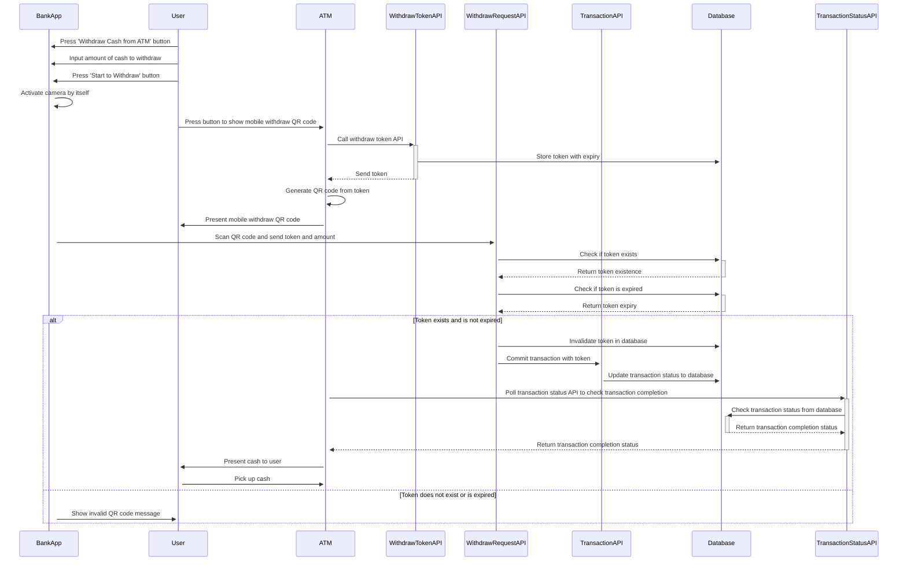

ChatGPTを使用してシーケンス図を生成するには、システムとそのコンポーネント間の相互作用の説明を提供します。説明は、平易な言葉と論理的なイベントの順序を使用して、明確かつ簡潔に記述する必要があります。説明ができたら、[Mermaid](https://mermaid.js.org/)のようなツールを使用して図を作成できます。

以下のChatGPT 3.5 Turboを使用した例では、ユーザーが銀行のモバイルアプリを使用してATMから現金を引き出すプロセスを説明しています。Mermaid構文を使用してシーケンス図を生成するようリクエストしました。最良の結果を得るために、プロンプトを約10回改良しました。

> write mermaid to generate sequence diagram for a journey of a user to withdraw cash from atm by using his bank mobile app.
> user presses "withdraw cash from atm" button from bank app,
> user inputs the amount of cash to withdraw
> user presses "start to withdraw" button from bank app,
> the bank app activates the camera by itself and is ready to scan a QR code
> the user presses a button on the ATM to show the mobile cash withdrawal QR code
> the atm calls withdraw token API to request a mobile withdraw token
> the withdraw token API generates a token with expiry, stores it into database, and then sends the token back to the atm
> the atm generates the QR code from the token, and then presents the QR code on atm screen
> the bank app scans the QR code and sends the token and withdraw amount to withdraw request api
> the withdraw request api checks if the token exists in the database. bank app shows invalid QR code if it does not exist.
> the withdraw request api checks if the token expired. bank app shows invalid QR code if it is expired.
> if the token exists and is not expired, the withdraw request api invalidates the token from database, and then commits the transaction with the token from transaction api. the transaction updates transaction status to database
> the atm polls "transaction status api" to check if the transaction with the token has been completed. "transaction status api" checks status from database and replies status to ATM. once completed, presents cash to user.
> the user picks up cash from atm

ChatGPTは、与えられたプロンプトの自然言語による説明を生成します。これは、プロンプトがモデルにとって明確で理解可能かどうかを確認するのに役立ちます。以下は、ChatGPTによって生成されたスクリプトです。


  sequenceDiagram
    participant BankApp
    participant User
    participant ATM
    participant WithdrawTokenAPI
    participant WithdrawRequestAPI
    participant TransactionAPI
    participant Database
    participant TransactionStatusAPI

    User->>+BankApp: Press 'Withdraw Cash from ATM' button
    User->>+BankApp: Input amount of cash to withdraw
    User->>+BankApp: Press 'Start to Withdraw' button
    BankApp->>+BankApp: Activate camera by itself
    User->>+ATM: Press button to show mobile withdraw QR code
    ATM->>+WithdrawTokenAPI: Call withdraw token API
    WithdrawTokenAPI->>+Database: Store token with expiry
    WithdrawTokenAPI-->>-ATM: Send token
    ATM->>+ATM: Generate QR code from token
    ATM->>+User: Present mobile withdraw QR code
    BankApp->>+WithdrawRequestAPI: Scan QR code and send token and amount
    WithdrawRequestAPI->>+Database: Check if token exists
    Database-->>-WithdrawRequestAPI: Return token existence
    WithdrawRequestAPI->>+Database: Check if token is expired
    Database-->>-WithdrawRequestAPI: Return token expiry
    alt Token exists and is not expired
        WithdrawRequestAPI->>+Database: Invalidate token in database
        WithdrawRequestAPI->>+TransactionAPI: Commit transaction with token
        TransactionAPI->>+Database: Update transaction status to database
        ATM->>+TransactionStatusAPI: Poll transaction status API to check transaction completion
        TransactionStatusAPI->>+Database: Check transaction status from database
        Database-->>-TransactionStatusAPI: Return transaction completion status
        TransactionStatusAPI-->>-ATM: Return transaction completion status
        ATM->>+User: Present cash to user
        User->>+ATM: Pick up cash
    else Token does not exist or is expired
        BankApp->>+User: Show invalid QR code message
    end


> この図では、各参加者は垂直線として表されています。矢印は参加者間のメッセージの流れを示しています。
> ジャーニーは、ユーザーが銀行アプリで「ATMから現金を引き出す」ボタンを押し、引き出す現金の金額を入力することから始まります。次に、ユーザーが「引き出しを開始」ボタンを押すと、銀行アプリのカメラが起動します。
> その後、ユーザーはATMのボタンを押してモバイル引き出しQRコードを表示します。ATMは引き出しトークンAPIを呼び出してモバイル引き出しトークンをリクエストし、トークンはデータベースに保存されてATMに送り返されます。
> ATMはトークンからQRコードを生成し、ATM画面に表示します。銀行アプリはQRコードをスキャンし、トークンと引き出し金額を引き出しリクエストAPIに送信します。
> 引き出しリクエストAPIは、トークンがデータベースに存在するかどうか、および有効期限が切れているかどうかを確認します。トークンが存在し、有効期限が切れていない場合、引き出しリクエストAPIはデータベース内のトークンを無効化し、トランザクションAPIからのトークンでトランザクションをコミットします。トランザクションAPIはトランザクションステータスをデータベースに更新します。
> ATMはトランザクションステータスAPIをポーリングしてトランザクションの完了を確認し、トランザクションステータスAPIはデータベースからトランザクションステータスを確認してATMに返します。トランザクションが完了すると、ATMはユーザーに現金を提示します。
> 最後に、ユーザーはATMから現金を受け取り、引き出しプロセスが完了します。トークンが存在しないか有効期限が切れている場合、銀行アプリはユーザーに無効なQRコードメッセージを表示します。

以下は、結果として得られるシーケンス図です。最良の体験のためには、[mermaid live editor](https://mermaid.live/edit#pako:eNqdVVtv2jAU_iuWX_owqLiUS_JQibXSxEOlrrSaNPFikkOxSOzMdgqs6n_fsZ0E0oRuayQk4pzvO9-5-pVGMgYaUg2_chAR3HL2rFi6FASfjCnDI54xYchXJrazLGt-eNKgmqezx7vm4Q9uNrFiu0e5BTG7n5-3eLBytGm1eVRMaBYZLts5bplhK6bhQ-TCMJNrh_d2Nozu9fWXIs6Q3CvQmlyUisgN0xuyVjK1sV2QVW6MPIediyw3hKUyR69yTSKLNZLsCrKPXaI2Zax56bvurTCvIWcY1AszgJ5SUIysDoQbDcm67gmVl148o_WiN3JHUrniCVQCyfcHYjvDwxFm0e_LF2JOkuSIMfacVDV5b24pytqEZGGkggJiGQjsM64OZ6CI7TrxCxCxR9WkuW_fQGDsmIRCvK9W09hmw6cBsDwfRn6S62ZropqIicobQ2W6kutefQfUYzri6wm52UC0JXxdwGHPtdEeWhq5NLTpeACTK3GKtLP8Kb9c-0pA_DnfxyKyBCfuJBaXEaQX0tRd_IvKuXhhCY9tdQudgsS1QT_PUl8YGLFMU44Ddjz2HXjSKfapw-pynjIv5YRCu41iB6qpq2i8tv2DjShxiFqY8KNli1x9Tr9HMs0SsH9bxVbUbXVu8eOmpKm5Vvh25WXpW7UV9H-RWA32_3G1TnK5ZfPqRmruPo45yDNn6k0g0VC0aSyh7E7sVyJVYxjerQTvfmH3J_f9WS2DFHcsey7SiUuBdigu5pTxGC_bV3u8pGYDKSxpiH9jprZLuhRvaMdyIxcHEdHQqBw6NHe9VlzM5SHEHBfonb-83R3eoXjH_ZSyMsFXGr7SPQ27_dH4MpiMekFvMh4GV-PhtEMPNOyPppfDwWQ6vhoG-BsM3zr0t2MYXAbjXr8_nUx6oyAYjkeDtz_Ia75i)で表示することをお勧めします。

