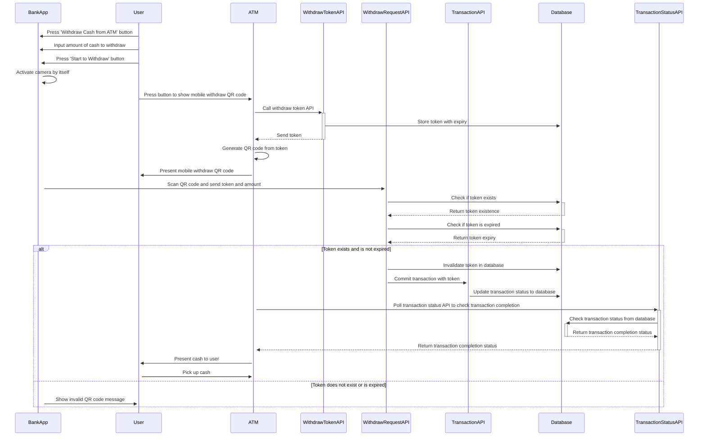

To use ChatGPT to generate a sequence diagram, you can provide a description of the system and the interactions between its components. The description should be written in a clear and concise manner, using plain language and logical ordering of events. Once you have the description, you can use a tool like [Mermaid](https://mermaid.js.org/) to create the diagram.

In the following example using ChatGPT 3.5 Turbo, we have described the process of a user withdrawing cash from an ATM using their bank's mobile app. We have requested that a sequence diagram be generated using Mermaid syntax. We refined the prompt approximately 10 times to ensure the best possible result.

> write mermaid to generate sequence diagram for a journey of a user to withdraw cash from atm by using his bank mobile app.
> user presses "withdraw cash from atm" button from bank app,
> user inputs the amount of cash to withdraw
> user presses "start to withdraw" button from bank app,
> the bank app activates the camera by itself and is ready to scan a QR code
> the user presses a button on the ATM to show the mobile cash withdrawal QR code
> the atm calls withdraw token API to request a mobile withdraw token
> the withdraw token API generates a token with expiry, stores it into database, and then sends the token back to the atm
> the atm generates the QR code from the token, and then presents the QR code on atm screen
> the bank app scans the QR code and sends the token and withdraw amount to withdraw request api
> the withdraw request api checks if the token exists in the database. bank app shows invalid QR code if it does not exist.
> the withdraw request api checks if the token expired. bank app shows invalid QR code if it is expired.
> if the token exists and is not expired, the withdraw request api invalidates the token from database, and then commits the transaction with the token from transaction api. the transaction updates transaction status to database
> the atm polls "transaction status api" to check if the transaction with the token has been completed. "transaction status api" checks status from database and replies status to ATM. once completed, presents cash to user.
> the user picks up cash from atm

ChatGPT generates natural language descriptions of a given prompt, which can be helpful for reviewing whether the prompt is clear and understandable to the model. Below is the script generated by ChatGPT. 


  sequenceDiagram
    participant BankApp
    participant User
    participant ATM
    participant WithdrawTokenAPI
    participant WithdrawRequestAPI
    participant TransactionAPI
    participant Database
    participant TransactionStatusAPI

    User->>+BankApp: Press 'Withdraw Cash from ATM' button
    User->>+BankApp: Input amount of cash to withdraw
    User->>+BankApp: Press 'Start to Withdraw' button
    BankApp->>+BankApp: Activate camera by itself
    User->>+ATM: Press button to show mobile withdraw QR code
    ATM->>+WithdrawTokenAPI: Call withdraw token API
    WithdrawTokenAPI->>+Database: Store token with expiry
    WithdrawTokenAPI-->>-ATM: Send token
    ATM->>+ATM: Generate QR code from token
    ATM->>+User: Present mobile withdraw QR code
    BankApp->>+WithdrawRequestAPI: Scan QR code and send token and amount
    WithdrawRequestAPI->>+Database: Check if token exists
    Database-->>-WithdrawRequestAPI: Return token existence
    WithdrawRequestAPI->>+Database: Check if token is expired
    Database-->>-WithdrawRequestAPI: Return token expiry
    alt Token exists and is not expired
        WithdrawRequestAPI->>+Database: Invalidate token in database
        WithdrawRequestAPI->>+TransactionAPI: Commit transaction with token
        TransactionAPI->>+Database: Update transaction status to database
        ATM->>+TransactionStatusAPI: Poll transaction status API to check transaction completion
        TransactionStatusAPI->>+Database: Check transaction status from database
        Database-->>-TransactionStatusAPI: Return transaction completion status
        TransactionStatusAPI-->>-ATM: Return transaction completion status
        ATM->>+User: Present cash to user
        User->>+ATM: Pick up cash
    else Token does not exist or is expired
        BankApp->>+User: Show invalid QR code message
    end


> In this diagram, each participant is represented as a vertical line. The arrows indicate the flow of messages between the participants.
> The journey starts with the user pressing the 'Withdraw Cash from ATM' button in the bank app and inputting the amount of cash to withdraw. The user then presses the 'Start to Withdraw' button, which activates the camera in the bank app.
> The user then presses a button on the ATM to show the mobile withdraw QR code. The ATM calls the Withdraw Token API to request a mobile withdraw token, which is stored in the database and sent back to the ATM.
> The ATM generates a QR code from the token and presents it on the ATM screen. The bank app scans the QR code and sends the token and withdraw amount to the Withdraw Request API.
> The Withdraw Request API checks if the token exists in the database and if it is expired. If the token exists and is not expired, the Withdraw Request API invalidates the token in the database and commits the transaction with the token from the Transaction API. The Transaction API updates the transaction status to the database.
> The ATM polls the Transaction Status API to check for transaction completion, and the Transaction Status API checks the transaction status from the database and returns it to the ATM. Once the transaction is completed, the ATM presents the cash to the user.
> Finally, the user picks up the cash from the ATM, completing the withdrawal process. If the token does not exist or is expired, the bank app shows an invalid QR code message to the user.

Below is the resulting sequence diagram. For the best experience, you should view it in [mermaid live editor](https://mermaid.live/edit#pako:eNqdVVtv2jAU_iuWX_owqLiUS_JQibXSxEOlrrSaNPFikkOxSOzMdgqs6n_fsZ0E0oRuayQk4pzvO9-5-pVGMgYaUg2_chAR3HL2rFi6FASfjCnDI54xYchXJrazLGt-eNKgmqezx7vm4Q9uNrFiu0e5BTG7n5-3eLBytGm1eVRMaBYZLts5bplhK6bhQ-TCMJNrh_d2Nozu9fWXIs6Q3CvQmlyUisgN0xuyVjK1sV2QVW6MPIediyw3hKUyR69yTSKLNZLsCrKPXaI2Zax56bvurTCvIWcY1AszgJ5SUIysDoQbDcm67gmVl148o_WiN3JHUrniCVQCyfcHYjvDwxFm0e_LF2JOkuSIMfacVDV5b24pytqEZGGkggJiGQjsM64OZ6CI7TrxCxCxR9WkuW_fQGDsmIRCvK9W09hmw6cBsDwfRn6S62ZropqIicobQ2W6kudefQfUYzri6wm52UC0JXxdwGHPtdEeWhq5NLTpeACTK3GKtLP8Kb9c-0pA_DnfxyKyBCfuJBaXEaQX0tRd_IvKuXhhCY9tdQudgsS1QT_PUl8YGLFMU44Ddjz2HXjSKfapw-pynjIv5YRCu41iB6qpq2i8tv2DjShxiFqY8KNli1x9Tr9HMs0SsH9bxVbUbXVu8eOmpKm5Vvh25WXpW7UV9H-RWA32_3G1TnK5ZfPqRmruPo45yDNn6k0g0VC0aSyh7E7sVyJVYxjerQTvfmH3J_f9WS2DFHcsey7SiUuBdigu5pTxGC_bV3u8pGYDKSxpiH9jprZLuhRvaMdyIxcHEdHQqBw6NHe9VlzM5SHEHBfonb-83R3eoXjH_ZSyMsFXGr7SPQ27_dH4MpiMekFvMh4GV-PhtEMPNOyPppfDwWQ6vhoG-BsM3zr0t2MYXAbjXr8_nUx6oyAYjkeDtz_Ia75i).

