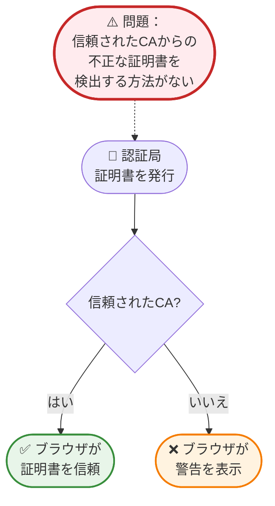
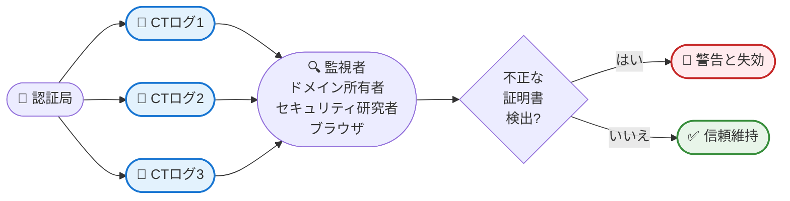
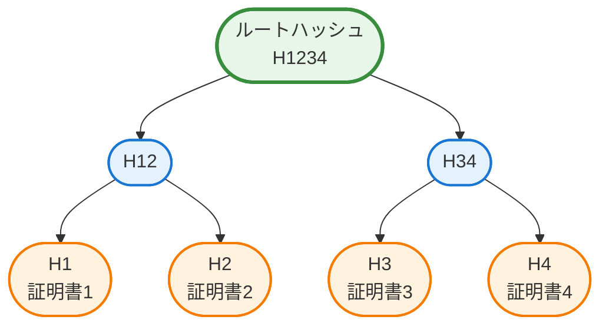
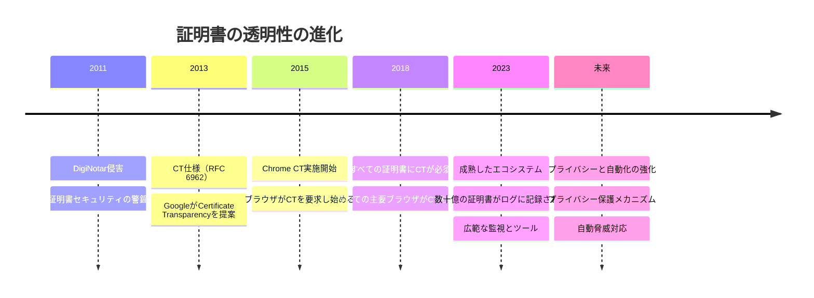

HTTPSとブラウザのあの小さな南京錠アイコンについて初めて学んだときのことを覚えていますか？接続が暗号化され安全であることを知って安心したことでしょう。しかし、セキュリティ専門家を夜も眠れなくさせるかもしれない質問があります：そのHTTPS証明書が正規のものであることをどうやって知るのでしょうか？誰かがあなたの銀行のウェブサイトの偽の証明書を密かに発行したらどうなるでしょうか？

それこそが、証明書の透明性（CT）が解決するために設計された問題です。

2011年、オランダの認証局DigiNotarでの大規模なセキュリティ侵害により、Google、Yahoo、さらには情報機関などの著名なドメインに対して不正な証明書が発行されました。これらの偽の証明書により、攻撃者は正規のウェブサイトになりすまし、ユーザーが安全だと信じていた暗号化通信を傍受することができました。この事件は警鐘となりました：証明書システムには透明性が必要だったのです。

証明書の透明性は単なる別のセキュリティプロトコルではありません - 証明書の発行を公開台帳のように扱う革新的なアプローチです。すべての認証局によって発行されたすべての証明書は、誰でも監視できる公開監査可能な追記専用のログに記録されます。HTTPS証明書のブロックチェーンのようなものと考えてください。ただし、透明性と説明責任のために特別に設計されています。

!!!tip "💡 証明書の透明性とは？"
    証明書の透明性（CT）は、認証局によって発行されたすべてのSSL/TLS証明書の公開検証可能なログを作成するフレームワークです。これらのログは追記専用（証明書は追加できますが、削除や変更はできません）であり、暗号的に保護されているため、認証局が検出されずに不正な証明書を発行することはほぼ不可能です。

## 問題：検証なき信頼

証明書の透明性以前は、証明書システムは盲目的な信頼に基づいて運用されていました。HTTPSを使用してウェブサイトにアクセスすると、ブラウザは証明書が信頼された認証局（CA）によって署名されているかどうかを確認しました。はいの場合、緑色の南京錠が表示されます。いいえの場合、恐ろしい警告が表示されます。

このシステムには重大な欠陥がありました：認証局が完璧で信頼できると仮定していたのです。しかし、認証局は人間によって運営され、バグのあるソフトウェアを使用し、攻撃者によって侵害される可能性があります。CAが侵害されたり間違いを犯したりしたとき、攻撃で実際に使用されるまで不正な証明書を検出する体系的な方法はありませんでした。

その結果は深刻でした：
- **DigiNotar侵害（2011年）**：300以上のドメインに対する不正な証明書、CAの破産につながる
- **Comodo侵害（2011年）**：主要なウェブサービスに対する偽の証明書が発行される
- **TURKTRUST事件（2013年）**：顧客に中間CA証明書を誤って発行

各事件は証明書エコシステム全体への信頼を損ないました。業界は認証局を信頼するだけに頼らない解決策を必要としていました。

## 解決策：公開された追記専用ログ

証明書の透明性は、シンプルだが強力な概念を導入します：すべての証明書を公開することです。認証局が証明書を発行するとき、複数の独立したCTログに提出する必要があります。これらのログは：

**追記専用**：証明書は追加のみ可能で、変更や削除はできません。これにより、発行されたすべての証明書の不変の履歴が作成されます。

**公開監査可能**：誰でもログをクエリして、どのドメインに対してどの証明書が発行されたかを確認できます。ドメイン所有者は不正な証明書を監視できます。

**暗号的に検証可能**：ログはマークル木構造を使用して整合性を確保します。ログへの改ざんは即座に検出可能です。

**独立して運営**：複数の組織がCTログを運営し、単一障害点や制御を防ぎます。

この透明性により、証明書エコシステムは「信頼するが検証しない」から「信頼し常に検証する」に変わります。

## 証明書の透明性の仕組み

CTシステムには、透明性を作り出すために協力するいくつかの主要なプレーヤーが関与しています：

### 認証局（CA）

CAが証明書を発行するとき、証明書（または事前証明書）を複数のCTログに提出します。ログは署名付き証明書タイムスタンプ（SCT）を返します。これは証明書がログに記録されたことの暗号的証明です。

### CTログ

独立した組織がCTログを運営し、証明書の提出を受け入れ、追記専用ログに追加し、SCTを返します。主要なCTログオペレーターには、Google、Cloudflare、DigiCertなどがあります。ログはマークル木構造を使用して構築されており、ログ全体をダウンロードすることなく、証明書がログに含まれていることを効率的に検証できます。

### ブラウザとクライアント

最新のブラウザは、証明書を信頼する前に有効なSCTを要求します。Chrome、Safari、その他のブラウザはCTポリシーを実施し、ログに記録されていない証明書を信頼することを拒否します。これにより、CAがCTに参加する強力なインセンティブが生まれます。

### 監視者

ドメイン所有者、セキュリティ研究者、自動化システムは、関心のあるドメインに対して発行された証明書をCTログで継続的に監視します。予期しない証明書が表示されたとき、調査し、不正な場合は対処できます。

### 監査人

監査人は、CTログが正しく動作していることを検証します - 真に追記専用であること、暗号的証明が有効であること、ログが不正な動作をしていないことを確認します。これによりシステム全体の整合性が保証されます。

!!!example "🎬 実際のシナリオ"
    あなたは`neo01.com`を所有し、CT監視を使用しています：
    
    1. **通常の動作**：あなたのCAが`neo01.com`の証明書を発行し、CTにログを記録します
    2. **通知を受け取る**：監視サービスが新しい証明書について警告します
    3. **検証する**：これが正規の証明書更新であることを確認します
    
    **攻撃シナリオ**：
    1. **攻撃者がCAを侵害**：CAを騙すかハッキングして`neo01.com`の証明書を発行させます
    2. **証明書がログに記録される**：CAはCTログに提出します（ブラウザによって要求されます）
    3. **警告を受け取る**：監視サービスが不正な証明書を検出します
    4. **対処する**：不正な証明書を報告し、失効させ、侵害を調査します
    
    CTがなければ、攻撃で使用されるまで不正な証明書について知ることはないかもしれません。

## 技術的基盤：マークル木

証明書の透明性の中心には、エレガントなデータ構造であるマークル木があります。この暗号構造により、CTログは効率的かつ改ざん防止になります。

マークル木は証明書を二分木で整理します：
- 各リーフノードには証明書のハッシュが含まれます
- 各親ノードには2つの子のハッシュが含まれます
- ルートハッシュはログ全体の状態を表します

この構造は強力な特性を提供します：

**効率的な検証**：証明書がログに含まれていることを証明するには、証明書からルートまでのハッシュの小さな「監査パス」を提供するだけで済みます - ログ全体は必要ありません。100万の証明書を持つログの場合、包含を証明するには約20のハッシュのみが必要です。

**改ざん検出**：ログ内の証明書への変更はルートハッシュを変更します。ルートハッシュは公開され監視されているため、改ざんは即座に検出可能です。

**追記専用証明**：マークル木構造により、ログが成長しただけ（新しい証明書が追加された）で、古いエントリを変更または削除していないことを証明できます。これは「一貫性証明」と呼ばれます。

!!!anote "🔐 暗号的保証"
    マークル木構造は数学的確実性を提供します：
    - 証明書2がログに含まれていることを証明するには、H1、H34を提供します
    - 検証者は計算します：H2（証明書2のハッシュ）、次にH12 = hash(H1 + H2)、次にルート = hash(H12 + H34)
    - 計算されたルートが公開されたルートと一致すれば、証明書2は確実にログに含まれています
    - これには4つの証明書すべてをダウンロードする代わりに2つのハッシュのみが必要です

## 証明書の透明性の利点

CTの実装は、ウェブ全体で具体的なセキュリティ改善をもたらしました：

**誤発行された証明書の早期検出**：ドメイン所有者は、数か月または永遠にではなく、数時間または数日以内に不正な証明書を検出できます。これにより、攻撃者の機会の窓が劇的に減少します。

**認証局の説明責任**：CAは自分たちの行動が公開され監査可能であることを知っています。これにより、適切なセキュリティ慣行と慎重な検証に対する強力なインセンティブが生まれます。

**CA侵害の影響軽減**：CAが侵害されたとき、CTログは発行されたすべての不正な証明書の完全な記録を提供し、迅速な対応と失効を可能にします。

**研究と分析**：セキュリティ研究者はCTログを分析して傾向を特定し、設定ミスを発見し、業界全体で証明書の慣行を改善できます。

**コンプライアンスと監査**：組織は証明書ポリシーに従っていることを証明し、ドメイン内のシャドーITや不正な証明書発行を迅速に特定できます。

!!!success "✨ 実際の影響"
    CTが必須になって以来：
    - **Symantec事件（2017年）**：CTログにより、Symantecが適切な検証なしに30,000以上の証明書を発行していたことが明らかになり、ブラウザの信頼ストアから削除されました
    - **より迅速な検出**：誤発行された証明書を検出する平均時間が数か月から数時間に短縮されました
    - **説明責任の向上**：CAは自分たちの行動が透明であることを知り、セキュリティにより多く投資します
    - **詐欺の減少**：検出のリスクにより、不正な証明書発行は攻撃者にとってはるかに魅力的でなくなります

## 証明書の透明性ログの監視

CTの最も強力な機能の1つは、誰でもログを監視できることです。いくつかのツールとサービスがこれをアクセス可能にしています：

**crt.sh**：CTログを検索するための無料のWebインターフェース。ドメイン名を入力するだけで、そのドメインに対して発行されたすべての証明書を確認できます。これは、不正な証明書をチェックするドメイン所有者にとって非常に貴重です。

**Facebook CT監視**：Facebookは、あなたのドメインのCTログを監視し、新しい証明書が発行されたときに警告を送信する無料サービスを提供しています。

**Google CT検索**：GoogleはCTログを検索および分析するためのツールを提供しており、セキュリティ研究や調査に役立ちます。

**Certstream**：CTログに追加される証明書のリアルタイムストリーム。セキュリティ研究者はこれを使用して、フィッシングドメイン、タイポスクワッティング、その他の悪意のある活動を検出します。

**商用サービス**：Censys、Shodan、さまざまなセキュリティベンダーなどの企業は、警告、分析、セキュリティ運用との統合を備えた高度なCT監視を提供しています。

!!!tip "🔍 自分で試してみる"
    [crt.sh](https://crt.sh)にアクセスして、所有しているドメインまたは人気のあるウェブサイトを検索してください：
    
    1. ドメインを入力します（例：`google.com`）
    2. そのドメインに対して発行されたすべての証明書を確認します
    3. タイムスタンプ、認証局、有効期間に注目してください
    4. 予期しない証明書や疑わしい証明書を探します
    
    この透明性は誰でも利用できます - 特別なアクセスは必要ありません。

## 課題と制限

証明書の透明性は非常に成功していますが、課題がないわけではありません：

**プライバシーの懸念**：発行されたすべての証明書が公開されます。これは、使用しているドメインとサブドメインを誰でも確認できることを意味し、発表する準備ができていない内部インフラストラクチャや今後のプロジェクトが明らかになる可能性があります。

**ログのスケーラビリティ**：ウェブが成長し、証明書の有効期間が短くなる（年から月へ）につれて、CTログは増加する量を処理する必要があります。数十億の証明書をログに記録し、保存し、クエリ可能にする必要があります。

**監視のオーバーヘッド**：数千のドメインを持つドメイン所有者は、すべての証明書を追跡するために高度な監視システムが必要です。小規模な組織は効果的な監視のためのリソースが不足している可能性があります。

**誤検出**：正規の証明書更新、テスト証明書、CDN証明書が警告をトリガーする可能性があり、監視システムの慎重な調整が必要です。

**不完全なカバレッジ**：主要なブラウザはCTを実施していますが、一部のクライアントとアプリケーションは実施していません。これにより、不正な証明書がまだ使用される可能性のあるギャップが生じます。

**ログオペレーターの信頼**：CTはCAへの信頼を減らしますが、一部の信頼をログオペレーターに移します。不正な動作をするログは証明書のログを拒否したり、誤った証明を提供したりする可能性がありますが、複数ログ要件と監査がこのリスクを軽減します。

!!!warning "⚠️ プライバシーの考慮事項"
    機密性の高いサブドメインの証明書をリクエストする前に：
    - 公開CTログに表示されることを覚えておいてください
    - 内部サブドメインにはワイルドカード証明書の使用を検討してください
    - CTログがインフラストラクチャトポロジーを明らかにすることに注意してください
    - 透明性を念頭に置いてドメイン命名戦略を計画してください

## 証明書の透明性の未来

証明書の透明性は進化を続けており、いくつかの開発が進行中です：

**より短い証明書の有効期間**：業界は、より短い証明書の有効期間（2年から1年、潜在的に90日へ）に向かっています。これにより、侵害された証明書の影響が軽減されますが、ログに記録する必要がある証明書の量が増加します。

**プライバシーの改善**：プライバシーを保護するCTメカニズムの研究は、機密性の高いドメイン情報を明らかにすることなく透明性を提供することを目指しています。編集や遅延公開などの技術が検討されています。

**範囲の拡大**：CTモデルは、HTTPS証明書を超えて、コード署名証明書、電子メール証明書、さらにはソフトウェアサプライチェーンの透明性を含む他の信頼システムに適応されています。

**より良い統合**：CTログ、認証局、監視システム間のより緊密な統合により、誤発行された証明書のより迅速な検出と対応が可能になります。

**自動応答**：将来のシステムは、CTログで検出された疑わしい証明書を自動的に失効させ、攻撃の時間枠を数時間から数分に短縮する可能性があります。

**分散化**：ブロックチェーンベースのアプローチにより、CTログをさらに分散化し、特定のログオペレーターへの依存を減らし、回復力を高めることができます。

## 証明書の透明性を始める

ドメイン所有者、セキュリティ専門家、または好奇心旺盛な開発者であっても、CTの使用を開始する方法は次のとおりです：

### ドメイン所有者向け

**ステップ1：現在の証明書を理解する**
- crt.shにアクセスして、ドメインを検索します
- ドメインに対して発行されたすべての証明書を確認します
- 予期しない証明書や不正な証明書を特定します

**ステップ2：監視を設定する**
- Facebook CT監視やcrt.shアラートなどの無料サービスを使用します
- ドメインの新しい証明書の通知を設定します
- 警告を調査するプロセスを確立します

**ステップ3：対応手順を確立する**
- 証明書アラートを調査する担当者を定義します
- 正規の証明書を検証するプロセスを作成します
- 不正な証明書を報告および失効させる手順を文書化します

### セキュリティ研究者向け

**ステップ1：CTログを探索する**
- crt.shを使用して興味深いパターンを検索します
- リアルタイム証明書監視にCertstreamを試します
- 証明書発行の傾向と異常を分析します

**ステップ2：監視ツールを構築する**
- CTログAPIを使用してカスタム監視を構築します
- 特定のパターン（タイポスクワッティング、フィッシングドメイン）のアラートを作成します
- オープンソースCTツールに貢献します

**ステップ3：エコシステムに貢献する**
- 疑わしい証明書をドメイン所有者に報告します
- セキュリティコミュニティと調査結果を共有します
- CTツールとドキュメントの改善を支援します

### 開発者向け

**ステップ1：CT要件を理解する**
- ブラウザがCTポリシーをどのように実施するかを学びます
- 証明書のSCT要件を理解します
- 証明書発行プロセスを確認します

**ステップ2：CT検証を実装する**
- アプリケーションでSCTを検証します
- CTログAPIを使用して証明書のステータスを確認します
- 組織のドメインの監視を実装します

**ステップ3：情報を入手し続ける**
- ブラウザからのCTポリシーの変更をフォローします
- CTログオペレーターの発表を監視します
- CTコミュニティのディスカッションに参加します

!!!example "🎯 クイックスタート演習"
    CTを理解するために、この実践的な演習を試してください：
    
    1. [crt.sh](https://crt.sh)にアクセスします
    2. `facebook.com`を検索します
    3. 発行された数千の証明書に注目してください
    4. 最近の証明書をクリックして詳細を確認します
    5. どのCTログがそれを記録したかを示すSCT情報を観察します
    6. 次に、自分のドメインを検索します（持っている場合）
    7. すべての証明書が正規であることを確認します
    
    この5分間の演習は、ウェブ全体を保護する透明性を示しています。

## 結論：セキュリティの基盤としての透明性

証明書の透明性は、インターネット上の信頼へのアプローチにおける根本的な変化を表しています。認証局を盲目的に信頼する代わりに、透明性、暗号化、公的説明責任を通じて信頼が検証されるシステムを持っています。

CTの成功は強力な原則を示しています：透明性はシステムをより安全にします。行動が公開され監査可能であるとき、悪意のある行為者は検出と結果に直面します。この原則は、証明書を超えて、ソフトウェアサプライチェーン、コード署名、その他の信頼システムにまで拡張されます。

ドメイン所有者にとって、CTは安心を提供します - 誰かがあなたのウェブサイトになりすまそうとしたら知ることができます。セキュリティ研究者にとって、それは脅威を検出し傾向を分析するための貴重なツールです。より広いインターネットコミュニティにとって、それはHTTPSをより信頼性が高く安全にする信頼の基盤です。

ブラウザの小さな南京錠アイコンは、暗号化以上のものを表しています - それは、不正な証明書が影に隠れることができない透明で監査可能なシステムを表しています。それが証明書の透明性の力です。

!!!quote "💭 最後の考え"
    「日光は最良の消毒剤と言われています。」 - ルイス・ブランダイス
    
    証明書の透明性は証明書エコシステムに日光をもたらし、公的説明責任というシンプルだが強力な原則を通じて、すべての人にとってウェブをより安全にします。

## 追加リソース

**公式仕様：**
- [RFC 6962: Certificate Transparency](https://tools.ietf.org/html/rfc6962)
- [RFC 9162: Certificate Transparency Version 2.0](https://tools.ietf.org/html/rfc9162)

**ツールとサービス：**
- [crt.sh](https://crt.sh) - CTログを検索
- [Facebook CT監視](https://developers.facebook.com/tools/ct/) - 無料監視サービス
- [Certstream](https://certstream.calidog.io/) - リアルタイム証明書ストリーム

**学習リソース：**
- [Certificate Transparency: The Foundation of Trust](https://certificate.transparency.dev/)
- [GoogleのCTポリシー](https://github.com/chromium/ct-policy)
- [CTログリスト](https://www.gstatic.com/ct/log_list/v3/all_logs_list.json)
