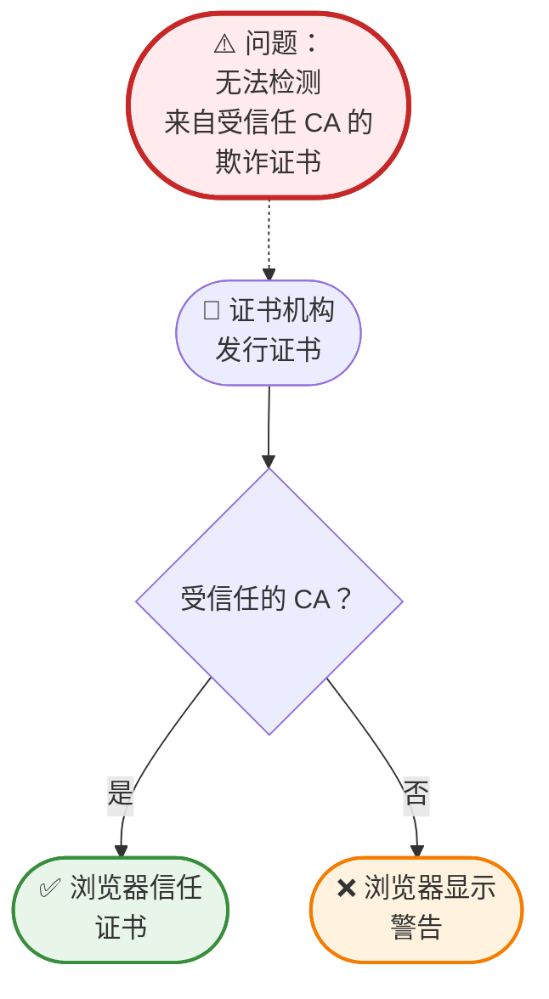
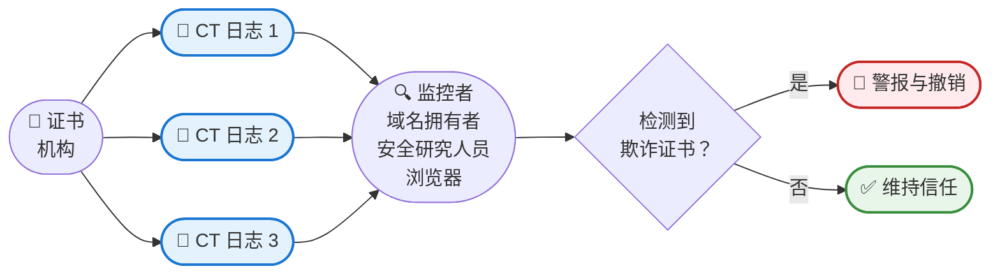
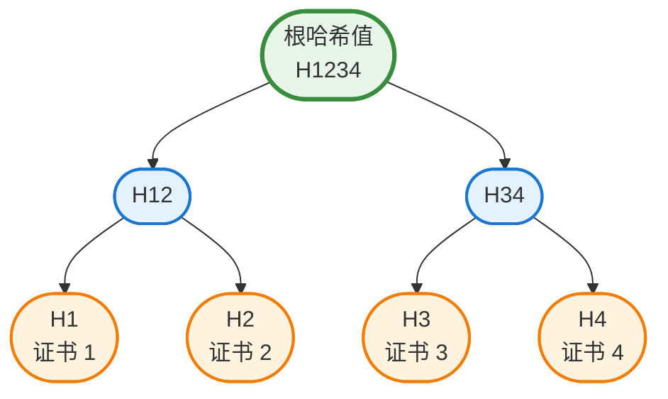
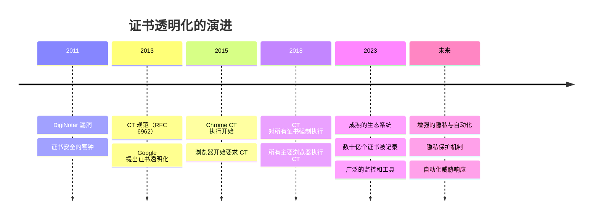

还记得你第一次了解 HTTPS 和浏览器中那个小锁头图标吗？你可能感到安心，知道你的连接是加密且安全的。但这里有个可能让安全专业人员夜不成眠的问题：你如何知道那个 HTTPS 证书是合法的？如果有人秘密地为你的银行网站发行了假证书呢？

这正是证书透明化（Certificate Transparency, CT）所要解决的问题。

2011 年，荷兰证书机构 DigiNotar 发生重大安全漏洞，导致为 Google、Yahoo 甚至情报机构等知名域名发行了欺诈证书。这些假证书让攻击者能够冒充合法网站，拦截用户认为安全的加密通信。这起事件敲响了警钟：证书系统需要透明化。

证书透明化不只是另一个安全协议——它是一种革命性的方法，将证书发行视为公开账本。任何证书机构发行的每个证书都会被记录在任何人都可以监控的公开可审计、仅可附加的日志中。可以把它想象成 HTTPS 证书的区块链，但专门为透明化和问责制而设计。

!!!tip "💡 什么是证书透明化？"
    证书透明化（CT）是一个框架，为证书机构发行的所有 SSL/TLS 证书建立公开、可验证的日志。这些日志是仅可附加的（证书可以被添加但永远不能被移除或修改），并且经过密码学保护，使得证书机构几乎不可能在不被检测的情况下发行欺诈证书。

## 问题：没有验证的信任

在证书透明化之前，证书系统是基于盲目信任运作的。当你使用 HTTPS 访问网站时，你的浏览器会检查证书是否由受信任的证书机构（CA）签署。如果是，你会看到绿色锁头。如果不是，你会看到可怕的警告。

这个系统有一个关键缺陷：它假设证书机构是无懈可击且值得信赖的。但证书机构是由人类经营的，使用有错误的软件，并且可能被攻击者入侵。当 CA 被入侵或犯错时，没有系统性的方法可以检测欺诈证书，直到它们被主动用于攻击。

后果是严重的：
- **DigiNotar 漏洞（2011）**：为 300 多个域名发行欺诈证书，导致该 CA 破产
- **Comodo 漏洞（2011）**：为主要网络服务发行假证书
- **TURKTRUST 事件（2013）**：意外地向客户发行中继 CA 证书

每起事件都侵蚀了对整个证书生态系统的信任。业界需要一个不仅仅依赖信任证书机构的解决方案。

## 解决方案：公开、仅可附加的日志

证书透明化引入了一个简单但强大的概念：让每个证书都公开。当证书机构发行证书时，它必须将其提交到多个独立的 CT 日志。这些日志具有以下特性：

**仅可附加**：证书只能被添加，永远不能被修改或删除。这创造了所有已发行证书的不可变历史记录。

**公开可审计**：任何人都可以查询日志，查看为任何域名发行了哪些证书。域名拥有者可以监控未经授权的证书。

**密码学可验证**：日志使用 Merkle 树结构来确保完整性。任何对日志的篡改都会立即被检测到。

**独立运作**：多个组织运作 CT 日志，防止任何单点故障或控制。

这种透明化将证书生态系统从"信任但不验证"转变为"信任并始终验证"。

## 证书透明化如何运作

CT 系统涉及几个关键参与者共同创造透明化：

### 证书机构（CAs）

当 CA 发行证书时，它会将证书（或预证书）提交到多个 CT 日志。日志会返回签署证书时间戳（SCT），这是证书已被记录的密码学证明。

### CT 日志

独立组织运作 CT 日志，接受证书提交，将它们添加到仅可附加的日志中，并返回 SCT。主要的 CT 日志运营商包括 Google、Cloudflare、DigiCert 等。日志使用 Merkle 树结构构建，允许有效验证证书是否包含在日志中，而无需下载整个日志。

### 浏览器和客户端

现代浏览器要求证书在信任之前必须具有有效的 SCT。Chrome、Safari 和其他浏览器执行 CT 政策，拒绝信任未被记录的证书。这为 CA 参与 CT 创造了强大的激励。

### 监控者

域名拥有者、安全研究人员和自动化系统持续监控 CT 日志，查看为他们关心的域名发行的证书。当出现意外证书时，他们可以调查并在欺诈时采取行动。

### 审计者

审计者验证 CT 日志是否正确运作——它们是否真的仅可附加、密码学证明是否有效，以及日志是否没有不当行为。这确保了整个系统的完整性。

!!!example "🎬 真实世界情境"
    你拥有 `neo01.com` 并使用 CT 监控：
    
    1. **正常运作**：你的 CA 为 `neo01.com` 发行证书并记录到 CT
    2. **你收到通知**：你的监控服务提醒你有新证书
    3. **你验证**：你确认这是你的合法证书更新
    
    **攻击情境**：
    1. **攻击者入侵 CA**：他们欺骗或黑入 CA 为 `neo01.com` 发行证书
    2. **证书被记录**：CA 将其提交到 CT 日志（浏览器要求）
    3. **你收到警报**：你的监控服务检测到未经授权的证书
    4. **你采取行动**：你报告欺诈证书，将其撤销，并调查漏洞
    
    没有 CT，你可能永远不会知道欺诈证书，直到它被用于攻击。

## 技术基础：Merkle 树

证书透明化的核心是一个优雅的数据结构：Merkle 树。这种密码学结构使 CT 日志既高效又防篡改。

Merkle 树以二叉树组织证书，其中：
- 每个叶节点包含证书的哈希值
- 每个父节点包含其两个子节点的哈希值
- 根哈希值代表整个日志的状态

这种结构提供了强大的特性：

**高效验证**：要证明证书在日志中，你只需要提供从证书到根的小型"审计路径"哈希值——而不是整个日志。对于拥有一百万个证书的日志，你只需要大约 20 个哈希值来证明包含性。

**篡改检测**：对日志中任何证书的任何更改都会改变根哈希值。由于根哈希值是公开已知且被监控的，篡改会立即被检测到。

**仅可附加证明**：Merkle 树结构允许证明日志只增长（添加证书）而没有修改或移除旧条目。这称为"一致性证明"。

!!!anote "🔐 密码学保证"
    Merkle 树结构提供数学确定性：
    - 要证明证书 2 在日志中，提供：H1、H34
    - 验证者计算：H2（证书 2 的哈希值），然后 H12 = hash(H1 + H2)，然后根 = hash(H12 + H34)
    - 如果计算的根与公布的根匹配，证书 2 肯定在日志中
    - 这只需要 2 个哈希值，而不是下载所有 4 个证书

## 证书透明化的好处

CT 的实施在整个网络上提供了实质的安全改进：

**早期检测误发证书**：域名拥有者可以在数小时或数天内检测到未经授权的证书，而不是数月或永远不会。这大幅减少了攻击者的机会窗口。

**证书机构的问责制**：CA 知道他们的行为是公开可见且可审计的。这为适当的安全实践和仔细验证创造了强大的激励。

**减少 CA 入侵的影响**：当 CA 被入侵时，CT 日志提供所有发行的欺诈证书的完整记录，实现快速响应和撤销。

**研究与分析**：安全研究人员可以分析 CT 日志以识别趋势、发现错误配置，并改进整个业界的证书实践。

**合规与审计**：组织可以证明他们遵循证书政策，并快速识别其域名内的影子 IT 或未经授权的证书发行。

!!!success "✨ 实际影响"
    自 CT 成为强制性以来：
    - **Symantec 事件（2017）**：CT 日志揭露 Symantec 在没有适当验证的情况下发行了 30,000 多个证书，导致他们从浏览器信任存储中被移除
    - **更快的检测**：检测误发证书的平均时间从数月降至数小时
    - **增加的问责制**：CA 投资更多安全，因为他们知道自己的行为是透明的
    - **减少欺诈**：检测风险使欺诈证书发行对攻击者的吸引力大大降低

## 监控证书透明化日志

CT 最强大的功能之一是任何人都可以监控日志。几个工具和服务使这变得容易：

**crt.sh**：用于搜索 CT 日志的免费网页界面。只需输入域名即可查看为其发行的所有证书。这对于检查未经授权证书的域名拥有者来说非常宝贵。

**Facebook CT 监控**：Facebook 提供免费服务，监控你域名的 CT 日志，并在发行新证书时发送警报。

**Google CT 搜索**：Google 提供搜索和分析 CT 日志的工具，对安全研究和调查很有用。

**Certstream**：证书添加到 CT 日志时的实时流。安全研究人员使用它来检测网络钓鱼域名、域名抢注和其他恶意活动。

**商业服务**：Censys、Shodan 和各种安全供应商等公司提供高级 CT 监控，包括警报、分析和与安全运营的集成。

!!!tip "🔍 亲自试试"
    访问 [crt.sh](https://crt.sh) 并搜索你拥有的域名或热门网站：
    
    1. 输入域名（例如 `google.com`）
    2. 查看为该域名发行的所有证书
    3. 注意时间戳、证书机构和有效期
    4. 寻找任何意外或可疑的证书
    
    这种透明化对每个人都可用——不需要特殊访问权限。

## 挑战与限制

虽然证书透明化非常成功，但并非没有挑战：

**隐私问题**：每个发行的证书都成为公开知识。这意味着任何人都可以看到你正在使用哪些域名和子域名，可能在你准备好宣布之前就揭露内部基础设施或即将推出的项目。

**日志可扩展性**：随着网络增长和证书生命周期缩短（从数年到数月），CT 日志必须处理不断增加的数量。数十亿个证书需要被记录、存储和可查询。

**监控开销**：拥有数千个域名的域名拥有者需要复杂的监控系统来追踪所有证书。小型组织可能缺乏有效监控的资源。

**误报**：合法的证书更新、测试证书和 CDN 证书可能触发警报，需要仔细调整监控系统。

**不完整的覆盖范围**：虽然主要浏览器执行 CT，但某些客户端和应用程序不执行。这创造了欺诈证书仍可能被使用的缺口。

**日志运营商信任**：虽然 CT 减少了对 CA 的信任，但它将一些信任转移到日志运营商。行为不当的日志可能拒绝记录证书或提供虚假证明，尽管多日志要求和审计减轻了这种风险。

!!!warning "⚠️ 隐私考量"
    在为敏感子域名请求证书之前：
    - 记住它会出现在公开 CT 日志中
    - 考虑为内部子域名使用通配符证书
    - 注意 CT 日志会揭露你的基础设施拓扑
    - 在规划域名命名策略时考虑透明化

## 证书透明化的未来

证书透明化持续演进，有几个发展即将到来：

**更短的证书生命周期**：业界正朝着更短的证书有效期（从 2 年到 1 年到可能的 90 天）发展。这减少了被入侵证书的影响，但增加了必须记录的证书数量。

**改进的隐私**：对隐私保护 CT 机制的研究旨在提供透明化而不揭露敏感域名信息。正在探索编辑和延迟发布等技术。

**扩大范围**：CT 模型正被改编用于 HTTPS 证书以外的其他信任系统，包括代码签名证书、电子邮件证书，甚至软件供应链透明化。

**更好的集成**：CT 日志、证书机构和监控系统之间更紧密的集成将实现更快的误发证书检测和响应。

**自动化响应**：未来的系统可能会自动撤销在 CT 日志中检测到的可疑证书，将攻击的时间窗口从数小时减少到数分钟。

**去中心化**：基于区块链的方法可以进一步去中心化 CT 日志，减少对特定日志运营商的依赖并增加韧性。

## 开始使用证书透明化

无论你是域名拥有者、安全专业人员还是好奇的开发者，以下是开始使用 CT 的方法：

### 对域名拥有者

**步骤 1：了解你目前的证书**
- 访问 crt.sh 并搜索你的域名
- 查看为你的域名发行的所有证书
- 识别任何意外或未经授权的证书

**步骤 2：设置监控**
- 使用 Facebook CT 监控或 crt.sh 警报等免费服务
- 为你的域名上的新证书配置通知
- 建立调查警报的流程

**步骤 3：建立响应程序**
- 定义谁调查证书警报
- 建立验证合法证书的流程
- 记录报告和撤销欺诈证书的步骤

### 对安全研究人员

**步骤 1：探索 CT 日志**
- 使用 crt.sh 搜索有趣的模式
- 尝试 Certstream 进行实时证书监控
- 分析证书发行趋势和异常

**步骤 2：构建监控工具**
- 使用 CT 日志 API 构建自定义监控
- 为特定模式（域名抢注、网络钓鱼域名）创建警报
- 贡献开源 CT 工具

**步骤 3：贡献生态系统**
- 向域名拥有者报告可疑证书
- 与安全社区分享发现
- 协助改进 CT 工具和文档

### 对开发者

**步骤 1：了解 CT 要求**
- 学习浏览器如何执行 CT 政策
- 了解证书的 SCT 要求
- 查看你的证书发行流程

**步骤 2：实现 CT 验证**
- 在你的应用程序中验证 SCT
- 使用 CT 日志 API 检查证书状态
- 为你组织的域名实现监控

**步骤 3：保持信息更新**
- 追踪浏览器的 CT 政策变更
- 监控 CT 日志运营商公告
- 参与 CT 社区讨论

!!!example "🎯 快速入门练习"
    尝试这个实践练习来了解 CT：
    
    1. 访问 [crt.sh](https://crt.sh)
    2. 搜索 `facebook.com`
    3. 注意发行的数千个证书
    4. 点击最近的证书查看详细信息
    5. 观察显示哪些 CT 日志记录了它的 SCT 信息
    6. 现在搜索你自己的域名（如果你有的话）
    7. 验证所有证书都是合法的
    
    这个 5 分钟的练习展示了保护整个网络的透明化。

## 结论：透明化作为安全基础

证书透明化代表了我们在互联网上处理信任方式的根本转变。我们现在拥有一个通过透明化、密码学和公开问责制来验证信任的系统，而不是盲目信任证书机构。

CT 的成功展示了一个强大的原则：透明化使系统更安全。当行为是公开且可审计的时，不良行为者面临检测和后果。这个原则延伸到证书之外，包括软件供应链、代码签名和其他信任系统。

对域名拥有者来说，CT 提供了安心——如果有人试图冒充你的网站，你会知道。对安全研究人员来说，它是检测威胁和分析趋势的宝贵工具。对更广泛的互联网社区来说，它是使 HTTPS 更可靠和安全的信任基础。

浏览器中的小锁头图标代表的不仅仅是加密——它代表一个透明、可审计的系统，欺诈证书无法隐藏在阴影中。这就是证书透明化的力量。

!!!quote "💭 最后的想法"
    "阳光据说是最好的消毒剂。"——Louis Brandeis
    
    证书透明化为证书生态系统带来阳光，通过公开问责制的简单但强大的原则，让网络对每个人都更安全。

## 额外资源

**官方规范：**
- [RFC 6962: Certificate Transparency](https://tools.ietf.org/html/rfc6962)
- [RFC 9162: Certificate Transparency Version 2.0](https://tools.ietf.org/html/rfc9162)

**工具与服务：**
- [crt.sh](https://crt.sh) - 搜索 CT 日志
- [Facebook CT Monitoring](https://developers.facebook.com/tools/ct/) - 免费监控服务
- [Certstream](https://certstream.calidog.io/) - 实时证书流

**学习资源：**
- [Certificate Transparency: The Foundation of Trust](https://certificate.transparency.dev/)
- [Google's CT Policy](https://github.com/chromium/ct-policy)
- [CT Log List](https://www.gstatic.com/ct/log_list/v3/all_logs_list.json)
