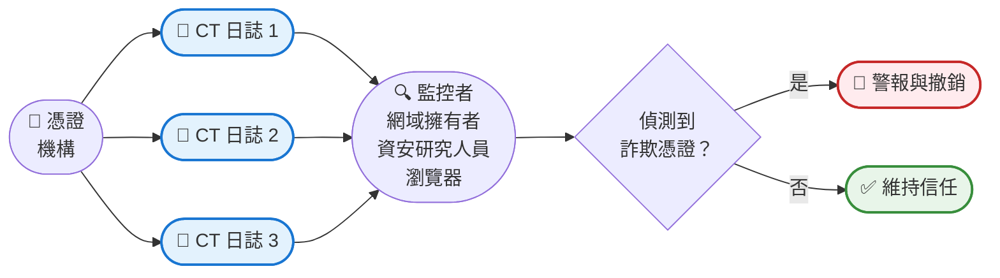

還記得你第一次了解 HTTPS 和瀏覽器中那個小鎖頭圖示嗎？你可能感到安心，知道你的連線是加密且安全的。但這裡有個可能讓資安專業人員夜不成眠的問題：你如何知道那個 HTTPS 憑證是合法的？如果有人秘密地為你的銀行網站發行了假憑證呢？

這正是憑證透明化（Certificate Transparency, CT）所要解決的問題。

2011 年，荷蘭憑證機構 DigiNotar 發生重大資安漏洞，導致為 Google、Yahoo 甚至情報機構等知名網域發行了詐欺憑證。這些假憑證讓攻擊者能夠冒充合法網站，攔截使用者認為安全的加密通訊。這起事件敲響了警鐘：憑證系統需要透明化。

憑證透明化不只是另一個資安協定——它是一種革命性的方法，將憑證發行視為公開帳本。任何憑證機構發行的每個憑證都會被記錄在任何人都可以監控的公開可稽核、僅可附加的日誌中。可以把它想像成 HTTPS 憑證的區塊鏈，但專門為透明化和問責制而設計。

!!!tip "💡 什麼是憑證透明化？"
    憑證透明化（CT）是一個框架，為憑證機構發行的所有 SSL/TLS 憑證建立公開、可驗證的日誌。這些日誌是僅可附加的（憑證可以被新增但永遠不能被移除或修改），並且經過密碼學保護，使得憑證機構幾乎不可能在不被偵測的情況下發行詐欺憑證。

## 問題：沒有驗證的信任

在憑證透明化之前，憑證系統是基於盲目信任運作的。當你使用 HTTPS 造訪網站時，你的瀏覽器會檢查憑證是否由受信任的憑證機構（CA）簽署。如果是，你會看到綠色鎖頭。如果不是，你會看到可怕的警告。

這個系統有一個關鍵缺陷：它假設憑證機構是無懈可擊且值得信賴的。但憑證機構是由人類經營的，使用有錯誤的軟體，並且可能被攻擊者入侵。當 CA 被入侵或犯錯時，沒有系統性的方法可以偵測詐欺憑證，直到它們被主動用於攻擊。

後果是嚴重的：
- **DigiNotar 漏洞（2011）**：為 300 多個網域發行詐欺憑證，導致該 CA 破產
- **Comodo 漏洞（2011）**：為主要網路服務發行假憑證
- **TURKTRUST 事件（2013）**：意外地向客戶發行中繼 CA 憑證

每起事件都侵蝕了對整個憑證生態系統的信任。業界需要一個不僅僅依賴信任憑證機構的解決方案。

## 解決方案：公開、僅可附加的日誌

憑證透明化引入了一個簡單但強大的概念：讓每個憑證都公開。當憑證機構發行憑證時，它必須將其提交到多個獨立的 CT 日誌。這些日誌具有以下特性：

**僅可附加**：憑證只能被新增，永遠不能被修改或刪除。這創造了所有已發行憑證的不可變歷史記錄。

**公開可稽核**：任何人都可以查詢日誌，查看為任何網域發行了哪些憑證。網域擁有者可以監控未經授權的憑證。

**密碼學可驗證**：日誌使用 Merkle 樹結構來確保完整性。任何對日誌的篡改都會立即被偵測到。

**獨立運作**：多個組織運作 CT 日誌，防止任何單點故障或控制。

這種透明化將憑證生態系統從「信任但不驗證」轉變為「信任並始終驗證」。

## 憑證透明化如何運作

CT 系統涉及幾個關鍵參與者共同創造透明化：

### 憑證機構（CAs）

當 CA 發行憑證時，它會將憑證（或預憑證）提交到多個 CT 日誌。日誌會回傳簽署憑證時間戳記（SCT），這是憑證已被記錄的密碼學證明。

### CT 日誌

獨立組織運作 CT 日誌，接受憑證提交，將它們新增到僅可附加的日誌中，並回傳 SCT。主要的 CT 日誌營運商包括 Google、Cloudflare、DigiCert 等。日誌使用 Merkle 樹結構建構，允許有效驗證憑證是否包含在日誌中，而無需下載整個日誌。

### 瀏覽器和客戶端

現代瀏覽器要求憑證在信任之前必須具有有效的 SCT。Chrome、Safari 和其他瀏覽器執行 CT 政策，拒絕信任未被記錄的憑證。這為 CA 參與 CT 創造了強大的誘因。

### 監控者

網域擁有者、資安研究人員和自動化系統持續監控 CT 日誌，查看為他們關心的網域發行的憑證。當出現意外憑證時，他們可以調查並在詐欺時採取行動。

### 稽核者

稽核者驗證 CT 日誌是否正確運作——它們是否真的僅可附加、密碼學證明是否有效，以及日誌是否沒有不當行為。這確保了整個系統的完整性。

!!!example "🎬 真實世界情境"
    你擁有 `neo01.com` 並使用 CT 監控：
    
    1. **正常運作**：你的 CA 為 `neo01.com` 發行憑證並記錄到 CT
    2. **你收到通知**：你的監控服務提醒你有新憑證
    3. **你驗證**：你確認這是你的合法憑證更新
    
    **攻擊情境**：
    1. **攻擊者入侵 CA**：他們欺騙或駭入 CA 為 `neo01.com` 發行憑證
    2. **憑證被記錄**：CA 將其提交到 CT 日誌（瀏覽器要求）
    3. **你收到警報**：你的監控服務偵測到未經授權的憑證
    4. **你採取行動**：你回報詐欺憑證，將其撤銷，並調查漏洞
    
    沒有 CT，你可能永遠不會知道詐欺憑證，直到它被用於攻擊。

## 技術基礎：Merkle 樹

憑證透明化的核心是一個優雅的資料結構：Merkle 樹。這種密碼學結構使 CT 日誌既高效又防篡改。

Merkle 樹以二元樹組織憑證，其中：
- 每個葉節點包含憑證的雜湊值
- 每個父節點包含其兩個子節點的雜湊值
- 根雜湊值代表整個日誌的狀態

這種結構提供了強大的特性：

**高效驗證**：要證明憑證在日誌中，你只需要提供從憑證到根的小型「稽核路徑」雜湊值——而不是整個日誌。對於擁有一百萬個憑證的日誌，你只需要大約 20 個雜湊值來證明包含性。

**篡改偵測**：對日誌中任何憑證的任何更改都會改變根雜湊值。由於根雜湊值是公開已知且被監控的，篡改會立即被偵測到。

**僅可附加證明**：Merkle 樹結構允許證明日誌只增長（新增憑證）而沒有修改或移除舊條目。這稱為「一致性證明」。

!!!anote "🔐 密碼學保證"
    Merkle 樹結構提供數學確定性：
    - 要證明憑證 2 在日誌中，提供：H1、H34
    - 驗證者計算：H2（憑證 2 的雜湊值），然後 H12 = hash(H1 + H2)，然後根 = hash(H12 + H34)
    - 如果計算的根與公佈的根匹配，憑證 2 肯定在日誌中
    - 這只需要 2 個雜湊值，而不是下載所有 4 個憑證

## 憑證透明化的好處

CT 的實施在整個網路上提供了實質的資安改進：

**早期偵測誤發憑證**：網域擁有者可以在數小時或數天內偵測到未經授權的憑證，而不是數月或永遠不會。這大幅減少了攻擊者的機會窗口。

**憑證機構的問責制**：CA 知道他們的行為是公開可見且可稽核的。這為適當的資安實踐和仔細驗證創造了強大的誘因。

**減少 CA 入侵的影響**：當 CA 被入侵時，CT 日誌提供所有發行的詐欺憑證的完整記錄，實現快速回應和撤銷。

**研究與分析**：資安研究人員可以分析 CT 日誌以識別趨勢、發現錯誤配置，並改進整個業界的憑證實踐。

**合規與稽核**：組織可以證明他們遵循憑證政策，並快速識別其網域內的影子 IT 或未經授權的憑證發行。

!!!success "✨ 實際影響"
    自 CT 成為強制性以來：
    - **Symantec 事件（2017）**：CT 日誌揭露 Symantec 在沒有適當驗證的情況下發行了 30,000 多個憑證，導致他們從瀏覽器信任儲存中被移除
    - **更快的偵測**：偵測誤發憑證的平均時間從數月降至數小時
    - **增加的問責制**：CA 投資更多資安，因為他們知道自己的行為是透明的
    - **減少詐欺**：偵測風險使詐欺憑證發行對攻擊者的吸引力大大降低

## 監控憑證透明化日誌

CT 最強大的功能之一是任何人都可以監控日誌。幾個工具和服務使這變得容易：

**crt.sh**：用於搜尋 CT 日誌的免費網頁介面。只需輸入網域名稱即可查看為其發行的所有憑證。這對於檢查未經授權憑證的網域擁有者來說非常寶貴。

**Facebook CT 監控**：Facebook 提供免費服務，監控你網域的 CT 日誌，並在發行新憑證時發送警報。

**Google CT 搜尋**：Google 提供搜尋和分析 CT 日誌的工具，對資安研究和調查很有用。

**Certstream**：憑證新增到 CT 日誌時的即時串流。資安研究人員使用它來偵測網路釣魚網域、域名搶註和其他惡意活動。

**商業服務**：Censys、Shodan 和各種資安供應商等公司提供進階 CT 監控，包括警報、分析和與資安營運的整合。

!!!tip "🔍 親自試試"
    造訪 [crt.sh](https://crt.sh) 並搜尋你擁有的網域或熱門網站：
    
    1. 輸入網域（例如 `google.com`）
    2. 查看為該網域發行的所有憑證
    3. 注意時間戳記、憑證機構和有效期
    4. 尋找任何意外或可疑的憑證
    
    這種透明化對每個人都可用——不需要特殊存取權限。

## 挑戰與限制

雖然憑證透明化非常成功，但並非沒有挑戰：

**隱私問題**：每個發行的憑證都成為公開知識。這意味著任何人都可以看到你正在使用哪些網域和子網域，可能在你準備好宣布之前就揭露內部基礎設施或即將推出的專案。

**日誌可擴展性**：隨著網路成長和憑證生命週期縮短（從數年到數月），CT 日誌必須處理不斷增加的數量。數十億個憑證需要被記錄、儲存和可查詢。

**監控開銷**：擁有數千個網域的網域擁有者需要複雜的監控系統來追蹤所有憑證。小型組織可能缺乏有效監控的資源。

**誤報**：合法的憑證更新、測試憑證和 CDN 憑證可能觸發警報，需要仔細調整監控系統。

**不完整的覆蓋範圍**：雖然主要瀏覽器執行 CT，但某些客戶端和應用程式不執行。這創造了詐欺憑證仍可能被使用的缺口。

**日誌營運商信任**：雖然 CT 減少了對 CA 的信任，但它將一些信任轉移到日誌營運商。行為不當的日誌可能拒絕記錄憑證或提供虛假證明，儘管多日誌要求和稽核減輕了這種風險。

!!!warning "⚠️ 隱私考量"
    在為敏感子網域請求憑證之前：
    - 記住它會出現在公開 CT 日誌中
    - 考慮為內部子網域使用萬用字元憑證
    - 注意 CT 日誌會揭露你的基礎設施拓撲
    - 在規劃網域命名策略時考慮透明化

## 憑證透明化的未來

憑證透明化持續演進，有幾個發展即將到來：

**更短的憑證生命週期**：業界正朝著更短的憑證有效期（從 2 年到 1 年到可能的 90 天）發展。這減少了被入侵憑證的影響，但增加了必須記錄的憑證數量。

**改進的隱私**：對隱私保護 CT 機制的研究旨在提供透明化而不揭露敏感網域資訊。正在探索編輯和延遲發佈等技術。

**擴大範圍**：CT 模型正被改編用於 HTTPS 憑證以外的其他信任系統，包括程式碼簽署憑證、電子郵件憑證，甚至軟體供應鏈透明化。

**更好的整合**：CT 日誌、憑證機構和監控系統之間更緊密的整合將實現更快的誤發憑證偵測和回應。

**自動化回應**：未來的系統可能會自動撤銷在 CT 日誌中偵測到的可疑憑證，將攻擊的時間窗口從數小時減少到數分鐘。

**去中心化**：基於區塊鏈的方法可以進一步去中心化 CT 日誌，減少對特定日誌營運商的依賴並增加韌性。

## 開始使用憑證透明化

無論你是網域擁有者、資安專業人員還是好奇的開發者，以下是開始使用 CT 的方法：

### 對網域擁有者

**步驟 1：了解你目前的憑證**
- 造訪 crt.sh 並搜尋你的網域
- 檢視為你的網域發行的所有憑證
- 識別任何意外或未經授權的憑證

**步驟 2：設定監控**
- 使用 Facebook CT 監控或 crt.sh 警報等免費服務
- 為你的網域上的新憑證配置通知
- 建立調查警報的流程

**步驟 3：建立回應程序**
- 定義誰調查憑證警報
- 建立驗證合法憑證的流程
- 記錄回報和撤銷詐欺憑證的步驟

### 對資安研究人員

**步驟 1：探索 CT 日誌**
- 使用 crt.sh 搜尋有趣的模式
- 嘗試 Certstream 進行即時憑證監控
- 分析憑證發行趨勢和異常

**步驟 2：建構監控工具**
- 使用 CT 日誌 API 建構自訂監控
- 為特定模式（域名搶註、網路釣魚網域）建立警報
- 貢獻開源 CT 工具

**步驟 3：貢獻生態系統**
- 向網域擁有者回報可疑憑證
- 與資安社群分享發現
- 協助改進 CT 工具和文件

### 對開發者

**步驟 1：了解 CT 要求**
- 學習瀏覽器如何執行 CT 政策
- 了解憑證的 SCT 要求
- 檢視你的憑證發行流程

**步驟 2：實作 CT 驗證**
- 在你的應用程式中驗證 SCT
- 使用 CT 日誌 API 檢查憑證狀態
- 為你組織的網域實作監控

**步驟 3：保持資訊更新**
- 追蹤瀏覽器的 CT 政策變更
- 監控 CT 日誌營運商公告
- 參與 CT 社群討論

!!!example "🎯 快速入門練習"
    嘗試這個實作練習來了解 CT：
    
    1. 造訪 [crt.sh](https://crt.sh)
    2. 搜尋 `facebook.com`
    3. 注意發行的數千個憑證
    4. 點擊最近的憑證查看詳細資訊
    5. 觀察顯示哪些 CT 日誌記錄了它的 SCT 資訊
    6. 現在搜尋你自己的網域（如果你有的話）
    7. 驗證所有憑證都是合法的
    
    這個 5 分鐘的練習展示了保護整個網路的透明化。

## 結論：透明化作為資安基礎

憑證透明化代表了我們在網際網路上處理信任方式的根本轉變。我們現在擁有一個透過透明化、密碼學和公開問責制來驗證信任的系統，而不是盲目信任憑證機構。

CT 的成功展示了一個強大的原則：透明化使系統更安全。當行為是公開且可稽核的時，不良行為者面臨偵測和後果。這個原則延伸到憑證之外，包括軟體供應鏈、程式碼簽署和其他信任系統。

對網域擁有者來說，CT 提供了安心——如果有人試圖冒充你的網站，你會知道。對資安研究人員來說，它是偵測威脅和分析趨勢的寶貴工具。對更廣泛的網際網路社群來說，它是使 HTTPS 更可靠和安全的信任基礎。

瀏覽器中的小鎖頭圖示代表的不僅僅是加密——它代表一個透明、可稽核的系統，詐欺憑證無法隱藏在陰影中。這就是憑證透明化的力量。

!!!quote "💭 最後的想法"
    「陽光據說是最好的消毒劑。」——Louis Brandeis
    
    憑證透明化為憑證生態系統帶來陽光，透過公開問責制的簡單但強大的原則，讓網路對每個人都更安全。

## 額外資源

**官方規範：**
- [RFC 6962: Certificate Transparency](https://tools.ietf.org/html/rfc6962)
- [RFC 9162: Certificate Transparency Version 2.0](https://tools.ietf.org/html/rfc9162)

**工具與服務：**
- [crt.sh](https://crt.sh) - 搜尋 CT 日誌
- [Facebook CT Monitoring](https://developers.facebook.com/tools/ct/) - 免費監控服務
- [Certstream](https://certstream.calidog.io/) - 即時憑證串流

**學習資源：**
- [Certificate Transparency: The Foundation of Trust](https://certificate.transparency.dev/)
- [Google's CT Policy](https://github.com/chromium/ct-policy)
- [CT Log List](https://www.gstatic.com/ct/log_list/v3/all_logs_list.json)
