Remember when you first learned about HTTPS and that little padlock icon in your browser? You probably felt reassured knowing your connection was encrypted and secure. But here's a question that might keep security professionals up at night: How do you know that HTTPS certificate is legitimate? What if someone secretly issued a fake certificate for your bank's website?

That's exactly the problem Certificate Transparency (CT) was designed to solve.

In 2011, a major security breach at DigiNotar, a Dutch certificate authority, resulted in fraudulent certificates being issued for high-profile domains like Google, Yahoo, and even intelligence agencies. These fake certificates allowed attackers to impersonate legitimate websites, intercepting encrypted communications that users believed were secure. The incident was a wake-up call: the certificate system needed transparency.

Certificate Transparency isn't just another security protocol - it's a revolutionary approach that treats certificate issuance like a public ledger. Every certificate issued by any certificate authority gets recorded in publicly auditable, append-only logs that anyone can monitor. Think of it as a blockchain for HTTPS certificates, but designed specifically for transparency and accountability.

!!!tip "💡 What is Certificate Transparency?"
    Certificate Transparency (CT) is a framework that creates public, verifiable logs of all SSL/TLS certificates issued by certificate authorities. These logs are append-only (certificates can be added but never removed or modified) and cryptographically secured, making it nearly impossible for certificate authorities to issue fraudulent certificates without detection.

## The Problem: Trust Without Verification

Before Certificate Transparency, the certificate system operated on blind trust. When you visited a website using HTTPS, your browser checked if the certificate was signed by a trusted certificate authority (CA). If yes, you got the green padlock. If no, you got a scary warning.

This system had a critical flaw: it assumed certificate authorities were infallible and trustworthy. But certificate authorities are run by humans, use software with bugs, and can be compromised by attackers. When a CA was breached or made mistakes, there was no systematic way to detect fraudulent certificates until they were actively used in attacks.

The consequences were severe:
- **DigiNotar breach (2011)**: Fraudulent certificates for 300+ domains, leading to the CA's bankruptcy
- **Comodo breach (2011)**: Fake certificates issued for major web services
- **TURKTRUST incident (2013)**: Accidentally issued intermediate CA certificates to customers

Each incident eroded trust in the entire certificate ecosystem. The industry needed a solution that didn't rely solely on trusting certificate authorities.

```mermaid
graph TB
    A([🏢 Certificate Authority<br/>Issues certificate]) --> B{Trusted CA?}
    B -->|Yes| C([✅ Browser trusts<br/>certificate])
    B -->|No| D([❌ Browser shows<br/>warning])
    E([⚠️ Problem:<br/>No way to detect<br/>fraudulent certificates<br/>from trusted CAs]) -.-> A
    
    style E fill:#ffebee,stroke:#c62828,stroke-width:3px
    style C fill:#e8f5e9,stroke:#388e3c,stroke-width:2px
    style D fill:#fff3e0,stroke:#f57c00,stroke-width:2px
```

## The Solution: Public, Append-Only Logs

Certificate Transparency introduces a simple but powerful concept: make every certificate public. When a certificate authority issues a certificate, it must submit it to multiple independent CT logs. These logs are:

**Append-Only**: Certificates can only be added, never modified or deleted. This creates an immutable history of all certificates ever issued.

**Publicly Auditable**: Anyone can query the logs to see what certificates have been issued for any domain. Domain owners can monitor for unauthorized certificates.

**Cryptographically Verifiable**: The logs use Merkle tree structures to ensure integrity. Any tampering with the log would be immediately detectable.

**Independently Operated**: Multiple organizations run CT logs, preventing any single point of failure or control.

This transparency transforms the certificate ecosystem from "trust but don't verify" to "trust and always verify."

```mermaid
graph LR
    A([🏢 Certificate<br/>Authority]) --> B([📝 CT Log 1])
    A --> C([📝 CT Log 2])
    A --> D([📝 CT Log 3])
    B --> E([🔍 Monitors<br/>Domain owners<br/>Security researchers<br/>Browsers])
    C --> E
    D --> E
    E --> F{Fraudulent<br/>certificate<br/>detected?}
    F -->|Yes| G([🚨 Alert & Revoke])
    F -->|No| H([✅ Trust maintained])
    
    style B fill:#e3f2fd,stroke:#1976d2,stroke-width:2px
    style C fill:#e3f2fd,stroke:#1976d2,stroke-width:2px
    style D fill:#e3f2fd,stroke:#1976d2,stroke-width:2px
    style G fill:#ffebee,stroke:#c62828,stroke-width:2px
    style H fill:#e8f5e9,stroke:#388e3c,stroke-width:2px
```

## How Certificate Transparency Works

The CT system involves several key players working together to create transparency:

### Certificate Authorities (CAs)

When a CA issues a certificate, it submits the certificate (or a precertificate) to multiple CT logs. The logs return a Signed Certificate Timestamp (SCT), which is cryptographic proof that the certificate has been logged.

### CT Logs

Independent organizations operate CT logs that accept certificate submissions, add them to their append-only logs, and return SCTs. Major CT log operators include Google, Cloudflare, DigiCert, and others. The logs are built using Merkle tree structures, which allow efficient verification that a certificate is included in the log without downloading the entire log.

### Browsers and Clients

Modern browsers require certificates to have valid SCTs before trusting them. Chrome, Safari, and other browsers enforce CT policies, refusing to trust certificates that haven't been logged. This creates a strong incentive for CAs to participate in CT.

### Monitors

Domain owners, security researchers, and automated systems continuously monitor CT logs for certificates issued for domains they care about. When an unexpected certificate appears, they can investigate and take action if it's fraudulent.

### Auditors

Auditors verify that CT logs are operating correctly - that they're truly append-only, that the cryptographic proofs are valid, and that logs aren't misbehaving. This ensures the integrity of the entire system.

!!!example "🎬 Real-World Scenario"
    You own `neo01.com` and use CT monitoring:
    
    1. **Normal operation**: Your CA issues a certificate for `neo01.com` and logs it to CT
    2. **You receive notification**: Your monitoring service alerts you about the new certificate
    3. **You verify**: You confirm this is your legitimate certificate renewal
    
    **Attack scenario**:
    1. **Attacker compromises a CA**: They trick or hack a CA into issuing a certificate for `neo01.com`
    2. **Certificate gets logged**: The CA submits it to CT logs (required by browsers)
    3. **You receive alert**: Your monitoring service detects the unauthorized certificate
    4. **You take action**: You report the fraudulent certificate, get it revoked, and investigate the breach
    
    Without CT, you might never know about the fraudulent certificate until it's used in an attack.

## The Technical Foundation: Merkle Trees

At the heart of Certificate Transparency lies an elegant data structure: the Merkle tree. This cryptographic structure makes CT logs both efficient and tamper-proof.

A Merkle tree organizes certificates in a binary tree where:
- Each leaf node contains a hash of a certificate
- Each parent node contains a hash of its two children
- The root hash represents the entire log's state

This structure provides powerful properties:

**Efficient Verification**: To prove a certificate is in the log, you only need to provide a small "audit path" of hashes from the certificate to the root - not the entire log. For a log with a million certificates, you only need about 20 hashes to prove inclusion.

**Tamper Detection**: Any change to any certificate in the log changes the root hash. Since the root hash is publicly known and monitored, tampering is immediately detectable.

**Append-Only Proof**: The Merkle tree structure allows proving that a log has only grown (new certificates added) without modifying or removing old entries. This is called a "consistency proof."

!!!anote "🔐 Cryptographic Guarantee"
    The Merkle tree structure provides mathematical certainty:
    - To prove Cert 2 is in the log, provide: H1, H34
    - Verifier computes: H2 (hash of Cert 2), then H12 = hash(H1 + H2), then Root = hash(H12 + H34)
    - If computed root matches the published root, Cert 2 is definitely in the log
    - This requires only 2 hashes instead of downloading all 4 certificates

## Benefits of Certificate Transparency

The implementation of CT has delivered tangible security improvements across the web:

**Early Detection of Misissued Certificates**: Domain owners can detect unauthorized certificates within hours or days instead of months or never. This dramatically reduces the window of opportunity for attackers.

**Accountability for Certificate Authorities**: CAs know their actions are publicly visible and auditable. This creates strong incentives for proper security practices and careful validation.

**Reduced Impact of CA Compromises**: When a CA is compromised, CT logs provide a complete record of all fraudulent certificates issued, enabling rapid response and revocation.

**Research and Analysis**: Security researchers can analyze CT logs to identify trends, discover misconfigurations, and improve certificate practices across the industry.

**Compliance and Auditing**: Organizations can prove they're following certificate policies and quickly identify shadow IT or unauthorized certificate issuance within their domains.

!!!success "✨ Real Impact"
    Since CT became mandatory:
    - **Symantec incident (2017)**: CT logs revealed Symantec had issued 30,000+ certificates without proper validation, leading to their removal from browser trust stores
    - **Faster detection**: Average time to detect misissued certificates dropped from months to hours
    - **Increased accountability**: CAs invest more in security knowing their actions are transparent
    - **Reduced fraud**: The risk of detection makes fraudulent certificate issuance much less attractive to attackers

## Monitoring Certificate Transparency Logs

One of CT's most powerful features is that anyone can monitor the logs. Several tools and services make this accessible:

**crt.sh**: A free web interface for searching CT logs. Simply enter a domain name to see all certificates ever issued for it. This is invaluable for domain owners checking for unauthorized certificates.

**Facebook CT Monitoring**: Facebook offers a free service that monitors CT logs for your domains and sends alerts when new certificates are issued.

**Google CT Search**: Google provides tools for searching and analyzing CT logs, useful for security research and investigation.

**Certstream**: A real-time stream of certificates as they're added to CT logs. Security researchers use this to detect phishing domains, typosquatting, and other malicious activity.

**Commercial Services**: Companies like Censys, Shodan, and various security vendors offer advanced CT monitoring with alerting, analysis, and integration with security operations.

!!!tip "🔍 Try It Yourself"
    Visit [crt.sh](https://crt.sh) and search for a domain you own or a popular website:
    
    1. Enter the domain (e.g., `google.com`)
    2. See all certificates issued for that domain
    3. Notice the timestamps, certificate authorities, and validity periods
    4. Look for any unexpected or suspicious certificates
    
    This transparency is available to everyone - no special access required.

## Challenges and Limitations

While Certificate Transparency has been remarkably successful, it's not without challenges:

**Privacy Concerns**: Every certificate issued becomes public knowledge. This means anyone can see what domains and subdomains you're using, potentially revealing internal infrastructure or upcoming projects before you're ready to announce them.

**Log Scalability**: As the web grows and certificate lifetimes shorten (from years to months), CT logs must handle increasing volumes. Billions of certificates need to be logged, stored, and made queryable.

**Monitoring Overhead**: Domain owners with thousands of domains need sophisticated monitoring systems to track all certificates. Small organizations may lack resources for effective monitoring.

**False Positives**: Legitimate certificate renewals, testing certificates, and CDN certificates can trigger alerts, requiring careful tuning of monitoring systems.

**Incomplete Coverage**: While major browsers enforce CT, some clients and applications don't. This creates gaps where fraudulent certificates might still be used.

**Log Operator Trust**: While CT reduces trust in CAs, it shifts some trust to log operators. Misbehaving logs could refuse to log certificates or provide false proofs, though the multi-log requirement and auditing mitigate this risk.

!!!warning "⚠️ Privacy Consideration"
    Before requesting a certificate for a sensitive subdomain:
    - Remember it will appear in public CT logs
    - Consider using wildcard certificates for internal subdomains
    - Be aware that CT logs reveal your infrastructure topology
    - Plan domain naming strategies with transparency in mind

## The Future of Certificate Transparency

Certificate Transparency continues to evolve, with several developments on the horizon:

**Shorter Certificate Lifetimes**: The industry is moving toward shorter certificate validity periods (from 2 years to 1 year to potentially 90 days). This reduces the impact of compromised certificates but increases the volume of certificates that must be logged.

**Improved Privacy**: Research into privacy-preserving CT mechanisms aims to provide transparency without revealing sensitive domain information. Techniques like redaction and delayed publication are being explored.

**Expanded Scope**: The CT model is being adapted for other trust systems beyond HTTPS certificates, including code signing certificates, email certificates, and even software supply chain transparency.

**Better Integration**: Tighter integration between CT logs, certificate authorities, and monitoring systems will enable faster detection and response to misissued certificates.

**Automated Response**: Future systems may automatically revoke suspicious certificates detected in CT logs, reducing the time window for attacks from hours to minutes.

**Decentralization**: Blockchain-based approaches could further decentralize CT logs, reducing reliance on specific log operators and increasing resilience.

## Getting Started with Certificate Transparency

Whether you're a domain owner, security professional, or curious developer, here's how to start using CT:

### For Domain Owners

**Step 1: Understand Your Current Certificates**
- Visit crt.sh and search for your domains
- Review all certificates issued for your domains
- Identify any unexpected or unauthorized certificates

**Step 2: Set Up Monitoring**
- Use free services like Facebook CT Monitoring or crt.sh alerts
- Configure notifications for new certificates on your domains
- Establish a process for investigating alerts

**Step 3: Establish Response Procedures**
- Define who investigates certificate alerts
- Create a process for verifying legitimate certificates
- Document steps for reporting and revoking fraudulent certificates

### For Security Researchers

**Step 1: Explore CT Logs**
- Use crt.sh to search for interesting patterns
- Try Certstream for real-time certificate monitoring
- Analyze certificate issuance trends and anomalies

**Step 2: Build Monitoring Tools**
- Use CT log APIs to build custom monitoring
- Create alerts for specific patterns (typosquatting, phishing domains)
- Contribute to open-source CT tools

**Step 3: Contribute to the Ecosystem**
- Report suspicious certificates to domain owners
- Share findings with the security community
- Help improve CT tools and documentation

### For Developers

**Step 1: Understand CT Requirements**
- Learn how browsers enforce CT policies
- Understand SCT requirements for certificates
- Review your certificate issuance process

**Step 2: Implement CT Verification**
- Verify SCTs in your applications
- Use CT log APIs to check certificate status
- Implement monitoring for your organization's domains

**Step 3: Stay Informed**
- Follow CT policy changes from browsers
- Monitor CT log operator announcements
- Participate in CT community discussions

!!!example "🎯 Quick Start Exercise"
    Try this hands-on exercise to understand CT:
    
    1. Visit [crt.sh](https://crt.sh)
    2. Search for `facebook.com`
    3. Notice the thousands of certificates issued
    4. Click on a recent certificate to see details
    5. Observe the SCT information showing which CT logs recorded it
    6. Now search for your own domain (if you have one)
    7. Verify all certificates are legitimate
    
    This 5-minute exercise demonstrates the transparency that protects the entire web.

## Conclusion: Transparency as a Security Foundation

Certificate Transparency represents a fundamental shift in how we approach trust on the internet. Instead of blindly trusting certificate authorities, we now have a system where trust is verified through transparency, cryptography, and public accountability.

The success of CT demonstrates a powerful principle: transparency makes systems more secure. When actions are public and auditable, bad actors face detection and consequences. This principle extends beyond certificates to software supply chains, code signing, and other trust systems.

For domain owners, CT provides peace of mind - you'll know if someone tries to impersonate your website. For security researchers, it's an invaluable tool for detecting threats and analyzing trends. For the broader internet community, it's a foundation of trust that makes HTTPS more reliable and secure.

The little padlock icon in your browser represents more than encryption - it represents a transparent, auditable system where fraudulent certificates can't hide in the shadows. That's the power of Certificate Transparency.

!!!quote "💭 Final Thought"
    "Sunlight is said to be the best of disinfectants." - Louis Brandeis
    
    Certificate Transparency brings sunlight to the certificate ecosystem, making the web safer for everyone through the simple but powerful principle of public accountability.

## Additional Resources

**Official Specifications:**
- [RFC 6962: Certificate Transparency](https://tools.ietf.org/html/rfc6962)
- [RFC 9162: Certificate Transparency Version 2.0](https://tools.ietf.org/html/rfc9162)

**Tools and Services:**
- [crt.sh](https://crt.sh) - Search CT logs
- [Facebook CT Monitoring](https://developers.facebook.com/tools/ct/) - Free monitoring service
- [Certstream](https://certstream.calidog.io/) - Real-time certificate stream

**Learning Resources:**
- [Certificate Transparency: The Foundation of Trust](https://certificate.transparency.dev/)
- [Google's CT Policy](https://github.com/chromium/ct-policy)
- [CT Log List](https://www.gstatic.com/ct/log_list/v3/all_logs_list.json)
