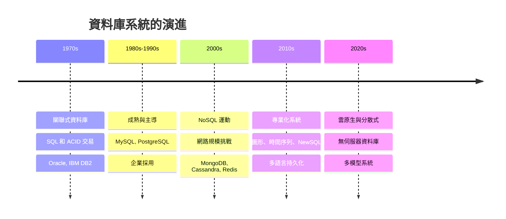
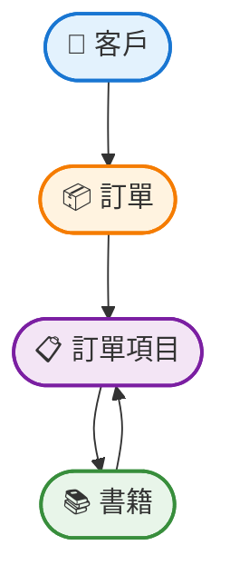
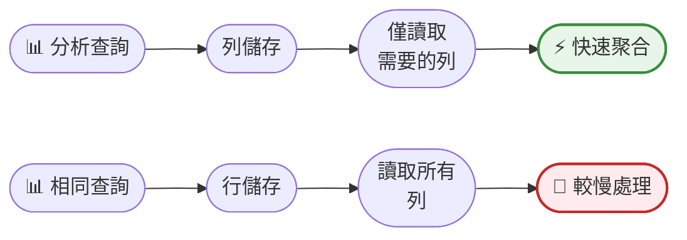
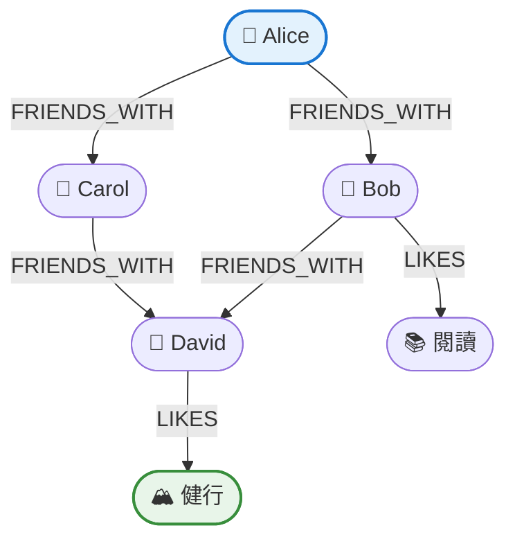
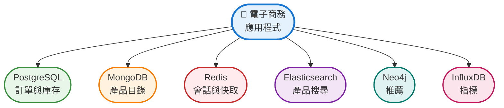

還記得您第一次需要為應用程式儲存資料嗎？您可能隨手選了一個聽過的資料庫 - 也許是 MySQL 或 PostgreSQL - 沒有多想它是否是正確的選擇。它能用，所以您就繼續了。但隨著應用程式成長，您可能遇到了瓶頸：查詢緩慢、擴展挑戰，或資料結構就是無法適配關聯式模型。

事實是：資料庫並非一體適用。過去二十年來，資料庫領域已經爆炸性成長，從關聯式資料庫的主導地位演變為豐富的專業化儲存系統生態系統。每種類型都針對特定使用案例、資料模式和效能需求進行最佳化。

選擇錯誤的資料庫就像在需要螺絲起子時使用錘子 - 可能有用，但您會不必要地掙扎。理解不同類型的資料庫及其優勢，有助於您做出明智的決策，節省時間、金錢和麻煩。

!!!tip "💡 什麼是資料庫？"
    資料庫是結構化資訊或資料的有組織集合，通常以電子方式儲存在電腦系統中。資料庫管理系統（DBMS）控制資料庫，允許使用者有效且安全地建立、讀取、更新和刪除資料。

## 資料庫演進：從檔案到專業化系統

在深入探討特定資料庫類型之前，讓我們先了解我們是如何走到這一步的。在計算的早期，應用程式將資料儲存在平面檔案中 - 簡單的文字檔案，記錄由分隔符號分隔。這對小型資料集有效，但隨著資料增長很快就變得難以管理。

1970 年代的**關聯式資料庫革命**改變了一切。Edgar F. Codd 的關聯式模型引入了具有關聯性的結構化表格，透過 SQL（結構化查詢語言）實現複雜查詢。數十年來，Oracle、MySQL 和 PostgreSQL 等關聯式資料庫主導了這個領域，這是有充分理由的 - 它們提供了一致性、可靠性和強大的查詢能力。

但網際網路時代帶來了新挑戰。網路應用程式需要處理大規模、不可預測的流量高峰，以及無法整齊地放入表格的多樣化資料類型。這引發了 2000 年代的 **NoSQL 運動**，引入了針對特定使用案例最佳化的資料庫：用於靈活架構的文件儲存、用於速度的鍵值儲存、用於分析的列儲存，以及用於連接資料的圖形資料庫。

今天，我們生活在一個**多語言持久化**的世界，應用程式使用多種資料庫類型，每種都處理最適合它的工作負載。您的電子商務網站可能使用關聯式資料庫處理交易、文件儲存處理產品目錄、快取處理會話資料，以及圖形資料庫處理推薦。



## 關聯式資料庫（RDBMS）：基礎

關聯式資料庫將資料組織成表格（關聯），包含行和列。每個表格都有定義的架構，指定列名稱和資料類型。表格可以透過外鍵連結，在資料之間建立關聯性。

### 運作方式

資料儲存在具有嚴格架構的表格中。當您查詢資料時，資料庫引擎使用 SQL 來連接表格、過濾行和聚合結果。關聯式資料庫強制執行 ACID 屬性（原子性、一致性、隔離性、持久性）以確保資料完整性，使其成為正確性至關重要的應用程式的理想選擇。

**ACID 屬性說明：**
- **原子性**：交易是全有或全無；如果一部分失敗，整個交易回滾
- **一致性**：資料必須符合所有驗證規則和約束
- **隔離性**：並發交易不會互相干擾
- **持久性**：一旦提交，資料即使系統崩潰也會持久存在

### 優勢

**資料完整性**：外鍵、約束和交易確保資料保持一致和有效。您無法意外建立孤立記錄或違反業務規則。

**複雜查詢**：SQL 提供強大的功能來連接多個表格、聚合資料和執行複雜的分析查詢。需要找到上個月購買產品 X 但沒有購買產品 Y 的所有客戶？SQL 可以優雅地處理這個問題。

**成熟的生態系統**：數十年的開發產生了強大的備份、複製、監控和最佳化工具。知識庫廣泛，熟練的開發人員眾多。

**標準化**：SQL 在資料庫之間是標準化的，使得切換供應商或使用具有類似查詢語言的多個系統變得更容易。

### 劣勢

**僵化的架構**：在生產環境中更改表格結構可能複雜且有風險，特別是對於大型資料集。新增列可能需要停機或冗長的遷移。

**擴展挑戰**：水平擴展（增加更多伺服器）很困難，因為在分散式系統中維護 ACID 屬性很複雜。大多數關聯式資料庫垂直擴展（更大的伺服器），這有限制。

**效能開銷**：ACID 保證和複雜的查詢最佳化增加了開銷。對於簡單的鍵值查找，關聯式資料庫是過度的。

### 最佳使用案例

- **金融系統**：銀行、會計、支付處理，資料完整性至關重要
- **電子商務交易**：訂單處理、庫存管理、客戶帳戶
- **企業應用程式**：ERP、CRM 系統，實體之間具有複雜關聯性
- **內容管理**：具有結構化內容和關聯性的系統

### 熱門範例

- **PostgreSQL**：開源、功能豐富、適合複雜查詢和 JSON 支援
- **MySQL**：廣泛使用、易於設定、適合網路應用程式
- **Oracle Database**：企業級、強大功能、高成本
- **Microsoft SQL Server**：Windows 生態系統整合、強大的商業智慧工具
- **IBM DB2**：企業資料庫、在大型主機上表現強勁、適合大規模交易系統

!!!example "🎬 真實世界情境"
    線上書店使用 PostgreSQL 進行核心營運：
    
    - **Customers 表格**：使用者帳戶、地址、付款方式
    - **Books 表格**：ISBN、標題、作者、價格、庫存
    - **Orders 表格**：訂單詳情、狀態、時間戳記
    - **Order_items 表格**：將訂單連結到書籍及數量
    
    當客戶下訂單時，交易確保：
    1. 庫存減少
    2. 建立訂單記錄
    3. 處理付款
    
    如果任何步驟失敗，一切都會回滾 - 沒有部分訂單或庫存差異。



## 文件資料庫：靈活且無架構

文件資料庫將資料儲存為文件，通常採用 JSON 或 BSON 格式。與具有僵化架構的關聯式資料庫不同，文件資料庫允許每個文件具有不同的欄位，為不斷演變的資料結構提供靈活性。

### 運作方式

每個文件都是一個自包含的單元，包含所有相關資料。文件資料庫不是將客戶資訊分散在多個表格中，而是將所有內容儲存在一個文件中：客戶詳情、地址、訂單歷史和偏好。文件組織成集合（類似於表格），可以使用文件特定的查詢語言進行查詢。

### 優勢

**架構靈活性**：無需遷移即可新增欄位。同一集合中的不同文件可以具有不同的結構，非常適合不斷演變的應用程式。

**自然的資料建模**：文件自然地映射到程式語言中的物件。您的應用程式資料結構可以直接儲存，無需複雜的物件關聯映射。

**效能**：檢索文件可在一次操作中獲取所有相關資料，避免昂貴的連接。這使得讀取操作快速。

**水平擴展**：大多數文件資料庫專為分散式系統設計，使得跨多個伺服器擴展更容易。

### 劣勢

**資料重複**：非正規化資料意味著相同的資訊可能儲存在多個文件中，增加儲存需求和更新複雜性。

**有限的交易**：雖然現代文件資料庫支援交易，但與關聯式資料庫相比通常受到限制，特別是跨多個文件或集合。

**查詢複雜性**：涉及多個集合的複雜查詢可能具有挑戰性，效率不如 SQL 連接。

**一致性權衡**：許多文件資料庫優先考慮可用性和分區容錯性，而不是即時一致性（最終一致性模型）。

### 最佳使用案例

- **內容管理**：部落格、新聞網站，內容結構各異
- **使用者設定檔**：社交網路、遊戲平台，具有多樣化的使用者資料
- **產品目錄**：電子商務，產品屬性各異
- **即時分析**：事件記錄、使用者行為追蹤
- **行動應用程式**：離線優先的應用程式，與雲端資料庫同步

### 熱門範例

- **MongoDB**：最受歡迎的文件資料庫、豐富的查詢語言、良好的工具
- **Couchbase**：高效能、內建快取、行動同步功能
- **Amazon DocumentDB**：MongoDB 相容、完全託管的 AWS 服務
- **Firebase Firestore**：即時同步、適合行動和網路應用程式

!!!example "🎬 真實世界情境"
    部落格平台使用 MongoDB 儲存文章：
    
    ```json
    {
      "_id": "article123",
      "title": "理解資料庫",
      "author": {
        "name": "Jane Doe",
        "email": "jane@neo01.com"
      },
      "content": "...",
      "tags": ["資料庫", "教學"],
      "comments": [
        {
          "user": "John",
          "text": "很棒的文章！",
          "timestamp": "2023-07-15T10:30:00Z"
        }
      ],
      "published": true,
      "views": 1523
    }
    ```
    
    與文章相關的所有內容 - 作者資訊、評論、標籤 - 都在一個文件中。檢索文章只需要一次查詢，不需要多次連接。

## 鍵值儲存：速度與簡單性

鍵值儲存是最簡單的資料庫類型，將資料儲存為鍵值對的集合。可以將其視為一個巨大的雜湊映射或字典，您使用唯一鍵儲存值並立即檢索它們。

### 運作方式

資料僅透過鍵存取。您提供一個鍵，資料庫返回相關的值。沒有查詢語言、沒有連接、沒有複雜操作 - 只有快速查找。值可以是任何東西：字串、數字、JSON 物件或二進位資料。

### 優勢

**極致效能**：鍵值查找非常快，通常在亞毫秒級。這使它們成為快取和高吞吐量應用程式的理想選擇。

**水平擴展**：簡單的資料模型使得使用一致性雜湊或類似技術在多個伺服器之間分配資料變得容易。

**簡單性**：最小的複雜性意味著出錯的可能性更少。易於理解、部署和維護。

**靈活性**：值可以是任何資料類型，資料庫不關心它們的結構。

### 劣勢

**有限的查詢**：您只能透過鍵檢索資料。沒有搜尋、過濾或聚合，除非建立自訂索引。

**沒有關聯性**：沒有內建的資料關聯性支援。您必須在應用程式程式碼中管理關聯性。

**資料建模挑戰**：設計有效的鍵結構需要仔細規劃。糟糕的鍵設計導致低效的存取模式。

### 最佳使用案例

- **快取**：會話資料、API 回應、計算結果
- **會話管理**：網路應用程式使用者會話
- **即時資料**：排行榜、計數器、速率限制
- **購物車**：不需要複雜查詢的臨時資料
- **配置儲存**：應用程式設定、功能標誌

### 熱門範例

- **Redis**：記憶體內儲存、豐富的資料結構（列表、集合、有序集合）、發布/訂閱訊息
- **Amazon DynamoDB**：完全託管、可預測的效能、自動擴展
- **Memcached**：簡單、高效能快取
- **Riak**：分散式、高可用性、適合大規模部署

!!!example "🎬 真實世界情境"
    電子商務網站使用 Redis 進行會話管理：
    
    ```
    Key: "session:abc123"
    Value: {
      "user_id": 456,
      "cart": ["item1", "item2"],
      "last_activity": "2023-07-15T14:30:00Z"
    }
    ```
    
    當使用者發出請求時，應用程式：
    1. 從 cookie 中提取會話 ID
    2. 在 Redis 中查找會話資料（< 1ms）
    3. 使用會話上下文處理請求
    4. 如需要則更新會話資料
    
    這比每次請求都查詢關聯式資料庫快得多。

## 列族儲存：大規模分析

列族儲存（也稱為寬列儲存）將資料組織成列而不是行。雖然這聽起來類似於關聯式資料庫，但架構根本不同，並針對不同的使用案例進行最佳化。

### 運作方式

資料儲存在列族中 - 相關列的群組。與將整行儲存在一起的關聯式資料庫不同，列儲存將每列的資料保持在一起。這使得讀取跨多行的特定列非常有效率，非常適合聚合資料的分析查詢。

**面向行與面向列的儲存：**
- **面向行**（RDBMS）：將一行的所有列儲存在一起。快速檢索完整記錄。
- **面向列**：將一列的所有值儲存在一起。快速聚合跨多行的特定列。

### 優勢

**分析效能**：掃描數百萬行中特定列的查詢非常快，因為只從磁碟讀取相關列。

**壓縮**：將相似資料儲存在一起可實現更好的壓縮比，降低儲存成本並提高 I/O 效能。

**可擴展性**：專為分散式系統設計，處理數千台伺服器上的 PB 級資料。

**靈活的架構**：與文件資料庫類似，列儲存允許在不進行架構遷移的情況下新增列。

### 劣勢

**寫入效能**：針對讀取而非寫入進行最佳化。插入或更新資料可能比面向行的資料庫慢。

**複雜查詢**：涉及許多列或複雜連接的查詢可能效率低下。

**學習曲線**：不同的資料建模方法需要重新思考如何構建資料。

### 最佳使用案例

- **資料倉儲**：商業智慧、報告、分析
- **時間序列資料**：IoT 感測器資料、應用程式指標、日誌
- **事件記錄**：使用者活動追蹤、稽核軌跡
- **推薦引擎**：分析使用者行為模式
- **金融分析**：處理大型資料集進行風險分析、詐欺偵測

### 熱門範例

- **Apache Cassandra**：分散式、高可用性、線性可擴展性
- **Apache HBase**：建立在 Hadoop 上、適合大資料的即時讀寫存取
- **Google Bigtable**：託管服務、支援許多 Google 產品
- **Amazon Redshift**：資料倉儲服務、SQL 介面、列式儲存

!!!example "🎬 真實世界情境"
    社交媒體平台使用 Cassandra 儲存使用者活動：
    
    ```
    Column Family: user_activity
    Row Key: user_id
    Columns: timestamp1:action1, timestamp2:action2, ...
    ```
    
    查詢：「顯示使用者 123 在 2023 年 7 月的所有貼文」
    
    資料庫有效地僅掃描使用者 123 的相關列族，按時間戳記過濾。即使有數百萬使用者的數十億活動，查詢也能在毫秒內返回結果。



## 圖形資料庫：關聯性優先

圖形資料庫專為關聯性與資料本身同樣重要的資料而設計。它們將資料儲存為節點（實體）和邊（關聯性），使得建模和查詢連接資料變得自然。

### 運作方式

圖形資料庫不使用表格或文件，而是使用節點來表示實體（人、產品、位置）和邊來表示關聯性（認識、購買、位於）。節點和邊都可以具有屬性。遍歷關聯性非常有效率，因為關聯性是一等公民，而不是需要連接的外鍵。

### 優勢

**關聯性查詢**：在資料中尋找連接、路徑和模式是自然且快速的。像「朋友的朋友」或「最短路徑」這樣的查詢簡單且有效率。

**靈活的架構**：易於新增節點類型和關聯性類型，無需重組現有資料。

**效能**：無論資料庫大小如何，關聯性遍歷效能都是恆定的，不像關聯式資料庫中的連接會隨著資料增長而變慢。

**直觀的建模**：圖形結構自然地映射到許多真實世界場景：社交網路、組織層次結構、推薦系統。

### 劣勢

**有限的聚合**：不針對聚合大量資料的分析查詢進行最佳化。

**擴展挑戰**：在多個伺服器之間分配圖形資料很複雜，因為關聯性通常跨越分區。

**學習曲線**：圖形查詢語言（如 Cypher）與 SQL 不同，需要開發人員學習新概念。

**對簡單資料過度**：如果您的資料沒有複雜的關聯性，圖形資料庫會增加不必要的複雜性。

### 最佳使用案例

- **社交網路**：朋友連接、追蹤者關聯性、內容分享
- **推薦引擎**：「購買 X 的客戶也購買了 Y」
- **詐欺偵測**：在交易網路中尋找可疑模式
- **知識圖譜**：維基百科風格的互連資訊
- **網路拓撲**：IT 基礎設施、電信網路
- **存取控制**：複雜的權限層次結構和基於角色的存取

### 熱門範例

- **Neo4j**：最受歡迎的圖形資料庫、Cypher 查詢語言、優秀的工具
- **Amazon Neptune**：完全託管、支援屬性圖和 RDF 模型
- **ArangoDB**：多模型資料庫，具有強大的圖形功能
- **JanusGraph**：分散式、可擴展、建立在其他儲存後端之上

!!!example "🎬 真實世界情境"
    社交網路使用 Neo4j 建模使用者關聯性：
    
    ```cypher
    // 尋找喜歡健行的朋友的朋友
    MATCH (me:User {id: 123})-[:FRIENDS_WITH]->(friend)-[:FRIENDS_WITH]->(fof)
    WHERE (fof)-[:LIKES]->(:Interest {name: "hiking"})
      AND NOT (me)-[:FRIENDS_WITH]->(fof)
    RETURN fof.name, COUNT(friend) as mutual_friends
    ORDER BY mutual_friends DESC
    LIMIT 10
    ```
    
    此查詢有效地遍歷關聯性以尋找朋友推薦。在關聯式資料庫中，這需要多次自連接，速度會慢得多。



## 時間序列資料庫：針對時間資料最佳化

時間序列資料庫專門用於隨時間變化的資料：指標、事件、感測器讀數。它們針對高效地攝取、儲存和查詢帶時間戳記的資料進行最佳化。

### 運作方式

資料按時間戳記組織，並針對基於時間的查詢和聚合進行最佳化。時間序列資料庫通常使用特定於時間資料的壓縮技術，實現比通用資料庫好 10-100 倍的壓縮。它們通常包含用於降採樣、插值和時間視窗聚合的內建函數。

### 優勢

**攝取效能**：針對帶時間戳記資料的大量寫入進行最佳化，每秒處理數百萬個資料點。

**儲存效率**：專門的壓縮演算法大幅減少時間序列資料的儲存需求。

**基於時間的查詢**：用於時間視窗、聚合和時間分析的內建函數使複雜查詢變得簡單。

**保留政策**：自動資料生命週期管理，根據年齡降採樣舊資料或刪除它。

### 劣勢

**有限的使用案例**：僅適用於時間序列資料；不是通用資料庫。

**更新複雜性**：針對僅附加工作負載進行最佳化；更新歷史資料可能效率低下。

**查詢限制**：不是為不同資料類型之間的複雜連接或關聯性而設計的。

### 最佳使用案例

- **應用程式監控**：效能指標、錯誤率、資源利用率
- **IoT 感測器資料**：溫度、壓力、位置追蹤
- **金融資料**：股票價格、交易量、市場資料
- **DevOps**：基礎設施監控、日誌聚合
- **工業系統**：製造指標、設備遙測

### 熱門範例

- **InfluxDB**：專為時間序列打造、類 SQL 查詢語言
- **TimescaleDB**：PostgreSQL 擴充、結合關聯式和時間序列功能
- **Prometheus**：專注於監控、基於拉取的指標收集
- **Amazon Timestream**：完全託管、無伺服器時間序列資料庫

!!!example "🎬 真實世界情境"
    IoT 平台使用 InfluxDB 儲存感測器資料：
    
    ```
    Measurement: temperature
    Tags: sensor_id=sensor1, location=warehouse_a
    Fields: value=22.5
    Timestamp: 2023-07-15T14:30:00Z
    ```
    
    查詢：「過去 7 天每小時的平均溫度」
    
    ```sql
    SELECT MEAN(value) 
    FROM temperature 
    WHERE location='warehouse_a' 
      AND time > now() - 7d 
    GROUP BY time(1h)
    ```
    
    資料庫有效地聚合數百萬個資料點，在毫秒內返回結果。

## 向量資料庫：AI 的相似性搜尋

向量資料庫是專門設計用於儲存和查詢高維向量的系統 - 文字、圖像或音訊等資料的數值表示。它們已成為 AI 應用程式的必備工具，特別是那些使用機器學習嵌入的應用程式。

### 運作方式

向量資料庫不儲存傳統資料類型，而是儲存表示資料語義意義的向量（數字陣列）。當您搜尋時，資料庫使用餘弦相似度或歐幾里得距離等數學距離度量來尋找「接近」您查詢向量的向量。這實現了語義搜尋 - 根據意義而非精確匹配來尋找相似項目。

**範例**：句子「狗在公園玩耍」可能表示為 1536 維向量，如 [0.23, -0.45, 0.67, ...]。類似的句子如「小狗在戶外奔跑」在數學空間中會有接近的向量。

### 優勢

**語義搜尋**：根據意義而非關鍵字尋找相似項目。搜尋「快樂的狗」並找到「快樂的小狗」，即使它們沒有共同的詞。

**AI 整合**：原生支援來自 OpenAI、BERT 或自訂神經網路等模型的機器學習嵌入。

**快速相似性搜尋**：最佳化的演算法（ANN - 近似最近鄰）在毫秒內找到相似向量，即使有數十億個向量。

**多模態支援**：在同一向量空間中儲存和搜尋不同的資料類型 - 文字、圖像、音訊。

### 劣勢

**專業化使用案例**：僅在需要相似性搜尋時有用；對於傳統查詢來說過度。

**嵌入依賴性**：需要外部模型來生成向量；品質取決於嵌入模型。

**儲存需求**：高維向量消耗大量儲存空間，特別是在大規模時。

**近似結果**：大多數使用近似演算法以提高速度，犧牲完美準確性以換取效能。

### 最佳使用案例

- **語義搜尋**：文件搜尋、知識庫、問答系統
- **推薦引擎**：相似產品、內容推薦
- **圖像搜尋**：尋找相似圖像、反向圖像搜尋
- **聊天機器人和 RAG**：AI 助理的檢索增強生成
- **異常偵測**：在高維資料中尋找異常值
- **重複偵測**：尋找相似或重複的內容

### 熱門範例

- **Pinecone**：完全託管、針對生產 AI 應用程式最佳化
- **Weaviate**：開源、內建向量化、GraphQL API
- **Milvus**：開源、高效能、支援多種索引
- **Qdrant**：基於 Rust、過濾功能、有效負載儲存
- **pgvector**：PostgreSQL 擴充、結合關聯式和向量搜尋

!!!example "🎬 真實世界情境"
    客戶支援聊天機器人使用 Pinecone 進行知識檢索：
    
    1. **索引**：使用 OpenAI 嵌入將 10,000 篇支援文章轉換為向量
    2. **使用者查詢**：「如何重設密碼？」
    3. **向量搜尋**：將查詢轉換為向量，找到 5 個最相似的文章向量
    4. **回應**：AI 使用檢索到的文章作為上下文生成答案
    
    系統即使使用者以不同方式表達問題也能找到相關文章：
    - 「忘記密碼」→ 找到密碼重設文章
    - 「無法登入」→ 找到身份驗證疑難排解
    - 「帳戶鎖定」→ 找到帳戶恢復程序
    
    傳統關鍵字搜尋會錯過這些語義連接。

```mermaid
graph TB
    A([📝 使用者查詢<br/>「如何重設密碼？」]) --> B([🔢 轉換為向量<br/>[0.23, -0.45, ...]])
    B --> C([🔍 向量資料庫<br/>尋找相似向量])
    D([📚 知識庫<br/>文章作為向量]) --> C
    C --> E([📄 前 5 個相似<br/>文章檢索])
    E --> F([🤖 AI 生成<br/>上下文答案])
    
    style B fill:#e3f2fd,stroke:#1976d2,stroke-width:2px
    style C fill:#fff3e0,stroke:#f57c00,stroke-width:2px
    style F fill:#e8f5e9,stroke:#388e3c,stroke-width:2px
```

## 嵌入式資料庫：輕量且自包含

嵌入式資料庫是在應用程式內執行的輕量級資料庫引擎，而不是作為獨立的伺服器程序。它們非常適合行動應用程式、桌面應用程式和邊緣裝置，其中簡單性和最小資源使用是優先考慮的。

### 運作方式

與客戶端-伺服器資料庫不同，嵌入式資料庫在與您的應用程式相同的程序中執行。整個資料庫通常是儲存在裝置本地的單一檔案。沒有網路通訊、沒有獨立的資料庫伺服器、沒有複雜的設定 - 只需包含程式庫並開始儲存資料。

### 優勢

**零配置**：不需要伺服器安裝或設定。只需在應用程式中包含程式庫並開始使用。

**輕量級**：最小的記憶體佔用和磁碟空間需求，非常適合資源受限的裝置。

**離線優先**：無需網路連接即可工作，非常適合需要離線功能的行動應用程式。

**快速效能**：沒有網路延遲，因為資料庫在程序內執行。查詢在微秒內執行。

**可攜性**：資料庫檔案可以輕鬆複製、備份或在裝置之間傳輸。

### 劣勢

**單一應用程式存取**：一次只有一個應用程式可以存取資料庫（儘管有些支援唯讀並發存取）。

**有限的可擴展性**：不是為高並發或大規模部署而設計的。

**沒有遠端存取**：沒有額外的基礎設施，無法從另一台機器查詢資料庫。

**功能限制**：與完整的資料庫伺服器相比功能較少（沒有預存程序、有限的使用者管理）。

### 最佳使用案例

- **行動應用程式**：iOS 和 Android 應用程式在本地儲存使用者資料
- **桌面應用程式**：配置、快取和使用者資料儲存
- **IoT 和邊緣裝置**：在資源受限的硬體上收集感測器資料
- **瀏覽器應用程式**：網路應用程式中的客戶端資料儲存
- **測試和開發**：無需資料庫伺服器設定即可快速原型製作
- **嵌入式系統**：汽車、醫療裝置、工業設備

### 熱門範例

- **SQLite**：部署最廣泛的資料庫，用於數十億台裝置（iOS、Android、瀏覽器）
- **Microsoft Access**：具有 GUI 的桌面資料庫，適合小型企業應用程式和原型製作
- **Realm**：行動優先資料庫，具有即時同步，適合 iOS 和 Android
- **LevelDB**：嵌入在 Chrome 和許多應用程式中的鍵值儲存
- **Berkeley DB**：用於 C/C++ 應用程式的高效能嵌入式資料庫
- **EdgeDB**（IoT）：輕量級，專為邊緣運算和資源有限的 IoT 裝置設計
- **RocksDB**：針對快速儲存最佳化的嵌入式鍵值儲存，用於 IoT 閘道

!!!anote "📊 Microsoft Access：桌面資料庫"
    Microsoft Access 介於嵌入式和客戶端-伺服器資料庫之間：
    
    **優勢：**
    - 無需程式碼即可建立表格、表單和報告的視覺化介面
    - 與 Microsoft Office 生態系統整合
    - 適合小型團隊（< 10 個並發使用者）
    - 快速原型製作和小型企業應用程式
    
    **限制：**
    - 僅限 Windows，需要 Microsoft Office 授權
    - 可擴展性差 - 2GB 檔案大小限制，多使用者時效能下降
    - 不適合網路應用程式或行動應用程式
    - 有限的安全性和備份功能
    
    **何時使用：**小型企業資料庫、部門應用程式、稍後將遷移到適當資料庫的快速原型。對於嚴肅的應用程式，請改用 PostgreSQL 或 MySQL。

!!!example "🎬 真實世界情境"
    行動健身應用程式使用 SQLite 儲存鍛鍊資料：
    
    ```sql
    -- 應用程式首次啟動時建立表格
    CREATE TABLE workouts (
      id INTEGER PRIMARY KEY,
      date TEXT,
      type TEXT,
      duration INTEGER,
      calories INTEGER
    );
    
    -- 在本地儲存鍛鍊資料
    INSERT INTO workouts VALUES 
      (1, '2023-07-15', 'Running', 30, 250);
    
    -- 查詢鍛鍊歷史
    SELECT * FROM workouts 
    WHERE date >= date('now', '-7 days')
    ORDER BY date DESC;
    ```
    
    **好處：**
    - 離線工作 - 使用者可以在沒有網際網路的情況下記錄鍛鍊
    - 快速 - 查詢在裝置上立即執行
    - 私密 - 資料保留在使用者的裝置上
    - 簡單 - 基本功能不需要後端伺服器
    - 稍後同步 - 可在連接可用時上傳到雲端

```mermaid
graph TB
    A([📱 行動應用程式]) --> B([SQLite 資料庫<br/>本地檔案])
    B --> C([離線存取<br/>不需要網路])
    C --> D({網際網路<br/>可用？})
    D -->|是| E([☁️ 同步到雲端<br/>可選])
    D -->|否| F([✅ 繼續工作<br/>離線])
    
    style B fill:#e3f2fd,stroke:#1976d2,stroke-width:2px
    style C fill:#e8f5e9,stroke:#388e3c,stroke-width:2px
    style F fill:#fff3e0,stroke:#f57c00,stroke-width:2px
```

!!!tip "💡 SQLite：世界上部署最廣泛的資料庫"
    SQLite 可能是世界上使用最廣泛的資料庫：
    - 每台 Android 裝置都內建 SQLite
    - 每台 iOS 裝置都使用 SQLite 儲存系統資料
    - 所有主要網路瀏覽器都使用 SQLite
    - 估計有 1+ 兆個 SQLite 資料庫在使用中
    - 公有領域 - 完全免費，無需授權
    - 單一 C 檔案 - 整個資料庫引擎約 150KB
    
    如果您今天使用過智慧型手機，您就使用過 SQLite。

## 搜尋引擎：全文搜尋與分析

像 Elasticsearch 這樣的搜尋引擎是專門針對全文搜尋、日誌分析和即時分析最佳化的資料庫。雖然不是傳統資料庫，但它們是現代資料架構的重要組成部分。

### 運作方式

資料使用倒排索引進行索引，將詞映射到包含它們的文件。這使得文字搜尋非常快。搜尋引擎還支援具有相關性評分、模糊匹配和分面搜尋的複雜查詢。

### 優勢

**全文搜尋**：在大型文字資料集中進行快速、相關的搜尋，具有詞幹提取、同義詞和拼寫錯誤容忍等功能。

**即時分析**：以亞秒級回應時間即時聚合和分析資料。

**可擴展性**：分散式架構處理跨叢集的 PB 級資料。

**靈活性**：具有動態映射的無架構 JSON 文件。

### 劣勢

**不符合 ACID**：最終一致性模型；不適合交易資料。

**資源密集**：索引和查詢需要大量記憶體和 CPU。

**複雜性**：叢集管理、調整和最佳化需要專業知識。

### 最佳使用案例

- **網站搜尋**：電子商務產品搜尋、內容搜尋
- **日誌分析**：應用程式日誌、安全日誌、稽核軌跡
- **商業分析**：即時儀表板、指標視覺化
- **推薦系統**：基於使用者行為的內容發現

### 熱門範例

- **Elasticsearch**：最受歡迎、豐富的生態系統、強大的分析
- **Apache Solr**：成熟、功能豐富、適合企業搜尋
- **Amazon OpenSearch**：託管的 Elasticsearch 相容服務

## 選擇正確的資料庫：決策框架

有這麼多資料庫類型，您如何選擇？這裡有一個實用的框架：

### 步驟 1：了解您的資料

**結構**：您的資料是高度結構化的（關聯式）、半結構化的（文件）還是非結構化的（鍵值）？

**關聯性**：資料之間的關聯性重要嗎？它們有多複雜？

**架構穩定性**：您的資料結構會經常變化，還是穩定的？

### 步驟 2：分析您的存取模式

**讀取與寫入**：您的工作負載是讀取密集型、寫入密集型還是平衡的？

**查詢複雜性**：您需要具有連接和聚合的複雜查詢，還是簡單的查找？

**即時需求**：您需要即時一致性，還是最終一致性可以接受？

### 步驟 3：考慮規模和效能

**資料量**：您將儲存多少資料？GB、TB、PB？

**流量**：每秒多少請求？是否有流量高峰？

**延遲需求**：您需要什麼回應時間？毫秒還是秒？

### 步驟 4：評估營運需求

**團隊專業知識**：您的團隊了解哪些資料庫？

**營運複雜性**：您能管理分散式系統，還是需要託管服務？

**成本**：您的授權、基礎設施和營運預算是多少？

### 步驟 5：思考未來

**成長**：您的資料和流量將如何成長？

**演進**：您的需求可能如何變化？

**供應商鎖定**：如果需要，遷移有多容易？

!!!tip "🎯 快速決策指南"
    - **具有複雜關聯性的結構化資料** → 關聯式（PostgreSQL、MySQL）
    - **靈活架構、面向文件** → 文件（MongoDB、Couchbase）
    - **簡單、快速查找** → 鍵值（Redis、DynamoDB）
    - **大型資料集上的分析** → 列族（Cassandra、Redshift）
    - **連接資料、關聯性查詢** → 圖形（Neo4j、Neptune）
    - **帶時間戳記的指標和事件** → 時間序列（InfluxDB、TimescaleDB）
    - **語義相似性搜尋、AI 應用程式** → 向量（Pinecone、Weaviate）
    - **行動應用程式、離線優先、嵌入式系統** → 嵌入式（SQLite、Realm）
    - **全文搜尋** → 搜尋引擎（Elasticsearch、Solr）

## 多語言持久化：使用多個資料庫

現代應用程式通常使用多種資料庫類型，每種都處理最適合它的工作負載。這種方法稱為多語言持久化，可最大化效能和效率。

### 範例架構

電子商務平台可能使用：

- **PostgreSQL**：訂單處理、庫存、客戶帳戶（ACID 交易）
- **MongoDB**：產品目錄（產品屬性各異的靈活架構）
- **Redis**：會話管理、購物車（快速存取、臨時資料）
- **Elasticsearch**：產品搜尋（具有相關性排名的全文搜尋）
- **Neo4j**：產品推薦（基於關聯性的建議）
- **InfluxDB**：應用程式指標（時間序列監控資料）



### 好處

**最佳化效能**：每個資料庫處理它最擅長的事情，最大化整體系統效能。

**靈活性**：為每項工作選擇正確的工具，而不是將所有內容強制放入一個資料庫。

**可擴展性**：根據特定需求獨立擴展系統的不同部分。

### 挑戰

**複雜性**：管理多個資料庫增加了營運開銷。

**資料一致性**：在資料庫之間保持資料同步需要仔細設計。

**學習曲線**：團隊需要多種資料庫技術的專業知識。

**成本**：更多資料庫意味著更多基礎設施和授權成本。

!!!warning "⚠️ 何時避免多語言持久化"
    不要僅僅因為可以就使用多個資料庫。從簡單開始：
    
    - **小型應用程式**：一個資料庫通常就足夠了
    - **有限的團隊**：堅持您的團隊熟悉的
    - **緊張的預算**：多個資料庫增加成本
    - **簡單的需求**：不要過度工程化
    
    只有在您有明確的效能或功能需求而當前資料庫無法滿足時，才新增資料庫。

## 區塊鏈：作為資料庫的分散式帳本

區塊鏈可以被視為一種專業化的資料庫類型，但具有使其與傳統資料庫根本不同的獨特特徵。它是一個專為無需信任、防篡改記錄保存而設計的分散式帳本。

### 運作方式

區塊鏈將資料儲存在以密碼學方式連結在一起的區塊中。每個區塊包含交易、時間戳記和前一個區塊的雜湊值。資料庫在網路中的多個節點上複製，共識機制確保所有節點在沒有中央權威的情況下就當前狀態達成一致。

### 優勢

**不可變性**：一旦資料寫入區塊鏈，就無法更改或刪除。這創造了所有交易的可稽核歷史。

**去中心化**：沒有單一的控制點或故障點。資料庫分散在許多節點上，使其高度彈性。

**透明性**：所有參與者都可以驗證交易和資料完整性。整個歷史是可見和可稽核的。

**無需權威的信任**：密碼學證明和共識機制使各方能夠在不信任中央權威的情況下進行交易。

### 劣勢

**極其緩慢**：共識機制使寫入比傳統資料庫慢幾個數量級。比特幣每秒處理約 7 筆交易，而傳統資料庫可處理數千筆。

**儲存效率低**：每個節點都儲存整個區塊鏈，導致大量儲存冗餘。比特幣的區塊鏈超過 500GB。

**沒有更新或刪除**：僅附加結構意味著您無法修改或移除資料，只能新增記錄。

**高能源成本**：工作量證明共識（如比特幣）消耗大量電力。

**有限的查詢功能**：沒有複雜的查詢、連接或聚合。主要是按交易 ID 或區塊編號進行鍵值查找。

### 最佳使用案例

- **加密貨幣**：比特幣、以太坊和其他數位貨幣
- **供應鏈追蹤**：產品來源的不可變記錄
- **智能合約**：區塊鏈平台上的自執行協議
- **數位身份**：去中心化身份驗證
- **稽核軌跡**：合規和監管要求的防篡改日誌

### 熱門範例

- **Bitcoin**：第一個區塊鏈、加密貨幣交易
- **Ethereum**：智能合約平台、可程式化區塊鏈
- **Hyperledger Fabric**：私有網路的企業區塊鏈
- **Corda**：金融服務的區塊鏈

!!!warning "⚠️ 區塊鏈與傳統資料庫"
    **使用區塊鏈的時機：**
    - 多方需要在不互相信任的情況下共享資料
    - 不可變性和稽核軌跡至關重要
    - 去中心化比效能更重要
    
    **使用傳統資料庫的時機：**
    - 您需要快速讀寫（幾乎總是）
    - 您需要更新或刪除資料
    - 您需要複雜的查詢和分析
    - 單一組織控制資料
    - 效能和成本很重要
    
    **現實檢查**：99% 的應用程式不需要區塊鏈。傳統資料庫更快、更便宜、更靈活。只有在去中心化和不可變性是絕對要求時才使用區塊鏈。

```mermaid
graph LR
    A([📝 新交易]) --> B([建立區塊])
    B --> C([廣播到網路])
    C --> D([節點驗證])
    D --> E({達成<br/>共識？})
    E -->|是| F([區塊新增<br/>到鏈])
    E -->|否| G([交易<br/>被拒絕])
    F --> H([不可變<br/>記錄])
    
    style F fill:#e8f5e9,stroke:#388e3c,stroke-width:2px
    style G fill:#ffebee,stroke:#c62828,stroke-width:2px
    style H fill:#e3f2fd,stroke:#1976d2,stroke-width:2px
```

## 新興趨勢與未來方向

資料庫領域持續演進。以下是塑造未來的趨勢：

### 多模型資料庫

在一個系統中支援多種資料模型（文件、圖形、鍵值）的資料庫，減少對多語言持久化的需求。範例：ArangoDB、CosmosDB。

### 無伺服器資料庫

按使用付費的資料庫，在不使用時自動縮放到零，消除基礎設施管理。範例：Amazon Aurora Serverless、Azure Cosmos DB。

### 雲原生資料庫

專為雲端環境設計的資料庫，具有內建的分散、複製和跨多個區域的擴展。與為雲端改編的傳統資料庫不同，這些是從頭開始為分散式雲端基礎設施建構的。

**關鍵功能：**
- 自動擴展和自我修復
- 具有強一致性的多區域複製
- 按使用付費定價模型
- Kubernetes 原生部署
- 內建高可用性和災難恢復

**範例：**
- **Google Spanner**：全球分散式、水平可擴展、強一致性
- **CockroachDB**：PostgreSQL 相容、可承受資料中心故障、開源
- **YugabyteDB**：多雲、PostgreSQL 相容、分散式 SQL
- **Amazon Aurora**：MySQL/PostgreSQL 相容、5 倍效能提升
- **Azure Cosmos DB**：多模型、全球分散式、99.999% 可用性 SLA

### NewSQL 資料庫

結合 NoSQL 的可擴展性與關聯式資料庫的 ACID 保證。範例：Google Spanner、CockroachDB、VoltDB。

### AI 最佳化資料庫

具有內建機器學習功能的資料庫，用於自動調整、查詢最佳化和異常偵測。

## 結論：為工作選擇正確的工具

資料庫類型的爆炸性增長不是要取代關聯式資料庫 - 而是要擴展我們的工具箱。每種資料庫類型都比通用解決方案更好地解決特定問題。理解這些差異使您能夠做出明智的決策，提高效能、降低成本並簡化開發。

關鍵不是記住每個資料庫功能 - 而是理解基本權衡：一致性與可用性、靈活性與結構、簡單性與功能。有了這些知識，您可以評估新出現的資料庫並為每項工作選擇正確的工具。

從簡單開始。使用您知道的。但當您遇到限制 - 查詢緩慢、擴展挑戰或尷尬的資料建模 - 請記住，專業化資料庫的存在就是為了解決這些確切的問題。資料庫領域豐富多樣是有原因的：不同的問題需要不同的解決方案。

!!!quote "💭 最後的想法"
    「沒有一體適用的資料庫。最好的資料庫是適合您特定使用案例、團隊專業知識和營運能力的資料庫。」
    
    明智地選擇，但不要過度思考。隨著需求的增長，您總是可以演進您的架構。

## 額外資源

**學習資源：**
- [Database Fundamentals](https://www.coursera.org/learn/database-management) - 資料庫概念的綜合課程
- [SQL Tutorial](https://www.w3schools.com/sql/) - 互動式 SQL 學習
- [NoSQL Distilled](https://martinfowler.com/books/nosql.html) - Martin Fowler 關於 NoSQL 資料庫的書

**資料庫文件：**
- [PostgreSQL Documentation](https://www.postgresql.org/docs/)
- [MongoDB Manual](https://docs.mongodb.com/)
- [Redis Documentation](https://redis.io/documentation)
- [Neo4j Documentation](https://neo4j.com/docs/)

**比較工具：**
- [DB-Engines Ranking](https://db-engines.com/en/ranking) - 資料庫受歡迎程度和趨勢
- [Database of Databases](https://dbdb.io/) - 綜合資料庫目錄
