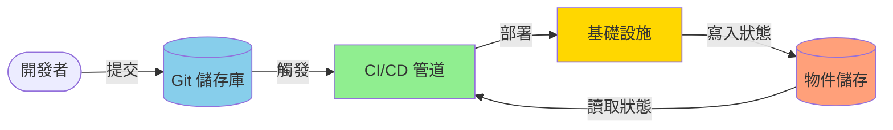

## 什麼是 GitOps？

想像一下：凌晨 3 點，部署出錯了。你不必瘋狂地點擊 Jenkins UI 試圖記住你改變了什麼，而是簡單地執行 `git revert` 並重新部署。這就是 GitOps 的力量。

GitOps 意味著像管理 Git 中的程式碼一樣管理你的整個基礎設施——每個變更都被追蹤，每個部署都可重現，每個回滾只需一次提交。

GitOps 是一種使用 Git 作為單一事實來源來管理基礎設施和應用程式的方法。它讓你在程式碼中定義所需狀態，然後使用工具將該狀態應用到你的環境中。GitOps 實現持續交付，因為 Git 儲存庫中的任何變更都會觸發部署新版本程式碼的管道。

## Jenkins 管道的 GitOps

在 Jenkins 管道的上下文中，GitOps 可用於透過將管道配置視為程式碼並使用 Git 管理對該程式碼的變更來管理管道。這允許開發者對其管道配置進行版本控制，與其他團隊成員協作變更，並在必要時輕鬆回滾變更。

換句話說：不是手動點擊 Jenkins UI 來建立和配置管道，而是編寫描述你想要的管道的程式碼，將其提交到 Git，並讓自動化為你建立它們。

### 使用種子腳本管理 Jenkins 管道

種子腳本是用於在 Jenkins 上建立和維護管道的腳本。它通常用 Groovy 腳本編寫。

以下是在 Jenkins 中建立管道的種子腳本範例。該腳本使用 Job DSL 外掛以宣告方式定義管道作業。腳本循環遍歷儲存庫清單並為每個儲存庫建立管道作業。每個管道的步驟詳細資訊從其自己儲存庫中的 Jenkinsfile 引用。

三個管道可能看起來不太令人印象深刻。但考慮為多個環境建立管道——這就是種子腳本真正發揮作用的地方。

雖然種子腳本可用於定義管道中的詳細步驟，但重要的是保持這些腳本簡單並專注於管理管道。保持種子腳本簡單使其更容易維護並與其他團隊成員協作。

!!!tip "💡 最佳實踐"
    保持你的種子腳本專注於管道結構和配置。將實際的管道邏輯儲存在每個儲存庫內的 Jenkinsfile 中。這種關注點分離使兩者都更容易維護。

### 使用種子腳本的好處

使用種子腳本可以帶來幾個好處，包括：

- **自動化**：你可以根據 Git 儲存庫中的變更自動建立和更新 Jenkins 管道。這減少了手動錯誤並節省了時間和精力。
- **不可變性**：你可以保持 Jenkins 管道不可變，這意味著它們在建立後不會手動修改。這確保了不同環境和階段之間的一致性和可靠性。
- **版本控制**：你可以使用 Git 提交和分支追蹤 Jenkins 管道的歷史和變更。這使你能夠回滾到以前的版本、比較不同版本並稽核變更。
- **協作**：你可以使用 Git 功能（如拉取請求、程式碼審查和合併衝突）與其他開發者和團隊協作處理 Jenkins 管道。這提高了管道的品質和安全性。
- **恢復**：如果 Jenkins 意外損壞或刪除，你可以使用種子作業從 Git 儲存庫重新部署管道。
- **可移植性**：你可以使用 GitOps 在另一個 Jenkins 伺服器上建立相同的管道集。這在你想使用 Jenkins/外掛升級測試管道時特別有用。

### 挑戰和解決方案

然而，當使用 GitOps 產生 Jenkins 管道時，你需要注意一些挑戰。

!!!warning "⚠️ 管道刪除和稽核日誌"
    當你使用 GitOps 產生 Jenkins 管道時，你也可以使用 GitOps 在不再需要時銷毀它們。然而，如果你需要保留管道執行的輸出（控制台日誌）以進行稽核或故障排除，這可能會導致問題。

**要考慮的解決方案：**

1. **外部日誌儲存**：在刪除管道之前，使用單獨的儲存系統（如 Elasticsearch、CloudWatch 或 S3）歸檔日誌
2. **軟刪除**：將管道標記為已棄用，而不是立即刪除它們
3. **保留策略**：實施具有可配置保留期的自動歸檔

### 安全考慮

!!!danger "🔒 安全最佳實踐"
    GitOps 引入了新的安全考慮，因為你的管道配置儲存在 Git 中。

**關鍵安全實踐：**

- **憑證管理**：永遠不要在種子腳本中儲存憑證。使用 Jenkins 憑證外掛並透過 ID 引用它們
- **存取控制**：實施分支保護並要求對種子腳本變更進行程式碼審查
- **稽核追蹤**：啟用 Git 提交簽署以驗證變更的真實性
- **最小權限**：僅授予種子作業建立/更新管道所需的權限

### 狀態管理模式

隨著你的 GitOps 實施成熟，你需要決定如何處理狀態——實際部署的內容與 Git 中定義的內容的記錄。

!!!anote "📦 狀態同步：物件儲存 vs Git 版本控制"
    雖然 GitOps 傳統上使用 Git 進行狀態管理，但一些團隊將狀態儲存在物件儲存（S3、Azure Blob）中，而不是在 Git 中進行版本控制。
    
    **為什麼使用物件儲存來儲存狀態？**
    
    - **大小限制**：Terraform 狀態檔案或大型配置輸出可能會使 Git 儲存庫膨脹，使複製變慢且歷史記錄笨重
    - **二進位資料**：狀態檔案通常包含二進位或頻繁變更的資料，這些資料不會從 Git 的差異功能中受益
    - **並行性**：具有鎖定機制的物件儲存（如 S3 + DynamoDB）比 Git 合併衝突更好地防止並行修改
    - **效能**：使用物件儲存讀取/寫入大型狀態檔案比 Git 操作更快
    - **關注點分離**：配置（Git）與執行時狀態（物件儲存）本質上是不同的——一個是意圖，另一個是現實
    
    把它想像成建築計畫與檢查報告：你對藍圖進行版本控制（Git），但將檢查結果儲存在檔案櫃中（物件儲存）。

## 超越 Jenkins：無處不在的 GitOps

GitOps 是一個概念，你可以透過使用 Git 作為單一事實來源來應用於自動化一切營運。Jenkins 只是其中一個應用程式。相同的原則適用於：

- **基礎設施即代碼**：Terraform、CloudFormation、Pulumi
- **Kubernetes**：ArgoCD、Flux 用於叢集管理
- **配置管理**：Ansible、Chef、Puppet
- **監控**：Grafana 儀表板、Prometheus 規則

!!!success "✨ 關鍵要點"
    GitOps 將營運從手動、容易出錯的流程轉變為自動化、可稽核和可重現的工作流程。透過將一切視為程式碼並使用 Git 作為事實來源，你可以獲得整個基礎設施的版本控制、協作和可靠性。

!!!tip "🚀 入門"
    準備為你的 Jenkins 管道實施 GitOps？
    
    1. **從小處開始**：將一個手動管道轉換為種子腳本
    2. **在沙盒中測試**：首先使用非生產 Jenkins 實例
    3. **逐步擴展**：一旦你感到舒適，新增更多管道
    4. **新增可觀察性**：一旦穩定，實施監控和警報
    5. **記錄模式**：為你的團隊建立範本以遵循
