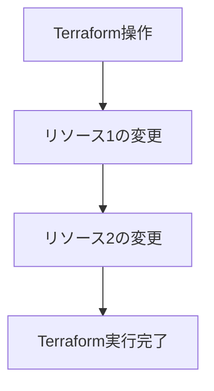
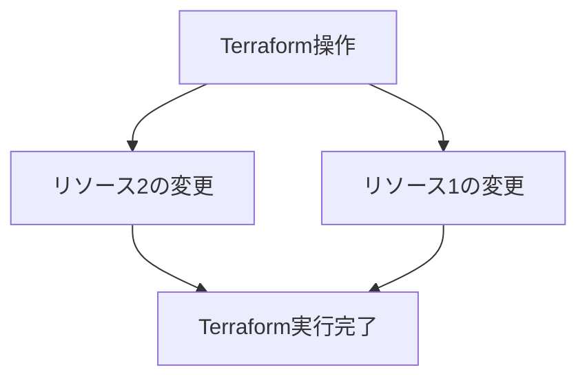

Terraformはインフラストラクチャをコードとして管理するための優れたツールですが、問題が発生したときにデバッグするのが難しい場合があります。このブログ投稿では、Terraformの問題をトラブルシューティングする方法についてのヒントを共有します。

## デバッグログの有効化

`TF_LOG`環境変数を使用すると、Terraformのログレベルを設定できます。これは、Terraformが舞台裏で何をしているかについての詳細を取得するのに役立ちます。次のいずれかの値に設定できます：`TRACE`、`DEBUG`、`INFO`、`WARN`、または`ERROR`。デフォルトは`INFO`で、高レベルのメッセージのみを表示します。より詳細な出力を取得するには、`DEBUG`に設定できます。`TRACE`には`DEBUG`の詳細が含まれますが、ほとんどのデバッグには必要のない依存関係分析の詳細も含まれます。たとえば、Terraformを実行する前に次のコマンドを実行できます：

`export TF_LOG=DEBUG`の後に`terraform plan`

または1行で実行

`export TF_LOG=DEBUG && terraform plan`

`TF_LOG_PATH`環境変数を指定すると、ログはファイルに保存されます。

## TF_LOG_COREとTF_LOG_PROVIDER

デバッグログは膨大で、100MBを超えることがあります！プロバイダーのデバッグに集中したい場合は、`TF_LOG`の引数を使用して`TF_LOG_PROVIDER`を使用する必要があります。依存関係に問題があると疑われる場合は、`TF_LOG_CORE`を使用する必要があります。

## 依存関係と並列処理

Terraformは実行前にTerraformモジュール間の依存関係を分析します。依存関係分析により、リソースが正しい順序でプロビジョニングされることが保証されます。同時に、Terraformは分析結果を使用して、並行してプロビジョニングまたは変更できる独立したリソースのセットを識別することで、操作の効率的な並列実行を行います。ただし、並行実行からのログは非常に読みにくく、`plan`と`apply`のパラメータ`-parallelism=1`で並行性を無効にする必要があります。

`-parallelism=1`を使用すると、リソースは一度に1つずつ順番に作成/変更/破棄されます。これにより、各リソースが一度に1つずつ実行されるため、デバッグとトラブルシューティングが容易になります。例：`terraform apply -parallelism=1`：

`-parallelism`が指定されていない場合、デフォルト値は10です。リソースは並行して作成/変更/破棄され、より高速な実行が可能になります。ただし、複数のリソースが同時に実行されるため、問題のデバッグとトラブルシューティングがより困難になる可能性があります。例：`terraform apply`：

