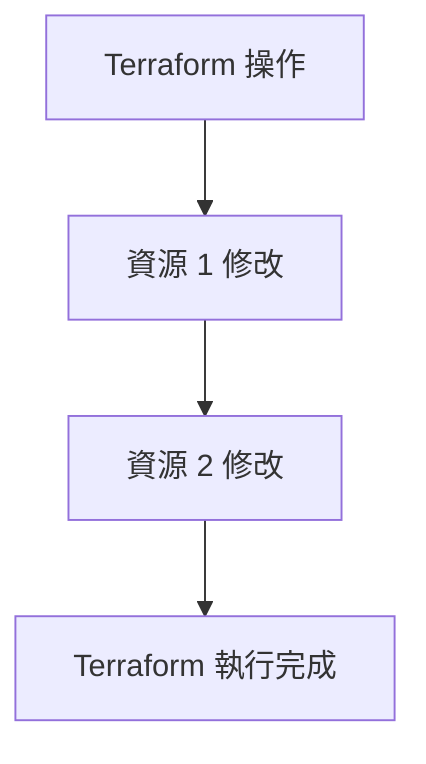
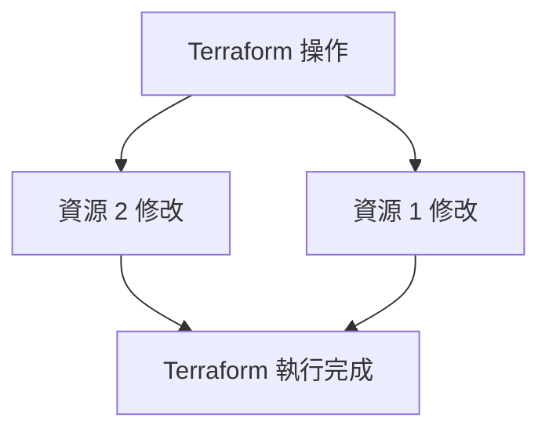

Terraform 是管理基礎設施即程式碼的絕佳工具，但有時當出現問題時，除錯可能會很棘手。在這篇部落格文章中，我將分享如何排除 Terraform 問題的技巧。

## 啟用除錯日誌
`TF_LOG` 環境變數允許您設定 Terraform 的日誌層級，這對於獲取有關 Terraform 在幕後執行的更多詳細資訊很有用。您可以將其設定為以下值之一：`TRACE`、`DEBUG`、`INFO`、`WARN` 或 `ERROR`。預設值為 `INFO`，僅顯示高層級訊息。要獲得更詳細的輸出，您可以將其設定為 `DEBUG`。`TRACE` 包含來自 `DEBUG` 的詳細資訊，但包括大多數除錯不需要的相依性分析詳細資訊。例如，您可以在執行 Terraform 之前執行此命令：

`export TF_LOG=DEBUG` 然後 `terraform plan`

或在單行中執行

`export TF_LOG=DEBUG && terraform plan`

如果您指定 `TF_LOG_PATH` 環境變數，日誌將儲存在檔案中。

## TF_LOG_CORE 和 TF_LOG_PROVIDER

除錯日誌可能非常龐大，超過 100MB！如果您想專注於除錯提供者，您應該使用 `TF_LOG_PROVIDER` 搭配來自 `TF_LOG` 的參數。如果您懷疑相依性有問題，您應該使用 `TF_LOG_CORE`。

## 相依性和平行處理
Terraform 在執行前分析 Terraform 模組之間的相依性。相依性分析確保資源以正確的順序配置。同時，Terraform 使用分析結果透過識別可以同時配置或修改的獨立資源集來有效地平行執行操作。然而，來自並行執行的日誌非常難以閱讀，我們必須在 `plan` 和 `apply` 上使用參數 `-parallelism=1` 停用並行性。

使用 `-parallelism=1`，資源會依序一次建立/修改/銷毀一個。這允許更容易的除錯和故障排除，因為每個資源一次執行一個。例如，`terraform apply -parallelism=1`：

當未指定 `-parallelism` 時，預設值為 10。資源會平行建立/修改/銷毀，允許更快的執行。然而，這也可能使除錯和故障排除問題變得更加困難，因為多個資源同時執行。例如，`terraform apply`：

