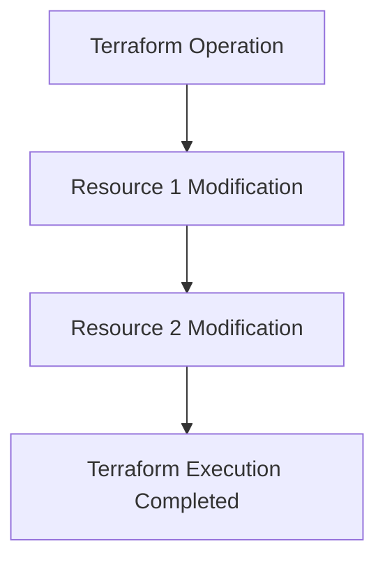
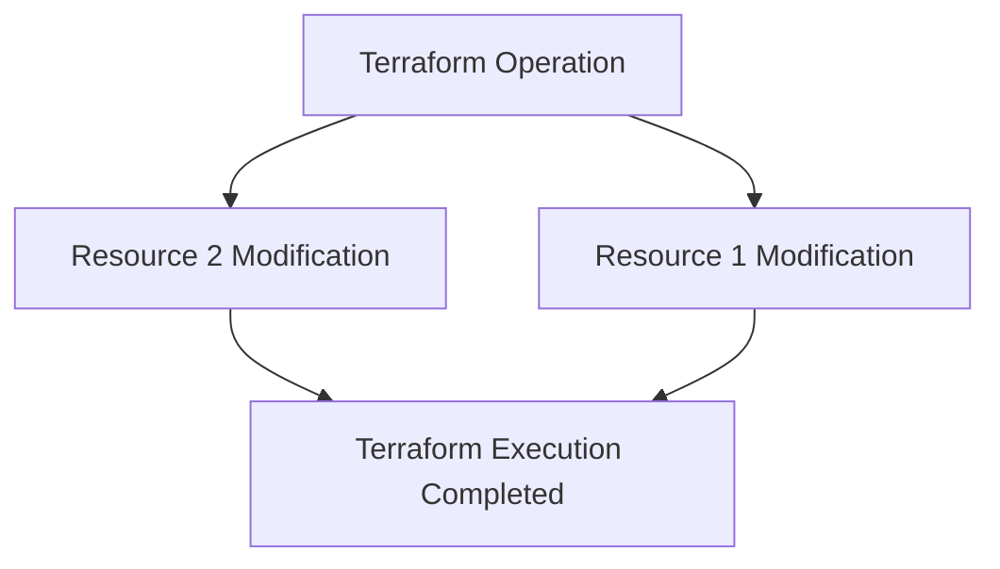

Terraform is a great tool for managing infrastructure as code, but sometimes it can be tricky to debug when things go wrong. In this blog post, I'll share tips on how to troubleshoot Terraform issues.

## Enabling Debug Log
The `TF_LOG` environment variable allows you to set the log level for Terraform, which can be useful for getting more details about what Terraform is doing behind the scenes. You can set it to one of these values: `TRACE`, `DEBUG`, `INFO`, `WARN`, or `ERROR`. The default is `INFO`, which only shows high-level messages. To get more verbose output, you can set it to `DEBUG`. `TRACE` has details from `DEBUG` but includes dependency analysis details that are not needed for most debugging. For example, you can run this command before running Terraform:

`export TF_LOG=DEBUG` and then `terraform plan`

or run it in a single line

`export TF_LOG=DEBUG && terraform plan`

If you specify the `TF_LOG_PATH` environment variable, logs will be stored in the file.

## TF_LOG_CORE and TF_LOG_PROVIDER

The debug log can be massive and over 100MB! If you would like to focus on debugging a provider, you should use `TF_LOG_PROVIDER` with arguments from `TF_LOG`. If you suspect a problem with dependencies, you should use `TF_LOG_CORE`.

## Dependency and Parallelism
Terraform analyzes dependencies between Terraform modules before execution. Dependency analysis ensures resources are provisioned in the correct order. Meanwhile, Terraform uses the analysis results for efficient parallel execution of operations by identifying independent sets of resources that can be provisioned or modified concurrently. However, logs from concurrent execution are very difficult to read, and we have to disable the concurrency with the parameter `-parallelism=1` on `plan` and `apply`.

With `-parallelism=1`, resources are created/modified/destroyed one at a time, in sequence. This allows for easier debugging and troubleshooting, as each resource is executed one at a time. e.g., `terraform apply -parallelism=1`:

When `-parallelism` is not specified, the default value is 10. The resources are created/modified/destroyed in parallel, allowing for faster execution. However, this can also make it more difficult to debug and troubleshoot issues, as multiple resources are executed simultaneously. e.g., `terraform apply`:

