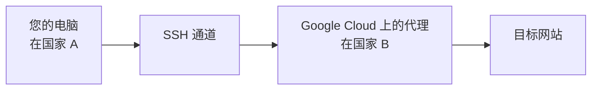

啊，互联网 - 一个充满知识和猫咪视频的广阔空间。但当您在这个数字海洋中航行时，您可能会发现自己想要更多隐私，或者您只是厌倦了根据您的位置被告知可以和不可以查看什么内容...

## VPN 和代理服务定价模式的问题

让我们快速看一下截至 2025 年 10 月的 VPN 服务价格

|VPN 提供商|每月价格（美元）|订阅每月价格（美元）|
|---|---|---|
|Surfshark（入门版）|$15.45|2 年订阅 $1.99|
|ExpressVPN（基本版）|$12.99|2 年订阅 $3.49|

最好的按需付费选项是按月计费。按使用量付费的模式不存在，我们被迫采用基于订阅的模式。基于订阅的模式就像雇用一个坚持签订一年合约的保镖，而您只需要有人在每月一次的可疑回家路上保护您。像我这样的省钱达人不接受这种订阅优惠。

## 按需云端代理

现在，让我们检视可用于您的 VPN/代理冒险的云端服务。您可以在云端上创建 VPN/代理服务器。为简单起见，让我们从 Google Cloud 上的代理服务器开始。以下是它的工作原理：



流程图说明了在 Google Cloud 上设置代理服务器。您的电脑（PC）在国家 A，您想访问受限制或因您的位置而被封锁内容的目标网站（target）。您从电脑创建 SSH 通道（ssh）到 Google Cloud 上的代理服务器（proxy），该服务器位于国家 B。这允许您绕过地理限制并访问目标网站，就像您在国家 B 一样。

### 提供商 1. Google Cloud

以下是在 Google Cloud 上创建带有代理（squid）的计算引擎的 Terraform 脚本。


resource "google_compute_instance" "default" {
  name         = "proxy-server"
  machine_type = "e2-micro"
  zone         = "us-west1-a"
  tags         = ["ssh"]

  scheduling {
    provisioning_model = "SPOT"
    automatic_restart  = false
    preemptible        = true
  }

  boot_disk {
    initialize_params {
      image = "ubuntu-os-cloud/ubuntu-2004-lts"
    }
  }

  network_interface {
    network = "default"
    access_config {
      // Ephemeral public IP
      network_tier = "STANDARD"
    }
  }

  service_account {
    scopes = ["cloud-platform"]
  }

  metadata = {
    ssh-keys       = format("%s:%s", var.ssh_username, var.ssh_public_key)
    startup-script = "sudo apt-get update;sudo apt-get install -y squid;sudo systemctl start squid"
  }
}


https://github.com/neoalienson/cloud_vpn_proxy/blob/main/server/modules/google/main.tf


variable "ssh_username" {
  type        = string
  description = "username of SSH to the compute engine"
}

variable "ssh_public_key" {
  type        = string
  description = "Public key for SSH"
}


https://github.com/neoalienson/cloud_vpn_proxy/blob/main/server/modules/google/variables.tf


output "ip" {
  value = google_compute_instance.default.network_interface.0.access_config.0.nat_ip
}

output "command" {
  description = "Command to setup ssh tunnel to the proxy server"
  value = format("ssh-keygen -R %s; ssh -L3128:localhost:3128 %s@%s",
    google_compute_instance.default.network_interface.0.access_config.0.nat_ip,
    var.ssh_username,
  google_compute_instance.default.network_interface.0.access_config.0.nat_ip)
}


https://github.com/neoalienson/cloud_vpn_proxy/blob/main/server/modules/google/output.tf

执行 `terraform apply`：


$ terraform apply

var.google_access_credentials
  The json file that contains key of your service account in Google Cloud

  Enter a value: a.josn

var.project
  Google Cloud Project Name

  Enter a value: a

var.ssh_public_key
  Public key for SSH

  Enter a value: ssh-rsa AAAAB...

var.ssh_username
  username of SSH to the compute engine

  Enter a value: neo

Terraform used the selected providers to generate the following execution plan. Resource actions are indicated with the
following symbols:
  + create

Terraform will perform the following actions:

  # google_compute_instance.default will be created
  + resource "google_compute_instance" "default" {
      ...
      + machine_type         = "e2-micro"
      + metadata             = {
          + "ssh-keys"       = "neo:ssh-rsa AAAAB..."
          + "startup-script" = "sudo apt-get update;sudo apt-get install -y squid;sudo systemctl start squid"
        }
      ...
    }

Plan: 1 to add, 0 to change, 0 to destroy.

Changes to Outputs:
  + command = (known after apply)
  + ip      = (known after apply)

Do you want to perform these actions?
  Terraform will perform the actions described above.
  Only 'yes' will be accepted to approve.

  Enter a value: yes

google_compute_instance.default: Creating...
google_compute_instance.default: Still creating... [10s elapsed]
google_compute_instance.default: Creation complete after 17s [id=projects/a/zones/us-west1-a/instances/proxy-server]

Apply complete! Resources: 1 added, 0 changed, 0 destroyed.

Outputs:

command = "ssh -L3128:localhost:3128 neo@123.123.123.123"
ip = "123.123.123.123"


要设置到代理的 SSH 通道，请使用输出 `command` 中提供的命令。您可能需要等待片刻，直到代理准备就绪。一旦代理准备就绪，您的浏览器就可以使用 `localhost:3128` 作为代理。

当云端服务重复使用 IP 地址来创建新的计算实例时，如果您之前曾 SSH 到该 IP 地址，您可能会遇到主机验证错误。这是因为新的计算实例生成了新的主机密钥，该密钥与您在 `.ssh/known_hosts` 中信任的密钥不符。要解决此问题，您可以使用 `ssh-keygen -R` 删除受信任的主机密钥，或将私钥从本机发送到新的计算实例。

完成后记得销毁计算引擎：


$ terraform destroy

google_compute_instance.default: Refreshing state... [id=projects/f-01man-com/zones/us-west1-a/instances/proxy-server]

Terraform used the selected providers to generate the following execution plan. Resource actions are indicated with the
following symbols:
  - destroy

Terraform will perform the following actions:

  # google_compute_instance.default will be destroyed
  - resource "google_compute_instance" "default" {
      ...
    }

Plan: 0 to add, 0 to change, 1 to destroy.

Do you really want to destroy all resources?
  Terraform will destroy all your managed infrastructure, as shown above.
  There is no undo. Only 'yes' will be accepted to confirm.

  Enter a value: yes

google_compute_instance.default: Destroying... [id=projects/a/zones/us-west1-a/instances/proxy-server]
google_compute_instance.default: Still destroying... [id=projects/a/zones/us-west1-a/instances/proxy-server, 10s elapsed]
google_compute_instance.default: Destruction complete after 16s

Destroy complete! Resources: 1 destroyed.


鉴于我的使用量极低，例如每月 30 分钟，Google 每月向我收取约 0.20 美元。然而，这并不能阻止我探索其他更便宜的替代方案。

### 提供商 2. Azure


resource "azurerm_resource_group" "rg" {
  name     = "squid-rg"
  location = "West US"
}

resource "azurerm_virtual_machine" "proxy" {
  name = "squid-proxy-vm"

  # charge you if you dont delete
  delete_data_disks_on_termination = true
  delete_os_disk_on_termination    = true

  resource_group_name   = azurerm_resource_group.rg.name
  location              = azurerm_resource_group.rg.location
  network_interface_ids = [azurerm_network_interface.nic.id]
  vm_size               = "Standard_B1s"
  storage_os_disk {
    name              = "os"
    caching           = "ReadWrite"
    managed_disk_type = "Standard_LRS"
    create_option     = "FromImage"
    os_type           = "Linux"
  }

  storage_image_reference {
    publisher = "Canonical"
    offer     = "0001-com-ubuntu-server-jammy"
    sku       = "22_04-lts"
    version   = "latest"
  }

  os_profile {
    admin_username = var.ssh_username
    computer_name  = "proxy"
    custom_data = base64encode(<<CUSTOM_DATA
#!/bin/bash
sudo apt-get update;sudo apt-get install -y squid;sudo systemctl start squid
    CUSTOM_DATA
    )
  }

  os_profile_linux_config {
    disable_password_authentication = true
    ssh_keys {
      path = "/home/${var.ssh_username}/.ssh/authorized_keys"
      key_data = var.ssh_public_key
    }
  }
}

resource "azurerm_network_interface" "nic" {
  name                = "squid-nic"
  resource_group_name = azurerm_resource_group.rg.name
  location            = azurerm_resource_group.rg.location

  ip_configuration {
    name                          = "squid-ipconfig"
    subnet_id                     = azurerm_subnet.subnet.id
    private_ip_address_allocation = "Dynamic"
    public_ip_address_id          = azurerm_public_ip.proxy.id
  }
}

resource "azurerm_subnet" "subnet" {
  name                 = "squid-subnet"
  resource_group_name  = azurerm_resource_group.rg.name
  virtual_network_name = azurerm_virtual_network.vnet.name
  address_prefixes     = ["10.0.0.0/24"]
}

resource "azurerm_virtual_network" "vnet" {
  name                = "squid-vnet"
  resource_group_name = azurerm_resource_group.rg.name
  address_space       = ["10.0.0.0/8"]
  location            = "West US"
}

resource "azurerm_public_ip" "proxy" {
  name                = "squidPublicIp1"
  resource_group_name = azurerm_resource_group.rg.name
  location            = azurerm_resource_group.rg.location
  allocation_method   = "Static"

  lifecycle {
    create_before_destroy = true
  }
}


https://github.com/neoalienson/cloud_vpn_proxy/blob/main/server/modules/azure/main.tf


variable "ssh_username" {
    type        = string
    description = "username of SSH to the compute engine"
}

variable "ssh_public_key" {
    type       = string
    description = "Public key for SSH"
}


https://github.com/neoalienson/cloud_vpn_proxy/blob/main/server/modules/azure/variables.tf


output "ip" {
    value = azurerm_public_ip.proxy.ip_address
}

output "command" {
    description = "Command to setup ssh tunnel to the proxy server"
    value       = format("ssh-keygen -R %s; ssh -L3128:localhost:3128 %s@%s",
      azurerm_public_ip.proxy.ip_address,
      var.ssh_username,
      azurerm_public_ip.proxy.ip_address)
}


https://github.com/neoalienson/cloud_vpn_proxy/blob/main/server/modules/azure/output.tf

创建和销毁需要时间。您可以检查 `/var/log/cloud-init.log` 并寻找 `subp.py` 和 `part` 来进行故障排除，例如：


2024-05-07 14:14:02,864 - subp.py[DEBUG]: Running command ['/var/lib/cloud/instance/scripts/part-001'] with allowed return codes [0] (shell=False, capture=False)
2024-05-07 14:14:02,864 - subp.py[DEBUG]: Exec format error. Missing #! in script?
Command: ['/var/lib/cloud/instance/scripts/part-001']
Exit code: -
Reason: [Errno 8] Exec format error: b'/var/lib/cloud/instance/scripts/part-001'


### 其他云端服务提供商

我也尝试过阿里云和华为云。然而，阿里云在使用来自中国以外国家的 IP 地址和资源几次后需要账户验证，要求我上传护照等。此外，最低计算服务是按月计费，而不是像 Google Cloud 那样基于消费。

另一方面，华为云更好；计算服务可以基于消费。然而，带宽费用是按日订阅而不是计量，导致每日费用为 2 美元！因此，我不建议省钱达人使用阿里云和华为云。

### 云端不可知 Terraform 脚本

现在我们有 2 个云端提供商选项，Azure 和 Google。我们想创建云端不可知的 Terraform 脚本，因为它允许我们维护一组代码并将其应用于多个云端提供商。这种方法允许我们在需要时轻松切换不同的云端服务提供商。云端不可知架构加上省钱！

让我们将文件夹结构如下：

```
\ - root
    \ - main.tf
      - variables.tf
      - output.tf
      - provider.tf
    \ - modules
        \ - google
            \ - main.tf
              - variables.tf
              - output.tf
        \ - azure
            \ - main.tf
              - variables.tf
              - output.tf
```

`root` 文件夹作为云端不可知的抽象层，而 `modules` 下的子文件夹，即 `modules/azure` 和 `modules/google`，作为云端特定的实现。您可以期望从执行 `root` 脚本中通过提供您的用户名和公钥来配置云端服务器，并从输出返回设置 SSH 通道的命令。使用哪个提供商取决于 `cloud_service_provider` 变量，从示例中可以是 `azure` 或 `google`。


variable "cloud_service_provider" {
  type        = string
  description = "Cloud Service Provider: azure or google"

  validation {
    condition     = contains(["azure", "google"], var.cloud_service_provider)
    error_message = "Valid values for var: cloud_service_provider are (azure, google)."
  }
}

variable "ssh_username" {
  type        = string
  description = "username of SSH to the compute engine"
}

variable "ssh_public_key" {
  type        = string
  description = "Public key for SSH"
}

variable "google_project" {
  type        = string
  default     = "no project"
  description = "Google Cloud Project Name."
}

locals {
  # cross variables validation could be improved in Terraform v1.9.0
  # tflint-ignore: terraform_unused_declarations
  validate_project = (var.google_project == "no project" && var.cloud_service_provider == "google") ? tobool(
  "google_project must be provided when the provider is 'google'.") : true
}


https://github.com/neoalienson/cloud_vpn_proxy/blob/main/server/variables.tf

`/main.tf` 非常简单，它根据需求启用模块来实现云端代理并停用其他模块：


module "azure_server" {
  source = "./modules/azure"
  count  = (var.cloud_service_provider == "azure") ? 1 : 0

  ssh_public_key = var.ssh_public_key
  ssh_username   = var.ssh_username
}

module "google_server" {
  source         = "./modules/google"
  count          = (var.cloud_service_provider == "google") ? 1 : 0
  ssh_public_key = var.ssh_public_key
  ssh_username   = var.ssh_username
}


https://github.com/neoalienson/cloud_vpn_proxy/blob/main/server/main.tf

`/output.tf` 与 `/main.tf` 类似，它也返回 `ip` 和 `command`：


output "ip" {
  value = (var.cloud_service_provider == "azure") ? module.azure_server[0].ip : module.google_server[0].ip
}

output "command" {
  description = "Command to setup ssh tunnel to the proxy server"
  value       = (var.cloud_service_provider == "azure") ? module.azure_server[0].command : module.google_server[0].command
}


https://github.com/neoalienson/cloud_vpn_proxy/blob/main/server/output.tf

Terraform 脚本中的提供商从模块中删除并放在一起到 `/provider.tf` 中。


terraform {
  required_providers {
    azapi = {
      source = "Azure/azapi"
    }
    azurerm = {
      source = "hashicorp/azurerm"
    }
    google = {
      source = "hashicorp/google"
    }
  }
}

provider "azapi" {
}

provider "azurerm" {
  features {}
}

provider "google" {
  project = var.google_project
  region  = "us-central1"
}


https://github.com/neoalienson/cloud_vpn_proxy/blob/main/server/provider.tf

> 完整源代码：https://github.com/neoalienson/cloud_vpn_proxy/blob/main/server/



### 代理就绪通知

*即将推出...*

## 价格比较

### Azure

虚拟机
虚拟网络
存储
带宽

### Google Cloud

计算引擎
网络

*即将推出...*

## 使用 WireGuard 的 VPN

*即将推出...*

## 用户友好的开关

*即将推出...*

## 关闭提醒

*即将推出...*
