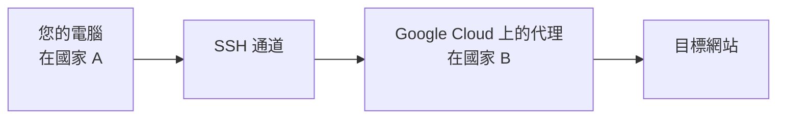

啊，網際網路 - 一個充滿知識和貓咪影片的廣闊空間。但當您在這個數位海洋中航行時，您可能會發現自己想要更多隱私，或者您只是厭倦了根據您的位置被告知可以和不可以查看什麼內容...

## VPN 和代理服務定價模式的問題

讓我們快速看一下截至 2025 年 10 月的 VPN 服務價格

|VPN 提供商|每月價格（美元）|訂閱每月價格（美元）|
|---|---|---|
|Surfshark（入門版）|$15.45|2 年訂閱 $1.99|
|ExpressVPN（基本版）|$12.99|2 年訂閱 $3.49|

最好的按需付費選項是按月計費。按使用量付費的模式不存在，我們被迫採用基於訂閱的模式。基於訂閱的模式就像僱用一個堅持簽訂一年合約的保鑣，而您只需要有人在每月一次的可疑回家路上保護您。像我這樣的省錢達人不接受這種訂閱優惠。

## 按需雲端代理

現在，讓我們檢視可用於您的 VPN/代理冒險的雲端服務。您可以在雲端上建立 VPN/代理伺服器。為簡單起見，讓我們從 Google Cloud 上的代理伺服器開始。以下是它的工作原理：



流程圖說明了在 Google Cloud 上設定代理伺服器。您的電腦（PC）在國家 A，您想存取受限制或因您的位置而被封鎖內容的目標網站（target）。您從電腦建立 SSH 通道（ssh）到 Google Cloud 上的代理伺服器（proxy），該伺服器位於國家 B。這允許您繞過地理限制並存取目標網站，就像您在國家 B 一樣。

### 提供商 1. Google Cloud

以下是在 Google Cloud 上建立帶有代理（squid）的運算引擎的 Terraform 腳本。


resource "google_compute_instance" "default" {
  name         = "proxy-server"
  machine_type = "e2-micro"
  zone         = "us-west1-a"
  tags         = ["ssh"]

  scheduling {
    provisioning_model = "SPOT"
    automatic_restart  = false
    preemptible        = true
  }

  boot_disk {
    initialize_params {
      image = "ubuntu-os-cloud/ubuntu-2004-lts"
    }
  }

  network_interface {
    network = "default"
    access_config {
      // Ephemeral public IP
      network_tier = "STANDARD"
    }
  }

  service_account {
    scopes = ["cloud-platform"]
  }

  metadata = {
    ssh-keys       = format("%s:%s", var.ssh_username, var.ssh_public_key)
    startup-script = "sudo apt-get update;sudo apt-get install -y squid;sudo systemctl start squid"
  }
}


https://github.com/neoalienson/cloud_vpn_proxy/blob/main/server/modules/google/main.tf


variable "ssh_username" {
  type        = string
  description = "username of SSH to the compute engine"
}

variable "ssh_public_key" {
  type        = string
  description = "Public key for SSH"
}


https://github.com/neoalienson/cloud_vpn_proxy/blob/main/server/modules/google/variables.tf


output "ip" {
  value = google_compute_instance.default.network_interface.0.access_config.0.nat_ip
}

output "command" {
  description = "Command to setup ssh tunnel to the proxy server"
  value = format("ssh-keygen -R %s; ssh -L3128:localhost:3128 %s@%s",
    google_compute_instance.default.network_interface.0.access_config.0.nat_ip,
    var.ssh_username,
  google_compute_instance.default.network_interface.0.access_config.0.nat_ip)
}


https://github.com/neoalienson/cloud_vpn_proxy/blob/main/server/modules/google/output.tf

執行 `terraform apply`：


$ terraform apply

var.google_access_credentials
  The json file that contains key of your service account in Google Cloud

  Enter a value: a.josn

var.project
  Google Cloud Project Name

  Enter a value: a

var.ssh_public_key
  Public key for SSH

  Enter a value: ssh-rsa AAAAB...

var.ssh_username
  username of SSH to the compute engine

  Enter a value: neo

Terraform used the selected providers to generate the following execution plan. Resource actions are indicated with the
following symbols:
  + create

Terraform will perform the following actions:

  # google_compute_instance.default will be created
  + resource "google_compute_instance" "default" {
      ...
      + machine_type         = "e2-micro"
      + metadata             = {
          + "ssh-keys"       = "neo:ssh-rsa AAAAB..."
          + "startup-script" = "sudo apt-get update;sudo apt-get install -y squid;sudo systemctl start squid"
        }
      ...
    }

Plan: 1 to add, 0 to change, 0 to destroy.

Changes to Outputs:
  + command = (known after apply)
  + ip      = (known after apply)

Do you want to perform these actions?
  Terraform will perform the actions described above.
  Only 'yes' will be accepted to approve.

  Enter a value: yes

google_compute_instance.default: Creating...
google_compute_instance.default: Still creating... [10s elapsed]
google_compute_instance.default: Creation complete after 17s [id=projects/a/zones/us-west1-a/instances/proxy-server]

Apply complete! Resources: 1 added, 0 changed, 0 destroyed.

Outputs:

command = "ssh -L3128:localhost:3128 neo@123.123.123.123"
ip = "123.123.123.123"


要設定到代理的 SSH 通道，請使用輸出 `command` 中提供的命令。您可能需要等待片刻，直到代理準備就緒。一旦代理準備就緒，您的瀏覽器就可以使用 `localhost:3128` 作為代理。

當雲端服務重複使用 IP 位址來建立新的運算實例時，如果您之前曾 SSH 到該 IP 位址，您可能會遇到主機驗證錯誤。這是因為新的運算實例生成了新的主機金鑰，該金鑰與您在 `.ssh/known_hosts` 中信任的金鑰不符。要解決此問題，您可以使用 `ssh-keygen -R` 刪除受信任的主機金鑰，或將私鑰從本機發送到新的運算實例。

完成後記得銷毀運算引擎：


$ terraform destroy

google_compute_instance.default: Refreshing state... [id=projects/f-01man-com/zones/us-west1-a/instances/proxy-server]

Terraform used the selected providers to generate the following execution plan. Resource actions are indicated with the
following symbols:
  - destroy

Terraform will perform the following actions:

  # google_compute_instance.default will be destroyed
  - resource "google_compute_instance" "default" {
      ...
    }

Plan: 0 to add, 0 to change, 1 to destroy.

Do you really want to destroy all resources?
  Terraform will destroy all your managed infrastructure, as shown above.
  There is no undo. Only 'yes' will be accepted to confirm.

  Enter a value: yes

google_compute_instance.default: Destroying... [id=projects/a/zones/us-west1-a/instances/proxy-server]
google_compute_instance.default: Still destroying... [id=projects/a/zones/us-west1-a/instances/proxy-server, 10s elapsed]
google_compute_instance.default: Destruction complete after 16s

Destroy complete! Resources: 1 destroyed.


鑑於我的使用量極低，例如每月 30 分鐘，Google 每月向我收取約 0.20 美元。然而，這並不能阻止我探索其他更便宜的替代方案。

### 提供商 2. Azure


resource "azurerm_resource_group" "rg" {
  name     = "squid-rg"
  location = "West US"
}

resource "azurerm_virtual_machine" "proxy" {
  name = "squid-proxy-vm"

  # charge you if you dont delete
  delete_data_disks_on_termination = true
  delete_os_disk_on_termination    = true

  resource_group_name   = azurerm_resource_group.rg.name
  location              = azurerm_resource_group.rg.location
  network_interface_ids = [azurerm_network_interface.nic.id]
  vm_size               = "Standard_B1s"
  storage_os_disk {
    name              = "os"
    caching           = "ReadWrite"
    managed_disk_type = "Standard_LRS"
    create_option     = "FromImage"
    os_type           = "Linux"
  }

  storage_image_reference {
    publisher = "Canonical"
    offer     = "0001-com-ubuntu-server-jammy"
    sku       = "22_04-lts"
    version   = "latest"
  }

  os_profile {
    admin_username = var.ssh_username
    computer_name  = "proxy"
    custom_data = base64encode(<<CUSTOM_DATA
#!/bin/bash
sudo apt-get update;sudo apt-get install -y squid;sudo systemctl start squid
    CUSTOM_DATA
    )
  }

  os_profile_linux_config {
    disable_password_authentication = true
    ssh_keys {
      path = "/home/${var.ssh_username}/.ssh/authorized_keys"
      key_data = var.ssh_public_key
    }
  }
}

resource "azurerm_network_interface" "nic" {
  name                = "squid-nic"
  resource_group_name = azurerm_resource_group.rg.name
  location            = azurerm_resource_group.rg.location

  ip_configuration {
    name                          = "squid-ipconfig"
    subnet_id                     = azurerm_subnet.subnet.id
    private_ip_address_allocation = "Dynamic"
    public_ip_address_id          = azurerm_public_ip.proxy.id
  }
}

resource "azurerm_subnet" "subnet" {
  name                 = "squid-subnet"
  resource_group_name  = azurerm_resource_group.rg.name
  virtual_network_name = azurerm_virtual_network.vnet.name
  address_prefixes     = ["10.0.0.0/24"]
}

resource "azurerm_virtual_network" "vnet" {
  name                = "squid-vnet"
  resource_group_name = azurerm_resource_group.rg.name
  address_space       = ["10.0.0.0/8"]
  location            = "West US"
}

resource "azurerm_public_ip" "proxy" {
  name                = "squidPublicIp1"
  resource_group_name = azurerm_resource_group.rg.name
  location            = azurerm_resource_group.rg.location
  allocation_method   = "Static"

  lifecycle {
    create_before_destroy = true
  }
}


https://github.com/neoalienson/cloud_vpn_proxy/blob/main/server/modules/azure/main.tf


variable "ssh_username" {
    type        = string
    description = "username of SSH to the compute engine"
}

variable "ssh_public_key" {
    type       = string
    description = "Public key for SSH"
}


https://github.com/neoalienson/cloud_vpn_proxy/blob/main/server/modules/azure/variables.tf


output "ip" {
    value = azurerm_public_ip.proxy.ip_address
}

output "command" {
    description = "Command to setup ssh tunnel to the proxy server"
    value       = format("ssh-keygen -R %s; ssh -L3128:localhost:3128 %s@%s",
      azurerm_public_ip.proxy.ip_address,
      var.ssh_username,
      azurerm_public_ip.proxy.ip_address)
}


https://github.com/neoalienson/cloud_vpn_proxy/blob/main/server/modules/azure/output.tf

建立和銷毀需要時間。您可以檢查 `/var/log/cloud-init.log` 並尋找 `subp.py` 和 `part` 來進行故障排除，例如：


2024-05-07 14:14:02,864 - subp.py[DEBUG]: Running command ['/var/lib/cloud/instance/scripts/part-001'] with allowed return codes [0] (shell=False, capture=False)
2024-05-07 14:14:02,864 - subp.py[DEBUG]: Exec format error. Missing #! in script?
Command: ['/var/lib/cloud/instance/scripts/part-001']
Exit code: -
Reason: [Errno 8] Exec format error: b'/var/lib/cloud/instance/scripts/part-001'


### 其他雲端服務提供商

我也嘗試過阿里雲和華為雲。然而，阿里雲在使用來自中國以外國家的 IP 位址和資源幾次後需要帳戶驗證，要求我上傳護照等。此外，最低運算服務是按月計費，而不是像 Google Cloud 那樣基於消費。

另一方面，華為雲更好；運算服務可以基於消費。然而，頻寬費用是按日訂閱而不是計量，導致每日費用為 2 美元！因此，我不建議省錢達人使用阿里雲和華為雲。

### 雲端不可知 Terraform 腳本

現在我們有 2 個雲端提供商選項，Azure 和 Google。我們想建立雲端不可知的 Terraform 腳本，因為它允許我們維護一組程式碼並將其應用於多個雲端提供商。這種方法允許我們在需要時輕鬆切換不同的雲端服務提供商。雲端不可知架構加上省錢！

讓我們將資料夾結構如下：

```
\ - root
    \ - main.tf
      - variables.tf
      - output.tf
      - provider.tf
    \ - modules
        \ - google
            \ - main.tf
              - variables.tf
              - output.tf
        \ - azure
            \ - main.tf
              - variables.tf
              - output.tf
```

`root` 資料夾作為雲端不可知的抽象層，而 `modules` 下的子資料夾，即 `modules/azure` 和 `modules/google`，作為雲端特定的實作。您可以期望從執行 `root` 腳本中透過提供您的使用者名稱和公鑰來配置雲端伺服器，並從輸出返回設定 SSH 通道的命令。使用哪個提供商取決於 `cloud_service_provider` 變數，從範例中可以是 `azure` 或 `google`。


variable "cloud_service_provider" {
  type        = string
  description = "Cloud Service Provider: azure or google"

  validation {
    condition     = contains(["azure", "google"], var.cloud_service_provider)
    error_message = "Valid values for var: cloud_service_provider are (azure, google)."
  }
}

variable "ssh_username" {
  type        = string
  description = "username of SSH to the compute engine"
}

variable "ssh_public_key" {
  type        = string
  description = "Public key for SSH"
}

variable "google_project" {
  type        = string
  default     = "no project"
  description = "Google Cloud Project Name."
}

locals {
  # cross variables validation could be improved in Terraform v1.9.0
  # tflint-ignore: terraform_unused_declarations
  validate_project = (var.google_project == "no project" && var.cloud_service_provider == "google") ? tobool(
  "google_project must be provided when the provider is 'google'.") : true
}


https://github.com/neoalienson/cloud_vpn_proxy/blob/main/server/variables.tf

`/main.tf` 非常簡單，它根據需求啟用模組來實作雲端代理並停用其他模組：


module "azure_server" {
  source = "./modules/azure"
  count  = (var.cloud_service_provider == "azure") ? 1 : 0

  ssh_public_key = var.ssh_public_key
  ssh_username   = var.ssh_username
}

module "google_server" {
  source         = "./modules/google"
  count          = (var.cloud_service_provider == "google") ? 1 : 0
  ssh_public_key = var.ssh_public_key
  ssh_username   = var.ssh_username
}


https://github.com/neoalienson/cloud_vpn_proxy/blob/main/server/main.tf

`/output.tf` 與 `/main.tf` 類似，它也返回 `ip` 和 `command`：


output "ip" {
  value = (var.cloud_service_provider == "azure") ? module.azure_server[0].ip : module.google_server[0].ip
}

output "command" {
  description = "Command to setup ssh tunnel to the proxy server"
  value       = (var.cloud_service_provider == "azure") ? module.azure_server[0].command : module.google_server[0].command
}


https://github.com/neoalienson/cloud_vpn_proxy/blob/main/server/output.tf

Terraform 腳本中的提供商從模組中刪除並放在一起到 `/provider.tf` 中。


terraform {
  required_providers {
    azapi = {
      source = "Azure/azapi"
    }
    azurerm = {
      source = "hashicorp/azurerm"
    }
    google = {
      source = "hashicorp/google"
    }
  }
}

provider "azapi" {
}

provider "azurerm" {
  features {}
}

provider "google" {
  project = var.google_project
  region  = "us-central1"
}


https://github.com/neoalienson/cloud_vpn_proxy/blob/main/server/provider.tf

> 完整原始碼：https://github.com/neoalienson/cloud_vpn_proxy/blob/main/server/



### 代理就緒通知

*即將推出...*

## 價格比較

### Azure

虛擬機器
虛擬網路
儲存
頻寬

### Google Cloud

運算引擎
網路

*即將推出...*

## 使用 WireGuard 的 VPN

*即將推出...*

## 使用者友善的開關

*即將推出...*

## 關閉提醒

*即將推出...*
