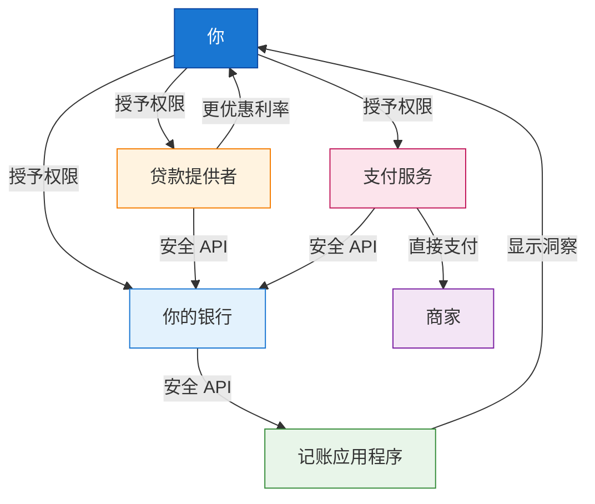
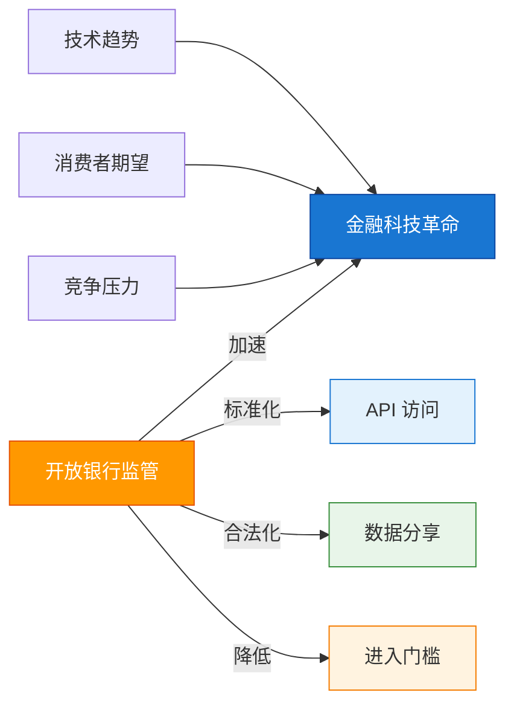
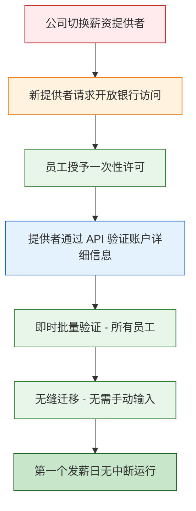
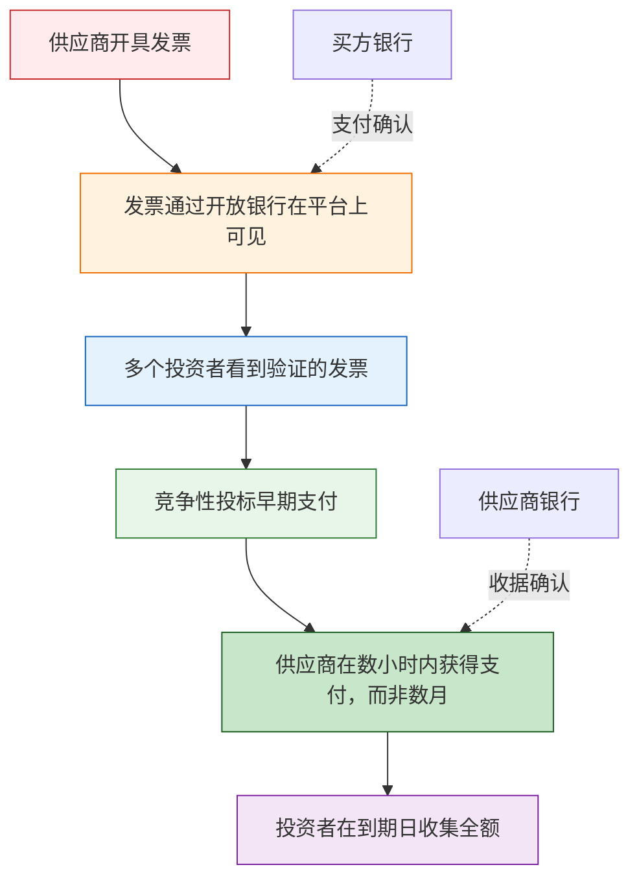

开放银行曾是金融领域最受关注的话题之一。但剥开专业术语的外衣，它实际上是一个概念简单却影响深远的系统。本文将解释什么是开放银行、为什么它对你很重要（无论你是一般消费者还是企业经营者），并探讨一个关键问题：**开放银行创造了金融科技革命，还是仅仅是解锁早已到来的革命所需的基础设施？**

## 1 开放银行背后的简单概念

!!!tip "💡 一句话理解开放银行"
    **开放银行**是一个允许你通过**标准化 API**与第三方提供者**安全分享财务数据**的系统，让你能控制谁可以访问你的金钱信息，并启用新的金融服务。

可以这样想：

**开放银行之前：** 你的银行数据被锁在保险库里。只有银行可以使用它。想用记账应用程序吗？你必须给它你的用户名和密码（很危险！），或手动导出 CSV 文件（很麻烦！）。

**开放银行之后：** 你的数据属于*你*。你可以告诉你的银行：「把我的交易记录分享给这个记账应用程序。」银行通过安全、标准化的连接配合。不需要分享密码。不需要屏幕抓取。只有干净、可控的数据流。



就是这样。这就是革命。

但有趣的地方在于：**这个简单的想法不仅让现有服务变得更好。它从根本上改变了谁可以在金融领域竞争、创新如何发生，以及用金钱可以做到什么。**

## 2 开放银行的核心：理解同意机制

如果说开放银行是一场革命，那么**同意（consents）**就是让它成为可能的关键。没有同意机制，开放银行就只是另一种形式的数据提取，而不是真正将权力转移给消费者。

### 2.1 什么是同意？

**同意**是你授予的明确许可，允许第三方提供者（TPP）通过开放银行 API 访问你的财务数据。它们是基本的控制机制，让*你*掌握谁可以看到你的金钱信息以及他们可以用它做什么。

在实践中，同意的运作方式如下：

1. 服务（例如记账应用程序、贷款提供者或支付服务）请求访问你的银行数据
2. 你被重定向到银行的安全界面
3. 你明确授予（或拒绝）特定数据访问的许可
4. 你的银行仅通过安全 API 分享你授权的数据
5. 你可以随时撤销同意

```mermaid
sequenceDiagram
    participant 你
    participant App as 第三方应用程序
    participant 银行 as 你的银行

    你->>App: 请求服务（例如记账）
    App->>银行：请求数据访问
    银行->>你：验证身份并请求同意
    你->>银行：授予明确许可
    银行->>App: 通过 API 提供授权数据
    App->>你：提供服务
    你->>银行：撤销同意（随时）
    银行-->>App: 切断数据访问

    style 你 fill:#1976d2,stroke:#0d47a1,color:#fff
    style App fill:#e8f5e9,stroke:#388e3c
    style 银行 fill:#e3f2fd,stroke:#1976d2
```

### 2.2 为什么同意很重要

同意机制之所以重要，有六个根本原因：

#### **1. 数据所有权**

同意机制将开放银行的核心原则付诸实践：**你的财务数据属于你，不属于银行**。没有同意机制，银行仍会将你的数据视为其专属资产。

#### **2. 安全性优于屏幕抓取**

在开放银行之前，如果你想使用金融科技应用程序，你经常必须分享你的银行**用户名和密码**——这是巨大的安全风险。

| 屏幕抓取（旧） | 开放银行同意（新） |
|----------------------|----------------------------|
| 分享用户名和密码 | 不分享凭证 |
| 应用程序看到所有内容 | 应用程序只看到你授权的内容 |
| 不更改密码就无法撤销 | 一键随时撤销 |
| 脆弱（银行更改网站时会失效） | 稳定（使用标准化 API） |
| 法律地位模糊 | 受监管和保护 |

#### **3. 细粒度控制**

同意不是全有或全无。你可以授予：

- **特定数据类型**：交易记录但不包括账户余额
- **特定时间段**：最近 6 个月，而非所有历史记录
- **特定目的**：记账的只读访问，而非支付启动
- **特定持续时间**：访问权限在 90 天后过期，除非续期

#### **4. 可撤销性**

你可以**随时撤回同意**，立即切断提供者对你数据的访问。这创造了问责制——提供者必须持续赢得你的信任。如果记账应用程序开始显示恼人的广告或收取隐藏费用，你不需要与客服争论。你只需撤销同意并切换到竞争对手。

#### **5. 消费者保护**

同意机制创造了法律和技术框架，允许金融科技公司在银行数据上构建服务，*同时*不让消费者暴露于无监管的数据分享。这就是为什么开放银行「通过监管保护消费者，而不是将其留给市场力量」。

关键保护包括：
- **透明度**：必须告诉你确切访问了什么数据以及为什么
- **目的限制**：数据只能用于你同意的目的
- **数据最小化**：提供者只能请求其服务所需的数据
- **审计轨迹**：所有数据访问都有日志可供审查

#### **6. 创新基础**

许多创新应用程序完全依赖同意机制：

| 创新 | 所需同意 |
|-----------|------------------|
| **无摩擦薪资服务迁移** | 一次性账户验证同意 |
| **可携式财务身份** | 与新提供者分享「财务护照」的同意 |
| **自动切换服务** | 监控账户的持续同意 |
| **AI 驱动的财务助理** | 主动建议的全面同意 |
| **紧急信贷设施** | 余额监控的即时同意 |

---

!!!anote "🔐 同意机制重点"
    **同意是让开放银行运作的「钥匙」：**

    ✅ **你控制**谁访问你的数据

    ✅ **你决定**他们可以看到和做什么

    ✅ **你可以随时撤销**访问权

    ✅ **你受到监管保护**，不仅仅是市场力量

    ✅ **你启用创新**而不牺牲安全性

    **结论：** 同意将开放银行从理论上的数据分享框架转变为实用、安全、由消费者控制的系统。每次你授予同意时，你都在行使控制自己财务数据的权利。

---

## 3 消费者视角：对你有什么好处？

对一般人来说，开放银行转化为触及日常金融生活的实质利益。

### 3.1 更好的预算和财务控制

还记得那些可以分类你的支出、告诉你在发薪日前可以安全花费多少，或预测即将到来账单的应用程序吗？开放银行让它们**真正发挥作用**。

**之前：** 应用程序基于不完整的数据猜测，或要求你手动分类每一杯咖啡和杂货采购。

**之后：** 经你许可，应用程序可以看到实时交易数据。他们知道你这周花了 180 美元买杂货，电费账单 3 天后到期，这个月有望存下 500 美元。不需要手动输入。不需要猜测。

### 3.2 更容易转换和更优惠的交易

开放银行消除了让你困于当前银行的摩擦，即使他们提供极差的利率。

**情境：** 你有 15,000 美元存在支票账户中，赚取 0.01% 的利息。竞争对手提供 4.5%。

**开放银行之前：** 转换意味着文书工作、等待期、更新直接扣款、说服雇主更改薪资细节。大多数人懒得做。

**开放银行之后：** 新提供者可以看到你的账户结构，帮助你在点击间完成转换而非数周，并根据你实际的财务行为立即提供更优惠的利率。竞争真正发挥作用。

### 3.3 更快、更公平的借贷

需要贷款吗？开放银行改变了游戏规则。

**传统借贷：** 银行要求薪资单、银行对账单（3-6 个月）、报税表。你匆忙收集文件。他们基于粗略标准评估你。流程需要数天或数周。你可能被拒绝，因为上个月不寻常（医疗紧急情况、汽车维修）。

**开放银行借贷：** 你授予 6 个月的交易记录访问权。算法在几分钟内评估你*实际*的现金流、支出模式和还款能力。你在几分钟内获得决定，而非数周。关键是：**当传统借贷拒绝你时，你可能获得批准**，因为算法看到了信用评分忽略的背景。

### 3.4 更安全的支付

开放银行启用**账户对账户支付**，完全绕过信用卡。

**为什么这很重要：**
- 没有卡号可被盗窃
- 没有 CVV 可被钓鱼
- 商家费用更低（可能转嫁给你）
- 即时确认
- 直接银行级验证

买东西？与其输入卡片详细信息，你选择「用你的银行支付」。你被重定向到银行的应用程序，用人脸 ID 验证，完成。商家即时收到付款。你从未分享卡片详细信息。

### 3.5 统一的财务视图

在三家不同银行有账户、两个投资平台和一个加密货币交易所？开放银行让你在**一个地方看到所有内容**，无需登录六个不同的应用程序。你选择的聚合器显示你完整的财务状况：净值、现金流、投资表现、债务水平。全部实时。全部经你许可。

---

!!!anote "👤 消费者重点"
    **对你作为消费者，开放银行意味着：**

    ✅ 更多选择和更优惠的交易

    ✅ 更快获得信贷

    ✅ 更好的财务工具

    ✅ 更安全的支付

    ✅ 控制自己的数据

    ✅ 更容易在提供者之间切换

    **结论：** 你的金钱数据属于你。开放银行给你使用它的钥匙。

---

## 4 商业视角：为什么企业在乎

对企业——尤其是中小企业（SME）——来说，开放银行同样具有变革性，但方式不同。

### 4.1 现金流可见性

小企业靠现金流生存或死亡。开放银行给他们以前只有拥有财务部门的大公司才能使用的工具。

**成为可能：**
- 跨多个银行账户的实时现金状况
- 自动化对账（匹配支付与发票）
- 基于客户支付模式的预测性现金流预测
- 当大客户支付行为变化时的早期警告

**范例：** 在两家银行有账户的小型零售商可以在一个仪表板中看到其完整的现金状况。系统向他们发出警报：「客户 X 通常在 15 天内付款，但他们最后三次付款花了 30 多天。预计 2 周后现金短缺。」他们可以在危机发生*之前*安排短期融资。

### 4.2 更快、更便宜的支付

企业处理大量支付：供应商、薪资、税款、退款。开放银行改变了经济效益。

| 支付方式 | 典型成本 | 结算时间 | 退单风险 |
|---------------|--------------|-----------------|-----------------|
| 信用卡 | 1.5-3.5% | 2-3 天 | 高 |
| 传统银行转账 | $15-30 + 费用 | 1-3 天 | 低 |
| **开放银行支付** | **0.1-0.5%** | **即时** | **非常低** |

对于每年处理 100 万美元支付的企业，从卡片切换到开放银行支付可以节省**15,000-30,000 美元**的费用。这是真金白银。

### 4.3 更好的借贷渠道

中小企业 notoriously 难以获得信贷。传统银行依赖过时的财务数据（去年的报税表对今天的现实毫无说明）和僵化的标准。

**针对企业的开放银行借贷：**
- 贷款人看到实时收入，而非去年的利润
- 他们评估客户集中度风险（你是否过度依赖单一客户？）
- 他们发现季节性模式并相应放贷
- 他们可以提供**动态信用额度**，随着你的业务增长或收缩而调整

**结果：** 将被传统评分拒绝的企业获得资金渠道。而且他们更快获得，通常在数小时内。

### 4.4 自动化会计

会计师喜欢开放银行（企业老板也应该喜欢）。

**之前：** 手动数据输入、追单据、月底对账马拉松、错误、延误。

**之后：** 交易自动从银行流向会计软件。单据与交易匹配。增值税/销售税实时计算。月底结算从 5 天缩短到 5 小时。

节省的时间花在**发展业务**上，而不是与电子表格搏斗。

### 4.5 新商业模式

也许最令人兴奋的是：开放银行启用以前不可能的全新商业模式。

**范例：**
- **嵌入式金融：** 项目管理工具提供即时发票和支付收集
- **动态定价：** 保险公司根据实时业务现金流和风险指标调整保费
- **收入型融资：** 投资者提供资金以换取未来收入的百分比，通过开放银行自动追踪
- **供应链金融：** 平台同时看到买家和供应商数据，在交易最佳点提供融资

---

!!!anote "🏢 商业重点"
    **对企业来说，开放银行意味着：**

    ✅ 更好的现金流管理

    ✅ 更低的支付处理成本

    ✅ 更容易获得信贷

    ✅ 自动化会计

    ✅ 新的收入机会

    ✅ 早期采用者的竞争优势

    **结论：** 开放银行将财务数据从记录保存负担转变为战略资产。

---

## 5 大问题：开放银行推动了金融科技，还是只是必需？

这里变得哲学。开放银行明显加速了金融科技创新。但它是金融科技革命的**原因**，还是仅仅是允许不可避免的革命发生的**基础设施**？

### 5.1「开放银行创造了金融科技」论点

支持此观点的人认为：

**✅ 没有开放银行，金融科技将保持边缘化：**
- 屏幕抓取（开放银行之前的变通方法）脆弱、不安全且法律地位模糊
- 创新限于可以*围绕*银行构建的内容，而非*与*银行数据一起
- 只有资金充足的参与者可以协商单独的银行合作伙伴关系
- 进入门槛对真正的颠覆来说太高

**✅ 开放银行降低了门槛：**
- 标准化 API 意味着任何初创公司都可以访问银行基础设施
- 监管强制令迫使银行合作（即使不情愿）
- 公平的竞争环境：小型金融科技与大银行拥有相同的数据访问权
- 创新爆发可预测地跟随

**证据：** 查看拥有强大开放银行强制令的市场（英国、欧盟、澳洲）。金融科技投资、新进入者和消费者采用都在实施后激增。相关性表明因果关系。

### 5.2「金融科技不可避免」论点

反驳论点：金融科技无论如何都会到来。开放银行只是加速了它。

**✅ 技术使开放银行不可避免：**
- API 已经是所有其他行业数据分享的标准
- 消费者期望正在转变（如果亚马逊可以显示我所有订单，为什么我的银行不能显示我所有交易？）
- 移动银行证明客户信任数字界面
- AI 和机器学习需要银行无法无限期扣留的数据访问

**✅ 市场力量已经在移动：**
- Plaid 和类似的聚合器在开放银行强制令之前就已存在（使用屏幕抓取）
- 银行缓慢地自愿开放 API（在适合他们的地方）
- 客户对更好财务工具的需求不容置疑
- 来自大型科技（Apple、Google、亚马逊）的竞争最终将迫使银行让步

**证据：** 即使在没有开放银行强制令的市场（例如美国、部分亚洲地区），金融科技投资也迅速增长。创新找到了方法，即使路径更混乱。

### 5.3 更细致的观点：开放银行是催化剂，而非原因

也许真相在某处之间：



**开放银行没有创造金融科技的条件，但它：**

1. **加速**了已经不可避免的事情
2. **标准化**了原本会碎片化和混乱的内容
3. **民主化**了原本会集中的访问
4. **合法化**了法律地位模糊的数据分享
5. **保护**消费者通过监管而非将其留给市场力量

**类比：** 州际公路系统创造了美国公路旅行，还是启用了已经要发生的事情？在某种意义上，两者皆是。人们想要旅行。汽车存在。但公路系统改变了*如何*、*多少*和*谁*可以旅行。

开放银行是金融创新的公路系统。

### 5.4 AI 问题：开放银行对 AI 驱动的金融是必需的吗？

现在让我们加入最紧迫的问题：**AI 呢？** 当人工智能转变每个行业时，开放变得更关键吗？

**简短答案：是，但有细微差别。**

**为什么 AI 需要开放银行：**

| AI 应用 | 所需数据 | 开放银行角色 |
|---------------|---------------|-------------------|
| 个性化财务建议 | 完整交易记录、收入模式、支出习惯 | 提供标准化、全面的数据访问 |
| 欺诈检测 | 实时交易数据、行为模式 | 启用跨机构的实时数据流 |
| 信用评分 | 现金流、支付行为、财务稳定性 | 允许传统信用报告之外的替代数据 |
| 自动化预算 | 分类交易、经常性支付 | 为 ML 模型提供干净、结构化的数据 |
| 投资建议 | 风险承受度（从行为推断）、剩余现金模式 | 启用财务能力的整体视图 |

**没有开放银行的 AI：**
- 模型在不完整、有偏见或过时的数据上训练
- 预测较不准确
- 创新限于可以协商数据访问的参与者
- 屏幕抓取创造脆弱、易错的管线

**有开放银行的 AI：**
- 模型在全面、实时、标准化的数据上训练
- 预测大幅改善
- 任何 AI 初创公司都可以访问与在位者相同的数据
- 干净的 API 启用可靠、可扩展的 AI 系统

!!!tip "💡 AI 乘数效应"
    **开放银行 × AI = 指数级创新**

    开放银行提供**数据基础设施**。

    AI 提供**智能层**。

    一起，它们启用的金融服务：
    - **主动**（在你透支前警告你）而非被动
    - **个性化**（根据你实际行为量身打造）而非一刀切
    - **预测性**（预测现金流、识别风险）而非向后看
    - **自动化**（处理常规决策）而非手动

    **范例：** 拥有开放银行访问的 AI 驱动财务助理可以：
    - 注意到你持续将钱留在低利率账户 → 自动建议更好的选项
    - 检测不寻常的支出模式 → 警告你潜在欺诈或订阅蠕变
    - 预测现金短缺 → 在你透支前安排短期信贷
    - 优化账单支付 → 安排支付时间以最大化你赚取的利息
    - 协商更优惠利率 → 使用你的数据证明你是低风险客户

    这一切都不需要人工干预。它只需要**数据访问**（开放银行）和**智能**（AI）。

---

!!!anote "🤖 AI 和开放银行重点"
    **开放银行对金融 AI 不是严格*必需*的，但它是必需的：**

    ✅ **民主化 AI**（任何人都可以构建，不仅是银行）

    ✅ **全面 AI**（在完整数据上训练的模型）
    ✅ **实时 AI**（基于当前数据的即时决策）

    ✅ **安全 AI**（受监管的数据分享，而非屏幕抓取）

    ✅ **可扩展 AI**（标准化 API，而非脆弱的变通方法）

    **结论：** AI 无论如何都将转变金融。但开放银行决定这种转变是惠及每个人，还是只惠及已经控制数据的参与者。

---

## 6 接下来是什么？

开放银行仍处于早期。以下是即将到来的内容：

### 6.1 开放金融

开放银行正在扩展到支付和交易之外，涵盖：
- 投资和养老金
- 保单
- 抵押贷款
- 加密货币持有

想象一个仪表板显示你**完整**的财务状况：支票账户、储蓄、投资、保险覆盖、抵押贷款余额、加密投资组合。全部实时。全部经你许可。这就是开放金融。

### 6.2 嵌入式金融

金融服务将越来越多地消失到你已经使用的产品和服务中：
- 结账时的先买后付（由开放银行信用评估驱动）
- 嵌入旅游预订的保险
- 嵌入会计软件的发票融资
- 嵌入 HR 平台的薪资预支

你不会「去银行」。银行将通过你已经使用的工具来到你身边。

### 6.3 全球汇聚

不同地区以不同方式实施开放银行（英国/欧盟/澳洲强制、美国市场驱动、亚洲混合）。随着时间推移，预期汇聚 toward：
- 共同 API 标准
- 跨境数据可携性
- 和谐的消费者保护

你的财务数据应该跟随你到世界任何地方。我们还没到那里，但这是方向。

### 6.4 AI 爆发

随着 AI 能力进步，开放银行数据将燃料：
- 超个性化金融产品
- 自主财务管理（代表你行动的 AI）
- 预测性监管（自动发生的合规）
- 跨所有金融服务的动态定价

开放银行 + AI 的结合仍处于婴儿期。最具变革性的应用程序尚未构建。

---

## 7 开放银行可以启用的创新解决方案

开放银行的真正潜力不仅在于改善现有服务，而在于启用以前不可能的全新解决方案。以下是一些创新应用程序——一些已经出现，其他仍处于概念阶段——展示技术可以带我们去哪里。

### 7.1 无摩擦薪资服务迁移

**问题：** 公司想切换薪资提供者（或薪资提供者本身想迁移到不同的银行合作伙伴）。传统上，这是噩梦：

- 需要验证和重新输入数百或数千名员工的银行详细信息
- 账号、排序码、名称错误的风险
- 必须通知员工并要求确认详细信息
- 可能需要测试支付来验证每个账户
- 流程需要数周，有时数月
- 任何错误意味着员工拿不到薪水

**开放银行解决方案：** 经员工同意，新薪资提供者可以：



**运作方式：**
1. 公司宣布薪资提供者切换
2. 员工收到安全链接以授予一次性开放银行许可
3. 新提供者通过标准化 API 即时验证所有账户详细信息
4. 无需手动数据输入。无需错误。无需测试支付。
5. 迁移在数天内完成，而非数周

**现实影响：** 500 名员工的公司可以将薪资迁移从**6-8 周缩短到 3-5 天**，错误率接近零。

---

### 7.2 可携式财务身份

**概念：** 你的财务声誉应该跟随你，而非锁在每个机构。

**当前状态：** 你在银行 A 建立良好的支付历史。你切换到银行 B。你从零开始——没有历史、没有信任、没有优惠利率。

**开放银行创新：** 跟随你的**可携式财务身份**：

- 你的交易记录、支付行为和财务稳定性指标被打包成标准化的「财务护照」
- 当你在其他地方申请服务时，你通过开放银行 API 授予此护照的访问权
- 新提供者看到验证的、全面的数据——不仅是信用评分，而是实际行为模式
- 你从第一天就获得更优惠利率、更快批准和个性化产品

**谁在构建它：** 一些初创公司正在努力，但真正通用、消费者控制的财务身份尚未存在。它需要：
- 跨机构的标准化数据格式
- 简单透明的消费者同意管理
- 隐私保护验证（证明你是低风险而不暴露每笔交易）

---

### 7.3 自动切换服务

**概念：** 为什么要手动寻找更优惠利率，当算法可以为你做时？

**运作方式：**
1. 你授予独立服务开放银行访问其所有账户
2. 服务持续监控：
   - 储蓄的利率
   - 支票账户的费用
   - 贷款和信用卡的利率
   - 保险保费
3. 当有更优惠交易可用时，它通知你——或经你预先授权，自动切换

**范例：** 你有 20,000 美元在赚取 0.5% 的储蓄账户中。竞争对手提供 4.5%。服务通知你：「*现在切换并赚取额外 800 美元/年。点击确认。*」一键，你的钱移动。

**为什么这还未完全存在：**
- 围绕自动切换的监管复杂性
- 银行故意使切换某些产品变得困难
- 如果出错的责任问题

但基础设施已就绪。需求存在。只是时间问题。

---

### 7.4 动态、行为型保险

**当前模式：** 保险公司基于粗略的人口统计和历史索赔数据定价。无论你是财务稳定还是挣扎，你支付相同保费。

**开放银行创新：** **即时、行为型保险定价：**

| 传统保险 | 开放银行启用保险 |
|----------------------|-------------------------------|
| 基于去年数据的年度保费 | 根据当前风险调整的月度保费 |
| 风险池内一刀切 | 基于实际财务行为的个性化 |
| 手动且缓慢的索赔流程 | 由验证事件触发的自动索赔 |
| 没有良好行为的激励 | 展示财务责任的折扣 |

**范例 - 汽车保险：**
- 保险公司看到（经许可）你按时支付账单、维持紧急储蓄并有稳定收入
- 这与较低索赔风险相关 → 你获得 15% 折扣
- 你连续错过三次账单支付 → 保险公司通知你，提供支付计划协助（防止保单失效）
- 你获得新工作且收入更高 → 保险公司自动提供升级覆盖

**范例 - 商业保险：**
- 保险公司实时监控业务现金流
- 收入月减 40% → 自动保费调整以防止取消
- 收入持续增长 → 保险公司在你要求前提供扩展覆盖

**状态：** 在大多数市场处于概念阶段。一些使用型汽车保险存在，但全面的财务行为型定价尚未主流。

---

### 7.5 跨境财务可携性

**问题：** 搬到新国家？从头开始财务。没有信用历史。没有银行关系。没有信贷渠道。

**开放银行解决方案：** **国际财务可携性：**

**情境：Sarah 从英国搬到澳洲**

| 开放银行之前 | 开放银行之后（有跨境标准） |
|---------------------|--------------------------------------------------|
| ❌ 没有澳洲信用历史 → 贷款被拒绝 | ✅ 授予访问 5 年英国财务历史 |
| ❌ 没有当地银行关系 → 需要高额存款 | ✅ 澳洲贷款人看到验证的收入、支付历史 |
| ❌ 没有收入证明 → 无法租公寓 | ✅ 基于实际行为的即时信用评估 |
| ❌ 从零开始 | ✅ 批准贷款、信用卡、租赁申请 |
| | ✅ 财务声誉跟随你 |

**需要什么：**
- 国际 API 标准（已在开发中）
- 跨境监管协议
- 货币和管辖权处理
- 跨区域隐私合规

**进展：** 一些倡议存在（例如英国 - 澳洲开放银行走廊讨论），但真正的全球可携性还需 5-10 年。

---

### 7.6 自主财务管理

**愿景：** AI 驱动的财务助理不仅建议——它**代表你行动**。

**能力：**
| 功能 | 运作方式 |
|----------|--------------|
| **现金优化** | 自动将多余现金从支票移动到高收益储蓄 |
| **账单协商** | 检测价格上涨，与提供者协商更优惠利率 |
| **税务优化** | 安排收入/支出时间以最小化税负 |
| **债务管理** | 自动将剩余分配给最高利率债务 |
| **欺诈预防** | 在你注意前冻结可疑交易 |
| **订阅管理** | 取消未使用的订阅，寻找更好的替代方案 |

**范例互动：**
```
AI 助理：「我这周注意到三件事：
  1. 你把 8,000 美元留在 0.1% 支票账户 → 移动到 4.5% 储蓄（+352 美元/年）
  2. 你的网络账单增加 20% → 切换到竞争对手（节省 240 美元/年）
  3. 你有 5,000 美元信用卡余额在 19% → 符合 0% 余额转账卡资格
     → 代表你申请，批准，余额转账
     → 每年节省 950 美元利息

总年度节省：1,542 美元
需要行动：无（都在你预先批准的参数内）
」
```

**状态：** 早期版本存在（一些机器人顾问、自动储蓄应用程序），但真正需要完整开放银行访问 + AI 决策的自主管理仍在出现。

**障碍：**
- 监管：如果 AI 犯错谁负责？
- 信任：消费者会允许 AI 移动资金而无需明确批准吗？
- 技术：需要跨所有机构的实时访问

---

### 7.7 供应链金融市场

**问题：** 小供应商等待 60-90 天的发票支付。他们需要现金流。传统保理昂贵（发票价值的 2-5%）。

**开放银行创新：** **即时供应链金融市场：**



**开放银行如何启用：**
- 平台看到**双方**买家和供应商银行数据（经许可）
- 发票真实性针对实际支付承诺验证
- 投资者风险评估基于实际现金流数据，而非信用评分
- 支付确认自动——无需手动对账
- 利率竞争性因为多个投资者可以投标

**影响：**
- 供应商在数小时内获得支付而非 90 天
- 成本从 3% 降到 0.5-1% 由于风险降低和竞争
- 买方维持支付条款（不对其现金流造成压力）
- 投资者获得可预测、短期回报

**状态：** 一些平台提供此服务（例如 Taulia、PrimeRevenue），但具有实时数据和竞争性投标的开放银行启用市场仍在出现。

---

### 7.8 紧急信贷设施

**概念：** 预先批准的紧急信贷，在你需要时自动启动。

**运作方式：**
1. 基于你的财务历史，贷款人预先批准你 5,000 美元紧急设施
2. 设施**休眠**——无利息、无费用——直到启动
3. 开放银行监控你的账户寻找触发事件：
   - 基本支付资金不足（租金、水电）
   - 意外大额支出（医疗账单、汽车维修）
   - 收入中断（错过发薪）
4. 当触发时，设施**自动启动**并覆盖短缺
5. 你收到通知：「*紧急信贷启动：1,200 美元用于租金支付。在 [日期] 前偿还或安排分期付款计划。*」

**为什么这是创新：**
- 危机期间无需申请流程
- 即时保护免受透支费、延迟支付、驱逐
- 仅在使用时累积利息
- 还款条款根据你的恢复调整（通过开放银行可见）

**状态：** 概念性。一些银行提供透支保护，但基于即时触发启动的智能、预先批准紧急设施尚未存在。

---

!!!anote "🚀 创新重点"
    **开放银行启用以前不可能的解决方案：**

    - **无摩擦薪资迁移**（出现中） — 消除数周的手动工作
    - **可携式财务身份**（概念性） — 财务声誉跟随你
    - **自动切换**（早期阶段） — 无需手动寻找的最佳交易
    - **行为型保险**（概念性） — 基于实际风险的更公平定价
    - **跨境可携性**（5-10 年） — 财务身份全球运作
    - **自主财务管理**（早期阶段） — 代表你行动的 AI
    - **供应链金融市场**（出现中） — 更便宜、更快的中小企业融资
    - **紧急信贷设施**（概念性） — 危机期间的自动保护

    **模式：** 所有这些解决方案都需要**即时、标准化、经同意的数据访问**——正是开放银行提供的。

    **接下来是什么？** 最具变革性的应用程序尚未构建。基础设施已就绪。问题是：你将构建什么？

---

## 8 结论：打开门的钥匙

开放银行没有创造对更好金融服务的需求。这个需求一直存在。

开放银行没有发明金融科技。企业家在第一个 API 强制令之前很久就在构建金融科技解决方案。

**但开放银行做了关键的事情：它打开了银行一直锁着的门。**

它将财务数据从围墙花园转变为共同资源。它将客户从被俘观众转变为赋权消费者。它将金融从护城河保护的寡头垄断转变为竞争市场，最佳产品获胜。

随着 AI 进步，开放变得更关键。没有数据的 AI 就像没有燃料的引擎。开放银行提供燃料。问题不再是「什么是可能的？」而是「我们将构建什么？」

**给消费者：** 你的金钱数据属于你。使用它。与帮助你的工具分享它。要求更好的服务。当你没有获得价值时切换。开放银行给你力量。使用它。

**给企业：** 你的财务数据是战略资产。利用它获得更好的现金流管理、更便宜的支付、更容易的信贷和竞争优势。最先弄清楚这一点的企业将获胜。

**给金融科技构建者：** 基础设施已就绪。数据可访问。监管框架存在。你将构建什么以前不可能的？

钥匙已转动。门已打开。接下来发生什么取决于我们。
