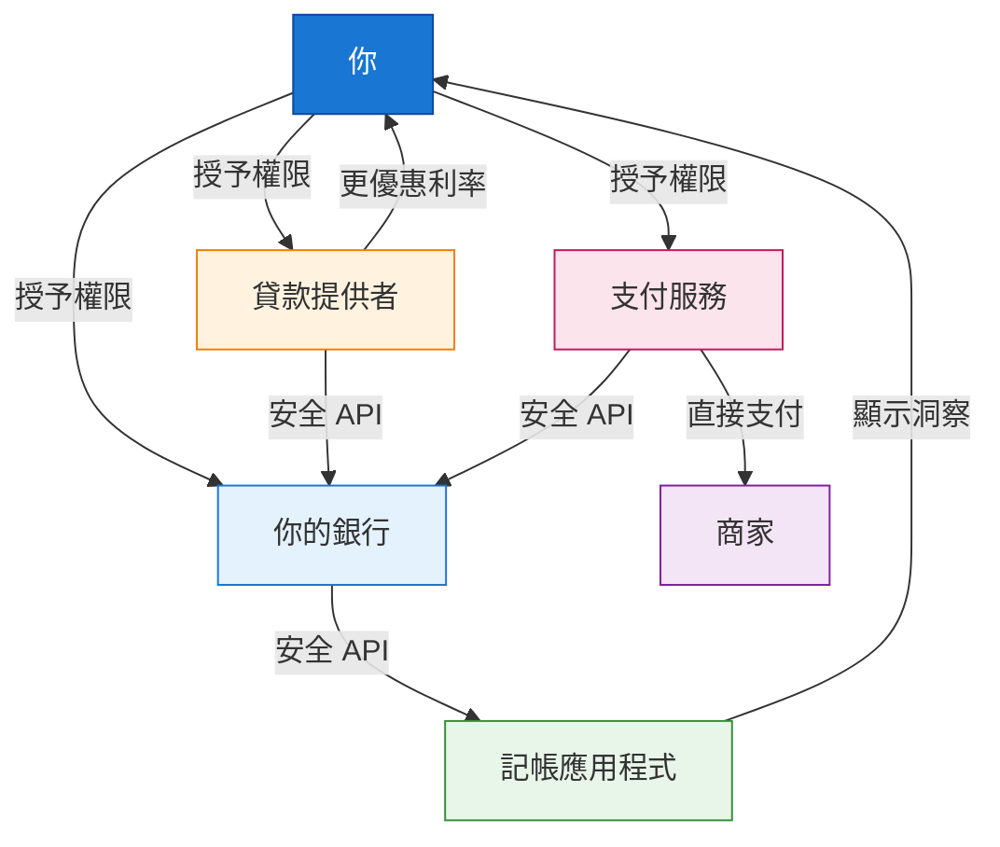
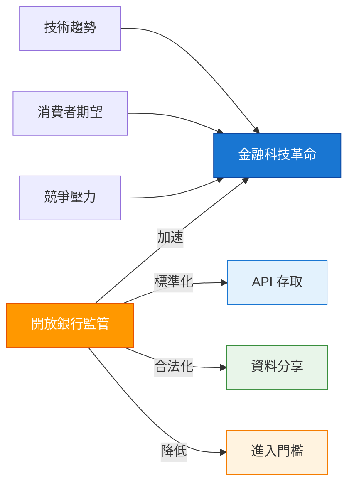
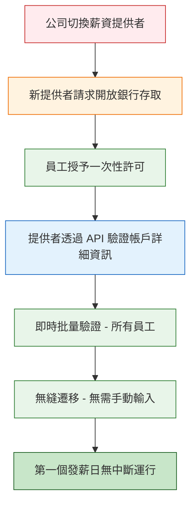
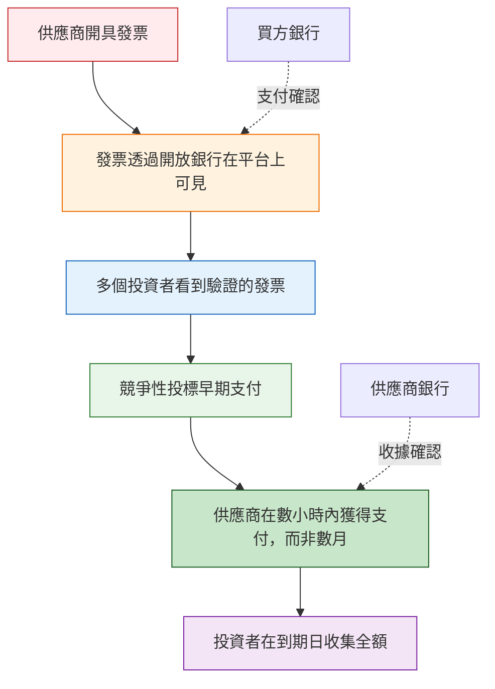

開放銀行曾是金融領域最受關注的話題之一。但剝開專業術語的外衣，它實際上是一個概念簡單卻影響深遠的系統。本文將解釋什麼是開放銀行、為什麼它對你很重要（無論你是一般消費者還是企業經營者），並探討一個關鍵問題：**開放銀行創造了金融科技革命，還是僅僅是解鎖早已到來的革命所需的基礎設施？**

## 1 開放銀行背後的簡單概念

!!!tip "💡 一句話理解開放銀行"
    **開放銀行**是一個允許你透過**標準化 API**與第三方提供者**安全分享財務資料**的系統，讓你能控制誰可以存取你的金錢資訊，並啟用新的金融服務。

可以這樣想：

**開放銀行之前：** 你的銀行資料被鎖在保險庫裡。只有銀行可以使用它。想用記帳應用程式嗎？你必須給它你的使用者名稱和密碼（很危險！），或手動匯出 CSV 檔案（很麻煩！）。

**開放銀行之後：** 你的資料屬於*你*。你可以告訴你的銀行：「把我的交易紀錄分享給這個記帳應用程式。」銀行透過安全、標準化的連線配合。不需要分享密碼。不需要螢幕抓取。只有乾淨、可控的資料流。



就是這樣。這就是革命。

但有趣的地方在於：**這個簡單的想法不僅讓現有服務變得更好。它從根本上改變了誰可以在金融領域競爭、創新如何發生，以及用金錢可以做到什麼。**

## 2 開放銀行的核心：理解同意機制

如果說開放銀行是一場革命，那麼**同意（consents）**就是讓它成為可能的關鍵。沒有同意機制，開放銀行就只是另一種形式的資料提取，而不是真正將權力轉移給消費者。

### 2.1 什麼是同意？

**同意**是你授予的明確許可，允許第三方提供者（TPP）透過開放銀行 API 存取你的財務資料。它們是基本的控制機制，讓*你*掌握誰可以看到你的金錢資訊以及他們可以用它做什麼。

在實踐中，同意的運作方式如下：

1. 服務（例如記帳應用程式、貸款提供者或支付服務）請求存取你的銀行資料
2. 你被重導向到銀行的安全介面
3. 你明確授予（或拒絕）特定資料存取的許可
4. 你的銀行僅透過安全 API 分享你授權的資料
5. 你可以隨時撤銷同意

```mermaid
sequenceDiagram
    participant 你
    participant App as 第三方應用程式
    participant 銀行 as 你的銀行

    你->>App: 請求服務（例如記帳）
    App->>銀行：請求資料存取
    銀行->>你：驗證身分並請求同意
    你->>銀行：授予明確許可
    銀行->>App: 透過 API 提供授權資料
    App->>你：提供服務
    你->>銀行：撤銷同意（隨時）
    銀行-->>App: 切斷資料存取

    style 你 fill:#1976d2,stroke:#0d47a1,color:#fff
    style App fill:#e8f5e9,stroke:#388e3c
    style 銀行 fill:#e3f2fd,stroke:#1976d2
```

### 2.2 為什麼同意很重要

同意機制之所以重要，有六個根本原因：

#### **1. 資料所有權**

同意機制將開放銀行的核心原則付諸實踐：**你的財務資料屬於你，不屬於銀行**。沒有同意機制，銀行仍會將你的資料視為其專屬資產。

#### **2. 安全性優於螢幕抓取**

在開放銀行之前，如果你想使用金融科技應用程式，你經常必須分享你的銀行**使用者名稱和密碼**——這是巨大的安全風險。

| 螢幕抓取（舊） | 開放銀行同意（新） |
|----------------------|----------------------------|
| 分享使用者名稱和密碼 | 不分享憑證 |
| 應用程式看到所有內容 | 應用程式只看到你授權的內容 |
| 不更改密碼就無法撤銷 | 一鍵隨時撤銷 |
| 脆弱（銀行更改網站時會失效） | 穩定（使用標準化 API） |
| 法律地位模糊 | 受監管和保護 |

#### **3. 細粒度控制**

同意不是全有或全無。你可以授予：

- **特定資料類型**：交易紀錄但不包括帳戶餘額
- **特定時間段**：最近 6 個月，而非所有歷史紀錄
- **特定目的**：記帳的唯讀存取，而非支付啟動
- **特定持續時間**：存取權限在 90 天後過期，除非續期

#### **4. 可撤銷性**

你可以**隨時撤回同意**，立即切斷提供者對你資料的存取。這創造了問責制——提供者必須持續贏得你的信任。如果記帳應用程式開始顯示惱人的廣告或收取隱藏費用，你不需要與客服爭論。你只需撤銷同意並切換到競爭對手。

#### **5. 消費者保護**

同意機制創造了法律和技術框架，允許金融科技公司在銀行資料上建構服務，*同時*不讓消費者暴露於無監管的資料分享。這就是為什麼開放銀行「透過監管保護消費者，而不是將其留給市場力量」。

關鍵保護包括：
- **透明度**：必須告訴你確切存取了什麼資料以及為什麼
- **目的限制**：資料只能用於你同意的目的
- **資料最小化**：提供者只能請求其服務所需的資料
- **稽核軌跡**：所有資料存取都有日誌可供審查

#### **6. 創新基礎**

許多創新應用程式完全依賴同意機制：

| 創新 | 所需同意 |
|-----------|------------------|
| **無摩擦薪資服務遷移** | 一次性帳戶驗證同意 |
| **可攜式財務身分** | 與新提供者分享「財務護照」的同意 |
| **自動切換服務** | 監控帳戶的持續同意 |
| **AI 驅動的財務助理** | 主動建議的全面同意 |
| **緊急信貸設施** | 餘額監控的即時同意 |

---

!!!anote "🔐 同意機制重點"
    **同意是讓開放銀行運作的「鑰匙」：**

    ✅ **你控制**誰存取你的資料

    ✅ **你決定**他們可以看到和做什麼

    ✅ **你可以隨時撤銷**存取權

    ✅ **你受到監管保護**，不僅僅是市場力量

    ✅ **你啟用創新**而不犧牲安全性

    **結論：** 同意將開放銀行從理論上的資料分享框架轉變為實用、安全、由消費者控制的系統。每次你授予同意時，你都在行使控制自己財務資料的權利。

---

## 3 消費者視角：對你有什麼好處？

對一般人來說，開放銀行轉化為觸及日常金融生活的實質利益。

### 3.1 更好的預算和財務控制

還記得那些可以分類你的支出、告訴你在發薪日前可以安全花費多少，或預測即將到來帳單的應用程式嗎？開放銀行讓它們**真正发挥作用**。

**之前：** 應用程式基於不完整的資料猜測，或要求你手動分類每一杯咖啡和雜貨採購。

**之後：** 經你許可，應用程式可以看到即時交易資料。他們知道你這週花了 180 美元買雜貨，電費帳單 3 天後到期，這個月有望存下 500 美元。不需要手動輸入。不需要猜測。

### 3.2 更容易轉換和更優惠的交易

開放銀行消除了讓你困於當前銀行的摩擦，即使他們提供極差的利率。

**情境：** 你有 15,000 美元存在支票帳戶中，賺取 0.01% 的利息。競爭對手提供 4.5%。

**開放銀行之前：** 轉換意味著文書工作、等待期、更新直接扣款、說服雇主更改薪資細節。大多數人懶得做。

**開放銀行之後：** 新提供者可以看到你的帳戶結構，幫助你在點擊間完成轉換而非數週，並根據你實際的財務行為立即提供更優惠的利率。競爭真正发挥作用。

### 3.3 更快、更公平的借貸

需要貸款嗎？開放銀行改變了遊戲規則。

**傳統借貸：** 銀行要求薪資單、銀行對帳單（3-6 個月）、報稅表。你匆忙收集文件。他們基於粗略標準評估你。流程需要數天或數週。你可能被拒絕，因為上個月不尋常（醫療緊急情況、汽車維修）。

**開放銀行借貸：** 你授予 6 個月的交易紀錄存取權。演算法在幾分鐘內評估你*實際*的現金流、支出模式和還款能力。你在幾分鐘內獲得決定，而非數週。關鍵是：**當傳統借貸拒絕你時，你可能獲得批准**，因為演算法看到了信用評分忽略的背景。

### 3.4 更安全的支付

開放銀行啟用**帳戶對帳戶支付**，完全繞過信用卡。

**為什麼這很重要：**
- 沒有卡號可被盜竊
- 沒有 CVV 可被釣魚
- 商家費用更低（可能轉嫁給你）
- 即時確認
- 直接銀行級驗證

買東西？與其輸入卡片詳細資訊，你選擇「用你的銀行支付」。你被重導向到銀行的應用程式，用人臉 ID 驗證，完成。商家即時收到付款。你從未分享卡片詳細資訊。

### 3.5 統一的財務視圖

在三家不同銀行有帳戶、兩個投資平台和一個加密貨幣交易所？開放銀行讓你在**一個地方看到所有內容**，無需登入六個不同的應用程式。你選擇的聚合器顯示你完整的財務狀況：淨值、現金流、投資表現、債務水準。全部即時。全部經你許可。

---

!!!anote "👤 消費者重點"
    **對你作為消費者，開放銀行意味著：**

    ✅ 更多選擇和更優惠的交易

    ✅ 更快獲得信貸

    ✅ 更好的財務工具

    ✅ 更安全的支付

    ✅ 控制自己的資料

    ✅ 更容易在提供者之間切換

    **結論：** 你的金錢資料屬於你。開放銀行給你使用它的鑰匙。

---

## 4 商業視角：為什麼企業在乎

對企業——尤其是中小企業（SME）——來說，開放銀行同樣具有變革性，但方式不同。

### 4.1 現金流可見性

小企業靠現金流生存或死亡。開放銀行給他們以前只有擁有財務部門的大公司才能使用的工具。

**成為可能：**
- 跨多個銀行帳戶的即時現金狀況
- 自動化對帳（匹配支付與發票）
- 基於客戶支付模式的預測性現金流預測
- 當大客戶支付行為變化時的早期警告

**範例：** 在兩家銀行有帳戶的小型零售商可以在一個儀表板中看到其完整的現金狀況。系統向他們發出警報：「客戶 X 通常在 15 天內付款，但他們最後三次付款花了 30 多天。預計 2 週後現金短缺。」他們可以在危機發生*之前*安排短期融資。

### 4.2 更快、更便宜的支付

企業處理大量支付：供應商、薪資、稅款、退款。開放銀行改變了經濟效益。

| 支付方式 | 典型成本 | 結算時間 | 退單風險 |
|---------------|--------------|-----------------|-----------------|
| 信用卡 | 1.5-3.5% | 2-3 天 | 高 |
| 傳統銀行轉帳 | $15-30 + 費用 | 1-3 天 | 低 |
| **開放銀行支付** | **0.1-0.5%** | **即時** | **非常低** |

對於每年處理 100 萬美元支付的企業，從卡片切換到開放銀行支付可以節省**15,000-30,000 美元**的費用。這是真金白銀。

### 4.3 更好的借貸管道

中小企業 notoriously 難以獲得信貸。傳統銀行依賴過時的財務資料（去年的報稅表對今天的現實毫無說明）和僵化的標準。

**針對企業的開放銀行借貸：**
- 貸款人看到即時收入，而非去年的利潤
- 他們評估客戶集中度風險（你是否過度依賴單一客戶？）
- 他們發現季節性模式並相應放貸
- 他們可以提供**動態信用額度**，隨著你的業務增長或收縮而調整

**結果：** 將被傳統評分拒絕的企業獲得資金管道。而且他們更快獲得，通常在數小時內。

### 4.4 自動化會計

會計師喜歡開放銀行（企業老闆也應該喜歡）。

**之前：** 手動資料輸入、追單據、月底對帳馬拉松、錯誤、延誤。

**之後：** 交易自動從銀行流向會計軟體。單據與交易匹配。增值稅/銷售稅即時計算。月底結算從 5 天縮短到 5 小時。

節省的時間花在**發展業務**上，而不是與電子表格搏鬥。

### 4.5 新商業模式

也許最令人興奮的是：開放銀行啟用以前不可能的全新商業模式。

**範例：**
- **嵌入式金融：** 專案管理工具提供即時發票和支付收集
- **動態定價：** 保險公司根據即時業務現金流和風險指標調整保費
- **收入型融資：** 投資者提供資金以換取未來收入的百分比，透過開放銀行自動追蹤
- **供應鏈金融：** 平台同時看到買家和供應商資料，在交易最佳點提供融資

---

!!!anote "🏢 商業重點"
    **對企業來說，開放銀行意味著：**

    ✅ 更好的現金流管理

    ✅ 更低的支付處理成本

    ✅ 更容易獲得信貸

    ✅ 自動化會計

    ✅ 新的收入機會

    ✅ 早期採用者的競爭優勢

    **結論：** 開放銀行將財務資料從記錄保存負擔轉變為戰略資產。

---

## 5 大問題：開放銀行推動了金融科技，還是只是必需？

這裡變得哲學。開放銀行明顯加速了金融科技創新。但它是金融科技革命的**原因**，還是僅僅是允許不可避免的革命發生的**基礎設施**？

### 5.1「開放銀行創造了金融科技」論點

支持此觀點的人認為：

**✅ 沒有開放銀行，金融科技將保持邊緣化：**
- 螢幕抓取（開放銀行之前的變通方法）脆弱、不安全且法律地位模糊
- 創新限於可以*圍繞*銀行建構的內容，而非*與*銀行資料一起
- 只有資金充足的參與者可以協商單獨的銀行合作夥伴關係
- 進入門檻對真正的顛覆來說太高

**✅ 開放銀行降低了門檻：**
- 標準化 API 意味著任何新創公司都可以存取銀行基礎設施
- 監管強制令迫使銀行合作（即使不情願）
- 公平的競爭環境：小型金融科技與大銀行擁有相同的資料存取權
- 創新爆發可預測地跟隨

**證據：** 查看擁有強大開放銀行強制令的市場（英國、歐盟、澳洲）。金融科技投資、新進入者和消費者採用都在實施後激增。相關性表明因果關係。

### 5.2「金融科技不可避免」論點

反駁論點：金融科技無論如何都會到來。開放銀行只是加速了它。

**✅ 技術使開放銀行不可避免：**
- API 已經是所有其他行業資料分享的標準
- 消費者期望正在轉變（如果亞馬遜可以顯示我所有訂單，為什麼我的銀行不能顯示我所有交易？）
- 行動銀行證明客戶信任數位介面
- AI 和機器學習需要銀行無法無限期扣留的資料存取

**✅ 市場力量已經在移動：**
- Plaid 和類似的聚合器在開放銀行強制令之前就已存在（使用螢幕抓取）
- 銀行緩慢地自願開放 API（在適合他們的地方）
- 客戶對更好財務工具的需求不容置疑
- 來自大型科技（Apple、Google、亞馬遜）的競爭最終將迫使銀行讓步

**證據：** 即使在沒有開放銀行強制令的市場（例如美國、部分亞洲地區），金融科技投資也迅速增長。創新找到了方法，即使路徑更混亂。

### 5.3 更細緻的觀點：開放銀行是催化劑，而非原因

也許真相在某處之間：



**開放銀行沒有創造金融科技的條件，但它：**

1. **加速**了已經不可避免的事情
2. **標準化**了原本會碎片化和混亂的內容
3. **民主化**了原本會集中的存取
4. **合法化**了法律地位模糊的資料分享
5. **保護**消費者透過監管而非將其留給市場力量

**類比：** 州際公路系統創造了美國公路旅行，還是啟用了已經要發生的事情？在某種意義上，兩者皆是。人們想要旅行。汽車存在。但公路系統改變了*如何*、*多少*和*誰*可以旅行。

開放銀行是金融創新的公路系統。

### 5.4 AI 問題：開放銀行對 AI 驅動的金融是必需的嗎？

現在讓我們加入最緊迫的問題：**AI 呢？** 當人工智慧轉變每個行業時，開放變得更關鍵嗎？

**簡短答案：是，但有細微差別。**

**為什麼 AI 需要開放銀行：**

| AI 應用 | 所需資料 | 開放銀行角色 |
|---------------|---------------|-------------------|
| 個人化財務建議 | 完整交易紀錄、收入模式、支出習慣 | 提供標準化、全面的資料存取 |
| 詐欺偵測 | 即時交易資料、行為模式 | 啟用跨機構的即時資料流 |
| 信用評分 | 現金流、支付行為、財務穩定性 | 允許傳統信用報告之外的替代資料 |
| 自動化預算 | 分類交易、經常性支付 | 為 ML 模型提供乾淨、結構化的資料 |
| 投資建議 | 風險承受度（從行為推斷）、剩餘現金模式 | 啟用財務能力的整體視圖 |

**沒有開放銀行的 AI：**
- 模型在不完整、有偏見或過時的資料上訓練
- 預測較不準確
- 創新限於可以協商資料存取的參與者
- 螢幕抓取創造脆弱、易錯的管線

**有開放銀行的 AI：**
- 模型在全面、即時、標準化的資料上訓練
- 預測大幅改善
- 任何 AI 新創公司都可以存取與在位者相同的資料
- 乾淨的 API 啟用可靠、可擴展的 AI 系統

!!!tip "💡 AI 乘數效應"
    **開放銀行 × AI = 指數級創新**

    開放銀行提供**資料基礎設施**。

    AI 提供**智慧層**。

    一起，它們啟用的金融服務：
    - **主動**（在你透支前警告你）而非被動
    - **個人化**（根據你實際行為量身打造）而非一刀切
    - **預測性**（預測現金流、識別風險）而非向後看
    - **自動化**（處理常規決策）而非手動

    **範例：** 擁有開放銀行存取的 AI 驅動財務助理可以：
    - 注意到你持續將錢留在低利率帳戶 → 自動建議更好的選項
    - 偵測不尋常的支出模式 → 警告你潛在詐欺或訂閱蠕變
    - 預測現金短缺 → 在你透支前安排短期信貸
    - 優化帳單支付 → 安排支付時間以最大化你賺取的利息
    - 協商更優惠利率 → 使用你的資料證明你是低風險客戶

    這一切都不需要人工干預。它只需要**資料存取**（開放銀行）和**智慧**（AI）。

---

!!!anote "🤖 AI 和開放銀行重點"
    **開放銀行對金融 AI 不是嚴格*必需*的，但它是必需的：**

    ✅ **民主化 AI**（任何人都可以建構，不僅是銀行）

    ✅ **全面 AI**（在完整資料上訓練的模型）
    ✅ **即時 AI**（基於當前資料的即時決策）

    ✅ **安全 AI**（受監管的資料分享，而非螢幕抓取）

    ✅ **可擴展 AI**（標準化 API，而非脆弱的變通方法）

    **結論：** AI 無論如何都將轉變金融。但開放銀行決定這種轉變是惠及每個人，還是只惠及已經控制資料的參與者。

---

## 6 接下來是什麼？

開放銀行仍處於早期。以下是即將到來的內容：

### 6.1 開放金融

開放銀行正在擴展到支付和交易之外，涵蓋：
- 投資和養老金
- 保單
- 抵押貸款
- 加密貨幣持有

想像一個儀表板顯示你**完整**的財務狀況：支票帳戶、儲蓄、投資、保險覆蓋、抵押貸款餘額、加密投資組合。全部即時。全部經你許可。這就是開放金融。

### 6.2 嵌入式金融

金融服務將越來越多地消失到你已經使用的產品和服務中：
- 結帳時的先買後付（由開放銀行信用評估驅動）
- 嵌入旅遊預訂的保險
- 嵌入會計軟體的發票融資
- 嵌入 HR 平台的薪資預支

你不會「去銀行」。銀行將透過你已經使用的工具來到你身邊。

### 6.3 全球匯聚

不同地區以不同方式實施開放銀行（英國/歐盟/澳洲強制、美國市場驅動、亞洲混合）。隨著時間推移，預期匯聚 toward：
- 共同 API 標準
- 跨境資料可攜性
- 和諧的消費者保護

你的財務資料應該跟隨你到世界任何地方。我們還沒到那裡，但這是方向。

### 6.4 AI 爆發

隨著 AI 能力進步，開放銀行資料將燃料：
- 超個人化金融產品
- 自主財務管理（代表你行動的 AI）
- 預測性監管（自動發生的合規）
- 跨所有金融服務的動態定價

開放銀行 + AI 的結合仍處於嬰兒期。最具變革性的應用程式尚未建構。

---

## 7 開放銀行可以啟用的創新解決方案

開放銀行的真正潛力不僅在於改善現有服務，而在於啟用以前不可能的全新解決方案。以下是一些創新應用程式——一些已經出現，其他仍處於概念階段——展示技術可以帶我們去哪裡。

### 7.1 無摩擦薪資服務遷移

**問題：** 公司想切換薪資提供者（或薪資提供者本身想遷移到不同的銀行合作夥伴）。傳統上，這是噩夢：

- 需要驗證和重新輸入數百或數千名員工的銀行詳細資訊
- 帳號、排序碼、名稱錯誤的風險
- 必須通知員工並要求確認詳細資訊
- 可能需要測試支付來驗證每個帳戶
- 流程需要數週，有時數月
- 任何錯誤意味著員工拿不到薪水

**開放銀行解決方案：** 經員工同意，新薪資提供者可以：



**運作方式：**
1. 公司宣布薪資提供者切換
2. 員工收到安全連結以授予一次性開放銀行許可
3. 新提供者透過標準化 API 即時驗證所有帳戶詳細資訊
4. 無需手動資料輸入。無需錯誤。無需測試支付。
5. 遷移在數天內完成，而非數週

**現實影響：** 500 名員工的公司可以將薪資遷移從**6-8 週縮短到 3-5 天**，錯誤率接近零。

---

### 7.2 可攜式財務身分

**概念：** 你的財務聲譽應該跟隨你，而非鎖在每個機構。

**當前狀態：** 你在銀行 A 建立良好的支付歷史。你切換到銀行 B。你從零開始——沒有歷史、沒有信任、沒有優惠利率。

**開放銀行創新：** 跟隨你的**可攜式財務身分**：

- 你的交易紀錄、支付行為和財務穩定性指標被打包成標準化的「財務護照」
- 當你在其他地方申請服務時，你透過開放銀行 API 授予此護照的存取權
- 新提供者看到驗證的、全面的資料——不僅是信用評分，而是實際行為模式
- 你從第一天就獲得更優惠利率、更快批准和個人化產品

**誰在建構它：** 一些新創公司正在努力，但真正通用、消費者控制的財務身分尚未存在。它需要：
- 跨機構的標準化資料格式
- 簡單透明的消費者同意管理
- 隱私保護驗證（證明你是低風險而不暴露每筆交易）

---

### 7.3 自動切換服務

**概念：** 為什麼要手動尋找更優惠利率，當演算法可以為你做時？

**運作方式：**
1. 你授予獨立服務開放銀行存取其所有帳戶
2. 服務持續監控：
   - 儲蓄的利率
   - 支票帳戶的費用
   - 貸款和信用卡的利率
   - 保險保費
3. 當有更優惠交易可用時，它通知你——或經你預先授權，自動切換

**範例：** 你有 20,000 美元在賺取 0.5% 的儲蓄帳戶中。競爭對手提供 4.5%。服務通知你：「*現在切換並賺取額外 800 美元/年。點擊確認。*」一鍵，你的錢移動。

**為什麼這還未完全存在：**
- 圍繞自動切換的監管複雜性
- 銀行故意使切換某些產品變得困難
- 如果出錯的責任問題

但基礎設施已就緒。需求存在。只是時間問題。

---

### 7.4 動態、行為型保險

**當前模式：** 保險公司基於粗略的人口統計和歷史索賠資料定價。無論你是財務穩定還是掙扎，你支付相同保費。

**開放銀行創新：** **即時、行為型保險定價：**

| 傳統保險 | 開放銀行啟用保險 |
|----------------------|-------------------------------|
| 基於去年資料的年度保費 | 根據當前風險調整的月度保費 |
| 風險池內一刀切 | 基於實際財務行為的個人化 |
| 手動且緩慢的索賠流程 | 由驗證事件觸發的自動索賠 |
| 沒有良好行為的激勵 | 展示財務責任的折扣 |

**範例 - 汽車保險：**
- 保險公司看到（經許可）你按時支付帳單、維持緊急儲蓄並有穩定收入
- 這與較低索賠風險相關 → 你獲得 15% 折扣
- 你連續錯過三次帳單支付 → 保險公司通知你，提供支付計劃協助（防止保單失效）
- 你獲得新工作且收入更高 → 保險公司自動提供升級覆蓋

**範例 - 商業保險：**
- 保險公司即時監控業務現金流
- 收入月減 40% → 自動保費調整以防止取消
- 收入持續增長 → 保險公司在你要求前提供擴展覆蓋

**狀態：** 在大多數市場處於概念階段。一些使用型汽車保險存在，但全面的財務行為型定價尚未主流。

---

### 7.5 跨境財務可攜性

**問題：** 搬到新國家？從頭開始財務。沒有信用歷史。沒有銀行關係。沒有信貸管道。

**開放銀行解決方案：** **國際財務可攜性：**

**情境：Sarah 從英國搬到澳洲**

| 開放銀行之前 | 開放銀行之後（有跨境標準） |
|---------------------|--------------------------------------------------|
| ❌ 沒有澳洲信用歷史 → 貸款被拒絕 | ✅ 授予存取 5 年英國財務歷史 |
| ❌ 沒有當地銀行關係 → 需要高額存款 | ✅ 澳洲貸款人看到驗證的收入、支付歷史 |
| ❌ 沒有收入證明 → 無法租公寓 | ✅ 基於實際行為的即時信用評估 |
| ❌ 從零開始 | ✅ 批准貸款、信用卡、租賃申請 |
| | ✅ 財務聲譽跟隨你 |

**需要什麼：**
- 國際 API 標準（已在開發中）
- 跨境監管協議
- 貨幣和管轄權處理
- 跨區域隱私合規

**進展：** 一些倡議存在（例如英國 - 澳洲開放銀行走廊討論），但真正的全球可攜性還需 5-10 年。

---

### 7.6 自主財務管理

**願景：** AI 驅動的財務助理不僅建議——它**代表你行動**。

**能力：**
| 功能 | 運作方式 |
|----------|--------------|
| **現金優化** | 自動將多餘現金從支票移動到高收益儲蓄 |
| **帳單協商** | 偵測價格上漲，與提供者協商更優惠利率 |
| **稅務優化** | 安排收入/支出時間以最小化稅負 |
| **債務管理** | 自動將剩餘分配給最高利率債務 |
| **詐欺預防** | 在你注意前凍結可疑交易 |
| **訂閱管理** | 取消未使用的訂閱，尋找更好的替代方案 |

**範例互動：**
```
AI 助理：「我這週注意到三件事：
  1. 你把 8,000 美元留在 0.1% 支票帳戶 → 移動到 4.5% 儲蓄（+352 美元/年）
  2. 你的網路帳單增加 20% → 切換到競爭對手（節省 240 美元/年）
  3. 你有 5,000 美元信用卡餘額在 19% → 符合 0% 餘額轉帳卡資格
     → 代表你申請，批准，餘額轉帳
     → 每年節省 950 美元利息

總年度節省：1,542 美元
需要行動：無（都在你預先批准的參數內）
」
```

**狀態：** 早期版本存在（一些機器人顧問、自動儲蓄應用程式），但真正需要完整開放銀行存取 + AI 決策的自主管理仍在出現。

**障礙：**
- 監管：如果 AI 犯錯誰負責？
- 信任：消費者會允許 AI 移動資金而無需明確批准嗎？
- 技術：需要跨所有機構的即時存取

---

### 7.7 供應鏈金融市場

**問題：** 小供應商等待 60-90 天的發票支付。他們需要現金流。傳統保理昂貴（發票價值的 2-5%）。

**開放銀行創新：** **即時供應鏈金融市場：**



**開放銀行如何啟用：**
- 平台看到**雙方**買家和供應商銀行資料（經許可）
- 發票真實性針對實際支付承諾驗證
- 投資者風險評估基於實際現金流資料，而非信用評分
- 支付確認自動——無需手動對帳
- 利率競爭性因為多個投資者可以投標

**影響：**
- 供應商在數小時內獲得支付而非 90 天
- 成本從 3% 降到 0.5-1% 由於風險降低和競爭
- 買方維持支付條款（不對其現金流造成壓力）
- 投資者獲得可預測、短期回報

**狀態：** 一些平台提供此服務（例如 Taulia、PrimeRevenue），但具有即時資料和競爭性投標的開放銀行啟用市場仍在出現。

---

### 7.8 緊急信貸設施

**概念：** 預先批准的緊急信貸，在你需要時自動啟動。

**運作方式：**
1. 基於你的財務歷史，貸款人預先批准你 5,000 美元緊急設施
2. 設施**休眠**——無利息、無費用——直到啟動
3. 開放銀行監控你的帳戶尋找觸發事件：
   - 基本支付資金不足（租金、水電）
   - 意外大額支出（醫療帳單、汽車維修）
   - 收入中斷（錯過發薪）
4. 當觸發時，設施**自動啟動**並覆蓋短缺
5. 你收到通知：「*緊急信貸啟動：1,200 美元用於租金支付。在 [日期] 前償還或安排分期付款計劃。*」

**為什麼這是創新：**
- 危機期間無需申請流程
- 即時保護免受透支費、延遲支付、驅逐
- 僅在使用時累積利息
- 還款條款根據你的恢復調整（透過開放銀行可見）

**狀態：** 概念性。一些銀行提供透支保護，但基於即時觸發啟動的智慧、預先批准緊急設施尚未存在。

---

!!!anote "🚀 創新重點"
    **開放銀行啟用以前不可能的解決方案：**

    - **無摩擦薪資遷移**（出現中） — 消除數週的手動工作
    - **可攜式財務身分**（概念性） — 財務聲譽跟隨你
    - **自動切換**（早期階段） — 無需手動尋找的最佳交易
    - **行為型保險**（概念性） — 基於實際風險的更公平定價
    - **跨境可攜性**（5-10 年） — 財務身分全球運作
    - **自主財務管理**（早期階段） — 代表你行動的 AI
    - **供應鏈金融市場**（出現中） — 更便宜、更快的中小企業融資
    - **緊急信貸設施**（概念性） — 危機期間的自動保護

    **模式：** 所有這些解決方案都需要**即時、標準化、經同意的資料存取**——正是開放銀行提供的。

    **接下來是什麼？** 最具變革性的應用程式尚未建構。基礎設施已就緒。問題是：你將建構什麼？

---

## 8 結論：打開門的鑰匙

開放銀行沒有創造對更好金融服務的需求。這個需求一直存在。

開放銀行沒有發明金融科技。企業家在第一個 API 強制令之前很久就在建構金融科技解決方案。

**但開放銀行做了關鍵的事情：它打開了銀行一直鎖著的門。**

它將財務資料從圍牆花園轉變為共同資源。它將客戶從被俘觀眾轉變為賦權消費者。它將金融從護城河保護的寡頭壟斷轉變為競爭市場，最佳產品獲勝。

隨著 AI 進步，開放變得更關鍵。沒有資料的 AI 就像沒有燃料的引擎。開放銀行提供燃料。問題不再是「什麼是可能的？」而是「我們將建構什麼？」

**給消費者：** 你的金錢資料屬於你。使用它。與幫助你的工具分享它。要求更好的服務。當你沒有獲得價值時切換。開放銀行給你力量。使用它。

**給企業：** 你的財務資料是戰略資產。利用它獲得更好的現金流管理、更便宜的支付、更容易的信貸和競爭優勢。最先弄清楚這一點的企業將獲勝。

**給金融科技建構者：** 基礎設施已就緒。資料可存取。監管框架存在。你將建構什麼以前不可能的？

鑰匙已轉動。門已打開。接下來發生什麼取決於我們。
