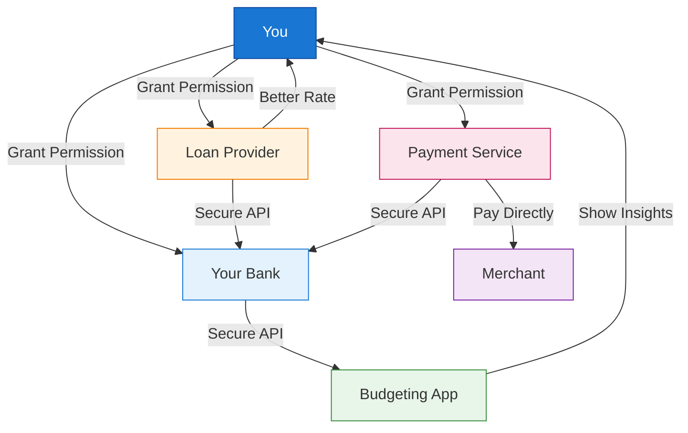
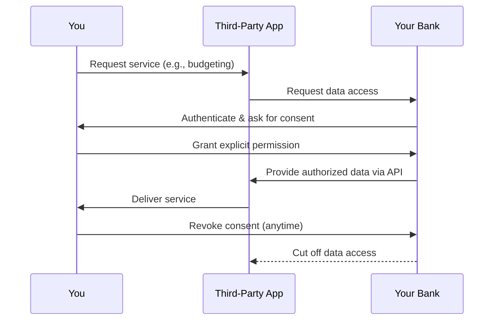
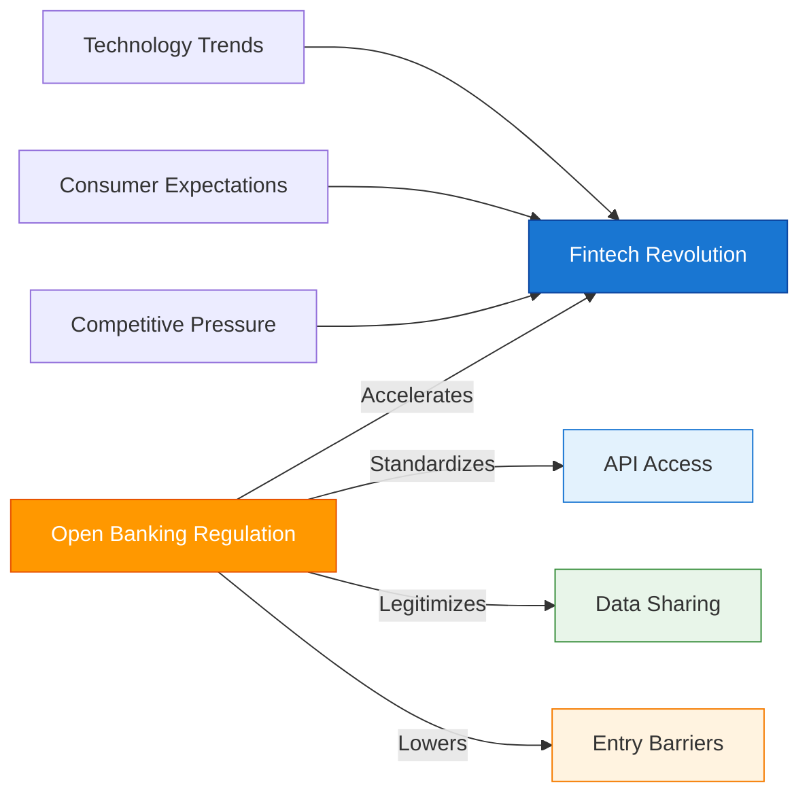
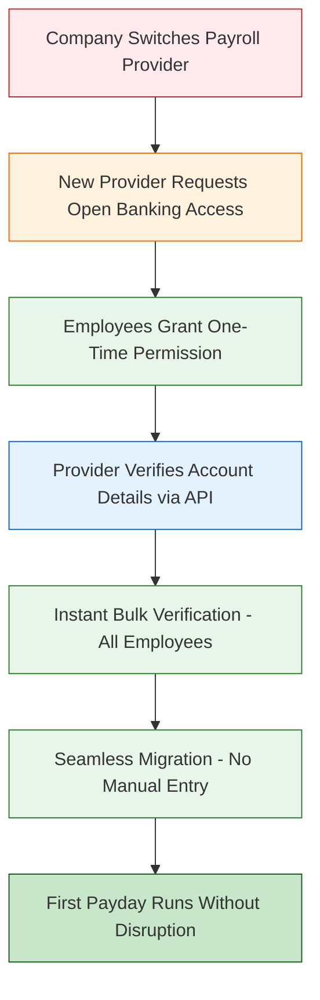
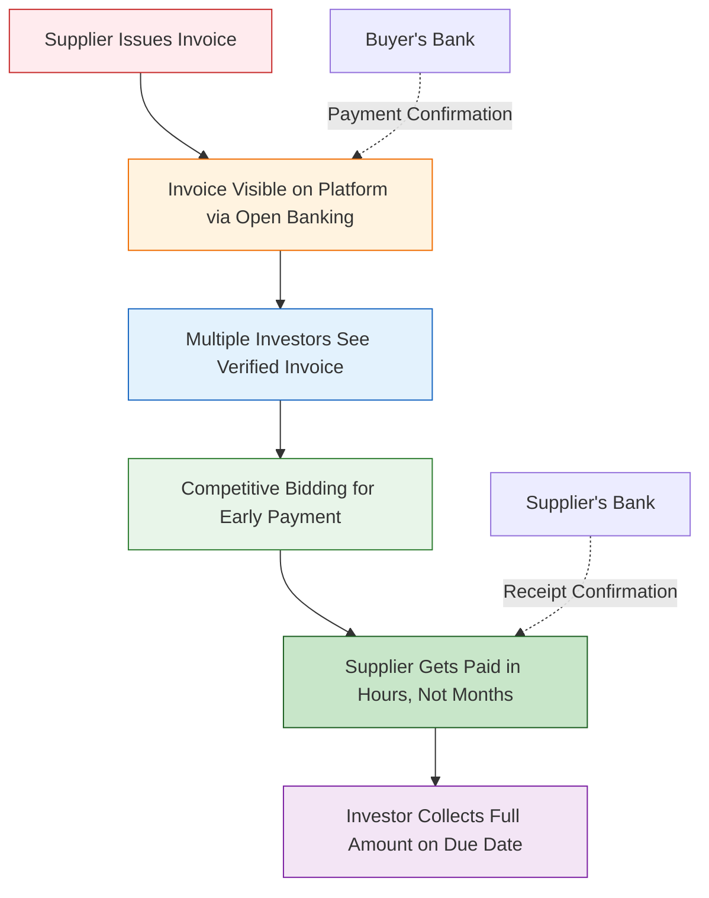

Open Banking was one of the most talked-about topics in finance. But strip away the jargon, and it's actually a remarkably simple concept with profound implications. This article explains what Open Banking is, why it matters to you (whether you're a regular consumer or running a business), and explores a critical question: **did Open Banking create the fintech revolution, or was it simply the infrastructure needed to unlock what was already coming?**

## 1 The Simple Idea Behind Open Banking

!!!tip "💡 Open Banking in One Sentence"
    **Open Banking** is a system that allows you to **securely share your financial data** with third-party providers through **standardized APIs**, giving you control over who accesses your money information and enabling new financial services.

Think of it like this:

**Before Open Banking:** Your bank data was locked in a vault. Only the bank could use it. Want to use a budgeting app? You'd have to give it your username and password (risky!), or manually export CSV files (tedious!).

**After Open Banking:** Your data belongs to *you*. You can tell your bank: "Share my transaction history with this budgeting app." The bank complies through a secure, standardized connection. No password sharing. No screen scraping. Just clean, controlled data flow.



That's it. That's the revolution.

But here's where it gets interesting: **this simple idea didn't just make existing services slightly better. It fundamentally changed who can compete in finance, how innovation happens, and what's possible with money.**

## 2 The Heart of Open Banking: Understanding Consents

If Open Banking is a revolution, **consents** are what make it possible. Without consents, Open Banking would be just another form of data extraction rather than a genuine shift in power to consumers.

### 2.1 What Are Consents?

**Consents** are the explicit permissions you grant that allow third-party providers (TPPs) to access your financial data through Open Banking APIs. They are the fundamental control mechanism that puts *you* in charge of who can see your money information and what they can do with it.

In practice, a consent works like this:

1. A service (e.g., a budgeting app, loan provider, or payment service) requests access to your bank data
2. You're redirected to your bank's secure interface
3. You explicitly grant (or deny) permission for specific data access
4. Your bank shares only the data you authorized, via a secure API
5. You can revoke consent at any time



### 2.2 Why Consents Matter

Consents are important for six fundamental reasons:

#### **1. Data Ownership**

Consents operationalize the core principle of Open Banking: **your financial data belongs to you, not the bank**. Without consent mechanisms, banks would still treat your data as their proprietary asset.

#### **2. Security Over Screen Scraping**

Before Open Banking, if you wanted to use a fintech app, you'd often have to share your banking **username and password**—a massive security risk.

| Screen Scraping (Old) | Open Banking Consents (New) |
|----------------------|----------------------------|
| Share username & password | No credentials shared |
| App sees everything | App sees only what you authorize |
| No way to revoke without changing password | Revoke anytime with one click |
| Fragile (breaks when bank changes website) | Stable (uses standardized APIs) |
| Legally ambiguous | Regulated and protected |

#### **3. Granular Control**

Consents aren't all-or-nothing. You can grant:

- **Specific data types**: Transaction history but not account balances
- **Specific time periods**: Last 6 months, not all history
- **Specific purposes**: Read-only access for budgeting, not payment initiation
- **Specific duration**: Access expires after 90 days unless renewed

#### **4. Revocability**

You can **withdraw consent at any time**, immediately cutting off a provider's access to your data. This creates accountability—providers must continue earning your trust. If a budgeting app starts showing annoying ads or charging hidden fees, you don't need to argue with customer service. You just revoke consent and switch to a competitor.

#### **5. Consumer Protection**

Consents create the legal and technical framework that allows fintechs to build services on bank data *without* exposing consumers to unregulated data sharing. This is why Open Banking "protected consumers through regulation rather than leaving it to market forces."

Key protections include:
- **Transparency**: You must be told exactly what data is being accessed and why
- **Purpose limitation**: Data can only be used for the purpose you consented to
- **Data minimization**: Providers can only request data necessary for their service
- **Audit trails**: All data access is logged and can be reviewed

#### **6. Foundation for Innovation**

Many innovative applications depend entirely on consent mechanisms:

| Innovation | Consent Required |
|-----------|------------------|
| **Frictionless payroll migration** | One-time consent for account verification |
| **Portable financial identity** | Consent to share "financial passport" with new providers |
| **Automatic switching services** | Continuous consent for monitoring accounts |
| **AI-powered financial assistants** | Comprehensive consent for proactive advice |
| **Emergency credit facilities** | Real-time consent for balance monitoring |

---

!!!anote "🔐 Consents Takeaway"
    **Consents are the "keys" that make Open Banking work:**

    ✅ **You control** who accesses your data

    ✅ **You decide** what they can see and do

    ✅ **You can revoke** access at any time

    ✅ **You're protected** by regulation, not just market forces

    ✅ **You enable innovation** without sacrificing security

    **The bottom line:** Consents transform Open Banking from a theoretical data-sharing framework into a practical, secure, consumer-controlled system. Every time you grant consent, you're exercising your right to control your own financial data.

---

## 3 The Consumer Perspective: What's In It For You?

For regular people, Open Banking translates into tangible benefits that touch everyday financial life.

### 3.1 Better Budgeting and Financial Control

Remember those apps that categorize your spending, tell you how much you can safely spend before payday, or predict upcoming bills? Open Banking makes them **actually work**.

**Before:** Apps guessed based on incomplete data or required you to manually categorize every coffee and grocery run.

**After:** With your permission, apps see real-time transaction data. They know you spent $180 on groceries this week, that your electricity bill is due in 3 days, and that you're on track to save $500 this month. No manual entry. No guessing.

### 3.2 Easier Switching and Better Deals

Open Banking removes the friction that kept you stuck with your current bank even when they offered terrible rates.

**Scenario:** You have $15,000 sitting in a checking account earning 0.01% interest. A competitor offers 4.5%.

**Before Open Banking:** Switching meant paperwork, waiting periods, updating direct debits, convincing your employer to change payroll details. Most people couldn't be bothered.

**After Open Banking:** A new provider can see your account structure, help you switch in clicks not weeks, and immediately offer you a better rate based on your actual financial behavior. Competition actually works.

### 3.3 Faster, Fairer Lending

Need a loan? Open Banking changes the game.

**Traditional lending:** Bank asks for payslips, bank statements (3-6 months), tax returns. You scramble to gather documents. They assess you based on coarse criteria. Process takes days or weeks. You might get rejected because last month was unusual (medical emergency, car repair).

**Open Banking lending:** You grant 6 months of transaction history access. Algorithm assesses your *actual* cash flow, spending patterns, and repayment capacity in minutes. You get a decision in minutes, not weeks. And crucially: **you might get approved when traditional lending would reject you**, because the algorithm sees context that a credit score misses.

### 3.4 Safer Payments

Open Banking enables **account-to-account payments** that bypass credit cards entirely.

**Why this matters:**
- No card number to steal
- No CVV to phish
- Lower fees for merchants (potentially passed to you)
- Instant confirmation
- Direct bank-level authentication

Buying something? Instead of entering card details, you select "Pay with your bank." You're redirected to your bank's app, authenticate with face ID, and done. The merchant gets paid instantly. You never shared card details.

### 3.5 Unified Financial View

Got accounts at three different banks, two investment platforms, and a crypto exchange? Open Banking lets you see **everything in one place** without logging into six different apps. Your chosen aggregator shows your complete financial picture: net worth, cash flow, investment performance, debt levels. All real-time. All with your permission.

---

!!!anote "👤 Consumer Takeaway"
    **For you as a consumer, Open Banking means:**
    
    ✅ More choice and better deals

    ✅ Faster access to credit

    ✅ Better financial tools

    ✅ Safer payments

    ✅ Control over your own data

    ✅ Easier switching between providers
    
    **The bottom line:** Your money data belongs to you. Open Banking gives you the keys to use it.

---

## 4 The Commercial Perspective: Why Businesses Care

For businesses—especially small and medium enterprises (SMEs)—Open Banking is equally transformative, but in different ways.

### 4.1 Cash Flow Visibility

Small businesses live and die by cash flow. Open Banking gives them tools that were previously available only to large corporations with treasury departments.

**What becomes possible:**
- Real-time cash position across multiple bank accounts
- Automated reconciliation (matching payments to invoices)
- Predictive cash flow forecasting based on customer payment patterns
- Early warning when a major customer's payment behavior changes

**Example:** A small retailer with accounts at two banks can see their complete cash position in one dashboard. The system alerts them: "Customer X typically pays within 15 days, but their last three payments took 30+ days. Expect cash shortfall in 2 weeks." They can arrange a short-term facility *before* the crisis hits.

### 4.2 Faster, Cheaper Payments

Businesses process large volumn of payments: suppliers, payroll, taxes, refunds. Open Banking changes the economics.

| Payment Method | Typical Cost | Settlement Time | Chargeback Risk |
|---------------|--------------|-----------------|-----------------|
| Credit Card | 1.5-3.5% | 2-3 days | High |
| Traditional Bank Transfer | $15-30 + fees | 1-3 days | Low |
| **Open Banking Payment** | **0.1-0.5%** | **Instant** | **Very Low** |

For a business processing $1M in payments annually, switching from cards to Open Banking payments could save **$15,000-30,000** in fees. That's real money.

### 4.3 Better Lending Access

SMEs notoriously struggle to access credit. Traditional banks rely on outdated financials (last year's tax return tells you nothing about today's reality) and rigid criteria.

**Open Banking lending for businesses:**
- Lenders see real-time revenue, not last year's profit
- They assess customer concentration risk (do you rely too heavily on one client?)
- They spot seasonal patterns and lend accordingly
- They can offer **dynamic credit lines** that adjust as your business grows or contracts

**Result:** Businesses that would be rejected by traditional scoring get access to capital. And they get it faster, often within hours.

### 4.4 Automated Accounting

Accountants love Open Banking (and so should business owners).

**Before:** Manual data entry, receipt chasing, month-end reconciliation marathons, errors, delays.

**After:** Transactions flow automatically from bank to accounting software. Receipts are matched to transactions. VAT/sales tax is calculated in real-time. Month-end close goes from 5 days to 5 hours.

The time saved is time spent on **growing the business**, not wrestling with spreadsheets.

### 4.5 New Business Models

Perhaps most exciting: Open Banking enables entirely new business models that weren't possible before.

**Examples:**
- **Embedded finance:** A project management tool offering instant invoicing and payment collection
- **Dynamic pricing:** An insurer adjusting premiums based on real-time business cash flow and risk indicators
- **Revenue-based financing:** Investors providing capital in exchange for a percentage of future revenue, tracked automatically via Open Banking
- **Supply chain finance:** A platform seeing both buyer and supplier data, offering financing at the optimal point in the transaction

---

!!!anote "🏢 Commercial Takeaway"
    **For businesses, Open Banking means:**
    
    ✅ Better cash flow management

    ✅ Lower payment processing costs

    ✅ Easier access to credit

    ✅ Automated accounting

    ✅ New revenue opportunities

    ✅ Competitive advantage for early adopters
    
    **The bottom line:** Open Banking turns financial data from a record-keeping burden into a strategic asset.

---

## 5 The Big Question: Did Open Banking Drive Fintech, Or Was It Required To?

Here's where we get philosophical. Open Banking clearly accelerated fintech innovation. But was it the **cause** of the fintech revolution, or simply the **infrastructure** that allowed an inevitable revolution to happen?

### 5.1 The "Open Banking Created Fintech" Argument

Proponents of this view argue:

**✅ Without Open Banking, fintech would remain marginal:**
- Screen scraping (the pre-Open Banking workaround) was fragile, insecure, and legally ambiguous
- Innovation was limited to what could be built *around* banks, not *with* bank data
- Only well-funded players could negotiate individual bank partnerships
- The barrier to entry was too high for true disruption

**✅ Open Banking lowered barriers:**
- Standardized APIs meant any startup could access banking infrastructure
- Regulatory mandate forced banks to cooperate (even reluctantly)
- Level playing field: small fintechs had same data access as big banks
- Explosion of innovation followed predictably

**Evidence:** Look at markets with strong Open Banking mandates (UK, EU, Australia). Fintech investment, new entrants, and consumer adoption all surged post-implementation. Correlation suggests causation.

### 5.2 The "Fintech Was Inevitable" Argument

Counter-argument: Fintech was coming regardless. Open Banking just accelerated it.

**✅ Technology made Open Banking inevitable:**
- APIs were already the standard for data sharing in every other industry
- Consumer expectations were shifting (if Amazon can show all my orders, why can't my bank show all my transactions?)
- Mobile banking proved customers trusted digital interfaces
- AI and machine learning required data access that banks couldn't indefinitely withhold

**✅ Market forces were already moving:**
- Plaid and similar aggregators existed before Open Banking mandates (using screen scraping)
- Banks were slowly opening APIs voluntarily (where it suited them)
- Customer demand for better financial tools was undeniable
- Competition from Big Tech (Apple, Google, Amazon) would have forced banks' hands eventually

**Evidence:** Fintech investment grew rapidly even in markets without Open Banking mandates (e.g., US, parts of Asia). Innovation found a way, even if the path was messier.

### 5.3 A More Nuanced View: Open Banking as Catalyst, Not Cause

Perhaps the truth is somewhere in between:



**Open Banking didn't create the conditions for fintech, but it:**

1. **Accelerated** what was already inevitable
2. **Standardized** what would have been fragmented and messy
3. **Democratized** access that would have remained concentrated
4. **Legitimized** data sharing that was legally ambiguous
5. **Protected** consumers through regulation rather than leaving it to market forces

**Analogy:** Did the interstate highway system create the American road trip, or did it enable something that was already going to happen? Both, in a sense. People wanted to travel. Cars existed. But the highway system transformed *how* and *how much* and *who* could travel.

Open Banking is the highway system for financial innovation.

### 5.4 The AI Question: Is Open Banking Required for AI-Driven Finance?

Now let's layer in the most pressing question: **what about AI?** As artificial intelligence transforms every industry, does Open Banking become even more critical?

**Short answer: Yes, but with nuance.**

**Why AI needs Open Banking:**

| AI Application | Data Required | Open Banking Role |
|---------------|---------------|-------------------|
| Personalized financial advice | Complete transaction history, income patterns, spending habits | Provides standardized, comprehensive data access |
| Fraud detection | Real-time transaction data, behavioral patterns | Enables real-time data flow across institutions |
| Credit scoring | Cash flow, payment behavior, financial stability | Allows alternative data beyond traditional credit reports |
| Automated budgeting | Categorized transactions, recurring payments | Provides clean, structured data for ML models |
| Investment recommendations | Risk tolerance (inferred from behavior), surplus cash patterns | Enables holistic view of financial capacity |

**AI without Open Banking:**
- Models train on incomplete, biased, or stale data
- Predictions are less accurate
- Innovation is limited to players who can negotiate data access
- Screen scraping creates fragile, error-prone pipelines

**AI with Open Banking:**
- Models train on comprehensive, real-time, standardized data
- Predictions improve dramatically
- Any AI startup can access the same data as incumbents
- Clean APIs enable reliable, scalable AI systems

!!!tip "💡 The AI Multiplier Effect"
    **Open Banking × AI = Exponential Innovation**
    
    Open Banking provides the **data infrastructure**.
    
    AI provides the **intelligence layer**.
    
    Together, they enable financial services that are:
    - **Proactive** (alerting you before you overdraft) rather than reactive
    - **Personalized** (tailored to your actual behavior) rather than one-size-fits-all
    - **Predictive** (forecasting cash flow, identifying risks) rather than backward-looking
    - **Automated** (handling routine decisions) rather than manual
    
    **Example:** An AI-powered financial assistant with Open Banking access could:
    - Notice you're consistently leaving money in low-interest accounts → automatically suggest better options
    - Detect unusual spending patterns → alert you to potential fraud or subscription creep
    - Predict cash shortfalls → arrange short-term credit before you overdraft
    - Optimize bill payments → time payments to maximize your interest earned
    - Negotiate better rates → use your data to prove you're a low-risk customer
    
    None of this requires human intervention. It just requires **data access** (Open Banking) and **intelligence** (AI).

---

!!!anote "🤖 AI and Open Banking Takeaway"
    **Open Banking is not strictly *required* for AI in finance, but it is required for:**
    
    ✅ **Democratized AI** (anyone can build, not just banks)

    ✅ **Comprehensive AI** (models trained on complete data)
    ✅ **Real-time AI** (instant decisions based on current data)

    ✅ **Safe AI** (regulated data sharing, not screen scraping)

    ✅ **Scalable AI** (standardized APIs, not fragile workarounds)
    
    **The bottom line:** AI will transform finance regardless. But Open Banking determines whether that transformation benefits everyone, or just the players who already control the data.

---

## 6 What's Next?

Open Banking is still early. Here's what's coming:

### 6.1 Open Finance

Open Banking is expanding beyond payments and transactions to cover:
- Investments and pensions
- Insurance policies
- Mortgages
- Cryptocurrency holdings

Imagine a single dashboard showing your **complete** financial picture: checking accounts, savings, investments, insurance coverage, mortgage balance, crypto portfolio. All real-time. All with your permission. That's Open Finance.

### 6.2 Embedded Finance

Financial services will increasingly disappear into the products and services you already use:
- Buy-now-pay-later at checkout (powered by Open Banking credit assessment)
- Insurance embedded in travel bookings
- Invoice financing embedded in accounting software
- Payroll advances embedded in HR platforms

You won't "go to the bank." Banking will come to you, through the tools you already use.

### 6.3 Global Convergence

Different regions are implementing Open Banking differently (mandated in UK/EU/Australia, market-driven in US, hybrid in Asia). Over time, expect convergence toward:
- Common API standards
- Cross-border data portability
- Harmonized consumer protections

Your financial data should follow you anywhere in the world. We're not there yet, but that's the direction.

### 6.4 The AI Explosion

As AI capabilities advance, Open Banking data will fuel:
- Hyper-personalized financial products
- Autonomous financial management (AI that acts on your behalf)
- Predictive regulation (compliance that happens automatically)
- Dynamic pricing across all financial services

The combination of Open Banking + AI is still in its infancy. The most transformative applications haven't been built yet.

---

## 7 Innovative Solutions Can be Enabled by Open Banking

Open Banking's true potential lies not just in improving existing services, but in enabling entirely new solutions that were previously impossible. Here are some innovative applications—some already emerging, others still conceptual—that demonstrate where the technology could take us.

### 7.1 Frictionless Payroll Provider Migration

**The Problem:** A company wants to switch payroll providers (or the payroll provider itself wants to migrate to a different banking partner). Traditionally, this is a nightmare:

- Hundreds or thousands of employee bank details need to be verified and re-entered
- Risk of errors in account numbers, sort codes, names
- Employees must be notified and asked to confirm details
- Test payments may be required to verify each account
- Process takes weeks, sometimes months
- Any error means an employee doesn't get paid

**Open Banking Solution:** With employee consent, the new payroll provider can:



**How it works:**
1. Company announces payroll provider switch
2. Employees receive a secure link to grant one-time Open Banking permission
3. New provider instantly verifies all account details through standardized APIs
4. No manual data entry. No errors. No test payments needed.
5. Migration completes in days, not weeks

**Real-world impact:** A 500-employee company could reduce payroll migration from **6-8 weeks to 3-5 days**, with near-zero error rates.

---

### 7.2 Portable Financial Identity

**The Concept:** Your financial reputation should travel with you, not remain locked at each institution.

**Current State:** You build a great payment history with Bank A. You switch to Bank B. You start from zero—no history, no trust, no preferential rates.

**Open Banking Innovation:** A **portable financial identity** that follows you:

- Your transaction history, payment behavior, and financial stability metrics are packaged into a standardized "financial passport"
- When you apply for services elsewhere, you grant access to this passport via Open Banking APIs
- The new provider sees verified, comprehensive data—not just a credit score, but actual behavior patterns
- You get better rates, faster approvals, and personalized products from day one

**Who's building it:** Some startups are working on this, but a truly universal, consumer-controlled financial identity doesn't exist yet. It requires:
- Standardized data formats across institutions
- Consumer consent management that's simple and transparent
- Privacy-preserving verification (proving you're low-risk without exposing every transaction)

---

### 7.3 Automatic Switching Services

**The Concept:** Why manually hunt for better rates when algorithms can do it for you?

**How it would work:**
1. You grant an independent service Open Banking access to all your accounts
2. The service continuously monitors:
   - Interest rates on your savings
   - Fees on your checking account
   - Rates on your loans and credit cards
   - Insurance premiums
3. When a better deal is available, it alerts you—or with your pre-authorization, **switches automatically**

**Example:** You have $20,000 in a savings account earning 0.5%. A competitor offers 4.5%. The service notifies you: *"Switch now and earn an extra $800/year. Click to confirm."* One click, and your money moves.

**Why this doesn't fully exist yet:**
- Regulatory complexity around automatic switching
- Banks making it deliberately difficult to switch certain products
- Liability questions if something goes wrong

But the infrastructure is ready. The demand is there. It's only a matter of time.

---

### 7.4 Dynamic, Behavior-Based Insurance

**Current Model:** Insurers price based on coarse demographics and historical claims data. You pay the same premium whether you're financially stable or struggling.

**Open Banking Innovation:** **Real-time, behavior-based insurance pricing:**

| Traditional Insurance | Open Banking-Enabled Insurance |
|----------------------|-------------------------------|
| Annual premium based on last year's data | Monthly premium adjusting to current risk |
| One-size-fits-all within risk pool | Personalized based on actual financial behavior |
| Claims process is manual and slow | Automatic claims triggered by verified events |
| No incentive for good behavior | Discounts for demonstrated financial responsibility |

**Example - Auto Insurance:**
- Insurer sees (with permission) that you pay bills on time, maintain emergency savings, and have stable income
- This correlates with lower claim risk → you get a 15% discount
- You miss three consecutive bill payments → insurer alerts you, offers payment plan assistance (preventing policy lapse)
- You get a new job with higher income → insurer offers upgraded coverage automatically

**Example - Business Insurance:**
- Insurer monitors business cash flow in real-time
- Revenue drops 40% month-over-month → automatic premium adjustment to prevent cancellation
- Revenue grows consistently → insurer offers expanded coverage before you even ask

**Status:** Conceptual in most markets. Some usage-based auto insurance exists, but comprehensive financial-behavior-based pricing is not yet mainstream.

---

### 7.5 Cross-Border Financial Portability

**The Problem:** Move to a new country? Start over financially. No credit history. No banking relationship. No access to credit.

**Open Banking Solution:** **International financial portability:**

**Scenario: Sarah moves from UK to Australia**

| Before Open Banking | After Open Banking (with cross-border standards) |
|---------------------|--------------------------------------------------|
| ❌ No Australian credit history → rejected for loans | ✅ Grant access to 5 years of UK financial history |
| ❌ No local bank relationship → high deposits required | ✅ Australian lender sees verified income, payment history |
| ❌ No proof of income → can't rent apartment | ✅ Instant credit assessment based on actual behavior |
| ❌ Starting from zero | ✅ Approved for loan, credit card, rental application |
| | ✅ Financial reputation travels with you |

**What's needed:**
- International API standards (already being developed)
- Cross-border regulatory agreements
- Currency and jurisdiction handling
- Privacy compliance across regions

**Progress:** Some initiatives exist (e.g., UK-Australia Open Banking corridor discussions), but true global portability is 5-10 years away.

---

### 7.6 Autonomous Financial Management

**The Vision:** An AI-powered financial assistant that doesn't just advise—it **acts** on your behalf.

**Capabilities:**
| Function | How It Works |
|----------|--------------|
| **Cash Optimization** | Moves excess cash from checking to high-yield savings automatically |
| **Bill Negotiation** | Detects price increases, negotiates better rates with providers |
| **Tax Optimization** | Times income/expenses to minimize tax liability |
| **Debt Management** | Automatically allocates surplus to highest-interest debt |
| **Fraud Prevention** | Freezes suspicious transactions before you notice |
| **Subscription Management** | Cancels unused subscriptions, finds better alternatives |

**Example Interaction:**
```
AI Assistant: "I noticed three things this week:
  1. You left $8,000 in your 0.1% checking account → moved to 4.5% savings (+$352/year)
  2. Your internet bill increased 20% → switched to competitor (saving $240/year)
  3. You have a $5,000 credit card balance at 19% → qualified for 0% balance transfer card
     → Applied on your behalf, approved, balance transferred
     → Saving $950/year in interest

Total annual savings: $1,542
Action required: None (all within your pre-approved parameters)
"
```

**Status:** Early versions exist (some robo-advisors, automated savings apps), but truly autonomous management requiring full Open Banking access + AI decision-making is still emerging.

**Barriers:**
- Regulatory: Who's liable if the AI makes a mistake?
- Trust: Will consumers allow AI to move money without explicit approval?
- Technical: Requires real-time access across all institutions

---

### 7.7 Supply Chain Finance Marketplace

**The Problem:** Small suppliers wait 60-90 days for invoice payments. They need cash flow. Traditional factoring is expensive (2-5% of invoice value).

**Open Banking Innovation:** A **real-time supply chain finance marketplace**:



**How Open Banking enables this:**
- Platform sees **both** buyer and supplier bank data (with permission)
- Invoice authenticity is verified against actual payment commitments
- Investor risk assessment is based on real cash flow data, not credit scores
- Payment confirmation is automatic—no manual reconciliation
- Rates are competitive because multiple investors can bid

**Impact:**
- Supplier gets paid in hours instead of 90 days
- Cost drops from 3% to 0.5-1% due to reduced risk and competition
- Buyer maintains payment terms (no strain on their cash flow)
- Investor gets predictable, short-term returns

**Status:** Some platforms offer this (e.g., Taulia, PrimeRevenue), but Open Banking-enabled marketplaces with real-time data and competitive bidding are still emerging.

---

### 7.8 Emergency Credit Facilities

**The Concept:** Pre-approved emergency credit that activates automatically when you need it.

**How it works:**
1. Based on your financial history, a lender pre-approves you for a $5,000 emergency facility
2. The facility is **dormant**—no interest, no fees—until activated
3. Open Banking monitors your accounts for trigger events:
   - Insufficient funds for essential payment (rent, utilities)
   - Unexpected large expense (medical bill, car repair)
   - Income disruption (missed paycheck)
4. When triggered, the facility **automatically activates** and covers the shortfall
5. You're notified: *"Emergency credit activated: $1,200 for rent payment. Repay by [date] or arrange installment plan."*

**Why this is innovative:**
- No application process during crisis
- Instant protection from overdraft fees, late payments, eviction
- Interest only accrues when used
- Repayment terms adjust based on your recovery (visible via Open Banking)

**Status:** Conceptual. Some banks offer overdraft protection, but intelligent, pre-approved emergency facilities that activate based on real-time triggers don't exist yet.

---

!!!anote "🚀 Innovation Takeaway"
    **Open Banking enables solutions that were previously impossible:**

    - **Frictionless payroll migration** (Emerging) — Eliminates weeks of manual work
    - **Portable financial identity** (Conceptual) — Financial reputation travels with you
    - **Automatic switching** (Early stage) — Best deals without manual hunting
    - **Behavior-based insurance** (Conceptual) — Fairer pricing based on actual risk
    - **Cross-border portability** (5-10 years) — Financial identity works globally
    - **Autonomous financial management** (Early stage) — AI that acts on your behalf
    - **Supply chain finance marketplace** (Emerging) — Cheaper, faster SME financing
    - **Emergency credit facilities** (Conceptual) — Automatic protection during crises

    **The pattern:** All these solutions require **real-time, standardized, consented data access**—exactly what Open Banking provides.

    **What's next?** The most transformative applications haven't been built yet. The infrastructure is in place. The question is: what will you build?

---

## 8 Conclusion: The Key That Unlocked the Door

Open Banking didn't create the desire for better financial services. That desire was always there.

Open Banking didn't invent fintech. Entrepreneurs were building fintech solutions long before the first API mandate.

**But Open Banking did something crucial: it unlocked the door that banks had kept locked.**

It turned financial data from a walled garden into a common resource. It transformed customers from captive audiences into empowered consumers. It changed finance from a moat-protected oligopoly into a competitive marketplace where the best products win.

And as AI advances, Open Banking becomes even more critical. AI without data is like an engine without fuel. Open Banking provides the fuel. The question is no longer "what's possible?" but "what will we build?"

**For consumers:** Your money data belongs to you. Use it. Share it with tools that help you. Demand better services. Switch when you're not getting value. Open Banking gives you the power. Use it.

**For businesses:** Your financial data is a strategic asset. Leverage it for better cash flow management, cheaper payments, easier credit, and competitive advantage. The businesses that figure this out first will win.

**For fintech builders:** The infrastructure is in place. The data is accessible. The regulatory framework exists. What will you build that wasn't possible before?

The key has turned. The door is open. What happens next is up to us.

