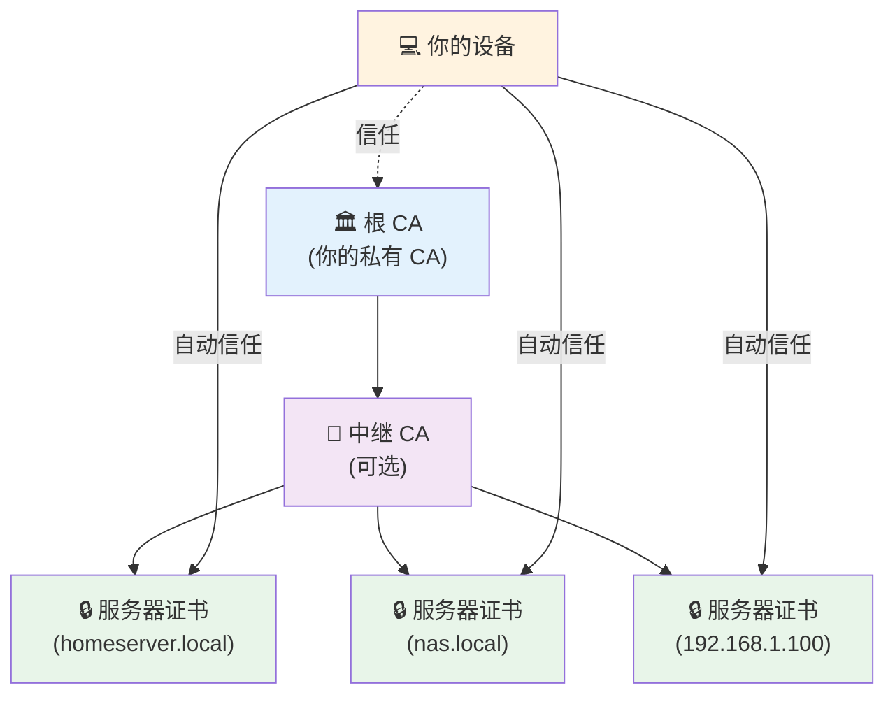
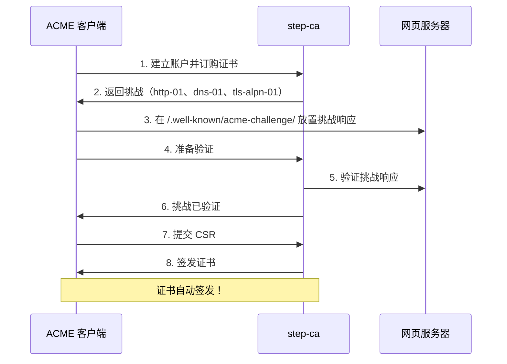
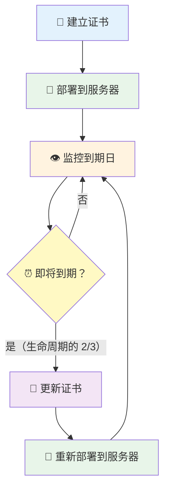

你已经建立了一个漂亮的家庭实验室，包含多个服务——Nextcloud、Home Assistant、Plex，也许还有 NAS。一切运作良好，除了一件烦人的事：每次通过 HTTPS 访问这些服务时，浏览器都会大喊"你的连接不是私人连接！"

当然，你可以每次都点击"高级"和"继续前往"。但如果我告诉你有更好的方法呢？欢迎来到私有证书授权中心的世界。

## 为什么需要私有 CA

**问题所在：**

当你访问 `https://192.168.1.100` 或 `https://homeserver.local` 时，浏览器不信任该连接，因为：
- 自签证书默认不受信任
- 公开 CA（Let's Encrypt、DigiCert）不会为私有 IP 地址或 `.local` 域名签发证书
- 每次点击跳过安全警告会失去 HTTPS 的意义

**解决方案：**

建立你自己的证书授权中心（CA），它可以：
- 为你的内部服务签发证书
- 安装后被你所有设备信任
- 离线运作，无需外部依赖
- 让你完全控制证书生命周期

## 理解基础概念

### 什么是证书授权中心？

CA 是签发数字证书的实体。当你的浏览器信任某个 CA 时，它会自动信任该 CA 签署的任何证书。

**信任链：**



### 根 CA vs 中继 CA

- **根 CA：** 最高层级的授权中心。保持离线并确保安全。
- **中继 CA：** 签署实际证书。可以撤销而不影响根 CA。
- **服务器证书：** 你的服务用于 HTTPS 的证书。

!!!tip "💡 最佳实践"
    使用两层架构：根 CA → 中继 CA → 服务器证书。这样，如果中继 CA 被入侵，你可以撤销它而无需在所有设备上重新信任根 CA。

## 建立你的私有 CA

### 方法 1：使用 OpenSSL（手动控制）

**步骤 1：建立根 CA**

```bash
# 生成根 CA 私钥（务必妥善保管！）
openssl genrsa -aes256 -out root-ca.key 4096

# 建立根 CA 证书（有效期 10 年）
openssl req -x509 -new -nodes -key root-ca.key -sha256 -days 3650 \
  -out root-ca.crt \
  -subj "/C=US/ST=State/L=City/O=Home Lab/CN=Home Lab Root CA"
```

**步骤 2：建立中继 CA**

```bash
# 生成中继 CA 私钥
openssl genrsa -aes256 -out intermediate-ca.key 4096

# 建立证书签署请求（CSR）
openssl req -new -key intermediate-ca.key -out intermediate-ca.csr \
  -subj "/C=US/ST=State/L=City/O=Home Lab/CN=Home Lab Intermediate CA"

# 使用根 CA 签署中继 CA
openssl x509 -req -in intermediate-ca.csr -CA root-ca.crt -CAkey root-ca.key \
  -CAcreateserial -out intermediate-ca.crt -days 1825 -sha256 \
  -extfile <(echo "basicConstraints=CA:TRUE")
```

**步骤 3：签发服务器证书**

```bash
# 生成服务器私钥
openssl genrsa -out homeserver.key 2048

# 为服务器建立 CSR
openssl req -new -key homeserver.key -out homeserver.csr \
  -subj "/C=US/ST=State/L=City/O=Home Lab/CN=homeserver.local"

# 建立 SAN（主体别名）配置
cat > san.cnf <<EOF
[req]
distinguished_name = req_distinguished_name
req_extensions = v3_req

[req_distinguished_name]

[v3_req]
subjectAltName = @alt_names

[alt_names]
DNS.1 = homeserver.local
DNS.2 = homeserver
IP.1 = 192.168.1.100
EOF

# 使用中继 CA 签署服务器证书
openssl x509 -req -in homeserver.csr -CA intermediate-ca.crt \
  -CAkey intermediate-ca.key -CAcreateserial -out homeserver.crt \
  -days 365 -sha256 -extfile san.cnf -extensions v3_req
```

### 方法 2：使用 easy-rsa（简化版）

```bash
# 安装 easy-rsa
git clone https://github.com/OpenVPN/easy-rsa.git
cd easy-rsa/easyrsa3

# 初始化 PKI
./easyrsa init-pki

# 建立 CA
./easyrsa build-ca

# 生成服务器证书
./easyrsa gen-req homeserver nopass
./easyrsa sign-req server homeserver
```

### 方法 3：使用 step-ca（现代化方法 - 推荐）

[step-ca](https://smallstep.com/docs/step-ca) 是一个现代化的自动化 CA，简化了证书管理。可以把它想象成"家庭实验室的 Let's Encrypt"。

**为什么 step-ca 更好：**

- **自动化证书管理**，支持 ACME 协议
- **内建证书更新** - 无需手动脚本
- **OAuth/OIDC 集成**，用于 SSH 证书
- **简单的 CLI** - 无需复杂的 OpenSSL 命令
- **网页式工作流程**，用于证书请求
- **默认短期证书**（更好的安全性）
- **远程管理**功能

**安装：**

```bash
# macOS
brew install step

# Ubuntu/Debian
curl -fsSL https://packages.smallstep.com/keys/apt/repo-signing-key.gpg -o /etc/apt/trusted.gpg.d/smallstep.asc
echo 'deb [signed-by=/etc/apt/trusted.gpg.d/smallstep.asc] https://packages.smallstep.com/stable/debian debs main' | sudo tee /etc/apt/sources.list.d/smallstep.list
sudo apt update && sudo apt install step-cli step-ca

# RHEL/Fedora
sudo dnf install step-cli step-ca

# Windows (Winget)
winget install Smallstep.step-ca

# Docker
docker pull smallstep/step-ca
```

**初始化你的 CA：**

```bash
# 交互式设置
step ca init

# 系统会提示你输入：
# - PKI 名称（例如："Home Lab"）
# - DNS 名称（例如："ca.homelab.local"）
# - 监听地址（例如："127.0.0.1:8443"）
# - 第一个配置者电子邮件（例如："admin@homelab.local"）
# - CA 密钥密码

# 示例输出：
✔ What would you like to name your new PKI? Home Lab
✔ What DNS names or IP addresses would you like to add to your new CA? ca.homelab.local
✔ What address will your new CA listen at? 127.0.0.1:8443
✔ What would you like to name the first provisioner? admin@homelab.local
✔ What do you want your password to be? ********

✔ Root certificate: /home/user/.step/certs/root_ca.crt
✔ Root fingerprint: 702a094e239c9eec6f0dcd0a5f65e595bf7ed6614012825c5fe3d1ae1b2fd6ee
```

**高级初始化选项：**

```bash
# 支持 ACME（用于自动证书管理）
step ca init --acme

# 支持 SSH 证书
step ca init --ssh

# 用于 Kubernetes 部署
step ca init --helm

# 启用远程管理
step ca init --remote-management
```

**启动 CA 服务器：**

```bash
# 启动 CA
step-ca $(step path)/config/ca.json

# 或作为 systemd 服务运行
sudo systemctl enable step-ca
sudo systemctl start step-ca
```

**签发你的第一个证书：**

```bash
# 简单的证书签发
step ca certificate homeserver.local homeserver.crt homeserver.key

# 系统会提示你输入配置者密码
✔ Key ID: rQxROEr7Kx9TNjSQBTETtsu3GKmuW9zm02dMXZ8GUEk
✔ Please enter the password to decrypt the provisioner key: ********
✔ CA: https://ca.homelab.local:8443/1.0/sign
✔ Certificate: homeserver.crt
✔ Private Key: homeserver.key

# 使用主体别名（SAN）
step ca certificate homeserver.local homeserver.crt homeserver.key \
  --san homeserver \
  --san 192.168.1.100

# 自定义有效期
step ca certificate homeserver.local homeserver.crt homeserver.key \
  --not-after 8760h  # 1 年
```

**在客户端机器上信任你的 CA：**

```bash
# 启动信任（下载根 CA 并配置 step）
step ca bootstrap --ca-url https://ca.homelab.local:8443 \
  --fingerprint 702a094e239c9eec6f0dcd0a5f65e595bf7ed6614012825c5fe3d1ae1b2fd6ee

# 将根 CA 安装到系统信任存储区
step certificate install $(step path)/certs/root_ca.crt
```

**自动证书更新：**

step-ca 让更新变得简单：

```bash
# 更新证书（到期前）
step ca renew homeserver.crt homeserver.key
✔ Would you like to overwrite homeserver.crt [y/n]: y
Your certificate has been saved in homeserver.crt.

# 自动更新守护进程（在证书生命周期的 2/3 时更新）
step ca renew homeserver.crt homeserver.key --daemon

# 强制更新
step ca renew homeserver.crt homeserver.key --force
```

!!!warning "⏰ 更新时机"
    证书一旦过期，CA 将不会更新它。设置自动更新在证书生命周期的三分之二左右执行。`--daemon` 标志会自动处理这个问题。

**调整证书有效期：**

```bash
# 5 分钟证书（用于敏感访问）
step ca certificate localhost localhost.crt localhost.key --not-after=5m

# 90 天证书（用于服务器）
step ca certificate homeserver.local homeserver.crt homeserver.key --not-after=2160h

# 从现在起 5 分钟后开始有效的证书
step ca certificate localhost localhost.crt localhost.key --not-before=5m --not-after=240h
```

要更改全局默认值，编辑 `$(step path)/config/ca.json`：

```json
"authority": {
  "claims": {
    "minTLSCertDuration": "5m",
    "maxTLSCertDuration": "2160h",
    "defaultTLSCertDuration": "24h"
  }
}
```

**高级：单次使用令牌（用于容器/虚拟机）：**

生成短期令牌用于委派证书签发：

```bash
# 生成令牌（5 分钟后过期）
TOKEN=$(step ca token homeserver.local)
✔ Provisioner: admin@homelab.local (JWK)
✔ Please enter the password to decrypt the provisioner key: ********

# 在容器/虚拟机中：建立 CSR
step certificate create --csr homeserver.local homeserver.csr homeserver.key

# 在容器/虚拟机中：使用令牌获取证书
step ca sign --token $TOKEN homeserver.csr homeserver.crt
✔ CA: https://ca.homelab.local:8443
✔ Certificate: homeserver.crt
```

这非常适合：
- 启动时需要证书的 Docker 容器
- 虚拟机配置工作流程
- CI/CD 管道
- 在不共享 CA 凭证的情况下委派证书签发

**ACME 集成（类似 Let's Encrypt）：**

ACME（自动化证书管理环境）是 Let's Encrypt 使用的协议。step-ca 支持 ACME，实现完全自动化的证书签发和更新。

**启用 ACME：**

```bash
# 添加 ACME 配置者（如果初始化时未完成）
step ca provisioner add acme --type ACME

# 重新启动 step-ca 以应用更改
sudo systemctl restart step-ca
```

**ACME 挑战类型：**

| 挑战 | 端口 | 使用场景 | 难度 |
|-----------|------|----------|------------|
| **http-01** | 80 | 通用目的、网页服务器 | 简单 |
| **dns-01** | 53 | 通配符证书、防火墙后的服务器 | 中等 |
| **tls-alpn-01** | 443 | 仅 TLS 环境 | 中等 |

**使用 step 作为 ACME 客户端：**

```bash
# HTTP-01 挑战（在端口 80 启动网页服务器）
step ca certificate --provisioner acme neo01.com example.crt example.key

✔ Provisioner: acme (ACME)
Using Standalone Mode HTTP challenge to validate neo01.com .. done!
Waiting for Order to be 'ready' for finalization .. done!
Finalizing Order .. done!
✔ Certificate: example.crt
✔ Private Key: example.key
```

**使用 certbot：**

```bash
# HTTP-01 挑战
certbot certonly --standalone \
  --server https://ca.homelab.local:8443/acme/acme/directory \
  -d homeserver.local \
  --register-unsafely-without-email

# DNS-01 挑战（用于通配符证书）
certbot certonly --manual --preferred-challenges dns \
  --server https://ca.homelab.local:8443/acme/acme/directory \
  -d '*.homelab.local'

# 自动更新
certbot renew --server https://ca.homelab.local:8443/acme/acme/directory
```

**使用 acme.sh：**

```bash
# HTTP-01 挑战
acme.sh --issue --standalone \
  --server https://ca.homelab.local:8443/acme/acme/directory \
  -d homeserver.local

# 使用 Cloudflare 的 DNS-01
export CF_Token="your-cloudflare-api-token"
acme.sh --issue --dns dns_cf \
  --server https://ca.homelab.local:8443/acme/acme/directory \
  -d homeserver.local

# 自动更新（每日运行）
acme.sh --cron
```

**ACME 流程图：**



**为什么 ACME 更好：**

- **零人工干预** - 完全自动化的证书生命周期
- **自动更新** - 不会有过期的证书
- **行业标准** - 适用于任何 ACME 客户端
- **大规模验证** - 支持 Let's Encrypt（数十亿证书）
- **内建验证** - 自动证明域名/IP 所有权

**与 Traefik 集成：**

```yaml
# traefik.yml
entryPoints:
  websecure:
    address: ":443"

certificatesResolvers:
  homelab:
    acme:
      caServer: https://ca.homelab.local:8443/acme/acme/directory
      storage: /acme.json
      tlsChallenge: {}

# docker-compose.yml
services:
  whoami:
    image: traefik/whoami
    labels:
      - "traefik.http.routers.whoami.rule=Host(`whoami.homelab.local`)"
      - "traefik.http.routers.whoami.tls.certresolver=homelab"
```

**Docker Compose 配置：**

```yaml
version: '3'
services:
  step-ca:
    image: smallstep/step-ca
    ports:
      - "8443:8443"
    volumes:
      - step-ca-data:/home/step
    environment:
      - DOCKER_STEPCA_INIT_NAME=Home Lab
      - DOCKER_STEPCA_INIT_DNS_NAMES=ca.homelab.local
      - DOCKER_STEPCA_INIT_PROVISIONER_NAME=admin@homelab.local
    restart: unless-stopped

volumes:
  step-ca-data:
```

**比较：OpenSSL vs step-ca**

| 任务 | OpenSSL | step-ca |
|------|---------|----------|
| **建立 CA** | 多个命令、配置文件 | `step ca init` |
| **签发证书** | 5+ 个命令加配置 | `step ca certificate` |
| **更新** | 手动脚本 | `step ca renew --daemon` |
| **ACME 支持** | 未内建 | 内建 |
| **学习曲线** | 陡峭 | 平缓 |
| **自动化** | DIY | 内建 |
| **SSH 证书** | 复杂 | `step ssh` 命令 |

!!!tip "💡 何时使用 step-ca"
    如果你符合以下情况，请使用 step-ca：
    - 想要自动化证书管理
    - 需要 ACME 协议支持
    - 想与现代工具集成（Traefik、Kubernetes）
    - 偏好简单的 CLI 而非复杂的 OpenSSL 命令
    - 需要 SSH 证书管理
    - 想要内建的更新自动化
    
    如果你符合以下情况，请坚持使用 OpenSSL：
    - 需要对每个细节的最大控制
    - 有现有的基于 OpenSSL 的工作流程
    - 在无法获取 step-ca 二进制文件的隔离环境中工作
    - 需要 step-ca 不支持的特定证书扩展功能

## 安装你的 CA 证书

### Windows

1. 双击 `root-ca.crt`
2. 点击"安装证书"
3. 选择"本地计算机"
4. 选择"将所有证书放入以下存储"
5. 选择"受信任的根证书颁发机构"
6. 点击"完成"

### macOS

```bash
sudo security add-trusted-cert -d -r trustRoot -k /Library/Keychains/System.keychain root-ca.crt
```

### Linux (Ubuntu/Debian)

```bash
sudo cp root-ca.crt /usr/local/share/ca-certificates/homelab-root-ca.crt
sudo update-ca-certificates
```

### iOS/iPadOS

1. 将 `root-ca.crt` 发送给自己或放在网页服务器上
2. 在设备上打开文件
3. 前往"设置"→"通用"→"VPN 与设备管理"
4. 安装描述文件
5. 前往"设置"→"通用"→"关于本机"→"证书信任设置"
6. 为该证书启用完全信任

### Android

1. 将 `root-ca.crt` 复制到设备
2. "设置"→"安全"→"加密与凭据"→"安装证书"
3. 选择"CA 证书"
4. 浏览并选择你的证书

## 配置服务

### Nginx

```nginx
server {
    listen 443 ssl;
    server_name homeserver.local;

    ssl_certificate /path/to/homeserver.crt;
    ssl_certificate_key /path/to/homeserver.key;
    
    # 可选：包含中继 CA
    # ssl_certificate 应包含：服务器证书 + 中继证书
    
    ssl_protocols TLSv1.2 TLSv1.3;
    ssl_ciphers HIGH:!aNULL:!MD5;
    
    location / {
        proxy_pass http://localhost:8080;
    }
}
```

### Apache

```apache
<VirtualHost *:443>
    ServerName homeserver.local
    
    SSLEngine on
    SSLCertificateFile /path/to/homeserver.crt
    SSLCertificateKeyFile /path/to/homeserver.key
    SSLCertificateChainFile /path/to/intermediate-ca.crt
    
    ProxyPass / http://localhost:8080/
    ProxyPassReverse / http://localhost:8080/
</VirtualHost>
```

### Docker Compose

```yaml
version: '3'
services:
  web:
    image: nginx:alpine
    ports:
      - "443:443"
    volumes:
      - ./nginx.conf:/etc/nginx/nginx.conf
      - ./homeserver.crt:/etc/nginx/ssl/cert.crt
      - ./homeserver.key:/etc/nginx/ssl/cert.key
```

## 证书管理

### 证书生命周期



### 更新脚本

```bash
#!/bin/bash
# renew-cert.sh

DOMAIN="homeserver.local"
CERT_DIR="/etc/ssl/homelab"

# 生成新的密钥和 CSR
openssl genrsa -out ${CERT_DIR}/${DOMAIN}.key 2048
openssl req -new -key ${CERT_DIR}/${DOMAIN}.key \
  -out ${CERT_DIR}/${DOMAIN}.csr \
  -subj "/CN=${DOMAIN}"

# 使用中继 CA 签署
openssl x509 -req -in ${CERT_DIR}/${DOMAIN}.csr \
  -CA ${CERT_DIR}/intermediate-ca.crt \
  -CAkey ${CERT_DIR}/intermediate-ca.key \
  -CAcreateserial -out ${CERT_DIR}/${DOMAIN}.crt \
  -days 365 -sha256

# 重新加载 nginx
systemctl reload nginx

echo "Certificate renewed for ${DOMAIN}"
```

### 使用 Cron 自动化

```bash
# 添加到 crontab：在到期前 30 天更新
0 0 1 * * /path/to/renew-cert.sh
```

## 安全最佳实践

!!!danger "⚠️ 关键安全措施"
    **保护你的根 CA 私钥：**
    - 存储在加密的 USB 闪存盘上并离线保存
    - 绝不暴露于网络
    - 使用强密码（AES-256）
    - 保留多个加密备份
    - 生产环境考虑使用硬件安全模块（HSM）

**关键安全措施：**

1. **分离根 CA 和中继 CA**
   - 根 CA：离线，仅用于签署中继 CA
   - 中继 CA：在线，签署服务器证书

2. **使用强密钥大小**
   - 根 CA：4096 位 RSA 或 EC P-384
   - 中继 CA：4096 位 RSA 或 EC P-384
   - 服务器证书：最少 2048 位 RSA

3. **设置适当的有效期**
   - 根 CA：10-20 年
   - 中继 CA：5 年
   - 服务器证书：1 年（更容易轮换）

4. **实施证书撤销**
   - 维护证书撤销列表（CRL）
   - 或使用在线证书状态协议（OCSP）

5. **审计和监控**
   - 记录所有证书签发
   - 监控未授权的证书
   - 定期安全审计

## 常见问题与解决方案

### 问题：浏览器仍显示警告

**原因：**
- CA 证书未正确安装
- 证书未包含正确的 SAN（主体别名）
- 通过 IP 访问但证书只有 DNS 名称

**解决方案：**
```bash
# 检查证书 SAN
openssl x509 -in homeserver.crt -text -noout | grep -A1 "Subject Alternative Name"

# 确保证书包含所有访问方式
DNS.1 = homeserver.local
DNS.2 = homeserver
IP.1 = 192.168.1.100
```

### 问题：证书链不完整

**解决方案：**
建立证书组合：
```bash
cat homeserver.crt intermediate-ca.crt > homeserver-bundle.crt
```

在服务器配置中使用组合文件。

### 问题：私钥权限

```bash
# 设置正确的权限
chmod 600 homeserver.key
chown root:root homeserver.key
```

## 高级：自动化证书管理

### 使用 step-ca 的 SSH 证书

如果你使用 `--ssh` 初始化，step-ca 也可以签发 SSH 证书以实现无密码验证。

**设置 SSH 用户验证：**

```bash
# 在 SSH 服务器上：信任用户 CA
step ssh config --roots > /etc/ssh/ssh_user_ca.pub

echo 'TrustedUserCAKeys /etc/ssh/ssh_user_ca.pub' | sudo tee -a /etc/ssh/sshd_config
sudo systemctl restart sshd

# 在客户端：获取 SSH 用户证书
step ssh certificate alice@homelab.local id_ecdsa
✔ Provisioner: admin@homelab.local (JWK)
✔ Please enter the password to decrypt the provisioner key: ********
✔ CA: https://ca.homelab.local:8443
✔ Private Key: id_ecdsa
✔ Certificate: id_ecdsa-cert.pub
✔ SSH Agent: yes

# 检查证书
cat id_ecdsa-cert.pub | step ssh inspect
```

**设置 SSH 主机验证：**

```bash
# 在 SSH 服务器上：获取主机证书
cd /etc/ssh
sudo step ssh certificate --host --sign server.homelab.local ssh_host_ecdsa_key.pub

# 配置 SSHD 使用证书
echo 'HostCertificate /etc/ssh/ssh_host_ecdsa_key-cert.pub' | sudo tee -a /etc/ssh/sshd_config
sudo systemctl restart sshd

# 在客户端：信任主机 CA
step ssh config --host --roots >> ~/.ssh/known_hosts
# 前面加上：@cert-authority *
```

**自动化 SSH 主机证书更新：**

```bash
# 建立每周更新 cron
cat <<EOF | sudo tee /etc/cron.weekly/renew-ssh-cert
#!/bin/sh
export STEPPATH=/root/.step
cd /etc/ssh && step ssh renew ssh_host_ecdsa_key-cert.pub ssh_host_ecdsa_key --force
exit 0
EOF
sudo chmod 755 /etc/cron.weekly/renew-ssh-cert
```

### 使用 step-ca 与 nginx-proxy-manager

```bash
# 1. 从 step-ca 获取证书
step ca certificate npm.homelab.local npm.crt npm.key

# 2. 在 nginx-proxy-manager UI 中：
#    - SSL 证书 → 添加 SSL 证书 → 自定义
#    - 上传 npm.crt 和 npm.key
#    - 使用 step ca renew --daemon 设置自动更新
```

### 使用 step-ca 与 Home Assistant

```yaml
# configuration.yaml
http:
  ssl_certificate: /ssl/homeassistant.crt
  ssl_key: /ssl/homeassistant.key

# 获取证书
# step ca certificate homeassistant.local /ssl/homeassistant.crt /ssl/homeassistant.key
```

### 监控和管理

```bash
# 检查证书到期日
step certificate inspect homeserver.crt --short
X.509v3 TLS Certificate (ECDSA P-256) [Serial: 7720...1576]
  Subject:     homeserver.local
  Issuer:      Home Lab Intermediate CA
  Valid from:  2025-05-15T00:59:37Z
          to:  2025-05-16T01:00:37Z

# 撤销证书（被动撤销 - 阻止更新）
step ca revoke --cert homeserver.crt --key homeserver.key
✔ CA: https://ca.homelab.local:8443
Certificate with Serial Number 30671613121311574910895916201205874495 has been revoked.

# 列出配置者
step ca provisioner list
```

## 比较：私有 CA vs Let's Encrypt

| 功能 | 私有 CA | Let's Encrypt |
|---------|-----------|---------------|
| **成本** | 免费 | 免费 |
| **内部 IP** | ✅ 是 | ❌ 否 |
| **`.local` 域名** | ✅ 是 | ❌ 否 |
| **离线运作** | ✅ 是 | ❌ 否 |
| **自动更新** | 手动/自定义 | ✅ 内建 |
| **公开信任** | ❌ 否 | ✅ 是 |
| **设置复杂度** | 中等 | 低 |
| **维护** | 手动 | 自动化 |

**何时使用私有 CA：**
- 仅限内部服务
- 私有 IP 地址
- `.local` 或自定义 TLD
- 隔离网络
- 需要完全控制

**何时使用 Let's Encrypt：**
- 公开服务
- 公开域名
- 想要自动更新
- 不想管理 CA 基础设施

## 资源

- **[OpenSSL 文档](https://www.openssl.org/docs/)：** 完整的 OpenSSL 参考
- **[easy-rsa](https://github.com/OpenVPN/easy-rsa)：** 简化的 CA 管理
- **[step-ca](https://smallstep.com/docs/step-ca)：** 支持 ACME 的现代化 CA
- **[PKI 教程](https://pki-tutorial.readthedocs.io/)：** 全面的 PKI 指南

## 结论

建立私有 CA 一开始可能看起来令人生畏，但一旦配置完成，它就能消除那些烦人的浏览器警告，并为你的家庭实验室服务提供适当的加密。初期的时间投资会带来更专业、更安全的家庭网络。

**重点摘要：**
- 私有 CA 为内部服务启用受信任的 HTTPS
- **推荐使用 step-ca** 进行现代化的自动证书管理
- 两层架构（根 + 中继）提供更好的安全性
- 在所有设备上安装一次根 CA 证书
- 自动化证书更新以避免到期问题（step-ca 让这变得简单）
- 保持根 CA 私钥离线并确保安全
- SSH 证书消除密码验证并提高安全性

**快速入门建议：**

对于大多数家庭实验室，使用 step-ca：
1. `step ca init --acme --ssh`（一个命令设置）
2. `step certificate install $(step path)/certs/root_ca.crt`（在所有设备上信任）
3. `step ca certificate service.local service.crt service.key`（获取证书）
4. `step ca renew service.crt service.key --daemon`（自动更新）

从单一服务开始，熟悉流程后，再扩展到整个家庭实验室。当你不再需要点击安全警告时，未来的你会感谢现在的自己！🔒
