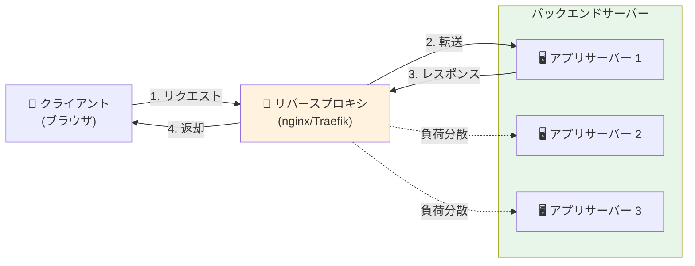
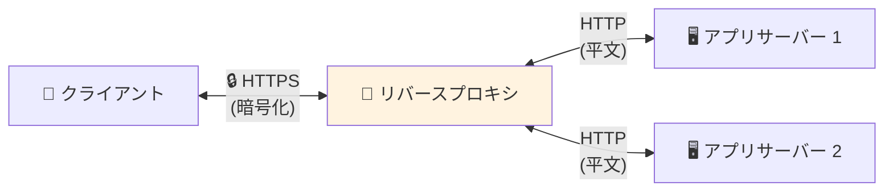
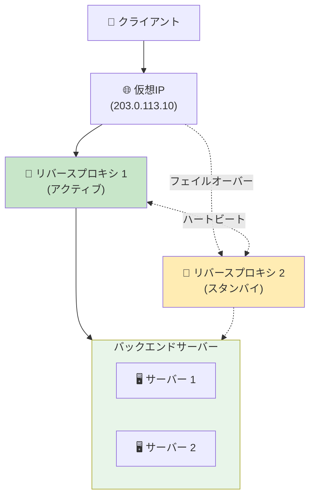

ウェブサイトにアクセスし、ボタンをクリックします。その裏側では、リクエストはアプリケーションを実行しているサーバーに直接送られるわけではありません。代わりに、まず別のものに到達します—リバースプロキシです。

ほとんどのユーザーはその存在を知りません。しかし、エンタープライズアーキテクトにとっては不可欠なものです。

## リバースプロキシとは？

リバースプロキシは、クライアントとバックエンドサーバーの間に位置するサーバーで、クライアントのリクエストを適切なバックエンドサーバーに転送し、サーバーのレスポンスをクライアントに返します。

**主な違い：**

- **フォワードプロキシ：** クライアントの前に位置し、クライアントに代わってサーバーにリクエストを転送
- **リバースプロキシ：** サーバーの前に位置し、サーバーに代わってクライアントにリクエストを転送

### 実世界のアナロジー

リバースプロキシをホテルのコンシェルジュと考えてみましょう：

**リバースプロキシなし：**
- ゲストがスタッフのドア（シェフ、ハウスキーパー、マネージャー）を直接ノック
- 各スタッフが自分のドアを管理
- 複数のゲストが到着すると混乱
- 誰が忙しいか利用可能かわからない

**リバースプロキシあり：**
- すべてのゲストがまずコンシェルジュデスクへ
- コンシェルジュはどのスタッフに連絡すべきか把握
- リクエストを均等に分配
- 混雑時も優雅に対応
- スタッフは中断されずに作業可能

コンシェルジュは実際の作業を行うわけではありません—効率的にリクエストをルーティングし、スタッフが圧倒されないよう保護します。

## リバースプロキシはどのように機能するか？



**リクエストフロー：**

1. **クライアントがリクエスト送信** → `https://neo01.com/api/users`
2. **DNS解決** → リバースプロキシのIPを指す
3. **リバースプロキシが受信** → リクエストを検査（URL、ヘッダー、メソッド）
4. **ルーティング決定** → どのバックエンドサーバーを使用するか決定
5. **リクエスト転送** → バックエンドサーバーに送信
6. **バックエンドが処理** → レスポンスを生成
7. **プロキシが返却** → クライアントにレスポンスを送り返す

**クライアントが見るもの：**
```
リクエスト: https://neo01.com/api/users
レスポンス: 200 OK
```

**実際に起こっていること：**
```
クライアント → リバースプロキシ (203.0.113.10)
リバースプロキシ → バックエンドサーバー (10.0.1.5:8080)
バックエンドサーバー → リバースプロキシ
リバースプロキシ → クライアント
```

クライアントはバックエンドサーバーの実際のIPアドレスやポートを知ることはありません。


## エンタープライズ設計にリバースプロキシが必要な理由

### 1. 負荷分散

**問題：** 単一サーバーではピーク時のすべてのトラフィックを処理できない。

**解決策：** リバースプロキシが複数のサーバーにリクエストを分散。

```
100 リクエスト/秒 → リバースプロキシ
                   ├─> サーバー 1 (33 req/sec)
                   ├─> サーバー 2 (33 req/sec)
                   └─> サーバー 3 (34 req/sec)
```

**負荷分散アルゴリズム：**

- **ラウンドロビン：** リクエストを順次分配
- **最小接続数：** アクティブな接続が最も少ないサーバーに送信
- **IPハッシュ：** 同じクライアントは常に同じサーバーへ（セッション永続性）
- **重み付け：** サーバー容量に基づいて分配

**実世界への影響：**

負荷分散なし：
- サーバー 1: 過負荷（クラッシュ）
- サーバー 2: アイドル
- サーバー 3: アイドル
- 結果: サービスダウン

負荷分散あり：
- すべてのサーバーが負荷を均等に共有
- 単一の過負荷ポイントなし
- 1つが故障しても優雅に劣化

### 2. SSL/TLS終端

**問題：** すべてのバックエンドサーバーにSSL証明書と暗号化オーバーヘッドが必要。

**解決策：** リバースプロキシがすべてのSSL/TLS暗号化/復号化を処理。



**メリット：**

- **単一証明書：** SSL証明書を1か所で管理
- **CPU負荷軽減：** バックエンドサーバーはトラフィックを復号化しない
- **更新の簡素化：** アプリに触れずにSSL設定を更新
- **集中セキュリティ：** TLSバージョンと暗号を統一的に強制

**コスト削減：**

- リバースプロキシなし: 10サーバー × $50/証明書 = $500/年
- リバースプロキシあり: 1サーバー × $50/証明書 = $50/年

### 3. セキュリティレイヤー

**問題：** バックエンドサーバーがインターネット攻撃に直接さらされる。

**解決策：** リバースプロキシがセキュリティバリアとして機能。

**保護メカニズム：**

**バックエンドインフラの隠蔽：**
```
クライアントが見るもの: https://api.neo01.com
実際のバックエンド: http://10.0.1.5:8080 (隠蔽)
```

**レート制限：**
```nginx
# IP毎に秒間10リクエストに制限
limit_req_zone $binary_remote_addr zone=api:10m rate=10r/s;
```

**IPフィルタリング：**
```nginx
# 特定のIPをブロック
deny 192.168.1.100;
# 特定の範囲のみ許可
allow 10.0.0.0/8;
deny all;
```

**DDoS緩和：**
- IP毎の接続制限
- リクエストレート制限
- 悪用IPの自動ブラックリスト化

**Webアプリケーションファイアウォール（WAF）：**
- SQLインジェクション検出
- XSS攻撃防止
- 悪意のあるペイロードフィルタリング

### 4. キャッシング

**問題：** バックエンドサーバーが同じレスポンスを繰り返し生成。

**解決策：** リバースプロキシがレスポンスをキャッシュし、バックエンド負荷を軽減。

**キャッシュフロー：**

```
最初のリクエスト：
クライアント → プロキシ (キャッシュミス) → バックエンド → レスポンス生成
                             ← キャッシュに保存 ← 返却

後続のリクエスト：
クライアント → プロキシ (キャッシュヒット) → キャッシュされたレスポンスを返却
         (バックエンドに触れない)
```

**パフォーマンスへの影響：**

| シナリオ | レスポンス時間 | バックエンド負荷 |
|----------|---------------|-----------------|
| キャッシュなし | 200ms | 100% |
| 50%キャッシュヒット | 110ms | 50% |
| 90%キャッシュヒット | 38ms | 10% |

**キャッシュ例：**

```nginx
# 静的アセットを1日キャッシュ
location ~* \\.(jpg|jpeg|png|css|js)$ {
    proxy_cache my_cache;
    proxy_cache_valid 200 1d;
    proxy_pass http://backend;
}
```

### 5. 簡素化されたルーティング

**問題：** 異なるポート/サーバー上の複数のサービス、クライアントにとって複雑。

**解決策：** パスベースのルーティングを持つ単一エントリポイント。

**リバースプロキシなし：**
```
https://app1.neo01.com:8080  → サービス 1
https://app2.neo01.com:8081  → サービス 2
https://app3.neo01.com:8082  → サービス 3
```

**リバースプロキシあり：**
```
https://neo01.com/app1  → サービス 1 (10.0.1.5:8080)
https://neo01.com/app2  → サービス 2 (10.0.1.6:8081)
https://neo01.com/app3  → サービス 3 (10.0.1.7:8082)
```

**ルーティング設定：**

```nginx
location /app1 {
    proxy_pass http://10.0.1.5:8080;
}

location /app2 {
    proxy_pass http://10.0.1.6:8081;
}

location /api {
    proxy_pass http://api-cluster;
}
```

**メリット：**

- **単一ドメイン：** 覚えやすく管理しやすい
- **CORS問題なし：** すべてのサービスが同じオリジンから提供されているように見える
- **柔軟なデプロイ：** クライアントURLを変更せずにサービスを移動
- **マイクロサービスフレンドリー：** 異なるサービスに透過的にルーティング

### 6. ゼロダウンタイムデプロイメント

**問題：** 更新のデプロイにはサーバーをオフラインにする必要がある。

**解決策：** リバースプロキシがローリングデプロイメントを可能に。

**デプロイプロセス：**

```
初期状態：
プロキシ → サーバー 1 (v1.0) ✅
        → サーバー 2 (v1.0) ✅
        → サーバー 3 (v1.0) ✅

ステップ 1: サーバー 1を更新
プロキシ → サーバー 1 (v1.1) 🔄 (プールから削除)
        → サーバー 2 (v1.0) ✅
        → サーバー 3 (v1.0) ✅

ステップ 2: サーバー 1を戻す
プロキシ → サーバー 1 (v1.1) ✅
        → サーバー 2 (v1.0) ✅
        → サーバー 3 (v1.0) ✅

ステップ 3-4: サーバー 2と3で繰り返し
プロキシ → サーバー 1 (v1.1) ✅
        → サーバー 2 (v1.1) ✅
        → サーバー 3 (v1.1) ✅
```

**ヘルスチェック：**

```nginx
upstream backend {
    server 10.0.1.5:8080 max_fails=3 fail_timeout=30s;
    server 10.0.1.6:8080 max_fails=3 fail_timeout=30s;
    server 10.0.1.7:8080 max_fails=3 fail_timeout=30s;
}
```

サーバーがヘルスチェックに失敗すると、プロキシは自動的にローテーションから削除します。


## それは別の障害点なのか？

**短い答え：** はい、しかし計算されたトレードオフです。

**長い答え：** 適切に実装された場合、メリットはリスクをはるかに上回ります。

### 懸念

```
クライアント → リバースプロキシ → バックエンドサーバー
              ↓
         単一障害点？
```

リバースプロキシがダウンすると、バックエンドサーバーが健全であっても、すべてのサービスが到達不能になります。

### 現実：緩和戦略

#### 1. 高可用性セットアップ

**アクティブ-パッシブ：**



**仕組み：**
- 2つのリバースプロキシが仮想IPを共有
- プライマリがすべてのトラフィックを処理
- セカンダリがハートビートでプライマリを監視
- プライマリが故障すると、セカンダリが仮想IPを引き継ぐ
- フェイルオーバー時間：1-3秒

**アクティブ-アクティブ：**

```
クライアント → DNSラウンドロビン
         ├─> リバースプロキシ 1 (50%トラフィック)
         └─> リバースプロキシ 2 (50%トラフィック)
                    ↓
              バックエンドサーバー
```

**メリット：**
- 両方のプロキシがトラフィックを処理
- リソース利用率の向上
- 自動負荷分散
- 1つが故障しても、もう1つが100%処理

#### 2. リバースプロキシはバックエンドよりシンプル

**複雑さの比較：**

| コンポーネント | 複雑さ | 故障確率 |
|--------------|--------|---------|
| バックエンドアプリ | 高（ビジネスロジック、データベース、依存関係） | 高い |
| リバースプロキシ | 低（ルーティング、転送） | 低い |

**リバースプロキシがより信頼性が高い理由：**

- **ステートレス：** データベースなし、セッションなし（通常）
- **シンプルなロジック：** ルーティングと転送のみ
- **実戦テスト済み：** nginx/HAProxy/Traefikは成熟
- **依存関係が少ない：** 外部サービスが最小限
- **監視が容易：** シンプルなヘルスチェック

**故障率の例：**

```
バックエンドアプリケーション: 99.5%稼働率（年間43.8時間のダウンタイム）
リバースプロキシ: 99.95%稼働率（年間4.38時間のダウンタイム）

HAリバースプロキシ: 99.99%稼働率（年間52分のダウンタイム）
```

#### 3. 監視とアラート

**ヘルスチェック監視：**

```yaml
# Prometheus監視例
- alert: ReverseProxyDown
  expr: up{job="reverse-proxy"} == 0
  for: 1m
  annotations:
    summary: "リバースプロキシがダウン"
    description: "リバースプロキシ {{ $labels.instance }} が1分間ダウンしています"
```

**自動復旧：**

```bash
# Systemd自動再起動
[Service]
Restart=always
RestartSec=5s
```

**監視メトリクス：**

- リクエストレート
- レスポンス時間
- エラーレート（4xx、5xx）
- バックエンドヘルスステータス
- 接続数
- CPU/メモリ使用量

#### 4. 地理的分散

**マルチリージョンセットアップ：**

```
         グローバルDNS（GeoDNS）
              ↓
    ┌─────────┴─────────┐
    ↓                   ↓
米国リージョン        EUリージョン
リバースプロキシ      リバースプロキシ
    ↓                   ↓
米国バックエンド      EUバックエンド
```

**メリット：**

- **リージョナルフェイルオーバー：** 米国リージョンが故障してもトラフィックはEUへ
- **レイテンシ削減：** ユーザーは最寄りのリージョンに接続
- **災害復旧：** リージョン全体が故障しても完全な停止なし

### リスク比較

**リバースプロキシなし：**

```
リスク：
❌ 各バックエンドが攻撃にさらされる
❌ 負荷分散なし（単一サーバー過負荷）
❌ 複雑なSSL管理
❌ キャッシングなし（高いバックエンド負荷）
❌ 困難なデプロイメント
❌ 集中監視なし

故障モード：
- 個々のサーバーが圧倒される
- DDoSがすべてのサーバーをダウンさせる
- 1つのサーバーでSSL証明書が期限切れ
```

**リバースプロキシあり：**

```
リスク：
⚠️ リバースプロキシが単一点（HAで緩和）

メリット：
✅ 保護されたバックエンド
✅ 負荷分散
✅ 集中SSL
✅ キャッシングが負荷を軽減
✅ ゼロダウンタイムデプロイメント
✅ 集中監視

故障モード：
- リバースプロキシが故障（しかしHAセットアップがこれを防ぐ）
- バックエンド故障よりはるかに低い確率
```

### 評決

**リバースプロキシは単一障害点か？**

技術的にはイエスですが：

1. **バックエンドアプリケーションより信頼性が高い**
2. **HAセットアップが単一点を排除**
3. **メリットがリスクをはるかに上回る**
4. **業界標準**には理由がある

**リスク評価：**

| シナリオ | 可用性 | 複雑さ | コスト |
|---------|--------|--------|--------|
| リバースプロキシなし | 99.5% | 低 | 低 |
| 単一リバースプロキシ | 99.95% | 中 | 中 |
| HAリバースプロキシ | 99.99% | 中-高 | 中-高 |
| マルチリージョンHA | 99.999% | 高 | 高 |

!!!tip "💡 ベストプラクティス"
    本番システムの場合：
    - **最小限：** 自動再起動付き単一リバースプロキシ
    - **推奨：** アクティブ-パッシブHAセットアップ
    - **エンタープライズ：** アクティブ-アクティブマルチリージョン
    
    単一のリバースプロキシでも、バックエンドを直接公開するよりも信頼性が高いです。


## 人気のリバースプロキシソリューション

### nginx

**最適用途：** 高性能な静的コンテンツとシンプルなルーティング

**長所：**
- 非常に高速で軽量
- 低メモリフットプリント
- 実戦テスト済み（トップウェブサイトの30%以上で使用）
- 優れたドキュメント

**短所：**
- 設定が複雑になる可能性
- 設定変更にはリロードが必要
- 動的設定が限定的

**ユースケース：** 従来のWebアプリケーション、高トラフィックサイト

### Traefik

**最適用途：** Docker/Kubernetes環境、マイクロサービス

**長所：**
- 自動サービスディスカバリー
- 動的設定（リロード不要）
- Let's Encrypt組み込みサポート
- 美しいダッシュボード

**短所：**
- nginxよりリソース使用量が多い
- 学習曲線が急
- 若いプロジェクト（成熟度が低い）

**ユースケース：** コンテナベースのデプロイメント、クラウドネイティブアプリ

### HAProxy

**最適用途：** 高度な負荷分散、TCP/UDPプロキシング

**長所：**
- 非常に信頼性が高い
- 高度な負荷分散アルゴリズム
- 優れたパフォーマンス監視
- TCP/UDPサポート（HTTPだけでない）

**短所：**
- 設定構文が独特
- 他より直感的でない
- 主に負荷分散に焦点

**ユースケース：** 高可用性セットアップ、複雑なルーティングニーズ

### 比較

| 機能 | nginx | Traefik | HAProxy |
|------|-------|---------|---------|
| **パフォーマンス** | ⭐⭐⭐⭐⭐ | ⭐⭐⭐⭐ | ⭐⭐⭐⭐⭐ |
| **使いやすさ** | ⭐⭐⭐ | ⭐⭐⭐⭐ | ⭐⭐ |
| **Docker統合** | ⭐⭐⭐ | ⭐⭐⭐⭐⭐ | ⭐⭐⭐ |
| **動的設定** | ⭐⭐ | ⭐⭐⭐⭐⭐ | ⭐⭐⭐ |
| **成熟度** | ⭐⭐⭐⭐⭐ | ⭐⭐⭐ | ⭐⭐⭐⭐⭐ |
| **リソース使用量** | ⭐⭐⭐⭐⭐ | ⭐⭐⭐ | ⭐⭐⭐⭐ |

## クイックスタート例

### nginxリバースプロキシ

```nginx
# /etc/nginx/nginx.conf

http {
    # バックエンドサーバーを定義
    upstream backend {
        server 10.0.1.5:8080 weight=3;
        server 10.0.1.6:8080 weight=2;
        server 10.0.1.7:8080 weight=1;
    }

    # レート制限
    limit_req_zone $binary_remote_addr zone=api:10m rate=10r/s;

    server {
        listen 80;
        server_name neo01.com;

        # HTTPをHTTPSにリダイレクト
        return 301 https://$server_name$request_uri;
    }

    server {
        listen 443 ssl http2;
        server_name neo01.com;

        # SSL設定
        ssl_certificate /etc/ssl/certs/neo01.com.crt;
        ssl_certificate_key /etc/ssl/private/neo01.com.key;
        ssl_protocols TLSv1.2 TLSv1.3;

        # ログ
        access_log /var/log/nginx/access.log;
        error_log /var/log/nginx/error.log;

        # 静的ファイル（キャッシュ）
        location ~* \\.(jpg|jpeg|png|gif|css|js)$ {
            proxy_pass http://backend;
            proxy_cache my_cache;
            proxy_cache_valid 200 1d;
            expires 1d;
            add_header Cache-Control "public, immutable";
        }

        # APIエンドポイント（レート制限）
        location /api {
            limit_req zone=api burst=20 nodelay;
            
            proxy_pass http://backend;
            proxy_set_header Host $host;
            proxy_set_header X-Real-IP $remote_addr;
            proxy_set_header X-Forwarded-For $proxy_add_x_forwarded_for;
            proxy_set_header X-Forwarded-Proto $scheme;
            
            # タイムアウト
            proxy_connect_timeout 5s;
            proxy_send_timeout 10s;
            proxy_read_timeout 10s;
        }

        # ヘルスチェックエンドポイント
        location /health {
            access_log off;
            return 200 "OK\\n";
            add_header Content-Type text/plain;
        }
    }
}
```

### TraefikとDocker

```yaml
# docker-compose.yml
version: '3.8'

services:
  traefik:
    image: traefik:v2.10
    command:
      - "--api.dashboard=true"
      - "--providers.docker=true"
      - "--entrypoints.web.address=:80"
      - "--entrypoints.websecure.address=:443"
      - "--certificatesresolvers.myresolver.acme.email=admin@neo01.com"
      - "--certificatesresolvers.myresolver.acme.storage=/letsencrypt/acme.json"
      - "--certificatesresolvers.myresolver.acme.httpchallenge.entrypoint=web"
    ports:
      - "80:80"
      - "443:443"
    volumes:
      - /var/run/docker.sock:/var/run/docker.sock:ro
      - ./letsencrypt:/letsencrypt
    labels:
      - "traefik.http.routers.dashboard.rule=Host(`traefik.neo01.com`)"
      - "traefik.http.routers.dashboard.service=api@internal"

  app1:
    image: myapp:latest
    labels:
      - "traefik.enable=true"
      - "traefik.http.routers.app1.rule=Host(`app1.neo01.com`)"
      - "traefik.http.routers.app1.entrypoints=websecure"
      - "traefik.http.routers.app1.tls.certresolver=myresolver"
      - "traefik.http.services.app1.loadbalancer.server.port=8080"

  app2:
    image: myapp:latest
    labels:
      - "traefik.enable=true"
      - "traefik.http.routers.app2.rule=Host(`app2.neo01.com`)"
      - "traefik.http.routers.app2.entrypoints=websecure"
      - "traefik.http.routers.app2.tls.certresolver=myresolver"
      - "traefik.http.services.app2.loadbalancer.server.port=8080"
```

## 結論

リバースプロキシは現代のWebアーキテクチャの縁の下の力持ちです。負荷分散、セキュリティ、キャッシング、簡素化されたルーティングを提供しながら、保護するアプリケーションよりも信頼性が高いのです。

**重要なポイント：**

- **リバースプロキシはクライアントとバックエンドサーバーの間に位置**し、リクエストをインテリジェントにルーティング
- **エンタープライズ設計に不可欠**：負荷分散、セキュリティ、SSL終端、キャッシングのため
- **はい、潜在的な障害点です**が、HAセットアップと固有のシンプルさにより、代替案よりも信頼性が高い
- **適切に実装された場合、メリットがリスクをはるかに上回る**
- **本番デプロイメントの業界標準**

**複雑さに見合う価値はあるか？**

シンプルな単一サーバーセットアップを超えるものには、絶対にあります。運用上のメリット、セキュリティの改善、柔軟性により、リバースプロキシは現代のインフラストラクチャに不可欠です。

**クイック決定ガイド：**

- **小規模プロジェクト、単一サーバー：** オプション（ただし推奨）
- **複数のサーバーまたはサービス：** 絶対に使用
- **本番システム：** HAリバースプロキシセットアップを使用
- **エンタープライズ/重要システム：** マルチリージョンHAセットアップ

問題はリバースプロキシを使用するかどうかではなく、どれを選択し、どのように高可用性にするかです。🚀

## リソース

- **[nginxドキュメント](https://nginx.org/en/docs/)：** 公式nginxガイド
- **[Traefikドキュメント](https://doc.traefik.io/traefik/)：** 完全なTraefikリファレンス
- **[HAProxyドキュメント](https://www.haproxy.org/#docs)：** HAProxy設定ガイド
- **[Let's Encrypt](https://letsencrypt.org/)：** 無料SSL証明書
- **[Cloudflare](https://www.cloudflare.com/)：** グローバルリバースプロキシ/CDNサービス
