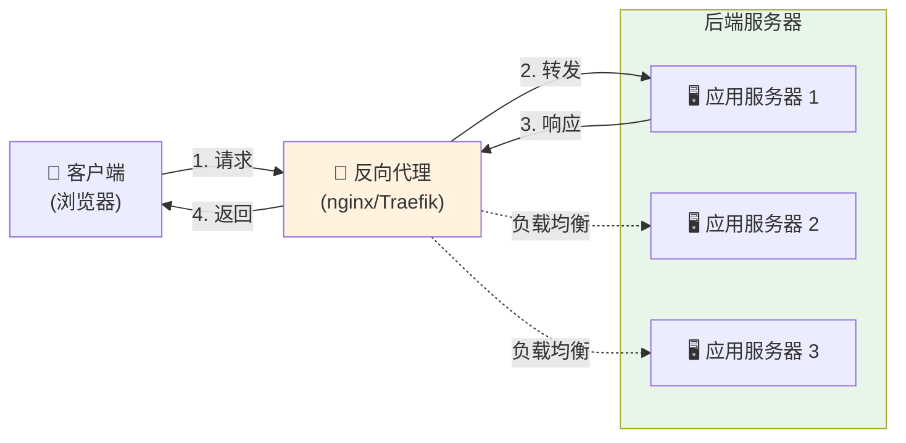
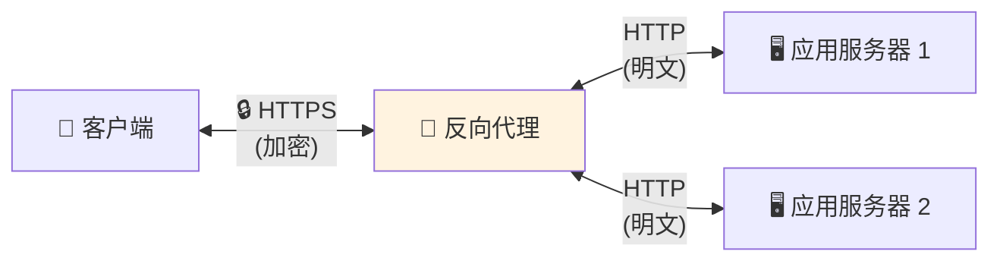
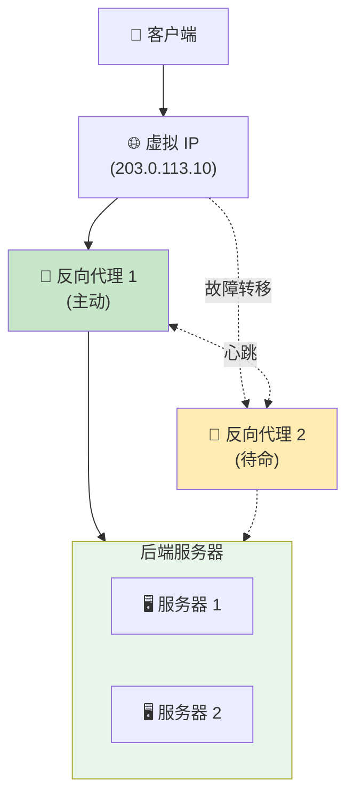

你访问一个网站。你点击一个按钮。在幕后，你的请求并不会直接到达运行应用程序的服务器。相反，它会先碰到其他东西——反向代理。

大多数用户从不知道它的存在。但对于企业架构师来说，它是不可或缺的。

## 什么是反向代理？

反向代理是一个位于客户端和后端服务器之间的服务器，将客户端请求转发到适当的后端服务器，并将服务器的响应返回给客户端。

**关键区别：**

- **正向代理：**位于客户端前面，代表客户端向服务器转发请求
- **反向代理：**位于服务器前面，代表服务器向客户端转发请求

### 现实世界类比

将反向代理想象成酒店礼宾部：

**没有反向代理：**
- 客人直接敲员工的门（厨师、管家、经理）
- 每个员工处理自己的门
- 多个客人到达时一片混乱
- 没人知道谁忙或谁有空

**有反向代理：**
- 所有客人先到礼宾台
- 礼宾知道该联系哪位员工
- 均匀分配请求
- 优雅地处理繁忙时段
- 员工可以不受干扰地工作

礼宾不做实际工作——他们有效地路由请求并保护员工不被压垮。

## 反向代理如何运作？



**请求流程：**

1. **客户端发送请求** → `https://neo01.com/api/users`
2. **DNS 解析** → 指向反向代理 IP
3. **反向代理接收** → 检查请求（URL、标头、方法）
4. **路由决策** → 决定使用哪个后端服务器
5. **转发请求** → 发送到后端服务器
6. **后端处理** → 生成响应
7. **代理返回** → 将响应发送回客户端

**客户端看到的：**
```
请求：https://neo01.com/api/users
响应：200 OK
```

**实际发生的：**
```
客户端 → 反向代理 (203.0.113.10)
反向代理 → 后端服务器 (10.0.1.5:8080)
后端服务器 → 反向代理
反向代理 → 客户端
```

客户端永远不知道后端服务器的真实 IP 地址或端口。

## 为什么企业设计需要反向代理

### 1. 负载均衡

**问题：**单一服务器无法处理高峰时段的所有流量。

**解决方案：**反向代理在多个服务器之间分配请求。

```
100 请求/秒 → 反向代理
              ├─> 服务器 1 (33 请求/秒)
              ├─> 服务器 2 (33 请求/秒)
              └─> 服务器 3 (34 请求/秒)
```

**负载均衡算法：**

- **轮询：**依序分配请求
- **最少连接：**发送到活动连接最少的服务器
- **IP 哈希：**同一客户端总是到同一服务器（会话持久性）
- **加权：**根据服务器容量分配

**实际影响：**

没有负载均衡：
- 服务器 1：过载（崩溃）
- 服务器 2：闲置
- 服务器 3：闲置
- 结果：服务中断

有负载均衡：
- 所有服务器均匀分担负载
- 没有单一过载点
- 如果一个失败，优雅降级

### 2. SSL/TLS 终止

**问题：**每个后端服务器都需要 SSL 证书和加密开销。

**解决方案：**反向代理处理所有 SSL/TLS 加密/解密。



**优点：**

- **单一证书：**在一个地方管理 SSL 证书
- **降低 CPU 负载：**后端服务器不解密流量
- **简化更新：**更新 SSL 配置无需触碰应用程序
- **集中式安全：**统一强制执行 TLS 版本和加密套件

**成本节省：**

- 没有反向代理：10 服务器 × $50/证书 = $500/年
- 有反向代理：1 服务器 × $50/证书 = $50/年

### 3. 安全层

**问题：**后端服务器直接暴露于互联网攻击。

**解决方案：**反向代理充当安全屏障。

**保护机制：**

**隐藏后端基础设施：**
```
客户端看到：https://api.neo01.com
真实后端：http://10.0.1.5:8080（隐藏）
```

**速率限制：**
```nginx
# 限制每个 IP 每秒 10 个请求
limit_req_zone $binary_remote_addr zone=api:10m rate=10r/s;
```

**IP 过滤：**
```nginx
# 封锁特定 IP
deny 192.168.1.100;
# 只允许特定范围
allow 10.0.0.0/8;
deny all;
```

**DDoS 缓解：**
- 每个 IP 的连接限制
- 请求速率限制
- 自动封锁滥用 IP

**Web 应用程序防火墙（WAF）：**
- SQL 注入检测
- XSS 攻击预防
- 恶意负载过滤

### 4. 缓存

**问题：**后端服务器重复生成相同的响应。

**解决方案：**反向代理缓存响应，减少后端负载。

**缓存流程：**

```
第一次请求：
客户端 → 代理（缓存未命中）→ 后端 → 生成响应
                              ← 存储在缓存 ← 返回

后续请求：
客户端 → 代理（缓存命中）→ 返回缓存的响应
         （不触碰后端）
```

**性能影响：**

| 情境 | 响应时间 | 后端负载 |
|------|---------|---------|
| 无缓存 | 200ms | 100% |
| 50% 缓存命中 | 110ms | 50% |
| 90% 缓存命中 | 38ms | 10% |

**缓存示例：**

```nginx
# 缓存静态资源 1 天
location ~* \.(jpg|jpeg|png|css|js)$ {
    proxy_cache my_cache;
    proxy_cache_valid 200 1d;
    proxy_pass http://backend;
}
```

### 5. 简化路由

**问题：**多个服务在不同端口/服务器上，对客户端来说很复杂。

**解决方案：**单一入口点，基于路径的路由。

**没有反向代理：**
```
https://app1.neo01.com:8080  → 服务 1
https://app2.neo01.com:8081  → 服务 2
https://app3.neo01.com:8082  → 服务 3
```

**有反向代理：**
```
https://neo01.com/app1  → 服务 1 (10.0.1.5:8080)
https://neo01.com/app2  → 服务 2 (10.0.1.6:8081)
https://neo01.com/app3  → 服务 3 (10.0.1.7:8082)
```

**路由配置：**

```nginx
location /app1 {
    proxy_pass http://10.0.1.5:8080;
}

location /app2 {
    proxy_pass http://10.0.1.6:8081;
}

location /api {
    proxy_pass http://api-cluster;
}
```

**优点：**

- **单一域名：**更容易记住和管理
- **无 CORS 问题：**所有服务看起来来自同一来源
- **灵活部署：**移动服务而不改变客户端 URL
- **微服务友好：**透明地路由到不同服务

### 6. 零停机部署

**问题：**部署更新需要让服务器离线。

**解决方案：**反向代理实现滚动部署。

**部署流程：**

```
初始状态：
代理 → 服务器 1 (v1.0) ✅
     → 服务器 2 (v1.0) ✅
     → 服务器 3 (v1.0) ✅

步骤 1：更新服务器 1
代理 → 服务器 1 (v1.1) 🔄（从池中移除）
     → 服务器 2 (v1.0) ✅
     → 服务器 3 (v1.0) ✅

步骤 2：将服务器 1 加回
代理 → 服务器 1 (v1.1) ✅
     → 服务器 2 (v1.0) ✅
     → 服务器 3 (v1.0) ✅

步骤 3-4：对服务器 2 和 3 重复
代理 → 服务器 1 (v1.1) ✅
     → 服务器 2 (v1.1) ✅
     → 服务器 3 (v1.1) ✅
```

**健康检查：**

```nginx
upstream backend {
    server 10.0.1.5:8080 max_fails=3 fail_timeout=30s;
    server 10.0.1.6:8080 max_fails=3 fail_timeout=30s;
    server 10.0.1.7:8080 max_fails=3 fail_timeout=30s;
}
```

如果服务器未通过健康检查，代理会自动将其从轮换中移除。

## 它是另一个故障点吗？

**简短回答：**是的，但这是一个经过计算的权衡。

**详细回答：**当正确实施时，好处远远超过风险。

### 担忧

```
客户端 → 反向代理 → 后端服务器
              ↓
         单点故障？
```

如果反向代理故障，所有服务都会变得无法访问——即使后端服务器是健康的。

### 现实：缓解策略

#### 1. 高可用性设置

**主动-被动：**



**运作方式：**
- 两个反向代理共享一个虚拟 IP
- 主要处理所有流量
- 次要通过心跳监控主要
- 如果主要失败，次要接管虚拟 IP
- 故障转移时间：1-3 秒

**主动-主动：**

```
客户端 → DNS 轮询
         ├─> 反向代理 1（50% 流量）
         └─> 反向代理 2（50% 流量）
                    ↓
              后端服务器
```

**优点：**
- 两个代理都处理流量
- 更好的资源利用
- 自动负载分配
- 如果一个失败，另一个处理 100%

#### 2. 反向代理比后端更简单

**复杂度比较：**

| 组件 | 复杂度 | 故障概率 |
|------|--------|---------|
| 后端应用 | 高（业务逻辑、数据库、依赖项）| 较高 |
| 反向代理 | 低（路由、转发）| 较低 |

**为什么反向代理更可靠：**

- **无状态：**没有数据库，没有会话（通常）
- **简单逻辑：**只是路由和转发
- **久经考验：**nginx/HAProxy/Traefik 很成熟
- **更少依赖：**最少的外部服务
- **更容易监控：**简单的健康检查

**故障率示例：**

```
后端应用程序：99.5% 正常运行时间（每年 43.8 小时停机）
反向代理：99.95% 正常运行时间（每年 4.38 小时停机）

使用 HA 反向代理：99.99% 正常运行时间（每年 52 分钟停机）
```

#### 3. 监控和警报

**健康检查监控：**

```yaml
# Prometheus 监控示例
- alert: ReverseProxyDown
  expr: up{job="reverse-proxy"} == 0
  for: 1m
  annotations:
    summary: "反向代理故障"
    description: "反向代理 {{ $labels.instance }} 已停机 1 分钟"
```

**自动恢复：**

```bash
# Systemd 自动重启
[Service]
Restart=always
RestartSec=5s
```

**监控指标：**

- 请求速率
- 响应时间
- 错误率（4xx、5xx）
- 后端健康状态
- 连接数
- CPU/内存使用

#### 4. 地理分布

**多区域设置：**

```
         全球 DNS（GeoDNS）
              ↓
    ┌─────────┴─────────┐
    ↓                   ↓
美国区域            欧洲区域
反向代理            反向代理
    ↓                   ↓
美国后端            欧洲后端
```

**优点：**

- **区域故障转移：**如果美国区域失败，流量转到欧洲
- **降低延迟：**用户连接到最近的区域
- **灾难恢复：**完整区域可以失败而不会完全中断

### 风险比较

**没有反向代理：**

```
风险：
❌ 每个后端暴露于攻击
❌ 无负载均衡（单一服务器过载）
❌ 复杂的 SSL 管理
❌ 无缓存（更高的后端负载）
❌ 困难的部署
❌ 无集中式监控

故障模式：
- 个别服务器被压垮
- DDoS 攻击击垮所有服务器
- SSL 证书在一个服务器上过期
```

**有反向代理：**

```
风险：
⚠️ 反向代理是单点（使用 HA 缓解）

优点：
✅ 受保护的后端
✅ 负载分配
✅ 集中式 SSL
✅ 缓存减少负载
✅ 零停机部署
✅ 集中式监控

故障模式：
- 反向代理失败（但 HA 设置可防止这种情况）
- 比后端故障的概率低得多
```

### 结论

**反向代理是单点故障吗？**

技术上是的，但：

1. **它比后端应用程序更可靠**
2. **HA 设置消除了单点**
3. **好处远远超过风险**
4. **行业标准是有原因的**

**风险评估：**

| 情境 | 可用性 | 复杂度 | 成本 |
|------|--------|--------|------|
| 无反向代理 | 99.5% | 低 | 低 |
| 单一反向代理 | 99.95% | 中 | 中 |
| HA 反向代理 | 99.99% | 中高 | 中高 |
| 多区域 HA | 99.999% | 高 | 高 |

!!!tip "💡 最佳实践"
    对于生产系统：
    - **最低要求：**具有自动重启的单一反向代理
    - **建议：**主动-被动 HA 设置
    - **企业：**主动-主动多区域
    
    即使是单一反向代理也比直接暴露后端更可靠。

## 流行的反向代理解决方案

### nginx

**最适合：**高性能静态内容和简单路由

**优点：**
- 极快且轻量
- 低内存占用
- 久经考验（为 30%+ 的顶级网站提供支持）
- 优秀的文档

**缺点：**
- 配置可能很复杂
- 配置更改需要重新加载
- 有限的动态配置

**使用案例：**传统 Web 应用程序、高流量网站

### Traefik

**最适合：**Docker/Kubernetes 环境、微服务

**优点：**
- 自动服务发现
- 动态配置（无需重新加载）
- 内置 Let's Encrypt 支持
- 漂亮的仪表板

**缺点：**
- 比 nginx 使用更多资源
- 学习曲线较陡
- 较年轻的项目（较不成熟）

**使用案例：**基于容器的部署、云原生应用程序

### HAProxy

**最适合：**高级负载均衡、TCP/UDP 代理

**优点：**
- 极其可靠
- 高级负载均衡算法
- 优秀的性能监控
- TCP/UDP 支持（不仅是 HTTP）

**缺点：**
- 配置语法独特
- 不如其他直观
- 主要专注于负载均衡

**使用案例：**高可用性设置、复杂路由需求

### 比较

| 功能 | nginx | Traefik | HAProxy |
|------|-------|---------|---------|
| **性能** | ⭐⭐⭐⭐⭐ | ⭐⭐⭐⭐ | ⭐⭐⭐⭐⭐ |
| **易用性** | ⭐⭐⭐ | ⭐⭐⭐⭐ | ⭐⭐ |
| **Docker 集成** | ⭐⭐⭐ | ⭐⭐⭐⭐⭐ | ⭐⭐⭐ |
| **动态配置** | ⭐⭐ | ⭐⭐⭐⭐⭐ | ⭐⭐⭐ |
| **成熟度** | ⭐⭐⭐⭐⭐ | ⭐⭐⭐ | ⭐⭐⭐⭐⭐ |
| **资源使用** | ⭐⭐⭐⭐⭐ | ⭐⭐⭐ | ⭐⭐⭐⭐ |

## 快速入门示例

### nginx 反向代理

```nginx
# /etc/nginx/nginx.conf

http {
    # 定义后端服务器
    upstream backend {
        server 10.0.1.5:8080 weight=3;
        server 10.0.1.6:8080 weight=2;
        server 10.0.1.7:8080 weight=1;
    }

    # 速率限制
    limit_req_zone $binary_remote_addr zone=api:10m rate=10r/s;

    server {
        listen 80;
        server_name neo01.com;

        # 将 HTTP 重定向到 HTTPS
        return 301 https://$server_name$request_uri;
    }

    server {
        listen 443 ssl http2;
        server_name neo01.com;

        # SSL 配置
        ssl_certificate /etc/ssl/certs/neo01.com.crt;
        ssl_certificate_key /etc/ssl/private/neo01.com.key;
        ssl_protocols TLSv1.2 TLSv1.3;

        # 日志
        access_log /var/log/nginx/access.log;
        error_log /var/log/nginx/error.log;

        # 静态文件（缓存）
        location ~* \.(jpg|jpeg|png|gif|css|js)$ {
            proxy_pass http://backend;
            proxy_cache my_cache;
            proxy_cache_valid 200 1d;
            expires 1d;
            add_header Cache-Control "public, immutable";
        }

        # API 端点（速率限制）
        location /api {
            limit_req zone=api burst=20 nodelay;
            
            proxy_pass http://backend;
            proxy_set_header Host $host;
            proxy_set_header X-Real-IP $remote_addr;
            proxy_set_header X-Forwarded-For $proxy_add_x_forwarded_for;
            proxy_set_header X-Forwarded-Proto $scheme;
            
            # 超时
            proxy_connect_timeout 5s;
            proxy_send_timeout 10s;
            proxy_read_timeout 10s;
        }

        # 健康检查端点
        location /health {
            access_log off;
            return 200 "OK\n";
            add_header Content-Type text/plain;
        }
    }
}
```

### Traefik 与 Docker

```yaml
# docker-compose.yml
version: '3.8'

services:
  traefik:
    image: traefik:v2.10
    command:
      - "--api.dashboard=true"
      - "--providers.docker=true"
      - "--entrypoints.web.address=:80"
      - "--entrypoints.websecure.address=:443"
      - "--certificatesresolvers.myresolver.acme.email=admin@neo01.com"
      - "--certificatesresolvers.myresolver.acme.storage=/letsencrypt/acme.json"
      - "--certificatesresolvers.myresolver.acme.httpchallenge.entrypoint=web"
    ports:
      - "80:80"
      - "443:443"
    volumes:
      - /var/run/docker.sock:/var/run/docker.sock:ro
      - ./letsencrypt:/letsencrypt
    labels:
      - "traefik.http.routers.dashboard.rule=Host(`traefik.neo01.com`)"
      - "traefik.http.routers.dashboard.service=api@internal"

  app1:
    image: myapp:latest
    labels:
      - "traefik.enable=true"
      - "traefik.http.routers.app1.rule=Host(`app1.neo01.com`)"
      - "traefik.http.routers.app1.entrypoints=websecure"
      - "traefik.http.routers.app1.tls.certresolver=myresolver"
      - "traefik.http.services.app1.loadbalancer.server.port=8080"

  app2:
    image: myapp:latest
    labels:
      - "traefik.enable=true"
      - "traefik.http.routers.app2.rule=Host(`app2.neo01.com`)"
      - "traefik.http.routers.app2.entrypoints=websecure"
      - "traefik.http.routers.app2.tls.certresolver=myresolver"
      - "traefik.http.services.app2.loadbalancer.server.port=8080"
```

## 结论

反向代理是现代 Web 架构中的无名英雄。它们提供负载均衡、安全性、缓存和简化路由——同时比它们保护的应用程序更可靠。

**关键要点：**

- **反向代理位于客户端和后端服务器之间**，智能地路由请求
- **对企业设计至关重要**，因为负载均衡、安全性、SSL 终止和缓存
- **是的，它是潜在的故障点**，但 HA 设置和固有的简单性使其比替代方案更可靠
- **当正确实施时，好处远远超过风险**
- **生产部署的行业标准**

**值得这种复杂性吗？**

对于任何超出简单单服务器设置的情况，绝对值得。操作优势、安全改进和灵活性使反向代理在现代基础设施中不可或缺。

**快速决策指南：**

- **小型项目，单一服务器：**可选（但仍建议）
- **多个服务器或服务：**绝对使用
- **生产系统：**使用 HA 反向代理设置
- **企业/关键系统：**多区域 HA 设置

问题不是是否使用反向代理——而是选择哪一个以及如何使其高度可用。🚀

## 资源

- **[nginx 文档](https://nginx.org/en/docs/)：**官方 nginx 指南
- **[Traefik 文档](https://doc.traefik.io/traefik/)：**完整的 Traefik 参考
- **[HAProxy 文档](https://www.haproxy.org/#docs)：**HAProxy 配置指南
- **[Let's Encrypt](https://letsencrypt.org/)：**免费 SSL 证书
- **[Cloudflare](https://www.cloudflare.com/)：**全球反向代理/CDN 服务
