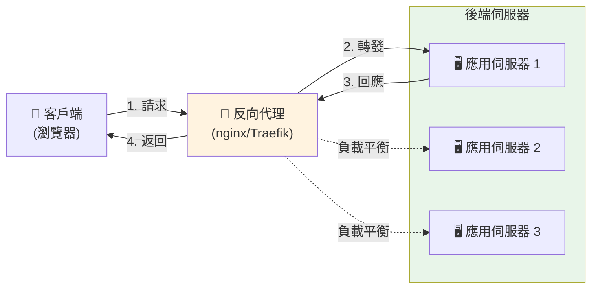
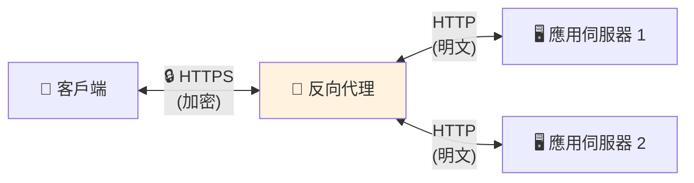
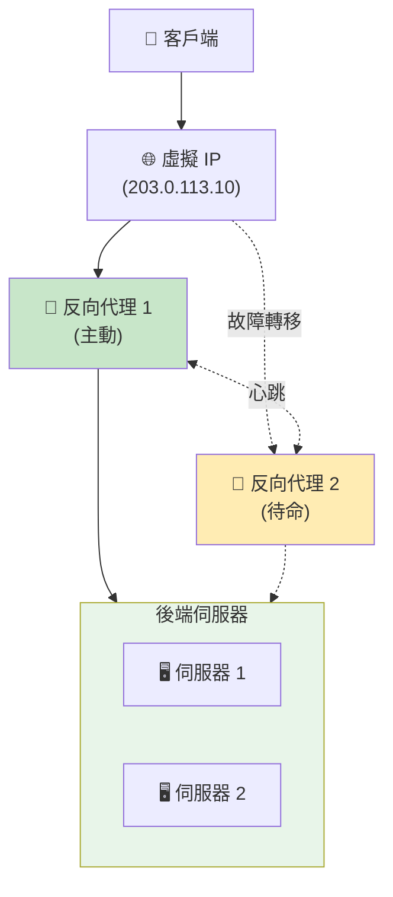

你造訪一個網站。你點擊一個按鈕。在幕後，你的請求並不會直接到達運行應用程式的伺服器。相反，它會先碰到其他東西——反向代理。

大多數用戶從不知道它的存在。但對於企業架構師來說，它是不可或缺的。

## 什麼是反向代理？

反向代理是一個位於客戶端和後端伺服器之間的伺服器，將客戶端請求轉發到適當的後端伺服器，並將伺服器的回應返回給客戶端。

**關鍵區別：**

- **正向代理：**位於客戶端前面，代表客戶端向伺服器轉發請求
- **反向代理：**位於伺服器前面，代表伺服器向客戶端轉發請求

### 現實世界類比

將反向代理想像成飯店禮賓部：

**沒有反向代理：**
- 客人直接敲員工的門（廚師、管家、經理）
- 每個員工處理自己的門
- 多個客人到達時一片混亂
- 沒人知道誰忙或誰有空

**有反向代理：**
- 所有客人先到禮賓台
- 禮賓知道該聯繫哪位員工
- 均勻分配請求
- 優雅地處理繁忙時段
- 員工可以不受干擾地工作

禮賓不做實際工作——他們有效地路由請求並保護員工不被壓垮。

## 反向代理如何運作？



**請求流程：**

1. **客戶端發送請求** → `https://neo01.com/api/users`
2. **DNS 解析** → 指向反向代理 IP
3. **反向代理接收** → 檢查請求（URL、標頭、方法）
4. **路由決策** → 決定使用哪個後端伺服器
5. **轉發請求** → 發送到後端伺服器
6. **後端處理** → 生成回應
7. **代理返回** → 將回應發送回客戶端

**客戶端看到的：**
```
請求：https://neo01.com/api/users
回應：200 OK
```

**實際發生的：**
```
客戶端 → 反向代理 (203.0.113.10)
反向代理 → 後端伺服器 (10.0.1.5:8080)
後端伺服器 → 反向代理
反向代理 → 客戶端
```

客戶端永遠不知道後端伺服器的真實 IP 位址或端口。

## 為什麼企業設計需要反向代理

### 1. 負載平衡

**問題：**單一伺服器無法處理高峰時段的所有流量。

**解決方案：**反向代理在多個伺服器之間分配請求。

```
100 請求/秒 → 反向代理
              ├─> 伺服器 1 (33 請求/秒)
              ├─> 伺服器 2 (33 請求/秒)
              └─> 伺服器 3 (34 請求/秒)
```

**負載平衡演算法：**

- **輪詢：**依序分配請求
- **最少連接：**發送到活動連接最少的伺服器
- **IP 雜湊：**同一客戶端總是到同一伺服器（會話持久性）
- **加權：**根據伺服器容量分配

**實際影響：**

沒有負載平衡：
- 伺服器 1：過載（崩潰）
- 伺服器 2：閒置
- 伺服器 3：閒置
- 結果：服務中斷

有負載平衡：
- 所有伺服器均勻分擔負載
- 沒有單一過載點
- 如果一個失敗，優雅降級

### 2. SSL/TLS 終止

**問題：**每個後端伺服器都需要 SSL 憑證和加密開銷。

**解決方案：**反向代理處理所有 SSL/TLS 加密/解密。



**優點：**

- **單一憑證：**在一個地方管理 SSL 憑證
- **降低 CPU 負載：**後端伺服器不解密流量
- **簡化更新：**更新 SSL 配置無需觸碰應用程式
- **集中式安全：**統一強制執行 TLS 版本和加密套件

**成本節省：**

- 沒有反向代理：10 伺服器 × $50/憑證 = $500/年
- 有反向代理：1 伺服器 × $50/憑證 = $50/年

### 3. 安全層

**問題：**後端伺服器直接暴露於網際網路攻擊。

**解決方案：**反向代理充當安全屏障。

**保護機制：**

**隱藏後端基礎設施：**
```
客戶端看到：https://api.neo01.com
真實後端：http://10.0.1.5:8080（隱藏）
```

**速率限制：**
```nginx
# 限制每個 IP 每秒 10 個請求
limit_req_zone $binary_remote_addr zone=api:10m rate=10r/s;
```

**IP 過濾：**
```nginx
# 封鎖特定 IP
deny 192.168.1.100;
# 只允許特定範圍
allow 10.0.0.0/8;
deny all;
```

**DDoS 緩解：**
- 每個 IP 的連接限制
- 請求速率限制
- 自動封鎖濫用 IP

**Web 應用程式防火牆（WAF）：**
- SQL 注入檢測
- XSS 攻擊預防
- 惡意負載過濾

### 4. 快取

**問題：**後端伺服器重複生成相同的回應。

**解決方案：**反向代理快取回應，減少後端負載。

**快取流程：**

```
第一次請求：
客戶端 → 代理（快取未命中）→ 後端 → 生成回應
                              ← 儲存在快取 ← 返回

後續請求：
客戶端 → 代理（快取命中）→ 返回快取的回應
         （不觸碰後端）
```

**效能影響：**

| 情境 | 回應時間 | 後端負載 |
|------|---------|---------|
| 無快取 | 200ms | 100% |
| 50% 快取命中 | 110ms | 50% |
| 90% 快取命中 | 38ms | 10% |

**快取範例：**

```nginx
# 快取靜態資源 1 天
location ~* \.(jpg|jpeg|png|css|js)$ {
    proxy_cache my_cache;
    proxy_cache_valid 200 1d;
    proxy_pass http://backend;
}
```

### 5. 簡化路由

**問題：**多個服務在不同端口/伺服器上，對客戶端來說很複雜。

**解決方案：**單一入口點，基於路徑的路由。

**沒有反向代理：**
```
https://app1.neo01.com:8080  → 服務 1
https://app2.neo01.com:8081  → 服務 2
https://app3.neo01.com:8082  → 服務 3
```

**有反向代理：**
```
https://neo01.com/app1  → 服務 1 (10.0.1.5:8080)
https://neo01.com/app2  → 服務 2 (10.0.1.6:8081)
https://neo01.com/app3  → 服務 3 (10.0.1.7:8082)
```

**路由配置：**

```nginx
location /app1 {
    proxy_pass http://10.0.1.5:8080;
}

location /app2 {
    proxy_pass http://10.0.1.6:8081;
}

location /api {
    proxy_pass http://api-cluster;
}
```

**優點：**

- **單一網域：**更容易記住和管理
- **無 CORS 問題：**所有服務看起來來自同一來源
- **靈活部署：**移動服務而不改變客戶端 URL
- **微服務友好：**透明地路由到不同服務

### 6. 零停機部署

**問題：**部署更新需要讓伺服器離線。

**解決方案：**反向代理實現滾動部署。

**部署流程：**

```
初始狀態：
代理 → 伺服器 1 (v1.0) ✅
     → 伺服器 2 (v1.0) ✅
     → 伺服器 3 (v1.0) ✅

步驟 1：更新伺服器 1
代理 → 伺服器 1 (v1.1) 🔄（從池中移除）
     → 伺服器 2 (v1.0) ✅
     → 伺服器 3 (v1.0) ✅

步驟 2：將伺服器 1 加回
代理 → 伺服器 1 (v1.1) ✅
     → 伺服器 2 (v1.0) ✅
     → 伺服器 3 (v1.0) ✅

步驟 3-4：對伺服器 2 和 3 重複
代理 → 伺服器 1 (v1.1) ✅
     → 伺服器 2 (v1.1) ✅
     → 伺服器 3 (v1.1) ✅
```

**健康檢查：**

```nginx
upstream backend {
    server 10.0.1.5:8080 max_fails=3 fail_timeout=30s;
    server 10.0.1.6:8080 max_fails=3 fail_timeout=30s;
    server 10.0.1.7:8080 max_fails=3 fail_timeout=30s;
}
```

如果伺服器未通過健康檢查，代理會自動將其從輪換中移除。

## 它是另一個故障點嗎？

**簡短回答：**是的，但這是一個經過計算的權衡。

**詳細回答：**當正確實施時，好處遠遠超過風險。

### 擔憂

```
客戶端 → 反向代理 → 後端伺服器
              ↓
         單點故障？
```

如果反向代理故障，所有服務都會變得無法訪問——即使後端伺服器是健康的。

### 現實：緩解策略

#### 1. 高可用性設置

**主動-被動：**



**運作方式：**
- 兩個反向代理共享一個虛擬 IP
- 主要處理所有流量
- 次要透過心跳監控主要
- 如果主要失敗，次要接管虛擬 IP
- 故障轉移時間：1-3 秒

**主動-主動：**

```
客戶端 → DNS 輪詢
         ├─> 反向代理 1（50% 流量）
         └─> 反向代理 2（50% 流量）
                    ↓
              後端伺服器
```

**優點：**
- 兩個代理都處理流量
- 更好的資源利用
- 自動負載分配
- 如果一個失敗，另一個處理 100%

#### 2. 反向代理比後端更簡單

**複雜度比較：**

| 組件 | 複雜度 | 故障機率 |
|------|--------|---------|
| 後端應用 | 高（業務邏輯、資料庫、依賴項）| 較高 |
| 反向代理 | 低（路由、轉發）| 較低 |

**為什麼反向代理更可靠：**

- **無狀態：**沒有資料庫，沒有會話（通常）
- **簡單邏輯：**只是路由和轉發
- **久經考驗：**nginx/HAProxy/Traefik 很成熟
- **更少依賴：**最少的外部服務
- **更容易監控：**簡單的健康檢查

**故障率範例：**

```
後端應用程式：99.5% 正常運行時間（每年 43.8 小時停機）
反向代理：99.95% 正常運行時間（每年 4.38 小時停機）

使用 HA 反向代理：99.99% 正常運行時間（每年 52 分鐘停機）
```

#### 3. 監控和警報

**健康檢查監控：**

```yaml
# Prometheus 監控範例
- alert: ReverseProxyDown
  expr: up{job="reverse-proxy"} == 0
  for: 1m
  annotations:
    summary: "反向代理故障"
    description: "反向代理 {{ $labels.instance }} 已停機 1 分鐘"
```

**自動恢復：**

```bash
# Systemd 自動重啟
[Service]
Restart=always
RestartSec=5s
```

**監控指標：**

- 請求速率
- 回應時間
- 錯誤率（4xx、5xx）
- 後端健康狀態
- 連接數
- CPU/記憶體使用

#### 4. 地理分佈

**多區域設置：**

```
         全球 DNS（GeoDNS）
              ↓
    ┌─────────┴─────────┐
    ↓                   ↓
美國區域            歐洲區域
反向代理            反向代理
    ↓                   ↓
美國後端            歐洲後端
```

**優點：**

- **區域故障轉移：**如果美國區域失敗，流量轉到歐洲
- **降低延遲：**用戶連接到最近的區域
- **災難恢復：**完整區域可以失敗而不會完全中斷

### 風險比較

**沒有反向代理：**

```
風險：
❌ 每個後端暴露於攻擊
❌ 無負載平衡（單一伺服器過載）
❌ 複雜的 SSL 管理
❌ 無快取（更高的後端負載）
❌ 困難的部署
❌ 無集中式監控

故障模式：
- 個別伺服器被壓垮
- DDoS 攻擊擊垮所有伺服器
- SSL 憑證在一個伺服器上過期
```

**有反向代理：**

```
風險：
⚠️ 反向代理是單點（使用 HA 緩解）

優點：
✅ 受保護的後端
✅ 負載分配
✅ 集中式 SSL
✅ 快取減少負載
✅ 零停機部署
✅ 集中式監控

故障模式：
- 反向代理失敗（但 HA 設置可防止這種情況）
- 比後端故障的機率低得多
```

### 結論

**反向代理是單點故障嗎？**

技術上是的，但：

1. **它比後端應用程式更可靠**
2. **HA 設置消除了單點**
3. **好處遠遠超過風險**
4. **業界標準是有原因的**

**風險評估：**

| 情境 | 可用性 | 複雜度 | 成本 |
|------|--------|--------|------|
| 無反向代理 | 99.5% | 低 | 低 |
| 單一反向代理 | 99.95% | 中 | 中 |
| HA 反向代理 | 99.99% | 中高 | 中高 |
| 多區域 HA | 99.999% | 高 | 高 |

!!!tip "💡 最佳實踐"
    對於生產系統：
    - **最低要求：**具有自動重啟的單一反向代理
    - **建議：**主動-被動 HA 設置
    - **企業：**主動-主動多區域
    
    即使是單一反向代理也比直接暴露後端更可靠。

## 流行的反向代理解決方案

### nginx

**最適合：**高效能靜態內容和簡單路由

**優點：**
- 極快且輕量
- 低記憶體佔用
- 久經考驗（為 30%+ 的頂級網站提供支援）
- 優秀的文件

**缺點：**
- 配置可能很複雜
- 配置更改需要重新載入
- 有限的動態配置

**使用案例：**傳統 Web 應用程式、高流量網站

### Traefik

**最適合：**Docker/Kubernetes 環境、微服務

**優點：**
- 自動服務發現
- 動態配置（無需重新載入）
- 內建 Let's Encrypt 支援
- 漂亮的儀表板

**缺點：**
- 比 nginx 使用更多資源
- 學習曲線較陡
- 較年輕的專案（較不成熟）

**使用案例：**基於容器的部署、雲原生應用程式

### HAProxy

**最適合：**進階負載平衡、TCP/UDP 代理

**優點：**
- 極其可靠
- 進階負載平衡演算法
- 優秀的效能監控
- TCP/UDP 支援（不僅是 HTTP）

**缺點：**
- 配置語法獨特
- 不如其他直觀
- 主要專注於負載平衡

**使用案例：**高可用性設置、複雜路由需求

### 比較

| 功能 | nginx | Traefik | HAProxy |
|------|-------|---------|---------|
| **效能** | ⭐⭐⭐⭐⭐ | ⭐⭐⭐⭐ | ⭐⭐⭐⭐⭐ |
| **易用性** | ⭐⭐⭐ | ⭐⭐⭐⭐ | ⭐⭐ |
| **Docker 整合** | ⭐⭐⭐ | ⭐⭐⭐⭐⭐ | ⭐⭐⭐ |
| **動態配置** | ⭐⭐ | ⭐⭐⭐⭐⭐ | ⭐⭐⭐ |
| **成熟度** | ⭐⭐⭐⭐⭐ | ⭐⭐⭐ | ⭐⭐⭐⭐⭐ |
| **資源使用** | ⭐⭐⭐⭐⭐ | ⭐⭐⭐ | ⭐⭐⭐⭐ |

## 快速入門範例

### nginx 反向代理

```nginx
# /etc/nginx/nginx.conf

http {
    # 定義後端伺服器
    upstream backend {
        server 10.0.1.5:8080 weight=3;
        server 10.0.1.6:8080 weight=2;
        server 10.0.1.7:8080 weight=1;
    }

    # 速率限制
    limit_req_zone $binary_remote_addr zone=api:10m rate=10r/s;

    server {
        listen 80;
        server_name neo01.com;

        # 將 HTTP 重定向到 HTTPS
        return 301 https://$server_name$request_uri;
    }

    server {
        listen 443 ssl http2;
        server_name neo01.com;

        # SSL 配置
        ssl_certificate /etc/ssl/certs/neo01.com.crt;
        ssl_certificate_key /etc/ssl/private/neo01.com.key;
        ssl_protocols TLSv1.2 TLSv1.3;

        # 日誌
        access_log /var/log/nginx/access.log;
        error_log /var/log/nginx/error.log;

        # 靜態檔案（快取）
        location ~* \.(jpg|jpeg|png|gif|css|js)$ {
            proxy_pass http://backend;
            proxy_cache my_cache;
            proxy_cache_valid 200 1d;
            expires 1d;
            add_header Cache-Control "public, immutable";
        }

        # API 端點（速率限制）
        location /api {
            limit_req zone=api burst=20 nodelay;
            
            proxy_pass http://backend;
            proxy_set_header Host $host;
            proxy_set_header X-Real-IP $remote_addr;
            proxy_set_header X-Forwarded-For $proxy_add_x_forwarded_for;
            proxy_set_header X-Forwarded-Proto $scheme;
            
            # 超時
            proxy_connect_timeout 5s;
            proxy_send_timeout 10s;
            proxy_read_timeout 10s;
        }

        # 健康檢查端點
        location /health {
            access_log off;
            return 200 "OK\n";
            add_header Content-Type text/plain;
        }
    }
}
```

### Traefik 與 Docker

```yaml
# docker-compose.yml
version: '3.8'

services:
  traefik:
    image: traefik:v2.10
    command:
      - "--api.dashboard=true"
      - "--providers.docker=true"
      - "--entrypoints.web.address=:80"
      - "--entrypoints.websecure.address=:443"
      - "--certificatesresolvers.myresolver.acme.email=admin@neo01.com"
      - "--certificatesresolvers.myresolver.acme.storage=/letsencrypt/acme.json"
      - "--certificatesresolvers.myresolver.acme.httpchallenge.entrypoint=web"
    ports:
      - "80:80"
      - "443:443"
    volumes:
      - /var/run/docker.sock:/var/run/docker.sock:ro
      - ./letsencrypt:/letsencrypt
    labels:
      - "traefik.http.routers.dashboard.rule=Host(`traefik.neo01.com`)"
      - "traefik.http.routers.dashboard.service=api@internal"

  app1:
    image: myapp:latest
    labels:
      - "traefik.enable=true"
      - "traefik.http.routers.app1.rule=Host(`app1.neo01.com`)"
      - "traefik.http.routers.app1.entrypoints=websecure"
      - "traefik.http.routers.app1.tls.certresolver=myresolver"
      - "traefik.http.services.app1.loadbalancer.server.port=8080"

  app2:
    image: myapp:latest
    labels:
      - "traefik.enable=true"
      - "traefik.http.routers.app2.rule=Host(`app2.neo01.com`)"
      - "traefik.http.routers.app2.entrypoints=websecure"
      - "traefik.http.routers.app2.tls.certresolver=myresolver"
      - "traefik.http.services.app2.loadbalancer.server.port=8080"
```

## 結論

反向代理是現代 Web 架構中的無名英雄。它們提供負載平衡、安全性、快取和簡化路由——同時比它們保護的應用程式更可靠。

**關鍵要點：**

- **反向代理位於客戶端和後端伺服器之間**，智慧地路由請求
- **對企業設計至關重要**，因為負載平衡、安全性、SSL 終止和快取
- **是的，它是潛在的故障點**，但 HA 設置和固有的簡單性使其比替代方案更可靠
- **當正確實施時，好處遠遠超過風險**
- **生產部署的業界標準**

**值得這種複雜性嗎？**

對於任何超出簡單單伺服器設置的情況，絕對值得。操作優勢、安全改進和靈活性使反向代理在現代基礎設施中不可或缺。

**快速決策指南：**

- **小型專案，單一伺服器：**可選（但仍建議）
- **多個伺服器或服務：**絕對使用
- **生產系統：**使用 HA 反向代理設置
- **企業/關鍵系統：**多區域 HA 設置

問題不是是否使用反向代理——而是選擇哪一個以及如何使其高度可用。🚀

## 資源

- **[nginx 文件](https://nginx.org/en/docs/)：**官方 nginx 指南
- **[Traefik 文件](https://doc.traefik.io/traefik/)：**完整的 Traefik 參考
- **[HAProxy 文件](https://www.haproxy.org/#docs)：**HAProxy 配置指南
- **[Let's Encrypt](https://letsencrypt.org/)：**免費 SSL 憑證
- **[Cloudflare](https://www.cloudflare.com/)：**全球反向代理/CDN 服務
