You visit a website. You click a button. Behind the scenes, your request doesn't go directly to the server running the application. Instead, it hits something else first—a reverse proxy.

Most users never know it exists. But for enterprise architects, it's indispensable.

## What is a Reverse Proxy?

A reverse proxy is a server that sits between clients and backend servers, forwarding client requests to the appropriate backend server and returning the server's response to the client.

**The Key Difference:**

- **Forward Proxy:** Sits in front of clients, forwarding requests on behalf of clients to servers
- **Reverse Proxy:** Sits in front of servers, forwarding requests on behalf of servers to clients

### Real-World Analogy

Think of a reverse proxy as a hotel concierge:

**Without Reverse Proxy:**
- Guests knock directly on staff doors (chef, housekeeper, manager)
- Each staff member handles their own door
- Chaos when multiple guests arrive
- No one knows who's busy or available

**With Reverse Proxy:**
- All guests go to the concierge desk first
- Concierge knows which staff member to contact
- Distributes requests evenly
- Handles busy periods gracefully
- Staff can work without interruption

The concierge doesn't do the actual work—they route requests efficiently and protect staff from being overwhelmed.

## How Does a Reverse Proxy Work?

```mermaid
flowchart LR
    Client["👤 Client<br/>(Browser)"]
    RP["🚪 Reverse Proxy<br/>(nginx/Traefik)"]
    
    subgraph Backend["Backend Servers"]
        App1["🖥️ App Server 1"]
        App2["🖥️ App Server 2"]
        App3["🖥️ App Server 3"]
    end
    
    Client -->|"1. Request"| RP
    RP -->|"2. Forward"| App1
    RP -.->|"Load Balance"| App2
    RP -.->|"Load Balance"| App3
    App1 -->|"3. Response"| RP
    RP -->|"4. Return"| Client
    
    style RP fill:#fff3e0
    style Backend fill:#e8f5e9
```



**Request Flow:**

1. **Client sends request** → `https://neo01.com/api/users`
2. **DNS resolves** → Points to reverse proxy IP
3. **Reverse proxy receives** → Examines request (URL, headers, method)
4. **Routing decision** → Determines which backend server to use
5. **Forward request** → Sends to backend server
6. **Backend processes** → Generates response
7. **Proxy returns** → Sends response back to client

**What the Client Sees:**
```
Request: https://neo01.com/api/users
Response: 200 OK
```

**What Actually Happens:**
```
Client → Reverse Proxy (203.0.113.10)
Reverse Proxy → Backend Server (10.0.1.5:8080)
Backend Server → Reverse Proxy
Reverse Proxy → Client
```

The client never knows the backend server's real IP address or port.

## Why Enterprise Design Needs Reverse Proxy

### 1. Load Balancing

**Problem:** Single server can't handle all traffic during peak hours.

**Solution:** Reverse proxy distributes requests across multiple servers.

```
100 requests/sec → Reverse Proxy
                   ├─> Server 1 (33 req/sec)
                   ├─> Server 2 (33 req/sec)
                   └─> Server 3 (34 req/sec)
```

**Load Balancing Algorithms:**

- **Round Robin:** Distribute requests sequentially
- **Least Connections:** Send to server with fewest active connections
- **IP Hash:** Same client always goes to same server (session persistence)
- **Weighted:** Distribute based on server capacity

**Real-World Impact:**

Without load balancing:
- Server 1: Overloaded (crashes)
- Server 2: Idle
- Server 3: Idle
- Result: Service down

With load balancing:
- All servers share load evenly
- No single point of overload
- Graceful degradation if one fails

### 2. SSL/TLS Termination

**Problem:** Every backend server needs SSL certificates and encryption overhead.

**Solution:** Reverse proxy handles all SSL/TLS encryption/decryption.

```mermaid
flowchart LR
    Client["👤 Client"]
    RP["🚪 Reverse Proxy"]
    App1["🖥️ App Server 1"]
    App2["🖥️ App Server 2"]
    
    Client <-->|"🔒 HTTPS<br/>(Encrypted)"| RP
    RP <-->|"HTTP<br/>(Plain)"| App1
    RP <-->|"HTTP<br/>(Plain)"| App2
    
    style RP fill:#fff3e0
```



**Benefits:**

- **Single certificate:** Manage SSL cert in one place
- **Reduced CPU load:** Backend servers don't decrypt traffic
- **Simplified updates:** Update SSL config without touching apps
- **Centralized security:** Enforce TLS versions and ciphers uniformly

**Cost Savings:**

- Without reverse proxy: 10 servers × $50/cert = $500/year
- With reverse proxy: 1 server × $50/cert = $50/year

### 3. Security Layer

**Problem:** Backend servers exposed directly to internet attacks.

**Solution:** Reverse proxy acts as security barrier.

**Protection Mechanisms:**

**Hide Backend Infrastructure:**
```
Client sees: https://api.neo01.com
Real backend: http://10.0.1.5:8080 (hidden)
```

**Rate Limiting:**
```nginx
# Limit to 10 requests per second per IP
limit_req_zone $binary_remote_addr zone=api:10m rate=10r/s;
```

**IP Filtering:**
```nginx
# Block specific IPs
deny 192.168.1.100;
# Allow only specific ranges
allow 10.0.0.0/8;
deny all;
```

**DDoS Mitigation:**
- Connection limits per IP
- Request rate limiting
- Automatic blacklisting of abusive IPs

**Web Application Firewall (WAF):**
- SQL injection detection
- XSS attack prevention
- Malicious payload filtering

### 4. Caching

**Problem:** Backend servers repeatedly generate same responses.

**Solution:** Reverse proxy caches responses, reducing backend load.

**Cache Flow:**

```
First Request:
Client → Proxy (cache miss) → Backend → Generate response
                             ← Store in cache ← Return

Subsequent Requests:
Client → Proxy (cache hit) → Return cached response
         (Backend not touched)
```

**Performance Impact:**

| Scenario | Response Time | Backend Load |
|----------|---------------|--------------|
| No cache | 200ms | 100% |
| 50% cache hit | 110ms | 50% |
| 90% cache hit | 38ms | 10% |

**Cache Example:**

```nginx
# Cache static assets for 1 day
location ~* \.(jpg|jpeg|png|css|js)$ {
    proxy_cache my_cache;
    proxy_cache_valid 200 1d;
    proxy_pass http://backend;
}
```

### 5. Simplified Routing

**Problem:** Multiple services on different ports/servers, complex for clients.

**Solution:** Single entry point with path-based routing.

**Without Reverse Proxy:**
```
https://app1.neo01.com:8080  → Service 1
https://app2.neo01.com:8081  → Service 2
https://app3.neo01.com:8082  → Service 3
```

**With Reverse Proxy:**
```
https://neo01.com/app1  → Service 1 (10.0.1.5:8080)
https://neo01.com/app2  → Service 2 (10.0.1.6:8081)
https://neo01.com/app3  → Service 3 (10.0.1.7:8082)
```

**Routing Configuration:**

```nginx
location /app1 {
    proxy_pass http://10.0.1.5:8080;
}

location /app2 {
    proxy_pass http://10.0.1.6:8081;
}

location /api {
    proxy_pass http://api-cluster;
}
```

**Benefits:**

- **Single domain:** Easier to remember and manage
- **No CORS issues:** All services appear from same origin
- **Flexible deployment:** Move services without changing client URLs
- **Microservices friendly:** Route to different services transparently

### 6. Zero-Downtime Deployments

**Problem:** Deploying updates requires taking servers offline.

**Solution:** Reverse proxy enables rolling deployments.

**Deployment Process:**

```
Initial State:
Proxy → Server 1 (v1.0) ✅
      → Server 2 (v1.0) ✅
      → Server 3 (v1.0) ✅

Step 1: Update Server 1
Proxy → Server 1 (v1.1) 🔄 (remove from pool)
      → Server 2 (v1.0) ✅
      → Server 3 (v1.0) ✅

Step 2: Add Server 1 back
Proxy → Server 1 (v1.1) ✅
      → Server 2 (v1.0) ✅
      → Server 3 (v1.0) ✅

Step 3-4: Repeat for Server 2 and 3
Proxy → Server 1 (v1.1) ✅
      → Server 2 (v1.1) ✅
      → Server 3 (v1.1) ✅
```

**Health Checks:**

```nginx
upstream backend {
    server 10.0.1.5:8080 max_fails=3 fail_timeout=30s;
    server 10.0.1.6:8080 max_fails=3 fail_timeout=30s;
    server 10.0.1.7:8080 max_fails=3 fail_timeout=30s;
}
```

If a server fails health checks, the proxy automatically removes it from rotation.

## Is It Another Point of Failure?

**Short answer:** Yes, but it's a calculated trade-off.

**Long answer:** The benefits far outweigh the risks when properly implemented.

### The Concern

```
Client → Reverse Proxy → Backend Servers
              ↓
         Single Point
         of Failure?
```

If the reverse proxy goes down, all services become unreachable—even if backend servers are healthy.

### The Reality: Mitigation Strategies

#### 1. High Availability Setup

**Active-Passive:**

```mermaid
flowchart TD
    Client["👤 Clients"]
    VIP["🌐 Virtual IP<br/>(203.0.113.10)"]
    RP1["🚪 Reverse Proxy 1<br/>(Active)"]
    RP2["🚪 Reverse Proxy 2<br/>(Standby)"]
    
    subgraph Backend["Backend Servers"]
        App1["🖥️ Server 1"]
        App2["🖥️ Server 2"]
    end
    
    Client --> VIP
    VIP --> RP1
    VIP -.->|"Failover"| RP2
    RP1 --> Backend
    RP2 -.-> Backend
    RP1 <-.->|"Heartbeat"| RP2
    
    style RP1 fill:#c8e6c9
    style RP2 fill:#ffecb3
    style Backend fill:#e8f5e9
```



**How it works:**
- Two reverse proxies share a virtual IP
- Primary handles all traffic
- Secondary monitors primary via heartbeat
- If primary fails, secondary takes over virtual IP
- Failover time: 1-3 seconds

**Active-Active:**

```
Client → DNS Round Robin
         ├─> Reverse Proxy 1 (50% traffic)
         └─> Reverse Proxy 2 (50% traffic)
                    ↓
              Backend Servers
```

**Benefits:**
- Both proxies handle traffic
- Better resource utilization
- Automatic load distribution
- If one fails, other handles 100%

#### 2. Reverse Proxy is Simpler Than Backend

**Complexity Comparison:**

| Component | Complexity | Failure Probability |
|-----------|------------|---------------------|
| Backend App | High (business logic, database, dependencies) | Higher |
| Reverse Proxy | Low (routing, forwarding) | Lower |

**Why Reverse Proxy is More Reliable:**

- **Stateless:** No database, no sessions (usually)
- **Simple logic:** Just routing and forwarding
- **Battle-tested:** nginx/HAProxy/Traefik are mature
- **Fewer dependencies:** Minimal external services
- **Easier to monitor:** Simple health checks

**Failure Rate Example:**

```
Backend application: 99.5% uptime (43.8 hours downtime/year)
Reverse proxy: 99.95% uptime (4.38 hours downtime/year)

With HA reverse proxy: 99.99% uptime (52 minutes downtime/year)
```

#### 3. Monitoring and Alerting

**Health Check Monitoring:**

```yaml
# Prometheus monitoring example
- alert: ReverseProxyDown
  expr: up{job="reverse-proxy"} == 0
  for: 1m
  annotations:
    summary: "Reverse proxy is down"
    description: "Reverse proxy {{ $labels.instance }} has been down for 1 minute"
```

**Automated Recovery:**

```bash
# Systemd auto-restart
[Service]
Restart=always
RestartSec=5s
```

**Monitoring Metrics:**

- Request rate
- Response time
- Error rate (4xx, 5xx)
- Backend health status
- Connection count
- CPU/Memory usage

#### 4. Geographic Distribution

**Multi-Region Setup:**

```
         Global DNS (GeoDNS)
              ↓
    ┌─────────┴─────────┐
    ↓                   ↓
US Region          EU Region
Reverse Proxy      Reverse Proxy
    ↓                   ↓
US Backends        EU Backends
```

**Benefits:**

- **Regional failover:** If US region fails, traffic goes to EU
- **Reduced latency:** Users connect to nearest region
- **Disaster recovery:** Complete region can fail without total outage

### Risk Comparison

**Without Reverse Proxy:**

```
Risks:
❌ Each backend exposed to attacks
❌ No load balancing (single server overload)
❌ Complex SSL management
❌ No caching (higher backend load)
❌ Difficult deployments
❌ No centralized monitoring

Failure modes:
- Individual servers overwhelmed
- DDoS takes down all servers
- SSL certificate expires on one server
```

**With Reverse Proxy:**

```
Risks:
⚠️ Reverse proxy is single point (mitigated with HA)

Benefits:
✅ Protected backends
✅ Load distribution
✅ Centralized SSL
✅ Caching reduces load
✅ Zero-downtime deployments
✅ Centralized monitoring

Failure modes:
- Reverse proxy fails (but HA setup prevents this)
- Much lower probability than backend failures
```

### The Verdict

**Is reverse proxy a single point of failure?**

Technically yes, but:

1. **It's more reliable** than backend applications
2. **HA setup eliminates** the single point
3. **Benefits far outweigh** the risk
4. **Industry standard** for good reason

**Risk Assessment:**

| Scenario | Availability | Complexity | Cost |
|----------|--------------|------------|------|
| No reverse proxy | 99.5% | Low | Low |
| Single reverse proxy | 99.95% | Medium | Medium |
| HA reverse proxy | 99.99% | Medium-High | Medium-High |
| Multi-region HA | 99.999% | High | High |

!!!tip "💡 Best Practice"
    For production systems:
    - **Minimum:** Single reverse proxy with auto-restart
    - **Recommended:** Active-passive HA setup
    - **Enterprise:** Active-active multi-region
    
    Even a single reverse proxy is more reliable than exposing backends directly.

## Popular Reverse Proxy Solutions

### nginx

**Best for:** High-performance static content and simple routing

**Pros:**
- Extremely fast and lightweight
- Low memory footprint
- Battle-tested (powers 30%+ of top websites)
- Excellent documentation

**Cons:**
- Configuration can be complex
- Requires reload for config changes
- Limited dynamic configuration

**Use case:** Traditional web applications, high-traffic sites

### Traefik

**Best for:** Docker/Kubernetes environments, microservices

**Pros:**
- Automatic service discovery
- Dynamic configuration (no reload needed)
- Built-in Let's Encrypt support
- Beautiful dashboard

**Cons:**
- Higher resource usage than nginx
- Steeper learning curve
- Younger project (less mature)

**Use case:** Container-based deployments, cloud-native apps

### HAProxy

**Best for:** Advanced load balancing, TCP/UDP proxying

**Pros:**
- Extremely reliable
- Advanced load balancing algorithms
- Excellent performance monitoring
- TCP/UDP support (not just HTTP)

**Cons:**
- Configuration syntax is unique
- Less intuitive than others
- Primarily focused on load balancing

**Use case:** High-availability setups, complex routing needs

### Comparison

| Feature | nginx | Traefik | HAProxy |
|---------|-------|---------|---------|
| **Performance** | ⭐⭐⭐⭐⭐ | ⭐⭐⭐⭐ | ⭐⭐⭐⭐⭐ |
| **Ease of Use** | ⭐⭐⭐ | ⭐⭐⭐⭐ | ⭐⭐ |
| **Docker Integration** | ⭐⭐⭐ | ⭐⭐⭐⭐⭐ | ⭐⭐⭐ |
| **Dynamic Config** | ⭐⭐ | ⭐⭐⭐⭐⭐ | ⭐⭐⭐ |
| **Maturity** | ⭐⭐⭐⭐⭐ | ⭐⭐⭐ | ⭐⭐⭐⭐⭐ |
| **Resource Usage** | ⭐⭐⭐⭐⭐ | ⭐⭐⭐ | ⭐⭐⭐⭐ |

## Quick Start Example

### nginx Reverse Proxy

```nginx
# /etc/nginx/nginx.conf

http {
    # Define backend servers
    upstream backend {
        server 10.0.1.5:8080 weight=3;
        server 10.0.1.6:8080 weight=2;
        server 10.0.1.7:8080 weight=1;
    }

    # Rate limiting
    limit_req_zone $binary_remote_addr zone=api:10m rate=10r/s;

    server {
        listen 80;
        server_name neo01.com;

        # Redirect HTTP to HTTPS
        return 301 https://$server_name$request_uri;
    }

    server {
        listen 443 ssl http2;
        server_name neo01.com;

        # SSL configuration
        ssl_certificate /etc/ssl/certs/neo01.com.crt;
        ssl_certificate_key /etc/ssl/private/neo01.com.key;
        ssl_protocols TLSv1.2 TLSv1.3;

        # Logging
        access_log /var/log/nginx/access.log;
        error_log /var/log/nginx/error.log;

        # Static files (cached)
        location ~* \.(jpg|jpeg|png|gif|css|js)$ {
            proxy_pass http://backend;
            proxy_cache my_cache;
            proxy_cache_valid 200 1d;
            expires 1d;
            add_header Cache-Control "public, immutable";
        }

        # API endpoints (rate limited)
        location /api {
            limit_req zone=api burst=20 nodelay;
            
            proxy_pass http://backend;
            proxy_set_header Host $host;
            proxy_set_header X-Real-IP $remote_addr;
            proxy_set_header X-Forwarded-For $proxy_add_x_forwarded_for;
            proxy_set_header X-Forwarded-Proto $scheme;
            
            # Timeouts
            proxy_connect_timeout 5s;
            proxy_send_timeout 10s;
            proxy_read_timeout 10s;
        }

        # Health check endpoint
        location /health {
            access_log off;
            return 200 "OK\n";
            add_header Content-Type text/plain;
        }
    }
}
```

### Traefik with Docker

```yaml
# docker-compose.yml
version: '3.8'

services:
  traefik:
    image: traefik:v2.10
    command:
      - "--api.dashboard=true"
      - "--providers.docker=true"
      - "--entrypoints.web.address=:80"
      - "--entrypoints.websecure.address=:443"
      - "--certificatesresolvers.myresolver.acme.email=admin@neo01.com"
      - "--certificatesresolvers.myresolver.acme.storage=/letsencrypt/acme.json"
      - "--certificatesresolvers.myresolver.acme.httpchallenge.entrypoint=web"
    ports:
      - "80:80"
      - "443:443"
    volumes:
      - /var/run/docker.sock:/var/run/docker.sock:ro
      - ./letsencrypt:/letsencrypt
    labels:
      - "traefik.http.routers.dashboard.rule=Host(`traefik.neo01.com`)"
      - "traefik.http.routers.dashboard.service=api@internal"

  app1:
    image: myapp:latest
    labels:
      - "traefik.enable=true"
      - "traefik.http.routers.app1.rule=Host(`app1.neo01.com`)"
      - "traefik.http.routers.app1.entrypoints=websecure"
      - "traefik.http.routers.app1.tls.certresolver=myresolver"
      - "traefik.http.services.app1.loadbalancer.server.port=8080"

  app2:
    image: myapp:latest
    labels:
      - "traefik.enable=true"
      - "traefik.http.routers.app2.rule=Host(`app2.neo01.com`)"
      - "traefik.http.routers.app2.entrypoints=websecure"
      - "traefik.http.routers.app2.tls.certresolver=myresolver"
      - "traefik.http.services.app2.loadbalancer.server.port=8080"
```

## Conclusion

Reverse proxies are the unsung heroes of modern web architecture. They provide load balancing, security, caching, and simplified routing—all while being more reliable than the applications they protect.

**Key Takeaways:**

- **Reverse proxy sits between clients and backend servers**, routing requests intelligently
- **Essential for enterprise design** due to load balancing, security, SSL termination, and caching
- **Yes, it's a potential point of failure**, but HA setups and inherent simplicity make it more reliable than alternatives
- **Benefits far outweigh risks** when properly implemented
- **Industry standard** for production deployments

**Is it worth the complexity?**

For anything beyond a simple single-server setup, absolutely. The operational benefits, security improvements, and flexibility make reverse proxies indispensable in modern infrastructure.

**Quick Decision Guide:**

- **Small project, single server:** Optional (but still recommended)
- **Multiple servers or services:** Definitely use one
- **Production system:** Use HA reverse proxy setup
- **Enterprise/critical system:** Multi-region HA setup

The question isn't whether to use a reverse proxy—it's which one to choose and how to make it highly available. 🚀

## Resources

- **[nginx Documentation](https://nginx.org/en/docs/):** Official nginx guide
- **[Traefik Documentation](https://doc.traefik.io/traefik/):** Complete Traefik reference
- **[HAProxy Documentation](https://www.haproxy.org/#docs):** HAProxy configuration guide
- **[Let's Encrypt](https://letsencrypt.org/):** Free SSL certificates
- **[Cloudflare](https://www.cloudflare.com/):** Global reverse proxy/CDN service
