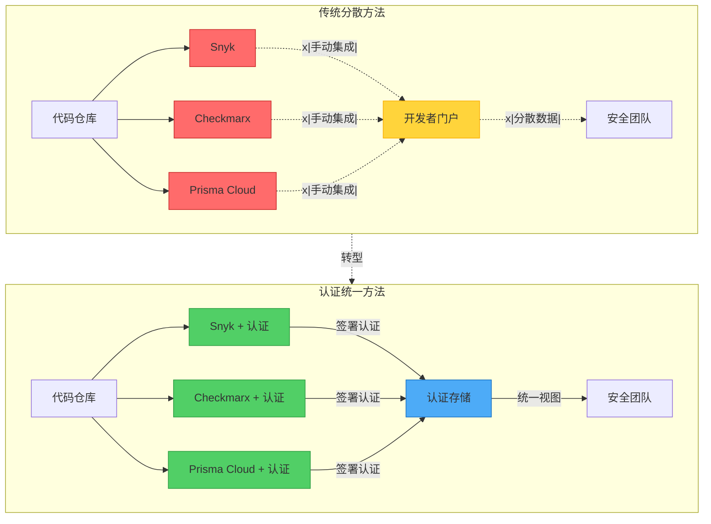
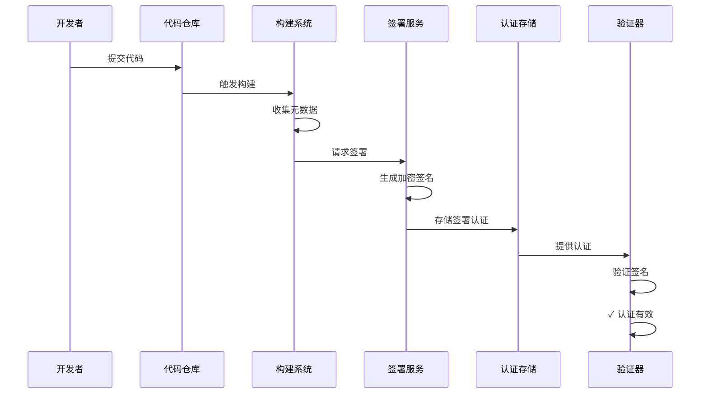
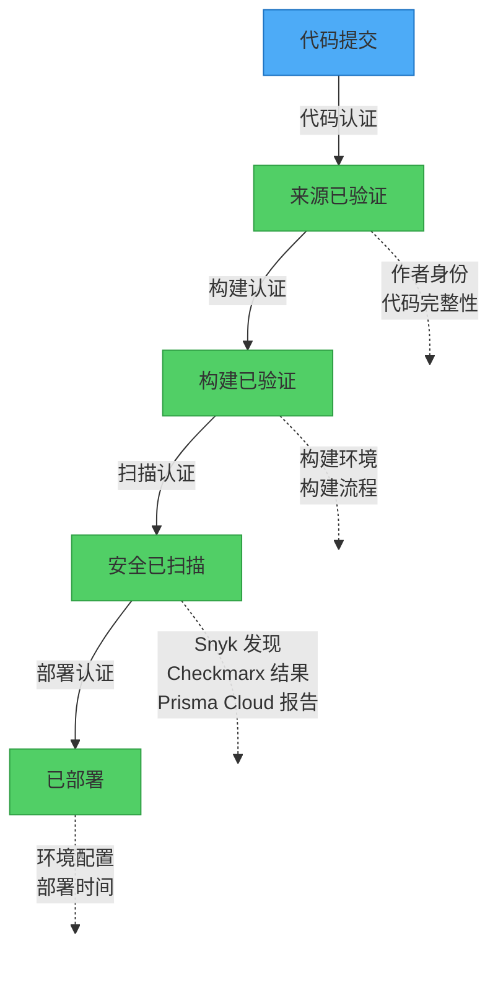
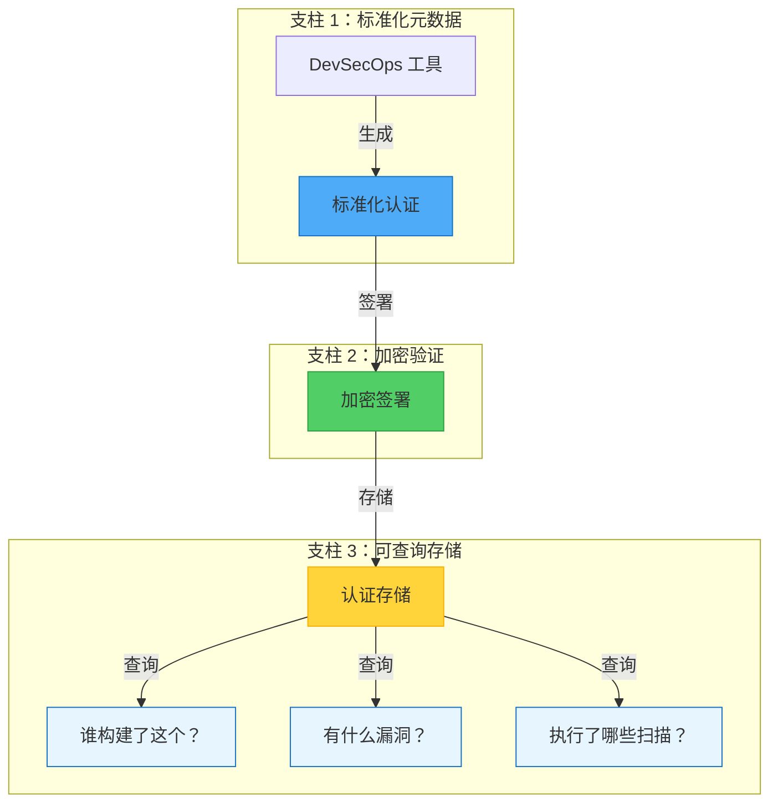
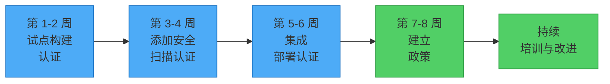

企业内部对于能够将软件工件追溯回其原始源代码和构建指令的可靠方法的需求日益增长，这是由供应链攻击的增加所驱动的。这种需求也适用于其他常见的企业情境，例如孤立的团队合作和 DevSecOps 实践的多样化。虽然企业通常可以使用市场上广泛的 DevSecOps 工具，但他们采用的工具越多，他们的流程往往变得越分散和孤立。

## 工具困境：集成过载

一旦企业配备了广泛的 DevSecOps 工具阵列，下一个挑战就是集成它们以最小化分散。市场提供了众多工具，每个都声称是安全挑战的终极解决方案。然而，实际上，没有单一工具可以全面解决所有问题。关键挑战是建立一个凝聚的生态系统，让这些工具和谐运作，确保软件交付的透明和高效管道。



许多企业选择开发自己的开发者门户，集成或使用这些工具的扫描报告，并为开发者和安全工程师提供统一视图。这种方法允许集中管理漏洞、合规性检查和其他安全相关任务。然而，它需要**大量投资**于开发和维护。如果没有适当的集成和无缝的工作流程，这些工具可能成为开发团队的噩梦。此外，不同的开发团队通常对其软件开发生命周期（SDLC）有不同的工具；例如，移动开发团队可能使用专门的扫描工具。

## 什么是认证？

!!!info "🔐 理解认证"
    认证是一组工具和实践，使 SDLC 中的每个步骤都能在软件工件和产生它们的流程之间建立安全且可验证的连接。这些认证作为防篡改、不可伪造的纸本追踪，详细记录软件创建过程的每个步骤，从代码提交到构建和部署。

### 认证流程

让我们通过将其分解为易于理解的步骤来探索认证的工作原理：

**步骤 1：元数据收集**

创建工件认证的过程通常涉及生成加密签署的声明，证明软件构建的来源。这包括以下信息：
- 与工件相关的工作流程
- 仓库和组织
- 环境详细信息
- 提交 SHA
- 构建的触发事件

我们将这些信息称为**元数据**。

**步骤 2：加密签署**

然后将元数据打包成加密签署的工件认证，可以存储在受信任的仓库中或分发给软件的消费者。这个过程确保软件构建及其相关元数据的来源是可验证和防篡改的。

**步骤 3：验证**

任何人都可以使用公钥验证认证，确保工件没有被篡改并来自受信任的来源。

### 区块链连接

!!!anote "🔗 认证和区块链：相似的原则"
    将认证想象成区块链技术——两者都创建不可变的记录链。在区块链中，每个区块包含前一个区块的加密哈希，使其防篡改。同样，认证为您的软件创建加密的监管链：
    
    - **不可变性**：一旦签署，认证无法在不被检测的情况下更改
    - **透明度**：任何有访问权限的人都可以验证监管链
    - **去中心化**：没有单点故障或信任
    - **加密证明**：数学确定性而不是基于信任的验证
    
    然而，与区块链不同，认证不需要分布式共识或挖矿——它们轻量、快速，专门为软件供应链安全设计。



认证和元数据的概念在业界已经存在了几十年，但直到最近我们才开始看到更多工具和服务出现来支持这一点。例如，GitHub 最近推出了工件认证的[公开测试版](https://github.blog/2024-05-02-introducing-artifact-attestations-now-in-public-beta/)。

## 认证如何拯救局面

以认证为中心的 DevSecOps 将分散的工具环境转变为统一、可验证的生态系统。认证不是强制工具直接相互集成，而是创建所有工具都可以使用的通用语言。

### 用共享证据打破孤岛

想象 Sarah，一家大型金融机构的安全工程师。她的团队使用 Snyk 进行漏洞扫描，而移动团队偏好 Checkmarx，基础设施团队依赖 Prisma Cloud。以前，关联这些团队的安全发现需要手动工作，通常导致覆盖范围的差距。

使用以认证为中心的 DevSecOps，每个工具都会生成关于其发现的加密签署认证。当 Sarah 需要评估使用共享基础设施组件的移动应用程序的安全态势时，她可以通过认证追踪完整的安全旅程：



!!!success "✅ 实际运作的认证类型"
    - **代码认证**：确认源代码完整性和作者身份
    - **构建认证**：验证构建环境和流程
    - **扫描认证**：记录来自多个工具的安全发现
    - **部署认证**：记录部署环境和配置

### 供应链透明度变得简单

从 SolarWinds 到 Log4j 的供应链攻击激增，使企业敏锐地意识到他们的盲点。传统方法通常依赖软件物料清单（SBOM），但这些是静态快照，无法捕捉现代软件开发的动态性质。

以认证为中心的方法提供了活生生的审计追踪。当在第三方库中发现新漏洞时，安全团队可以通过查询认证快速识别所有受影响的应用程序，而不是手动检查每个项目的依赖项。

## 实际实施：三大支柱



!!!tip "🏛️ 支柱 1：标准化元数据收集"
    DevSecOps 管道中的每个工具都应该以标准化格式生成认证。这并不意味着替换现有工具——而是用认证能力增强它们。
    
    标准化确保所有工具使用相同的语言，使集成无缝并降低管理多个安全工具的复杂性。

!!!example "📄 认证元数据示例"
    这个 YAML 结构遵循 SLSA（软件工件供应链等级）来源格式，正在成为业界标准。它捕捉：
    - **主体**：正在认证的工件（名称和加密摘要）
    - **谓词类型**：正在使用的认证格式
    - **构建者信息**：谁/什么创建了工件
    - **来源信息**：代码来自哪里
    
```yaml
# 认证元数据示例
subject:
  name: "myapp:v1.2.3"
  digest: "sha256:abc123..."
predicateType: "https://slsa.dev/provenance/v0.2"
predicate:
  builder:
    id: "https://github.com/actions"
  buildType: "https://github.com/actions/workflow"
  invocation:
    configSource:
      uri: "git+https://github.com/myorg/myapp"
      digest: "sha1:def456..."
```

!!!tip "🔒 支柱 2：加密验证"
    所有认证都必须加密签署以确保完整性和不可否认性。这创建了一个不可变的监管链，可以抵御复杂的攻击。
    
    将其视为数字印章，证明：
    - 认证没有被篡改
    - 它来自受信任的来源
    - 它在特定时间点创建

!!!tip "🔍 支柱 3：可查询认证存储"
    认证数据应该存储在集中的、可查询的系统中，允许安全团队提出复杂的问题，例如：
    - "显示过去 30 天内由外部贡献者提交的代码构建的所有应用程序"
    - "哪些部署包含库 X 的易受攻击版本？"
    - "在生产部署之前对此工件执行了哪些安全扫描？"
    
    这将安全性从被动转变为主动——您可以在事件发生之前回答问题。

## 前进之路：从小处着手，大处着眼

!!!success "🚀 实施路线图"
    实施以认证为中心的 DevSecOps 不需要完全改造现有基础设施。从这些实际步骤开始：
    
    1. **从构建认证试点开始**：首先为最关键的应用程序生成构建来源认证
    2. **逐步集成**：一次一个地为现有安全工具添加认证能力
    3. **建立政策**：定义不同类型部署所需的认证
    4. **培训团队**：确保开发者和安全工程师了解如何解释和使用认证数据



## 结论：通过透明度建立信任

在软件供应链持续受到威胁且企业开发团队在日益复杂的环境中运作的时代，以认证为中心的 DevSecOps 提供了通往安全和运营效率的道路。通过为软件开发生命周期的每个步骤创建可验证的加密证据，组织可以从希望其安全措施有效转变为知道它们有效。

企业软件安全的未来不是拥有更多工具——而是更好地了解这些工具如何协同工作以保护您的组织。以认证为中心的 DevSecOps 提供了这种可见性，一次一个加密签名。

*准备为您的组织探索以认证为中心的 DevSecOps？首先评估您当前的工具环境，并识别为最关键的开发管道添加认证能力的机会。*
