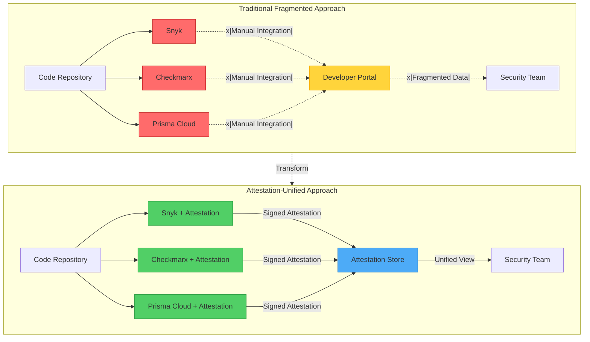
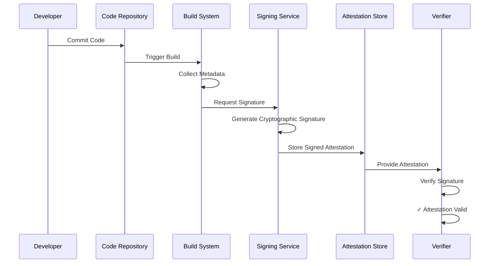
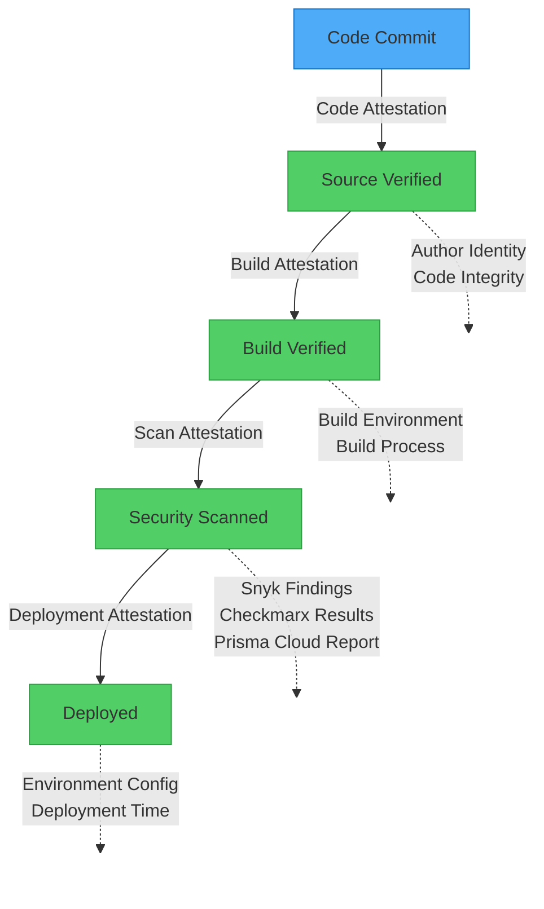
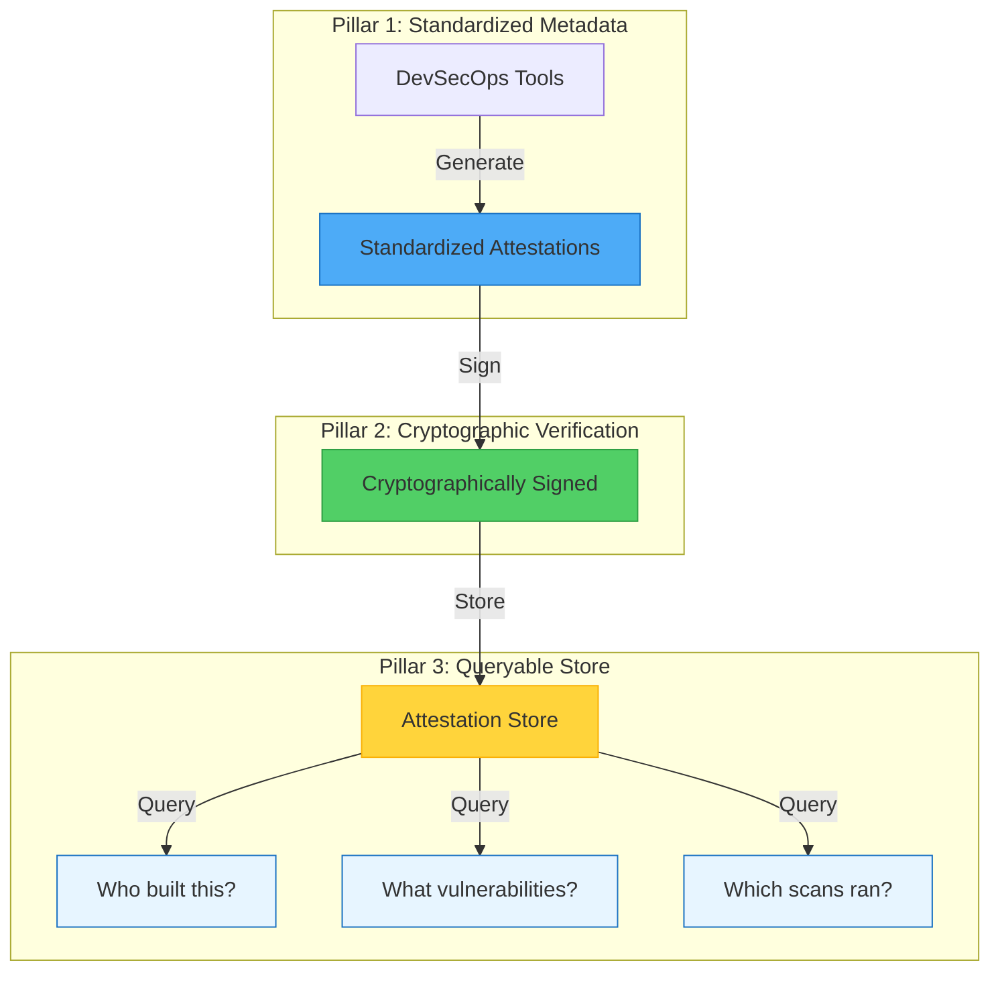
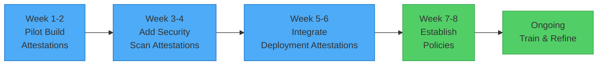

There is a growing demand within enterprises for a reliable method to trace software artifacts back to their original source code and build instructions, driven by the rise in supply chain attacks. This need also applies to other common enterprise scenarios, such as siloed teamwork and the diversification of DevSecOps practices. While enterprises often have access to a broad range of DevSecOps tools on the market, the more tools they adopt, the more fragmented and isolated their processes tend to become.

## The Tooling Conundrum: Integration Overload

Once an enterprise has equipped itself with a wide array of DevSecOps tools, the next challenge is integrating them to minimize fragmentation. The market offers numerous tools, each claiming to be the ultimate solution for security challenges. However, in reality, no single tool can address all issues comprehensively. The key challenge is to build a cohesive ecosystem where these tools operate in harmony, ensuring a transparent and efficient pipeline for software delivery.



Many enterprises choose to develop their own developer portals that integrate or consume scanning reports from these tools and provide a unified view for developers and security engineers. This approach allows for centralized management of vulnerabilities, compliance checks, and other security-related tasks. However, it requires **significant investment** in development and maintenance. Without proper integration and a seamless workflow, these tools can become a nightmare for development teams. Additionally, different development teams often have distinct tooling for their Software Development Life Cycle (SDLC); for example, mobile development teams may use specialized scanning tools.

## What is Attestation?

!!!info "🔐 Understanding Attestation"
    Attestations are a set of tools and practices that enable every step in the SDLC to create a secure and verifiable link between software artifacts and the processes that produced them. These attestations serve as a tamper-proof, unforgeable paper trail that details every step of the software creation process, from code commits to build and deployment.

### The Attestation Process

Let's explore how attestation works by breaking it down into digestible steps:

**Step 1: Metadata Collection**

The process of creating an Artifact Attestation typically involves generating cryptographically signed claims that certify the provenance of a software build. This includes information such as:
- The workflow associated with the artifact
- The repository and organization
- Environment details
- Commit SHA
- The triggering event for the build

We refer to this information as **metadata**.

**Step 2: Cryptographic Signing**

The metadata is then packaged into a cryptographically signed artifact attestation, which can be stored in a trusted repository or distributed to consumers of the software. This process ensures that the provenance of the software build and its associated metadata are verifiable and tamper-proof.

**Step 3: Verification**

Anyone can verify the attestation using the public key, ensuring the artifact hasn't been tampered with and came from a trusted source.

### The Blockchain Connection

!!!anote "🔗 Attestation and Blockchain: Similar Principles"
    Think of attestations like blockchain technology—both create an immutable chain of records. In blockchain, each block contains a cryptographic hash of the previous block, making it tamper-evident. Similarly, attestations create a cryptographic chain of custody for your software:
    
    - **Immutability**: Once signed, attestations cannot be altered without detection
    - **Transparency**: Anyone with access can verify the chain of custody
    - **Decentralization**: No single point of failure or trust
    - **Cryptographic Proof**: Mathematical certainty rather than trust-based verification
    
    However, unlike blockchain, attestations don't require distributed consensus or mining—they're lightweight, fast, and designed specifically for software supply chain security.



The concept of attestation and metadata has been present in the industry for decades, but it is only recently that we have started seeing more tools and services emerging to support this. GitHub, for instance, has recently launched a [public beta](https://github.blog/2024-05-02-introducing-artifact-attestations-now-in-public-beta/) for artifact attestations.

## How Attestation Comes to the Rescue

Attestation-centric DevSecOps transforms the fragmented tooling landscape into a unified, verifiable ecosystem. Instead of forcing tools to integrate directly with each other, attestations create a common language that all tools can speak.

### Breaking Down Silos with Shared Evidence

Imagine Sarah, a security engineer at a large financial institution. Her team uses Snyk for vulnerability scanning, while the mobile team prefers Checkmarx, and the infrastructure team relies on Prisma Cloud. Previously, correlating security findings across these teams required manual effort and often led to gaps in coverage.

With attestation-centric DevSecOps, each tool generates cryptographically signed attestations about its findings. When Sarah needs to assess the security posture of a mobile application that uses shared infrastructure components, she can trace the complete security journey through attestations:



!!!success "✅ Attestation Types in Action"
    - **Code Attestation**: Confirms the source code integrity and author identity
    - **Build Attestation**: Verifies the build environment and process
    - **Scan Attestation**: Documents security findings from multiple tools
    - **Deployment Attestation**: Records the deployment environment and configuration

### Supply Chain Transparency Made Simple

The recent surge in supply chain attacks, from SolarWinds to Log4j, has made enterprises acutely aware of their blind spots. Traditional approaches often rely on Software Bills of Materials (SBOMs), but these are static snapshots that don't capture the dynamic nature of modern software development.

Attestation-centric approaches provide a living audit trail. When a new vulnerability is discovered in a third-party library, security teams can quickly identify all affected applications by querying attestations rather than manually checking each project's dependencies.

## Real-World Implementation: The Three Pillars



!!!tip "🏛️ Pillar 1: Standardized Metadata Collection"
    Every tool in your DevSecOps pipeline should generate attestations in a standardized format. This doesn't mean replacing your existing tools—it means augmenting them with attestation capabilities.
    
    The standardization ensures that all tools speak the same language, making integration seamless and reducing the complexity of managing multiple security tools.

!!!example "📄 Example Attestation Metadata"
    This YAML structure follows the SLSA (Supply chain Levels for Software Artifacts) provenance format, which is becoming an industry standard. It captures:
    - **Subject**: What artifact is being attested (name and cryptographic digest)
    - **Predicate Type**: The attestation format being used
    - **Builder Information**: Who/what created the artifact
    - **Source Information**: Where the code came from
    
```yaml
# Example attestation metadata
subject:
  name: "myapp:v1.2.3"
  digest: "sha256:abc123..."
predicateType: "https://slsa.dev/provenance/v0.2"
predicate:
  builder:
    id: "https://github.com/actions"
  buildType: "https://github.com/actions/workflow"
  invocation:
    configSource:
      uri: "git+https://github.com/myorg/myapp"
      digest: "sha1:def456..."
```

!!!tip "🔒 Pillar 2: Cryptographic Verification"
    All attestations must be cryptographically signed to ensure integrity and non-repudiation. This creates an immutable chain of custody that can withstand sophisticated attacks.
    
    Think of it as a digital seal that proves:
    - The attestation hasn't been tampered with
    - It came from a trusted source
    - It was created at a specific point in time

!!!tip "🔍 Pillar 3: Queryable Attestation Store"
    Attestation data should be stored in a centralized, queryable system that allows security teams to ask complex questions like:
    - "Show me all applications built from code committed by external contributors in the last 30 days"
    - "Which deployments contain the vulnerable version of library X?"
    - "What security scans were performed on this artifact before production deployment?"
    
    This transforms security from reactive to proactive—you can answer questions before incidents occur.

## The Path Forward: Starting Small, Thinking Big

!!!success "🚀 Implementation Roadmap"
    Implementing attestation-centric DevSecOps doesn't require a complete overhaul of your existing infrastructure. Start with these practical steps:
    
    1. **Pilot with Build Attestations**: Begin by generating build provenance attestations for your most critical applications
    2. **Integrate Gradually**: Add attestation capabilities to your existing security tools one at a time
    3. **Establish Policies**: Define what attestations are required for different types of deployments
    4. **Train Your Teams**: Ensure developers and security engineers understand how to interpret and use attestation data



## Conclusion: Trust Through Transparency

In an era where software supply chains are under constant threat and enterprise development teams operate in increasingly complex environments, attestation-centric DevSecOps offers a path to both security and operational efficiency. By creating verifiable, cryptographic evidence of every step in the software development lifecycle, organizations can move from a position of hoping their security measures are effective to knowing they are.

The future of enterprise software security isn't about having more tools—it's about having better visibility into how those tools work together to protect your organization. Attestation-centric DevSecOps provides that visibility, one cryptographic signature at a time.

*Ready to explore attestation-centric DevSecOps for your organization? Start by evaluating your current tooling landscape and identifying opportunities to add attestation capabilities to your most critical development pipelines.*
