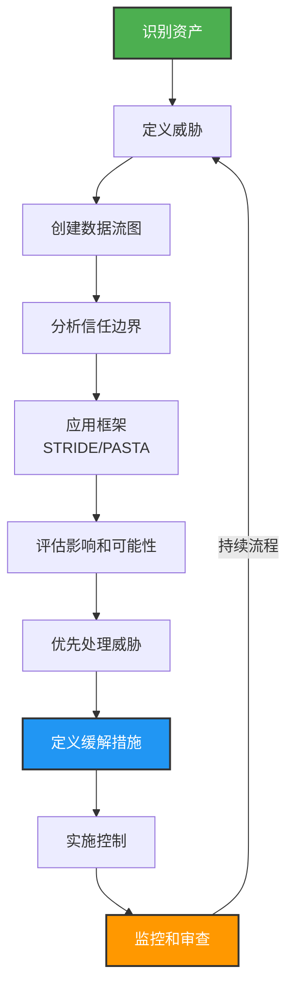

在快速发展的软件开发环境中，DevSecOps 已成为将安全实践集成到 DevOps 流程中的重要框架。然而，许多组织陷入过度强调工具的陷阱，同时忽视了像威胁建模这样的基本有机能力，这对于强大的安全态势至关重要。本文深入探讨威胁建模在 DevSecOps 中的重要性，并提出各种成熟度模型来帮助组织加强其安全措施。

## 被忽视的威胁建模价值

威胁建模是一项基本能力，对于在软件开发生命周期（SDLC）早期识别潜在安全威胁至关重要。它需要对潜在安全漏洞进行系统分析，并使团队能够**主动**解决这些问题。尽管其重要性，威胁建模经常被提供快速解决方案并无缝集成到 CI/CD 管道中的自动化工具的吸引力所掩盖。

现实是，自动化工具虽然有价值，但无法取代威胁建模提供的对安全风险的细致理解。它需要人类洞察力来预测对手可能用来危害系统的战术、技术和程序。通过将威胁建模集成到 DevSecOps 流程中，组织可以确保安全考量嵌入到应用程序的设计和架构中，而不是事后才想到。

## 威胁建模很好，但如何做？

威胁建模可能会带来挑战，但通过结构化的方法，它变得更易于管理。首先要了解威胁建模的内容：它是识别、评估和解决系统潜在威胁的过程。从开发生命周期的早期开始集成威胁建模至关重要。让来自安全、开发和运营的不同利益相关者参与，以获得系统和潜在威胁的全面视图。

了解业务背景同样重要，因为它使您能够将威胁建模流程与组织的目标、风险偏好和资产价值保持一致。

!!!tip "🔑 有效威胁建模的关键要点"
    - 在开发生命周期早期开始
    - 让不同的利益相关者参与（安全、开发、运营）
    - 与业务目标和风险偏好保持一致
    - 使用结构化方法（STRIDE、PASTA）
    - 持续审查和更新您的威胁模型

## 从威胁建模图开始

威胁模型图是用于识别应用程序内潜在安全威胁并确定其缓解措施的视觉表示。它通常包括流程、数据存储、参与者、数据流和信任边界等元素。

要绘制威胁模型图，首先要识别系统的资产，包括需要保护的数据、组件和流程。然后，定义这些资产的潜在威胁，例如未经授权的访问或数据泄漏。接下来，创建数据流图（DFD）以可视化数据如何在系统中移动，突出显示可能发生威胁的点。最后，分析图表以识别可以缓解已识别威胁的安全控制。

虽然威胁模型图可以用笔和纸创建，但有一些工具可以有效地协助进行威胁建模。

* [OWASP Threat Dragon](https://www.threatdragon.com/)
* [Microsoft Threat Modeling Tool](https://www.microsoft.com/en-us/download/details.aspx?id=49168&WT.mc)
* draw.io

## 威胁建模框架

遵循结构化方法，例如 STRIDE 或 PASTA，可以为识别和分析威胁提供清晰简单的框架。识别您的资产和对手可能利用的潜在攻击向量。

评估每个已识别威胁的影响和可能性，以有效地优先处理您的缓解策略。这种优先顺序有助于将精力集中在可能影响您业务的最关键领域。持续审查和更新威胁模型以反映系统或威胁环境的变化也很重要。

!!!warning "⚠️ 威胁建模是一个持续的过程"
    威胁建模不是一次性活动，而是随着系统和周围威胁环境演变的持续过程。随着新威胁的出现和系统的变化，定期审查至关重要。

通过采用这些最佳实践并保持主动立场，您可以克服与威胁建模相关的困难，并有效地保护您的系统免受潜在威胁。

此外，威胁建模本身不是一个工具；相反，它是一种用于识别和优先处理系统潜在威胁的结构化方法。然而，像 [AWS Threat Composer](https://github.com/awslabs/threat-composer) 这样的工具可以协助分析并增强威胁建模过程。AWS Threat Composer 为简单的互联网应用程序和更复杂的机器学习运营（MLOps）提供示例，所有这些都与 OWASP 指南集成。

## 使用成熟度模型导航 DevSecOps

成熟度模型作为组织评估其当前 DevSecOps 实践并规划通往更高级安全集成阶段的路线图。其中一个框架是 OWASP DevSecOps 成熟度模型（DSOMM），它概述了可以在 DevOps 策略中应用并相应优先处理的安全措施。DSOMM 帮助组织识别其安全实践中的差距，并提供结构化的方法来增强其 DevSecOps 倡议。

## 实施 DevSecOps 转型的多阶段方法

DevSecOps 的实施不是一刀切的解决方案；它需要考虑每个组织的独特需求和目标的量身定制方法。DevSecOps 转型的多阶段方法允许组织在实施过程中评估其进度和成熟度。这种方法通常包括初始采用、安全测试自动化和持续改进等阶段，每个阶段都有要实施的特定目标和实践。

## 左移、右留、做对

在 DevSecOps 领域，"左移"、"右留"和"做对"的概念概括了在整个软件开发生命周期中集成安全性的全面方法。"左移"是指在开发过程的早期纳入安全措施的实践，而不是事后才想到。这种主动立场确保安全考量是设计和开发阶段的组成部分，从一开始就导致更安全的结果。这是关于将安全性嵌入开发者的工作流程，并使其成为整个团队的共同责任，而不是将其归为单独的阶段或特定的安全专业人员群体。

另一方面，"右留"强调在软件生命周期的运营阶段持续安全实践的重要性。它涉及实时监控、保护和响应安全威胁，确保安全措施始终保持最新并有效对抗不断演变的威胁。这种方法认识到安全性不是一次性事件，而是需要警惕和适应性的持续过程，因为软件在生产环境中部署和使用。

最后，DevSecOps 中的"做对"是一个指导原则，强调所有利益相关者遵守安全最佳实践的道德责任。这是对做必要的事情来保护数据、尊重隐私和确保软件完整性的承诺。这包括了解最新的安全趋势、遵守法规，以及在组织内培养安全文化。

这些原则共同形成了一个强大的框架，用于将安全性集成到软件开发和部署过程的每个阶段，与 DevSecOps 的总体目标保持一致，即快速高效地构建安全软件，而不会在质量或性能上妥协。通过左移、右留和做对，组织可以在速度、功能和安全性之间取得平衡，这在当今快节奏和充满威胁的数字环境中至关重要。

## 结论

DevSecOps 不仅仅是一组工具；它是一种需要在自动化和像威胁建模这样的有机能力之间取得平衡的文化。成熟度模型为组织提供了一个有价值的框架，以系统地改进其在 DevOps 管道中的安全实践。通过认识威胁建模的重要性并利用成熟度模型，组织可以超越以工具为中心的观点，开发一个全面、有弹性的安全策略，融入其软件开发流程的结构中。

对于那些有兴趣进一步探索 DevSecOps 和威胁建模复杂性的人，可以通过 OWASP 基金会和其他致力于增强应用程序安全性的业界专家找到额外的资源和详细方法。
