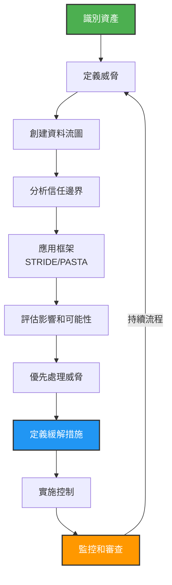

在快速發展的軟體開發環境中，DevSecOps 已成為將安全實踐整合到 DevOps 流程中的重要框架。然而，許多組織陷入過度強調工具的陷阱，同時忽視了像威脅建模這樣的基本有機能力，這對於強大的安全態勢至關重要。本文深入探討威脅建模在 DevSecOps 中的重要性，並提出各種成熟度模型來幫助組織加強其安全措施。

## 被忽視的威脅建模價值

威脅建模是一項基本能力，對於在軟體開發生命週期（SDLC）早期識別潛在安全威脅至關重要。它需要對潛在安全漏洞進行系統分析，並使團隊能夠**主動**解決這些問題。儘管其重要性，威脅建模經常被提供快速解決方案並無縫整合到 CI/CD 管道中的自動化工具的吸引力所掩蓋。

現實是，自動化工具雖然有價值，但無法取代威脅建模提供的對安全風險的細緻理解。它需要人類洞察力來預測對手可能用來危害系統的戰術、技術和程序。通過將威脅建模整合到 DevSecOps 流程中，組織可以確保安全考量嵌入到應用程式的設計和架構中，而不是事後才想到。

## 威脅建模很好，但如何做？

威脅建模可能會帶來挑戰，但通過結構化的方法，它變得更易於管理。首先要了解威脅建模的內容：它是識別、評估和解決系統潛在威脅的過程。從開發生命週期的早期開始整合威脅建模至關重要。讓來自安全、開發和營運的不同利益相關者參與，以獲得系統和潛在威脅的全面視圖。

了解業務背景同樣重要，因為它使您能夠將威脅建模流程與組織的目標、風險偏好和資產價值保持一致。

!!!tip "🔑 有效威脅建模的關鍵要點"
    - 在開發生命週期早期開始
    - 讓不同的利益相關者參與（安全、開發、營運）
    - 與業務目標和風險偏好保持一致
    - 使用結構化方法（STRIDE、PASTA）
    - 持續審查和更新您的威脅模型

## 從威脅建模圖開始

威脅模型圖是用於識別應用程式內潛在安全威脅並確定其緩解措施的視覺表示。它通常包括流程、資料儲存、參與者、資料流和信任邊界等元素。

要繪製威脅模型圖，首先要識別系統的資產，包括需要保護的資料、元件和流程。然後，定義這些資產的潛在威脅，例如未經授權的訪問或資料洩漏。接下來，創建資料流圖（DFD）以視覺化資料如何在系統中移動，突出顯示可能發生威脅的點。最後，分析圖表以識別可以緩解已識別威脅的安全控制。

雖然威脅模型圖可以用筆和紙創建，但有一些工具可以有效地協助進行威脅建模。

* [OWASP Threat Dragon](https://www.threatdragon.com/)
* [Microsoft Threat Modeling Tool](https://www.microsoft.com/en-us/download/details.aspx?id=49168&WT.mc)
* draw.io

## 威脅建模框架

遵循結構化方法，例如 STRIDE 或 PASTA，可以為識別和分析威脅提供清晰簡單的框架。識別您的資產和對手可能利用的潛在攻擊向量。

評估每個已識別威脅的影響和可能性，以有效地優先處理您的緩解策略。這種優先順序有助於將精力集中在可能影響您業務的最關鍵領域。持續審查和更新威脅模型以反映系統或威脅環境的變化也很重要。

!!!warning "⚠️ 威脅建模是一個持續的過程"
    威脅建模不是一次性活動，而是隨著系統和周圍威脅環境演變的持續過程。隨著新威脅的出現和系統的變化，定期審查至關重要。

通過採用這些最佳實踐並保持主動立場，您可以克服與威脅建模相關的困難，並有效地保護您的系統免受潛在威脅。

此外，威脅建模本身不是一個工具；相反，它是一種用於識別和優先處理系統潛在威脅的結構化方法。然而，像 [AWS Threat Composer](https://github.com/awslabs/threat-composer) 這樣的工具可以協助分析並增強威脅建模過程。AWS Threat Composer 為簡單的網際網路應用程式和更複雜的機器學習營運（MLOps）提供範例，所有這些都與 OWASP 指南整合。

## 使用成熟度模型導航 DevSecOps

成熟度模型作為組織評估其當前 DevSecOps 實踐並規劃通往更高級安全整合階段的路線圖。其中一個框架是 OWASP DevSecOps 成熟度模型（DSOMM），它概述了可以在 DevOps 策略中應用並相應優先處理的安全措施。DSOMM 幫助組織識別其安全實踐中的差距，並提供結構化的方法來增強其 DevSecOps 倡議。

## 實施 DevSecOps 轉型的多階段方法

DevSecOps 的實施不是一刀切的解決方案；它需要考慮每個組織的獨特需求和目標的量身定制方法。DevSecOps 轉型的多階段方法允許組織在實施過程中評估其進度和成熟度。這種方法通常包括初始採用、安全測試自動化和持續改進等階段，每個階段都有要實施的特定目標和實踐。

## 左移、右留、做對

在 DevSecOps 領域，「左移」、「右留」和「做對」的概念概括了在整個軟體開發生命週期中整合安全性的全面方法。「左移」是指在開發過程的早期納入安全措施的實踐，而不是事後才想到。這種主動立場確保安全考量是設計和開發階段的組成部分，從一開始就導致更安全的結果。這是關於將安全性嵌入開發者的工作流程，並使其成為整個團隊的共同責任，而不是將其歸為單獨的階段或特定的安全專業人員群體。

另一方面，「右留」強調在軟體生命週期的營運階段持續安全實踐的重要性。它涉及即時監控、保護和回應安全威脅，確保安全措施始終保持最新並有效對抗不斷演變的威脅。這種方法認識到安全性不是一次性事件，而是需要警惕和適應性的持續過程，因為軟體在生產環境中部署和使用。

最後，DevSecOps 中的「做對」是一個指導原則，強調所有利益相關者遵守安全最佳實踐的道德責任。這是對做必要的事情來保護資料、尊重隱私和確保軟體完整性的承諾。這包括了解最新的安全趨勢、遵守法規，以及在組織內培養安全文化。

這些原則共同形成了一個強大的框架，用於將安全性整合到軟體開發和部署過程的每個階段，與 DevSecOps 的總體目標保持一致，即快速高效地建構安全軟體，而不會在品質或效能上妥協。通過左移、右留和做對，組織可以在速度、功能和安全性之間取得平衡，這在當今快節奏和充滿威脅的數位環境中至關重要。

## 結論

DevSecOps 不僅僅是一組工具；它是一種需要在自動化和像威脅建模這樣的有機能力之間取得平衡的文化。成熟度模型為組織提供了一個有價值的框架，以系統地改進其在 DevOps 管道中的安全實踐。通過認識威脅建模的重要性並利用成熟度模型，組織可以超越以工具為中心的觀點，開發一個全面、有彈性的安全策略，融入其軟體開發流程的結構中。

對於那些有興趣進一步探索 DevSecOps 和威脅建模複雜性的人，可以通過 OWASP 基金會和其他致力於增強應用程式安全性的業界專家找到額外的資源和詳細方法。
