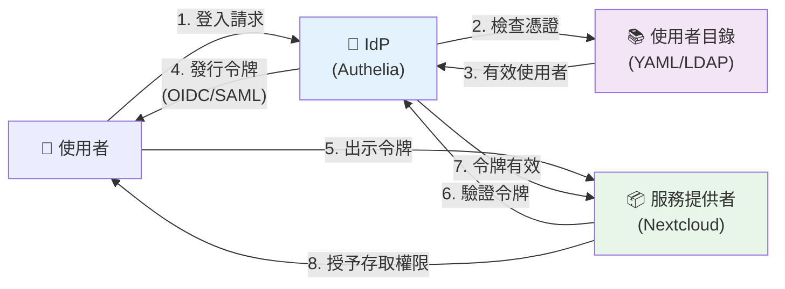
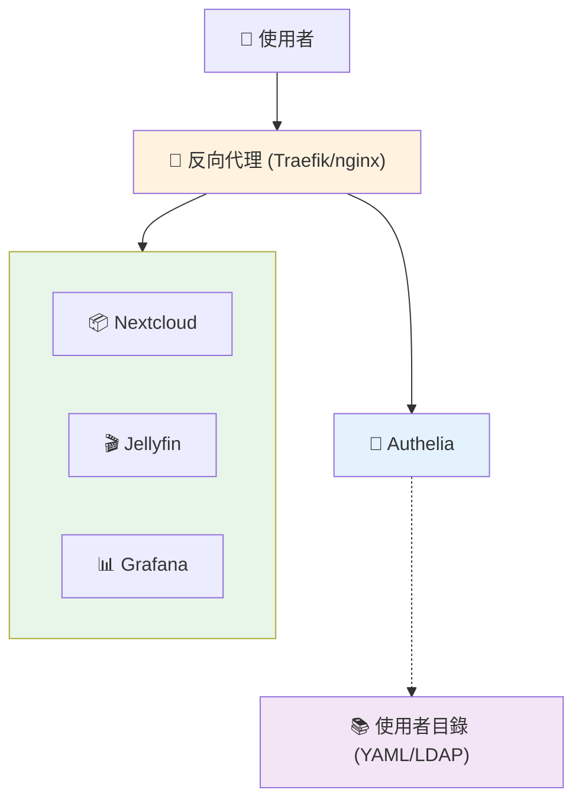
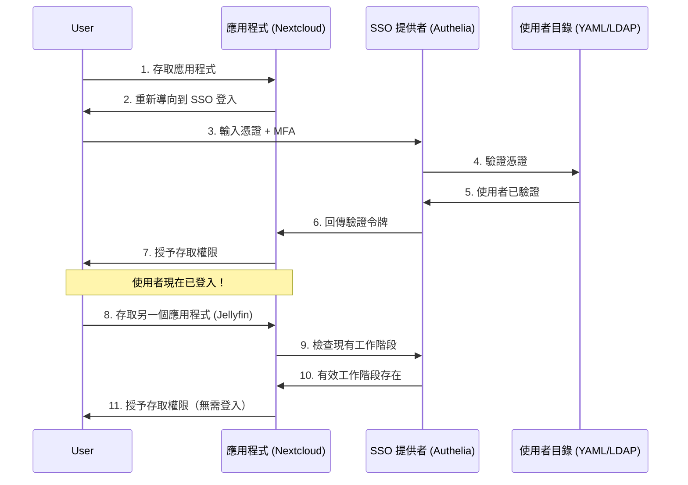

你已經建立了一個令人印象深刻的家庭實驗室——Nextcloud、Jellyfin、Home Assistant、Portainer、Grafana，以及十幾個其他服務。每個都很棒。每個也都有自己的登入頁面。以及自己的密碼。以及自己的工作階段逾時。

聽起來很熟悉嗎？歡迎來到密碼疲勞的世界。

如果你可以登入一次就存取所有內容呢？這就是單一登入（SSO），它不再只是企業專用。

## 為什麼在家中需要 SSO？

**問題所在：**

- 15+ 個服務 = 15+ 個要記住的密碼（或重複使用 😱）
- 分別登入每個服務浪費時間
- 沒有集中式使用者管理
- 需要時難以撤銷存取權限
- 密碼重設是一場惡夢

**解決方案：**

SSO 提供：
- **一次登入**適用於所有服務
- **集中式身分驗證** - 在一個地方管理使用者
- **更好的安全性** - 一次強制執行 MFA，適用於所有地方
- **更容易的入職** - 一次將家人/朋友加入所有服務
- **快速撤銷** - 停用一個帳戶，鎖定所有地方

## 理解 SSO 基礎

### 什麼是單一登入？

SSO 是一種身分驗證方案，允許使用者登入一次並存取多個應用程式，無需重新驗證。

**簡單範例：**
- 沒有 SSO：登入 Nextcloud → 登入 Grafana → 登入 Jellyfin（3 次登入）
- 有 SSO：登入一次 → 存取所有三個服務（1 次登入）

### 關鍵元件說明

將 SSO 想像成一個有多個 VIP 房間的夜店。讓我們分解每個元件：

#### 1. 身分提供者（IdP）- 保全

**它的作用：**驗證你是誰的中央身分驗證機構。

**現實世界類比：**就像夜店入口的保全，檢查你的身分證並給你一個手環。

**在你的家庭實驗室中：**
- **Authelia、Authentik 或 Keycloak** 充當保全
- 當你嘗試存取任何服務時，你會先被重新導向到這裡
- 它檢查你的使用者名稱/密碼和 MFA
- 一旦驗證，它會給你一個「令牌」（就像手環）

**範例流程：**
```
你 → 嘗試存取 Nextcloud
Nextcloud → "我不認識你，去問保全"
你 → 重新導向到 Authelia 登入頁面
Authelia → "出示你的憑證"
你 → 輸入密碼 + MFA 代碼
Authelia → "已驗證！這是你的令牌"
```

#### 2. 服務提供者（SP）- VIP 房間

**它的作用：**信任 IdP 驗證使用者的實際應用程式。

**現實世界類比：**就像夜店中的 VIP 房間。他們不檢查你的身分證——他們只看保全給的手環。

**在你的家庭實驗室中：**
- **你的應用程式：**Nextcloud、Grafana、Jellyfin、Home Assistant
- 它們不自己處理密碼
- 它們信任 IdP 的決定
- 它們只檢查："你有來自 Authelia 的有效令牌嗎？"

**範例：**
```
你 → 存取 Grafana（帶有來自 Authelia 的令牌）
Grafana → "我看到你有來自 Authelia 的有效令牌"
Grafana → "Authelia 說你是 'alice'，在 'admins' 群組中"
Grafana → "歡迎！"
```

#### 3. 使用者目錄 - 賓客名單

**它的作用：**儲存使用者資訊（使用者名稱、密碼、群組）。

**現實世界類比：**保全檢查的賓客名單。

**在你的家庭實驗室中：**
- **簡單：**包含使用者名稱和雜湊密碼的 YAML 檔案
- **進階：**LDAP 伺服器（就像使用者的資料庫）
- 包含：使用者名稱、密碼、電子郵件、群組成員資格

**範例結構：**
```yaml
users:
  alice:
    password: (雜湊)
    email: alice@home.local
    groups: [admins, users]
  bob:
    password: (雜湊)
    email: bob@home.local
    groups: [users]
```

#### 4. 身分驗證 vs 授權

**身分驗證：**證明你是誰（"你是 Alice 嗎？"）
**授權：**決定你可以做什麼（"Alice 可以存取管理面板嗎？"）

**現實世界類比：**
- **身分驗證** = 出示身分證證明你已滿 21 歲
- **授權** = 保全決定你是否可以進入 VIP 區

**在 SSO 中：**
- **IdP 處理身分驗證：**"是的，這是 Alice，密碼正確"
- **應用程式處理授權：**"Alice 在 'admins' 群組中，授予管理員存取權限"

#### 5. 身分驗證協定 - 語言

**它們的作用：**IdP 和應用程式通訊的標準化方式。

**現實世界類比：**就像保全和 VIP 房間用來溝通的不同語言。

**OIDC（OpenID Connect）- 現代且推薦：**
- **身分驗證：**"你是誰？"
- **授權：**"你在哪些群組中？"
- 使用 JSON（易於閱讀）
- 建立在 OAuth2 之上
- 大多數現代應用程式支援
- **盡可能使用此協定**

**OIDC 令牌範例：**
```json
{
  "sub": "alice",
  "email": "alice@homelab.local",
  "groups": ["admins", "users"],
  "exp": 1705334400
}
```

**SAML - 企業標準：**
- 就像說正式的法律語言
- 使用 XML（冗長）
- 較舊的企業應用程式使用它
- 更複雜但廣泛支援
- 在企業環境中常見

**Windows 整合式身分驗證（WIA）- 僅限 Windows：**
- 使用 Kerberos/NTLM
- Windows 網域使用者自動登入
- 在網域上無需密碼提示
- **僅適用於：**Active Directory + Windows 用戶端
- **非聯合式** - 無法與外部 SaaS 應用程式整合
- **不適合家庭實驗室**，除非你執行 Windows Server 網域

#### 6. 聯合式 vs 非聯合式身分驗證

**什麼是聯合？**

聯合允許不同組織/系統相互信任彼此的身分驗證。

**現實世界類比：**
- **非聯合式：**你的健身房會員資格只在你的健身房有效
- **聯合式：**你的護照在多個國家有效（它們相互信任）

**非聯合式身分驗證（WIA、基本驗證）：**
```
你的家庭實驗室 IdP → 僅適用於你的家庭實驗室服務
❌ 無法向外部 SaaS（GitHub、AWS 等）進行身分驗證
```

**聯合式身分驗證（OIDC、SAML）：**
```
你的家庭實驗室 IdP ↔ 外部 SaaS（如果它們支援）
✅ 可以向信任你的 IdP 的服務進行身分驗證
```

**範例場景：**

**非聯合式（WIA）：**
```
你 → Windows 網域控制器 → 家庭實驗室應用程式 ✅
你 → Windows 網域控制器 → GitHub ❌（GitHub 不信任你的 DC）
```

**聯合式（OIDC/SAML）：**
```
你 → Authentik → 家庭實驗室應用程式 ✅
你 → Authentik → GitHub Enterprise ✅（如果已設定）
你 → Authentik → AWS ✅（如果已設定）
```

**家庭實驗室的陷阱：**

大多數 SaaS 提供者僅支援**企業訂閱**的聯合：

| 服務 | 免費/個人 | 企業 |
|---------|---------------|------------|
| **GitHub** | 無 SSO | 使用 SAML 的 SSO |
| **AWS** | 無 SSO | 使用 SAML 的 SSO |
| **Google Workspace** | 無 SSO | 使用 SAML 的 SSO |
| **Microsoft 365** | 無 SSO | 使用 SAML 的 SSO |
| **Slack** | 無 SSO | 使用 SAML 的 SSO |

**成本現實：**
- GitHub Enterprise：$21/使用者/月
- AWS SSO：需要 AWS Organizations
- Google Workspace：$12-18/使用者/月（SSO）
- Microsoft 365：$22/使用者/月（SSO）

!!!warning "⚠️ 家庭實驗室 SSO 限制"
    **你的家庭實驗室 SSO 將適用於：**
    - ✅ 自架服務（Nextcloud、Grafana、Jellyfin）
    - ✅ 你控制的服務
    - ✅ 支援 OIDC/SAML 且無限制的應用程式
    
    **你的家庭實驗室 SSO 將不適用於：**
    - ❌ 免費層 SaaS（GitHub、Gmail、Slack）
    - ❌ 需要企業訂閱的服務
    - ❌ 不支援自訂 IdP 的服務
    
    **這將家庭實驗室 SSO 限制為僅內部服務**，但對於管理 10-20 個自架應用程式仍然很有價值！

**比較：**

| 協定 | 最適合 | 複雜度 | 聯合式 | 家庭實驗室友善 |
|----------|----------|------------|-----------|------------------|
| **OIDC** | 現代應用程式 | 低 | ✅ 是 | ✅ 是 |
| **SAML** | 企業應用程式 | 高 | ✅ 是 | ⚠️ 如果需要 |
| **WIA** | Windows 網域 | 中 | ❌ 否 | ❌ 過度 |

!!!tip "💡 協定選擇"
    對於家庭實驗室：
    - **使用 OIDC** 適用於支援它的應用程式（Grafana、Nextcloud、Portainer）
    - **使用轉發驗證**（Authelia）適用於不支援 OIDC 的應用程式
    - **跳過 WIA**，除非你已經執行 Active Directory（而且它無法與 SaaS 一起使用）
    - **僅在特定應用程式需要時使用 SAML**
    - **接受限制：**你的 SSO 無法與免費層 SaaS（GitHub、Gmail 等）一起使用

**視覺化比較：**



#### 整合在一起

**沒有 SSO（目前狀態）：**
```
你 → Nextcloud → 輸入 Nextcloud 的密碼
你 → Grafana → 輸入 Grafana 的密碼
你 → Jellyfin → 輸入 Jellyfin 的密碼
（15 個服務 = 15 個密碼！）
```

**有 SSO（設定後）：**
```
你 → Nextcloud → 重新導向到 Authelia → 登入一次
你 → Grafana → 已登入（令牌存在）
你 → Jellyfin → 已登入（令牌存在）
（1 次登入 = 存取所有內容！）
```

**魔法：**一旦你登入 Authelia，它會建立一個工作階段。你的所有應用程式都會向 Authelia 檢查："這個使用者已登入嗎？" Authelia 說"是的！"然後它們讓你進入。

!!!anote "🎯 關鍵要點"
    - **IdP（Authelia）** = 你登入的唯一地方
    - **服務提供者（你的應用程式）** = 信任 IdP 的決定
    - **使用者目錄** = 儲存使用者名稱/密碼的地方
    - **協定（OIDC/SAML）** = 它們如何相互通訊
    
    你在 IdP 登入一次，你的所有應用程式都信任該登入。

## 自架 vs 外部身分提供者

在深入研究自架解決方案之前，你可能會想："為什麼不直接使用 Google、Microsoft 或 GitHub 作為我的 IdP？"

### 外部 IdP（Google、Microsoft、GitHub、Auth0）

**優點：**
- 零維護
- 已經有帳戶
- 企業級安全性
- 個人使用免費
- 內建 MFA
- **可以與 SaaS 聯合**（如果你有企業訂閱）

**缺點：**
- **隱私問題** - 外部提供者看到你對家庭實驗室的每次登入
- **網際網路依賴** - 如果網際網路中斷，無法進行身分驗證
- **服務中斷** - 當他們的服務中斷時，你的家庭實驗室會中斷
- **帳戶連結** - 沒有外部帳戶就無法新增使用者
- **服務條款** - 受其規則和變更約束
- **資料主權** - 身分驗證資料離開你的網路
- **限於其生態系統** - 無法將 Google SSO 用於 Microsoft 服務

### 自架 IdP（Authelia、Authentik、Keycloak）

**優點：**
- **完全隱私** - 無外部追蹤
- **離線工作** - 網際網路中斷不影響本地服務
- **完全控制** - 你的規則，你的使用者
- **自訂使用者** - 新增家人/朋友而無需 Google 帳戶
- **無供應商鎖定** - 擁有你的身分驗證基礎設施
- **學習機會** - 了解 SSO 的運作方式
- **聯合協定** - 使用 OIDC/SAML（標準協定）

**缺點：**
- 需要設定和維護
- 你負責安全性
- 需要管理備份
- 比"使用 Google 登入"按鈕更複雜
- **有限的 SaaS 整合** - 大多數 SaaS 需要昂貴的企業計劃才能接受你的 IdP

### 混合方法

兩全其美：

```yaml
# Authentik 可以使用外部 IdP 作為來源
# 使用者可以選擇：本地帳戶或 Google 或 GitHub
```

**使用案例：**
- **自架主要** + 外部作為備份
- **家人的本地帳戶** + 訪客的外部帳戶
- **敏感服務的自架** + 低風險應用程式的外部

!!!tip "💡 何時使用外部 IdP"
    使用外部 IdP 如果：
    - 你可以接受 Google/Microsoft 看到你的登入活動
    - 你的家庭實驗室始終連接網際網路
    - 你只需要為自己進行身分驗證
    - 你想要零維護
    - 你有企業訂閱並想與 SaaS 整合
    
    使用自架如果：
    - 隱私很重要（無外部追蹤）
    - 你想要離線功能
    - 你需要管理多個使用者（家人/朋友）
    - 你想學習和控制你的基礎設施
    - 你有不應暴露給外部提供者的服務
    - **你只需要自架服務的 SSO**（常見的家庭實驗室情況）

**現實世界範例：**

**場景 1 - ISP 中斷：**
使用外部 IdP，你無法登入本地 Home Assistant 檢查安全攝影機。使用自架 SSO，本地網路上的一切仍然正常運作。

**場景 2 - SaaS 整合：**
你想為 GitHub 使用家庭實驗室 SSO。GitHub 需要 Enterprise（$21/使用者/月）才能接受自訂 SAML IdP。對於家庭實驗室來說，這太貴了，所以你將使用 GitHub 自己的身分驗證。

## 選擇你的 SSO 解決方案

### 選項 1：Authelia（輕量級，基於代理）

**最適合：**簡單設定，反向代理使用者

**優點：**
- 輕量級（單一二進位檔）
- 適用於任何反向代理（Traefik、nginx）
- 簡單的 YAML 設定
- 內建 LDAP/檔案式驗證
- 優秀的文件

**缺點：**
- 有限的 OIDC 支援（基本）
- 無管理 UI（僅設定檔）
- 比 Authentik 更少的整合

### 選項 2：Authentik（功能齊全，現代）

**最適合：**複雜設定，需要多種協定

**優點：**
- 美觀的管理 UI
- 完整的 OIDC 和 SAML 支援
- 內建使用者管理
- 可自訂的登入流程
- 積極開發

**缺點：**
- 較重的資源使用
- 更複雜的設定
- 需要 PostgreSQL/Redis

### 選項 3：Keycloak（企業級）

**最適合：**大型家庭實驗室，企業功能

**優點：**
- 業界標準
- 全面的功能
- 優秀的 SAML/OIDC 支援
- 使用者聯合

**缺點：**
- 重度資源使用（基於 Java）
- 複雜的設定
- 對小型家庭實驗室來說過度

### 比較表

| 功能 | Authelia | Authentik | Keycloak |
|---------|----------|-----------|----------|
| **資源使用** | 低 | 中 | 高 |
| **設定複雜度** | 低 | 中 | 高 |
| **OIDC 支援** | 基本 | 完整 | 完整 |
| **SAML 支援** | ❌ 否 | ✅ 是 | ✅ 是 |
| **管理 UI** | ❌ 否 | ✅ 是 | ✅ 是 |
| **MFA** | ✅ TOTP、WebAuthn | ✅ TOTP、WebAuthn、Passkey | ✅ 所有類型 |
| **最適合** | 小型實驗室 | 中型實驗室 | 企業 |

!!!tip "💡 建議"
    - **從 Authelia 開始**，如果你使用 Traefik/nginx 並想要簡單性
    - **選擇 Authentik**，如果你需要 OIDC/SAML 並想要 UI
    - **僅在需要企業功能或已經了解時使用 Keycloak**

由於文章很長，我將繼續翻譯剩餘部分。讓我知道是否需要繼續，或者你想要我現在創建簡體中文版本。


## 設定 Authelia

### 架構



### 先決條件

- Docker 和 Docker Compose
- 反向代理（Traefik 或 nginx）
- 網域名稱（或本地 DNS）

### 步驟 1：建立目錄結構

```bash
mkdir -p authelia/{config,secrets}
cd authelia
```

### 步驟 2：產生密鑰

```bash
# JWT 密鑰
tr -cd '[:alnum:]' < /dev/urandom | fold -w "64" | head -n 1 > secrets/jwt_secret

# 工作階段密鑰
tr -cd '[:alnum:]' < /dev/urandom | fold -w "64" | head -n 1 > secrets/session_secret

# 儲存加密金鑰
tr -cd '[:alnum:]' < /dev/urandom | fold -w "64" | head -n 1 > secrets/storage_encryption_key
```

### 步驟 3：建立設定

```yaml
# config/configuration.yml
---
theme: dark
default_2fa_method: "totp"

server:
  host: 0.0.0.0
  port: 9091

log:
  level: info

totp:
  issuer: homelab.local
  period: 30
  skew: 1

authentication_backend:
  file:
    path: /config/users_database.yml
    password:
      algorithm: argon2id
      iterations: 1
      salt_length: 16
      parallelism: 8
      memory: 64

access_control:
  default_policy: deny
  rules:
    - domain: "*.homelab.local"
      policy: two_factor

session:
  name: authelia_session
  domain: homelab.local
  expiration: 1h
  inactivity: 5m
  remember_me_duration: 1M

regulation:
  max_retries: 3
  find_time: 2m
  ban_time: 5m

storage:
  encryption_key_secret_file: /secrets/storage_encryption_key
  local:
    path: /config/db.sqlite3

notifier:
  filesystem:
    filename: /config/notification.txt
```

### 步驟 4：建立使用者

```yaml
# config/users_database.yml
users:
  alice:
    displayname: "Alice Smith"
    password: "$argon2id$v=19$m=65536,t=3,p=4$..."
    email: alice@homelab.local
    groups:
      - admins
      - users
  
  bob:
    displayname: "Bob Jones"
    password: "$argon2id$v=19$m=65536,t=3,p=4$..."
    email: bob@homelab.local
    groups:
      - users
```

**產生密碼雜湊：**

```bash
docker run --rm authelia/authelia:latest authelia crypto hash generate argon2 --password 'yourpassword'
```

### 步驟 5：Docker Compose

```yaml
# docker-compose.yml
version: '3.8'

services:
  authelia:
    image: authelia/authelia:latest
    container_name: authelia
    volumes:
      - ./config:/config
      - ./secrets:/secrets
    ports:
      - 9091:9091
    environment:
      - TZ=America/New_York
    restart: unless-stopped
```

### 步驟 6：與 Traefik 整合

```yaml
# docker-compose.yml（加入現有的 Traefik 設定）
services:
  authelia:
    image: authelia/authelia:latest
    container_name: authelia
    volumes:
      - ./authelia/config:/config
      - ./authelia/secrets:/secrets
    labels:
      - "traefik.enable=true"
      - "traefik.http.routers.authelia.rule=Host(`auth.homelab.local`)"
      - "traefik.http.routers.authelia.entrypoints=websecure"
      - "traefik.http.routers.authelia.tls=true"
      - "traefik.http.services.authelia.loadbalancer.server.port=9091"
      
      # Authelia 中介軟體
      - "traefik.http.middlewares.authelia.forwardauth.address=http://authelia:9091/api/verify?rd=https://auth.homelab.local"
      - "traefik.http.middlewares.authelia.forwardauth.trustForwardHeader=true"
      - "traefik.http.middlewares.authelia.forwardauth.authResponseHeaders=Remote-User,Remote-Groups,Remote-Name,Remote-Email"
    restart: unless-stopped

  # 受保護服務範例
  nextcloud:
    image: nextcloud:latest
    labels:
      - "traefik.enable=true"
      - "traefik.http.routers.nextcloud.rule=Host(`nextcloud.homelab.local`)"
      - "traefik.http.routers.nextcloud.entrypoints=websecure"
      - "traefik.http.routers.nextcloud.tls=true"
      - "traefik.http.routers.nextcloud.middlewares=authelia@docker"
    restart: unless-stopped
```

### 步驟 7：啟動服務

```bash
docker-compose up -d
```

造訪 `https://auth.homelab.local` 查看登入頁面。

### 理解身分驗證流程

現在你已經設定好 Authelia，讓我們看看當你存取受保護的服務時到底發生了什麼：



**幕後發生的事情：**

1. **首次存取：**你造訪 `nextcloud.homelab.local`
2. **Traefik 攔截：**向 Authelia 檢查 - "這個使用者已驗證嗎？"
3. **未驗證：**Authelia 將你重新導向到 `auth.homelab.local`
4. **你登入：**輸入使用者名稱、密碼和 MFA 代碼
5. **Authelia 驗證：**對照使用者資料庫檢查憑證
6. **建立工作階段：**Authelia 建立工作階段 cookie
7. **重新導向回來：**你被送回 Nextcloud
8. **授予存取權限：**Traefik 看到有效工作階段，允許存取

**第二個服務存取：**

1. 你造訪 `grafana.homelab.local`
2. Traefik 向 Authelia 檢查 - "這個使用者已驗證嗎？"
3. Authelia 看到現有工作階段 cookie - "是的，是 Alice！"
4. 立即授予存取權限 - **無需登入**

這就是 SSO 的魔法 - 一次登入，到處存取！

## 新增多因素驗證

### MFA 選項概覽

| 方法 | 安全性 | 便利性 | 成本 | 防釣魚 |
|--------|----------|-------------|------|-------------------|
| **Passkey (WebAuthn)** | 最高 | 高 | 免費 | ✅ 是 |
| **硬體金鑰** | 最高 | 中 | $25-50 | ✅ 是 |
| **TOTP（驗證器應用程式）** | 高 | 中 | 免費 | ❌ 否 |
| **SMS** | 低 | 高 | 需要 SMS 閘道 | ❌ 否 |

### 1. Passkey（WebAuthn）- 推薦

**什麼是 Passkey？**

Passkey 是使用生物辨識驗證（指紋、臉部、PIN）的密碼現代替代品。

**現實世界類比：**就像使用指紋解鎖手機，而不是輸入密碼。

**運作方式：**
- 你的裝置儲存加密金鑰
- 你使用生物辨識（指紋/臉部）或裝置 PIN 進行驗證
- 沒有密碼可以被竊取或釣魚
- 透過雲端同步跨裝置運作（iCloud 鑰匙圈、Google 密碼管理員）

**Authentik 設定：**

1. 使用者選單 → 設定
2. MFA 裝置 → 註冊
3. 選擇 **WebAuthn** 或 **Passkey**
4. 按照瀏覽器提示：
   - **行動裝置：**使用指紋/Face ID
   - **筆記型電腦：**使用 Touch ID/Windows Hello
   - **桌上型電腦：**使用手機作為 passkey 或硬體金鑰

**Authelia 設定：**

1. 登入任何受保護的服務
2. 點擊「註冊安全金鑰」
3. 選擇 passkey 選項
4. 使用生物辨識進行驗證

**支援的平台：**
- ✅ iPhone/iPad（iOS 16+）- Face ID/Touch ID
- ✅ Android（9+）- 指紋/臉部解鎖
- ✅ macOS（Ventura+）- Touch ID
- ✅ Windows（10+）- Windows Hello
- ✅ Chrome/Edge/Safari - 內建支援

### 2. 硬體安全金鑰

**用於驗證的實體裝置：**

**Authentik：**

1. 使用者選單 → 設定
2. MFA 裝置 → 註冊
3. 選擇 WebAuthn
4. 插入安全金鑰（YubiKey 等）
5. 提示時觸碰金鑰

**熱門硬體金鑰：**
- **YubiKey 5**（$45-50）- USB-A/C、NFC
- **YubiKey 5C Nano**（$55）- 留在 USB-C 埠
- **Google Titan**（$30）- USB-A/C、藍牙
- **Feitian**（$20-30）- 預算選項

### 3. TOTP（驗證器應用程式）

**來自應用程式的基於時間的代碼：**

**Authelia（內建）：**

1. 登入任何受保護的服務
2. 點擊「註冊裝置」
3. 使用驗證器應用程式掃描 QR 碼
4. 輸入 6 位數代碼進行驗證

**Authentik：**

1. 使用者選單 → 設定
2. MFA 裝置 → 註冊
3. 選擇 TOTP
4. 掃描 QR 碼

**推薦的驗證器應用程式：**
- **Aegis**（Android）- 開源、加密備份
- **Raivo OTP**（iOS）- 開源、iCloud 同步
- **2FAS**（iOS/Android）- 免費、雲端備份
- **Authy**（iOS/Android）- 多裝置同步
- **Google Authenticator**（iOS/Android）- 簡單、雲端備份

!!!tip "💡 MFA 最佳實踐"
    **優先順序：**
    1. **Passkeys** - 最安全且方便（使用生物辨識）
    2. **硬體金鑰** - 非常安全，需要實體裝置
    3. **TOTP 應用程式** - 安全，但可能被釣魚
    4. **避免 SMS** - 容易受到 SIM 卡交換攻擊
    
    **建議：**
    - **管理員始終需要 MFA**（使用 passkeys 或硬體金鑰）
    - **家人可選**（減少摩擦，passkeys 很容易）
    - **備份代碼** - 產生並安全儲存
    - **多種方法** - 註冊 passkey + TOTP 作為備份
    - **Passkeys 同步** - 使用 iCloud/Google 從所有裝置存取

## 啟用 SSO 後是否應保留本地帳戶？

**簡短答案：是的，始終保留本地帳戶作為備份。**

### 為什麼保留本地帳戶？

**SSO 是單點故障。**如果你的 SSO 系統故障，你將被鎖定在所有內容之外。

**SSO 故障的現實世界場景：**

1. **SSO 容器崩潰** - Docker/Kubernetes 問題
2. **資料庫損壞** - Authelia/Authentik 資料庫問題
3. **設定錯誤** - 設定中的錯字破壞驗證
4. **憑證過期** - HTTPS 憑證過期，SSO 無法存取
5. **網路問題** - DNS 問題、反向代理故障
6. **意外刪除** - 哎呀，刪除了錯誤的容器

**沒有本地帳戶會發生什麼：**
```
SSO 故障 → 無法登入任何內容 → 甚至無法存取 SSO 進行修復 → 被鎖定
```

**有本地帳戶作為備份：**
```
SSO 故障 → 使用本地管理員帳戶 → 修復 SSO → 恢復正常
```

### 本地帳戶的最佳實踐

!!!danger "🔒 關鍵：保護你的本地帳戶"
    本地帳戶繞過 SSO，因此必須受到保護：
    - **強密碼** - 使用密碼管理員，20+ 個字元
    - **在本地帳戶上啟用 MFA** - 許多服務支援此功能
    - **限制本地帳戶** - 僅為管理員/緊急存取建立
    - **不同的密碼** - 不要重複使用 SSO 密碼
    - **記錄憑證** - 安全儲存（密碼管理員、加密檔案）

### 支援本地帳戶 MFA 的服務

**Proxmox：**
```bash
# 為本地 root 帳戶啟用 TOTP
# 資料中心 → 權限 → 雙因素
# 為使用者 root@pam 新增 TOTP
```

**Nextcloud：**
- 設定 → 安全性 → 雙因素驗證
- 即使對本地管理員帳戶也啟用 TOTP

**Grafana：**
```ini
# grafana.ini
[auth]
login_maximum_inactive_lifetime_duration = 7d
login_maximum_lifetime_duration = 30d

# 本地管理員仍可透過驗證器應用程式使用 MFA
```

**Home Assistant：**
```yaml
# configuration.yaml
auth_providers:
  - type: homeassistant  # 本地帳戶
  - type: command_line   # SSO 整合

# 在 UI 中為本地帳戶啟用 MFA：
# 個人資料 → 安全性 → 多因素驗證
```

### 設定策略

**選項 1：雙重驗證（推薦）**

允許 SSO 和本地登入：

```php
// Nextcloud - 不隱藏密碼表單
'oidc_login_hide_password_form' => false,  // 保持本地登入可見
'oidc_login_auto_redirect' => false,       // 不強制 SSO
```

**選項 2：隱藏本地登入**

隱藏本地登入但透過直接 URL 保持可存取：

```php
// Nextcloud - 隱藏但保持功能
'oidc_login_hide_password_form' => true,   // 隱藏本地登入
// 存取本地登入：https://nextcloud.local/login?direct=1
```

**選項 3：僅 SSO 加緊急帳戶**

對所有人強制 SSO，除了一個緊急管理員：

```yaml
# Authelia - 緊急存取繞過 SSO
access_control:
  rules:
    - domain: "*.homelab.local"
      policy: bypass
      subject:
        - "user:emergency-admin"
      resources:
        - "^/admin/emergency.*$"
```

### 緊急存取檢查清單

- [ ] **每個關鍵服務上都存在本地管理員帳戶**
- [ ] **所有本地帳戶都有強唯一密碼**
- [ ] **在支援的本地帳戶上啟用 MFA**
- [ ] **憑證記錄在安全位置**（密碼管理員）
- [ ] **每月測試本地登入**以確保其運作
- [ ] **記錄恢復程序** - 如何修復 SSO
- [ ] **SSO 設定的備份** - 可以快速恢復

!!!tip "💡 黃金法則"
    **始終維護安全的後門：**
    - SSO 是你的前門（方便、安全）
    - 本地帳戶是你的緊急出口（很少使用，始終可用）
    - 兩者都應使用 MFA 保護
    - 定期測試兩者
    
    把它想像成在房子外面藏一把備用鑰匙 - 你很少需要它，但當你需要時，你會很高興它在那裡！

## 資源

- **[Authelia 文件](https://www.authelia.com/)：**完整的 Authelia 指南
- **[Authentik 文件](https://goauthentik.io/docs/)：**Authentik 設定和配置
- **[Keycloak 文件](https://www.keycloak.org/documentation)：**企業 SSO 指南
- **[OIDC 說明](https://openid.net/connect/)：**理解 OpenID Connect

## 結論

在家中設定 SSO 將你的家庭實驗室從一系列獨立服務轉變為統一平台。初始設定投資立即透過便利性和改進的安全性得到回報。

**關鍵要點：**

- SSO 消除了多個服務的密碼疲勞
- **Authelia 最適合簡單設定**，配合反向代理
- **Authentik 提供完整功能**，配有美觀的 UI
- 轉發驗證保護任何服務
- MFA 新增關鍵安全層
- LDAP 整合可擴展用於更大的部署
- 定期備份至關重要（SSO 是單點故障）
- **家庭實驗室 SSO 限於自架服務** - SaaS 整合需要昂貴的企業計劃
- 聯合（OIDC/SAML）實現跨系統 SSO，但 WIA 是非聯合的

**快速入門建議：**

對於大多數家庭實驗室：
1. 從 **Authelia** + Traefik 開始（最簡單的路徑）
2. 最初使用基於檔案的身分驗證
3. 為管理員帳戶新增 MFA
4. 逐步將服務遷移到 SSO
5. 如果以後需要 OIDC/SAML，考慮 Authentik

從 2-3 個服務開始，熟悉流程，然後擴展。當你不再需要處理數十個密碼時，未來的你會感謝你！🔐
