You've built an impressive homelab—Nextcloud, Jellyfin, Home Assistant, Portainer, Grafana, and a dozen other services. Each one is amazing. Each one also has its own login page. And its own password. And its own session timeout.

Sound familiar? Welcome to password fatigue.

What if you could log in once and access everything? That's Single Sign-On (SSO), and it's not just for enterprises anymore.

## Why SSO at Home?

**The Problem:**

- 15+ services = 15+ passwords to remember (or reuse 😱)
- Logging into each service separately wastes time
- No centralized user management
- Difficult to revoke access when needed
- Password resets are a nightmare

**The Solution:**

SSO provides:
- **One login** for all services
- **Centralized authentication** - manage users in one place
- **Better security** - enforce MFA once, applies everywhere
- **Easier onboarding** - add family/friends to all services at once
- **Quick revocation** - disable one account, locks out everywhere

## Understanding SSO Basics

### What is Single Sign-On?

SSO is an authentication scheme that allows users to log in once and access multiple applications without re-authenticating.

**Simple example:**
- Without SSO: Log into Nextcloud → Log into Grafana → Log into Jellyfin (3 logins)
- With SSO: Log in once → Access all three services (1 login)

### Key Components Explained

Think of SSO like a nightclub with multiple VIP rooms. Let's break down each component:

#### 1. Identity Provider (IdP) - The Bouncer

**What it does:** The central authentication authority that verifies who you are.

**Real-world analogy:** Like a bouncer at a nightclub entrance who checks your ID and gives you a wristband.

**In your homelab:**
- **Authelia, Authentik, or Keycloak** act as the bouncer
- When you try to access any service, you're redirected here first
- It checks your username/password and MFA
- Once verified, it gives you a "token" (like a wristband)

**Example flow:**
```
You → Try to access Nextcloud
Nextcloud → "I don't know you, go ask the bouncer"
You → Redirected to Authelia login page
Authelia → "Show me your credentials"
You → Enter password + MFA code
Authelia → "Verified! Here's your token"
```

#### 2. Service Provider (SP) - The VIP Rooms

**What it does:** Your actual applications that trust the IdP to authenticate users.

**Real-world analogy:** Like VIP rooms in the nightclub. They don't check your ID—they just look at your wristband from the bouncer.

**In your homelab:**
- **Your apps:** Nextcloud, Grafana, Jellyfin, Home Assistant
- They don't handle passwords themselves
- They trust the IdP's decision
- They just check: "Do you have a valid token from Authelia?"

**Example:**
```
You → Access Grafana (with token from Authelia)
Grafana → "I see you have a valid token from Authelia"
Grafana → "Authelia says you're 'alice' in group 'admins'"
Grafana → "Welcome in!"
```

#### 3. User Directory - The Guest List

**What it does:** Stores user information (usernames, passwords, groups).

**Real-world analogy:** The guest list that the bouncer checks against.

**In your homelab:**
- **Simple:** YAML file with usernames and hashed passwords
- **Advanced:** LDAP server (like a database for users)
- Contains: usernames, passwords, email, group memberships

**Example structure:**
```yaml
users:
  alice:
    password: (hashed)
    email: alice@home.local
    groups: [admins, users]
  bob:
    password: (hashed)
    email: bob@home.local
    groups: [users]
```

#### 4. Authentication vs Authorization

**Authentication:** Proving who you are ("Are you Alice?")
**Authorization:** Determining what you can do ("Can Alice access admin panel?")

**Real-world analogy:**
- **Authentication** = Showing your ID to prove you're 21 years old
- **Authorization** = The bouncer deciding if you can enter the VIP section

**In SSO:**
- **IdP handles authentication:** "Yes, this is Alice with correct password"
- **Apps handle authorization:** "Alice is in 'admins' group, grant admin access"

#### 5. Authentication Protocols - The Language

**What they do:** Standardized ways for IdP and apps to communicate.

**Real-world analogy:** Like different languages the bouncer and VIP rooms use to communicate.

**OIDC (OpenID Connect) - Modern & Recommended:**
- **Authentication:** "Who are you?"
- **Authorization:** "What groups are you in?"
- Uses JSON (easy to read)
- Built on OAuth2
- Most modern apps support it
- **Use this when possible**

**Example OIDC token:**
```json
{
  "sub": "alice",
  "email": "alice@homelab.local",
  "groups": ["admins", "users"],
  "exp": 1705334400
}
```

**SAML - Enterprise Standard:**
- Like speaking formal legal language
- Uses XML (verbose)
- Older enterprise apps use it
- More complex but widely supported
- Common in corporate environments

**Windows Integrated Authentication (WIA) - Windows-Only:**
- Uses Kerberos/NTLM
- Automatic login for Windows domain users
- No password prompt if on domain
- **Only works with:** Active Directory + Windows clients
- **Not federated** - cannot integrate with external SaaS apps
- **Not suitable for homelabs** unless you run Windows Server domain

#### 6. Federated vs Non-Federated Authentication

**What is Federation?**

Federation allows different organizations/systems to trust each other's authentication.

**Real-world analogy:**
- **Non-federated:** Your gym membership only works at your gym
- **Federated:** Your passport works in multiple countries (they trust each other)

**Non-Federated Authentication (WIA, Basic Auth):**
```
Your Homelab IdP → Only works for your homelab services
❌ Cannot authenticate to external SaaS (GitHub, AWS, etc.)
```

**Federated Authentication (OIDC, SAML):**
```
Your Homelab IdP ↔ External SaaS (if they support it)
✅ Could authenticate to services that trust your IdP
```

**Example scenarios:**

**Non-federated (WIA):**
```
You → Windows Domain Controller → Homelab apps ✅
You → Windows Domain Controller → GitHub ❌ (GitHub doesn't trust your DC)
```

**Federated (OIDC/SAML):**
```
You → Authentik → Homelab apps ✅
You → Authentik → GitHub Enterprise ✅ (if configured)
You → Authentik → AWS ✅ (if configured)
```

**The Catch for Homelabs:**

Most SaaS providers only support federation with **enterprise subscriptions**:

| Service | Free/Personal | Enterprise |
|---------|---------------|------------|
| **GitHub** | No SSO | SSO with SAML |
| **AWS** | No SSO | SSO with SAML |
| **Google Workspace** | No SSO | SSO with SAML |
| **Microsoft 365** | No SSO | SSO with SAML |
| **Slack** | No SSO | SSO with SAML |

**Cost reality:**
- GitHub Enterprise: $21/user/month
- AWS SSO: Requires AWS Organizations
- Google Workspace: $12-18/user/month for SSO
- Microsoft 365: $22/user/month for SSO

!!!warning "⚠️ Homelab SSO Limitations"
    **Your homelab SSO will work for:**
    - ✅ Self-hosted services (Nextcloud, Grafana, Jellyfin)
    - ✅ Services you control
    - ✅ Apps that support OIDC/SAML without restrictions
    
    **Your homelab SSO will NOT work for:**
    - ❌ Free tier SaaS (GitHub, Gmail, Slack)
    - ❌ Services requiring enterprise subscriptions
    - ❌ Services that don't support custom IdPs
    
    **This limits homelab SSO to internal services only**, which is still valuable for managing 10-20 self-hosted apps!

**Comparison:**

| Protocol | Best For | Complexity | Federated | Homelab Friendly |
|----------|----------|------------|-----------|------------------|
| **OIDC** | Modern apps | Low | ✅ Yes | ✅ Yes |
| **SAML** | Enterprise apps | High | ✅ Yes | ⚠️ If needed |
| **WIA** | Windows domains | Medium | ❌ No | ❌ Overkill |

!!!tip "💡 Protocol Choice"
    For homelabs:
    - **Use OIDC** for apps that support it (Grafana, Nextcloud, Portainer)
    - **Use forward auth** (Authelia) for apps without OIDC support
    - **Skip WIA** unless you already run Active Directory (and it won't work with SaaS anyway)
    - **Use SAML** only if specific app requires it
    - **Accept limitation:** Your SSO won't work with free-tier SaaS (GitHub, Gmail, etc.)

**Visual comparison:**

```mermaid
flowchart LR
    A["👤 User"] -->|"1. Login request"| B["🔐 IdP<br/>(Authelia)"]
    B -->|"2. Check credentials"| C["📚 User Directory<br/>(YAML/LDAP)"]
    C -->|"3. Valid user"| B
    B -->|"4. Issue token<br/>(OIDC/SAML)"| A
    A -->|"5. Present token"| D["📦 Service Provider<br/>(Nextcloud)"]
    D -->|"6. Verify token"| B
    B -->|"7. Token valid"| D
    D -->|"8. Grant access"| A
    
    style B fill:#e3f2fd
    style C fill:#f3e5f5
    style D fill:#e8f5e9
```



#### Putting It All Together

**Without SSO (Current state):**
```
You → Nextcloud → Enter password for Nextcloud
You → Grafana → Enter password for Grafana
You → Jellyfin → Enter password for Jellyfin
(15 services = 15 passwords!)
```

**With SSO (After setup):**
```
You → Nextcloud → Redirected to Authelia → Login once
You → Grafana → Already logged in (token exists)
You → Jellyfin → Already logged in (token exists)
(1 login = access to everything!)
```

**The magic:** Once you log into Authelia, it creates a session. All your apps check with Authelia: "Is this user logged in?" Authelia says "Yes!" and they let you in.

!!!anote "🎯 Key Takeaway"
    - **IdP (Authelia)** = The one place you log in
    - **Service Providers (your apps)** = Trust the IdP's decision
    - **User Directory** = Where usernames/passwords are stored
    - **Protocols (OIDC/SAML)** = How they talk to each other
    
    You log in once at the IdP, and all your apps trust that login.

## Self-Hosted vs External Identity Providers

Before diving into self-hosted solutions, you might wonder: "Why not just use Google, Microsoft, or GitHub as my IdP?"

### External IdPs (Google, Microsoft, GitHub, Auth0)

**Pros:**
- Zero maintenance
- Already have accounts
- Enterprise-grade security
- Free for personal use
- Built-in MFA
- **Can federate with SaaS** (if you have enterprise subscriptions)

**Cons:**
- **Privacy concerns** - External provider sees every login to your homelab
- **Internet dependency** - Can't authenticate if internet is down
- **Service outages** - Your homelab breaks when their service is down
- **Account linking** - Can't add users without external accounts
- **Terms of Service** - Subject to their rules and changes
- **Data sovereignty** - Authentication data leaves your network
- **Limited to their ecosystem** - Can't use Google SSO for Microsoft services

### Self-Hosted IdP (Authelia, Authentik, Keycloak)

**Pros:**
- **Complete privacy** - No external tracking
- **Works offline** - Internet outage doesn't affect local services
- **Full control** - Your rules, your users
- **Custom users** - Add family/friends without requiring Google accounts
- **No vendor lock-in** - Own your authentication infrastructure
- **Learning opportunity** - Understand how SSO works
- **Federated protocols** - Uses OIDC/SAML (standard protocols)

**Cons:**
- Requires setup and maintenance
- You're responsible for security
- Need to manage backups
- More complex than "Login with Google" button
- **Limited SaaS integration** - Most SaaS requires expensive enterprise plans to accept your IdP

### Hybrid Approach

Best of both worlds:

```yaml
# Authentik can use external IdPs as sources
# Users can choose: Local account OR Google OR GitHub
```

**Use cases:**
- **Self-hosted primary** + external as backup
- **Local accounts for family** + external for guests
- **Self-hosted for sensitive services** + external for low-risk apps

!!!tip "💡 When to Use External IdPs"
    Use external IdPs if:
    - You're okay with Google/Microsoft seeing your login activity
    - Your homelab is always internet-connected
    - You only need authentication for yourself
    - You want zero maintenance
    - You have enterprise subscriptions and want to integrate with SaaS
    
    Use self-hosted if:
    - Privacy is important (no external tracking)
    - You want offline capability
    - You need to manage multiple users (family/friends)
    - You want to learn and control your infrastructure
    - You have services that shouldn't be exposed to external providers
    - **You only need SSO for self-hosted services** (the common homelab case)

**Real-world examples:**

**Scenario 1 - ISP Outage:**
With external IdP, you can't log into your local Home Assistant to check security cameras. With self-hosted SSO, everything still works on your local network.

**Scenario 2 - SaaS Integration:**
You want to use your homelab SSO for GitHub. GitHub requires Enterprise ($21/user/month) to accept custom SAML IdP. For homelabs, this is too expensive, so you'll use GitHub's own authentication instead.

## Choosing Your SSO Solution

### Option 1: Authelia (Lightweight, Proxy-Based)

**Best for:** Simple setups, reverse proxy users

**Pros:**
- Lightweight (single binary)
- Works with any reverse proxy (Traefik, nginx)
- Simple YAML configuration
- Built-in LDAP/file-based auth
- Excellent documentation

**Cons:**
- Limited OIDC support (basic)
- No admin UI (config file only)
- Fewer integrations than Authentik

### Option 2: Authentik (Full-Featured, Modern)

**Best for:** Complex setups, multiple protocols needed

**Pros:**
- Beautiful admin UI
- Full OIDC and SAML support
- Built-in user management
- Customizable login flows
- Active development

**Cons:**
- Heavier resource usage
- More complex setup
- Requires PostgreSQL/Redis

### Option 3: Keycloak (Enterprise-Grade)

**Best for:** Large homelabs, enterprise features

**Pros:**
- Industry standard
- Comprehensive features
- Excellent SAML/OIDC support
- User federation

**Cons:**
- Heavy resource usage (Java-based)
- Complex configuration
- Overkill for small homelabs

### Comparison Table

| Feature | Authelia | Authentik | Keycloak |
|---------|----------|-----------|----------|
| **Resource Usage** | Low | Medium | High |
| **Setup Complexity** | Low | Medium | High |
| **OIDC Support** | Basic | Full | Full |
| **SAML Support** | ❌ No | ✅ Yes | ✅ Yes |
| **Admin UI** | ❌ No | ✅ Yes | ✅ Yes |
| **MFA** | ✅ TOTP, WebAuthn | ✅ TOTP, WebAuthn, Passkey | ✅ All types |
| **Best For** | Small labs | Medium labs | Enterprise |

!!!tip "💡 Recommendation"
    - **Start with Authelia** if you use Traefik/nginx and want simplicity
    - **Choose Authentik** if you need OIDC/SAML and want a UI
    - **Use Keycloak** only if you need enterprise features or already know it

## Setting Up Authelia

### Architecture

```mermaid
flowchart TD
  User["👤 User"]
  Proxy["🚪 Reverse Proxy (Traefik/nginx)"]
  Authelia["🔐 Authelia"]
  LDAP["📚 User Directory (YAML/LDAP)"]
  
  subgraph Services[" "]
    App1["📦 Nextcloud"]
    App2["🎬 Jellyfin"]
    App3["📊 Grafana"]
  end
  
  User --> Proxy
  Proxy --> Authelia
  Proxy --> Services
  Authelia -.-> LDAP
  
  style Authelia fill:#e3f2fd
  style Proxy fill:#fff3e0
  style LDAP fill:#f3e5f5
  style Services fill:#e8f5e9
```



### Prerequisites

- Docker and Docker Compose
- Reverse proxy (Traefik or nginx)
- Domain name (or local DNS)

### Step 1: Create Directory Structure

```bash
mkdir -p authelia/{config,secrets}
cd authelia
```

### Step 2: Generate Secrets

```bash
# JWT secret
tr -cd '[:alnum:]' < /dev/urandom | fold -w "64" | head -n 1 > secrets/jwt_secret

# Session secret
tr -cd '[:alnum:]' < /dev/urandom | fold -w "64" | head -n 1 > secrets/session_secret

# Storage encryption key
tr -cd '[:alnum:]' < /dev/urandom | fold -w "64" | head -n 1 > secrets/storage_encryption_key
```

### Step 3: Create Configuration

```yaml
# config/configuration.yml
---
theme: dark
default_2fa_method: "totp"

server:
  host: 0.0.0.0
  port: 9091

log:
  level: info

totp:
  issuer: homelab.local
  period: 30
  skew: 1

authentication_backend:
  file:
    path: /config/users_database.yml
    password:
      algorithm: argon2id
      iterations: 1
      salt_length: 16
      parallelism: 8
      memory: 64

access_control:
  default_policy: deny
  rules:
    - domain: "*.homelab.local"
      policy: two_factor

session:
  name: authelia_session
  domain: homelab.local
  expiration: 1h
  inactivity: 5m
  remember_me_duration: 1M

regulation:
  max_retries: 3
  find_time: 2m
  ban_time: 5m

storage:
  encryption_key_secret_file: /secrets/storage_encryption_key
  local:
    path: /config/db.sqlite3

notifier:
  filesystem:
    filename: /config/notification.txt
```

### Step 4: Create Users

```yaml
# config/users_database.yml
users:
  alice:
    displayname: "Alice Smith"
    password: "$argon2id$v=19$m=65536,t=3,p=4$..." # Generate with: authelia crypto hash generate argon2 --password 'yourpassword'
    email: alice@homelab.local
    groups:
      - admins
      - users
  
  bob:
    displayname: "Bob Jones"
    password: "$argon2id$v=19$m=65536,t=3,p=4$..."
    email: bob@homelab.local
    groups:
      - users
```

**Generate password hash:**

```bash
docker run --rm authelia/authelia:latest authelia crypto hash generate argon2 --password 'yourpassword'
```

### Step 5: Docker Compose

```yaml
# docker-compose.yml
version: '3.8'

services:
  authelia:
    image: authelia/authelia:latest
    container_name: authelia
    volumes:
      - ./config:/config
      - ./secrets:/secrets
    ports:
      - 9091:9091
    environment:
      - TZ=America/New_York
    restart: unless-stopped
```

### Step 6: Integrate with Traefik

```yaml
# docker-compose.yml (add to existing Traefik setup)
services:
  authelia:
    image: authelia/authelia:latest
    container_name: authelia
    volumes:
      - ./authelia/config:/config
      - ./authelia/secrets:/secrets
    labels:
      - "traefik.enable=true"
      - "traefik.http.routers.authelia.rule=Host(`auth.homelab.local`)"
      - "traefik.http.routers.authelia.entrypoints=websecure"
      - "traefik.http.routers.authelia.tls=true"
      - "traefik.http.services.authelia.loadbalancer.server.port=9091"
      
      # Authelia middleware
      - "traefik.http.middlewares.authelia.forwardauth.address=http://authelia:9091/api/verify?rd=https://auth.homelab.local"
      - "traefik.http.middlewares.authelia.forwardauth.trustForwardHeader=true"
      - "traefik.http.middlewares.authelia.forwardauth.authResponseHeaders=Remote-User,Remote-Groups,Remote-Name,Remote-Email"
    restart: unless-stopped

  # Example protected service
  nextcloud:
    image: nextcloud:latest
    labels:
      - "traefik.enable=true"
      - "traefik.http.routers.nextcloud.rule=Host(`nextcloud.homelab.local`)"
      - "traefik.http.routers.nextcloud.entrypoints=websecure"
      - "traefik.http.routers.nextcloud.tls=true"
      - "traefik.http.routers.nextcloud.middlewares=authelia@docker"
    restart: unless-stopped
```

### Step 7: Start Services

```bash
docker-compose up -d
```

Visit `https://auth.homelab.local` to see the login page.

### Understanding the Authentication Flow

Now that you have Authelia set up, let's see exactly what happens when you access a protected service:


**What happens behind the scenes:**

1. **First access:** You visit `nextcloud.homelab.local`
2. **Traefik intercepts:** Checks with Authelia - "Is this user authenticated?"
3. **Not authenticated:** Authelia redirects you to `auth.homelab.local`
4. **You log in:** Enter username, password, and MFA code
5. **Authelia verifies:** Checks credentials against user database
6. **Session created:** Authelia creates a session cookie
7. **Redirect back:** You're sent back to Nextcloud
8. **Access granted:** Traefik sees valid session, allows access

**Second service access:**

1. You visit `grafana.homelab.local`
2. Traefik checks with Authelia - "Is this user authenticated?"
3. Authelia sees existing session cookie - "Yes, it's Alice!"
4. Access granted immediately - **no login needed**

This is the magic of SSO - one login, access everywhere!

## Setting Up Authentik

### Step 1: Install with Docker Compose

```bash
# Download official compose file
wget https://goauthentik.io/docker-compose.yml
wget https://goauthentik.io/.env

# Generate secrets
echo "PG_PASS=$(openssl rand -base64 36)" >> .env
echo "AUTHENTIK_SECRET_KEY=$(openssl rand -base64 60)" >> .env

# Start services
docker-compose up -d
```

### Step 2: Initial Setup

1. Visit `http://localhost:9000/if/flow/initial-setup/`
2. Create admin account
3. Complete setup wizard

### Step 3: Create Application

1. **Applications → Create**
   - Name: Nextcloud
   - Slug: nextcloud
   - Provider: Create new OIDC provider

2. **Configure OIDC Provider**
   - Client Type: Confidential
   - Redirect URIs: `https://nextcloud.homelab.local/apps/oidc_login/oidc`
   - Signing Key: Auto-generate

3. **Note credentials:**
   - Client ID: (auto-generated)
   - Client Secret: (auto-generated)

### Step 4: Configure Application (Nextcloud Example)

```php
// nextcloud/config/config.php
'oidc_login_provider_url' => 'https://auth.homelab.local/application/o/nextcloud/',
'oidc_login_client_id' => 'your-client-id',
'oidc_login_client_secret' => 'your-client-secret',
'oidc_login_auto_redirect' => true,
'oidc_login_button_text' => 'Log in with SSO',
'oidc_login_hide_password_form' => true,
'oidc_login_attributes' => [
    'id' => 'sub',
    'name' => 'name',
    'mail' => 'email',
    'groups' => 'groups',
],
```

## Integrating Applications

### Applications with Native OIDC Support

**Grafana:**

```ini
# grafana.ini
[auth.generic_oauth]
enabled = true
name = SSO
client_id = grafana-client-id
client_secret = grafana-client-secret
scopes = openid profile email
auth_url = https://auth.homelab.local/application/o/authorize/
token_url = https://auth.homelab.local/application/o/token/
api_url = https://auth.homelab.local/application/o/userinfo/
```

**Portainer:**

1. Settings → Authentication
2. OAuth → Enable
3. Configure endpoints from Authentik

**Home Assistant:**

```yaml
# configuration.yaml
auth_providers:
  - type: homeassistant
  - type: command_line
    command: /config/auth_script.sh
    args: ["--username"]
    meta: true
```

### Applications Without OIDC Support

Use **forward authentication** with Authelia/Traefik:

```yaml
# Protect any service
labels:
  - "traefik.http.routers.myapp.middlewares=authelia@docker"
```

### Application Support Matrix

| Application | OIDC | SAML | Forward Auth | Difficulty |
|-------------|------|------|--------------|------------|
| **Nextcloud** | ✅ Yes | ✅ Yes | ✅ Yes | Easy |
| **Grafana** | ✅ Yes | ❌ No | ✅ Yes | Easy |
| **Portainer** | ✅ Yes | ❌ No | ✅ Yes | Easy |
| **Jellyfin** | ⚠️ Plugin | ❌ No | ✅ Yes | Medium |
| **Home Assistant** | ⚠️ Custom | ❌ No | ✅ Yes | Medium |
| **Proxmox** | ✅ Yes | ❌ No | ❌ No | Medium |
| **TrueNAS** | ❌ No | ✅ Yes | ✅ Yes | Hard |

## Adding Multi-Factor Authentication

### MFA Options Overview

| Method | Security | Convenience | Cost | Phishing Resistant |
|--------|----------|-------------|------|--------------------|
| **Passkey (WebAuthn)** | Highest | High | Free | ✅ Yes |
| **Hardware Key** | Highest | Medium | $25-50 | ✅ Yes |
| **TOTP (Authenticator App)** | High | Medium | Free | ❌ No |
| **SMS** | Low | High | Requires SMS gateway | ❌ No |

### 1. Passkey (WebAuthn) - Recommended

**What is a Passkey?**

Passkeys are the modern replacement for passwords using biometric authentication (fingerprint, face, PIN).

**Real-world analogy:** Like using your fingerprint to unlock your phone instead of typing a password.

**How it works:**
- Your device stores a cryptographic key
- You authenticate with biometrics (fingerprint/face) or device PIN
- No password to steal or phish
- Works across devices via cloud sync (iCloud Keychain, Google Password Manager)

**Authentik Setup:**

1. User menu → Settings
2. MFA Devices → Enroll
3. Choose **WebAuthn** or **Passkey**
4. Follow browser prompts:
   - **Mobile:** Use fingerprint/Face ID
   - **Laptop:** Use Touch ID/Windows Hello
   - **Desktop:** Use phone as passkey or hardware key

**Authelia Setup:**

1. Log in to any protected service
2. Click "Register security key"
3. Choose passkey option
4. Authenticate with biometrics

**Supported platforms:**
- ✅ iPhone/iPad (iOS 16+) - Face ID/Touch ID
- ✅ Android (9+) - Fingerprint/Face unlock
- ✅ macOS (Ventura+) - Touch ID
- ✅ Windows (10+) - Windows Hello
- ✅ Chrome/Edge/Safari - Built-in support

### 2. Hardware Security Keys

**Physical devices for authentication:**

**Authentik:**

1. User menu → Settings
2. MFA Devices → Enroll
3. Choose WebAuthn
4. Insert security key (YubiKey, etc.)
5. Touch the key when prompted

**Popular hardware keys:**
- **YubiKey 5** ($45-50) - USB-A/C, NFC
- **YubiKey 5C Nano** ($55) - Stays in USB-C port
- **Google Titan** ($30) - USB-A/C, Bluetooth
- **Feitian** ($20-30) - Budget option

### 3. TOTP (Authenticator Apps)

**Time-based codes from apps:**

**Authelia (Built-in):**

1. Log in to any protected service
2. Click "Register device"
3. Scan QR code with authenticator app
4. Enter 6-digit code to verify

**Authentik:**

1. User menu → Settings
2. MFA Devices → Enroll
3. Choose TOTP
4. Scan QR code

**Recommended authenticator apps:**
- **Aegis** (Android) - Open source, encrypted backups
- **Raivo OTP** (iOS) - Open source, iCloud sync
- **2FAS** (iOS/Android) - Free, cloud backup
- **Authy** (iOS/Android) - Multi-device sync
- **Google Authenticator** (iOS/Android) - Simple, cloud backup

!!!tip "💡 MFA Best Practices"
    **Priority order:**
    1. **Passkeys** - Most secure and convenient (use biometrics)
    2. **Hardware keys** - Very secure, requires physical device
    3. **TOTP apps** - Secure, but can be phished
    4. **Avoid SMS** - Vulnerable to SIM swapping
    
    **Recommendations:**
    - **Require MFA for admins** always (use passkeys or hardware keys)
    - **Optional for family** (reduces friction, passkeys are easy)
    - **Backup codes** - generate and store securely
    - **Multiple methods** - register passkey + TOTP as backup
    - **Passkeys sync** - Use iCloud/Google to access from all devices

## Should You Keep Local Accounts After Enabling SSO?

**Short answer: YES, always keep local accounts as a backup.**

### Why Keep Local Accounts?

**SSO is a single point of failure.** If your SSO system goes down, you'll be locked out of everything.

**Real-world scenarios where SSO fails:**

1. **SSO container crashes** - Docker/Kubernetes issues
2. **Database corruption** - Authelia/Authentik database problems
3. **Configuration error** - Typo in config breaks authentication
4. **Certificate expiration** - HTTPS cert expires, SSO unreachable
5. **Network issues** - DNS problems, reverse proxy down
6. **Accidental deletion** - Oops, deleted the wrong container

**What happens without local accounts:**
```
SSO down → Can't log into anything → Can't even access SSO to fix it → Locked out
```

**With local accounts as backup:**
```
SSO down → Use local admin account → Fix SSO → Back to normal
```

### Best Practices for Local Accounts

!!!danger "🔒 Critical: Secure Your Local Accounts"
    Local accounts bypass SSO, so they MUST be secured:
    - **Strong passwords** - Use password manager, 20+ characters
    - **Enable MFA on local accounts** - Many services support this
    - **Limit local accounts** - Only create for admins/emergency access
    - **Different passwords** - Don't reuse SSO passwords
    - **Document credentials** - Store securely (password manager, encrypted file)

### Services That Support MFA on Local Accounts

**Proxmox:**
```bash
# Enable TOTP for local root account
# Datacenter → Permissions → Two Factor
# Add TOTP for user root@pam
```

**Nextcloud:**
- Settings → Security → Two-Factor Authentication
- Enable TOTP even for local admin account

**Grafana:**
```ini
# grafana.ini
[auth]
login_maximum_inactive_lifetime_duration = 7d
login_maximum_lifetime_duration = 30d

# Local admin can still use MFA via authenticator app
```

**Home Assistant:**
```yaml
# configuration.yaml
auth_providers:
  - type: homeassistant  # Local accounts
  - type: command_line   # SSO integration

# Enable MFA for local accounts in UI:
# Profile → Security → Multi-factor Authentication
```

### Configuration Strategy

**Option 1: Dual Authentication (Recommended)**

Allow both SSO and local login:

```php
// Nextcloud - Don't hide password form
'oidc_login_hide_password_form' => false,  // Keep local login visible
'oidc_login_auto_redirect' => false,       // Don't force SSO
```

**Option 2: Hidden Local Login**

Hide local login but keep it accessible via direct URL:

```php
// Nextcloud - Hide but keep functional
'oidc_login_hide_password_form' => true,   // Hide local login
// Access local login: https://nextcloud.local/login?direct=1
```

**Option 3: SSO-Only with Emergency Account**

Force SSO for everyone except one emergency admin:

```yaml
# Authelia - Bypass SSO for emergency access
access_control:
  rules:
    - domain: "*.homelab.local"
      policy: bypass
      subject:
        - "user:emergency-admin"
      resources:
        - "^/admin/emergency.*$"
```

### Emergency Access Checklist

- [ ] **Local admin account exists** on each critical service
- [ ] **Strong unique passwords** for all local accounts
- [ ] **MFA enabled** on local accounts where supported
- [ ] **Credentials documented** in secure location (password manager)
- [ ] **Test local login** monthly to ensure it works
- [ ] **Recovery procedures documented** - how to fix SSO
- [ ] **Backup of SSO config** - can restore quickly

### Example: Proxmox with SSO + Local Account

**Setup:**

1. **Configure SSO (OIDC):**
```bash
# Datacenter → Permissions → Realms → Add → OpenID Connect
Issuer URL: https://auth.homelab.local/application/o/proxmox/
Client ID: proxmox
Client Key: your-secret
Default: Yes
```

2. **Keep local root@pam account:**
```bash
# Root account still works with password
# Enable TOTP for extra security:
# Datacenter → Permissions → Two Factor → Add → TOTP
# User: root@pam
```

3. **Test both methods:**
```
SSO login: https://proxmox.local → Redirects to Authelia → Success
Local login: https://proxmox.local → Choose "PAM" realm → root + password + TOTP → Success
```

### Recovery Procedure Example

**Scenario: Authelia container crashed**

```bash
# 1. Can't access any services via SSO
# 2. Use local account to access Proxmox
#    Login: root@pam + password + TOTP

# 3. Check Authelia container
docker ps -a | grep authelia

# 4. Check logs
docker logs authelia

# 5. Restart container
docker restart authelia

# 6. Verify SSO works again
curl https://auth.homelab.local/api/health

# 7. Test SSO login on a service
```

### What NOT To Do

❌ **Don't disable local accounts completely**
```php
// BAD: Removes all local login options
'oidc_login_disable_registration' => true,
'oidc_login_hide_password_form' => true,
'oidc_login_auto_redirect' => true,
// If SSO breaks, you're locked out!
```

❌ **Don't use weak passwords for local accounts**
```
Local password: "admin123"  // BAD - bypasses all SSO security
```

❌ **Don't forget to test local login**
```
// Set up local account → Never test it → SSO breaks → Local account also broken
```

!!!tip "💡 Golden Rule"
    **Always maintain a secure backdoor:**
    - SSO is your front door (convenient, secure)
    - Local accounts are your emergency exit (rarely used, always available)
    - Both should be secured with MFA
    - Test both regularly
    
    Think of it like having a spare key hidden outside your house - you rarely need it, but when you do, you'll be glad it's there!

## User Management

### Adding Users (Authelia)

```yaml
# config/users_database.yml
users:
  newuser:
    displayname: "New User"
    password: "$argon2id$v=19$m=65536,t=3,p=4$..."
    email: newuser@homelab.local
    groups:
      - users
```

Restart Authelia after changes.

### Adding Users (Authentik)

1. **Directory → Users → Create**
2. Fill in details
3. Assign to groups
4. Set password (or send invite)

### Group-Based Access Control

**Authelia:**

```yaml
# config/configuration.yml
access_control:
  rules:
    - domain: "admin.homelab.local"
      policy: two_factor
      subject:
        - "group:admins"
    
    - domain: "*.homelab.local"
      policy: two_factor
      subject:
        - "group:users"
```

**Authentik:**

1. Create groups: admins, users, family
2. Assign users to groups
3. In application policies, check group membership

## Advanced: LDAP Integration

For larger setups, use LDAP as central user directory.

### Install OpenLDAP

```yaml
# docker-compose.yml
services:
  openldap:
    image: osixia/openldap:latest
    environment:
      - LDAP_ORGANISATION=Homelab
      - LDAP_DOMAIN=homelab.local
      - LDAP_ADMIN_PASSWORD=admin_password
    volumes:
      - ldap_data:/var/lib/ldap
      - ldap_config:/etc/ldap/slapd.d
    ports:
      - "389:389"
      - "636:636"

  ldap-admin:
    image: osixia/phpldapadmin:latest
    environment:
      - PHPLDAPADMIN_LDAP_HOSTS=openldap
    ports:
      - "8080:80"
    depends_on:
      - openldap

volumes:
  ldap_data:
  ldap_config:
```

### Configure Authelia with LDAP

```yaml
# config/configuration.yml
authentication_backend:
  ldap:
    url: ldap://openldap:389
    base_dn: dc=homelab,dc=local
    username_attribute: uid
    additional_users_dn: ou=users
    users_filter: (&({username_attribute}={input})(objectClass=person))
    additional_groups_dn: ou=groups
    groups_filter: (&(member={dn})(objectClass=groupOfNames))
    user: cn=admin,dc=homelab,dc=local
    password: admin_password
```

### Configure Authentik with LDAP

1. **Directory → Federation & Social → LDAP Sources**
2. Create new LDAP source
3. Configure connection details
4. Map attributes

## Security Best Practices

!!!danger "⚠️ Critical Security Measures"
    **Protect Your SSO System:**
    - SSO is single point of failure - secure it well
    - Use strong admin passwords
    - Enable MFA for all admin accounts
    - Keep software updated
    - Monitor authentication logs
    - Backup configuration regularly

**Security Checklist:**

- [ ] Strong passwords for all accounts
- [ ] MFA enabled for admins
- [ ] HTTPS everywhere (use private CA)
- [ ] Rate limiting enabled
- [ ] Failed login notifications
- [ ] Regular security audits
- [ ] Backup authentication database
- [ ] Document recovery procedures
- [ ] Test account recovery flow
- [ ] Monitor for suspicious activity

**Network Security:**

```yaml
# Authelia rate limiting
regulation:
  max_retries: 3
  find_time: 2m
  ban_time: 5m
```

**Session Security:**

```yaml
# Short session timeouts
session:
  expiration: 1h
  inactivity: 15m
```

## Troubleshooting

### Issue: Redirect Loop

**Cause:** Misconfigured forward auth or session cookies

**Solution:**
```yaml
# Ensure session domain matches
session:
  domain: homelab.local  # Must match your domain
```

### Issue: "Invalid Redirect URI"

**Cause:** Application redirect URI doesn't match OIDC config

**Solution:**
Check application logs for actual redirect URI, update in IdP.

### Issue: Users Can't Access After Login

**Cause:** Missing authorization headers

**Solution:**
```yaml
# Traefik - ensure headers are forwarded
- "traefik.http.middlewares.authelia.forwardauth.authResponseHeaders=Remote-User,Remote-Groups"
```

### Issue: Session Expires Too Quickly

**Solution:**
```yaml
# Increase session duration
session:
  expiration: 12h
  inactivity: 2h
  remember_me_duration: 1M
```

## Monitoring and Maintenance

### Log Monitoring

```bash
# Authelia logs
docker logs -f authelia

# Watch for failed logins
docker logs authelia 2>&1 | grep "authentication failed"
```

### Backup Strategy

```bash
#!/bin/bash
# backup-sso.sh

BACKUP_DIR="/backups/sso/$(date +%Y%m%d)"
mkdir -p $BACKUP_DIR

# Backup Authelia
cp -r /path/to/authelia/config $BACKUP_DIR/
cp -r /path/to/authelia/secrets $BACKUP_DIR/

# Backup Authentik database
docker exec authentik-postgres pg_dump -U authentik > $BACKUP_DIR/authentik.sql

echo "Backup completed: $BACKUP_DIR"
```

### Health Checks

```yaml
# docker-compose.yml
services:
  authelia:
    healthcheck:
      test: ["CMD", "wget", "--no-verbose", "--tries=1", "--spider", "http://localhost:9091/api/health"]
      interval: 30s
      timeout: 3s
      retries: 3
```

## Comparison: SSO Solutions

| Aspect | Authelia | Authentik | Keycloak |
|--------|----------|-----------|----------|
| **RAM Usage** | ~50MB | ~500MB | ~1GB |
| **Setup Time** | 30 min | 1 hour | 2+ hours |
| **Config Method** | YAML | Web UI | Web UI |
| **User Storage** | File/LDAP | Database | Database/LDAP |
| **OIDC** | Basic | Full | Full |
| **SAML** | ❌ | ✅ | ✅ |
| **Learning Curve** | Low | Medium | High |
| **Community** | Active | Very Active | Huge |

## Real-World Example: Complete Homelab SSO

```yaml
# Complete docker-compose.yml
version: '3.8'

services:
  # Traefik reverse proxy
  traefik:
    image: traefik:latest
    command:
      - "--providers.docker=true"
      - "--entrypoints.websecure.address=:443"
    ports:
      - "443:443"
    volumes:
      - /var/run/docker.sock:/var/run/docker.sock

  # Authelia SSO
  authelia:
    image: authelia/authelia:latest
    volumes:
      - ./authelia/config:/config
      - ./authelia/secrets:/secrets
    labels:
      - "traefik.enable=true"
      - "traefik.http.routers.authelia.rule=Host(`auth.homelab.local`)"
      - "traefik.http.middlewares.authelia.forwardauth.address=http://authelia:9091/api/verify?rd=https://auth.homelab.local"

  # Nextcloud with SSO
  nextcloud:
    image: nextcloud:latest
    volumes:
      - nextcloud_data:/var/www/html
    labels:
      - "traefik.enable=true"
      - "traefik.http.routers.nextcloud.rule=Host(`nextcloud.homelab.local`)"
      - "traefik.http.routers.nextcloud.middlewares=authelia@docker"

  # Grafana with SSO
  grafana:
    image: grafana/grafana:latest
    environment:
      - GF_AUTH_GENERIC_OAUTH_ENABLED=true
      - GF_AUTH_GENERIC_OAUTH_CLIENT_ID=grafana
    labels:
      - "traefik.enable=true"
      - "traefik.http.routers.grafana.rule=Host(`grafana.homelab.local`)"

volumes:
  nextcloud_data:
```

## Resources

- **[Authelia Documentation](https://www.authelia.com/):** Complete Authelia guide
- **[Authentik Documentation](https://goauthentik.io/docs/):** Authentik setup and config
- **[Keycloak Documentation](https://www.keycloak.org/documentation):** Enterprise SSO guide
- **[OIDC Explained](https://openid.net/connect/):** Understanding OpenID Connect

## Conclusion

Setting up SSO at home transforms your homelab from a collection of separate services into a unified platform. The initial setup investment pays off immediately with convenience and improved security.

**Key Takeaways:**

- SSO eliminates password fatigue across multiple services
- **Authelia is best for simple setups** with reverse proxy
- **Authentik offers full features** with beautiful UI
- Forward authentication protects any service
- MFA adds critical security layer
- LDAP integration scales for larger deployments
- Regular backups are essential (SSO is single point of failure)
- **Homelab SSO is limited to self-hosted services** - SaaS integration requires expensive enterprise plans
- Federation (OIDC/SAML) enables SSO across systems, but WIA is non-federated

**Quick Start Recommendation:**

For most homelabs:
1. Start with **Authelia** + Traefik (simplest path)
2. Use file-based authentication initially
3. Add MFA for admin accounts
4. Gradually migrate services to SSO
5. Consider Authentik if you need OIDC/SAML later

Start with 2-3 services, get comfortable with the flow, then expand. Your future self will thank you when you're not juggling dozens of passwords anymore! 🔐
