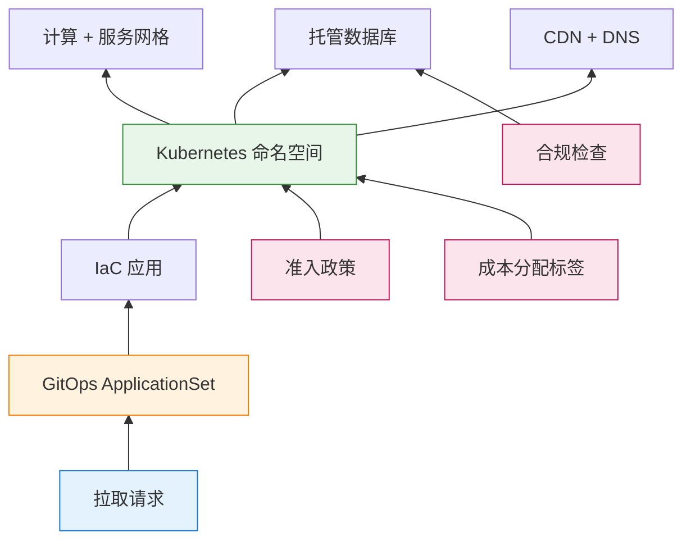

技术治理处于一个令人不安的交叉点。一方面：风险管理者要求控制、审计和审批关卡。另一方面：工程团队推动速度、自助服务和快速迭代。几十年来，这些力量相互对抗——治理意味着减速，而速度意味着偷工减料。

但情况已经改变。

实现随需环境的相同 GitOps 工作流，也提供了合规团队渴望的审计轨迹。基础设施即代码将政策执行从手动检查清单转变为自动化关卡。曾经在治理与速度之间的权衡取舍，正成为一个错误的二分法。

本文探讨技术治理如何从传统风险框架演变为现代代码强制执行方法——以及为什么理解这两种观点对于构建既合规又具竞争力的系统至关重要。

## 治理挑战

每个组织都面临同一个根本问题：**我们如何在管理风险的同时促进创新？**

技术决策带来的后果远超工程范畴：

!!!anote "💥 治理失效模式"
    **控制过度**
    - 简单变更需要数周的审批流程
    - 创新停滞而竞争对手持续交付
    - 工程师规避官方渠道（"影子 IT"）
    - 治理变成形式主义——只有检查清单没有实质内容

    **控制不足**
    - 安全漏洞流入生产环境
    - 合规违规引发罚款和诉讼
    - 未管理的云资源导致成本超支
    - 事故连锁反应因为无人负责决策

    **控制不一致**
    - 团队任意应用不同标准
    - 关键风险从组织缝隙中滑落
    - 审计发现揭示系统性缺口
    - 领导层无法评估实际风险暴露

有效的治理找到平衡点——足够的控制来管理重大风险，足够的灵活性来实现业务目标。挑战在于定义"足够"。

## 传统治理：风险管理框架

在 GitOps 和基础设施即代码出现之前，治理意味着框架、政策和委员会。这些方法仍然相关——它们定义了*什么*需要治理，即使现代工具改变了*如何*执行治理。

### 风险处理的四 T 原则

传统风险管理为治理决策提供了词汇。当识别出风险时，组织从四种处理策略中选择：

!!!anote "💸 转移 (Transfer)：转移负担"
    将财务后果转移给另一方，同时保留运营责任。

**方法**：网络保险政策、外包给托管服务提供商、云提供商承担基础设施风险、与供应商的合同责任条款。

**示例**：购买涵盖数据泄露通知成本、法律费用和监管罚款的网络保险。保险公司支付费用；您处理事故响应。

**使用时机**：风险影响超出内部能力、需要专业知识，或存在监管要求。

!!!anote "🤝 容忍 (Tolerate)：接受风险"
    承认风险存在，并有意识地决定除了监控外不采取行动。

**理由**：缓解成本超过潜在影响、风险在可接受容忍范围内，或业务利益超过风险。

**示例**：接受低流量内部博客上轻微网站涂鸦的风险。高级 DDoS 防护的成本超过最小业务影响。

**要求**：正式的文件记录接受、高管批准重大风险，以及定期审查风险状态。

!!!anote "🛠️ 处理 (Treat)：降低风险"
    实施控制措施以降低风险发生的可能性或影响。

**方法**：技术控制（防火墙、加密）、流程改进（变更管理）、培训和意识计划、冗余和备份系统。

**示例**：实施多因素身份验证可降低未经授权访问的可能性，即使密码已泄露。

**有效性**：最常见的重大风险策略，允许持续业务运营，需要持续维护。

!!!anote "🚫 终止 (Terminate)：消除风险"
    通过停止创建风险的活动或系统来完全消除风险。

**必要时机**：风险超过组织风险偏好、不存在符合成本效益的控制措施，或潜在影响是灾难性的。

**示例**：停止需要存储您没有专业知识保护的敏感数据的客户面向功能。

**权衡**：消除风险但也消除了活动的业务价值。

这些处理策略无论实施方法如何都保持有效。问题是：**您如何在数百个服务和部署中一致地执行这些决策？**

### 关键治理领域

某些风险领域因其灾难性影响潜力而需要治理关注：

!!!error "❌ 关键领域的治理缺口"
    **变更管理**
    - 未经测试的变更部署到生产环境导致系统故障
    - 配置更新导致安全回退
    - 未记录的变更导致合规违规
    - 回滚失败将中断延长数小时或数天

    **第三方风险**
    - 通过受损供应商进行供应链攻击
    - 访问您系统的供应商发生数据泄露
    - 关键供应商中断导致服务中断
    - 处理您数据的供应商发生合规失败

    **数据安全和隐私**
    - 未保护的数据被大量窃取
    - 监管罚款（GDPR 高达全球营收的 4%）
    - 暴露的个人信息导致身份盗窃
    - 信任破坏导致客户流向竞争对手

    **业务连续性**
    - 没有恢复计划的灾难导致长期中断
    - 缺少或损坏的备份导致永久性数据损失
    - 客户放弃不可靠服务导致业务失败
    - 未能维护所需数据的监管处罚

传统治理通过政策、审批工作流和定期审计来解决这些问题。但政策只有在执行时才有效，而审计只能在损害发生后发现问题。

## 现代治理：代码强制控制

现代治理将政策转换为代码。控制措施嵌入系统本身，而不是希望团队遵循文档。从"信任并验证"到"验证并执行"的转变改变了一切。

### GitOps 作为治理基础设施

GitOps——通过 Git 管理基础设施作为单一事实来源——提供了传统方法无法比拟的治理能力：

!!!info "📋 GitOps 治理能力"
    **审计轨迹**
    每个基础设施变更都追踪在 Git 历史记录中：
    ```bash
    $ git log --oneline environments/production/
    a1b2c3d  feat: 为 API 网关添加 WAF 规则
    e4f5g6h  fix: 将数据库备份保留期更新为 30 天
    i7j8k9l  chore: 将 Kubernetes 版本升级到 1.29
    ```
    合规团队可以像审查代码变更一样审查基础设施变更。回滚只需一个 `git revert`。

    **政策即代码**
    准入控制器在创建资源之前执行政策：
    ```yaml
    # OPA Gatekeeper 政策
    apiVersion: constraints.gatekeeper.sh/v1beta1
    kind: K8sNoPrivilegedContainers
    metadata:
      name: no-privileged-containers
    spec:
      match:
        kinds:
          - apiGroups: [""]
            kinds: ["Pod"]
      parameters:
        privileged: false
    ```
    违规自动被拒绝——不需要手动审查。

    **环境隔离**
    每个环境独立定义，具有明确的边界：
    ```yaml
    namespace: pr-123
    resources:
      cpu_limit: 2
      memory_limit: 4Gi
      network_policy: deny-cross-namespace
    ```
    爆炸半径限制在单个环境内。

    **自动化合规**
    合规检查在每个拉取请求上运行：
    ```yaml
    # GitHub Actions 工作流
    - name: 合规检查
      run: |
        checkov -d environments/production/
        tfsec environments/production/
        # 如果发现违规则失败
    ```
    不合规的变更永远不会到达生产环境。

### 随需环境：实际运作的治理

随需环境 (EoD) 体现了现代治理。每个拉取请求都获得一个隔离的、类似生产的环境，通过 GitOps 工作流自动配置：



**治理效益：**

| 面向 | 传统方法 | GitOps 驱动的 EoD |
|------|---------|------------------|
| **审计轨迹** | 手动文档记录，通常不完整 | 自动 Git 历史记录 |
| **政策执行** | 部署前检查清单 | 准入控制器 |
| **环境隔离** | 共享暂存，手动配置 | 每个 PR 命名空间 |
| **成本治理** | 每月预算审查 | 基于 TTL 的自动清理 |
| **合规审查** | 每季审计 | 每个 PR |

**关键洞察：** 因为每个环境都在 Git 中定义，合规成为正常运作的副产品，而不是单独的负担。

### 分层治理：匹配控制与风险

并非所有变更都应受到相同程度的审查。现代治理启用分层方法：

!!!anote "📊 分层环境治理"
    **第 1 层：轻量级（仅命名空间）**
    - 共享数据库、共享 CDN
    - 配置时间：2-5 分钟
    - 使用案例：错字修正、CSS 调整、快速迭代
    - 治理：仅自动化政策检查

    **第 2 层：标准（完全隔离）**
    - 专用数据库架构、隔离网络
    - 配置时间：10-15 分钟
    - 使用案例：功能开发、集成测试
    - 治理：政策检查 + 敏感变更的安全审查

    **第 3 层：增强（合规关卡）**
    - 完全隔离，具有合规审批关卡
    - 配置时间：15-30 分钟 + 审批时间
    - 使用案例：支付功能、受监管数据、生产变更
    - 治理：政策检查 + 安全审查 + 合规签核

这种分层方法平衡了速度与控制。简单变更快速移动；风险变更获得适当审查。

## 桥接新旧：统一治理模型

最有效的治理模型结合传统风险管理原则与现代执行机制。以下是它们如何对应：

### 风险识别 → 基础设施扫描

传统风险识别依赖访谈、工作坊和检查清单。现代方法直接扫描基础设施：

```yaml
# 传统：年度风险评估工作坊
# 现代：持续基础设施扫描

# 每次提交时的 Checkov 扫描
- name: 基础设施安全扫描
  run: |
    checkov -d terraform/ --framework terraform \
      --check CKV_AWS_1,CKV_AWS_2,CKV_AWS_3...

# 漂移检测
- name: 基础设施漂移检查
  run: |
    terraform plan -out=tfplan
    # 如果检测到手動变更则发出警报
```

### 风险评估 → 自动化风险评分

传统风险评估需要手动评分。现代工具自动计算风险评分：

```yaml
# 基于基础设施配置的风险评分
risk_score = (
  vulnerability_count * severity_weight +
  compliance_violations * compliance_weight +
  exposure_score * exposure_weight
)

# 高风险变更触发额外审查
if risk_score > threshold:
  require_approval("security-team")
  require_approval("compliance-team")
```

### 风险处理 → 政策执行

传统风险处理意味着实施控制并希望它们保持到位。现代方法持续执行：

| 传统控制 | 现代执行 |
|---------|---------|
| "加密静态数据"（政策文档） | S3 存储桶政策拒绝未加密上传 |
| "使用最小权限"（指导方针） | IAM 角色自动限定为最小权限 |
| "审查变更"（流程） | 合并前需要拉取请求审查 |
| "监控访问"（程序） | CloudTrail 日志自动发送到 SIEM |

### 风险监控 → 持续合规

传统监控意味着定期审计和手动报告。现代监控是持续的：

```yaml
# 持续合规仪表板
metrics:
  - policy_violations_by_severity
  - mean_time_to_remediate
  - environments_without_required_tags
  - drift_detection_alerts

alerts:
  - critical_violation_detected → slack-security-channel
  - compliance_score_drops_below_95 → email-compliance-team
  - orphaned_resources_detected → email-platform-team
```

## 重要的治理指标

衡量治理有效性需要推动行动的指标，而不是虚荣数字：

!!!warning "⚠️ 避免虚荣指标"
    **不良指标**（看起来好，没有意义）：
    - "记录的政策数量"——没有执行政策是形式主义
    - "受培训团队的百分比"——没有行为改变的培训是浪费
    - "已关闭的审计发现"——可以通过关闭琐碎发现来操纵

    **良好指标**（推动改进）：
    - 修复关键漏洞的平均时间
    - 因政策违规被阻挡的部署百分比
    - 漂移检测率（手动变更 vs. GitOps 变更）
    - 治理产生的成本差异（自动清理的节省）

### 有效的治理指标

| 指标 | 测量内容 | 目标 |
|------|---------|------|
| **政策违规率** | 变更违反政策的频率 | < 5% 的 PR |
| **平均修复时间** | 违规修复的速度 | 关键问题 < 24 小时 |
| **漂移检测率** | 通过 GitOps 的变更百分比 | > 95% |
| **环境清理率** | 自动销毁的短暂环境百分比 | > 98% |
| **合规评分** | 符合合规的资源百分比 | > 98% |
| **治理开销** | 添加到部署流程的时间 | 标准变更 < 10% |

## 治理的人性面

仅靠技术无法解决治理挑战。人员、流程和文化与工具一样重要。

### 安全意识作为治理基础

当用户绕过技术控制时，它们就会失效。安全意识将用户从最弱环节转变为主动防御层：

!!!anote "🎯 有效的意识计划"
    - 定期培训当前威胁（不是年度勾选框培训）
    - 模拟钓鱼演练，提供建设性反馈
    - 用通俗语言撰写清晰政策（不是法律文件）
    - 简便的可疑事件报告机制
    - 对安全意识行为的正面强化

### 治理与问责

治理确立谁做决策、谁实施控制，以及出问题时谁承担责任：

!!!anote "📋 治理框架组成部分"
    **角色与职责**
    - CISO：整体安全策略和风险监督
    - 风险负责人：对特定风险负责的业务领导者
    - 控制实施者：负责部署控制措施的团队
    - 合规团队：监管要求和审计协调

    **决策权限**
    - 谁可以批准风险例外？
    - 谁可以部署到生产环境？
    - 谁可以访问敏感数据？
    - 争议决策的升级路径

    **问责措施**
    - 绕过治理的后果
    - 对良好治理实践的认可
    - 定期向领导层报告治理状态

## 构建您的治理模型

有效的治理不是一刀切。以下是如何构建适合您组织的模型：

### 步骤 1：评估当前状态

!!!anote "📊 治理评估"
    **盘点现有控制**
    - 存在哪些政策？它们是否被执行？
    - 有哪些工具？它们是否正确配置？
    - 政策与实践之间有哪些差距？

    **识别关键风险**
    - 什么可能一夜之间摧毁业务价值？
    - 什么让领导层夜不能寐？
    - 监管机构关心什么？

    **理解业务目标**
    - 业务需要什么速度？
    - 治理在哪里拖慢了进度？
    - 业务愿意接受哪些风险？

### 步骤 2：定义治理层级

并非所有变更都需要相同程度的审查：

| 层级 | 风险等级 | 治理要求 | 审批时间 |
|------|---------|---------|---------|
| **标准** | 低 | 自动化政策检查 | < 1 小时 |
| **增强** | 中 | 政策检查 + 安全审查 | < 1 天 |
| **关键** | 高 | 政策检查 + 安全 + 合规 + 高管 | < 3 天 |

### 步骤 3：实施执行

从"信任并验证"转向"验证并执行"：

```yaml
# 示例：GitHub Actions 治理工作流
name: 治理关卡

on:
  pull_request:
    paths:
      - 'terraform/**'
      - 'environments/**'

jobs:
  policy-check:
    runs-on: ubuntu-latest
    steps:
      - uses: actions/checkout@v4

      - name: 安全扫描
        run: checkov -d . --framework terraform

      - name: 合规检查
        run: tfsec .

      - name: 成本估算
        run: infracost breakdown --path .

      - name: 风险评估
        run: |
          if contains 高风险资源; then
            require_approval("security-team")
          fi
```

### 步骤 4：测量和改进

治理不是一劳永逸。持续测量有效性并调整：

!!!anote "🔄 持续改进循环"
    1. **测量**：每周追踪治理指标
    2. **审查**：每月分析趋势和事故
    3. **调整**：每季更新政策和控制
    4. **报告**：定期向领导层沟通状态

## 治理的未来

技术治理持续演变。几种趋势正在塑造未来：

### AI 辅助治理

AI 可以增强治理而不取代人类判断：

- **政策生成**：AI 根据行业最佳实践建议政策
- **风险评分**：AI 分析配置以识别隐藏风险
- **异常检测**：AI 发现可能表明治理缺口的异常模式
- **文档记录**：AI 从实际配置生成合规文档

### 平台工程作为治理

平台工程团队构建内部开发者平台，将治理融入开发者体验：

```yaml
# 内建治理的开发者体验
developer:
  wants: "功能测试的新环境"

  clicks: 内部平台中的"创建环境"按钮

  gets:
    - 使用标准政策配置的环境
    - 自动应用合规标签
    - 自动追踪成本分配
    - 配置基于 TTL 的清理
    - 自动在 Git 中创建审计轨迹

  governance_overhead: 零（内建于平台）
```

### 监管演变

法规正在赶上现代开发实践：

- **SOC 2**：现在接受自动化控制和持续监控
- **GDPR**：设计隐私与政策即代码方法一致
- **PCI DSS**：允许自动化合规证据收集
- **ISO 27001**：承认 GitOps 审计轨迹作为证据

## 结论：治理作为推动者

最好的治理感觉不像治理。它感觉像顺畅的运作、清晰的期望，以及在不扼杀创新的情况下管理风险的信心。

传统风险管理框架提供了思考治理的词汇和结构。现代 GitOps 驱动的方法提供了使治理成为现实的执行机制。它们一起使组织能够：

- **快速交付**：自动化控制取代手动审批瓶颈
- **安心入睡**：关键风险被系统化识别和处理
- **通过审计**：合规证据自动生成
- **自信扩展**：治理与组织一起扩展，而不是对抗

问题不再是是否要有治理。问题是：**什么样的治理使您的组织能够蓬勃发展？**

答案在于将永恒的风险管理原则与现代执行机制相结合——创建保护业务价值同时促进创造价值的创新的治理。

---

## 参考资料

- IT 风险管理基础知识改编自 [IT 风险管理：保护业务价值](/zh-CN/2001/04/IT-Risk-Management-Protecting-Business-Value/)
- 随需环境架构来自 [随需环境 (第 1 部分)：架构与实施](/zh-CN/2026/02/Environment-on-Demand-Part1-Architecture/)
