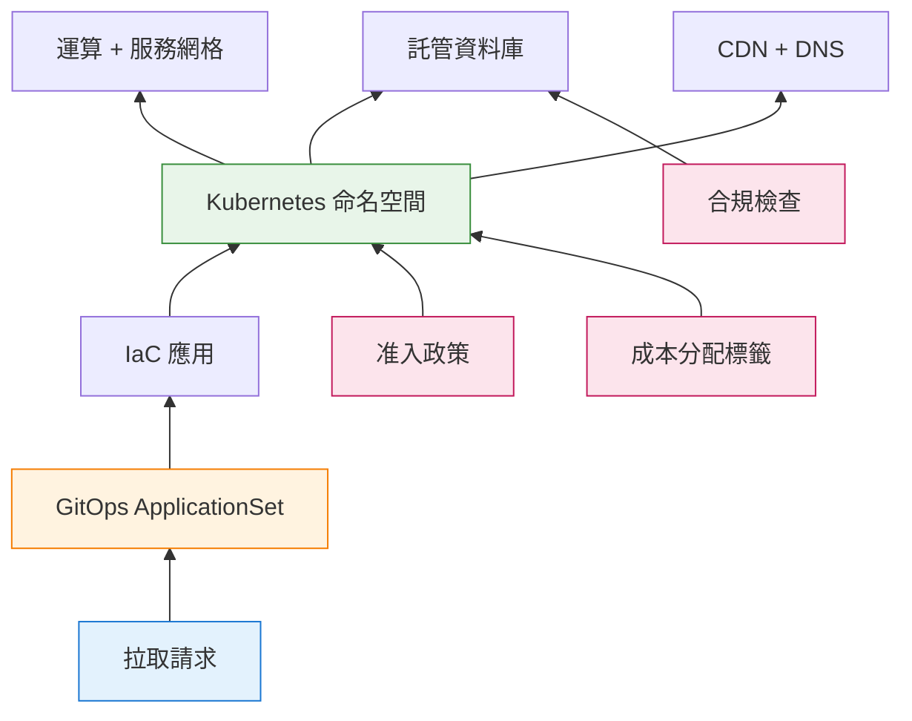

技術治理處於一個令人不安的交叉點。一方面：風險管理者要求控制、稽核和審批關卡。另一方面：工程團隊推動速度、自助服務和快速迭代。幾十年來，這些力量相互對抗——治理意味著減速，而速度意味著偷工減料。

但情況已經改變。

實現隨需環境的相同 GitOps 工作流程，也提供了合規團隊渴望的稽核軌跡。基礎設施即程式碼將政策執行從手動檢查清單轉變為自動化關卡。曾經在治理與速度之間的權衡取捨，正成為一個錯誤的二分法。

本文探討技術治理如何從傳統風險框架演變為現代程式碼強制執行方法——以及為什麼理解這兩種觀點對於建構既合規又具競爭力的系統至關重要。

## 治理挑戰

每個組織都面臨同一個根本問題：**我們如何在管理風險的同時促進創新？**

技術決策帶來的後果遠超工程範疇：

!!!anote "💥 治理失效模式"
    **控制過度**
    - 簡單變更需要數週的審批流程
    - 創新停滯而競爭對手持續交付
    - 工程師規避官方管道（「影子 IT」）
    - 治理變成形式主義——只有檢查清單沒有實質內容

    **控制不足**
    - 安全漏洞流入生產環境
    - 合規違規引發罰款和訴訟
    - 未管理的雲端資源導致成本超支
    - 事故連鎖反應因為無人負責決策

    **控制不一致**
    - 團隊任意應用不同標準
    - 關鍵風險從組織縫隙中滑落
    - 稽核發現揭示系統性缺口
    - 領導層無法評估實際風險暴露

有效的治理找到平衡點——足夠的控制來管理重大風險，足夠的靈活性來實現業務目標。挑戰在於定義「足夠」。

## 傳統治理：風險管理框架

在 GitOps 和基礎設施即程式碼出現之前，治理意味著框架、政策和委員會。這些方法仍然相關——它們定義了*什麼*需要治理，即使現代工具改變了*如何*執行治理。

### 風險處理的四 T 原則

傳統風險管理為治理決策提供了詞彙。當識別出風險時，組織從四種處理策略中選擇：

!!!anote "💸 轉移 (Transfer)：轉移負擔"
    將財務後果轉移給另一方，同時保留營運責任。

**方法**：網路保險政策、外包給託管服務供應商、雲端供應商承擔基礎設施風險、與供應商的合約責任條款。

**範例**：購買涵蓋資料外洩通知成本、法律費用和監管罰款的網路保險。保險公司支付費用；您處理事故應變。

**使用時機**：風險影響超出內部能力、需要專業知識，或存在監管要求。

!!!anote "🤝 容忍 (Tolerate)：接受風險"
    承認風險存在，並有意識地決定除了監控外不採取行動。

**理由**：緩解成本超過潛在影響、風險在可接受容忍範圍內，或業務利益超過風險。

**範例**：接受低流量內部部落格上輕微網站塗鴉的風險。進階 DDoS 防護的成本超過最小業務影響。

**要求**：正式的文件記錄接受、高階主管批准重大風險，以及定期審查風險狀態。

!!!anote "🛠️ 處理 (Treat)：降低風險"
    實施控制措施以降低風險發生的可能性或影響。

**方法**：技術控制（防火牆、加密）、流程改進（變更管理）、培訓和意識計劃、冗餘和備份系統。

**範例**：實施多因素身份驗證可降低未經授權存取的可能性，即使密碼已洩露。

**有效性**：最常見的重大風險策略，允許持續業務營運，需要持續維護。

!!!anote "🚫 終止 (Terminate)：消除風險"
    通過停止創建風險的活動或系統來完全消除風險。

**必要時機**：風險超過組織風險偏好、不存在符合成本效益的控制措施，或潛在影響是災難性的。

**範例**：停止需要儲存您沒有專業知識保護的敏感資料的客戶面向功能。

**權衡**：消除風險但也消除了活動的業務價值。

這些處理策略無論實施方法如何都保持有效。問題是：**您如何在數百個服務和部署中一致地執行這些決策？**

### 關鍵治理領域

某些風險領域因其災難性影響潛力而需要治理關注：

!!!error "❌ 關鍵領域的治理缺口"
    **變更管理**
    - 未經測試的變更部署到生產環境導致系統故障
    - 設定更新導致安全回退
    - 未記錄的變更導致合規違規
    - 回滾失敗將中斷延長數小時或數天

    **第三方風險**
    - 通過受損供應商進行供應鏈攻擊
    - 存取您系統的供應商發生資料外洩
    - 關鍵供應商中斷導致服務中斷
    - 處理您資料的供應商發生合規失敗

    **資料安全和隱私**
    - 未保護的資料被大量竊取
    - 監管罰款（GDPR 高達全球營收的 4%）
    - 暴露的個人資訊導致身份盜竊
    - 信任破壞導致客戶流向競爭對手

    **業務連續性**
    - 沒有恢復計劃的災難導致長期中斷
    - 缺少或損壞的備份導致永久性資料損失
    - 客戶放棄不可靠服務導致業務失敗
    - 未能維護所需資料的監管處罰

傳統治理通過政策、審批工作流程和定期稽核來解決這些問題。但政策只有在執行時才有效，而稽核只能在損害發生後發現問題。

## 現代治理：程式碼強制控制

現代治理將政策轉換為程式碼。控制措施嵌入系統本身，而不是希望團隊遵循文件。從「信任並驗證」到「驗證並執行」的轉變改變了一切。

### GitOps 作為治理基礎設施

GitOps——通過 Git 管理基礎設施作為單一事實來源——提供了傳統方法無法比擬的治理能力：

!!!info "📋 GitOps 治理能力"
    **稽核軌跡**
    每個基礎設施變更都追蹤在 Git 歷史記錄中：
    ```bash
    $ git log --oneline environments/production/
    a1b2c3d  feat: 為 API 閘道器新增 WAF 規則
    e4f5g6h  fix: 將資料庫備份保留期更新為 30 天
    i7j8k9l  chore: 將 Kubernetes 版本升級到 1.29
    ```
    合規團隊可以像審查程式碼變更一樣審查基礎設施變更。回滾只需一個 `git revert`。

    **政策即程式碼**
    准入控制器在創建資源之前執行政策：
    ```yaml
    # OPA Gatekeeper 政策
    apiVersion: constraints.gatekeeper.sh/v1beta1
    kind: K8sNoPrivilegedContainers
    metadata:
      name: no-privileged-containers
    spec:
      match:
        kinds:
          - apiGroups: [""]
            kinds: ["Pod"]
      parameters:
        privileged: false
    ```
    違規自動被拒絕——不需要手動審查。

    **環境隔離**
    每個環境獨立定義，具有明確的邊界：
    ```yaml
    namespace: pr-123
    resources:
      cpu_limit: 2
      memory_limit: 4Gi
      network_policy: deny-cross-namespace
    ```
    爆炸半徑限制在單個環境內。

    **自動化合規**
    合規檢查在每個拉取請求上運行：
    ```yaml
    # GitHub Actions 工作流程
    - name: 合規檢查
      run: |
        checkov -d environments/production/
        tfsec environments/production/
        # 如果發現違規則失敗
    ```
    不合規的變更永遠不會到達生產環境。

### 隨需環境：實際運作的治理

隨需環境 (EoD) 體現了現代治理。每個拉取請求都獲得一個隔離的、類似生產的環境，通過 GitOps 工作流程自動配置：



**治理效益：**

| 面向 | 傳統方法 | GitOps 驅動的 EoD |
|------|---------|------------------|
| **稽核軌跡** | 手動文件記錄，通常不完整 | 自動 Git 歷史記錄 |
| **政策執行** | 部署前檢查清單 | 准入控制器 |
| **環境隔離** | 共享暫存，手動設定 | 每個 PR 命名空間 |
| **成本治理** | 每月預算審查 | 基於 TTL 的自動清理 |
| **合規審查** | 每季稽核 | 每個 PR |

**關鍵洞察：** 因為每個環境都在 Git 中定義，合規成為正常運作的副產品，而不是單獨的負擔。

### 分層治理：匹配控制與風險

並非所有變更都應受到相同程度的審查。現代治理啟用分層方法：

!!!anote "📊 分層環境治理"
    **第 1 層：輕量級（僅命名空間）**
    - 共享資料庫、共享 CDN
    - 配置時間：2-5 分鐘
    - 使用案例：錯字修正、CSS 調整、快速迭代
    - 治理：僅自動化政策檢查

    **第 2 層：標準（完全隔離）**
    - 專用資料庫架構、隔離網路
    - 配置時間：10-15 分鐘
    - 使用案例：功能開發、整合測試
    - 治理：政策檢查 + 敏感變更的安全審查

    **第 3 層：增強（合規關卡）**
    - 完全隔離，具有合規審批關卡
    - 配置時間：15-30 分鐘 + 審批時間
    - 使用案例：支付功能、受監管資料、生產變更
    - 治理：政策檢查 + 安全審查 + 合規簽核

這種分層方法平衡了速度與控制。簡單變更快速移動；風險變更獲得適當審查。

## 橋接新舊：統一治理模型

最有效的治理模型結合傳統風險管理原則與現代執行機制。以下是它們如何對應：

### 風險識別 → 基礎設施掃描

傳統風險識別依賴訪談、工作坊和檢查清單。現代方法直接掃描基礎設施：

```yaml
# 傳統：年度風險評估工作坊
# 現代：持續基礎設施掃描

# 每次提交時的 Checkov 掃描
- name: 基礎設施安全掃描
  run: |
    checkov -d terraform/ --framework terraform \
      --check CKV_AWS_1,CKV_AWS_2,CKV_AWS_3...

# 漂移檢測
- name: 基礎設施漂移檢查
  run: |
    terraform plan -out=tfplan
    # 如果檢測到手動變更則發出警報
```

### 風險評估 → 自動化風險評分

傳統風險評估需要手動評分。現代工具自動計算風險評分：

```yaml
# 基於基礎設施配置的風險評分
risk_score = (
  vulnerability_count * severity_weight +
  compliance_violations * compliance_weight +
  exposure_score * exposure_weight
)

# 高風險變更觸發額外審查
if risk_score > threshold:
  require_approval("security-team")
  require_approval("compliance-team")
```

### 風險處理 → 政策執行

傳統風險處理意味著實施控制並希望它們保持到位。現代方法持續執行：

| 傳統控制 | 現代執行 |
|---------|---------|
| 「加密靜態資料」（政策文件） | S3 儲存桶政策拒絕未加密上傳 |
| 「使用最小權限」（指導方針） | IAM 角色自動限定為最小權限 |
| 「審查變更」（流程） | 合併前需要拉取請求審查 |
| 「監控存取」（程序） | CloudTrail 日誌自動發送到 SIEM |

### 風險監控 → 持續合規

傳統監控意味著定期稽核和手動報告。現代監控是持續的：

```yaml
# 持續合規儀表板
metrics:
  - policy_violations_by_severity
  - mean_time_to_remediate
  - environments_without_required_tags
  - drift_detection_alerts

alerts:
  - critical_violation_detected → slack-security-channel
  - compliance_score_drops_below_95 → email-compliance-team
  - orphaned_resources_detected → email-platform-team
```

## 重要的治理指標

衡量治理有效性需要推動行動的指標，而不是虛榮數字：

!!!warning "⚠️ 避免虛榮指標"
    **不良指標**（看起來好，沒有意義）：
    - 「記錄的政策數量」——沒有執行的政策是形式主義
    - 「受培訓團隊的百分比」——沒有行為改變的培訓是浪費
    - 「已關閉的稽核發現」——可以通過關閉瑣碎發現來操縱

    **良好指標**（推動改進）：
    - 修復關鍵漏洞的平均時間
    - 因政策違規被阻擋的部署百分比
    - 漂移檢測率（手動變更 vs. GitOps 變更）
    - 治理產生的成本差異（自動清理的節省）

### 有效的治理指標

| 指標 | 測量內容 | 目標 |
|------|---------|------|
| **政策違規率** | 變更違反政策的頻率 | < 5% 的 PR |
| **平均修復時間** | 違規修復的速度 | 關鍵問題 < 24 小時 |
| **漂移檢測率** | 通過 GitOps 的變更百分比 | > 95% |
| **環境清理率** | 自動銷毀的短暫環境百分比 | > 98% |
| **合規評分** | 符合合規的資源百分比 | > 98% |
| **治理開銷** | 添加到部署流程的時間 | 標準變更 < 10% |

## 治理的人性面

僅靠技術無法解決治理挑戰。人員、流程和文化與工具一樣重要。

### 安全意識作為治理基礎

當用戶繞過技術控制時，它們就會失效。安全意識將用戶從最弱環節轉變為主動防禦層：

!!!anote "🎯 有效的意識計劃"
    - 定期培訓當前威脅（不是年度勾選框培訓）
    - 模擬釣魚演練，提供建設性反饋
    - 用通俗語言撰寫清晰政策（不是法律文件）
    - 簡便的可疑事件報告機制
    - 對安全意識行為的正面強化

### 治理與問責

治理確立誰做決策、誰實施控制，以及出問題時誰承擔責任：

!!!anote "📋 治理框架組成部分"
    **角色與職責**
    - CISO：整體安全策略和風險監督
    - 風險負責人：對特定風險負責的業務領導者
    - 控制實施者：負責部署控制措施的團隊
    - 合規團隊：監管要求和稽核協調

    **決策權限**
    - 誰可以批准風險例外？
    - 誰可以部署到生產環境？
    - 誰可以存取敏感資料？
    - 爭議決策的升級路徑

    **問責措施**
    - 繞過治理的後果
    - 對良好治理實踐的認可
    - 定期向領導層報告治理狀態

## 建構您的治理模型

有效的治理不是一刀切。以下是如何建構適合您組織的模型：

### 步驟 1：評估當前狀態

!!!anote "📊 治理評估"
    **盤點現有控制**
    - 存在哪些政策？它們是否被執行？
    - 有哪些工具？它們是否正確配置？
    - 政策與實踐之間有哪些差距？

    **識別關鍵風險**
    - 什麼可能一夜之間摧毀業務價值？
    - 什麼讓領導層夜不能寐？
    - 監管機構關心什麼？

    **理解業務目標**
    - 業務需要什麼速度？
    - 治理在哪裡拖慢了進度？
    - 業務願意接受哪些風險？

### 步驟 2：定義治理層級

並非所有變更都需要相同程度的審查：

| 層級 | 風險等級 | 治理要求 | 審批時間 |
|------|---------|---------|---------|
| **標準** | 低 | 自動化政策檢查 | < 1 小時 |
| **增強** | 中 | 政策檢查 + 安全審查 | < 1 天 |
| **關鍵** | 高 | 政策檢查 + 安全 + 合規 + 高階主管 | < 3 天 |

### 步驟 3：實施執行

從「信任並驗證」轉向「驗證並執行」：

```yaml
# 範例：GitHub Actions 治理工作流程
name: 治理關卡

on:
  pull_request:
    paths:
      - 'terraform/**'
      - 'environments/**'

jobs:
  policy-check:
    runs-on: ubuntu-latest
    steps:
      - uses: actions/checkout@v4

      - name: 安全掃描
        run: checkov -d . --framework terraform

      - name: 合規檢查
        run: tfsec .

      - name: 成本估算
        run: infracost breakdown --path .

      - name: 風險評估
        run: |
          if contains 高風險資源; then
            require_approval("security-team")
          fi
```

### 步驟 4：測量和改進

治理不是一勞永逸。持續測量有效性並調整：

!!!anote "🔄 持續改進循環"
    1. **測量**：每週追蹤治理指標
    2. **審查**：每月分析趨勢和事故
    3. **調整**：每季更新政策和控制
    4. **報告**：定期向領導層溝通狀態

## 治理的未來

技術治理持續演變。幾種趨勢正在塑造未來：

### AI 輔助治理

AI 可以增強治理而不取代人類判斷：

- **政策生成**：AI 根據行業最佳實踐建議政策
- **風險評分**：AI 分析配置以識別隱藏風險
- **異常檢測**：AI 發現可能表明治理缺口的異常模式
- **文件記錄**：AI 從實際配置生成合規文件

### 平台工程作為治理

平台工程團隊建構內部開發者平台，將治理融入開發者體驗：

```yaml
# 內建治理的開發者體驗
developer:
  wants: "功能測試的新環境"

  clicks: 內部平台中的「創建環境」按鈕

  gets:
    - 使用標準政策配置的環境
    - 自動應用合規標籤
    - 自動追蹤成本分配
    - 配置基於 TTL 的清理
    - 自動在 Git 中創建稽核軌跡

  governance_overhead: 零（內建於平台）
```

### 監管演變

法規正在趕上現代開發實踐：

- **SOC 2**：現在接受自動化控制和持續監控
- **GDPR**：設計隱私與政策即程式碼方法一致
- **PCI DSS**：允許自動化合規證據收集
- **ISO 27001**：承認 GitOps 稽核軌跡作為證據

## 結論：治理作為推動者

最好的治理感覺不像治理。它感覺像順暢的運作、清晰的期望，以及在不扼殺創新的情況下管理風險的信心。

傳統風險管理框架提供了思考治理的詞彙和結構。現代 GitOps 驅動的方法提供了使治理成為現實的執行機制。它們一起使組織能夠：

- **快速交付**：自動化控制取代手動審批瓶頸
- **安心入睡**：關鍵風險被系統化識別和處理
- **通過稽核**：合規證據自動生成
- **自信擴展**：治理與組織一起擴展，而不是對抗

問題不再是是否要有治理。問題是：**什麼樣的治理使您的組織能夠蓬勃發展？**

答案在於將永恆的風險管理原則與現代執行機制相結合——創建保護業務價值同時促進創造價值的創新的治理。

---

## 參考資料

- IT 風險管理基礎知識改編自 [IT 風險管理：保護業務價值](/zh-TW/2001/04/IT-Risk-Management-Protecting-Business-Value/)
- 隨需環境架構來自 [隨需環境 (第 1 部分)：架構與實施](/zh-TW/2026/02/Environment-on-Demand-Part1-Architecture/)
