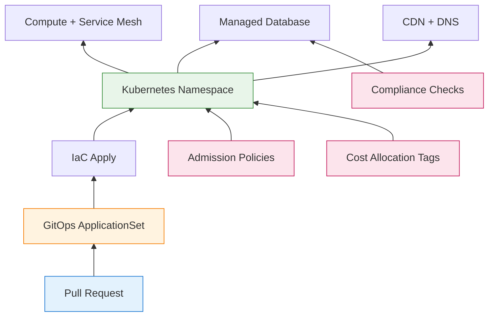

Technology governance sits at an uncomfortable intersection. On one side: risk managers demanding controls, audits, and approval gates. On the other: engineering teams pushing for velocity, self-service, and rapid iteration. For decades, these forces worked against each other—governance meant slowdowns, and speed meant cutting corners.

But something has shifted.

The same GitOps workflows that enable Environment on Demand also provide audit trails compliance teams crave. Infrastructure as Code transforms policy enforcement from manual checklists into automated gates. What was once a trade-off between governance and velocity is becoming a false dichotomy.

This exploration examines how technology governance has evolved from traditional risk frameworks to modern, code-enforced approaches—and why understanding both perspectives is essential for building systems that are both compliant and competitive.

## The Governance Challenge

Every organization faces the same fundamental question: **How do we enable innovation while managing risk?**

Technology decisions carry consequences that extend far beyond engineering:

!!!anote "💥 Governance Failure Modes"
    **Too Much Control**
    - Weeks-long approval processes for simple changes
    - Innovation stalls while competitors ship
    - Engineers circumvent official channels ("shadow IT")
    - Governance becomes theater—checklists without substance

    **Too Little Control**
    - Security vulnerabilities slip into production
    - Compliance violations trigger fines and lawsuits
    - Cost overruns from unmanaged cloud resources
    - Incidents cascade because nobody owns decisions

    **Inconsistent Control**
    - Teams apply different standards arbitrarily
    - Critical risks fall through organizational cracks
    - Audit findings reveal systemic gaps
    - Leadership cannot assess actual risk exposure

Effective governance finds the balance—enough control to manage material risks, enough flexibility to enable business objectives. The challenge lies in defining "enough."

## Traditional Governance: The Risk Management Framework

Before GitOps and Infrastructure as Code, governance meant frameworks, policies, and committees. These approaches remain relevant—they define *what* needs governance, even if modern tools change *how* governance is enforced.

### The Four T's of Risk Treatment

Traditional risk management provides a vocabulary for governance decisions. When a risk is identified, organizations choose from four treatment strategies:

!!!anote "💸 Transfer: Shift the Burden"
    Move financial consequences to another party while retaining operational responsibility.

**Methods**: Cyber insurance policies, outsourcing to managed service providers, cloud providers assuming infrastructure risks, contractual liability clauses with vendors.

**Example**: Purchasing cyber insurance covering breach notification costs, legal fees, and regulatory fines. The insurer pays costs; you handle incident response.

**When to Use**: Risk impact exceeds internal capacity, specialized expertise needed, or regulatory requirements exist.

!!!anote "🤝 Tolerate: Accept the Risk"
    Acknowledge the risk exists and consciously decide not to take action beyond monitoring.

**Justification**: Mitigation cost exceeds potential impact, risk falls within acceptable tolerance, or business benefit outweighs risk.

**Example**: Accepting the risk of minor website defacement on a low-traffic internal blog. The cost of advanced DDoS protection exceeds the minimal business impact.

**Requirements**: Formal documentation of acceptance, executive approval for significant risks, and regular review of risk status.

!!!anote "🛠️ Treat: Reduce the Risk"
    Implement controls to reduce either likelihood or impact of the risk materializing.

**Approaches**: Technical controls (firewalls, encryption), process improvements (change management), training and awareness programs, redundancy and backup systems.

**Example**: Implementing multi-factor authentication reduces the likelihood of unauthorized access even if passwords are compromised.

**Effectiveness**: Most common strategy for significant risks, allows continued business operations, requires ongoing maintenance.

!!!anote "🚫 Terminate (Avoid): Eliminate the Risk"
    Remove the risk entirely by discontinuing the activity or system that creates it.

**When Necessary**: Risk exceeds organizational risk appetite, no cost-effective controls exist, or potential impact is catastrophic.

**Example**: Discontinuing a customer-facing feature that requires storing sensitive data you don't have expertise to protect.

**Trade-off**: Eliminates risk but also eliminates business value from the activity.

These treatment strategies remain valid regardless of implementation approach. The question is: **How do you enforce these decisions consistently across hundreds of services and deployments?**

### Key Governance Areas

Certain risk areas demand governance attention due to their potential for catastrophic impact:

!!!error "❌ Governance Gaps in Key Areas"
    **Change Management**
    - Untested changes deployed to production cause system failures
    - Security regressions from configuration updates
    - Compliance violations from undocumented changes
    - Rollback failures extend outages for hours or days

    **Third-Party Risk**
    - Supply chain attacks through compromised vendors
    - Data breaches at vendors with access to your systems
    - Service disruptions from critical vendor outages
    - Compliance failures from vendors processing your data

    **Data Security and Privacy**
    - Unprotected data stolen in bulk
    - Regulatory fines (GDPR up to 4% of global revenue)
    - Identity theft from exposed personal information
    - Trust destruction driving customers to competitors

    **Business Continuity**
    - Extended outages from disasters without recovery plans
    - Permanent data loss from missing or corrupted backups
    - Business failure as customers abandon unreliable services
    - Regulatory penalties for failing to maintain required data

Traditional governance addresses these through policies, approval workflows, and periodic audits. But policies only work if enforced, and audits only find problems after damage occurs.

## Modern Governance: Code-Enforced Controls

Modern governance transforms policies into code. Instead of hoping teams follow documentation, controls are embedded in the systems themselves. This shift from "trust and verify" to "verify and enforce" changes everything.

### GitOps as Governance Infrastructure

GitOps—managing infrastructure through Git as the single source of truth—provides governance capabilities that traditional approaches cannot match:

!!!info "📋 GitOps Governance Capabilities"
    **Audit Trail**
    Every infrastructure change is tracked in Git history:
    ```bash
    $ git log --oneline environments/production/
    a1b2c3d  feat: Add WAF rules for API gateway
    e4f5g6h  fix: Update database backup retention to 30 days
    i7j8k9l  chore: Bump Kubernetes version to 1.29
    ```
    Compliance teams can review infrastructure changes like code changes. Rollback is a `git revert` away.

    **Policy as Code**
    Admission controllers enforce policies before resources are created:
    ```yaml
    # OPA Gatekeeper policy
    apiVersion: constraints.gatekeeper.sh/v1beta1
    kind: K8sNoPrivilegedContainers
    metadata:
      name: no-privileged-containers
    spec:
      match:
        kinds:
          - apiGroups: [""]
            kinds: ["Pod"]
      parameters:
        privileged: false
    ```
    Violations are rejected automatically—no manual review needed.

    **Environment Isolation**
    Each environment is defined independently with explicit boundaries:
    ```yaml
    namespace: pr-123
    resources:
      cpu_limit: 2
      memory_limit: 4Gi
      network_policy: deny-cross-namespace
    ```
    Blast radius is contained to individual environments.

    **Automated Compliance**
    Compliance checks run on every pull request:
    ```yaml
    # GitHub Actions workflow
    - name: Compliance Check
      run: |
        checkov -d environments/production/
        tfsec environments/production/
        # Fail PR if violations found
    ```
    Non-compliant changes never reach production.

### Environment on Demand: Governance in Action

Environment on Demand (EoD) exemplifies modern governance. Each pull request gets an isolated, production-like environment provisioned automatically through GitOps workflows:



**Governance Benefits:**

| Aspect | Traditional Approach | GitOps-Driven EoD |
|--------|---------------------|-------------------|
| **Audit Trail** | Manual documentation, often incomplete | Automatic Git history |
| **Policy Enforcement** | Pre-deployment checklists | Admission controllers |
| **Environment Isolation** | Shared staging, manual setup | Per-PR namespaces |
| **Cost Governance** | Monthly budget reviews | TTL-based auto-cleanup |
| **Compliance Review** | Quarterly audits | Every PR |

**The Key Insight:** Because every environment is defined in Git, compliance becomes a side effect of normal operations rather than a separate burden.

### Tiered Governance: Matching Controls to Risk

Not all changes deserve the same level of scrutiny. Modern governance enables tiered approaches:

!!!anote "📊 Tiered Environment Governance"
    **Tier 1: Lightweight (Namespace-Only)**
    - Shared database, shared CDN
    - Provisioning time: 2-5 minutes
    - Use case: Typo fixes, CSS tweaks, quick iterations
    - Governance: Automated policy checks only

    **Tier 2: Standard (Full Isolation)**
    - Dedicated database schema, isolated networking
    - Provisioning time: 10-15 minutes
    - Use case: Feature development, integration testing
    - Governance: Policy checks + security review for sensitive changes

    **Tier 3: Enhanced (Compliance-Gated)**
    - Full isolation with compliance approval gates
    - Provisioning time: 15-30 minutes + approval time
    - Use case: Payment features, regulated data, production changes
    - Governance: Policy checks + security review + compliance sign-off

This tiered approach balances velocity with control. Simple changes move fast; risky changes get appropriate scrutiny.

## Bridging Old and New: A Unified Governance Model

The most effective governance models combine traditional risk management principles with modern enforcement mechanisms. Here's how they map together:

### Risk Identification → Infrastructure Scanning

Traditional risk identification relied on interviews, workshops, and checklists. Modern approaches scan infrastructure directly:

```yaml
# Traditional: Annual risk assessment workshop
# Modern: Continuous infrastructure scanning

# Checkov scan on every commit
- name: Infrastructure Security Scan
  run: |
    checkov -d terraform/ --framework terraform \
      --check CKV_AWS_1,CKV_AWS_2,CKV_AWS_3...
    
# Drift detection
- name: Infrastructure Drift Check
  run: |
    terraform plan -out=tfplan
    # Alert if manual changes detected
```

### Risk Assessment → Automated Risk Scoring

Traditional risk assessment required manual scoring. Modern tools calculate risk scores automatically:

```yaml
# Risk scoring based on infrastructure configuration
risk_score = (
  vulnerability_count * severity_weight +
  compliance_violations * compliance_weight +
  exposure_score * exposure_weight
)

# High-risk changes trigger additional review
if risk_score > threshold:
  require_approval("security-team")
  require_approval("compliance-team")
```

### Risk Treatment → Policy Enforcement

Traditional risk treatment meant implementing controls and hoping they stayed in place. Modern approaches enforce continuously:

| Traditional Control | Modern Enforcement |
|--------------------|-------------------|
| "Encrypt data at rest" (policy document) | S3 bucket policies reject unencrypted uploads |
| "Use least privilege" (guideline) | IAM roles automatically scoped to minimum permissions |
| "Review changes" (process) | Pull request reviews required before merge |
| "Monitor access" (procedure) | CloudTrail logs shipped to SIEM automatically |

### Risk Monitoring → Continuous Compliance

Traditional monitoring meant periodic audits and manual reports. Modern monitoring is continuous:

```yaml
# Continuous compliance dashboard
metrics:
  - policy_violations_by_severity
  - mean_time_to_remediate
  - environments_without_required_tags
  - drift_detection_alerts
  
alerts:
  - critical_violation_detected → slack-security-channel
  - compliance_score_drops_below_95 → email-compliance-team
  - orphaned_resources_detected → email-platform-team
```

## Governance Metrics That Matter

Measuring governance effectiveness requires metrics that drive action, not vanity numbers:

!!!warning "⚠️ Avoid Vanity Metrics"
    **Bad Metrics** (look good, mean nothing):
    - "Number of policies documented" — Policies without enforcement are theater
    - "Percentage of teams trained" — Training without behavior change is wasted
    - "Audit findings closed" — Can be gamed by closing trivial findings

    **Good Metrics** (drive improvement):
    - Mean Time to Remediate critical vulnerabilities
    - Percentage of deployments with policy violations blocked
    - Drift detection rate (manual changes vs. GitOps changes)
    - Cost variance from governance (savings from auto-cleanup)

### Effective Governance Metrics

| Metric | What It Measures | Target |
|--------|-----------------|--------|
| **Policy Violation Rate** | How often changes violate policies | < 5% of PRs |
| **Mean Time to Remediate** | How quickly violations are fixed | < 24 hours for critical |
| **Drift Detection Rate** | Percentage of changes through GitOps | > 95% |
| **Environment Cleanup Rate** | Percentage of ephemeral envs auto-destroyed | > 98% |
| **Compliance Score** | Percentage of resources meeting compliance | > 98% |
| **Governance Overhead** | Time added to deployment process | < 10% for standard changes |

## The Human Side of Governance

Technology alone cannot solve governance challenges. People, processes, and culture matter as much as tools.

### Security Awareness as Governance Foundation

Technical controls fail when users bypass them. Security awareness transforms users from the weakest link into an active defense layer:

!!!anote "🎯 Effective Awareness Programs"
    - Regular training on current threats (not annual checkbox training)
    - Simulated phishing exercises with constructive feedback
    - Clear policies in plain language (not legal documents)
    - Easy reporting mechanisms for suspected incidents
    - Positive reinforcement for security-conscious behavior

### Governance and Accountability

Governance establishes who makes decisions, who implements controls, and who bears responsibility when things go wrong:

!!!anote "📋 Governance Framework Components"
    **Roles and Responsibilities**
    - CISO: Overall security strategy and risk oversight
    - Risk Owners: Business leaders accountable for specific risks
    - Control Implementers: Teams responsible for deploying controls
    - Compliance Team: Regulatory requirements and audit coordination

    **Decision-Making Authority**
    - Who can approve risk exceptions?
    - Who can deploy to production?
    - Who can access sensitive data?
    - Escalation paths for disputed decisions

    **Accountability Measures**
    - Consequences for bypassing governance
    - Recognition for good governance practices
    - Regular reporting to leadership on governance status

## Building Your Governance Model

Effective governance is not one-size-fits-all. Here's how to build a model that works for your organization:

### Step 1: Assess Current State

!!!anote "📊 Governance Assessment"
    **Inventory Existing Controls**
    - What policies exist? Are they enforced?
    - What tools are in place? Are they configured correctly?
    - What are the gaps between policy and practice?

    **Identify Critical Risks**
    - What could destroy business value overnight?
    - What keeps leadership awake at night?
    - What do regulators care about?

    **Understand Business Objectives**
    - What velocity does the business need?
    - Where is governance slowing things down?
    - What risks is the business willing to accept?

### Step 2: Define Governance Tiers

Not all changes need the same level of scrutiny:

| Tier | Risk Level | Governance Requirements | Approval Time |
|------|-----------|------------------------|---------------|
| **Standard** | Low | Automated policy checks | < 1 hour |
| **Enhanced** | Medium | Policy checks + security review | < 1 day |
| **Critical** | High | Policy checks + security + compliance + executive | < 3 days |

### Step 3: Implement Enforcement

Move from "trust and verify" to "verify and enforce":

```yaml
# Example: GitHub Actions governance workflow
name: Governance Gate

on:
  pull_request:
    paths:
      - 'terraform/**'
      - 'environments/**'

jobs:
  policy-check:
    runs-on: ubuntu-latest
    steps:
      - uses: actions/checkout@v4
      
      - name: Security Scan
        run: checkov -d . --framework terraform
      
      - name: Compliance Check
        run: tfsec .
      
      - name: Cost Estimate
        run: infracost breakdown --path .
      
      - name: Risk Assessment
        run: |
          if contains高风险资源; then
            require_approval("security-team")
          fi
```

### Step 4: Measure and Improve

Governance is not set-and-forget. Continuously measure effectiveness and adjust:

!!!anote "🔄 Continuous Improvement Cycle"
    1. **Measure**: Track governance metrics weekly
    2. **Review**: Analyze trends and incidents monthly
    3. **Adjust**: Update policies and controls quarterly
    4. **Report**: Communicate status to leadership regularly

## The Future of Governance

Technology governance continues to evolve. Several trends are shaping the future:

### AI-Assisted Governance

AI can augment governance without replacing human judgment:

- **Policy Generation**: AI suggests policies based on industry best practices
- **Risk Scoring**: AI analyzes configurations to identify hidden risks
- **Anomaly Detection**: AI spots unusual patterns that might indicate governance gaps
- **Documentation**: AI generates compliance documentation from actual configurations

### Platform Engineering as Governance

Platform engineering teams build internal developer platforms that bake governance into the developer experience:

```yaml
# Developer experience with baked-in governance
developer:
  wants: "New environment for feature testing"
  
  clicks: "Create Environment" button in internal platform
  
  gets:
    - Environment provisioned with standard policies
    - Compliance tags automatically applied
    - Cost allocation tracked automatically
    - TTL-based cleanup configured
    - Audit trail in Git automatically created
  
  governance_overhead: Zero (baked into platform)
```

### Regulatory Evolution

Regulations are catching up with modern development practices:

- **SOC 2**: Now accepts automated controls and continuous monitoring
- **GDPR**: Privacy by design aligns with policy-as-code approaches
- **PCI DSS**: Allows automated compliance evidence collection
- **ISO 27001**: Recognizes GitOps audit trails as evidence

## Conclusion: Governance as an Enabler

The best governance doesn't feel like governance. It feels like smooth operations, clear expectations, and confidence that risks are managed without stifling innovation.

Traditional risk management frameworks provide the vocabulary and structure for thinking about governance. Modern GitOps-driven approaches provide the enforcement mechanisms to make governance real. Together, they enable organizations to:

- **Ship Fast**: Automated controls replace manual approval bottlenecks
- **Sleep Well**: Critical risks are identified and treated systematically
- **Pass Audits**: Compliance evidence is generated automatically
- **Scale Confidently**: Governance scales with the organization, not against it

The question is no longer whether to have governance. The question is: **What kind of governance enables your organization to thrive?**

The answer lies in blending timeless risk management principles with modern enforcement mechanisms—creating governance that protects business value while enabling the innovation that creates it.

---

## References

- IT Risk Management fundamentals adapted from [IT Risk Management: Protecting Business Value](/2001/04/IT-Risk-Management-Protecting-Business-Value/)
- Environment on Demand architecture from [Environment on Demand (Part 1): Architecture & Implementation](/2026/02/Environment-on-Demand-Part1-Architecture/)
