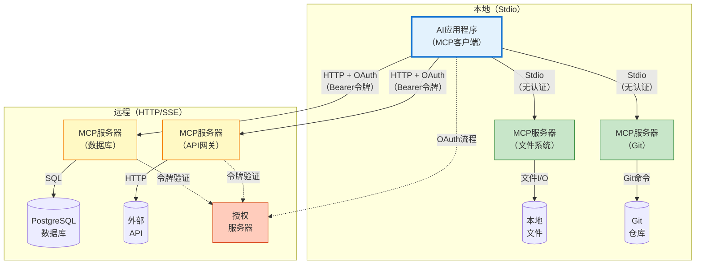
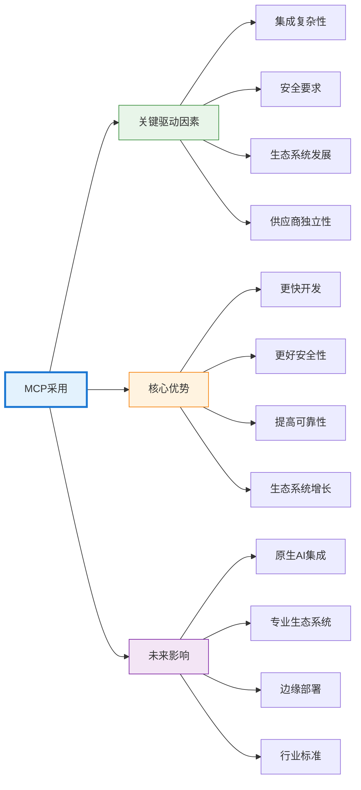

## 引言

人工智能领域正在经历一场根本性转变，改变着语言模型与其训练数据之外世界的交互方式。虽然大型语言模型（LLM）在理解和生成文本方面展现了卓越的能力，但它们的真正潜力在于能够访问外部工具、数据库和API时才得以显现。这就是模型上下文协议（MCP）服务器的用武之地，它为连接AI模型与更广泛的数字生态系统提供了标准化框架。

MCP代表了从孤立AI模型到集成AI系统的范式转变。MCP不是将语言模型视为仅依赖训练数据运行的独立实体，而是使它们能够成为复杂工作流的编排者，访问实时信息、执行操作并与各种系统交互。本文探讨了MCP服务器架构、其采用背后的驱动因素，以及它为AI应用带来的变革性优势。

## 理解MCP：从孤立模型到互联系统

模型上下文协议（MCP）是一个开放标准，定义了AI应用程序如何与外部数据源和工具通信。由Anthropic开发并作为开源规范发布，MCP解决了AI开发中的一个基本挑战：使语言模型能够以标准化、安全和高效的方式访问外部系统并与之交互。

传统AI应用面临重大的集成挑战。每个与数据库、API或工具的连接都需要自定义实现，造成碎片化和维护开销。一个需要访问客户数据库、文件系统和支付API的聊天机器人将需要三个独立的集成实现，每个都有自己的身份验证、错误处理和数据格式化逻辑。随着AI应用变得更加复杂并需要访问数十个或数百个外部资源，这种方法无法扩展。

MCP通过为AI工具集成提供通用协议来解决这个问题。开发人员不需要为每个AI模型和外部资源的组合构建自定义集成，而是实现MCP服务器，通过标准化接口公开资源。然后，任何兼容MCP的AI应用程序都可以连接到这些服务器，无需自定义集成代码即可访问其功能。

!!!anote "🔌 MCP架构"
    MCP遵循客户端-服务器架构，其中：
    - **MCP客户端**是需要访问外部资源的AI应用程序（如Claude Desktop、IDE或自定义应用程序）
    - **MCP服务器**通过标准化协议公开资源（数据库、API、文件系统、工具）
    - **协议**定义客户端如何发现、认证和与服务器功能交互
    
    这种分离实现了模块化：服务器可以独立开发并在不同AI应用程序中重用。

## 驱动因素：MCP为何获得发展势头

MCP的采用是由技术、经济和实践因素的融合驱动的，这些因素使标准化AI集成既必要又有价值。这些驱动因素反映了软件开发向模块化、互操作性和生态系统思维的更广泛趋势。

### 集成复杂性和维护负担

随着AI应用的成熟，它们需要访问越来越多样化的外部资源。现代AI助手可能需要查询数据库、读取文件、调用API、执行代码、搜索网络并与业务系统交互。没有标准化，每个集成都需要自定义开发，随着资源数量的增长，复杂性呈指数级增长。

维护负担随着时间的推移而加剧。API更改、身份验证更新和错误处理改进必须为每个集成单独实现。这会产生技术债务，减慢开发速度并增加错误风险。MCP通过在可重用服务器中集中集成逻辑来解决这个问题。当API更改时，只需更新MCP服务器——所有客户端应用程序都会自动从修复中受益。

### 安全性和访问控制

授予AI模型访问外部系统的权限会引发重大安全问题。传统方法通常涉及在应用程序代码中嵌入凭据或授予过于宽泛的权限。这会产生安全漏洞，并使实施细粒度访问控制变得困难。

!!!warning "🔒 安全考虑"
    MCP服务器充当安全边界，实现：
    - **身份验证**：在授予访问权限之前验证客户端身份
    - **授权**：控制客户端可以访问哪些资源
    - **审计日志**：跟踪所有访问以实现合规性和调试
    - **速率限制**：防止滥用并管理资源消耗
    
    这种集中式安全模型比在多个AI应用程序中分散安全逻辑更加稳健。

### 生态系统发展和可重用性

软件行业长期以来一直认识到可重用组件和生态系统发展的价值。包管理器、API市场和插件系统展示了标准化如何实现社区驱动的创新。MCP将这种模式带到AI集成中。

使用MCP，开发人员可以创建其他人可以立即使用的服务器。一个实现良好的PostgreSQL MCP服务器可以被数千个应用程序部署而无需修改。这种可重用性加速了开发并实现了专业化——特定领域的专家可以创建高质量的MCP服务器，供更广泛的社区利用。

### 供应商独立性和互操作性

随着AI成为业务运营的核心，组织面临供应商锁定的风险。专有集成方法将应用程序绑定到特定AI提供商，使得切换模型或同时使用多个模型变得困难。MCP的开放标准通过将AI应用程序与特定模型提供商解耦来降低这种风险。

使用MCP构建的应用程序可以与Claude、GPT-4或任何其他兼容MCP的模型一起工作，无需更改代码。这种互操作性为组织的AI战略提供了灵活性，并防止对单一供应商的依赖。

## 技术架构：MCP如何工作

理解MCP的技术架构揭示了它如何在保持灵活性的同时实现标准化。该协议定义了几个关键概念，它们共同实现AI工具集成。

### 核心概念

!!!anote "📚 MCP构建块"
    **资源**：AI模型可以读取的数据源（数据库、文件、API）
    
    **工具**：AI模型可以执行的操作（运行查询、创建文件、调用API）
    
    **提示**：服务器可以向客户端提供的可重用提示模板
    
    **采样**：服务器请求AI模型完成的能力（实现智能体工作流）

### 传输机制

MCP支持多种传输机制以适应不同的部署场景。所有消息都使用JSON-RPC 2.0格式和UTF-8编码：

!!!anote "🔌 传输选项"
    **Stdio（标准输入/输出）**
    - 客户端将服务器作为子进程启动
    - 通过stdin/stdout交换消息，以换行符分隔
    - 服务器可以记录到stderr；客户端可以捕获或忽略
    - 无网络开销，最小延迟
    - 适用于开发工具和本地集成
    - 客户端应尽可能支持stdio
    
    **可流式HTTP**
    - 服务器提供支持POST和GET的单个HTTP端点
    - POST发送客户端消息；GET打开SSE流用于服务器消息
    - 服务器可以使用服务器发送事件（SSE）进行流式响应
    - 通过`Mcp-Session-Id`头支持会话管理
    - 通过`Last-Event-ID`头实现流可恢复性
    - 适用于云托管的MCP服务器
    - 需要适当的身份验证和授权
    
    **自定义传输**
    - 实现者可以创建自定义传输
    - 必须保留JSON-RPC消息格式和生命周期
    - 应记录连接和消息交换模式

### 选择正确的传输：决策指南

在stdio和HTTP传输之间进行选择会显著影响部署复杂性、性能和安全性。此决策应与您的用例、基础设施和组织要求保持一致。

!!!tip "🎯 传输选择指南"
    **选择Stdio的情况：**
    - 构建个人生产力工具或IDE集成
    - 使用1-3个快速启动的服务器
    - 隐私至关重要且数据必须保持本地
    - 用户控制自己的环境
    - 服务器依赖项最少（单个二进制文件或简单脚本）
    
    **选择HTTP的情况：**
    - 在团队或组织间共享服务器
    - 管理5个以上服务器（集中部署减少启动开销）
    - 服务器具有复杂依赖项（数据库、云服务）
    - 需要集中监控、日志记录和访问控制
    - 服务器需要大量资源或较长初始化时间

#### Stdio传输：优势和局限性

**优势：**
- **简单设置**：无需网络配置、授权服务器或证书
- **最大隐私**：数据永不离开本地机器；无网络暴露
- **低延迟**：直接进程通信，无网络开销
- **易于调试**：服务器日志在stderr中可见；简单的进程生命周期
- **无基础设施**：无需额外服务即可立即工作

**局限性：**
- **启动开销**：每个服务器作为单独进程启动；10个服务器 = 10次进程启动
- **无法共享**：无法在用户或应用程序之间共享服务器实例
- **依赖项复杂性**：需要Python、Node.js或系统库的服务器需要本地安装
- **资源重复**：多个客户端生成多个服务器实例
- **有限的隐私保证**：服务器仍可进行网络调用；信任取决于服务器实现
- **扩展问题**：应用程序启动速度与服务器数量成正比地减慢

**最适合：**
- 文件系统访问、Git操作、本地代码分析
- 用户无论如何都会安装依赖项的开发工具
- 每个用户需要隔离服务器实例的场景

#### HTTP传输：优势和局限性

**优势：**
- **集中部署**：一个服务器实例服务多个客户端；无每客户端启动成本
- **共享基础设施**：团队访问公共服务器而无需单独设置
- **复杂依赖项**：服务器依赖项在服务器基础设施上安装一次
- **企业功能**：集中日志记录、监控、访问控制和审计跟踪
- **可扩展性**：负载均衡、水平扩展和资源优化
- **更快的客户端启动**：客户端连接到运行中的服务器；无进程启动开销

**局限性：**
- **设置复杂性**：需要OAuth 2.1基础设施、HTTPS证书和授权服务器
- **网络依赖**：需要连接；延迟影响性能
- **安全开销**：需要令牌管理、会话处理和安全监控
- **基础设施成本**：托管、维护和运营开销
- **隐私考虑**：数据通过网络传输；需要信任服务器运营商

**最适合：**
- 数据库访问、云API集成、企业系统连接
- 具有大量依赖项的服务器（ML模型、大型库）
- 需要访问控制的团队共享资源
- 具有监控要求的生产部署

#### 混合方法：结合两种传输

许多组织战略性地使用两种传输：

!!!example "🔄 混合策略"
    **Stdio用于本地操作：**
    - 文件系统访问
    - Git仓库操作
    - 本地代码分析
    - 开发环境工具
    
    **HTTP用于共享资源：**
    - 企业数据库
    - 云服务API
    - 共享知识库
    - 企业系统集成
    
    这种方法根据每个服务器的特性平衡便利性、性能和安全性。

#### 隐私和安全考虑

**Stdio隐私：**
虽然stdio保持通信本地化，但它不保证隐私：
- 服务器仍可进行出站网络连接
- 恶意服务器可能泄露数据
- 信任完全取决于服务器实现
- 审查服务器代码或使用受信任的、经过审计的服务器
- 考虑对不受信任的服务器进行沙箱化或容器化

**HTTP隐私：**
HTTP传输涉及网络传输：
- 数据离开本地机器；加密（HTTPS）在传输中保护
- 服务器运营商可以访问传输的数据
- 审计日志跟踪所有访问以实现合规性
- 基于令牌的授权提供细粒度控制
- 当服务器运营商受信任时适用（您的组织、经过审查的提供商）

#### 实用决策矩阵

| 场景 | 推荐传输 | 理由 |
|------|---------|------|
| 具有本地文件的个人AI助手 | Stdio | 隐私、简单性、无需网络 |
| 使用共享数据库的团队 | HTTP | 集中访问控制、一次部署 |
| 具有15个以上MCP服务器的IDE | 大多数使用HTTP，本地使用stdio | 减少启动时间，共享公共服务器 |
| 具有2-3个服务器的原型 | Stdio | 最快设置，最小开销 |
| 具有合规要求的企业 | HTTP | 审计跟踪、访问控制、监控 |
| 离线应用程序 | Stdio | 无网络依赖 |
| 具有2GB ML模型的服务器 | HTTP | 加载一次，在用户间共享 |
| Git仓库访问 | Stdio | 本地操作，无需网络 |

### 通信协议

MCP使用JSON-RPC 2.0作为其消息格式，提供了一个广为理解和广泛支持的基础。该协议定义了以下消息类型：
- **发现**：客户端查询服务器以了解可用资源和工具
- **调用**：客户端请求工具执行或资源访问
- **流式传输**：服务器可以增量流式传输大型响应
- **错误处理**：标准化错误代码和消息

### 服务器实现

MCP服务器通常是包装现有系统的轻量级进程。数据库MCP服务器可能在内部使用标准数据库驱动程序，同时通过MCP的标准化接口公开数据库操作。这种架构实现了快速服务器开发——大部分复杂性在于底层系统，而不是MCP包装器。

!!!tip "🔧 实现模式"
    **Stdio服务器**
    - 从stdin读取JSON-RPC，写入stdout
    - 消息以换行符分隔（不得包含嵌入的换行符）
    - 由客户端作为子进程启动
    - 简单的进程生命周期：启动、通信、终止
    
    **可流式HTTP服务器**
    - 为POST（客户端消息）和GET（SSE流）提供单个端点
    - 带JSON-RPC请求的POST → 返回SSE流或单个JSON响应
    - 带通知/响应的POST → 返回202 Accepted
    - GET打开SSE流用于服务器发起的消息
    - 通过`Mcp-Session-Id`头管理会话
    - 通过SSE事件ID和`Last-Event-ID`头支持流可恢复性

### 客户端集成

AI应用程序通过实现协议的客户端侧来集成MCP。这通常涉及：
1. 发现可用的MCP服务器（通过配置或注册表）
2. 建立连接并进行身份验证
3. 查询服务器功能
4. 向AI模型展示可用工具
5. 根据模型决策执行工具调用
6. 将结果返回给模型以进行进一步处理

现代AI框架越来越多地直接构建MCP支持，使应用程序开发人员的集成变得无缝。

## 优势：采用MCP的好处

采用MCP在开发效率、系统可靠性和组织敏捷性方面带来了切实的好处。随着生态系统的成熟和更多服务器的出现，这些优势会不断累积。

### 加速开发

MCP大大减少了为AI应用程序添加新功能所需的时间。开发人员可以利用现有的MCP服务器，而不是实现自定义集成。需要数据库访问？安装PostgreSQL MCP服务器。需要文件系统访问？使用文件系统MCP服务器。这种可组合性实现了快速原型设计和更快的上市时间。

!!!tip "⚡ 开发速度"
    传统方法：实现自定义数据库集成需要数天或数周
    
    MCP方法：配置现有MCP服务器只需几分钟
    
    随着应用程序需要访问更多资源，差异变得更加明显——每个额外的集成都会增加时间节省。

### 提高可靠性和可维护性

MCP服务器中的集中式集成逻辑提高了可靠性。当修复错误或对服务器进行改进时，使用该服务器的所有应用程序都会立即受益。这对于安全更新和API更改特别有价值，可以一次性解决，而不是跨多个应用程序解决。

标准化协议还简化了调试。MCP定义良好的消息格式和错误处理使跟踪问题和理解系统行为变得更容易。日志记录和监控可以在协议级别实现，提供所有集成的可见性。

### 增强安全态势

MCP的架构实现了稳健的安全实践。服务器充当安全边界，在集中位置实现身份验证、授权和审计日志。这比在应用程序之间分散安全逻辑更安全，后者更容易出现不一致和漏洞。

!!!warning "🛡️ 安全优势"
    - **凭据管理**：服务器处理凭据，使其远离应用程序代码
    - **细粒度访问控制**：服务器可以实现资源级权限
    - **审计跟踪**：记录所有访问以实现合规性和取证
    - **速率限制**：防止滥用并管理资源消耗
    - **沙箱**：服务器可以限制AI模型可以执行的操作

### 生态系统增长和创新

随着MCP采用的增长，服务器市场应运而生。开发人员为特定用例创建专门的服务器——行业特定的API、专有数据源、自定义工具。这种生态系统效应加速了创新，因为开发人员在彼此的工作基础上构建，而不是重新实现常见功能。

MCP的开源性质鼓励社区贡献。流行的服务器从多个贡献者那里获得改进，提高质量并比任何单个组织更快地添加功能。

### 灵活性和面向未来

MCP的标准化为AI模型选择提供了灵活性。组织可以尝试不同的模型，为不同任务使用多个模型，或随着格局的演变切换提供商——所有这些都无需重写集成代码。随着AI能力的进步和新模型的出现，这种灵活性变得越来越有价值。

协议的可扩展性确保它可以随着AI能力的发展而演进。随着模型获得新能力或出现集成模式，MCP可以在保持向后兼容性的同时进行扩展。

## 实际应用和用例

MCP的多功能性使其能够在各个行业和用例中实现多样化应用。检查具体示例说明了协议如何转化为实际价值。

### 企业数据访问

组织在数据库、数据仓库和业务系统中拥有大量数据。MCP使AI应用程序能够安全高效地查询这些数据。AI助手可以通过查询销售数据库、客户关系管理系统和分析平台来回答问题——所有这些都通过标准化的MCP服务器。

!!!example "💼 企业场景"
    商业智能AI助手使用MCP服务器：
    - 查询PostgreSQL获取销售数据
    - 通过API MCP服务器访问Salesforce
    - 从文件系统MCP服务器读取财务报告
    - 通过数据仓库MCP服务器执行分析查询
    
    助手综合这些来源的信息来回答复杂的业务问题，无需自定义集成代码。

### 开发工具和IDE

现代开发环境越来越多地整合AI辅助。MCP使这些工具能够通过统一接口访问代码库、版本控制系统、文档和构建工具。AI编码助手可以读取源文件、执行测试、查询git历史记录和访问API文档——所有这些都通过MCP服务器。

这种集成将AI从代码补全工具转变为理解项目上下文并可以执行复杂开发任务的综合开发伙伴。

### 内容管理和知识系统

组织在wiki、文档系统和内容管理平台上维护知识。MCP服务器可以向AI应用程序公开此内容，实现智能搜索、摘要和问答。AI可以遍历文档层次结构，跟踪交叉引用，并综合来自多个来源的信息。

### 自动化和工作流编排

MCP使AI模型能够通过访问多个系统来编排复杂的工作流。AI智能体可以读取电子邮件、查询数据库、更新项目管理工具和发送通知——所有这些都通过MCP服务器。这将AI从被动助手转变为业务流程的主动参与者。

!!!tip "🤖 智能体AI"
    MCP的工具执行能力对于自主追求目标的智能体AI系统特别强大。标准化接口使智能体能够动态发现和使用工具，根据可用功能调整其方法。

## 挑战和考虑因素

虽然MCP提供了显著的好处，但采用涉及组织必须解决的挑战。理解这些考虑因素可以实现更有效的实施策略。

### 标准化与灵活性的权衡

标准化本质上涉及权衡。MCP定义了适用于许多用例的通用模式，但特定场景可能需要超出标准的功能。服务器必须在遵守协议和支持特定领域需求之间取得平衡。

!!!warning "⚖️ 设计决策"
    过于严格：协议无法适应合法用例
    
    过于灵活：失去标准化的互操作性优势
    
    MCP通过可扩展性机制解决这个问题，但服务器开发人员必须仔细考虑何时使用标准模式与自定义扩展。

### 安全性和授权

MCP的安全模型根据传输机制的不同而有很大差异，反映了本地与远程部署的不同信任边界和威胁模型。

#### Stdio传输安全

对于作为本地进程运行的基于stdio的服务器，安全性依赖于操作系统权限和基于环境的凭据：

!!!anote "🔐 本地安全模型"
    - **进程隔离**：服务器以与客户端相同的权限运行
    - **环境凭据**：通过环境变量进行身份验证
    - **无网络暴露**：通信保持在本地机器内
    - **操作系统级访问控制**：应用文件系统和进程权限
    
    此模型适用于用户信任本地安装软件的开发工具和个人生产力应用程序。

#### 可流式HTTP传输授权

使用可流式HTTP的远程MCP服务器需要强大的授权来保护资源免受未经授权的访问。MCP实现基于OAuth 2.1的授权：

!!!warning "🔒 OAuth 2.1授权流程"
    **授权服务器发现**
    1. 客户端尝试在没有令牌的情况下连接
    2. 服务器返回带有`WWW-Authenticate`头的401
    3. 头包含受保护资源元数据URL
    4. 客户端检索元数据以发现授权服务器
    
    **令牌获取**
    1. 客户端向授权服务器注册（可选通过动态客户端注册）
    2. 客户端使用PKCE启动OAuth流程以确保安全
    3. 用户通过浏览器授权访问
    4. 客户端接收访问令牌（和可选的刷新令牌）
    
    **经过身份验证的请求**
    - 每个HTTP POST/GET都包括：`Authorization: Bearer <token>`
    - 客户端必须包括`MCP-Protocol-Version`头（例如`2025-06-18`）
    - 服务器验证令牌受众和权限
    - 无效/过期的令牌收到401响应

!!!warning "🛡️ 可流式HTTP安全要求"
    **DNS重绑定保护**
    - 服务器必须验证所有连接上的`Origin`头
    - 本地服务器应仅绑定到localhost（127.0.0.1）
    - 防止远程网站访问本地MCP服务器
    
    **会话管理**
    - 服务器可以在初始化期间在`Mcp-Session-Id`头中分配会话ID
    - 客户端必须在所有后续请求中包含会话ID
    - 会话过期时服务器响应404；客户端必须重新初始化
    - 客户端应发送HTTP DELETE以显式终止会话

#### 关键安全要求

!!!warning "⚠️ 令牌安全"
    **受众绑定（RFC 8707）**
    - 客户端必须包括指定目标MCP服务器规范URI的`resource`参数
    - 示例：`resource=https://mcp.example.com`
    - 服务器必须验证令牌是专门为它们颁发的
    - 防止令牌在不同服务之间重用
    
    **令牌传递禁止**
    - MCP服务器不得将客户端令牌转发到上游API
    - 每个服务边界都需要单独的令牌获取
    - 防止混淆代理漏洞
    
    **PKCE要求**
    - 所有授权流程必须使用PKCE（代码交换证明密钥）
    - 防止授权代码拦截
    - 即使对于机密客户端也是必需的
    
    **HTTPS要求**
    - 所有授权服务器端点必须使用HTTPS
    - 重定向URI必须是localhost或HTTPS
    - 根据OAuth 2.1确保通信安全

#### 组织安全策略

除了协议级安全性之外，组织还需要围绕以下方面制定明确的策略：
- 批准使用哪些MCP服务器
- 不同AI应用程序应具有什么访问级别
- 如何审计和监控MCP服务器使用情况
- 如何响应涉及MCP集成的安全事件
- 令牌生命周期和轮换策略

### 性能和可扩展性

MCP引入了额外的网络跳数和协议开销。对于高吞吐量场景，这种开销可能会影响性能。组织必须考虑：
- 缓存策略以减少冗余服务器调用
- 连接池和重用
- 跨多个服务器实例的负载均衡
- 服务器性能的监控和优化

!!!anote "📊 性能考虑"
    **Stdio传输**
    - 最小开销：直接进程通信
    - 除JSON-RPC外无网络延迟或序列化
    - 每个服务器进程限于单个客户端
    
    **可流式HTTP传输**
    - 适用网络延迟和HTTP开销
    - SSE流式传输减少了多个服务器消息的开销
    - 流可恢复性防止断开连接时的消息丢失
    - 每个客户端支持多个并发SSE流
    - 会话管理增加了状态跟踪开销
    
    与底层操作（数据库查询、API调用）相比，协议开销通常可以忽略不计，但高频场景可能需要优化。

### 生态系统成熟度

作为一个新兴标准，MCP的生态系统仍在发展中。虽然常见用例的核心服务器存在，但专业领域可能缺乏现成的服务器。组织可能需要开发自定义服务器，减少标准化的直接好处。

然而，随着生态系统的成熟和更多服务器的出现，这一挑战会随着时间的推移而减少。早期采用者为生态系统增长做出贡献，使更广泛的社区受益。

## 未来方向：MCP的演进

MCP生态系统正在快速发展，几个趋势正在塑造其未来发展。理解这些方向有助于组织为AI集成的下一阶段做好准备。

### 扩展的协议能力

MCP规范继续演进，添加能够实现更复杂集成的功能。未来版本可能包括：

- **双向流式传输**：增强服务器和客户端之间的实时数据流
- **事务支持**：跨多个服务器的协调操作
- **事件订阅**：服务器可以主动向客户端推送更新
- **增强授权**：更细粒度的权限模型和基于范围的访问控制
- **令牌刷新机制**：改进对长期会话的处理

### 专业服务器生态系统

随着MCP的成熟，围绕特定领域出现了专业服务器生态系统：

!!!tip "🌐 新兴生态系统"
    - **企业系统**：SAP、Oracle、Microsoft Dynamics的服务器
    - **云平台**：AWS、Azure、Google Cloud中的原生MCP支持
    - **开发工具**：Git、CI/CD、问题跟踪、代码分析
    - **行业特定**：医疗保健系统、金融平台、物联网设备

这些专业生态系统通过为常见系统提供现成的集成，加速了特定垂直领域的采用。

### AI模型原生集成

AI模型提供商越来越多地将MCP支持直接构建到其平台中。这种原生集成简化了采用并实现了更复杂的用例。模型可以自动发现可用工具，推理使用哪些工具，并执行复杂的多步骤工作流。

### 标准化和治理

随着MCP采用的增长，可能会出现正式的标准化工作。行业联盟或标准机构可以接管协议的管理，确保广泛的投入和长期稳定性。这种治理将为企业采用提供信心，并鼓励对生态系统的投资。

### 混合和边缘部署

MCP的灵活性使其能够在不同环境中部署。未来的发展可能集中在：
- **边缘计算**：在边缘设备上运行的MCP服务器以实现低延迟访问
- **混合架构**：云和本地服务器之间的无缝集成
- **离线功能**：可以在没有持续连接的情况下运行的服务器

## 结论

模型上下文协议代表了AI应用程序与外部系统交互方式的根本转变。通过为AI工具集成提供标准化框架，MCP解决了开发复杂性、安全性和生态系统增长方面的关键挑战。该协议的架构——平衡标准化与灵活性——在保持互操作性的同时实现了多样化的用例。

MCP采用背后的驱动因素反映了软件开发向模块化、可重用性和生态系统思维的更广泛趋势。随着集成复杂性的增长和AI成为业务运营的核心，对标准化方法的需求变得越来越迫切。MCP的开源性质和供应商独立性使其成为下一代AI应用程序的基础。

好处是巨大的：加速开发、提高可靠性、增强安全性和生态系统增长。采用MCP的组织在其AI战略中获得了灵活性，避免了供应商锁定，同时访问不断增长的可重用集成库。挑战——标准化权衡、安全考虑和生态系统成熟度——是可管理的，并且随着协议的演进而减少。

展望未来，MCP的演进将由社区贡献、企业采用以及与新兴AI能力的集成来塑造。协议的可扩展性确保它可以适应新需求，同时保持向后兼容性。随着专业服务器生态系统的成熟和AI模型获得原生MCP支持，协议的价值主张得到加强。

更广泛的含义很明确：AI应用程序正在从孤立模型过渡到集成系统。MCP为这一过渡提供了连接组织，使AI能够超越文本生成，成为复杂工作流的积极参与者。这一转变为自动化、决策支持和人机协作开辟了新的可能性。

对于评估AI战略的组织，MCP代表了在优先考虑互操作性、安全性和生态系统增长的基础上构建的机会。早期采用使组织能够从生态系统发展中受益，同时为服务更广泛社区的标准做出贡献。随着AI继续改变行业，高效安全地将模型与现有系统集成的能力成为竞争优势。

AI的未来不仅仅是关于更强大的模型——而是关于能够有效与世界互动的模型。MCP正在构建使这一未来成为可能的桥梁。

## 参考资料和资源

- **MCP规范**：[模型上下文协议文档](https://modelcontextprotocol.io/)

