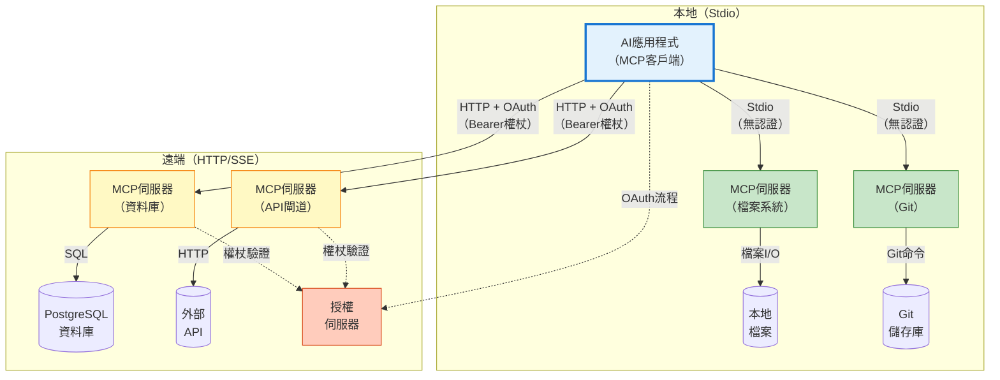
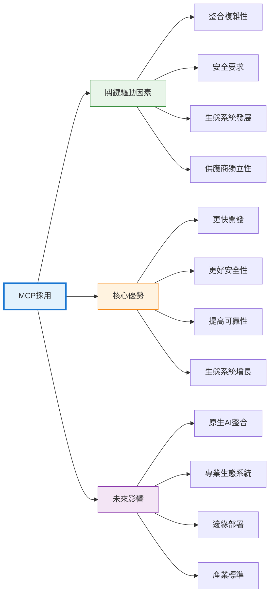

## 引言

人工智慧領域正在經歷一場根本性轉變，改變著語言模型與其訓練資料之外世界的互動方式。雖然大型語言模型（LLM）在理解和生成文字方面展現了卓越的能力，但它們的真正潛力在於能夠存取外部工具、資料庫和API時才得以顯現。這就是模型上下文協定（MCP）伺服器的用武之地，它為連接AI模型與更廣泛的數位生態系統提供了標準化框架。

MCP代表了從孤立AI模型到整合AI系統的範式轉變。MCP不是將語言模型視為僅依賴訓練資料運行的獨立實體，而是使它們能夠成為複雜工作流程的編排者，存取即時資訊、執行操作並與各種系統互動。本文探討了MCP伺服器架構、其採用背後的驅動因素，以及它為AI應用帶來的變革性優勢。

## 理解MCP：從孤立模型到互聯系統

模型上下文協定（MCP）是一個開放標準，定義了AI應用程式如何與外部資料來源和工具通訊。由Anthropic開發並作為開源規範發布，MCP解決了AI開發中的一個基本挑戰：使語言模型能夠以標準化、安全和高效的方式存取外部系統並與之互動。

傳統AI應用面臨重大的整合挑戰。每個與資料庫、API或工具的連接都需要自訂實作，造成碎片化和維護開銷。一個需要存取客戶資料庫、檔案系統和支付API的聊天機器人將需要三個獨立的整合實作，每個都有自己的身分驗證、錯誤處理和資料格式化邏輯。隨著AI應用變得更加複雜並需要存取數十個或數百個外部資源，這種方法無法擴展。

MCP透過為AI工具整合提供通用協定來解決這個問題。開發人員不需要為每個AI模型和外部資源的組合建構自訂整合，而是實作MCP伺服器，透過標準化介面公開資源。然後，任何相容MCP的AI應用程式都可以連接到這些伺服器，無需自訂整合程式碼即可存取其功能。

!!!anote "🔌 MCP架構"
    MCP遵循客戶端-伺服器架構，其中：
    - **MCP客戶端**是需要存取外部資源的AI應用程式（如Claude Desktop、IDE或自訂應用程式）
    - **MCP伺服器**透過標準化協定公開資源（資料庫、API、檔案系統、工具）
    - **協定**定義客戶端如何發現、認證和與伺服器功能互動
    
    這種分離實現了模組化：伺服器可以獨立開發並在不同AI應用程式中重用。

## 驅動因素：MCP為何獲得發展勢頭

MCP的採用是由技術、經濟和實踐因素的融合驅動的，這些因素使標準化AI整合既必要又有價值。這些驅動因素反映了軟體開發向模組化、互通性和生態系統思維的更廣泛趨勢。

### 整合複雜性和維護負擔

隨著AI應用的成熟，它們需要存取越來越多樣化的外部資源。現代AI助手可能需要查詢資料庫、讀取檔案、呼叫API、執行程式碼、搜尋網路並與業務系統互動。沒有標準化，每個整合都需要自訂開發，隨著資源數量的增長，複雜性呈指數級增長。

維護負擔隨著時間的推移而加劇。API更改、身分驗證更新和錯誤處理改進必須為每個整合單獨實作。這會產生技術債務，減慢開發速度並增加錯誤風險。MCP透過在可重用伺服器中集中整合邏輯來解決這個問題。當API更改時，只需更新MCP伺服器——所有客戶端應用程式都會自動從修復中受益。

### 安全性和存取控制

授予AI模型存取外部系統的權限會引發重大安全問題。傳統方法通常涉及在應用程式程式碼中嵌入憑證或授予過於寬泛的權限。這會產生安全漏洞，並使實施細粒度存取控制變得困難。

!!!warning "🔒 安全考量"
    MCP伺服器充當安全邊界，實現：
    - **身分驗證**：在授予存取權限之前驗證客戶端身分
    - **授權**：控制客戶端可以存取哪些資源
    - **稽核日誌**：追蹤所有存取以實現合規性和除錯
    - **速率限制**：防止濫用並管理資源消耗
    
    這種集中式安全模型比在多個AI應用程式中分散安全邏輯更加穩健。

### 生態系統發展和可重用性

軟體產業長期以來一直認識到可重用元件和生態系統發展的價值。套件管理器、API市場和外掛系統展示了標準化如何實現社群驅動的創新。MCP將這種模式帶到AI整合中。

使用MCP，開發人員可以建立其他人可以立即使用的伺服器。一個實作良好的PostgreSQL MCP伺服器可以被數千個應用程式部署而無需修改。這種可重用性加速了開發並實現了專業化——特定領域的專家可以建立高品質的MCP伺服器，供更廣泛的社群利用。

### 供應商獨立性和互通性

隨著AI成為業務營運的核心，組織面臨供應商鎖定的風險。專有整合方法將應用程式綁定到特定AI提供商，使得切換模型或同時使用多個模型變得困難。MCP的開放標準透過將AI應用程式與特定模型提供商解耦來降低這種風險。

使用MCP建構的應用程式可以與Claude、GPT-4或任何其他相容MCP的模型一起工作，無需更改程式碼。這種互通性為組織的AI策略提供了靈活性，並防止對單一供應商的依賴。

## 技術架構：MCP如何運作

理解MCP的技術架構揭示了它如何在保持靈活性的同時實現標準化。該協定定義了幾個關鍵概念，它們共同實現AI工具整合。

### 核心概念

!!!anote "📚 MCP建構區塊"
    **資源**：AI模型可以讀取的資料來源（資料庫、檔案、API）
    
    **工具**：AI模型可以執行的操作（執行查詢、建立檔案、呼叫API）
    
    **提示**：伺服器可以向客戶端提供的可重用提示範本
    
    **採樣**：伺服器請求AI模型完成的能力（實現智能體工作流程）

### 傳輸機制

MCP支援多種傳輸機制以適應不同的部署場景。所有訊息都使用JSON-RPC 2.0格式和UTF-8編碼：

!!!anote "🔌 傳輸選項"
    **Stdio（標準輸入/輸出）**
    - 客戶端將伺服器作為子程序啟動
    - 透過stdin/stdout交換訊息，以換行符號分隔
    - 伺服器可以記錄到stderr；客戶端可以捕獲或忽略
    - 無網路開銷，最小延遲
    - 適用於開發工具和本地整合
    - 客戶端應盡可能支援stdio
    
    **可串流HTTP**
    - 伺服器提供支援POST和GET的單一HTTP端點
    - POST傳送客戶端訊息；GET開啟SSE串流用於伺服器訊息
    - 伺服器可以使用伺服器傳送事件（SSE）進行串流回應
    - 透過`Mcp-Session-Id`標頭支援工作階段管理
    - 透過`Last-Event-ID`標頭實現串流可恢復性
    - 適用於雲端託管的MCP伺服器
    - 需要適當的身分驗證和授權
    
    **自訂傳輸**
    - 實作者可以建立自訂傳輸
    - 必須保留JSON-RPC訊息格式和生命週期
    - 應記錄連接和訊息交換模式

### 選擇正確的傳輸：決策指南

在stdio和HTTP傳輸之間進行選擇會顯著影響部署複雜性、效能和安全性。此決策應與您的用例、基礎設施和組織要求保持一致。

!!!tip "🎯 傳輸選擇指南"
    **選擇Stdio的情況：**
    - 建構個人生產力工具或IDE整合
    - 使用1-3個快速啟動的伺服器
    - 隱私至關重要且資料必須保持本地
    - 使用者控制自己的環境
    - 伺服器依賴項最少（單一二進位檔案或簡單指令碼）
    
    **選擇HTTP的情況：**
    - 在團隊或組織間共享伺服器
    - 管理5個以上伺服器（集中部署減少啟動開銷）
    - 伺服器具有複雜依賴項（資料庫、雲端服務）
    - 需要集中監控、日誌記錄和存取控制
    - 伺服器需要大量資源或較長初始化時間

#### Stdio傳輸：優勢和局限性

**優勢：**
- **簡單設定**：無需網路設定、授權伺服器或憑證
- **最大隱私**：資料永不離開本地機器；無網路暴露
- **低延遲**：直接程序通訊，無網路開銷
- **易於除錯**：伺服器日誌在stderr中可見；簡單的程序生命週期
- **無基礎設施**：無需額外服務即可立即工作

**局限性：**
- **啟動開銷**：每個伺服器作為單獨程序啟動；10個伺服器 = 10次程序啟動
- **無法共享**：無法在使用者或應用程式之間共享伺服器實例
- **依賴項複雜性**：需要Python、Node.js或系統庫的伺服器需要本地安裝
- **資源重複**：多個客戶端生成多個伺服器實例
- **有限的隱私保證**：伺服器仍可進行網路呼叫；信任取決於伺服器實作
- **擴展問題**：應用程式啟動速度與伺服器數量成正比地減慢

**最適合：**
- 檔案系統存取、Git操作、本地程式碼分析
- 使用者無論如何都會安裝依賴項的開發工具
- 每個使用者需要隔離伺服器實例的場景

#### HTTP傳輸：優勢和局限性

**優勢：**
- **集中部署**：一個伺服器實例服務多個客戶端；無每客戶端啟動成本
- **共享基礎設施**：團隊存取公共伺服器而無需單獨設定
- **複雜依賴項**：伺服器依賴項在伺服器基礎設施上安裝一次
- **企業功能**：集中日誌記錄、監控、存取控制和稽核追蹤
- **可擴展性**：負載平衡、水平擴展和資源最佳化
- **更快的客戶端啟動**：客戶端連接到執行中的伺服器；無程序啟動開銷

**局限性：**
- **設定複雜性**：需要OAuth 2.1基礎設施、HTTPS憑證和授權伺服器
- **網路依賴**：需要連接；延遲影響效能
- **安全開銷**：需要權杖管理、工作階段處理和安全監控
- **基礎設施成本**：託管、維護和營運開銷
- **隱私考量**：資料透過網路傳輸；需要信任伺服器營運商

**最適合：**
- 資料庫存取、雲端API整合、企業系統連接
- 具有大量依賴項的伺服器（ML模型、大型庫）
- 需要存取控制的團隊共享資源
- 具有監控要求的生產部署

#### 混合方法：結合兩種傳輸

許多組織戰略性地使用兩種傳輸：

!!!example "🔄 混合策略"
    **Stdio用於本地操作：**
    - 檔案系統存取
    - Git儲存庫操作
    - 本地程式碼分析
    - 開發環境工具
    
    **HTTP用於共享資源：**
    - 企業資料庫
    - 雲端服務API
    - 共享知識庫
    - 企業系統整合
    
    這種方法根據每個伺服器的特性平衡便利性、效能和安全性。

#### 隱私和安全考量

**Stdio隱私：**
雖然stdio保持通訊本地化，但它不保證隱私：
- 伺服器仍可進行出站網路連接
- 惡意伺服器可能洩露資料
- 信任完全取決於伺服器實作
- 審查伺服器程式碼或使用受信任的、經過稽核的伺服器
- 考慮對不受信任的伺服器進行沙箱化或容器化

**HTTP隱私：**
HTTP傳輸涉及網路傳輸：
- 資料離開本地機器；加密（HTTPS）在傳輸中保護
- 伺服器營運商可以存取傳輸的資料
- 稽核日誌追蹤所有存取以實現合規性
- 基於權杖的授權提供細粒度控制
- 當伺服器營運商受信任時適用（您的組織、經過審查的提供商）

#### 實用決策矩陣

| 場景 | 推薦傳輸 | 理由 |
|------|---------|------|
| 具有本地檔案的個人AI助手 | Stdio | 隱私、簡單性、無需網路 |
| 使用共享資料庫的團隊 | HTTP | 集中存取控制、一次部署 |
| 具有15個以上MCP伺服器的IDE | 大多數使用HTTP，本地使用stdio | 減少啟動時間，共享公共伺服器 |
| 具有2-3個伺服器的原型 | Stdio | 最快設定，最小開銷 |
| 具有合規要求的企業 | HTTP | 稽核追蹤、存取控制、監控 |
| 離線應用程式 | Stdio | 無網路依賴 |
| 具有2GB ML模型的伺服器 | HTTP | 載入一次，在使用者間共享 |
| Git儲存庫存取 | Stdio | 本地操作，無需網路 |

### 通訊協定

MCP使用JSON-RPC 2.0作為其訊息格式，提供了一個廣為理解和廣泛支援的基礎。該協定定義了以下訊息類型：
- **發現**：客戶端查詢伺服器以了解可用資源和工具
- **呼叫**：客戶端請求工具執行或資源存取
- **串流傳輸**：伺服器可以增量串流傳輸大型回應
- **錯誤處理**：標準化錯誤代碼和訊息

### 伺服器實作

MCP伺服器通常是包裝現有系統的輕量級程序。資料庫MCP伺服器可能在內部使用標準資料庫驅動程式，同時透過MCP的標準化介面公開資料庫操作。這種架構實現了快速伺服器開發——大部分複雜性在於底層系統，而不是MCP包裝器。

!!!tip "🔧 實作模式"
    **Stdio伺服器**
    - 從stdin讀取JSON-RPC，寫入stdout
    - 訊息以換行符號分隔（不得包含嵌入的換行符號）
    - 由客戶端作為子程序啟動
    - 簡單的程序生命週期：啟動、通訊、終止
    
    **可串流HTTP伺服器**
    - 為POST（客戶端訊息）和GET（SSE串流）提供單一端點
    - 帶JSON-RPC請求的POST → 回傳SSE串流或單一JSON回應
    - 帶通知/回應的POST → 回傳202 Accepted
    - GET開啟SSE串流用於伺服器發起的訊息
    - 透過`Mcp-Session-Id`標頭管理工作階段
    - 透過SSE事件ID和`Last-Event-ID`標頭支援串流可恢復性

### 客戶端整合

AI應用程式透過實作協定的客戶端側來整合MCP。這通常涉及：
1. 發現可用的MCP伺服器（透過設定或註冊表）
2. 建立連接並進行身分驗證
3. 查詢伺服器功能
4. 向AI模型展示可用工具
5. 根據模型決策執行工具呼叫
6. 將結果回傳給模型以進行進一步處理

現代AI框架越來越多地直接建構MCP支援，使應用程式開發人員的整合變得無縫。

## 優勢：採用MCP的好處

採用MCP在開發效率、系統可靠性和組織敏捷性方面帶來了切實的好處。隨著生態系統的成熟和更多伺服器的出現，這些優勢會不斷累積。

### 加速開發

MCP大大減少了為AI應用程式新增新功能所需的時間。開發人員可以利用現有的MCP伺服器，而不是實作自訂整合。需要資料庫存取？安裝PostgreSQL MCP伺服器。需要檔案系統存取？使用檔案系統MCP伺服器。這種可組合性實現了快速原型設計和更快的上市時間。

!!!tip "⚡ 開發速度"
    傳統方法：實作自訂資料庫整合需要數天或數週
    
    MCP方法：設定現有MCP伺服器只需幾分鐘
    
    隨著應用程式需要存取更多資源，差異變得更加明顯——每個額外的整合都會增加時間節省。

### 提高可靠性和可維護性

MCP伺服器中的集中式整合邏輯提高了可靠性。當修復錯誤或對伺服器進行改進時，使用該伺服器的所有應用程式都會立即受益。這對於安全更新和API更改特別有價值，可以一次性解決，而不是跨多個應用程式解決。

標準化協定還簡化了除錯。MCP定義良好的訊息格式和錯誤處理使追蹤問題和理解系統行為變得更容易。日誌記錄和監控可以在協定層級實現，提供所有整合的可見性。

### 增強安全態勢

MCP的架構實現了穩健的安全實踐。伺服器充當安全邊界，在集中位置實現身分驗證、授權和稽核日誌。這比在應用程式之間分散安全邏輯更安全，後者更容易出現不一致和漏洞。

!!!warning "🛡️ 安全優勢"
    - **憑證管理**：伺服器處理憑證，使其遠離應用程式程式碼
    - **細粒度存取控制**：伺服器可以實作資源層級權限
    - **稽核追蹤**：記錄所有存取以實現合規性和鑑識
    - **速率限制**：防止濫用並管理資源消耗
    - **沙箱**：伺服器可以限制AI模型可以執行的操作

### 生態系統增長和創新

隨著MCP採用的增長，伺服器市場應運而生。開發人員為特定用例建立專門的伺服器——產業特定的API、專有資料來源、自訂工具。這種生態系統效應加速了創新，因為開發人員在彼此的工作基礎上建構，而不是重新實作常見功能。

MCP的開源性質鼓勵社群貢獻。流行的伺服器從多個貢獻者那裡獲得改進，提高品質並比任何單一組織更快地新增功能。

### 靈活性和面向未來

MCP的標準化為AI模型選擇提供了靈活性。組織可以嘗試不同的模型，為不同任務使用多個模型，或隨著格局的演變切換提供商——所有這些都無需重寫整合程式碼。隨著AI能力的進步和新模型的出現，這種靈活性變得越來越有價值。

協定的可擴展性確保它可以隨著AI能力的發展而演進。隨著模型獲得新能力或出現整合模式，MCP可以在保持向後相容性的同時進行擴展。

## 實際應用和用例

MCP的多功能性使其能夠在各個產業和用例中實現多樣化應用。檢查具體範例說明了協定如何轉化為實際價值。

### 企業資料存取

組織在資料庫、資料倉儲和業務系統中擁有大量資料。MCP使AI應用程式能夠安全高效地查詢這些資料。AI助手可以透過查詢銷售資料庫、客戶關係管理系統和分析平台來回答問題——所有這些都透過標準化的MCP伺服器。

!!!example "💼 企業場景"
    商業智慧AI助手使用MCP伺服器：
    - 查詢PostgreSQL獲取銷售資料
    - 透過API MCP伺服器存取Salesforce
    - 從檔案系統MCP伺服器讀取財務報告
    - 透過資料倉儲MCP伺服器執行分析查詢
    
    助手綜合這些來源的資訊來回答複雜的業務問題，無需自訂整合程式碼。

### 開發工具和IDE

現代開發環境越來越多地整合AI輔助。MCP使這些工具能夠透過統一介面存取程式碼庫、版本控制系統、文件和建構工具。AI編碼助手可以讀取原始檔案、執行測試、查詢git歷史記錄和存取API文件——所有這些都透過MCP伺服器。

這種整合將AI從程式碼補全工具轉變為理解專案上下文並可以執行複雜開發任務的綜合開發夥伴。

### 內容管理和知識系統

組織在wiki、文件系統和內容管理平台上維護知識。MCP伺服器可以向AI應用程式公開此內容，實現智慧搜尋、摘要和問答。AI可以遍歷文件階層結構，追蹤交叉參照，並綜合來自多個來源的資訊。

### 自動化和工作流程編排

MCP使AI模型能夠透過存取多個系統來編排複雜的工作流程。AI智能體可以讀取電子郵件、查詢資料庫、更新專案管理工具和傳送通知——所有這些都透過MCP伺服器。這將AI從被動助手轉變為業務流程的主動參與者。

!!!tip "🤖 智能體AI"
    MCP的工具執行能力對於自主追求目標的智能體AI系統特別強大。標準化介面使智能體能夠動態發現和使用工具，根據可用功能調整其方法。

## 挑戰和考量因素

雖然MCP提供了顯著的好處，但採用涉及組織必須解決的挑戰。理解這些考量因素可以實現更有效的實施策略。

### 標準化與靈活性的權衡

標準化本質上涉及權衡。MCP定義了適用於許多用例的通用模式，但特定場景可能需要超出標準的功能。伺服器必須在遵守協定和支援特定領域需求之間取得平衡。

!!!warning "⚖️ 設計決策"
    過於嚴格：協定無法適應合法用例
    
    過於靈活：失去標準化的互通性優勢
    
    MCP透過可擴展性機制解決這個問題，但伺服器開發人員必須仔細考慮何時使用標準模式與自訂擴展。

### 安全性和授權

MCP的安全模型根據傳輸機制的不同而有很大差異，反映了本地與遠端部署的不同信任邊界和威脅模型。

#### Stdio傳輸安全

對於作為本地程序執行的基於stdio的伺服器，安全性依賴於作業系統權限和基於環境的憑證：

!!!anote "🔐 本地安全模型"
    - **程序隔離**：伺服器以與客戶端相同的權限執行
    - **環境憑證**：透過環境變數進行身分驗證
    - **無網路暴露**：通訊保持在本地機器內
    - **作業系統層級存取控制**：應用檔案系統和程序權限
    
    此模型適用於使用者信任本地安裝軟體的開發工具和個人生產力應用程式。

#### 可串流HTTP傳輸授權

使用可串流HTTP的遠端MCP伺服器需要強大的授權來保護資源免受未經授權的存取。MCP實作基於OAuth 2.1的授權：

!!!warning "🔒 OAuth 2.1授權流程"
    **授權伺服器發現**
    1. 客戶端嘗試在沒有權杖的情況下連接
    2. 伺服器回傳帶有`WWW-Authenticate`標頭的401
    3. 標頭包含受保護資源中繼資料URL
    4. 客戶端擷取中繼資料以發現授權伺服器
    
    **權杖獲取**
    1. 客戶端向授權伺服器註冊（可選透過動態客戶端註冊）
    2. 客戶端使用PKCE啟動OAuth流程以確保安全
    3. 使用者透過瀏覽器授權存取
    4. 客戶端接收存取權杖（和可選的重新整理權杖）
    
    **經過身分驗證的請求**
    - 每個HTTP POST/GET都包括：`Authorization: Bearer <token>`
    - 客戶端必須包括`MCP-Protocol-Version`標頭（例如`2025-06-18`）
    - 伺服器驗證權杖受眾和權限
    - 無效/過期的權杖收到401回應

!!!warning "🛡️ 可串流HTTP安全要求"
    **DNS重新繫結保護**
    - 伺服器必須驗證所有連接上的`Origin`標頭
    - 本地伺服器應僅繫結到localhost（127.0.0.1）
    - 防止遠端網站存取本地MCP伺服器
    
    **工作階段管理**
    - 伺服器可以在初始化期間在`Mcp-Session-Id`標頭中分配工作階段ID
    - 客戶端必須在所有後續請求中包含工作階段ID
    - 工作階段過期時伺服器回應404；客戶端必須重新初始化
    - 客戶端應傳送HTTP DELETE以明確終止工作階段

#### 關鍵安全要求

!!!warning "⚠️ 權杖安全"
    **受眾繫結（RFC 8707）**
    - 客戶端必須包括指定目標MCP伺服器規範URI的`resource`參數
    - 範例：`resource=https://mcp.example.com`
    - 伺服器必須驗證權杖是專門為它們頒發的
    - 防止權杖在不同服務之間重用
    
    **權杖傳遞禁止**
    - MCP伺服器不得將客戶端權杖轉發到上游API
    - 每個服務邊界都需要單獨的權杖獲取
    - 防止混淆代理漏洞
    
    **PKCE要求**
    - 所有授權流程必須使用PKCE（代碼交換證明金鑰）
    - 防止授權代碼攔截
    - 即使對於機密客戶端也是必需的
    
    **HTTPS要求**
    - 所有授權伺服器端點必須使用HTTPS
    - 重新導向URI必須是localhost或HTTPS
    - 根據OAuth 2.1確保通訊安全

#### 組織安全策略

除了協定層級安全性之外，組織還需要圍繞以下方面制定明確的策略：
- 批准使用哪些MCP伺服器
- 不同AI應用程式應具有什麼存取層級
- 如何稽核和監控MCP伺服器使用情況
- 如何回應涉及MCP整合的安全事件
- 權杖生命週期和輪換策略

### 效能和可擴展性

MCP引入了額外的網路跳數和協定開銷。對於高吞吐量場景，這種開銷可能會影響效能。組織必須考慮：
- 快取策略以減少冗餘伺服器呼叫
- 連接池和重用
- 跨多個伺服器實例的負載平衡
- 伺服器效能的監控和最佳化

!!!anote "📊 效能考量"
    **Stdio傳輸**
    - 最小開銷：直接程序通訊
    - 除JSON-RPC外無網路延遲或序列化
    - 每個伺服器程序限於單一客戶端
    
    **可串流HTTP傳輸**
    - 適用網路延遲和HTTP開銷
    - SSE串流傳輸減少了多個伺服器訊息的開銷
    - 串流可恢復性防止中斷連接時的訊息遺失
    - 每個客戶端支援多個並行SSE串流
    - 工作階段管理增加了狀態追蹤開銷
    
    與底層操作（資料庫查詢、API呼叫）相比，協定開銷通常可以忽略不計，但高頻場景可能需要最佳化。

### 生態系統成熟度

作為一個新興標準，MCP的生態系統仍在發展中。雖然常見用例的核心伺服器存在，但專業領域可能缺乏現成的伺服器。組織可能需要開發自訂伺服器，減少標準化的直接好處。

然而，隨著生態系統的成熟和更多伺服器的出現，這一挑戰會隨著時間的推移而減少。早期採用者為生態系統增長做出貢獻，使更廣泛的社群受益。

## 未來方向：MCP的演進

MCP生態系統正在快速發展，幾個趨勢正在塑造其未來發展。理解這些方向有助於組織為AI整合的下一階段做好準備。

### 擴展的協定能力

MCP規範繼續演進，新增能夠實現更複雜整合的功能。未來版本可能包括：

- **雙向串流傳輸**：增強伺服器和客戶端之間的即時資料流
- **交易支援**：跨多個伺服器的協調操作
- **事件訂閱**：伺服器可以主動向客戶端推送更新
- **增強授權**：更細粒度的權限模型和基於範圍的存取控制
- **權杖重新整理機制**：改進對長期工作階段的處理

### 專業伺服器生態系統

隨著MCP的成熟，圍繞特定領域出現了專業伺服器生態系統：

!!!tip "🌐 新興生態系統"
    - **企業系統**：SAP、Oracle、Microsoft Dynamics的伺服器
    - **雲端平台**：AWS、Azure、Google Cloud中的原生MCP支援
    - **開發工具**：Git、CI/CD、問題追蹤、程式碼分析
    - **產業特定**：醫療保健系統、金融平台、物聯網裝置

這些專業生態系統透過為常見系統提供現成的整合，加速了特定垂直領域的採用。

### AI模型原生整合

AI模型提供商越來越多地將MCP支援直接建構到其平台中。這種原生整合簡化了採用並實現了更複雜的用例。模型可以自動發現可用工具，推理使用哪些工具，並執行複雜的多步驟工作流程。

### 標準化和治理

隨著MCP採用的增長，可能會出現正式的標準化工作。產業聯盟或標準機構可以接管協定的管理，確保廣泛的投入和長期穩定性。這種治理將為企業採用提供信心，並鼓勵對生態系統的投資。

### 混合和邊緣部署

MCP的靈活性使其能夠在不同環境中部署。未來的發展可能集中在：
- **邊緣運算**：在邊緣裝置上執行的MCP伺服器以實現低延遲存取
- **混合架構**：雲端和本地伺服器之間的無縫整合
- **離線功能**：可以在沒有持續連接的情況下運作的伺服器

## 結論

模型上下文協定代表了AI應用程式與外部系統互動方式的根本轉變。透過為AI工具整合提供標準化框架，MCP解決了開發複雜性、安全性和生態系統增長方面的關鍵挑戰。該協定的架構——平衡標準化與靈活性——在保持互通性的同時實現了多樣化的用例。

MCP採用背後的驅動因素反映了軟體開發向模組化、可重用性和生態系統思維的更廣泛趨勢。隨著整合複雜性的增長和AI成為業務營運的核心，對標準化方法的需求變得越來越迫切。MCP的開源性質和供應商獨立性使其成為下一代AI應用程式的基礎。

好處是巨大的：加速開發、提高可靠性、增強安全性和生態系統增長。採用MCP的組織在其AI策略中獲得了靈活性，避免了供應商鎖定，同時存取不斷增長的可重用整合庫。挑戰——標準化權衡、安全考量和生態系統成熟度——是可管理的，並且隨著協定的演進而減少。

展望未來，MCP的演進將由社群貢獻、企業採用以及與新興AI能力的整合來塑造。協定的可擴展性確保它可以適應新需求，同時保持向後相容性。隨著專業伺服器生態系統的成熟和AI模型獲得原生MCP支援，協定的價值主張得到加強。

更廣泛的含義很明確：AI應用程式正在從孤立模型過渡到整合系統。MCP為這一過渡提供了連接組織，使AI能夠超越文字生成，成為複雜工作流程的積極參與者。這一轉變為自動化、決策支援和人機協作開闢了新的可能性。

對於評估AI策略的組織，MCP代表了在優先考慮互通性、安全性和生態系統增長的基礎上建構的機會。早期採用使組織能夠從生態系統發展中受益，同時為服務更廣泛社群的標準做出貢獻。隨著AI繼續改變產業，高效安全地將模型與現有系統整合的能力成為競爭優勢。

AI的未來不僅僅是關於更強大的模型——而是關於能夠有效與世界互動的模型。MCP正在建構使這一未來成為可能的橋樑。

## 參考資料和資源

- **MCP規範**：[模型上下文協定文件](https://modelcontextprotocol.io/)

