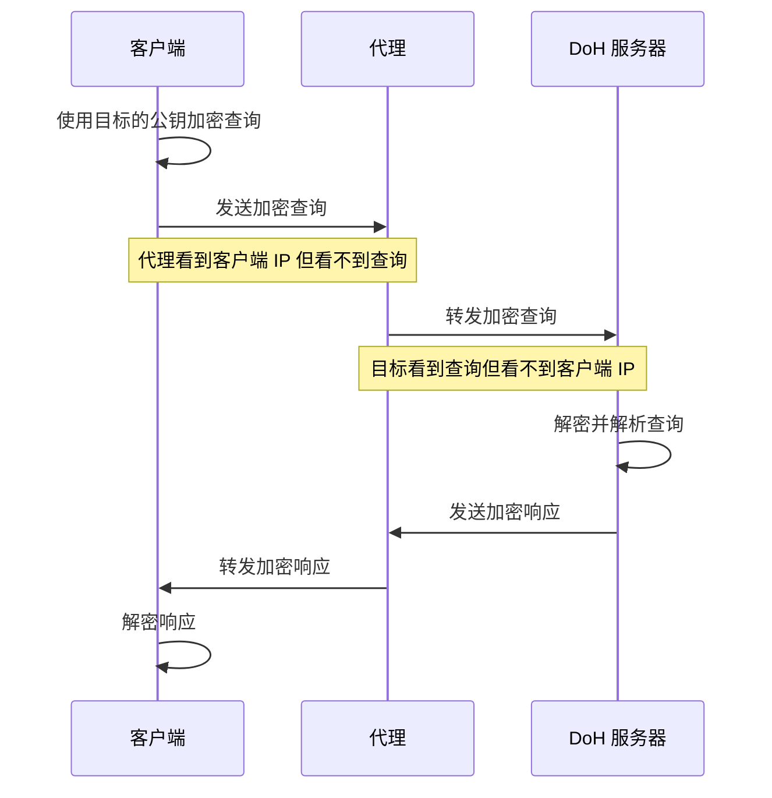
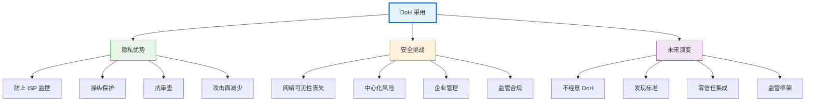

## 引言

每次你在浏览器中输入网站地址时，在任何内容加载之前都会发生一次隐形的对话。你的设备会询问互联网："我在哪里可以找到这个网站？"这个问题及其答案传统上都是以明文形式发送的，任何监控你网络的人都能看到。这就像在乘坐私人出租车之前，在拥挤的房间里大声喊出你的目的地。

DNS over HTTPS (DoH) 从根本上改变了这种动态，它加密这些查询，将它们包装在保护你的密码和信用卡信息的相同安全协议中。最初作为隐私增强功能出现的技术，已经演变成一项有争议的技术，它挑战了数十年的网络管理实践，引发了关于中心化的问题，并迫使我们重新考虑隐私与控制之间的平衡。

本文将探讨 DoH 的工作原理、出现的原因、带来的好处，以及它给互联网生态系统带来的复杂挑战。


## 理解 DNS：互联网的地址簿

在深入了解 DoH 之前，我们需要理解它在保护什么。域名系统（DNS）是互联网的基础协议之一，它将人类可读的域名（如"example.com"）转换为计算机用于通信的 IP 地址（如"93.184.216.34"）。

传统 DNS 通过 UDP 端口 53（或 TCP 用于较大响应）运行，以明文形式发送查询和响应。当你访问网站时，你的设备会向解析器发送 DNS 查询——通常由你的 ISP 或像 Google DNS 或 Cloudflare 这样的公共服务提供。解析器要么返回缓存的答案，要么查询权威 DNS 服务器以找到正确的 IP 地址。

!!!anote "🔍 传统 DNS 流程"
    1. **用户输入 URL**：浏览器需要域名的 IP 地址
    2. **发送查询**：设备向配置的解析器发送 DNS 查询（端口 53，明文）
    3. **解析器搜索**：检查缓存或查询权威服务器
    4. **返回响应**：IP 地址返回给设备（明文）
    5. **建立连接**：浏览器连接到 IP 地址
    
    这个过程的每一步都对网络观察者可见。

### 隐私问题

传统 DNS 缺乏加密会造成几个隐私和安全漏洞：

- **监控**：ISP、政府和网络运营商可以看到你查询的每个域名
- **操纵**：攻击者可以拦截和修改 DNS 响应（DNS 欺骗）
- **审查**：网络运营商可以通过过滤 DNS 查询来阻止访问
- **跟踪**：即使网站使用 HTTPS，DNS 查询也会暴露浏览模式
- **数据泄露**：DNS 查询暴露有关内部网络结构的信息

虽然 HTTPS 加密了你的网页浏览内容，但 DNS 查询仍然可见，造成了重大的隐私缺口。观察者无法看到你在网站上做什么，但他们确切地知道你正在访问哪些网站。


## DNS over HTTPS 的工作原理

DNS over HTTPS 通过将 DNS 查询隧道化到 HTTPS 连接中来解决这些漏洞，这与保护网络流量的加密协议相同。这个看似简单的改变对隐私和网络架构有着深远的影响。

### 技术架构

DoH 将 DNS 查询封装在 HTTPS 请求中，通常使用 HTTP/2 或 HTTP/3 以提高效率。DoH 客户端不是向端口 53 发送查询，而是向 DoH 服务器的端点（通常是端口 443）发送 HTTPS POST 或 GET 请求。

!!!anote "🔐 DoH 请求流程"
    传统 DNS 查询以明文形式发送到端口 53，使它们对网络观察者可见。DoH 查询是加密的 HTTPS 请求到端口 443，将 DNS 查询隐藏在正常网络流量中。

**传统 DNS 查询：**
```
客户端 → DNS 解析器（端口 53，UDP/TCP）
查询："example.com 的 IP 是什么？"
响应："93.184.216.34"（网络可见所有内容）
```

**DoH 查询：**
```
客户端 → DoH 服务器（端口 443，HTTPS）
包含 DNS 查询的加密 POST 请求
包含 IP 地址的加密响应
（网络只能看到加密的 HTTPS 流量）
```

### 协议规范

DoH 在 RFC 8484 中标准化，定义了如何在 HTTP 请求和响应中编码 DNS 查询。该协议支持两种方法：

**POST 方法：**
- DNS 查询编码在请求体中
- Content-Type：`application/dns-message`
- 二进制 DNS 消息格式
- 首选隐私保护（查询不在 URL 中）

**GET 方法：**
- DNS 查询编码在 URL 参数中
- 查询参数：`?dns=<base64url-encoded-query>`
- 可能被 HTTP 中间件缓存
- 适用于简单查询

!!!tip "💡 线路格式兼容性"
    DoH 使用与传统 DNS 相同的二进制 DNS 消息格式，这使得现有 DNS 软件可以通过添加 HTTPS 包装器轻松支持 DoH。DNS 协议本身没有改变——只有传输机制改变了。

### DoH 与 DNS over TLS (DoT) 的对比

DoH 不是唯一的加密 DNS 协议。DNS over TLS (DoT) 在 RFC 7858 中标准化，也加密 DNS 查询，但使用专用端口（853）和直接的 TLS 而不是 HTTPS。

| 特性 | DoH（端口 443） | DoT（端口 853） | 传统 DNS（端口 53） |
|------|----------------|----------------|-------------------|
| **加密** | 是（HTTPS） | 是（TLS） | 否 |
| **端口** | 443（HTTPS） | 853（专用） | 53（UDP/TCP） |
| **可见性** | 看起来像网络流量 | 清楚可识别 | 清楚可识别 |
| **阻止** | 困难（阻止所有 HTTPS） | 容易（阻止端口 853） | 容易（阻止端口 53） |
| **网络控制** | 有限 | 可能 | 完全 |
| **缓存** | 可能 HTTP 缓存 | 无 HTTP 缓存 | 仅 DNS 缓存 |

关键区别：DoH 流量与常规 HTTPS 网络流量无法区分，使得在不阻止所有 HTTPS 的情况下几乎不可能阻止它。DoT 使用专用端口，使其易于识别和控制。


## 驱动因素：DoH 出现的原因

推动加密 DNS 的努力并非凭空发生。几个汇聚的因素创造了对 DoH 采用的需求和动力。

### 隐私担忧和监控

2013 年斯诺登的揭露暴露了大规模监控计划的范围，包括 DNS 查询监控。这引发了科技行业更广泛的隐私运动，导致 HTTPS 的广泛采用。然而，DNS 仍然是一个未加密的弱点，削弱了 HTTPS 带来的隐私收益。

隐私倡导者认为，DNS 查询揭示了有关用户兴趣、健康问题、政治观点和个人关系的敏感信息。即使 HTTPS 保护网站内容，DNS 查询也会创建详细的在线行为地图。

!!!warning "🕵️ 监控能力"
    **DNS 查询揭示的内容：**
    - 医疗状况（健康网站查询）
    - 政治立场（新闻网站、竞选网站）
    - 财务状况（银行网站、投资平台）
    - 个人关系（约会网站、社交网络）
    - 地理位置（本地商业查询）
    - 工作模式（基于时间的查询模式）
    
    这些元数据对于用户画像通常比内容更有价值。

### ISP 行为和货币化

互联网服务提供商越来越多地通过各种方式将 DNS 数据货币化：

- **广告**：在 DNS 错误页面中注入广告
- **跟踪**：向广告商出售 DNS 查询数据
- **重定向**：将失败的查询重定向到带有广告的搜索页面
- **分析**：从浏览模式构建用户画像

这些做法虽然通常在服务条款中披露，但引发了对用户隐私和同意的担忧。DoH 消除了 ISP 对 DNS 查询的可见性，消除了这些货币化机会，并引发了 ISP 的强烈反对。

### 审查和操纵

世界各地的政府和网络运营商使用 DNS 过滤进行审查，通过阻止 DNS 解析来阻止访问网站。虽然一些过滤服务于合法目的（阻止恶意软件、儿童剥削），但它也被用来压制政治异议和控制信息访问。

DNS 操纵攻击（DNS 欺骗、缓存投毒）可以将用户重定向到恶意网站或阻止访问合法资源。这些攻击利用了 DNS 缺乏身份验证和加密的特点。

DoH 使 DNS 过滤和操纵变得更加困难，将控制权从网络运营商转移到 DNS 解析器运营商和应用程序开发人员。

### 浏览器供应商倡议

主要浏览器供应商——特别是 Mozilla 和 Google——将 DoH 作为更广泛隐私倡议的一部分进行推广。Mozilla 在 Firefox 中默认启用了 DoH（2020 年），而 Chrome 添加了用户控制的 DoH 支持。这些决定将 DoH 带给了数亿用户，尽管遭到 ISP 和网络管理员的反对，但仍加速了采用。

浏览器供应商认为，用户默认应该享有隐私，不应该需要技术专业知识来保护他们的 DNS 查询。批评者反驳说，浏览器越权并破坏了网络管理。


## 优势：DoH 采用的理由

DoH 采用带来了切实的隐私和安全优势，尽管它引发了争议，但这些优势证明了其采用的合理性。

### 增强隐私

DoH 的主要优势是防止网络中间人对 DNS 查询的监控。ISP、公共 WiFi 运营商和其他网络观察者无法再看到用户正在查询哪些域名。这种隐私扩展到：

- **家庭网络**：室友和家庭成员无法监控彼此的浏览
- **公共 WiFi**：咖啡店运营商无法跟踪客户浏览
- **企业网络**：雇主对员工浏览的可见性降低（有争议）
- **ISP 监控**：服务提供商无法从 DNS 数据构建画像

!!!tip "🔒 隐私层次"
    **没有 DoH：**
    - ISP 看到：DNS 查询（访问的域名）
    - 网站看到：你的 IP 地址和浏览行为
    
    **有 DoH：**
    - ISP 看到：到 DoH 服务器的加密 HTTPS 流量，然后到目标的加密流量
    - DoH 提供商看到：DNS 查询（信任转移）
    - 网站看到：你的 IP 地址和浏览行为
    
    DoH 不提供完全匿名——它将信任从 ISP 转移到 DoH 提供商。

### 防止操纵

加密 DNS 查询可以防止修改 DNS 响应的中间人攻击。公共 WiFi 网络、受损路由器或恶意 ISP 上的攻击者无法通过 DNS 操纵将用户重定向到钓鱼网站或阻止访问合法资源。

DNSSEC（DNS 安全扩展）提供 DNS 响应的加密身份验证，但采用缓慢且不提供机密性。DoH 通过添加加密来补充 DNSSEC，创建更完整的安全解决方案。

### 规避审查

对于生活在互联网审查国家的用户，DoH 提供了绕过基于 DNS 的阻止的工具。通过使用审查国家以外的 DoH 服务器，用户可以访问被阻止的网站，而无需像 VPN 这样的复杂规避工具。

!!!anote "🌍 抗审查"
    **传统 DNS 阻止：**
    - 政府控制本地 DNS 解析器
    - 阻止对被禁域名的查询
    - 用户看到"找不到域名"错误
    
    **有 DoH：**
    - 用户配置浏览器使用外国 DoH 服务器
    - DNS 查询加密并发送到外部服务器
    - 阻止需要阻止所有 HTTPS（不切实际）
    
    这种能力使 DoH 在互联网控制严格的国家具有政治争议性。

### 改善安全态势

DoH 减少了基于 DNS 的威胁的攻击面：

- **DNS 欺骗**：加密查询无法被拦截和修改
- **缓存投毒**：更难注入虚假 DNS 记录
- **DNS 隧道检测**：加密流量使恶意 DNS 隧道更难检测（双刃剑）
- **凭证盗窃**：防止攻击者重定向登录页面

使用受信任解析器的 DoH 组织可以防止绕过传统安全控制的基于 DNS 的攻击。

### 性能优化

现代 DoH 实现利用 HTTP/2 和 HTTP/3 功能来提高性能：

- **多路复用**：通过单个连接进行多个 DNS 查询
- **连接重用**：减少连接建立的延迟
- **HTTP 缓存**：中间缓存可以存储响应（有隐私考虑）
- **0-RTT**：HTTP/3 为重复查询启用零往返时间


## 挑战和争议

DoH 的优势伴随着重大挑战，使其成为近年来最具争议的互联网协议之一。

### 网络管理和可见性

网络管理员依赖 DNS 可见性来实现合法目的：

- **安全监控**：检测恶意软件通信、数据泄露
- **内容过滤**：阻止恶意网站、执行可接受使用策略
- **故障排除**：诊断网络问题、识别配置错误的系统
- **合规性**：满足内容过滤的监管要求

DoH 通过加密 DNS 查询破坏了这些能力，迫使组织实施替代监控方法或完全阻止 DoH。

!!!warning "⚠️ 企业担忧"
    **DoH 导致的能力丧失：**
    - 基于 DNS 的威胁检测（恶意软件域名、C2 服务器）
    - 家长控制和内容过滤
    - 网络使用分析
    - 遵守数据保留法规
    - DNS 解析问题故障排除
    
    **缓解策略：**
    - 部署带有日志记录的内部 DoH 服务器
    - 使用端点安全代理获得可见性
    - 实施 TLS 检查（有争议）
    - 阻止外部 DoH 服务器（军备竞赛）

### 中心化担忧

传统 DNS 高度分布，由 ISP、组织和公共服务运营的数千个解析器。DoH 采用使 DNS 流量集中在少数大型提供商中：

- **Cloudflare (1.1.1.1)**：最受欢迎的 DoH 提供商之一
- **Google (8.8.8.8)**：庞大的 DoH 用户群
- **Quad9**：注重隐私的替代方案
- **浏览器默认值**：Mozilla 与 Cloudflare 合作，集中流量

这种中心化引发了担忧：

- **单点故障**：中断影响数百万用户
- **监控风险**：集中数据创造有吸引力的监控目标
- **市场力量**：少数提供商控制关键基础设施
- **地缘政治影响**：DNS 流量流经特定司法管辖区

!!!anote "🏛️ 中心化与隐私权衡"
    **分布式 DNS（传统）：**
    - 许多小型运营商（ISP、本地解析器）
    - 查询对本地网络运营商可见
    - 对单一提供商故障具有弹性
    - 更容易在本地监管
    
    **中心化 DoH：**
    - 少数大型提供商
    - 查询对本地网络隐藏但对 DoH 提供商可见
    - 容易受到提供商中断的影响
    - 更难监管（跨境）
    
    两种模型都不明显优越——每种都涉及不同的信任假设。

### 分割视界 DNS 和内部网络

许多组织使用分割视界 DNS，其中内部域名在企业网络上的解析与在公共互联网上的解析不同。像"intranet.company.local"这样的内部资源只能在公司网络上解析。

当客户端使用外部 DoH 服务器时，DoH 会破坏分割视界 DNS。内部域名查询会发送到无法解析它们的公共解析器，从而破坏对内部资源的访问。组织必须：

- **阻止外部 DoH**：防止员工使用公共 DoH 服务器
- **部署内部 DoH**：需要基础设施投资和配置
- **使用发现机制**：实施 DoH 服务器发现协议（仍在成熟中）

### 性能开销

虽然 DoH 可以利用 HTTP 优化，但它也引入了开销：

- **连接建立**：HTTPS 握手为第一个查询增加延迟
- **加密开销**：加密/解密查询的 CPU 成本
- **HTTP 帧**：与原始 DNS 相比的额外字节
- **连接管理**：维护持久连接

对于大量 DNS 用户，这种开销可能是可测量的。然而，连接重用和 HTTP/2 多路复用减轻了大部分影响。

### 法律和监管挑战

DoH 使围绕合法拦截、内容过滤和数据保留的法律框架变得复杂：

- **合法拦截**：执法部门失去对 DNS 查询的可见性
- **内容过滤授权**：要求 ISP 级过滤的国家无法执行
- **数据保留**：要求 DNS 查询日志记录的法规变得更难执行
- **管辖权**：DNS 流量流向不同法律管辖区的提供商

一些国家已经考虑或实施了对 DoH 的限制以维持监管控制。英国的互联网观察基金会表达了对 DoH 破坏儿童保护工作的担忧。


## 实施方法

组织和用户有几种实施 DoH 的选项，每种都有不同的权衡。

### 基于浏览器的 DoH

现代浏览器包含内置的 DoH 支持，允许用户在不进行系统级更改的情况下启用加密 DNS：

**Firefox：**
- 在某些地区默认启用 DoH
- 默认使用 Cloudflare 或 NextDNS
- 用户可以配置自定义 DoH 服务器
- 尊重企业策略以禁用 DoH

**Chrome/Edge：**
- 如果系统 DNS 解析器支持，则启用 DoH
- 在可用时将现有 DNS 升级到 DoH
- 尊重系统 DNS 配置
- 可以通过企业策略禁用

**Safari：**
- 通过系统级配置支持 DoH
- 没有内置的 DoH 服务器默认值
- 需要手动配置或配置文件

!!!tip "🔧 浏览器 DoH 配置"
    **优势：**
    - 用户易于启用
    - 不需要系统级更改
    - 每个浏览器控制
    
    **劣势：**
    - 仅保护浏览器流量
    - 其他应用程序仍使用传统 DNS
    - 可能与网络策略冲突

### 系统级 DoH

操作系统越来越多地在系统级支持 DoH，保护所有应用程序：

**Windows 11：**
- DNS 客户端中的原生 DoH 支持
- 通过设置或注册表配置
- 支持回退到传统 DNS

**macOS：**
- 通过配置文件支持 DoH
- 需要手动设置或 MDM 部署
- 系统范围保护

**Linux：**
- systemd-resolved 支持 DoH
- 各种第三方 DoH 客户端可用
- 需要配置

**Android/iOS：**
- 私有 DNS 设置支持 DoH
- 基于 VPN 的 DoH 应用程序可用
- 每个网络配置可能

### 企业 DoH 部署

部署 DoH 的组织面临独特的要求：

!!!example "🏢 企业 DoH 策略"
    **选项 1：内部 DoH 服务器**
    - 在企业网络内部署 DoH 服务器
    - 维护 DNS 可见性和控制
    - 支持分割视界 DNS
    - 需要基础设施投资
    
    **选项 2：托管 DoH 服务**
    - 使用企业 DoH 提供商（Cisco Umbrella、Cloudflare for Teams）
    - 集中管理和日志记录
    - 维护安全可见性
    - 订阅成本
    
    **选项 3：混合方法**
    - 企业设备的内部 DoH
    - 允许 BYOD 的外部 DoH
    - 基于策略的路由
    - 复杂配置

### DoH 服务器选择标准

选择 DoH 提供商涉及评估几个因素：

| 标准 | 考虑因素 |
|------|---------|
| **隐私政策** | 日志记录实践、数据保留、第三方共享 |
| **性能** | 延迟、可靠性、地理分布 |
| **安全性** | 恶意软件阻止、威胁情报集成 |
| **过滤** | 内容过滤选项（家长控制、恶意软件） |
| **合规性** | 数据驻留、监管合规 |
| **成本** | 免费与付费层级、企业定价 |
| **透明度** | 公开审计、透明度报告 |


## 现实世界的采用和影响

自 2018 年以来，DoH 采用显著增长，对互联网隐私和网络管理产生了可衡量的影响。

### 采用统计

- **Firefox**：2020 年为美国用户默认启用 DoH，扩展到其他地区
- **Chrome**：2020 年 DoH 支持，在可用时自动升级
- **Cloudflare**：每天处理数十亿次 DoH 查询
- **Google Public DNS**：DoH 流量显著增长
- **企业**：采用混合，许多组织阻止外部 DoH

### 案例研究

!!!example "💼 Mozilla 的 DoH 推出"
    **方法：**
    - 从美国开始逐步推出（2020 年）
    - 与 Cloudflare 合作作为默认提供商
    - 受信任递归解析器（TRR）计划用于提供商审查
    - 企业策略覆盖企业网络
    
    **结果：**
    - 数百万用户默认受到保护
    - ISP 和网络运营商的强烈反对
    - 迫使企业 DoH 解决方案的开发
    - 提高了对 DNS 隐私问题的认识

!!!example "🌐 Cloudflare 1.1.1.1"
    **提供：**
    - 免费公共 DoH 解析器
    - 注重隐私（最少日志记录）
    - 高性能（全球任播网络）
    - 恶意软件阻止变体（1.1.1.2）
    
    **影响：**
    - 成为最大的 DoH 提供商之一
    - 展示了注重隐私的 DNS 的可行性
    - 引发了对中心化的担忧
    - 影响其他提供商提供 DoH

### 对网络安全的影响

安全团队报告了对 DoH 的不同体验：

**积极影响：**
- 减少来自外部网络的基于 DNS 的攻击
- 防止 ISP 级操纵
- 改善远程工作者的隐私

**消极影响：**
- 失去基于 DNS 的威胁检测
- 难以执行内容策略
- 安全监控复杂性增加
- 需要替代检测方法

组织通过实施基于端点的安全、TLS 检查（有争议）和带有日志记录的内部 DoH 服务器来适应。


## 未来方向

DoH 继续发展，几个趋势塑造了其未来发展。

### 发现和配置

当前的 DoH 部署需要手动配置或浏览器默认值。新兴标准旨在改善这一点：

- **指定解析器发现（DDR）**：RFC 9462 启用 DoH 服务器的自动发现
- **DHCP/RA 选项**：网络提供的 DoH 服务器配置
- **DNS SVCB 记录**：通过 DNS 本身宣传 DoH 支持
- **加密 ClientHello（ECH）**：通过加密 SNI 补充 DoH

这些机制使 DoH 采用无缝，同时尊重网络策略。

### 不经意 DoH（ODoH）

不经意 DoH（RFC 9230）通过分离查询可见性和 IP 地址可见性来解决 DoH 的信任集中问题：



!!!anote "🔐 ODoH 隐私模型"
    **传统 DoH：**
    - DoH 提供商同时看到你的 IP 地址和查询
    - 单一信任点
    
    **不经意 DoH：**
    - 代理看到你的 IP 但看不到查询（加密）
    - 目标看到查询但看不到你的 IP（来自代理）
    - 需要串通才能链接 IP 和查询
    - 更强的隐私保证

ODoH 仍处于采用早期，但代表了 DNS 隐私的下一个演变。

### 与零信任架构集成

DoH 越来越多地集成到零信任安全模型中：

- **身份感知 DNS**：DoH 查询与用户/设备身份绑定
- **策略执行**：基于用户上下文的 DNS 策略
- **威胁情报**：与 DoH 集成的实时威胁源
- **条件访问**：基于安全态势的 DNS 解析

这种集成在不牺牲隐私的情况下实现安全。

### 监管演变

政府和监管机构正在为加密 DNS 制定框架：

- **合法访问**：执法部门访问 DoH 日志的机制
- **内容过滤**：DoH 提供商实施过滤的要求
- **数据本地化**：DNS 数据留在境内的要求
- **透明度**：DoH 提供商实践的强制报告

这些法规将塑造 DoH 的演变以及哪些提供商在不同司法管辖区运营。

### 性能优化

减少 DoH 开销的持续工作：

- **HTTP/3 采用**：基于 QUIC 的传输减少延迟
- **0-RTT 恢复**：消除重复连接的握手延迟
- **自适应 TTL**：基于查询模式的智能缓存
- **预取**：对可能查询的预测性 DNS 解析


## 结论

DNS over HTTPS 代表了互联网隐私的根本转变，加密了几十年来一直可见的协议。通过将 DNS 查询包装在 HTTPS 中，DoH 防止了网络中间人的监控、操纵和审查。优势是明确的：增强隐私、防止攻击和规避基于 DNS 的阻止。

然而，DoH 的采用一直存在争议，挑战了既定的网络管理实践，并引发了对中心化、企业安全和监管控制的担忧。网络管理员失去了他们依赖的安全监控和故障排除的可见性。DNS 流量集中在少数大型提供商中，造成了新的风险。组织必须调整其安全策略以在没有 DNS 可见性的情况下保持保护。



围绕 DoH 的辩论反映了互联网治理中更广泛的紧张关系：隐私与控制、中心化与分布、用户自主权与网络管理。没有完美的解决方案——每种方法都涉及权衡和不同的信任假设。

对于个人而言，DoH 以最小的努力提供有意义的隐私保护。基于浏览器的 DoH 或系统级配置提供即时好处，特别是在不受信任的网络上。从 ISP 到 DoH 提供商的信任转移通常是有利的，因为 DoH 提供商通常有更强的隐私承诺并面临更多的公众监督。

对于组织而言，DoH 需要仔细考虑。阻止外部 DoH 并部署内部 DoH 服务器可以在提供加密优势的同时保持安全可见性。托管 DoH 服务提供了一个中间地带，提供具有日志记录和过滤等企业功能的加密。关键是调整安全策略以在不仅仅依赖 DNS 可见性的情况下工作。

展望未来，DoH 将继续发展。不经意 DoH 通过分离查询可见性和 IP 地址可见性来解决中心化问题。发现机制将使 DoH 采用无缝，同时尊重网络策略。与零信任架构的集成将在不牺牲隐私的情况下实现安全。监管框架将出现，塑造 DoH 在不同司法管辖区的运作方式。

更广泛的含义是明确的：互联网正在向默认加密迈进。DNS 是最后一个以明文传输的主要协议之一。DoH 弥补了这一差距，将 HTTPS 的隐私保护扩展到互联网命名的基础层。这种转变是不可逆转的——隐私优势太重要了，技术部署太广泛了，无法回滚。

对于那些评估 DoH 的人来说，问题不是是否采用加密 DNS，而是如何以平衡隐私、安全和运营要求的方式这样做。该技术已经成熟，得到广泛支持，并且越来越成为默认。理解其影响并深思熟虑地实施它对于任何管理网络或关心互联网隐私的人来说都是必不可少的。

DNS 的未来是加密的。DoH 正在构建这个未来，一次一个查询。


## 亲自尝试

想看看 DoH 的实际效果吗？试试我们的 [DNS over HTTPS 查询工具](/tools/doh-lookup/)，通过 Cloudflare、Google 或 Quad9 执行加密 DNS 查询。查询多种记录类型，亲身体验隐私优势。

## 参考资料和资源

- **RFC 8484**：DNS Queries over HTTPS (DoH) - [IETF RFC 8484](https://datatracker.ietf.org/doc/html/rfc8484)
- **RFC 7858**：Specification for DNS over Transport Layer Security (DoT) - [IETF RFC 7858](https://datatracker.ietf.org/doc/html/rfc7858)
- **RFC 9230**：Oblivious DNS over HTTPS - [IETF RFC 9230](https://datatracker.ietf.org/doc/html/rfc9230)
- **RFC 9462**：Discovery of Designated Resolvers (DDR) - [IETF RFC 9462](https://datatracker.ietf.org/doc/html/rfc9462)
- **Cloudflare 1.1.1.1**：[https://1.1.1.1/](https://1.1.1.1/)
- **Google Public DNS**：[https://developers.google.com/speed/public-dns](https://developers.google.com/speed/public-dns)
- **Quad9**：[https://www.quad9.net/](https://www.quad9.net/)
- **Mozilla 受信任递归解析器计划**：[https://wiki.mozilla.org/Security/DOH-resolver-policy](https://wiki.mozilla.org/Security/DOH-resolver-policy)
