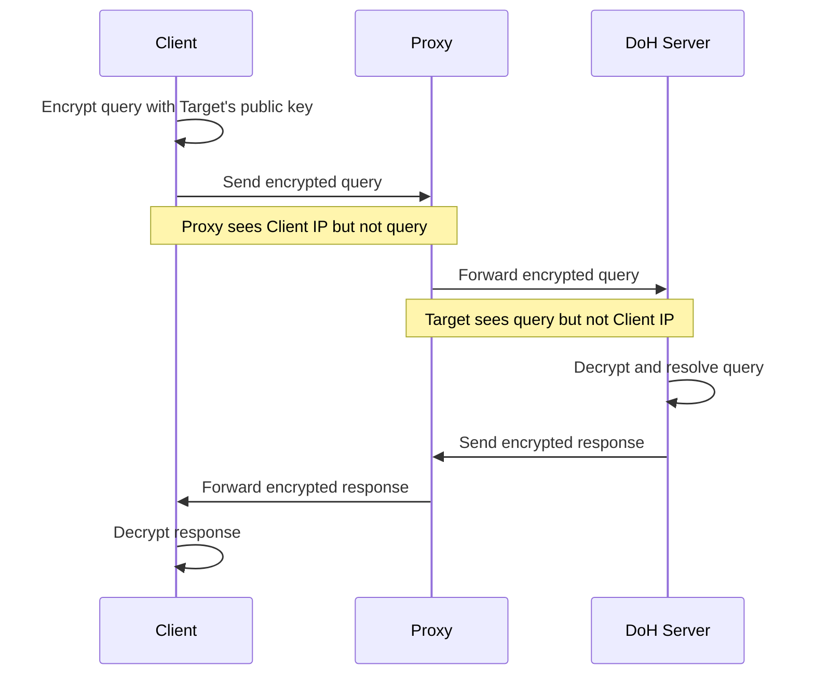
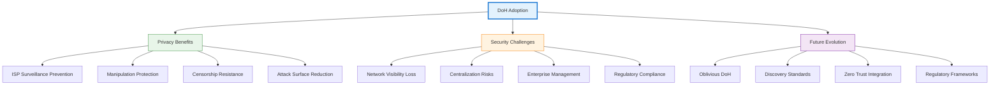

## Introduction

Every time you type a website address into your browser, an invisible conversation happens before any content loads. Your device asks the internet, "Where can I find this website?" This question—and its answer—has traditionally been sent in plain text, visible to anyone monitoring your network. It's like shouting your destination across a crowded room before taking a private taxi.

DNS over HTTPS (DoH) fundamentally changes this dynamic by encrypting these queries, wrapping them in the same secure protocol that protects your passwords and credit card information. What began as a privacy enhancement has evolved into a contentious technology that challenges decades of network management practices, raises questions about centralization, and forces us to reconsider the balance between privacy and control.

This exploration examines how DoH works, why it emerged, the benefits it delivers, and the complex challenges it introduces to the internet ecosystem.


## Understanding DNS: The Internet's Address Book

Before diving into DoH, we need to understand what it's protecting. The Domain Name System (DNS) is one of the internet's foundational protocols, translating human-readable domain names like "example.com" into IP addresses like "93.184.216.34" that computers use to communicate.

Traditional DNS operates over UDP port 53 (or TCP for larger responses), sending queries and responses in plain text. When you visit a website, your device sends a DNS query to a resolver—typically provided by your ISP or a public service like Google DNS or Cloudflare. The resolver either returns a cached answer or queries authoritative DNS servers to find the correct IP address.

!!!anote "🔍 Traditional DNS Flow"
    1. **User types URL**: Browser needs IP address for domain
    2. **Query sent**: Device sends DNS query to configured resolver (port 53, plain text)
    3. **Resolver searches**: Checks cache or queries authoritative servers
    4. **Response returned**: IP address sent back to device (plain text)
    5. **Connection established**: Browser connects to IP address
    
    Every step of this process is visible to network observers.

### The Privacy Problem

Traditional DNS's lack of encryption creates several privacy and security vulnerabilities:

- **Surveillance**: ISPs, governments, and network operators can see every domain you query
- **Manipulation**: Attackers can intercept and modify DNS responses (DNS spoofing)
- **Censorship**: Network operators can block access by filtering DNS queries
- **Tracking**: DNS queries reveal browsing patterns even when websites use HTTPS
- **Data leakage**: DNS queries expose information about internal network structure

While HTTPS encrypts the content of your web browsing, DNS queries remain visible, creating a significant privacy gap. An observer can't see what you're doing on a website, but they know exactly which websites you're visiting.


## How DNS over HTTPS Works

DNS over HTTPS addresses these vulnerabilities by tunneling DNS queries through HTTPS connections, the same encryption protocol that secures web traffic. This seemingly simple change has profound implications for privacy and network architecture.

### Technical Architecture

DoH encapsulates DNS queries within HTTPS requests, typically using HTTP/2 or HTTP/3 for efficiency. Instead of sending queries to port 53, DoH clients send HTTPS POST or GET requests to a DoH server's endpoint (usually port 443).

!!!anote "🔐 DoH Request Flow"
    **Traditional DNS Query:**
    ```
    Client → DNS Resolver (port 53, UDP/TCP)
    Query: "What is the IP for example.com?"
    Response: "93.184.216.34" (all visible to network)
    ```
    
    **DoH Query:**
    ```
    Client → DoH Server (port 443, HTTPS)
    Encrypted POST request containing DNS query
    Encrypted response containing IP address
    (Network sees only encrypted HTTPS traffic)
    ```

### Protocol Specifications

DoH is standardized in RFC 8484, defining how DNS queries are encoded in HTTP requests and responses. The protocol supports two methods:

**POST Method:**
- DNS query encoded in request body
- Content-Type: `application/dns-message`
- Binary DNS message format
- Preferred for privacy (no query in URL)

**GET Method:**
- DNS query encoded in URL parameter
- Query parameter: `?dns=<base64url-encoded-query>`
- May be cached by HTTP intermediaries
- Useful for simple queries

!!!tip "💡 Wire Format Compatibility"
    DoH uses the same binary DNS message format as traditional DNS, making it easy for existing DNS software to support DoH by adding an HTTPS wrapper. The DNS protocol itself doesn't change—only the transport mechanism.

### DoH vs. DNS over TLS (DoT)

DoH isn't the only encrypted DNS protocol. DNS over TLS (DoT), standardized in RFC 7858, also encrypts DNS queries but uses a dedicated port (853) and TLS directly rather than HTTPS.

| Feature | DoH (Port 443) | DoT (Port 853) | Traditional DNS (Port 53) |
|---------|----------------|----------------|---------------------------|
| **Encryption** | Yes (HTTPS) | Yes (TLS) | No |
| **Port** | 443 (HTTPS) | 853 (dedicated) | 53 (UDP/TCP) |
| **Visibility** | Looks like web traffic | Clearly identifiable | Clearly identifiable |
| **Blocking** | Difficult (blocks all HTTPS) | Easy (block port 853) | Easy (block port 53) |
| **Network control** | Limited | Possible | Full |
| **Caching** | HTTP caching possible | No HTTP caching | DNS caching only |

The key difference: DoH traffic is indistinguishable from regular HTTPS web traffic, making it nearly impossible to block without blocking all HTTPS. DoT uses a dedicated port, making it easy to identify and control.


## Drivers: Why DoH Emerged

The push for encrypted DNS didn't happen in a vacuum. Several converging factors created both the need and the momentum for DoH adoption.

### Privacy Concerns and Surveillance

The Snowden revelations in 2013 exposed the extent of mass surveillance programs, including DNS query monitoring. This sparked a broader privacy movement in the tech industry, leading to widespread HTTPS adoption. However, DNS remained an unencrypted weak point, undermining the privacy gains from HTTPS.

Privacy advocates argued that DNS queries reveal sensitive information about users' interests, health concerns, political views, and personal relationships. Even with HTTPS protecting website content, DNS queries create a detailed map of online behavior.

!!!warning "🕵️ Surveillance Capabilities"
    **What DNS queries reveal:**
    - Medical conditions (queries for health websites)
    - Political affiliations (news sites, campaign sites)
    - Financial status (banking sites, investment platforms)
    - Personal relationships (dating sites, social networks)
    - Geographic location (local business queries)
    - Work patterns (time-based query patterns)
    
    This metadata is often more valuable than content for profiling users.

### ISP Behavior and Monetization

Internet Service Providers have increasingly monetized DNS data through various means:

- **Advertising**: Injecting ads into DNS error pages
- **Tracking**: Selling DNS query data to advertisers
- **Redirection**: Redirecting failed queries to search pages with ads
- **Analytics**: Building user profiles from browsing patterns

These practices, while often disclosed in terms of service, raised concerns about user privacy and consent. DoH removes ISPs' visibility into DNS queries, eliminating these monetization opportunities and sparking significant opposition from ISPs.

### Censorship and Manipulation

Governments and network operators worldwide use DNS filtering for censorship, blocking access to websites by preventing DNS resolution. While some filtering serves legitimate purposes (blocking malware, child exploitation), it's also used to suppress political dissent and control information access.

DNS manipulation attacks (DNS spoofing, cache poisoning) can redirect users to malicious sites or block access to legitimate resources. These attacks exploit DNS's lack of authentication and encryption.

DoH makes DNS filtering and manipulation significantly more difficult, shifting control from network operators to DNS resolver operators and application developers.

### Browser Vendor Initiatives

Major browser vendors—particularly Mozilla and Google—championed DoH as part of broader privacy initiatives. Mozilla enabled DoH by default in Firefox (2020), while Chrome added DoH support with user control. These decisions brought DoH to hundreds of millions of users, accelerating adoption despite opposition from ISPs and network administrators.

Browser vendors argued that users deserve privacy by default and shouldn't need technical expertise to protect their DNS queries. Critics countered that browsers were overstepping their role and undermining network management.


## Benefits: The Case for DoH

DoH delivers tangible privacy and security benefits that justify its adoption despite the controversies it generates.

### Enhanced Privacy

DoH's primary benefit is preventing DNS query surveillance by network intermediaries. ISPs, public WiFi operators, and other network observers can no longer see which domains users are querying. This privacy extends to:

- **Home networks**: Roommates and family members can't monitor each other's browsing
- **Public WiFi**: Coffee shop operators can't track customer browsing
- **Corporate networks**: Employers have reduced visibility into employee browsing (controversial)
- **ISP monitoring**: Service providers can't build profiles from DNS data

!!!tip "🔒 Privacy Layers"
    **Without DoH:**
    - ISP sees: DNS queries (domains visited)
    - Website sees: Your IP address and browsing behavior
    
    **With DoH:**
    - ISP sees: Encrypted HTTPS traffic to DoH server, then encrypted traffic to destination
    - DoH provider sees: DNS queries (shifted trust)
    - Website sees: Your IP address and browsing behavior
    
    DoH doesn't provide complete anonymity—it shifts trust from ISPs to DoH providers.

### Protection Against Manipulation

Encrypting DNS queries prevents man-in-the-middle attacks that modify DNS responses. Attackers on public WiFi networks, compromised routers, or malicious ISPs can't redirect users to phishing sites or block access to legitimate resources through DNS manipulation.

DNSSEC (DNS Security Extensions) provides cryptographic authentication of DNS responses, but adoption has been slow and it doesn't provide confidentiality. DoH complements DNSSEC by adding encryption, creating a more complete security solution.

### Circumventing Censorship

For users in countries with internet censorship, DoH provides a tool to bypass DNS-based blocking. By using DoH servers outside the censoring country, users can access blocked websites without sophisticated circumvention tools like VPNs.

!!!anote "🌍 Censorship Resistance"
    **Traditional DNS blocking:**
    - Government controls local DNS resolvers
    - Blocks queries for banned domains
    - Users see "domain not found" errors
    
    **With DoH:**
    - Users configure browsers to use foreign DoH servers
    - DNS queries encrypted and sent to external servers
    - Blocking requires blocking all HTTPS (impractical)
    
    This capability makes DoH politically controversial in countries with strict internet controls.

### Improved Security Posture

DoH reduces the attack surface for DNS-based threats:

- **DNS spoofing**: Encrypted queries can't be intercepted and modified
- **Cache poisoning**: Harder to inject false DNS records
- **DNS tunneling detection**: Encrypted traffic makes malicious DNS tunneling less detectable (double-edged sword)
- **Credential theft**: Prevents attackers from redirecting login pages

Organizations using DoH with trusted resolvers gain protection against DNS-based attacks that bypass traditional security controls.

### Performance Optimizations

Modern DoH implementations leverage HTTP/2 and HTTP/3 features for performance:

- **Multiplexing**: Multiple DNS queries over single connection
- **Connection reuse**: Reduces latency from connection establishment
- **HTTP caching**: Intermediate caches can store responses (with privacy considerations)
- **0-RTT**: HTTP/3 enables zero round-trip time for repeat queries


## Challenges and Controversies

DoH's benefits come with significant challenges that have made it one of the most controversial internet protocols in recent years.

### Network Management and Visibility

Network administrators rely on DNS visibility for legitimate purposes:

- **Security monitoring**: Detecting malware communication, data exfiltration
- **Content filtering**: Blocking malicious sites, enforcing acceptable use policies
- **Troubleshooting**: Diagnosing network issues, identifying misconfigured systems
- **Compliance**: Meeting regulatory requirements for content filtering

DoH breaks these capabilities by encrypting DNS queries, forcing organizations to implement alternative monitoring approaches or block DoH entirely.

!!!warning "⚠️ Enterprise Concerns"
    **Lost capabilities with DoH:**
    - DNS-based threat detection (malware domains, C2 servers)
    - Parental controls and content filtering
    - Network usage analytics
    - Compliance with data retention regulations
    - Troubleshooting DNS resolution issues
    
    **Mitigation strategies:**
    - Deploy internal DoH servers with logging
    - Use endpoint security agents for visibility
    - Implement TLS inspection (controversial)
    - Block external DoH servers (arms race)

### Centralization Concerns

Traditional DNS is highly distributed, with thousands of resolvers operated by ISPs, organizations, and public services. DoH adoption has concentrated DNS traffic among a few large providers:

- **Cloudflare (1.1.1.1)**: One of the most popular DoH providers
- **Google (8.8.8.8)**: Massive DoH user base
- **Quad9**: Privacy-focused alternative
- **Browser defaults**: Mozilla partnered with Cloudflare, concentrating traffic

This centralization raises concerns:

- **Single points of failure**: Outages affect millions of users
- **Surveillance risk**: Concentrated data creates attractive surveillance targets
- **Market power**: Few providers control critical infrastructure
- **Geopolitical implications**: DNS traffic flows through specific jurisdictions

!!!anote "🏛️ Centralization vs. Privacy Trade-off"
    **Distributed DNS (traditional):**
    - Many small operators (ISPs, local resolvers)
    - Queries visible to local network operators
    - Resilient to single-provider failures
    - Easier to regulate locally
    
    **Centralized DoH:**
    - Few large providers
    - Queries hidden from local networks but visible to DoH providers
    - Vulnerable to provider outages
    - Harder to regulate (cross-border)
    
    Neither model is clearly superior—each involves different trust assumptions.

### Split-Horizon DNS and Internal Networks

Many organizations use split-horizon DNS, where internal domain names resolve differently on the corporate network than on the public internet. Internal resources like "intranet.company.local" only resolve on the company network.

DoH breaks split-horizon DNS when clients use external DoH servers. Internal domain queries go to public resolvers that can't resolve them, breaking access to internal resources. Organizations must either:

- **Block external DoH**: Prevents employees from using public DoH servers
- **Deploy internal DoH**: Requires infrastructure investment and configuration
- **Use discovery mechanisms**: Implement DoH server discovery protocols (still maturing)

### Performance Overhead

While DoH can leverage HTTP optimizations, it also introduces overhead:

- **Connection establishment**: HTTPS handshake adds latency for first query
- **Encryption overhead**: CPU cost for encrypting/decrypting queries
- **HTTP framing**: Additional bytes compared to raw DNS
- **Connection management**: Maintaining persistent connections

For high-volume DNS users, this overhead can be measurable. However, connection reuse and HTTP/2 multiplexing mitigate much of the impact.

### Legal and Regulatory Challenges

DoH complicates legal frameworks around lawful intercept, content filtering, and data retention:

- **Lawful intercept**: Law enforcement loses visibility into DNS queries
- **Content filtering mandates**: Countries requiring ISP-level filtering can't enforce it
- **Data retention**: Regulations requiring DNS query logging become harder to enforce
- **Jurisdiction**: DNS traffic flows to providers in different legal jurisdictions

Some countries have considered or implemented restrictions on DoH to maintain regulatory control. The UK's Internet Watch Foundation expressed concerns about DoH undermining child protection efforts.


## Implementation Approaches

Organizations and users have several options for implementing DoH, each with different trade-offs.

### Browser-Based DoH

Modern browsers include built-in DoH support, allowing users to enable encrypted DNS without system-level changes:

**Firefox:**
- DoH enabled by default in some regions
- Uses Cloudflare or NextDNS by default
- User can configure custom DoH servers
- Respects enterprise policies to disable DoH

**Chrome/Edge:**
- DoH enabled if system DNS resolver supports it
- Upgrades existing DNS to DoH when available
- Respects system DNS configuration
- Can be disabled via enterprise policies

**Safari:**
- Supports DoH via system-level configuration
- No built-in DoH server defaults
- Requires manual configuration or profiles

!!!tip "🔧 Browser DoH Configuration"
    **Advantages:**
    - Easy for users to enable
    - No system-level changes required
    - Per-browser control
    
    **Disadvantages:**
    - Only protects browser traffic
    - Other applications still use traditional DNS
    - May conflict with network policies

### System-Level DoH

Operating systems increasingly support DoH at the system level, protecting all applications:

**Windows 11:**
- Native DoH support in DNS client
- Configure via Settings or Registry
- Supports fallback to traditional DNS

**macOS:**
- DoH support via configuration profiles
- Requires manual setup or MDM deployment
- System-wide protection

**Linux:**
- systemd-resolved supports DoH
- Various third-party DoH clients available
- Requires configuration

**Android/iOS:**
- Private DNS settings support DoH
- VPN-based DoH apps available
- Per-network configuration possible

### Enterprise DoH Deployment

Organizations deploying DoH face unique requirements:

!!!example "🏢 Enterprise DoH Strategy"
    **Option 1: Internal DoH Servers**
    - Deploy DoH servers within corporate network
    - Maintain DNS visibility and control
    - Support split-horizon DNS
    - Requires infrastructure investment
    
    **Option 2: Managed DoH Services**
    - Use enterprise DoH providers (Cisco Umbrella, Cloudflare for Teams)
    - Centralized management and logging
    - Maintains security visibility
    - Subscription costs
    
    **Option 3: Hybrid Approach**
    - Internal DoH for corporate devices
    - Allow external DoH for BYOD
    - Policy-based routing
    - Complex configuration

### DoH Server Selection Criteria

Choosing a DoH provider involves evaluating several factors:

| Criteria | Considerations |
|----------|----------------|
| **Privacy policy** | Logging practices, data retention, third-party sharing |
| **Performance** | Latency, reliability, geographic distribution |
| **Security** | Malware blocking, threat intelligence integration |
| **Filtering** | Content filtering options (parental controls, malware) |
| **Compliance** | Data residency, regulatory compliance |
| **Cost** | Free vs. paid tiers, enterprise pricing |
| **Transparency** | Public audits, transparency reports |


## Real-World Adoption and Impact

DoH adoption has grown significantly since 2018, with measurable impacts on internet privacy and network management.

### Adoption Statistics

- **Firefox**: DoH enabled by default for US users (2020), expanding to other regions
- **Chrome**: DoH support in 2020, automatic upgrade when available
- **Cloudflare**: Handles billions of DoH queries daily
- **Google Public DNS**: Significant DoH traffic growth
- **Enterprise**: Mixed adoption, many organizations blocking external DoH

### Case Studies

!!!example "💼 Mozilla's DoH Rollout"
    **Approach:**
    - Gradual rollout starting in US (2020)
    - Partnership with Cloudflare as default provider
    - Trusted Recursive Resolver (TRR) program for provider vetting
    - Enterprise policy overrides for corporate networks
    
    **Results:**
    - Millions of users protected by default
    - Significant pushback from ISPs and network operators
    - Forced development of enterprise DoH solutions
    - Raised awareness of DNS privacy issues

!!!example "🌐 Cloudflare 1.1.1.1"
    **Offering:**
    - Free public DoH resolver
    - Privacy-focused (minimal logging)
    - High performance (global anycast network)
    - Malware blocking variant (1.1.1.2)
    
    **Impact:**
    - Became one of the largest DoH providers
    - Demonstrated viability of privacy-focused DNS
    - Raised concerns about centralization
    - Influenced other providers to offer DoH

### Impact on Network Security

Security teams report mixed experiences with DoH:

**Positive impacts:**
- Reduced DNS-based attacks from external networks
- Protection against ISP-level manipulation
- Improved privacy for remote workers

**Negative impacts:**
- Loss of DNS-based threat detection
- Difficulty enforcing content policies
- Increased complexity in security monitoring
- Need for alternative detection methods

Organizations have adapted by implementing endpoint-based security, TLS inspection (controversial), and internal DoH servers with logging.


## Future Directions

DoH continues to evolve, with several trends shaping its future development.

### Discovery and Configuration

Current DoH deployment requires manual configuration or browser defaults. Emerging standards aim to improve this:

- **Discovery of Designated Resolvers (DDR)**: RFC 9462 enables automatic discovery of DoH servers
- **DHCP/RA options**: Network-provided DoH server configuration
- **DNS SVCB records**: Advertise DoH support via DNS itself
- **Encrypted ClientHello (ECH)**: Complements DoH by encrypting SNI

These mechanisms enable seamless DoH adoption while respecting network policies.

### Oblivious DoH (ODoH)

Oblivious DoH (RFC 9230) addresses DoH's trust concentration problem by separating query visibility from IP address visibility:



!!!anote "🔐 ODoH Privacy Model"
    **Traditional DoH:**
    - DoH provider sees both your IP address and queries
    - Single point of trust
    
    **Oblivious DoH:**
    - Proxy sees your IP but not queries (encrypted)
    - Target sees queries but not your IP (from proxy)
    - Requires collusion to link IP and queries
    - Stronger privacy guarantees

ODoH is still early in adoption but represents the next evolution in DNS privacy.

### Integration with Zero Trust Architecture

DoH is increasingly integrated into Zero Trust security models:

- **Identity-aware DNS**: DoH queries tied to user/device identity
- **Policy enforcement**: DNS policies based on user context
- **Threat intelligence**: Real-time threat feeds integrated with DoH
- **Conditional access**: DNS resolution based on security posture

This integration enables security without sacrificing privacy.

### Regulatory Evolution

Governments and regulatory bodies are developing frameworks for encrypted DNS:

- **Lawful access**: Mechanisms for law enforcement access to DoH logs
- **Content filtering**: Requirements for DoH providers to implement filtering
- **Data localization**: Requirements for DNS data to stay within borders
- **Transparency**: Mandatory reporting of DoH provider practices

These regulations will shape how DoH evolves and which providers operate in different jurisdictions.

### Performance Optimizations

Ongoing work to reduce DoH overhead:

- **HTTP/3 adoption**: QUIC-based transport reduces latency
- **0-RTT resumption**: Eliminates handshake latency for repeat connections
- **Adaptive TTLs**: Intelligent caching based on query patterns
- **Prefetching**: Predictive DNS resolution for likely queries


## Conclusion

DNS over HTTPS represents a fundamental shift in internet privacy, encrypting a protocol that has been visible for decades. By wrapping DNS queries in HTTPS, DoH prevents surveillance, manipulation, and censorship by network intermediaries. The benefits are clear: enhanced privacy, protection against attacks, and circumvention of DNS-based blocking.

However, DoH's adoption has been contentious, challenging established network management practices and raising concerns about centralization, enterprise security, and regulatory control. Network administrators lose visibility they've relied on for security monitoring and troubleshooting. DNS traffic concentrates among a few large providers, creating new risks. Organizations must adapt their security strategies to maintain protection without DNS visibility.



The debate around DoH reflects broader tensions in internet governance: privacy versus control, centralization versus distribution, user autonomy versus network management. There's no perfect solution—each approach involves trade-offs and different trust assumptions.

For individuals, DoH offers meaningful privacy protection with minimal effort. Browser-based DoH or system-level configuration provides immediate benefits, particularly on untrusted networks. The shift of trust from ISPs to DoH providers is generally favorable, as DoH providers typically have stronger privacy commitments and face more public scrutiny.

For organizations, DoH requires careful consideration. Blocking external DoH and deploying internal DoH servers maintains security visibility while providing encryption benefits. Managed DoH services offer a middle ground, providing encryption with enterprise features like logging and filtering. The key is adapting security strategies to work without relying solely on DNS visibility.

Looking forward, DoH will continue evolving. Oblivious DoH addresses centralization concerns by separating query visibility from IP address visibility. Discovery mechanisms will enable seamless DoH adoption while respecting network policies. Integration with Zero Trust architectures will enable security without sacrificing privacy. Regulatory frameworks will emerge, shaping how DoH operates in different jurisdictions.

The broader implication is clear: the internet is moving toward encryption by default. DNS was one of the last major protocols transmitted in plain text. DoH closes this gap, extending the privacy protections of HTTPS to the foundational layer of internet naming. This shift is irreversible—the privacy benefits are too significant, and the technology is too widely deployed to roll back.

For those evaluating DoH, the question isn't whether to adopt encrypted DNS, but how to do so in a way that balances privacy, security, and operational requirements. The technology is mature, widely supported, and increasingly default. Understanding its implications and implementing it thoughtfully will be essential for anyone managing networks or concerned about internet privacy.

The future of DNS is encrypted. DoH is building that future, one query at a time.


## Try It Yourself

Want to see DoH in action? Try our [DNS over HTTPS Lookup Tool](/tools/doh-lookup/) to perform encrypted DNS queries through Cloudflare, Google, or Quad9. Query multiple record types and see the privacy benefits firsthand.

## References and Resources

- **RFC 8484**: DNS Queries over HTTPS (DoH) - [IETF RFC 8484](https://datatracker.ietf.org/doc/html/rfc8484)
- **RFC 7858**: Specification for DNS over Transport Layer Security (DoT) - [IETF RFC 7858](https://datatracker.ietf.org/doc/html/rfc7858)
- **RFC 9230**: Oblivious DNS over HTTPS - [IETF RFC 9230](https://datatracker.ietf.org/doc/html/rfc9230)
- **RFC 9462**: Discovery of Designated Resolvers (DDR) - [IETF RFC 9462](https://datatracker.ietf.org/doc/html/rfc9462)
- **Cloudflare 1.1.1.1**: [https://1.1.1.1/](https://1.1.1.1/)
- **Google Public DNS**: [https://developers.google.com/speed/public-dns](https://developers.google.com/speed/public-dns)
- **Quad9**: [https://www.quad9.net/](https://www.quad9.net/)
- **Mozilla Trusted Recursive Resolver Program**: [https://wiki.mozilla.org/Security/DOH-resolver-policy](https://wiki.mozilla.org/Security/DOH-resolver-policy)
