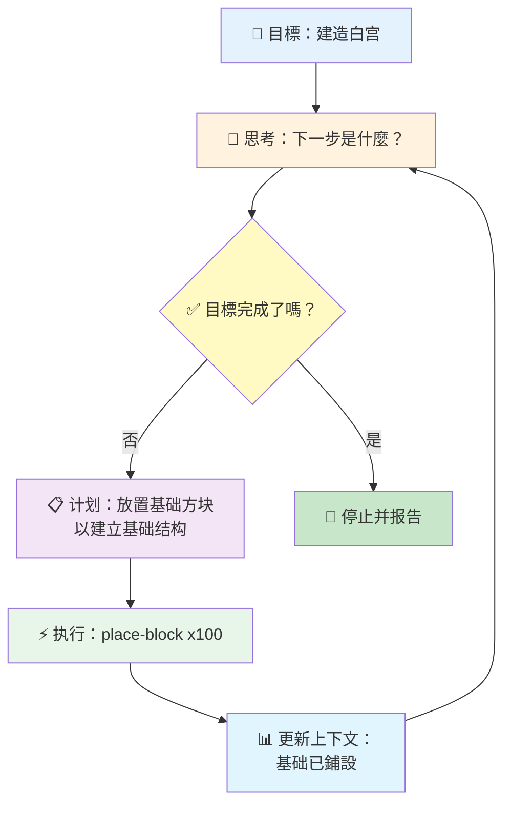

你的队友们计划周六进行一场史诗级的 我的世界 建筑活动。然后周五晚上：「抱歉，明天不能来了。」一个接一个，你的朋友们都放鸽子。现在你盯着那个巨大的城堡项目，意识到独自完成需要好几周。

如果你的角色可以在你上学时继续建造呢？或者更好的是——如果 AI 可以通过你的描述来帮你建造呢？欢迎来到游戏自动化的世界，在这里你的游戏梦想成为现实。但首先，让我们谈谈如何避免麻烦。

## ⚖️ 法律现实检查（是的，我们从这里开始）

!!!warning "🚨 认真说：这可能会让你陷入麻烦"
    在你自动化任何东西之前，请理解：大多数在线游戏在其服务条款中明确禁止使用机器人。被抓到意味着：
    
    - **永久账号封禁**（再见了，那个 99 级角色）
    - **IP 封禁**（连新账号都无法创建）
    - **法律后果**（在某些国家，是的，真的）

### 机器人 = 坏消息的情况

**在线多人游戏**绝对不能使用自动化：

- MMORPG（魔兽世界、Final Fantasy XIV）
- 竞技游戏（英雄联盟、无畏契约、Mobile Legends）
- 有 PvP 的抽卡游戏（原神、崩坏：星穹铁道）

为什么？因为你对真实玩家获得了不公平的优势。游戏公司非常重视这一点——他们有整个团队在猎捕机器人。

### 各国特定法律

某些国家将游戏机器人视为：

- **诈骗**（你违反了合约）
- **未经授权的计算机访问**（在极端情况下）
- **虚拟财产盗窃**（如果你在刷物品并出售）

例如，韩国已经起诉过机器人用户。为了一些虚拟黄金不值得冒这个险，对吧？

### 自动化实际上可以的情况

!!!success "✅ 自动化的安全区域"
    - **单人游戏**（你的游戏，你的规则）
    - **允许模组的沙盒游戏**（我的世界、Terraria）
    - **有官方 API 支持的游戏**（某些放置游戏）
    - **学习用的个人项目**（只是不要连接到在线服务器）

## 🤖 Android 游戏自动化：技术分析

Android 是自动化的游乐场。iOS？那就像试图在锁定的主机上改游戏——可以通过越狱实现，但麻烦得多。

### 方法 1：屏幕录制与回放

**运作方式：**录制你的点击和滑动，然后循环播放。

**工具：**Auto Clicker 应用程序、MacroDroid、ADB（Android Debug Bridge）

**優點：**
- 不需要编码（对於应用程序）
- 適用於任何遊戲
- 设定简单（真的只需 5 分钟）
- 可以用 ADB 編寫复杂的点击模式腳本

**缺點：**
- UI 稍有变化就會失效
- 无法適應遊戲事件
- 容易被反作弊系统侦测
- 看起來像机器人（每次时间都一樣）

**最适合：**简单的放置遊戲、每日登入獎勵、節奏遊戲练习

**實際范例：ADB 点击腳本**

!!!warning "⚖️ 执行此腳本之前"
    **先检查遊戲的服务条款！**此范例僅供教育目的，應僅用於：
    - **離線單人遊戲**
    - **明確允许自动化的遊戲**
    - **你自己的测试应用程序**
    
    在在线多人遊戲上使用可能導致永久封鎖，并可能違反你所在國家的法律。如有疑問，不要冒險。

这是一个 Windows 批次腳本，可以在你的 Android 屏幕上自动点击多个位置：

```batch
for /l %%x in (1, 1, 10000) do (
    adb shell "input tap 300 1400 & input tap 400 1400 & input tap 500 1400 & input tap 600 1400 & input tap 700 1400 & input tap 550 1400 & input tap 450 1400 & input tap 350 1400 & input tap 250 1400 & input tap 475 1400 & input tap 375 1400 & input tap 525 1400 & input tap 575 1400"
)
```

此腳本按順序点击 13 个不同的屏幕位置，重复 10,000 次。非常适合有多个点击區域的離線遊戲（如節奏遊戲练习模式或允许自动化的放置点击遊戲）。

**如何设定：**

1. **在 Android 上啟用开发者选项：**
   - 前往设定 → 關於手機
   - 点击「版本號碼」7 次
   - 你會看到「你现在是开发者了！」

2. **啟用 USB 调试：**
   - 设定 → 开发者选项
   - 开启「USB 调试」

3. **在计算机上安装 ADB：**
   - **Windows：**下載 [Platform Tools](https://developer.android.com/studio/releases/platform-tools)
   - **Mac/Linux：**`brew install android-platform-tools` 或使用套件管理器
   - 解壓縮到文档夹（例如 `C:\adb`）

4. **连接你的手機：**
   - 通过 USB 将手機连接到计算机
   - 在手機上，允许 USB 调试提示
   - 测试连接：`adb devices`（应该显示你的装置）

5. **找到你的点击坐标：**
   - 设定 → 开发者选项 → 啟用「指標位置」
   - 开启你的遊戲并記下你想点击的 X,Y 坐标
   - 格式是 `input tap X Y`（例如 `input tap 300 1400`）

6. **建立你的腳本：**
   - **Windows：**保存為 `auto-tap.bat`
   - **Mac/Linux：**保存為 `auto-tap.sh` 并执行 `chmod +x auto-tap.sh`

7. **执行它：**
   - **验证遊戲允许自动化**（检查服务条款）
   - 在手機上开启你的遊戲
   - 在计算机上执行腳本
   - 看魔法发生！

**自訂腳本：**

```batch
# 更改循环次數（10000 = 重复次數）
for /l %%x in (1, 1, 10000) do (

# 在点击之間添加延迟（以毫秒為單位）
adb shell "input tap 300 1400 && sleep 0.1 && input tap 400 1400"

# 添加滑動手勢
adb shell "input swipe 300 1400 300 800 100"
# 格式：swipe startX startY endX endY duration(ms)
```

!!!tip "💡 专业提示"
    - **先测试：**使用小循环次數（如 10）來验证坐标
    - **添加延迟：**某些遊戲會将快速点击侦测為作弊
    - **屏幕保持开启：**在开发者选项中啟用「保持唤醒」
    - **无线 ADB：**通过 USB 连接後，执行 `adb tcpip 5555` 然後 `adb connect <phone-ip>:5555` 进行无线自动化

### 方法 2：影像辨識机器人

**運作方式：**机器人「看到」屏幕，識別按钮/敌人，并做出反應。

**工具：**基於 OpenCV 的腳本、AnkuluaX

**優點：**
- 比錄製更靈活
- 可以处理小的 UI 变化
- 可以根据屏幕上的内容做出决策

**缺點：**
- 需要设定和测试
- 资源密集（快速耗盡電池）
- 仍然可以被复杂的反作弊侦测到
- 不同遊戲需要不同的腳本

**最适合：**農场遊戲、自动战鬥 RPG

### 方法 3：无障碍服务自动化

**運作方式：**使用 Android 的无障碍功能來读取和与应用程序互动。

**工具：**Tasker、AutoInput、自訂腳本

**優點：**
- 可以读取實際的 UI 元素（不只是图像）
- 比影像辨識更可靠
- 较低的资源使用

**缺點：**
- 设定复杂
- 需要了解 Android UI 结构
- 某些遊戲會封鎖无障碍服务
- 潜在的安全风险（你授予了深度系统访问权限）

**最适合：**具有一致 UI 的遊戲、非竞技自动化

### 方法 4：Root 装置自动化

**運作方式：**完全系统访问 = 完全控制遊戲。

**工具：**Xposed Framework、Magisk 模组、自訂腳本

**優點：**
- 可以自动化任何東西
- 可以绕过某些侦测方法
- 可以修改遊戲行为

**缺點：**
- **使保修失效**
- **重大安全风险**（一个坏应用程序 = 装置被入侵）
- 许多遊戲拒绝在 root 装置上执行
- 复杂且有风险的过程
- iOS 等效（越狱）更难且更不稳定

**最适合：**仅限开发者和修补者（认真的，不适合一般用户）

!!!danger "⚠️ 为什么 iOS 更难"
    iOS 自动化需要：
    - 越狱（使保修失效、安全风险）
    - 有限的工具可用性
    - 频繁的 iOS 更新會破坏越狱
    - Apple 积极对抗自动化
    
    如果你认真对待遊戲自动化，请坚持使用 Android。

## 🎮 酷炫部分：MCP 驱动的遊戲自动化

现在我们谈论的是未来。忘记点击按钮——如果你可以用自然语言控制遊戲呢？

### 智能体

在深入 MCP 之前，让我们了解是什麼让這个「魔法」起作用：**智能体**。

傳統 AI：你問，它回答一次，完成。

**智能体：**你给一个目標，它找出步骤，执行它们，检查進度，并持續进行直到目標完成。就像有一个不需要微觀管理的 AI 員工。

**智能体循环：**



**關鍵概念：**

1. **思考** - LLM 推理：「我下一步应该做什麼？」（花钱）
2. **检查** - LLM 推理：「我完成了嗎？」（花钱）
3. **计划** - LLM 推理：「我将放置基础方块來建立基础」（花钱）
4. **执行** - MCP 命令：放置方块（几乎免费）
5. **更新上下文** - 记住完成了什麼（用於下一个循环）
6. **重复** - 直到達成目標

這个循环自主運行。你设定一次目標，然後看著它工作。

### 什麼是 MCP？

模型上下文协议（MCP）让 AI 助手与应用程序互动。可以把它想象成给智能体「双手」，通过结构化命令來控制遊戲。

### 我的世界 + MCP：AI 驱动的遊戲玩法

[Minecraft MCP Server](https://github.com/yuniko-software/minecraft-mcp-server) 项目让你通过 Claude Desktop 使用自然语言控制 我的世界。不需要编码——只需对话。

**實際范例：建造白宫**

**起点：**


**幕后发生的事情：**

你给一个提示：**「建造這个」**（附上白宫图片）

然後 Claude Desktop 完全接管，自动进行數百次 MCP 工具调用：

**你的输入：**
```
你：「建造這个」[附上白宫图片]
```

**Claude Desktop（智能体 循环 - 内部过程）：**
```
👁️ 分析图像：「这是白宫」

--- 智能体 循环迭代 #1 ---
🧠 推理：「建造完成了嗎？否。计划：放置石英方块以建立基础」
⚡ 执行 MCP：get-position、place-block x100
📊 上下文已更新：基础完成

--- 智能体 循环迭代 #2 ---
🧠 推理：「建造完成了嗎？否。计划：在基础上建造墙壁以形成结构」
⚡ 执行 MCP：place-block x200
📊 上下文已更新：墙壁完成

--- 智能体 循环迭代 #3 ---
🧠 推理：「建造完成了嗎？否。计划：在墙壁上添加玻璃窗以增加真实性」
⚡ 执行 MCP：place-block (glass_pane) x50
📊 上下文已更新：窗户完成

--- 智能体 循环迭代 #4 ---
🧠 推理：「建造完成了嗎？否。计划：用楼梯建造屋顶以匹配白宫风格」
⚡ 执行 MCP：place-block (quartz_stairs) x150
📊 上下文已更新：屋顶完成

--- 智能体 循环迭代 #5 ---
🧠 推理：「建造完成了嗎？否。计划：添加装饰元素以增强真实感」
⚡ 执行 MCP：place-block (decorations) x30
📊 上下文已更新：装饰完成

--- 智能体 循环迭代 #6 ---
🧠 推理：「建造完成了嗎？是！所有元素都存在。」
🛑 停止循环 - 未执行 MCP 命令
```

**MCP 工具调用（在 UI 中折叠，但正在发生）：**
```
▶ get-position
  结果：{x: 100, y: 64, z: -60}

▶ place-block (quartz, foundation)
▶ place-block (quartz, foundation)
▶ place-block (quartz, foundation)
  ...（数百个方块）

▶ place-block (glass_pane, windows)
▶ place-block (glass_pane, windows)
  ...（更多窗户）

▶ place-block (quartz_stairs, roof)
  ...（屋顶建造）

▶ place-block (decorations)
  ...（最后修饰）
```

**Claude 的回应（你看到的）：**
```
我可以看到这是白宫的图像。我将在 我的世界 中建造
一个简化版本。让我從建立基础和主要结构开始。

[自动建造]

我已經完成了白宫，包括：
- 石英方块的主要结构
- 装饰柱
- 窗框和窗楣
- 屋顶上的多层圆顶
- 树木和花园的景观美化
```

**关键点：**你不需要手动說「添加窗户」或「加高」。Claude 的 agentic 循环自主地：
1. 检查目標是否完成
2. 决定下一步要建造什麼
3. 执行 MCP 命令
4. 更新其上下文
5. 重复直到确定建造完成
6. 自动停止（不再有 MCP 命令）

!!!anote "📋 高层次规划 vs 逐步规划"
    某些智能体工具如 Cline（VS Code 扩展）使用不同的方法：它们预先建立高层次计划并跟踪进度，而不是逐步决定每个步骤。这对于复杂任务可能更有效率。
    
    **范例：**不是 50 个微决策（「放置这个方块，检查是否完成，放置下一个方块...」），Cline 可能：
    1. 建立计划：「基础 → 墙壁 → 窗户 → 屋顶 → 细节」
    2. 跟踪进度：「基础：100% ✓，墙壁：60%...」
    3. 用较少的 LLM 调用执行每个阶段
    
    这种方法可以降低成本并提高一致性，尽管它需要更复杂的规划能力。

**最终结果：**


!!!warning "💰 成本考量：是思考，不是命令"
    **成本来自哪里：**
    
    - **视觉 API：**~$0.01-0.05（一次性分析图像）
    - **智能体 循环迭代：**这是成本累积的地方！💸
      - 每次迭代 = 1 次 LLM 推理
      - 每次推理询问：「我完成了嗎？如果没有，下一步是什麼？」
      - 复杂建造 = 许多迭代
      - 范例：白宫可能需要 50-100 次迭代
      - 每次迭代根据处理的 token 数量计费
      - 最后迭代：确定「完成」但不执行 MCP 命令（仍然花钱）
    - **MCP 命令本身：**几乎免费（只是对本地 我的世界 的 API 调用）
    
    **昂贵的部分是 Claude 的大脑，不是它的手：**
    - 迭代 #1：「未完成。计划：放置基础方块以建立基础」→ 执行 100 个 place-block 命令
    - 迭代 #2：「未完成。计划：在基础上建造墙壁以形成结构」→ 执行 200 个 place-block 命令
    - 迭代 #3：「未完成。计划：在墙壁上添加窗户以增加真实性」→ 执行 50 个 place-block 命令
    - 迭代 #50：「完成！所有元素完成。停止。」→ 执行 0 个命令（但推理仍然花钱）
    - 每次迭代 = LLM 处理 = $$$
    
    **管理成本的技巧：**
    - 使用 Claude Desktop 免费层进行测试（有限制）
    - 從小开始：「建造一个简单的房子」（较少迭代）
    - 复杂建造 = 更多迭代 = 更高成本
    - 白宫范例可能花費 $1-5，取决于细节程度

**你可以使用的可用命令：**

**移动与导航：**
- `get-position` - 我在哪里？
- `move-to-position` - 前往坐标
- `look-at` - 看向特定位置
- `jump` - 跳跃
- `move-in-direction` - 向前/向后移动 X 秒
- `fly-to` - 直接飞到坐标（创造模式）

**库存管理：**
- `list-inventory` - 我有什麼？
- `find-item` - 我的钻石镐在哪里？
- `equip-item` - 装备剑

**方块互动：**
- `place-block` - 在坐标處放置方块
- `dig-block` - 在坐标處挖掘方块
- `get-block-info` - 这是什麼方块？
- `find-block` - 找到最近的钻石矿石

**实体互动：**
- `find-entity` - 找到最近的僵尸/村民/牛

**通信：**
- `send-chat` - 在游戏中发送消息
- `read-chat` - 读取最近的玩家消息

**遊戲状态：**
- `detect-gamemode` - 我在生存还是创造模式？

**对话范例：**

```
你：「找到最近的橡树并砍倒它」
Claude：*使用 find-block，移动到樹，挖掘方块*

你：「在我当前位置建造一个 5x5 的鹅卵石平台」
Claude：*计算位置，放置 25 个方块*

你：「检查附近是否有苦力怕」
Claude：*使用 find-entity，报告结果*

你：「飞到坐标 100, 64, 200」
Claude：*使用 fly-to 命令*
```

**为什么这是革命性的：**

- **图像到建造：**展示一张图片，获得一个结构（视觉使用一次）
- **智能体 自主性：**Claude 在没有人工干预的情况下决定所有步骤
- **自我终止：**知道工作何时完成并自动停止
- **自然语言：**无需记忆命令语法
- **智能规划：**将复杂建造分解为逻辑步骤
- **上下文感知：**记住它在先前迭代中建造的内容
- **适应性：**处理意外情况（材料不足？去获取更多）
- **教育性：**看看智能体如何分解复杂任务
- **即时反馈：**看到变化在游戏中即时发生

### 其他 MCP 遊戲可能性

**策略遊戲：**
- 「侦察地图并报告敌人位置」
- 「建造最佳防御基地布局」

**沙盒遊戲：**
- 「建立红石计算機」
- 「设计连接所有村庄的铁路系统」

**自动化遊戲（Factorio、Satisfactory）：**
- 「优化我的生产线」
- 「计算 1000 电路/分钟的资源需求」

!!!tip "💡 学习角度"
    智能体 + MCP 遊戲自动化实际上是教育性的：
    - 无需编码即可学习程式设计概念
    - 了解智能体循环和决策制定
    - 看看 AI 如何在迭代中维护上下文
    - 练习问题分解
    - 了解何时停止（目標完成侦测）
    - 看到算法在行动

### 设定 我的世界 MCP Server

**需求：**
- 我的世界 Java Edition
- [Claude Desktop](https://claude.ai/download)（免费）
- [我的世界 MCP Server](https://github.com/yuniko-software/minecraft-mcp-server)
- 已安装 Node.js

**快速设定：**

1. **安装 MCP 服务器：**
   ```bash
   git clone https://github.com/yuniko-software/minecraft-mcp-server
   cd minecraft-mcp-server
   npm install
   ```

2. **配置 Claude Desktop：**
   将 MCP 服务器添加到 Claude 的配置文档

3. **启动 我的世界：**
   开始一个世界（建议使用创造模式进行测试）

4. **启动 MCP 服务器：**
   ```bash
   npm start
   ```

5. **与 Claude 对话：**
   开启 Claude Desktop 并开始给出 我的世界 命令！

**你的第一个命令：**

```
你：「我在 我的世界 中的当前位置是什麼？」
Claude：*使用 get-position 命令*
        「你在坐标 X: 245, Y: 64, Z: -128」

你：「在這裡建造一个小房子」
Claude：*开始自动放置方块*
```

魔法在幕后发生——Claude 将你的自然语言翻译成 MCP 命令，执行它们，并用简单的英语回報。

## 🎯 底线：负责任地自动化

**做：**
- 自动化單人体验
- 使用自动化來学习程式设计/AI
- 在沙盒环境中实验
- 尊重遊戲开发者的规则

**不要：**
- 在竞技在线游戏中使用机器人
- 出售机器人账号或物品
- 破坏其他玩家的体验
- 忽视服务条款

**哲学：**

自动化应该增强你的遊戲，而不是取代它。使用机器人跳过无聊的部分，但为自己保留有趣的部分。如果你自动化一切，问问自己：你还在玩吗？

!!!quote "🎮 最后的想法"
    最好的自动化是那种让你有更多时间享受你喜欢的遊戲内容的自动化——无论是史诗般的 Boss 战、创意建造，还是只是与朋友在在线闲逛。

## 探索资源

- **[Minecraft MCP Server](https://github.com/yuniko-software/minecraft-mcp-server)：**使 AI 控制的 我的世界 成為可能的项目
- **[Claude Desktop](https://claude.ai/download)：**支持 MCP 的免费 AI 助手
- **[MCP 文档](https://modelcontextprotocol.io/)：**了解模型上下文协议
- **Android 自动化：**Tasker、MacroDroid（合法自动化工具）
- **遊戲模组社区：**了解你最喜欢的游戏中允许什麼

记住：能力越大，责任越大。聪明地玩遊戲，保持合法，最重要的是——玩得开心！🚀
