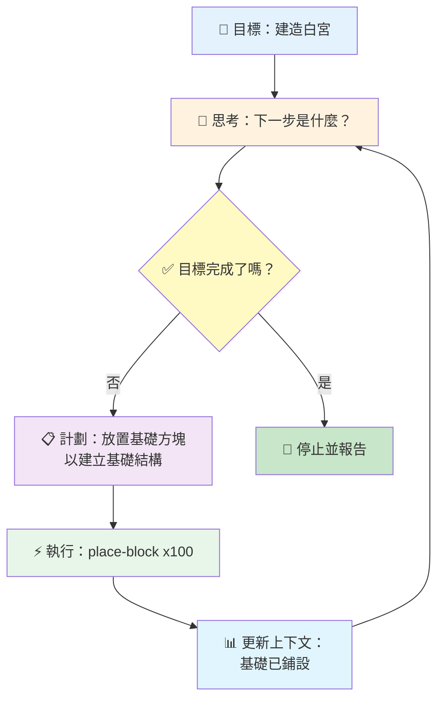

你的隊友們計劃週六進行一場史詩級的 Minecraft 建築活動。然後週五晚上：「抱歉，明天不能來了。」一個接一個，你的朋友們都放鴿子。現在你盯著那個巨大的城堡專案，意識到獨自完成需要好幾週。

如果你的角色可以在你上學時繼續建造呢？或者更好的是——如果 AI 可以透過你的描述來幫你建造呢？歡迎來到遊戲自動化的世界，在這裡你的遊戲夢想成為現實。但首先，讓我們談談如何避免麻煩。

## ⚖️ 法律現實檢查（是的，我們從這裡開始）

!!!warning "🚨 認真說：這可能會讓你陷入麻煩"
    在你自動化任何東西之前，請理解：大多數線上遊戲在其服務條款中明確禁止使用機器人。被抓到意味著：
    
    - **永久帳號封鎖**（再見了，那個 99 級角色）
    - **IP 封鎖**（連新帳號都無法建立）
    - **法律後果**（在某些國家，是的，真的）

### 機器人 = 壞消息的情況

**線上多人遊戲**絕對不能使用自動化：

- MMORPG（魔獸世界、Final Fantasy XIV）
- 競技遊戲（英雄聯盟、特戰英豪、Mobile Legends）
- 有 PvP 的抽卡遊戲（原神、崩壞：星穹鐵道）

為什麼？因為你對真實玩家獲得了不公平的優勢。遊戲公司非常重視這一點——他們有整個團隊在獵捕機器人。

### 各國特定法律

某些國家將遊戲機器人視為：

- **詐欺**（你違反了合約）
- **未經授權的電腦存取**（在極端情況下）
- **虛擬財產竊盜**（如果你在刷物品並出售）

例如，南韓已經起訴過機器人使用者。為了一些虛擬黃金不值得冒這個險，對吧？

### 自動化實際上可以的情況

!!!success "✅ 自動化的安全區域"
    - **單人遊戲**（你的遊戲，你的規則）
    - **允許模組的沙盒遊戲**（Minecraft、Terraria）
    - **有官方 API 支援的遊戲**（某些放置遊戲）
    - **學習用的個人專案**（只是不要連接到線上伺服器）

## 🤖 Android 遊戲自動化：技術分析

Android 是自動化的遊樂場。iOS？那就像試圖在鎖定的主機上改遊戲——可以透過越獄實現，但麻煩得多。

### 方法 1：螢幕錄製與回放

**運作方式：**錄製你的點擊和滑動，然後循環播放。

**工具：**Auto Clicker 應用程式、MacroDroid、ADB（Android Debug Bridge）

**優點：**
- 不需要編碼（對於應用程式）
- 適用於任何遊戲
- 設定簡單（真的只需 5 分鐘）
- 可以用 ADB 編寫複雜的點擊模式腳本

**缺點：**
- UI 稍有變化就會失效
- 無法適應遊戲事件
- 容易被反作弊系統偵測
- 看起來像機器人（每次時間都一樣）

**最適合：**簡單的放置遊戲、每日登入獎勵、節奏遊戲練習

**實際範例：ADB 點擊腳本**

!!!warning "⚖️ 執行此腳本之前"
    **先檢查遊戲的服務條款！**此範例僅供教育目的，應僅用於：
    - **離線單人遊戲**
    - **明確允許自動化的遊戲**
    - **你自己的測試應用程式**
    
    在線上多人遊戲上使用可能導致永久封鎖，並可能違反你所在國家的法律。如有疑問，不要冒險。

這是一個 Windows 批次腳本，可以在你的 Android 螢幕上自動點擊多個位置：

```batch
for /l %%x in (1, 1, 10000) do (
    adb shell "input tap 300 1400 & input tap 400 1400 & input tap 500 1400 & input tap 600 1400 & input tap 700 1400 & input tap 550 1400 & input tap 450 1400 & input tap 350 1400 & input tap 250 1400 & input tap 475 1400 & input tap 375 1400 & input tap 525 1400 & input tap 575 1400"
)
```

此腳本按順序點擊 13 個不同的螢幕位置，重複 10,000 次。非常適合有多個點擊區域的離線遊戲（如節奏遊戲練習模式或允許自動化的放置點擊遊戲）。

**如何設定：**

1. **在 Android 上啟用開發者選項：**
   - 前往設定 → 關於手機
   - 點擊「版本號碼」7 次
   - 你會看到「你現在是開發者了！」

2. **啟用 USB 偵錯：**
   - 設定 → 開發者選項
   - 開啟「USB 偵錯」

3. **在電腦上安裝 ADB：**
   - **Windows：**下載 [Platform Tools](https://developer.android.com/studio/releases/platform-tools)
   - **Mac/Linux：**`brew install android-platform-tools` 或使用套件管理器
   - 解壓縮到資料夾（例如 `C:\adb`）

4. **連接你的手機：**
   - 透過 USB 將手機連接到電腦
   - 在手機上，允許 USB 偵錯提示
   - 測試連接：`adb devices`（應該顯示你的裝置）

5. **找到你的點擊座標：**
   - 設定 → 開發者選項 → 啟用「指標位置」
   - 開啟你的遊戲並記下你想點擊的 X,Y 座標
   - 格式是 `input tap X Y`（例如 `input tap 300 1400`）

6. **建立你的腳本：**
   - **Windows：**儲存為 `auto-tap.bat`
   - **Mac/Linux：**儲存為 `auto-tap.sh` 並執行 `chmod +x auto-tap.sh`

7. **執行它：**
   - **驗證遊戲允許自動化**（檢查服務條款）
   - 在手機上開啟你的遊戲
   - 在電腦上執行腳本
   - 看魔法發生！

**自訂腳本：**

```batch
# 更改循環次數（10000 = 重複次數）
for /l %%x in (1, 1, 10000) do (

# 在點擊之間添加延遲（以毫秒為單位）
adb shell "input tap 300 1400 && sleep 0.1 && input tap 400 1400"

# 添加滑動手勢
adb shell "input swipe 300 1400 300 800 100"
# 格式：swipe startX startY endX endY duration(ms)
```

!!!tip "💡 專業提示"
    - **先測試：**使用小循環次數（如 10）來驗證座標
    - **添加延遲：**某些遊戲會將快速點擊偵測為作弊
    - **螢幕保持開啟：**在開發者選項中啟用「保持喚醒」
    - **無線 ADB：**透過 USB 連接後，執行 `adb tcpip 5555` 然後 `adb connect <phone-ip>:5555` 進行無線自動化

### 方法 2：影像辨識機器人

**運作方式：**機器人「看到」螢幕，識別按鈕/敵人，並做出反應。

**工具：**基於 OpenCV 的腳本、AnkuluaX

**優點：**
- 比錄製更靈活
- 可以處理小的 UI 變化
- 可以根據螢幕上的內容做出決策

**缺點：**
- 需要設定和測試
- 資源密集（快速耗盡電池）
- 仍然可以被複雜的反作弊偵測到
- 不同遊戲需要不同的腳本

**最適合：**農場遊戲、自動戰鬥 RPG

### 方法 3：無障礙服務自動化

**運作方式：**使用 Android 的無障礙功能來讀取和與應用程式互動。

**工具：**Tasker、AutoInput、自訂腳本

**優點：**
- 可以讀取實際的 UI 元素（不只是圖像）
- 比影像辨識更可靠
- 較低的資源使用

**缺點：**
- 設定複雜
- 需要了解 Android UI 結構
- 某些遊戲會封鎖無障礙服務
- 潛在的安全風險（你授予了深度系統存取權限）

**最適合：**具有一致 UI 的遊戲、非競技自動化

### 方法 4：Root 裝置自動化

**運作方式：**完全系統存取 = 完全控制遊戲。

**工具：**Xposed Framework、Magisk 模組、自訂腳本

**優點：**
- 可以自動化任何東西
- 可以繞過某些偵測方法
- 可以修改遊戲行為

**缺點：**
- **使保固失效**
- **重大安全風險**（一個壞應用程式 = 裝置被入侵）
- 許多遊戲拒絕在 root 裝置上執行
- 複雜且有風險的過程
- iOS 等效（越獄）更難且更不穩定

**最適合：**僅限開發者和修補者（認真的，不適合一般使用者）

!!!danger "⚠️ 為什麼 iOS 更難"
    iOS 自動化需要：
    - 越獄（使保固失效、安全風險）
    - 有限的工具可用性
    - 頻繁的 iOS 更新會破壞越獄
    - Apple 積極對抗自動化
    
    如果你認真對待遊戲自動化，請堅持使用 Android。

## 🎮 酷炫部分：MCP 驅動的遊戲自動化

現在我們談論的是未來。忘記點擊按鈕——如果你可以用自然語言控制遊戲呢？

### 什麼是 Agentic AI？

在深入 MCP 之前，讓我們了解是什麼讓這個「魔法」起作用：**Agentic AI**。

傳統 AI：你問，它回答一次，完成。

**Agentic AI：** 你給一個目標，它找出步驟，執行它們，檢查進度，並持續進行直到目標完成。就像有一個不需要微觀管理的 AI 員工。

**Agentic 循環：**



**關鍵概念：**

1. **思考** - LLM 推理：「我下一步應該做什麼？」（花錢）
2. **檢查** - LLM 推理：「我完成了嗎？」（花錢）
3. **計劃** - LLM 推理：「我將放置基礎方塊來建立基礎」（花錢）
4. **執行** - MCP 命令：放置方塊（幾乎免費）
5. **更新上下文** - 記住完成了什麼（用於下一個循環）
6. **重複** - 直到達成目標

這個循環自主運行。你設定一次目標，然後看著它工作。

### 什麼是 MCP？

模型上下文協定（MCP）讓 AI 助手與應用程式互動。可以把它想像成給 agentic AI「雙手」，透過結構化命令來控制遊戲。

### Minecraft + MCP：AI 驅動的遊戲玩法

[Minecraft MCP Server](https://github.com/yuniko-software/minecraft-mcp-server) 專案讓你透過 Claude Desktop 使用自然語言控制 Minecraft。不需要編碼——只需對話。

**實際範例：建造白宮**

**起點：**


**幕後發生的事情：**

你給一個提示：**「建造這個」**（附上白宮圖片）

然後 Claude Desktop 完全接管，自動進行數百次 MCP 工具呼叫：

**你的輸入：**
```
你：「建造這個」[附上白宮圖片]
```

**Claude Desktop（agentic 循環 - 內部過程）：**
```
👁️ 分析圖像：「這是白宮」

--- Agentic 循環迭代 #1 ---
🧠 推理：「建造完成了嗎？否。計劃：放置石英方塊以建立基礎」
⚡ 執行 MCP：get-position、place-block x100
📊 上下文已更新：基礎完成

--- Agentic 循環迭代 #2 ---
🧠 推理：「建造完成了嗎？否。計劃：在基礎上建造牆壁以形成結構」
⚡ 執行 MCP：place-block x200
📊 上下文已更新：牆壁完成

--- Agentic 循環迭代 #3 ---
🧠 推理：「建造完成了嗎？否。計劃：在牆壁上添加玻璃窗以增加真實性」
⚡ 執行 MCP：place-block (glass_pane) x50
📊 上下文已更新：窗戶完成

--- Agentic 循環迭代 #4 ---
🧠 推理：「建造完成了嗎？否。計劃：用樓梯建造屋頂以匹配白宮風格」
⚡ 執行 MCP：place-block (quartz_stairs) x150
📊 上下文已更新：屋頂完成

--- Agentic 循環迭代 #5 ---
🧠 推理：「建造完成了嗎？否。計劃：添加裝飾元素以增強真實感」
⚡ 執行 MCP：place-block (decorations) x30
📊 上下文已更新：裝飾完成

--- Agentic 循環迭代 #6 ---
🧠 推理：「建造完成了嗎？是！所有元素都存在。」
🛑 停止循環 - 未執行 MCP 命令
```

**MCP 工具呼叫（在 UI 中摺疊，但正在發生）：**
```
▶ get-position
  結果：{x: 100, y: 64, z: -60}

▶ place-block (quartz, foundation)
▶ place-block (quartz, foundation)
▶ place-block (quartz, foundation)
  ...（數百個方塊）

▶ place-block (glass_pane, windows)
▶ place-block (glass_pane, windows)
  ...（更多窗戶）

▶ place-block (quartz_stairs, roof)
  ...（屋頂建造）

▶ place-block (decorations)
  ...（最後修飾）
```

**Claude 的回應（你看到的）：**
```
我可以看到這是白宮的圖像。我將在 Minecraft 中建造
一個簡化版本。讓我從建立基礎和主要結構開始。

[自動建造]

我已經完成了白宮，包括：
- 石英方塊的主要結構
- 裝飾柱
- 窗框和窗楣
- 屋頂上的多層圓頂
- 樹木和花園的景觀美化
```

**關鍵點：**你不需要手動說「添加窗戶」或「加高」。Claude 的 agentic 循環自主地：
1. 檢查目標是否完成
2. 決定下一步要建造什麼
3. 執行 MCP 命令
4. 更新其上下文
5. 重複直到確定建造完成
6. 自動停止（不再有 MCP 命令）

!!!anote "📋 高層次規劃 vs 逐步規劃"
    某些智能體工具如 Cline（VS Code 擴充功能）使用不同的方法：它們預先建立高層次計劃並追蹤進度，而不是逐步決定每個步驟。這對於複雜任務可能更有效率。
    
    **範例：**不是 50 個微決策（「放置這個方塊，檢查是否完成，放置下一個方塊...」），Cline 可能：
    1. 建立計劃：「基礎 → 牆壁 → 窗戶 → 屋頂 → 細節」
    2. 追蹤進度：「基礎：100% ✓，牆壁：60%...」
    3. 用較少的 LLM 呼叫執行每個階段
    
    這種方法可以降低成本並提高一致性，儘管它需要更複雜的規劃能力。

**最終結果：**


!!!warning "💰 成本考量：是思考，不是命令"
    **成本來自哪裡：**
    
    - **視覺 API：**~$0.01-0.05（一次性分析圖像）
    - **Agentic 循環迭代：**這是成本累積的地方！💸
      - 每次迭代 = 1 次 LLM 推理
      - 每次推理詢問：「我完成了嗎？如果沒有，下一步是什麼？」
      - 複雜建造 = 許多迭代
      - 範例：白宮可能需要 50-100 次迭代
      - 每次迭代根據處理的 token 數量計費
      - 最後迭代：確定「完成」但不執行 MCP 命令（仍然花錢）
    - **MCP 命令本身：**幾乎免費（只是對本地 Minecraft 的 API 呼叫）
    
    **昂貴的部分是 Claude 的大腦，不是它的手：**
    - 迭代 #1：「未完成。計劃：放置基礎方塊以建立基礎」→ 執行 100 個 place-block 命令
    - 迭代 #2：「未完成。計劃：在基礎上建造牆壁以形成結構」→ 執行 200 個 place-block 命令
    - 迭代 #3：「未完成。計劃：在牆壁上添加窗戶以增加真實性」→ 執行 50 個 place-block 命令
    - 迭代 #50：「完成！所有元素完成。停止。」→ 執行 0 個命令（但推理仍然花錢）
    - 每次迭代 = LLM 處理 = $$$
    
    **管理成本的技巧：**
    - 使用 Claude Desktop 免費層進行測試（有限制）
    - 從小開始：「建造一個簡單的房子」（較少迭代）
    - 複雜建造 = 更多迭代 = 更高成本
    - 白宮範例可能花費 $1-5，取決於細節程度

**你可以使用的可用命令：**

**移動與導航：**
- `get-position` - 我在哪裡？
- `move-to-position` - 前往座標
- `look-at` - 看向特定位置
- `jump` - 跳躍
- `move-in-direction` - 向前/向後移動 X 秒
- `fly-to` - 直接飛到座標（創造模式）

**庫存管理：**
- `list-inventory` - 我有什麼？
- `find-item` - 我的鑽石鎬在哪裡？
- `equip-item` - 裝備劍

**方塊互動：**
- `place-block` - 在座標處放置方塊
- `dig-block` - 在座標處挖掘方塊
- `get-block-info` - 這是什麼方塊？
- `find-block` - 找到最近的鑽石礦石

**實體互動：**
- `find-entity` - 找到最近的殭屍/村民/牛

**通訊：**
- `send-chat` - 在遊戲中發送訊息
- `read-chat` - 讀取最近的玩家訊息

**遊戲狀態：**
- `detect-gamemode` - 我在生存還是創造模式？

**對話範例：**

```
你：「找到最近的橡樹並砍倒它」
Claude：*使用 find-block，移動到樹，挖掘方塊*

你：「在我當前位置建造一個 5x5 的鵝卵石平台」
Claude：*計算位置，放置 25 個方塊*

你：「檢查附近是否有苦力怕」
Claude：*使用 find-entity，報告結果*

你：「飛到座標 100, 64, 200」
Claude：*使用 fly-to 命令*
```

**為什麼這是革命性的：**

- **圖像到建造：**展示一張圖片，獲得一個結構（視覺使用一次）
- **Agentic 自主性：**Claude 在沒有人工干預的情況下決定所有步驟
- **自我終止：**知道工作何時完成並自動停止
- **自然語言：**無需記憶命令語法
- **智能規劃：**將複雜建造分解為邏輯步驟
- **上下文感知：**記住它在先前迭代中建造的內容
- **適應性：**處理意外情況（材料不足？去獲取更多）
- **教育性：**看看 agentic AI 如何分解複雜任務
- **即時反饋：**看到變化在遊戲中即時發生

### 其他 MCP 遊戲可能性

**策略遊戲：**
- 「偵察地圖並報告敵人位置」
- 「建造最佳防禦基地佈局」

**沙盒遊戲：**
- 「建立紅石計算機」
- 「設計連接所有村莊的鐵路系統」

**自動化遊戲（Factorio、Satisfactory）：**
- 「優化我的生產線」
- 「計算 1000 電路/分鐘的資源需求」

!!!tip "💡 學習角度"
    Agentic AI + MCP 遊戲自動化實際上是教育性的：
    - 無需編碼即可學習程式設計概念
    - 了解 agentic AI 循環和決策制定
    - 看看 AI 如何在迭代中維護上下文
    - 練習問題分解
    - 了解何時停止（目標完成偵測）
    - 看到演算法在行動

### 設定 Minecraft MCP Server

**需求：**
- Minecraft Java Edition
- [Claude Desktop](https://claude.ai/download)（免費）
- [Minecraft MCP Server](https://github.com/yuniko-software/minecraft-mcp-server)
- 已安裝 Node.js

**快速設定：**

1. **安裝 MCP 伺服器：**
   ```bash
   git clone https://github.com/yuniko-software/minecraft-mcp-server
   cd minecraft-mcp-server
   npm install
   ```

2. **配置 Claude Desktop：**
   將 MCP 伺服器添加到 Claude 的配置檔案

3. **啟動 Minecraft：**
   開始一個世界（建議使用創造模式進行測試）

4. **啟動 MCP 伺服器：**
   ```bash
   npm start
   ```

5. **與 Claude 對話：**
   開啟 Claude Desktop 並開始給出 Minecraft 命令！

**你的第一個命令：**

```
你：「我在 Minecraft 中的當前位置是什麼？」
Claude：*使用 get-position 命令*
        「你在座標 X: 245, Y: 64, Z: -128」

你：「在這裡建造一個小房子」
Claude：*開始自動放置方塊*
```

魔法在幕後發生——Claude 將你的自然語言翻譯成 MCP 命令，執行它們，並用簡單的英語回報。

## 🎯 底線：負責任地自動化

**做：**
- 自動化單人體驗
- 使用自動化來學習程式設計/AI
- 在沙盒環境中實驗
- 尊重遊戲開發者的規則

**不要：**
- 在競技線上遊戲中使用機器人
- 出售機器人帳號或物品
- 破壞其他玩家的體驗
- 忽略服務條款

**哲學：**

自動化應該增強你的遊戲，而不是取代它。使用機器人跳過無聊的部分，但為自己保留有趣的部分。如果你自動化一切，問問自己：你還在玩嗎？

!!!quote "🎮 最後的想法"
    最好的自動化是那種讓你有更多時間享受你喜歡的遊戲內容的自動化——無論是史詩般的 Boss 戰、創意建造，還是只是與朋友在線上閒逛。

## 探索資源

- **[Minecraft MCP Server](https://github.com/yuniko-software/minecraft-mcp-server)：**使 AI 控制的 Minecraft 成為可能的專案
- **[Claude Desktop](https://claude.ai/download)：**支援 MCP 的免費 AI 助手
- **[MCP 文件](https://modelcontextprotocol.io/)：**了解模型上下文協定
- **Android 自動化：**Tasker、MacroDroid（合法自動化工具）
- **遊戲模組社群：**了解你最喜歡的遊戲中允許什麼

記住：能力越大，責任越大。聰明地玩遊戲，保持合法，最重要的是——玩得開心！🚀
