Your squad planned an epic Minecraft build session for Saturday. Then Friday night hits: "Sorry, can't make it tomorrow." One by one, your friends bail. Now you're staring at that massive castle project, realizing it'll take weeks to build solo.

What if your character could keep building while you're at school? Or better yet—what if an AI could help you build by just describing what you want? Welcome to game automation, where your gaming dreams meet reality. But first, let's talk about staying out of trouble.

## ⚖️ The Legal Reality Check (Yeah, We're Starting Here)

!!!warning "🚨 Real Talk: This Could Get You in Trouble"
    Before you automate anything, understand this: most online games explicitly ban bot usage in their Terms of Service. Getting caught means:
    
    - **Permanent account bans** (bye-bye, that level 99 character)
    - **IP bans** (can't even make a new account)
    - **Legal consequences** in some countries (yes, really)

### When Bots = Bad News

**Online multiplayer games** are a hard NO for automation:

- MMORPGs (World of Warcraft, Final Fantasy XIV)
- Competitive games (League of Legends, Valorant, Mobile Legends)
- Gacha games with PvP (Genshin Impact, Honkai Star Rail)

Why? Because you're gaining unfair advantages over real players. Game companies take this seriously—they have entire teams hunting bots.

### Country-Specific Laws

Some countries treat game botting as:

- **Fraud** (you're violating a contract)
- **Unauthorized computer access** (in extreme cases)
- **Virtual property theft** (if you're farming and selling items)

South Korea, for example, has prosecuted bot users. Not worth it for some virtual gold, right?

### When Automation is Actually Okay

!!!success "✅ Safe Zones for Automation"
    - **Single-player games** (your game, your rules)
    - **Sandbox games** that allow mods (Minecraft, Terraria)
    - **Games with official API support** (some idle games)
    - **Personal projects** for learning (just don't connect to live servers)

## 🤖 Android Game Automation: The Technical Breakdown

Android is the automation playground. iOS? That's like trying to mod a game on a locked console—possible with jailbreak, but way more hassle.

### Method 1: Screen Recording & Playback

**How it works:** Record your taps and swipes, then replay them on loop.

**Tools:** Auto Clicker apps, MacroDroid, ADB (Android Debug Bridge)

**Pros:**
- Zero coding required (for apps)
- Works on any game
- Easy setup (literally 5 minutes)
- Can script complex tap patterns with ADB

**Cons:**
- Breaks if UI changes even slightly
- Can't adapt to game events
- Easily detected by anti-cheat systems
- Looks robotic (same timing every time)

**Best for:** Simple idle games, daily login rewards, rhythm games practice

**Real Example: ADB Tap Script**

!!!warning "⚖️ Before You Run This Script"
    **Check the game's Terms of Service first!** This example is for educational purposes and should only be used on:
    - **Offline single-player games**
    - **Games that explicitly allow automation**
    - **Your own test apps**
    
    Using this on online multiplayer games can result in permanent bans and may violate laws in your country. When in doubt, don't risk it.

Here's a Windows batch script that auto-taps multiple positions on your Android screen:

```batch
for /l %%x in (1, 1, 10000) do (
    adb shell "input tap 300 1400 & input tap 400 1400 & input tap 500 1400 & input tap 600 1400 & input tap 700 1400 & input tap 550 1400 & input tap 450 1400 & input tap 350 1400 & input tap 250 1400 & input tap 475 1400 & input tap 375 1400 & input tap 525 1400 & input tap 575 1400"
)
```

This script taps 13 different screen positions in sequence, repeating 10,000 times. Perfect for offline games with multiple tap zones (like rhythm games practice mode or idle clickers that allow automation).

**How to Set This Up:**

1. **Enable Developer Options on Android:**
   - Go to Settings → About Phone
   - Tap "Build Number" 7 times
   - You'll see "You are now a developer!"

2. **Enable USB Debugging:**
   - Settings → Developer Options
   - Turn on "USB Debugging"

3. **Install ADB on Your Computer:**
   - **Windows:** Download [Platform Tools](https://developer.android.com/studio/releases/platform-tools)
   - **Mac/Linux:** `brew install android-platform-tools` or use package manager
   - Extract to a folder (e.g., `C:\adb`)

4. **Connect Your Phone:**
   - Plug phone into computer via USB
   - On phone, allow USB debugging when prompted
   - Test connection: `adb devices` (should show your device)

5. **Find Your Tap Coordinates:**
   - Settings → Developer Options → Enable "Pointer Location"
   - Open your game and note the X,Y coordinates you want to tap
   - The format is `input tap X Y` (e.g., `input tap 300 1400`)

6. **Create Your Script:**
   - **Windows:** Save as `auto-tap.bat`
   - **Mac/Linux:** Save as `auto-tap.sh` and run `chmod +x auto-tap.sh`

7. **Run It:**
   - **Verify the game allows automation** (check Terms of Service)
   - Open your game on the phone
   - Run the script on your computer
   - Watch the magic happen!

**Customize the Script:**

```batch
# Change loop count (10000 = number of repetitions)
for /l %%x in (1, 1, 10000) do (

# Add delays between taps (in milliseconds)
adb shell "input tap 300 1400 && sleep 0.1 && input tap 400 1400"

# Add swipe gestures
adb shell "input swipe 300 1400 300 800 100"
# Format: swipe startX startY endX endY duration(ms)
```

!!!tip "💡 Pro Tips"
    - **Test first:** Run with a small loop count (like 10) to verify coordinates
    - **Add delays:** Some games detect rapid taps as cheating
    - **Screen stays on:** Enable "Stay Awake" in Developer Options
    - **Wireless ADB:** Once connected via USB, run `adb tcpip 5555` then `adb connect <phone-ip>:5555` for wireless automation

### Method 2: Image Recognition Bots

**How it works:** Bot "sees" the screen, recognizes buttons/enemies, and reacts.

**Tools:** OpenCV-based scripts, AnkuluaX

**Pros:**
- More flexible than recording
- Can handle minor UI changes
- Can make decisions based on what's on screen

**Cons:**
- Requires setup and testing
- Resource-heavy (drains battery fast)
- Still detectable by sophisticated anti-cheat
- Needs different scripts for different games

**Best for:** Farming games, auto-battle RPGs

### Method 3: Accessibility Services Automation

**How it works:** Uses Android's accessibility features to read and interact with apps.

**Tools:** Tasker, AutoInput, custom scripts

**Pros:**
- Can read actual UI elements (not just images)
- More reliable than image recognition
- Lower resource usage

**Cons:**
- Complex to set up
- Requires understanding of Android UI structure
- Some games block accessibility services
- Potential security risks (you're granting deep system access)

**Best for:** Games with consistent UI, non-competitive automation

### Method 4: Rooted Device Automation

**How it works:** Full system access = full control over the game.

**Tools:** Xposed Framework, Magisk modules, custom scripts

**Pros:**
- Can automate literally anything
- Can bypass some detection methods
- Can modify game behavior

**Cons:**
- **Voids warranty**
- **Major security risks** (one bad app = compromised device)
- Many games refuse to run on rooted devices
- Complex and risky process
- iOS equivalent (jailbreak) is even harder and less stable

**Best for:** Developers and tinkerers only (seriously, not for casual users)

!!!danger "⚠️ Why iOS is Harder"
    iOS automation requires:
    - Jailbreaking (voids warranty, security risks)
    - Limited tool availability
    - Frequent iOS updates break jailbreaks
    - Apple actively fights automation
    
    Stick to Android if you're serious about game automation.

## 🎮 The Cool Part: MCP-Powered Game Automation

Now we're talking about the future. Forget clicking buttons—what if you could control games with natural language?

### What is Agentic AI?

Before diving into MCP, let's understand what makes this "magic" work: **Agentic AI**.

Traditional AI: You ask, it answers once, done.

**Agentic AI:** You give a goal, it figures out the steps, executes them, checks progress, and keeps going until the goal is complete. It's like having an AI employee that doesn't need micromanaging.

**The Agentic Loop:**

```mermaid
flowchart TD
    A["🎯 Goal: Build White House"] --> B["🤔 Think: What's next?"]
    B --> C{"✅ Is goal complete?"}
    C -->|"No"| D["📋 Plan: Place foundation blocks<br/>to create base structure"]
    C -->|"Yes"| Z["🎉 Stop & Report"]
    D --> E["⚡ Execute: place-block x100"]
    E --> F["📊 Update Context:<br/>Foundation laid"]
    F --> B
    
    style A fill:#e3f2fd
    style B fill:#fff3e0
    style C fill:#fff9c4
    style D fill:#f3e5f5
    style E fill:#e8f5e9
    style F fill:#e1f5fe
    style Z fill:#c8e6c9
```



**Key Concepts:**

1. **Think** - LLM inference: "What should I do next?" (costs money)
2. **Check** - LLM inference: "Am I done yet?" (costs money)
3. **Plan** - LLM inference: "I'll place foundation blocks to create the base" (costs money)
4. **Execute** - MCP commands: place blocks (nearly free)
5. **Update Context** - Remember what was accomplished (for next loop)
6. **Repeat** - Until goal is achieved

This loop runs autonomously. You set the goal once, then watch it work.

### What is MCP?

Model Context Protocol (MCP) lets AI assistants interact with applications. Think of it as giving an agentic AI "hands" to control games through structured commands.

### Minecraft + MCP: AI-Powered Gameplay

The [Minecraft MCP Server](https://github.com/yuniko-software/minecraft-mcp-server) project lets you control Minecraft through Claude Desktop using natural language. No coding required—just conversation.

**Real Example: Building the White House**


**Starting Point:**


**What Happens Behind the Scenes:**

You give ONE prompt: **"Build this"** (with the White House image)

Then Claude Desktop takes over completely, making hundreds of MCP tool calls automatically:

**Your Input:**
```
You: "Build this" [attach White House image]
```

**Claude Desktop (agentic loop - internal process):**
```
👁️ Analyzes image: "This is the White House"

--- Agentic Loop Iteration #1 ---
🧠 Inference: "Is build complete? No. Plan: Place quartz blocks to create foundation"
⚡ Execute MCP: get-position, place-block x100
📊 Context updated: Foundation complete

--- Agentic Loop Iteration #2 ---
🧠 Inference: "Is build complete? No. Plan: Build walls on foundation to form structure"
⚡ Execute MCP: place-block x200
📊 Context updated: Walls complete

--- Agentic Loop Iteration #3 ---
🧠 Inference: "Is build complete? No. Plan: Add glass pane windows to walls for authenticity"
⚡ Execute MCP: place-block (glass_pane) x50
📊 Context updated: Windows complete

--- Agentic Loop Iteration #4 ---
🧠 Inference: "Is build complete? No. Plan: Construct roof with stairs to match White House style"
⚡ Execute MCP: place-block (quartz_stairs) x150
📊 Context updated: Roof complete

--- Agentic Loop Iteration #5 ---
🧠 Inference: "Is build complete? No. Plan: Add decorative elements to enhance realism"
⚡ Execute MCP: place-block (decorations) x30
📊 Context updated: Decorations complete

--- Agentic Loop Iteration #6 ---
🧠 Inference: "Is build complete? Yes! All elements present."
🛑 Stop loop - No MCP commands executed
```

**MCP Tool Calls (collapsed in UI, but happening):**
```
▶ get-position
  Result: {x: 100, y: 64, z: -60}

▶ place-block (quartz, foundation)
▶ place-block (quartz, foundation)
▶ place-block (quartz, foundation)
  ... (hundreds of blocks)

▶ place-block (glass_pane, windows)
▶ place-block (glass_pane, windows)
  ... (more windows)

▶ place-block (quartz_stairs, roof)
  ... (roof construction)

▶ place-block (decorations)
  ... (final touches)
```

**Claude's Response (what you see):**
```
I can see this is an image of the White House. I'll build 
a simplified version in Minecraft. Let me start by creating 
the foundation and main structure.

[Builds automatically]

I've completed the White House with:
- Main structure with quartz blocks
- Decorative columns
- Window frames and headers
- Multi-level dome cupola on roof
- Landscaping with trees and gardens
```

**Key Point:** You don't manually say "add windows" or "make it taller." Claude's agentic loop autonomously:
1. Checks if the goal is complete
2. Decides what to build next
3. Executes MCP commands
4. Updates its context
5. Repeats until it determines the build is complete
6. Stops automatically (no more MCP commands)

!!!anote "📋 High-Level Planning vs Step-by-Step"
    Some agentic tools like Cline (a VS Code extension) use a different approach: they create a high-level plan upfront and track progress against it, rather than deciding each step individually. This can be more efficient for complex tasks.
    
    **Example:** Instead of 50 micro-decisions ("place this block, check if done, place next block..."), Cline might:
    1. Create plan: "Foundation → Walls → Windows → Roof → Details"
    2. Track progress: "Foundation: 100% ✓, Walls: 60%..."
    3. Execute each phase with fewer LLM calls
    
    This approach can reduce costs and improve consistency, though it requires more sophisticated planning capabilities.

**Final Result:**


!!!warning "💰 Cost Consideration: It's the Thinking, Not the Commands"
    **Where the cost comes from:**
    
    - **Vision API:** ~$0.01-0.05 (one-time to analyze image)
    - **Agentic Loop Iterations:** This is where costs add up! 💸
      - Each iteration = 1 LLM inference
      - Each inference asks: "Am I done? If not, what's next?"
      - Complex builds = many iterations
      - Example: White House might need 50-100 iterations
      - Each iteration costs based on tokens processed
      - Final iteration: Determines "done" but executes no MCP commands (still costs money)
    - **MCP commands themselves:** Nearly free (just API calls to local Minecraft)
    
    **The expensive part is Claude's brain, not its hands:**
    - Iteration #1: "Not done. Plan: Place foundation blocks to create base" → executes 100 place-block commands
    - Iteration #2: "Not done. Plan: Build walls on foundation to form structure" → executes 200 place-block commands  
    - Iteration #3: "Not done. Plan: Add windows to walls for authenticity" → executes 50 place-block commands
    - Iteration #50: "Done! All elements complete. Stop." → executes 0 commands (but inference still costs)
    - Each iteration = LLM processing = $$$
    
    **Tips to manage costs:**
    - Use Claude Desktop free tier for testing (has limits)
    - Start small: "Build a simple house" (fewer iterations)
    - Complex builds = more iterations = higher cost
    - The White House example might cost $1-5 depending on detail level

**Available Commands You Can Use:**

**Movement & Navigation:**
- `get-position` - Where am I?
- `move-to-position` - Go to coordinates
- `look-at` - Look at specific location
- `jump` - Jump
- `move-in-direction` - Move forward/backward for X seconds
- `fly-to` - Fly directly to coordinates (creative mode)

**Inventory Management:**
- `list-inventory` - What do I have?
- `find-item` - Where's my diamond pickaxe?
- `equip-item` - Equip sword

**Block Interaction:**
- `place-block` - Place block at coordinates
- `dig-block` - Mine block at coordinates
- `get-block-info` - What block is this?
- `find-block` - Find nearest diamond ore

**Entity Interaction:**
- `find-entity` - Find nearest zombie/villager/cow

**Communication:**
- `send-chat` - Send message in-game
- `read-chat` - Read recent player messages

**Game State:**
- `detect-gamemode` - Am I in survival or creative?

**Example Conversations:**

```
You: "Find the nearest oak tree and chop it down"
Claude: *uses find-block, moves to tree, digs blocks*

You: "Build a 5x5 cobblestone platform at my current position"
Claude: *calculates positions, places 25 blocks*

You: "Check if there are any creepers nearby"
Claude: *uses find-entity, reports results*

You: "Fly to coordinates 100, 64, 200"
Claude: *uses fly-to command*
```

**Why This is Revolutionary:**

- **Image-to-build:** Show a picture, get a structure (vision used once)
- **Agentic autonomy:** Claude decides all steps without human intervention
- **Self-terminating:** Knows when the job is done and stops automatically
- **Natural language:** No command syntax to memorize
- **Intelligent planning:** Breaks complex builds into logical steps
- **Context-aware:** Remembers what it built in previous iterations
- **Adaptive:** Handles unexpected situations (out of materials? Goes to get more)
- **Educational:** See how agentic AI breaks down complex tasks
- **Real-time feedback:** See changes happen in-game as Claude works

### Other MCP Gaming Possibilities

**Strategy Games:**
- "Scout the map and report enemy positions"
- "Build optimal base layout for defense"

**Sandbox Games:**
- "Create a redstone calculator"
- "Design a railway system connecting all villages"

**Automation Games (Factorio, Satisfactory):**
- "Optimize my production line"
- "Calculate resource requirements for 1000 circuits/min"

!!!tip "💡 The Learning Angle"
    Agentic AI + MCP game automation is actually educational:
    - Learn programming concepts without code
    - Understand agentic AI loops and decision-making
    - See how AI maintains context across iterations
    - Practice problem decomposition
    - Understand when to stop (goal completion detection)
    - See algorithms in action

### Setting Up Minecraft MCP Server

**Requirements:**
- Minecraft Java Edition
- [Claude Desktop](https://claude.ai/download) (free)
- [Minecraft MCP Server](https://github.com/yuniko-software/minecraft-mcp-server)
- Node.js installed

**Quick Setup:**

1. **Install the MCP server:**
   ```bash
   git clone https://github.com/yuniko-software/minecraft-mcp-server
   cd minecraft-mcp-server
   npm install
   ```

2. **Configure Claude Desktop:**
   Add the MCP server to Claude's config file

3. **Launch Minecraft:**
   Start a world (creative mode recommended for testing)

4. **Start the MCP server:**
   ```bash
   npm start
   ```

5. **Talk to Claude:**
   Open Claude Desktop and start giving Minecraft commands!

**Your First Command:**

```
You: "What's my current position in Minecraft?"
Claude: *uses get-position command*
        "You're at coordinates X: 245, Y: 64, Z: -128"

You: "Build a small house here"
Claude: *starts placing blocks automatically*
```

The magic happens behind the scenes—Claude translates your natural language into MCP commands, executes them, and reports back in plain English.

## 🎯 The Bottom Line: Automate Responsibly

**Do:**
- Automate single-player experiences
- Use automation to learn programming/AI
- Experiment in sandbox environments
- Respect game developers' rules

**Don't:**
- Bot in competitive online games
- Sell botted accounts or items
- Ruin other players' experiences
- Ignore Terms of Service

**The Philosophy:**

Automation should enhance your gaming, not replace it. Use bots to skip the boring parts, but keep the fun parts for yourself. If you're automating everything, ask yourself: are you even playing anymore?

!!!quote "🎮 Final Thought"
    The best automation is the kind that gives you more time to enjoy what you love about gaming—whether that's epic boss fights, creative building, or just hanging with friends online.

## Resources to Explore

- **[Minecraft MCP Server](https://github.com/yuniko-software/minecraft-mcp-server):** The project that makes AI-controlled Minecraft possible
- **[Claude Desktop](https://claude.ai/download):** Free AI assistant with MCP support
- **[MCP Documentation](https://modelcontextprotocol.io/):** Learn about Model Context Protocol
- **Android Automation:** Tasker, MacroDroid (legal automation tools)
- **Game Modding Communities:** Learn what's allowed in your favorite games

Remember: with great automation comes great responsibility. Game smart, stay legal, and most importantly—have fun! 🚀
