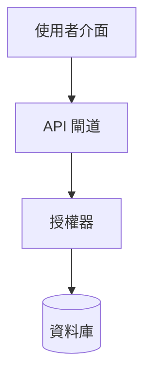
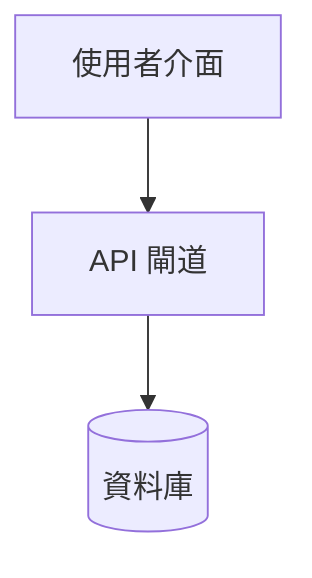

# 架構即程式碼：第一部分 - 革命的開端

*這是我們探索架構即程式碼的七部曲系列的第一部分。每篇文章都講述這個變革之旅的不同章節。*

## 一切改變的那一天

想像你是一家快速成長的金融科技新創公司的軟體架構師。你的團隊從一個簡單的單體應用程式開始，但現在你正在為數百萬用戶提供複雜的微服務、API 和資料管道。你六個月前繪製的架構圖？它們正在共享硬碟中積灰塵，早已過時。

你的開發人員正在即興做決策——新增服務、建立資料庫、實作模式——沒有人真正追蹤這一切如何組合在一起。程式碼審查專注於語法和錯誤，但沒有人問：「這符合我們的架構願景嗎？」

聽起來很熟悉？這種情況在全球各地的公司中上演，這正是催生**架構即程式碼（AaC）**的完美風暴。

!!!warning "⚠️ 架構漂移的代價"
    當架構文件與現實脫節時，團隊會做出不明智的決策，安全漏洞會溜過去，技術債務會默默累積。預期設計與實際實作之間的差距可能會讓組織花費數月的重構工作。

## 從靜態圖表到活生生的系統

傳統軟體架構存在一個根本缺陷：它與現實脫節。架構師會花費數週時間使用 Visio 或 draw.io 等工具建立漂亮的圖表。他們會撰寫詳細的文件描述層次、元件和互動。但以下是發生的事情：

1. **圖表在建立後幾週內就過時了**
2. **實作偏離了**預期的設計
3. **決策是隱式做出的**而不是明確的
4. **驗證是手動的**且不頻繁
5. **文件變得陳舊**且不可信

**圖 1：預期的架構設計（帶授權器的 API 閘道）**

**圖 2：實際實作（現實 - 缺少授權器）**

這些圖表說明了一個常見的真實世界情境，其中安全架構與實作脫節。在圖 1 中，架構師的設計包含一個適當的安全層，其中包含一個授權器元件，在允許資料庫存取之前驗證使用者權限。然而，在圖 2 中，實際實作繞過了這個關鍵的安全元件，建立了一個漏洞，其中 API 閘道直接連接到資料庫而沒有適當的授權檢查。這種架構漂移在傳統文件方法中可能不會被注意到，可能導致生產系統中的嚴重安全漏洞。

!!!info "💡 AaC vs IaC：有什麼區別？"
    基礎設施即程式碼（IaC）定義如何配置伺服器、網路和雲端資源。架構即程式碼（AaC）定義軟體元件如何互動、遵循什麼模式以及強制執行什麼約束。IaC 是關於基礎設施的「在哪裡」和「是什麼」；AaC 是關於軟體設計的「如何」和「為什麼」。

然後出現了基礎設施即程式碼（IaC），使用 Terraform 和 CloudFormation 等工具。突然間，基礎設施不僅僅是被記錄——它被編碼、版本控制和自動化。如果我們能對軟體架構做同樣的事情呢？

## AaC 宣言

架構即程式碼不僅僅是用程式碼繪製圖表。這是我們思考軟體設計方式的根本轉變：

**架構成為程式碼**

與其用自然語言或靜態圖表描述你的系統，你以程式化方式定義它。元件、關係、模式和約束成為機器可讀的工件。

**決策變得明確**

每個架構選擇——從「我們使用微服務」到「所有服務必須有斷路器」——都被捕獲為可以驗證和強制執行的程式碼。

**驗證變得自動化**

不再需要手動審查來檢查實作是否符合架構。自動化工具可以作為 CI/CD 管道的一部分驗證合規性。

**文件保持最新**
由於你的架構是程式碼，文件可以自動生成，確保它始終反映系統的當前狀態。

## 第一個火花：基礎設施即程式碼的啟發

AaC 運動從 IaC 的成功中汲取了大量靈感。還記得基礎設施團隊手動配置伺服器的時候嗎？這容易出錯、緩慢且不一致。然後 IaC 出現了：

- **版本控制**：基礎設施變更變得可追蹤
- **自動化**：部署變得可重複且可靠
- **協作**：基礎設施成為團隊運動
- **測試**：你可以在應用基礎設施變更之前測試它們

AaC 將這些相同的原則應用於架構層級。就像 IaC 使基礎設施可程式化一樣，AaC 使架構可程式化。

## 新的工作方式

讓我們看看 AaC 如何改變架構師和開發人員的日常工作流程：

### AaC 之前
- 架構師孤立地建立圖表
- 在 Word/PDF 檔案中記錄決策
- 在設計階段進行手動審查
- 實作漂移未被注意到
- 重構成為猜謎遊戲

### 使用 AaC
- 架構以程式碼形式協作定義
- 決策在版本控制中捕獲
- 每次提交時自動驗證
- 立即檢測並警告漂移
- 重構由架構規則指導

## 轉型的承諾

架構即程式碼承諾解決軟體工程中一些最持久的問題：

- **一致性**：所有團隊遵循相同的架構模式
- **品質**：自動檢查防止架構反模式
- **速度**：團隊可以按照既定模式搭建新元件
- **演化**：系統可以適應同時保持架構完整性
- **治理**：組織可以強制執行標準而不需要微觀管理

!!!tip "🎯 何時採用 AaC"
    在以下情況下考慮架構即程式碼：你的系統有 10 個以上的微服務、多個團隊在同一個程式碼庫上工作、架構決策經常被違反、新開發人員入職需要數週時間，或者你正在努力維護服務之間的一致性。

## 真實世界的覺醒

考慮一個採用 AaC 的大型電子商務平台的故事。他們的單體應用程式已經成長到數百萬行程式碼，架構決策分散在 wiki、電子郵件和部落知識中。當他們開始將架構定義為程式碼時：

- 他們發現了 47 個未記錄的服務，這些服務沒有遵循任何標準模式
- 自動驗證在架構違規到達生產環境之前捕獲它們
- 新團隊成員可以通過閱讀程式碼而不是文件來理解系統架構
- 重構由架構規則指導而不是猜測

## 接下來是什麼

在這個系列中，我們將探索架構即程式碼如何轉變軟體開發的每個方面。在第二部分中，我們將深入探討使 AaC 工作的核心原則以及它提供的實際好處。

*你在當前專案中面臨什麼架構挑戰？在下面的評論中分享！*
