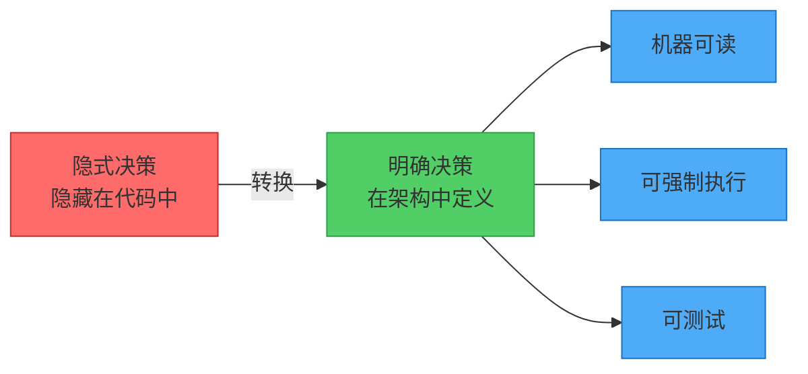
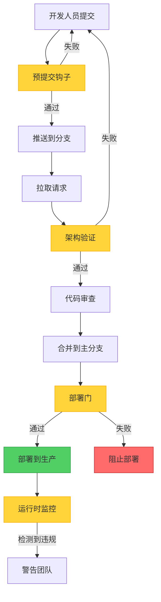
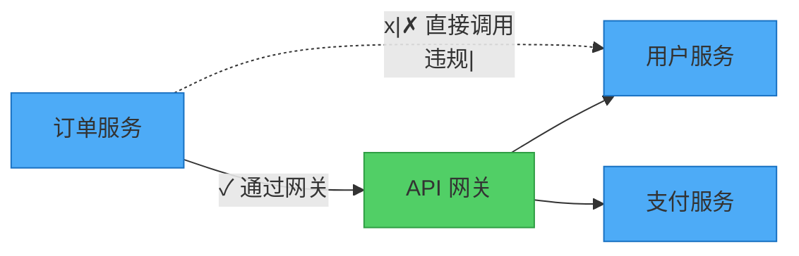

# 架构即代码：第二部分 - 建立基础

*这是我们探索架构即代码（AaC）的七部曲系列的第二部分。[阅读第一部分](../Architecture_As_Code_Part_1_The_Revolution_Begins)了解 AaC 如何从传统架构的局限性中出现。*

## 架构急诊室

想象一下：凌晨 2 点，你的生产系统宕机了。当你深入研究代码时，你意识到根本原因是一个简单的架构违规——一个服务直接调用另一个服务，而不是通过你六个月前设计的 API 网关。

问题？没有人强制执行那个架构规则。它被记录在一个没有人再阅读的 PDF 中。这个违规在代码审查中溜过去了，因为审查者专注于功能，而不是架构。

这种噩梦般的情景太常见了，但架构即代码提供了防止它的基础。在这篇文章中，我们将探索使 AaC 工作的核心原则以及它提供的具体好处。

## 核心原则 1：明确的架构决策

架构即代码的第一个原则是使架构决策明确且机器可读。与其将决策隐藏在文档或部落知识中，你将它们捕获为代码。

### 从隐式到明确

**AaC 之前：**
```javascript
// 某处的某个服务
const userService = new UserService();
const order = userService.getUserOrders(userId); // 直接耦合 - 架构违规？
```

**使用 AaC：**
```yaml
# architecture.yml
services:
  order-service:
    dependencies:
      - user-service
    communication:
      - through: api-gateway
      - pattern: mediator
```

现在架构约束是明确的且可强制执行的。



### AaC 中的决策类型

!!!info "📋 架构决策的类型"
    架构即代码捕获不同类型的决策：
    
    - **结构决策**：组件如何组织和连接
    - **行为决策**：组件如何交互和通信
    - **质量决策**：性能、安全性和可扩展性要求
    - **技术决策**：使用哪些框架、数据库和工具
    - **治理决策**：标准、模式和合规规则

## 核心原则 2：版本控制和协作

通过将架构表示为代码，团队可以利用版本控制系统的全部功能。这将架构从孤立的活动转变为协作的、可追踪的过程。

### 架构作为团队运动

!!!success "✅ 架构版本控制的好处"
    版本控制使能：
    
    - **可追溯性**：每个架构变更都通过提交消息和责任信息进行追踪
    - **可审查性**：架构变更的拉取请求允许团队输入和批准
    - **可回滚性**：糟糕的架构决策可以像任何代码变更一样回滚
    - **分支**：团队可以安全地尝试架构替代方案

### 协作架构设计

```bash
# 架构变更变得协作
git checkout -b feature/new-microservice-architecture
# 对架构文件进行更改
git add architecture/
git commit -m "为用户通知添加事件驱动架构"
git push origin feature/new-microservice-architecture
# 创建拉取请求供团队审查
```

## 核心原则 3：自动验证和测试

架构即代码使架构合规性的自动验证成为可能。这将架构治理从手动审查转变为自动检查。

### 架构测试套件

就像你为代码编写单元测试一样，你可以为架构编写测试：

```javascript
// 架构测试示例
describe('微服务架构', () => {
  it('不应允许直接的服务到服务通信', () => {
    const violations = validateArchitecture(architectureModel);
    expect(violations.directCommunication).toBeEmpty();
  });

  it('应该要求外部依赖项的断路器', () => {
    const services = getServicesWithExternalDeps(architectureModel);
    services.forEach(service => {
      expect(service.hasCircuitBreaker).toBe(true);
    });
  });
});
```

### 持续架构验证

!!!tip "🔄 CI/CD 集成点"
    自动验证作为 CI/CD 管道的一部分运行：
    
    1. **预提交钩子**：在每次提交时检查架构
    2. **拉取请求验证**：合并前的自动检查
    3. **部署门**：生产部署前的架构合规性
    4. **运行时监控**：生产中的持续验证



## 核心原则 4：活文档

与变得陈旧的传统文档不同，架构即代码生成与实际系统保持同步的活文档。

### 自动生成的文档

从你的架构代码中，你可以生成：
- 反映当前系统状态的**交互式图表**
- 基于定义的服务接口的 **API 文档**
- 显示服务关系的**依赖图**
- 监管要求的**合规报告**
- 链接到代码变更的**架构决策记录**（ADR）

### 始终保持最新

由于文档是从代码生成的：
- 它自动反映当前架构
- 变更在版本控制中追踪
- 可以生成多种格式（HTML、PDF、图表）
- 它始终准确（不需要手动维护）

## 好处：为什么重要

通过这四个核心原则的协同工作——明确决策、版本控制、自动验证和活文档——架构即代码在整个软件开发生命周期中提供了令人信服的优势。



### 改进的一致性和质量

通过将架构模式定义为可重用的代码模板，团队确保设计原则的一致应用：

- **标准化模式**：所有微服务遵循相同的结构
- **质量门**：自动检查防止架构反模式
- **减少技术债务**：违规被及早捕获
- **更快的入职**：新团队成员立即理解模式

### 增强的协作和沟通

AaC 促进架构师、开发人员和利益相关者之间更好的沟通：

- **共同理解**：代码提供明确的规范
- **协作设计**：架构通过代码审查演化
- **利益相关者参与**：非技术利益相关者可以审查架构变更
- **减少误解**：代码比自然语言更精确

### 加速开发和部署

自动化架构验证和代码生成加速开发周期：

- **快速搭建**：新组件遵循既定模式
- **自动验证**：无需手动架构审查
- **更快的反馈**：即时验证结果
- **减少样板代码**：模板生成一致的代码

### 可扩展性和可维护性

随着系统的增长，维护架构一致性变得越来越具有挑战性：

- **企业规模**：跨多个团队和项目的治理
- **演化支持**：架构适应同时保持完整性
- **自动治理**：标准强制执行而不需要微观管理
- **长期维护**：架构决策保持最新且可强制执行

## 真实世界的影响：数字不会说谎

采用 AaC 的组织报告了显著的改进：

- **85% 的减少**在到达生产的架构违规中
- **40% 更快**的新功能上市时间
- **60% 的改进**在跨团队的架构一致性中
- **50% 的减少**在技术债务累积中
- **30% 的增加**在团队生产力中

## 基础已经奠定

这些核心原则——明确决策、版本控制、自动验证和活文档——构成了架构即代码的基础。它们将架构从抽象概念转变为实用的、可强制执行的学科。

在第三部分中，我们将探索这些原则如何在整个软件开发生命周期中实现深度自动化，从持续验证到自动重构。

!!!question "💭 反思你的经验"
    - 这四个原则中哪一个对你当前的项目影响最大？
    - 你是否经历过"凌晨 2 点架构违规"的情景？
    - 是什么阻止你的团队采用自动化架构验证？
    
    在下面的评论中分享你的想法和经验！
