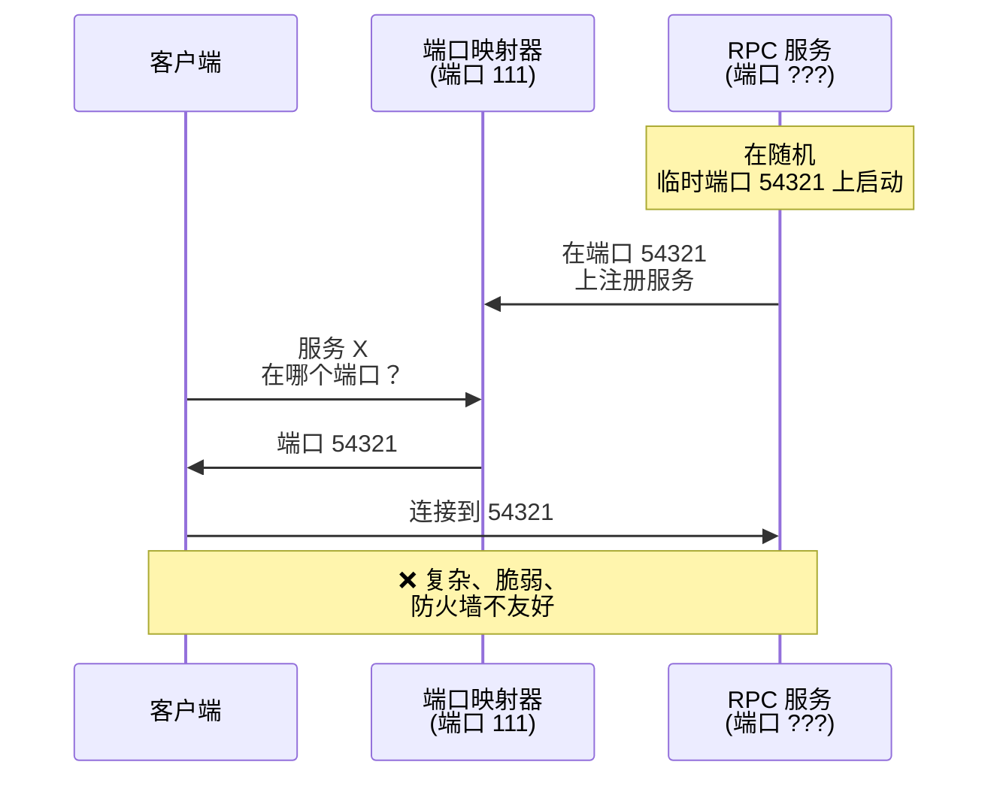
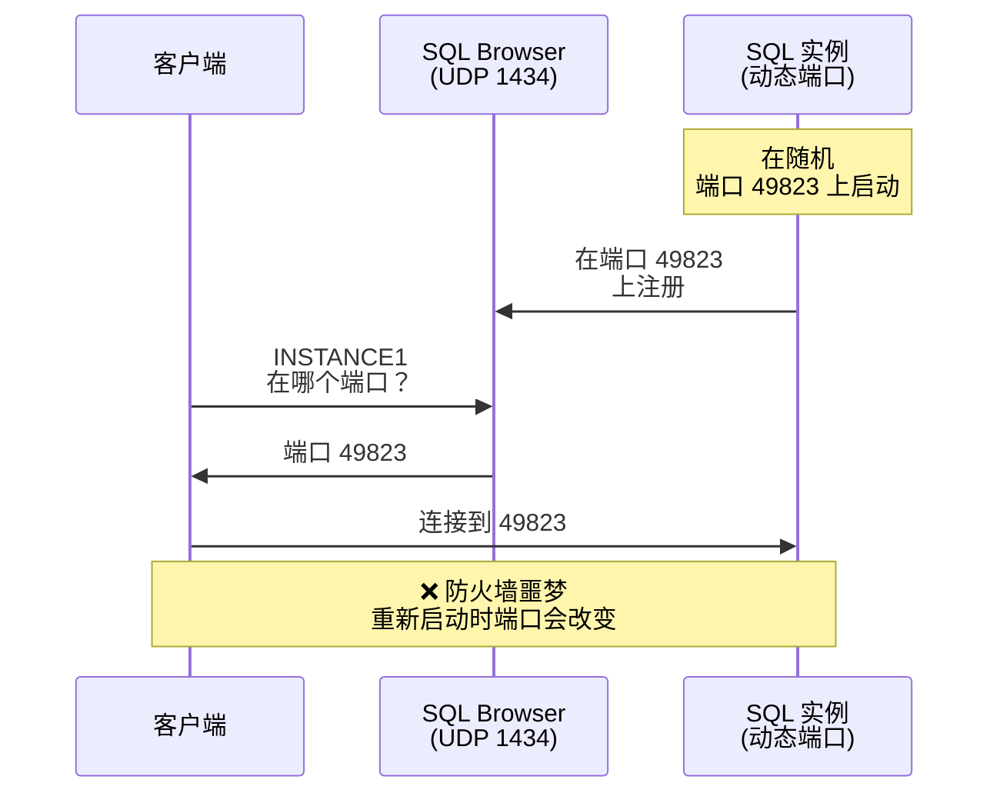
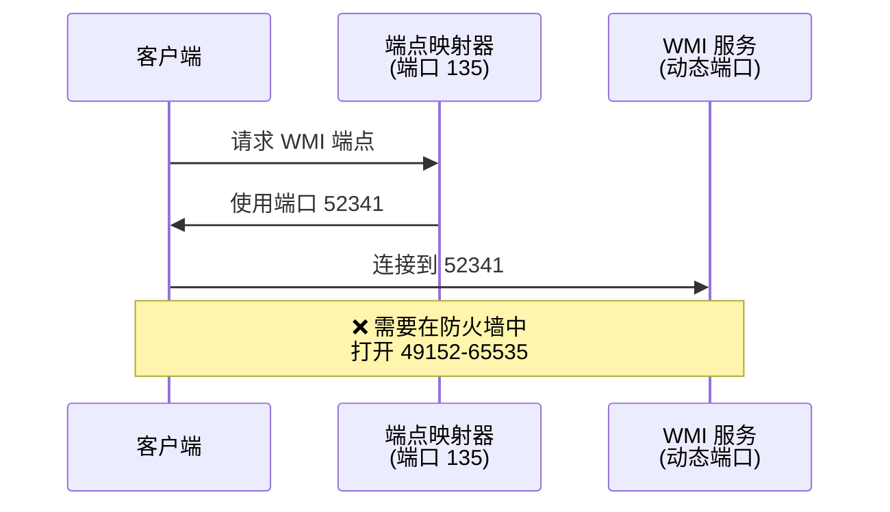
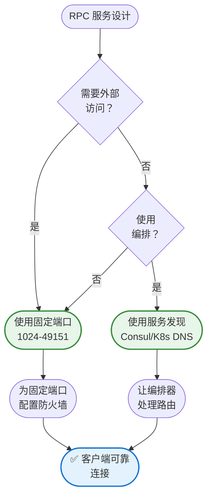

在 [Part 1](/zh-CN/2025/08/Understanding_Ephemeral_Ports_Part1/) 中，我们探讨了临时端口如何从客户端角度运作——当应用程序发起对外连接时，操作系统会自动分配的临时端口。这对客户端来说运作得很完美，因为它们不需要被发现；它们确切知道要连接到哪个服务器和端口。

但当服务器应用程序在临时端口范围内使用动态端口时会发生什么？这会产生一个根本问题：**客户端无法找到服务**。如果你的数据库服务器今天在端口 54321 上启动，明天在端口 49876 上启动，客户端如何知道要连接到哪里？

这就是**服务器应用程序动态端口分配**的挑战，在 RPC（远程过程调用）系统和数据库命名实例中特别常见。在本文中，我们将探讨为什么这种方法会造成问题，以及如何通过静态端口配置来解决它们。

## RPC 挑战：当临时端口不适用时

远程过程调用（RPC）服务在临时端口的世界中呈现出独特的挑战。与典型的客户端-服务器应用程序不同（客户端使用临时端口，服务器监听众所周知的端口），传统的 RPC 系统通常会动态分配端口给服务——这会产生发现问题。

### 为什么 RPC 服务不应使用临时端口

RPC 服务需要可被发现。当客户端想要调用远程过程时，它需要知道服务正在监听哪个端口。如果服务使用每次重新启动都会改变的临时端口，客户端就无法找到它。

**传统 RPC 问题**：
1. RPC 服务启动并绑定到随机临时端口（例如 54321）
2. 客户端想要连接但不知道要使用哪个端口
3. 客户端必须查询端口映射器/端点映射器服务来发现端口
4. 这增加了复杂性、延迟和潜在的故障点



### 服务器应用程序使用动态端口的问题

**1. 防火墙配置噩梦**

你必须在防火墙中打开整个临时端口范围（可能超过 16,000 个端口），造成巨大的安全暴露。

**2. 重新启动时端口会改变**

每次服务重新启动时，它都会获得不同的端口。连接字符串、防火墙规则和监控工具必须动态适应。

**3. 负载均衡器复杂性**

负载均衡器和代理服务器难以处理动态端口。它们需要静态目标来进行健康检查和路由。

**4. 故障排除困难**

当端口不断变化时，诊断连接问题变得更加困难。网络跟踪和日志每次都显示不同的端口。

**5. 安全审计挑战**

当端口动态变化时，安全团队无法审计哪些服务被暴露。合规要求通常要求固定、有文档记录的端口。

## 真实案例：Microsoft SQL Server 命名实例

Microsoft SQL Server 提供了一个完美的例子，说明为什么临时端口会造成问题，以及为什么静态端口是解决方案。

### 动态端口的问题

SQL Server 命名实例（例如 `SERVER\INSTANCE1`）默认使用动态端口。当命名实例启动时，它会绑定到可用的临时端口。客户端通过查询 UDP 端口 1434 上的 SQL Server Browser 服务来发现此端口。



### 为什么这会造成问题

1. **防火墙配置**：你必须在防火墙中打开 UDP 1434 和整个临时端口范围（49152-65535）
2. **安全风险**：打开数千个端口会增加攻击面
3. **端口变更**：每次实例重新启动时端口都会改变
4. **网络复杂性**：负载均衡器和代理服务器难以处理动态端口
5. **故障排除**：当端口不断变化时，诊断连接问题变得困难

### 解决方案：静态端口配置

配置命名实例使用静态端口，消除端口发现的需求。

**逐步配置：**

1. 打开 SQL Server Configuration Manager
2. 导航至 SQL Server Network Configuration > Protocols for [INSTANCE]
3. 右键点击 TCP/IP > Properties > IP Addresses 标签
4. 滚动到 IPAll 区段
5. 将 TCP Port 设置为静态值（例如 1435）
6. 清除 TCP Dynamic Ports 字段（设置为空白）
7. 重新启动 SQL Server 实例

!!!tip "🎯 SQL Server 端口分配策略"
    系统化地分配静态端口：
    - **默认实例**：1433（标准）
    - **命名实例 1**：1434
    - **命名实例 2**：1435
    - **命名实例 3**：1436
    
    在基础设施文档中记录端口分配。

### 连接字符串变更

```csharp
// 之前（动态端口 - 需要 SQL Browser）
string connString = "Server=MYSERVER\\INSTANCE1;Database=MyDB;";

// 之后（静态端口 - 不需要 SQL Browser）
string connString = "Server=MYSERVER,1435;Database=MyDB;";
// 或
string connString = "Server=MYSERVER:1435;Database=MyDB;";
```

### 防火墙配置

```powershell
# 之前：必须打开 UDP 1434 + 整个临时端口范围
New-NetFirewallRule -DisplayName "SQL Browser" -Direction Inbound -Protocol UDP -LocalPort 1434 -Action Allow
New-NetFirewallRule -DisplayName "SQL Dynamic Ports" -Direction Inbound -Protocol TCP -LocalPort 49152-65535 -Action Allow

# 之后：只打开特定的静态端口
New-NetFirewallRule -DisplayName "SQL INSTANCE1" -Direction Inbound -Protocol TCP -LocalPort 1435 -Action Allow
```

### 优势比较

| 配置 | 动态端口 | 静态端口 |
|------|--------|--------|
| **防火墙规则** | UDP 1434 + TCP 49152-65535 | 仅 TCP 1435 |
| **SQL Browser** | 必需 | 不需要 |
| **端口变更** | 每次重新启动 | 永不 |
| **安全性** | ❌ 大攻击面 | ✅ 最小暴露 |
| **故障排除** | ❌ 复杂 | ✅ 简单 |
| **负载均衡器** | ❌ 困难 | ✅ 容易 |
| **建议** | ❌ 避免 | ✅ 始终使用 |

!!!warning "⚠️ 常见错误"
    配置静态端口后，许多管理员忘记更新连接字符串。除非你在连接字符串中明确指定端口，否则客户端仍会尝试使用 SQL Browser（UDP 1434）：
    
    ```
    ❌ Server=MYSERVER\INSTANCE1  (仍使用 SQL Browser)
    ✅ Server=MYSERVER,1435        (直接使用静态端口)
    ```

## Windows RPC 和 WMI：配置静态端口

Windows Management Instrumentation（WMI）和其他 Windows RPC 服务也受到动态端口问题的困扰。默认情况下，它们使用整个临时端口范围，使防火墙配置变得具有挑战性。

### WMI 动态端口问题

WMI 使用 DCOM（分布式 COM），它依赖于 RPC。默认情况下：
- 初始连接使用端口 135（RPC Endpoint Mapper）
- 实际的 WMI 通信使用 49152-65535 范围内的随机端口
- 防火墙必须允许整个范围才能让 WMI 运作



### 解决方案：限制 RPC 动态端口范围

Windows 允许将 RPC 动态端口限制在特定的较小范围内：

```powershell
# 将 RPC 动态端口范围设置为 50000-50099（100 个端口）
netsh int ipv4 set dynamicport tcp start=50000 num=100
netsh int ipv4 set dynamicport udp start=50000 num=100

# 验证设置
netsh int ipv4 show dynamicport tcp
netsh int ipv4 show dynamicport udp

# 重新启动 WMI 服务以应用更改
Restart-Service Winmgmt -Force
```

### 配置 WMI 使用固定端口

为了更严格的控制，配置 WMI 使用特定的固定端口：

```powershell
# 将 WMI 设置为使用固定端口 24158
winmgmt /standalonehost

# 配置 DCOM 端口
$reg = [Microsoft.Win32.RegistryKey]::OpenRemoteBaseKey('LocalMachine', $env:COMPUTERNAME)
$regKey = $reg.OpenSubKey("SOFTWARE\Microsoft\Rpc\Internet", $true)
$regKey.SetValue("Ports", "50000-50099", [Microsoft.Win32.RegistryValueKind]::MultiString)
$regKey.SetValue("PortsInternetAvailable", "Y", [Microsoft.Win32.RegistryValueKind]::String)
$regKey.SetValue("UseInternetPorts", "Y", [Microsoft.Win32.RegistryValueKind]::String)

# 重新启动 WMI
Restart-Service Winmgmt -Force
```

### WMI 的防火墙配置

```powershell
# 允许 RPC Endpoint Mapper
New-NetFirewallRule -DisplayName "RPC Endpoint Mapper" -Direction Inbound -Protocol TCP -LocalPort 135 -Action Allow

# 允许受限的 RPC 动态端口范围
New-NetFirewallRule -DisplayName "RPC Dynamic Ports" -Direction Inbound -Protocol TCP -LocalPort 50000-50099 -Action Allow

# 允许 WMI-In
New-NetFirewallRule -DisplayName "WMI-In" -Direction Inbound -Program "%SystemRoot%\System32\svchost.exe" -Service Winmgmt -Action Allow
```

!!!warning "⚠️ 生产环境考量"
    限制 RPC 端口范围时：
    - 首先在非生产环境中彻底测试
    - 确保范围有足够的端口供你的工作负载使用
    - 监控"端口耗尽"错误
    - 为未来的管理员记录配置
    - 考虑对其他基于 RPC 的服务的影响

## RPC 服务的解决方案

除了 SQL Server 和 WMI 之外，以下是任何需要避免临时端口的 RPC 服务的一般解决方案。

### 1. 使用固定的众所周知端口

最简单且最可靠的解决方案：为你的 RPC 服务分配临时端口范围之外的固定端口号。

```python
# gRPC 示例：固定端口
import grpc
from concurrent import futures

server = grpc.server(futures.ThreadPoolExecutor(max_workers=10))
server.add_insecure_port('[::]:50051')  # 固定端口，非临时端口
server.start()
```

```yaml
# Kubernetes Service：固定端口
apiVersion: v1
kind: Service
metadata:
  name: grpc-service
spec:
  ports:
  - port: 50051        # 固定端口
    targetPort: 50051
    protocol: TCP
  selector:
    app: grpc-server
```

**优势**：
- 客户端始终知道要连接到哪里
- 防火墙规则简单明了
- 不需要端口发现机制
- 跨重新启动可靠运作

!!!tip "🎯 RPC 服务的端口选择"
    在注册端口范围（1024-49151）中选择端口或与你的组织协调：
    - **gRPC**：通常使用 50051
    - **Thrift**：通常使用 9090
    - **自定义 RPC**：从 10000-49151 中选择
    - **避免**：0-1023（需要 root）、49152+（临时端口范围）

### 2. 使用服务发现

现代微服务架构使用服务发现系统，完全抽象化端口号。

```python
# Consul 服务注册
import consul

c = consul.Consul()
c.agent.service.register(
    name='my-rpc-service',
    service_id='my-rpc-service-1',
    address='10.0.1.5',
    port=50051,
    tags=['rpc', 'v1']
)

# 客户端发现服务
services = c.health.service('my-rpc-service', passing=True)
service_address = services[1][0]['Service']['Address']
service_port = services[1][0]['Service']['Port']
```

**服务发现选项**：
- **Consul**：具有健康检查的全功能服务网格
- **etcd**：用于服务注册的分布式键值存储
- **Kubernetes DNS**：K8s 集群的内置服务发现
- **Eureka**：Netflix 的服务注册表
- **ZooKeeper**：分布式协调服务

### 3. 使用具有固定端点的负载均衡器

在 RPC 服务前放置负载均衡器。负载均衡器监听固定端口，而后端服务可以使用任何端口。

```yaml
# AWS Application Load Balancer for gRPC
listener:
  port: 50051
  protocol: HTTP2
  targets:
    - target: backend-1:54321  # 后端可以使用任何端口
    - target: backend-2:54322
    - target: backend-3:54323
```

### 4. 容器编排端口映射

在容器化环境中，将容器端口映射到固定的主机端口：

```yaml
# Docker Compose
services:
  rpc-service:
    image: my-rpc-service
    ports:
      - "50051:50051"  # 主机:容器 - 两者都固定
```

```yaml
# Kubernetes
apiVersion: v1
kind: Pod
metadata:
  name: rpc-service
spec:
  containers:
  - name: rpc
    image: my-rpc-service
    ports:
    - containerPort: 50051
      name: grpc
```

## RPC 最佳实践摘要



## 旧版 RPC 系统

较旧的 RPC 系统由于依赖端口映射器和动态端口而呈现特殊挑战。

!!!warning "⚠️ 旧版 RPC 系统"
    较旧的 RPC 系统（Sun RPC、Microsoft RPC/DCOM）使用端口映射器和动态端口，造成安全和防火墙挑战：
    
    - **Sun RPC**：在端口 111 上使用 portmapper，服务绑定到随机端口
    - **Microsoft RPC**：在端口 135 上使用端点映射器，动态端口范围 49152-65535
    - **NFS**：使用多个具有动态端口的服务
    
    **现代替代方案**：
    - 迁移到具有固定端口的 gRPC、Thrift 或 REST API
    - 如果无法迁移，使用 VPN 或限制在内部网络
    - 配置 Windows RPC 使用受限的端口范围（如上所示）
    - 使用理解 RPC 协议的应用层网关

## 高流量服务器的高级调整

对于进行许多对外连接的服务器（作为客户端使用临时端口），可能需要额外的调整。

### 扩展临时端口范围

```bash
# Linux：扩展临时端口范围
sudo sysctl -w net.ipv4.ip_local_port_range="10000 65535"

# 通过添加到 /etc/sysctl.conf 使其永久生效
echo "net.ipv4.ip_local_port_range = 10000 65535" | sudo tee -a /etc/sysctl.conf
```

!!!warning "⚠️ 更改端口范围时的注意事项"
    在扩展临时端口范围之前：
    - 验证新范围中没有服务监听端口
    - 更新防火墙规则以允许扩展的范围
    - 在非生产环境中彻底测试
    - 记录更改以供未来故障排除

### 优化 TIME_WAIT 持续时间

处于 TIME_WAIT 状态的连接会在一段时间内（通常为 60-120 秒）占用临时端口。在高流量系统上，这可能导致端口耗尽。

```bash
# Linux：减少 TIME_WAIT 持续时间（谨慎使用）
sudo sysctl -w net.ipv4.tcp_fin_timeout=30

# 启用 TIME_WAIT socket 重用
sudo sysctl -w net.ipv4.tcp_tw_reuse=1
```

!!!warning "⚠️ TIME_WAIT 调整风险"
    减少 TIME_WAIT 持续时间可能会造成问题：
    - 来自旧连接的延迟数据包可能会混淆新连接
    - 只有在遇到端口耗尽时才减少
    - 更改后监控连接错误
    - RFC 1323 建议至少 60 秒

## 结论：服务器应用程序的静态端口

虽然临时端口对客户端应用程序运作得很好，但需要可被发现的服务器应用程序应始终使用静态的众所周知端口。此原则特别适用于：

- **RPC 服务**（gRPC、Thrift、自定义 RPC）
- **数据库命名实例**（SQL Server、Oracle）
- **Windows 服务**（WMI、DCOM）
- **任何需要防火墙规则的服务**
- **负载均衡器后面的服务**

通过配置静态端口，你可以获得：
- **简化的防火墙配置**：只打开特定端口，而非整个范围
- **改善的安全性**：具有文档记录、可审计端口的最小攻击面
- **更容易的故障排除**：跨重新启动的一致端口
- **更好的监控**：用于健康检查和指标的固定目标
- **可靠的连接性**：客户端始终知道要连接到哪里

配置静态端口的额外努力在操作简单性、安全性和可靠性方面获得回报。

!!!quote "💭 最后的想法"
    "临时端口对客户端来说是完美的——临时的、自动的、不可见的。但对于服务器来说，可预测性胜过便利性。静态端口将混乱转变为秩序，使你的基础设施可管理、安全且可靠。"

## 延伸阅读

- [RFC 6335 - Internet Assigned Numbers Authority (IANA) Procedures for Port Number Management](https://tools.ietf.org/html/rfc6335)
- [Microsoft SQL Server Network Configuration](https://docs.microsoft.com/en-us/sql/database-engine/configure-windows/configure-a-server-to-listen-on-a-specific-tcp-port)
- [Windows RPC Dynamic Port Configuration](https://docs.microsoft.com/en-us/troubleshoot/windows-server/networking/service-overview-and-network-port-requirements)
- [gRPC Best Practices](https://grpc.io/docs/guides/performance/)
