In [Part 1](/2025/08/Understanding_Ephemeral_Ports_Part1/), we explored how ephemeral ports work from the client perspective - temporary ports that your operating system assigns automatically when applications initiate outbound connections. This works beautifully for clients because they don't need to be discoverable; they know exactly which server and port to connect to.

But what happens when server applications use dynamic ports in the ephemeral range? This creates a fundamental problem: **clients can't find the service**. If your database server starts on port 54321 today and port 49876 tomorrow, how do clients know where to connect?

This is the challenge of **dynamic port assignment for server applications**, particularly common in RPC (Remote Procedure Call) systems and database named instances. In this post, we'll explore why this approach causes problems and how to solve them with static port configuration.

## The RPC Challenge: When Ephemeral Ports Don't Work

Remote Procedure Call (RPC) services present a unique challenge in the world of ephemeral ports. Unlike typical client-server applications where clients use ephemeral ports and servers listen on well-known ports, traditional RPC systems often dynamically assign ports to services - creating a discovery problem.

### Why RPC Services Shouldn't Use Ephemeral Ports

RPC services need to be discoverable. When a client wants to call a remote procedure, it needs to know which port the service is listening on. If the service uses an ephemeral port that changes with each restart, clients can't find it.

**Traditional RPC Problem**:
1. RPC service starts and binds to a random ephemeral port (e.g., 54321)
2. Client wants to connect but doesn't know which port to use
3. Client must query a port mapper/endpoint mapper service to discover the port
4. This adds complexity, latency, and potential failure points


### Problems with Dynamic Ports for Server Applications

**1. Firewall Configuration Nightmare**

You must open the entire ephemeral port range (potentially 16,000+ ports) in firewalls, creating a massive security exposure.

**2. Port Changes on Restart**

Every time the service restarts, it gets a different port. Connection strings, firewall rules, and monitoring tools must adapt dynamically.

**3. Load Balancer Complexity**

Load balancers and proxies struggle with dynamic ports. They need static targets for health checks and routing.

**4. Troubleshooting Difficulty**

When ports change constantly, diagnosing connection issues becomes significantly harder. Network traces and logs show different ports each time.

**5. Security Audit Challenges**

Security teams can't audit which services are exposed when ports change dynamically. Compliance requirements often mandate fixed, documented ports.

## Real-World Example: Microsoft SQL Server Named Instances

Microsoft SQL Server provides a perfect example of why ephemeral ports cause problems and why static ports are the solution.

### The Problem with Dynamic Ports

SQL Server named instances (e.g., `SERVER\INSTANCE1`) use dynamic ports by default. When a named instance starts, it binds to an available ephemeral port. Clients discover this port by querying the SQL Server Browser service on UDP port 1434.


### Why This Is Problematic

1. **Firewall Configuration**: You must open UDP 1434 AND the entire ephemeral port range (49152-65535) in firewalls
2. **Security Risk**: Opening thousands of ports increases attack surface
3. **Port Changes**: The port changes every time the instance restarts
4. **Network Complexity**: Load balancers and proxies struggle with dynamic ports
5. **Troubleshooting**: Difficult to diagnose connection issues when ports keep changing

### The Solution: Static Port Configuration

Configure named instances to use static ports, eliminating the need for port discovery.

**Step-by-Step Configuration:**

1. Open SQL Server Configuration Manager
2. Navigate to SQL Server Network Configuration > Protocols for [INSTANCE]
3. Right-click TCP/IP > Properties > IP Addresses tab
4. Scroll to IPAll section
5. Set TCP Port to a static value (e.g., 1435)
6. Clear TCP Dynamic Ports field (set to blank)
7. Restart SQL Server instance

!!!tip "🎯 SQL Server Port Assignment Strategy"
    Assign static ports systematically:
    - **Default instance**: 1433 (standard)
    - **Named instance 1**: 1434
    - **Named instance 2**: 1435
    - **Named instance 3**: 1436
    
    Document port assignments in your infrastructure documentation.

### Connection String Changes

```csharp
// Before (dynamic port - requires SQL Browser)
string connString = "Server=MYSERVER\\INSTANCE1;Database=MyDB;";

// After (static port - no SQL Browser needed)
string connString = "Server=MYSERVER,1435;Database=MyDB;";
// or
string connString = "Server=MYSERVER:1435;Database=MyDB;";
```

### Firewall Configuration

```powershell
# Before: Must open UDP 1434 + entire ephemeral range
New-NetFirewallRule -DisplayName "SQL Browser" -Direction Inbound -Protocol UDP -LocalPort 1434 -Action Allow
New-NetFirewallRule -DisplayName "SQL Dynamic Ports" -Direction Inbound -Protocol TCP -LocalPort 49152-65535 -Action Allow

# After: Only open the specific static port
New-NetFirewallRule -DisplayName "SQL INSTANCE1" -Direction Inbound -Protocol TCP -LocalPort 1435 -Action Allow
```

### Benefits Comparison

| Configuration | Dynamic Port | Static Port |
|--------------|--------------|-------------|
| **Firewall Rules** | UDP 1434 + TCP 49152-65535 | TCP 1435 only |
| **SQL Browser** | Required | Not required |
| **Port Changes** | Every restart | Never |
| **Security** | ❌ Large attack surface | ✅ Minimal exposure |
| **Troubleshooting** | ❌ Complex | ✅ Simple |
| **Load Balancer** | ❌ Difficult | ✅ Easy |
| **Recommendation** | ❌ Avoid | ✅ Always use |

!!!warning "⚠️ Common Mistake"
    After configuring static ports, many administrators forget to update connection strings. Clients will still try to use SQL Browser (UDP 1434) unless you explicitly specify the port in the connection string:
    
    ```
    ❌ Server=MYSERVER\INSTANCE1  (still uses SQL Browser)
    ✅ Server=MYSERVER,1435        (uses static port directly)
    ```

## Windows RPC and WMI: Configuring Static Ports

Windows Management Instrumentation (WMI) and other Windows RPC services also suffer from dynamic port issues. By default, they use the entire ephemeral range, making firewall configuration challenging.

### The WMI Dynamic Port Problem

WMI uses DCOM (Distributed COM), which relies on RPC. By default:
- Initial connection uses port 135 (RPC Endpoint Mapper)
- Actual WMI communication uses random ports from 49152-65535
- Firewalls must allow the entire range for WMI to work

```mermaid
sequenceDiagram
    participant Client
    participant EPM as Endpoint Mapper<br/>(Port 135)
    participant WMI as WMI Service<br/>(Dynamic Port)
    
    Client->>EPM: Request WMI endpoint
    EPM->>Client: Use port 52341
    Client->>WMI: Connect to 52341
    Note over Client,WMI: ❌ Requires opening<br/>49152-65535 in firewall
```



### Solution: Restrict RPC Dynamic Port Range

Windows allows restricting RPC dynamic ports to a specific, smaller range:

```powershell
# Set RPC dynamic port range to 50000-50099 (100 ports)
netsh int ipv4 set dynamicport tcp start=50000 num=100
netsh int ipv4 set dynamicport udp start=50000 num=100

# Verify settings
netsh int ipv4 show dynamicport tcp
netsh int ipv4 show dynamicport udp

# Restart WMI service to apply changes
Restart-Service Winmgmt -Force
```

### Configure WMI to Use Fixed Port

For even tighter control, configure WMI to use a specific fixed port:

```powershell
# Set WMI to use fixed port 24158
winmgmt /standalonehost

# Configure DCOM port
$reg = [Microsoft.Win32.RegistryKey]::OpenRemoteBaseKey('LocalMachine', $env:COMPUTERNAME)
$regKey = $reg.OpenSubKey("SOFTWARE\Microsoft\Rpc\Internet", $true)
$regKey.SetValue("Ports", "50000-50099", [Microsoft.Win32.RegistryValueKind]::MultiString)
$regKey.SetValue("PortsInternetAvailable", "Y", [Microsoft.Win32.RegistryValueKind]::String)
$regKey.SetValue("UseInternetPorts", "Y", [Microsoft.Win32.RegistryValueKind]::String)

# Restart WMI
Restart-Service Winmgmt -Force
```

### Firewall Configuration for WMI

```powershell
# Allow RPC Endpoint Mapper
New-NetFirewallRule -DisplayName "RPC Endpoint Mapper" -Direction Inbound -Protocol TCP -LocalPort 135 -Action Allow

# Allow restricted RPC dynamic port range
New-NetFirewallRule -DisplayName "RPC Dynamic Ports" -Direction Inbound -Protocol TCP -LocalPort 50000-50099 -Action Allow

# Allow WMI-In
New-NetFirewallRule -DisplayName "WMI-In" -Direction Inbound -Program "%SystemRoot%\System32\svchost.exe" -Service Winmgmt -Action Allow
```

!!!warning "⚠️ Production Considerations"
    When restricting RPC port ranges:
    - Test thoroughly in non-production environments first
    - Ensure the range has enough ports for your workload
    - Monitor for "port exhaustion" errors
    - Document the configuration for future administrators
    - Consider impact on other RPC-based services

## Solutions for RPC Services

Beyond SQL Server and WMI, here are general solutions for any RPC service that needs to avoid ephemeral ports.

### 1. Use Fixed, Well-Known Ports

The simplest and most reliable solution: assign your RPC service a fixed port number outside the ephemeral range.

```python
# gRPC example: Fixed port
import grpc
from concurrent import futures

server = grpc.server(futures.ThreadPoolExecutor(max_workers=10))
server.add_insecure_port('[::]:50051')  # Fixed port, not ephemeral
server.start()
```

```yaml
# Kubernetes Service: Fixed port
apiVersion: v1
kind: Service
metadata:
  name: grpc-service
spec:
  ports:
  - port: 50051        # Fixed port
    targetPort: 50051
    protocol: TCP
  selector:
    app: grpc-server
```

**Benefits**:
- Clients always know where to connect
- Firewall rules are straightforward
- No port discovery mechanism needed
- Works reliably across restarts

!!!tip "🎯 Port Selection for RPC Services"
    Choose ports in the registered range (1024-49151) or coordinate with your organization:
    - **gRPC**: Commonly uses 50051
    - **Thrift**: Often uses 9090
    - **Custom RPC**: Pick from 10000-49151
    - **Avoid**: 0-1023 (requires root), 49152+ (ephemeral range)

### 2. Use Service Discovery

Modern microservice architectures use service discovery systems that abstract away port numbers entirely.

```python
# Consul service registration
import consul

c = consul.Consul()
c.agent.service.register(
    name='my-rpc-service',
    service_id='my-rpc-service-1',
    address='10.0.1.5',
    port=50051,
    tags=['rpc', 'v1']
)

# Clients discover the service
services = c.health.service('my-rpc-service', passing=True)
service_address = services[1][0]['Service']['Address']
service_port = services[1][0]['Service']['Port']
```

**Service Discovery Options**:
- **Consul**: Full-featured service mesh with health checking
- **etcd**: Distributed key-value store for service registration
- **Kubernetes DNS**: Built-in service discovery for K8s clusters
- **Eureka**: Netflix's service registry
- **ZooKeeper**: Distributed coordination service

### 3. Use Load Balancers with Fixed Endpoints

Place a load balancer in front of RPC services. The load balancer listens on a fixed port while backend services can use any port.

```yaml
# AWS Application Load Balancer for gRPC
listener:
  port: 50051
  protocol: HTTP2
  targets:
    - target: backend-1:54321  # Backend can use any port
    - target: backend-2:54322
    - target: backend-3:54323
```

### 4. Container Orchestration Port Mapping

In containerized environments, map container ports to fixed host ports:

```yaml
# Docker Compose
services:
  rpc-service:
    image: my-rpc-service
    ports:
      - "50051:50051"  # Host:Container - both fixed
```

```yaml
# Kubernetes
apiVersion: v1
kind: Pod
metadata:
  name: rpc-service
spec:
  containers:
  - name: rpc
    image: my-rpc-service
    ports:
    - containerPort: 50051
      name: grpc
```

## RPC Best Practices Summary

```mermaid
graph TB
    A(["RPC Service Design"]) --> B{Need external<br/>access?}
    B -->|Yes| C(["Use Fixed Port<br/>1024-49151"])
    B -->|No| D{Using<br/>orchestration?}
    D -->|Yes| E(["Use Service Discovery<br/>Consul/K8s DNS"])
    D -->|No| C
    C --> F(["Configure Firewall<br/>for Fixed Port"])
    E --> G(["Let orchestrator<br/>handle routing"])
    F --> H(["✅ Clients connect<br/>reliably"])
    G --> H
    
    style C fill:#e8f5e9,stroke:#388e3c,stroke-width:2px
    style E fill:#e8f5e9,stroke:#388e3c,stroke-width:2px
    style H fill:#e3f2fd,stroke:#1976d2,stroke-width:2px
```



## Legacy RPC Systems

Older RPC systems present special challenges due to their reliance on port mappers and dynamic ports.

!!!warning "⚠️ Legacy RPC Systems"
    Older RPC systems (Sun RPC, Microsoft RPC/DCOM) use port mappers and dynamic ports, creating security and firewall challenges:
    
    - **Sun RPC**: Uses portmapper on port 111, services bind to random ports
    - **Microsoft RPC**: Uses endpoint mapper on port 135, dynamic port range 49152-65535
    - **NFS**: Uses multiple services with dynamic ports
    
    **Modern alternatives**:
    - Migrate to gRPC, Thrift, or REST APIs with fixed ports
    - If migration isn't possible, use VPNs or restrict to internal networks
    - Configure Windows RPC to use restricted port ranges (as shown above)
    - Use application-level gateways that understand RPC protocols

## Advanced Tuning for High-Traffic Servers

For servers making many outbound connections (which use ephemeral ports as clients), additional tuning may be necessary.

### Expand Ephemeral Port Range

```bash
# Linux: Expand ephemeral port range
sudo sysctl -w net.ipv4.ip_local_port_range="10000 65535"

# Make permanent by adding to /etc/sysctl.conf
echo "net.ipv4.ip_local_port_range = 10000 65535" | sudo tee -a /etc/sysctl.conf
```

!!!warning "⚠️ Caution When Changing Port Ranges"
    Before expanding the ephemeral port range:
    - Verify no services listen on ports in the new range
    - Update firewall rules to allow the expanded range
    - Test thoroughly in non-production environments
    - Document the change for future troubleshooting

### Optimize TIME_WAIT Duration

Connections in TIME_WAIT state hold ephemeral ports for a period (typically 60-120 seconds). On high-traffic systems, this can cause port exhaustion.

```bash
# Linux: Reduce TIME_WAIT duration (use cautiously)
sudo sysctl -w net.ipv4.tcp_fin_timeout=30

# Enable TIME_WAIT socket reuse
sudo sysctl -w net.ipv4.tcp_tw_reuse=1
```

!!!warning "⚠️ TIME_WAIT Tuning Risks"
    Reducing TIME_WAIT duration can cause issues:
    - Delayed packets from old connections may confuse new connections
    - Only reduce if you're experiencing port exhaustion
    - Monitor for connection errors after changes
    - RFC 1323 recommends at least 60 seconds

## Conclusion: Static Ports for Server Applications

While ephemeral ports work beautifully for client applications, server applications that need to be discoverable should always use static, well-known ports. This principle applies especially to:

- **RPC services** (gRPC, Thrift, custom RPC)
- **Database named instances** (SQL Server, Oracle)
- **Windows services** (WMI, DCOM)
- **Any service requiring firewall rules**
- **Services behind load balancers**

By configuring static ports, you gain:
- **Simplified firewall configuration**: Open only specific ports, not entire ranges
- **Improved security**: Minimal attack surface with documented, auditable ports
- **Easier troubleshooting**: Consistent ports across restarts
- **Better monitoring**: Fixed targets for health checks and metrics
- **Reliable connectivity**: Clients always know where to connect

The extra effort to configure static ports pays dividends in operational simplicity, security, and reliability.

!!!quote "💭 Final Thought"
    "Ephemeral ports are perfect for clients - temporary, automatic, invisible. But for servers, predictability trumps convenience. Static ports transform chaos into order, making your infrastructure manageable, secure, and reliable."

## Further Reading

- [RFC 6335 - Internet Assigned Numbers Authority (IANA) Procedures for Port Number Management](https://tools.ietf.org/html/rfc6335)
- [Microsoft SQL Server Network Configuration](https://docs.microsoft.com/en-us/sql/database-engine/configure-windows/configure-a-server-to-listen-on-a-specific-tcp-port)
- [Windows RPC Dynamic Port Configuration](https://docs.microsoft.com/en-us/troubleshoot/windows-server/networking/service-overview-and-network-port-requirements)
- [gRPC Best Practices](https://grpc.io/docs/guides/performance/)
