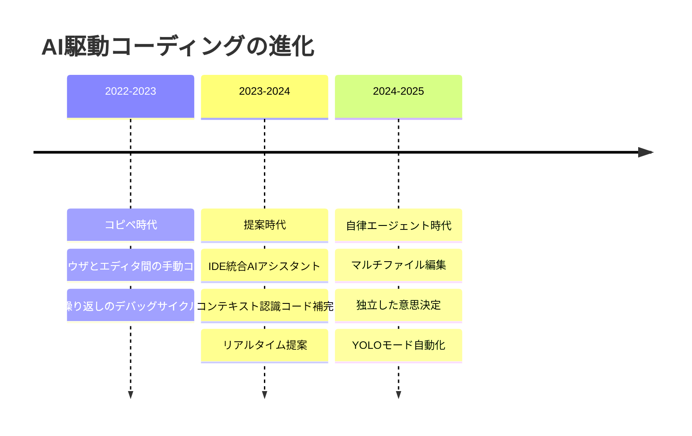
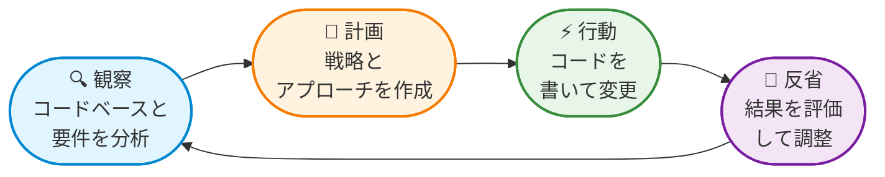
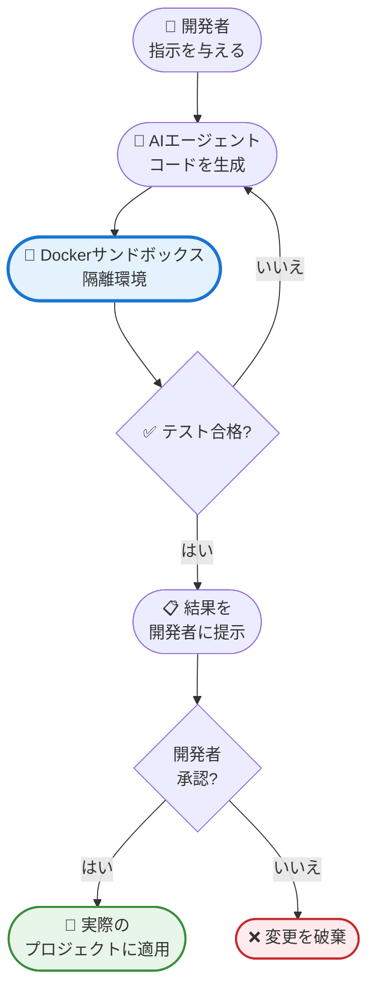
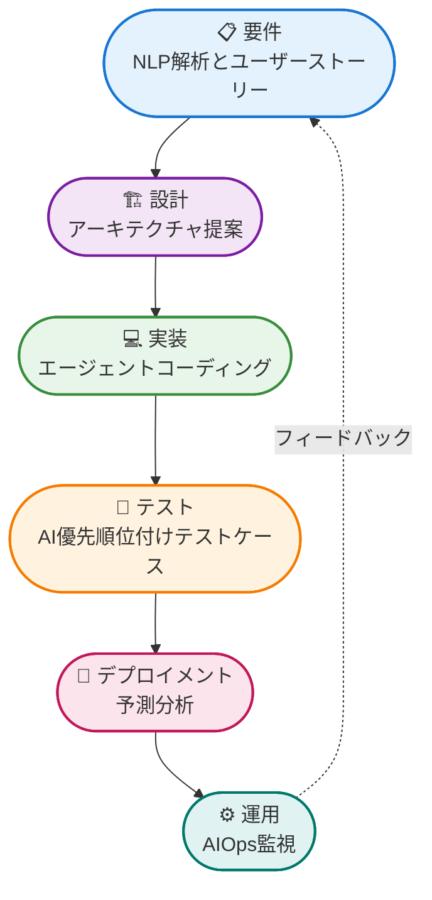

ChatGPTがコードを書けることを初めて発見したときのことを覚えていますか？おそらく何百万人もの開発者がやったことと同じことをしたでしょう：要件をコピーし、チャットに貼り付け、動作するコードが現れるのを驚きながら見ていました。そして、デバッグのダンスが始まりました - エラーメッセージをAIにコピーし、「修正された」コードをエディタに貼り付け、新しいバグが出現したときにそのサイクルを繰り返すのです。

それはほんの始まりに過ぎませんでした。

単純なコピペのワークフローとして始まったものは、はるかに強力なものへと進化しました：**エージェントコーディング**です。これらはもはや単なるスマートなオートコンプリートツールや便利なチャットボットではありません。今日のAIエージェントは、コードベース全体を読み、プロジェクト構造を理解し、複数のファイルを同時に書いたり変更したり、テストを実行し、バグを修正し、さらにはアプリケーションをデプロイすることもできます - すべてあなたが指一本動かすことなく。

AIに「ユーザー認証付きのTodoアプリを作って」と伝え、1時間後に戻ってきたら完全にテストされデプロイされたアプリケーションが見つかることを想像してみてください。これはSFではありません - 「YOLOモード」（You Only Live Once）をサポートするツールで、AIエージェントが各ステップで許可を求めることなく自律的に動作する、今まさに起こっていることなのです。

!!!tip "💡 YOLOモードとは？"
    YOLO（You Only Live Once）モードは、AIエージェントが各ステップで許可を求めることなく、長時間自律的に動作することを可能にします。エージェントは決定を下し、コードを書き、テストを実行し、問題を独立して修正します。あなたは他のタスクに集中できます。AIアシスタントをオートパイロットにするようなものだと考えてください。

## コピペから自律エージェントへ：その旅路

変革は無邪気に始まりました。2022年後半、世界中の開発者は、コーディングの問題を平易な英語で説明すれば、動作するソリューションを受け取れることを発見しました。これが**コピペ時代**の誕生でした - 粗削りですが革命的でした。開発者は要件をChatGPTにコピーし、生成されたコードをエディタに貼り付け、そしてデバッグのためにエラーメッセージをAIにコピーして戻していました。面倒なダンスでしたが、機能しました。

本当のブレークスルーは、AIが開発環境に入ってきたときに訪れました。ブラウザタブとテキストエディタを行き来する代わりに、GitHub CopilotやAmazon CodeWhispererのようなツールがAIを直接IDEに持ち込みました。これが**提案時代**の始まりでした - AIはファイル全体を見ることができ、コーディングスタイルを理解し、コンテキストで実際に意味のある補完を提案できました。コピペのダンスは、AIと開発者が同じワークスペース内で調和して働く、よりエレガントなワルツへと進化しました。

そして、ゲームチェンジャーが登場しました：**自律エージェント時代**です。これらはもはや単なる提案エンジンではありませんでした - コードベース全体を読み、プロジェクトアーキテクチャを理解し、独立した決定を下すことができるデジタルな同僚でした。現代のツールは、数十のファイルにわたって認証システムを同時にリファクタリングし、インポートを更新し、型定義を修正し、全体を通して一貫性を維持できます。行き詰まったときにドキュメントを閲覧し、ターミナルコマンドを実行して自分のコードをテストし、さらには本番環境にアプリケーションをデプロイすることもできます。

これは単にコードをより速く書くことだけではありません - ソフトウェア開発者であることの意味を根本的に再定義することなのです。AIが日常的な実装の詳細を処理するとき、開発者はコードタイピストからソリューションアーキテクトへと変貌し、構文の暗記ではなく創造的な問題解決に焦点を当てます。

## エージェントコーディングの実際の仕組み

エージェントコーディングを理解するには、プロジェクト全体を見ることができ、目標を理解し、あなたが大局的な決定に集中している間に独立して作業できる、高度なスキルを持つ開発者が隣に座っていることを想像してください。しかし、人間の代わりに、それは複数の相互接続されたコンポーネントが一緒に動作するAIシステムです。

その核心において、エージェントコーディングシステムは継続的なループを通じて動作します：**観察 → 計画 → 行動 → 反省**。エージェントはまず、コードベース、要件、現在の状態を観察します。次に行動計画を作成し、コードを書いたり変更したりしてその計画を実行し、結果を反省して次のステップを決定します。このサイクルは、タスクが完了するか人間の介入が必要になるまで繰り返されます。

魔法は洗練されたコンテキスト管理を通じて起こります。以前の会話を忘れる単純なチャットボットとは異なり、エージェントシステムはプロジェクト構造、コーディングパターン、以前の決定、さらにはあなたの個人的な好みの永続的なメモリを維持します。エージェントに「ユーザー認証を追加して」と依頼すると、単に汎用的なコードを生成するのではなく、既存のアーキテクチャを分析し、変更すべき適切なファイルを特定し、データベーススキーマを理解し、プロジェクトのスタイルと一貫性のある方法で認証を実装します。

!!!example "🎬 実世界のシナリオ"
    エージェントに伝えます：「メールとパスワードでユーザーログインを追加して。」
    
    エージェントは：
    1. **観察** 既存のデータベース構造を見てusersテーブルを見つける
    2. **計画** ログインルート、認証ミドルウェア、パスワードハッシュ化を作成
    3. **行動** 5つのファイルを変更：ルート、コントローラ、モデル、ミドルウェア、テスト
    4. **反省** テストを実行し、不足しているインポートを見つけ、自動的に修正
    
    これらすべてが数分で起こり、あなたは一行のコードも触れません。

## 優れたエージェントコーディングツールの条件

すべてのAIコーディングツールが同じように作られているわけではありません。基本的なコードジェネレータと真のエージェントシステムを分けるものを理解することで、ニーズに適したツールを選択できます。現代のエージェントコーディングプラットフォームを定義する本質的な機能と品質基準を探りましょう。

### 中核機能

**マルチファイルコード生成と編集**：システムは、コードベース全体の一貫性を維持しながら、複数のファイルを同時に読み、理解し、変更する必要があります。これには、インポートの更新、型定義の修正、アーキテクチャの一貫性の確保が含まれます。

**自律タスク実行**：コード生成を超えて、エージェントはターミナルコマンドを実行し、テストを実行し、依存関係をインストールし、外部サービスと対話する必要があります。コーディング部分だけでなく、完全な開発ワークフローを処理する必要があります。

**コンテキスト認識の意思決定**：システムは、既存のパターン、アーキテクチャの決定、コーディング標準を含むプロジェクトコンテキストを理解する必要があります。汎用的なソリューションを生成するのではなく、プロジェクトの確立された慣習に沿った決定を下す必要があります。

**エラー検出と自己修正**：コードのコンパイルに失敗したりテストが壊れたりしたとき、エージェントは問題を診断し、エラーメッセージを理解し、自律的に修正を実装する必要があります。これには、複数のファイルにまたがる複雑な多段階の問題のデバッグが含まれます。

**開発ツールとの統合**：IDE、バージョン管理システム、パッケージマネージャー、デプロイメントパイプラインとのシームレスな統合。エージェントは、まったく新しいプロセスを必要とするのではなく、既存の開発者ワークフロー内で動作する必要があります。

### 品質基準

**パフォーマンスと応答性**：エージェントは、単純なタスクにはほぼリアルタイムのフィードバックを提供し、複雑なマルチファイル操作を妥当な時間枠内で処理する必要があります。ユーザーは、コード補完には即座の応答を期待し、より大きなリファクタリングタスクには迅速なターンアラウンドを期待します。

**信頼性と一貫性**：システムは、セッション間で一貫した高品質のコードを生成する必要があります。同一の問題に対して異なるソリューションを生成するエージェントは、開発者の信頼とプロジェクトの保守性を損ないます。

**セキュリティとプライバシー**：コード分析のためのエンタープライズグレードのセキュリティ、オンプレミスデプロイメントのオプション、厳格なデータ処理ポリシー。開発者は、独自のコードが機密性を保ち安全であることを保証する必要があります。

!!!warning "⚠️ セキュリティの考慮事項"
    AIコーディングツールは、ソースコードと内部ドキュメントへのアクセスを必要とすることがよくあります。ツールを採用する前に：
    
    - ベンダーのデータ処理ポリシーを確認する
    - 機密プロジェクトのためにオンプレミスデプロイメントが利用可能かどうかを確認する
    - 外部サーバーに送信されるデータを理解する
    - 組織のセキュリティ要件を確認する
    - 可能な場合はコードをローカルで処理するツールを検討する

**スケーラビリティ**：システムは、小さなスクリプトから数百万行のコードを持つエンタープライズアプリケーションまで、さまざまなサイズのプロジェクトを、パフォーマンスや精度を低下させることなく処理する必要があります。

**カスタマイズと適応性**：コーディング標準、アーキテクチャの好み、チーム固有の要件のための柔軟な設定オプション。エージェントは、異なるプログラミング言語、フレームワーク、開発方法論に適応する必要があります。

## AIモデルの役割：推論モデル vs 指示モデル

すべてのAIモデルがコーディングタスクに対して同じように作られているわけではありません。現代のエージェントコーディングツールは、作業の異なる段階で異なるタイプのAIモデルを使用することが多く、これを理解することでこれらのツールをより効果的に使用できます。

**推論モデル**は、体系的な問題解決と計画のために設計されています。複雑なタスクをステップに分解し、プロジェクトアーキテクチャを理解し、戦略的な決定を下すことに優れています。彼らを「アーキテクト」と考えてください - 何を行う必要があり、どの順序で行うかを把握します。これらのモデルは遅いですがより徹底的で、計画段階に最適です。

**指示モデル**（チャットまたは補完モデルとも呼ばれる）は、高速なコード生成と特定の指示に従うことに最適化されています。自然言語の要件を理解し、明確な指示に基づいて迅速にコードを生成することに優れています。彼らを「ビルダー」と考えてください - 何を構築するかがわかれば、迅速に構築します。これらのモデルは、速度が重要な行動段階で最適に機能します。

!!!info "📊 実践におけるモデル選択"
    一部の高度なツールでは、異なるタスクに使用するモデルを選択できます：
    
    - **計画モード**：推論モデルを使用してリクエストを分析し、詳細な実装計画を作成
    - **行動モード**：指示モデルを使用して計画に基づいてコードを迅速に生成
    
    このハイブリッドアプローチは、推論モデルの戦略的思考と指示モデルの速度を組み合わせ、両方の長所を提供します。

## 高度な機能：セキュリティとコントロール

エージェントコーディングツールがより強力で自律的になるにつれて、セキュリティとコントロールのための高度な機能が不可欠になっています。現代のツールがシステムを保護しながら、AI行動に対する細かい制御を提供する方法を探りましょう。

### サンドボックス環境：安全な実行ゾーン

AIエージェントがターミナルコマンドを実行したりコードを実行したりするとき、偶発的または悪意のあるコード生成を通じて、システムに害を及ぼす可能性があります。サンドボックス環境は、AIがメインシステムにリスクを与えることなく作業できる隔離された実行ゾーンを作成することで、これを解決します。

**サンドボックスの仕組み**：サンドボックスを、AIが外部に影響を与えることなく構築、テスト、実験できる仮想遊び場と考えてください。AIがクラッシュするコード、ファイルを削除するコード、または予期しない動作をするコードを生成した場合、損害はサンドボックス内に封じ込められます。

**Dockerベースのサンドボックス**：一部のツールは、サンドボックスとしてDockerコンテナを使用します。たとえば、Gemini CLIは、すべてのAI生成コードが実行されるDockerコンテナをスピンアップできます。これは次の理由で強力な隔離を提供します：
- コンテナはコンピュータとは別の独自のファイルシステムを持つ
- ネットワークアクセスを制限または監視できる
- リソース使用（CPU、メモリ）を制限できる
- 何か問題が発生した場合、環境全体を即座にリセットできる
- 実際のプロジェクトファイルは、明示的に承認するまで手つかずのまま

このアプローチは、AIが悪意のあるコードを生成したとしても、一時的なコンテナにのみ影響し、実際の開発環境や個人ファイルには影響しないため、非常に安全と考えられています。

!!!tip "🛡️ エンタープライズにとってサンドボックスが重要な理由"
    サンドボックスがないと、ターミナルアクセスを持つAIエージェントは次のことができます：
    - 誤って重要なファイルを削除する
    - 不要なソフトウェアをインストールする
    - システム設定を変更する
    - 過剰なリソースを消費する
    - セキュリティ脆弱性のあるコードを実行する
    
    エンタープライズチームにとって、Gemini CLIやVibeのようなDockerベースのサンドボックスを持つツールは、組織全体にAIコーディングアシスタントを安全にデプロイするために必要なセキュリティ隔離を提供します。サンドボックスは、AIがミスをしたり問題のあるコードを生成したりしても、本番システムと機密データが保護されることを保証します。

### 細かい自動承認：制御された自律性

YOLOモードは刺激的に聞こえますが、ほとんどの開発者はAIが自動的に何ができるかを制御したいと考えています。細かい自動承認システムにより、AIが許可なしに実行できるアクションを正確に定義できます。

**アクションレベルの制御**：Clineのような現代のツールでは、異なるタイプのアクションに対して承認ルールを設定できます：

- **常に自動承認**：ファイルの読み取り、コードの検索、構造の分析
- **最初に確認**：ファイルの書き込みまたは変更、パッケージのインストール
- **決して自動承認しない**：ファイルの削除、デプロイメントコマンドの実行、外部APIへのアクセス

これは、潜在的にリスクのあるアクションに対する監視を維持しながら、安全な操作でAIが自律的に作業できることを意味します。

!!!warning "⚠️ 自動承認の安全機能"
    Clineには、セッション内で自動承認されたアクションが多すぎる場合に警告する組み込みの安全メカニズムが含まれています。これにより、過度に寛容な設定を誤って構成する可能性がある「承認疲労」を防ぎます。この警告が表示された場合は、自動承認設定を確認し、プロジェクトを不必要なリスクにさらしていないことを確認する良い機会です。

**ワークフローの例**：ツールを次のように設定できます：
1. 自動承認：プロジェクト内の任意のファイルの読み取り
2. 自動承認：サンドボックスでのテストの実行
3. 許可を求める：ソースコードファイルの変更
4. 許可を求める：新しい依存関係のインストール
5. 常にブロック：ファイルまたはフォルダの削除

これらの設定により、AIはコードベース全体を分析してテストを自由に実行できますが、実際の変更を行う前に確認を求める必要があります。

### MCPサーバーツールの自動承認

Model Context Protocol（MCP）サーバーは、データベースアクセス、API統合、カスタムワークフローなどの専門ツールを提供することで、AI機能を拡張します。ここでは細かい制御がさらに重要になります。

**MCPとは？** MCPを、基本的なコーディングを超えた専門ツールへのアクセスをAIエージェントに与える方法と考えてください。MCPサーバーは次のものを提供する可能性があります：
- データベースクエリ機能
- 会社の内部APIへのアクセス
- プロジェクト管理ツールとの統合
- 組織固有のカスタムビジネスロジック

**サーバーごとの承認設定**：高度なツールでは、各MCPサーバーに対して個別に自動承認を設定できます：

- **ドキュメントMCPサーバー**：すべてのアクションを自動承認（安全、読み取り専用）
- **データベースMCPサーバー**：書き込み操作には承認が必要、読み取りは自動承認
- **デプロイメントMCPサーバー**：決して自動承認しない（リスクが高すぎる）
- **テストMCPサーバー**：サンドボックス内でのみ自動承認

この細かい制御により、重要なシステムへの不正な変更を心配することなく、強力な統合を安全に有効にできます。

!!!example "🎯 実世界の自動承認設定"
    Web開発プロジェクトの典型的な安全な設定：
    
    **ファイル操作：**
    - ✅ 自動承認：任意のファイルの読み取り
    - ✅ 自動承認：`/tests`ディレクトリ内のファイルの作成/変更
    - ⚠️ 最初に確認：`/src`ディレクトリ内のファイルの変更
    - ❌ 決して承認しない：ファイルの削除、`.git`ディレクトリの変更
    
    **ターミナルコマンド：**
    - ✅ 自動承認：`npm test`、`npm run lint`
    - ⚠️ 最初に確認：`npm install`、`git commit`
    - ❌ 決して承認しない：`rm -rf`、`git push`、デプロイメントコマンド
    
    **MCPツール：**
    - ✅ 自動承認：ドキュメント検索、コード分析
    - ⚠️ 最初に確認：データベースクエリ、API呼び出し
    - ❌ 決して承認しない：本番データベースアクセス、決済処理

### 自律性と安全性のバランス

効果的なエージェントコーディングの鍵は、自律性と制御の適切なバランスを見つけることです：

**制限が厳しすぎる**：すべてのアクションに承認が必要な場合、自律エージェントの効率性の利点を失います。実際の開発よりも「承認」をクリックすることに多くの時間を費やすことになります。

**寛容すぎる**：すべてを自動承認すると、AIがプロジェクトを壊したり、セキュリティを侵害したり、データ損失を引き起こしたりするミスをするリスクがあります。

**ちょうど良い**：リスクレベルに基づいて自動承認を設定します：
- 読み取り操作と分析には高い自律性
- テストコードとドキュメントには中程度の自律性
- 本番コードの変更には低い自律性
- 破壊的な操作や外部統合には自律性なし

AIツールの経験を積み、その機能に対する信頼を築くにつれて、安全性を維持しながら効率を高めるために、自動承認設定を徐々に拡大できます。

!!!tip "🎓 自動承認の学習パス"
    保守的に始めて徐々に拡大します：
    
    **第1週**：すべてを手動で承認し、AIが何をするかを学ぶ
    **第2週**：ファイルの読み取りとコード分析を自動承認
    **第3週**：テストファイルの変更を自動承認
    **第4週**：サンドボックス内の安全なターミナルコマンドを自動承認
    **2ヶ月目以降**：快適さとプロジェクトのニーズに基づいてカスタマイズ
    
    この段階的なアプローチは、安全性を維持しながら自信を築きます。

## AI駆動開発の状況

AIコーディングツールの市場は爆発的に拡大し、さまざまな機能を提供するプラットフォームが登場しています。特定のツールは急速に進化しますが、状況を理解することで情報に基づいた選択ができます。

### 主要プレーヤーの比較

**GitHub Copilot**
- **強み**：深いIDE統合、膨大なトレーニングデータ、エンタープライズ機能
- **弱み**：限定的な自律性、人間のガイダンスが必要
- **最適な用途**：従来のペアプログラミングの強化

**Cursor**
- **強み**：AI優先設計のネイティブIDE、優れたUX、マルチファイル編集
- **弱み**：新しいエコシステム、限定的な拡張機能
- **最適な用途**：AIネイティブなコーディング環境を求める開発者

**Continue**
- **強み**：オープンソース、カスタマイズ可能、任意のIDEで動作
- **弱み**：より多くのセットアップが必要、洗練されていないUX
- **最適な用途**：制御とカスタマイズを求める開発者

**Cline（旧Claude Dev）**
- **強み**：優れた推論、ファイルシステムアクセス、ターミナル統合
- **弱み**：Claudeモデルに限定、VS Codeのみ
- **最適な用途**：複雑なリファクタリングとアーキテクチャの変更

**AWS Q Developer**
- **強み**：AWS統合、エンタープライズセキュリティ、多言語サポート
- **弱み**：主にAWS中心、市場に新しい
- **最適な用途**：AWS中心の開発チーム

**AWS Kiro**
- **強み**：仕様ベースの開発（AIが要件から仕様を生成し、実装計画を作成）、高度な推論
- **弱み**：初期段階、限定的な可用性、YOLOモードやサンドボックスなし
- **最適な用途**：仕様駆動開発、詳細な計画が必要な複雑なプロジェクト

**Gemini CLI**
- **強み**：Googleのマルチモーダル機能、無料ティア、エンタープライズグレードのセキュリティのためのDockerサンドボックス
- **弱み**：コマンドラインのみ、限定的なIDE統合
- **最適な用途**：安全なサンドボックス実行が必要なエンタープライズチーム、スクリプト自動化、CLI中心のワークフロー

**Vibe**
- **強み**：安全な実行のためのサンドボックス環境、モダンなアーキテクチャ
- **弱み**：市場に新しい、小さなコミュニティ
- **最適な用途**：セキュリティと隔離された実行環境を優先するチーム

### 主要機能の比較

| 機能 | Copilot | Cursor | Continue | Cline | AWS Q | Kiro | Gemini CLI | Vibe |
|---------|---------|--------|----------|-------|-------|------|------------|---------|
| **メモリバンク** | ✅ | ✅ | ✅ | ✅ | ✅ | ✅ | ✅ | ✅ |
| **カスタムルール** | ✅ | ✅ | ✅ | ✅ | ✅ | ✅ | ✅ | ✅ |
| **MCPサーバー** | ✅ | ❌ | ✅ | ✅ | ❌ | ✅ | ✅ | ❓ |
| **YOLOモード** | ❌ | ✅ | ❌ | ✅ | ❌ | ❌ | ✅ | ❓ |
| **サンドボックス** | ❌ | ❌ | ❌ | ❌ | ✅ | ❌ | ✅ | ✅ |
| **マルチモデル** | ✅ | ✅ | ✅ | ❌ | ❌ | ✅ | ✅ | ❓ |
| **細かい自動承認** | ❌ | ❌ | ❌ | ✅ | ❌ | ❓ | ❓ | ❓ |
| **仕様ベース開発** | ❌ | ❌ | ❌ | ❌ | ❌ | ✅ | ❌ | ❌ |

!!!warning "⚠️ 機能比較の正確性"
    この比較は執筆時点の機能を反映していますが、AIコーディングの状況は猛烈なスピードで進化しています。今日最先端の機能が明日には標準になる可能性があり、新しい機能が毎月登場します。ツールは、以前は競合他社専用だった機能を頻繁に追加します。ツールの決定を下す前に常に最新のドキュメントを確認し、この表が数ヶ月以内に部分的に古くなることを予期してください。

### 高度な機能の説明

**メモリバンク**：セッション間の永続的なコンテキスト、コードベースパターンからの学習、好みの記憶。

**カスタムルール**：チームの慣習に合わせてAIの動作を導くプロジェクト固有のコーディング標準と好み。

**MCPサーバー**：データベース、API、カスタムワークフローなどの外部ツールで機能を拡張するためのModel Context Protocol。

**YOLOモード**：確認プロンプトなしの自律実行、AIが長時間独立して作業できる。

**サンドボックス**：メインシステムにリスクを与えることなく、安全なコード実行とテストのための隔離環境（多くの場合Dockerベース）。

**マルチモデル**：異なるタスクに対して異なるAIモデル（推論モデル vs 指示モデル）を切り替える能力。

**細かい自動承認**：AIが自動的に実行できるアクションに対する細かい制御、MCPサーバーごとの承認設定を含む。Clineのようなツールは、自動承認されたアクションが多すぎる場合に警告を提供し、過度に寛容な設定を防ぐのに役立ちます。

**仕様ベース開発**：AIはまず自然言語の要件から詳細な仕様を生成し、次にその仕様に基づいて実装計画を作成します。この2段階のアプローチにより、要件と実装の間のより良い整合性が保証され、誤解と手戻りが減少します。

### どのツールがあなたのニーズに合うか？

**初心者向け**
- **推奨**：GitHub CopilotまたはCursor
- 緩やかな学習曲線、優れたドキュメント、強力なコミュニティサポート

**経験豊富な開発者向け**
- **推奨**：ContinueまたはCline
- 最大限の制御とカスタマイズ、高度なエージェント機能、オープンソースの柔軟性

**エンタープライズチーム向け**
- **推奨**：Gemini CLI、AWS Q Developer、またはGitHub Copilot Enterprise
- Gemini CLIは最大限のセキュリティ隔離のためのDockerベースのサンドボックスを提供
- AWS QとCopilotはエンタープライズセキュリティ、コンプライアンス、チームコラボレーション、監査証跡、ガバナンスを提供

**仕様駆動プロジェクト向け**
- **推奨**：AWS Kiro
- 仕様ベースの開発により、実装前に要件が適切に理解されることを保証
- 明確な仕様がコストのかかる手戻りを減らす複雑なプロジェクトに最適

**実験的プロジェクト向け**
- **推奨**：CursorまたはVibe
- 最先端のエージェント機能、自律開発機能
- Vibeは安全な実験のためのサンドボックスを提供

!!!anote "📝 ツールの進化に関する注記"
    AIコーディングツールの状況は急速に変化します。新しい機能が毎月登場し、今日の制限が明日の機能になることがよくあります。ツールが進化しても、これらの原則は一定であるため、特定のツール機能ではなく、中核概念の理解に焦点を当ててください。

## ソフトウェア開発ライフサイクルの変革

AIは単にコードの書き方を変えているだけではありません - ソフトウェア開発のすべての段階を革命化しています。従来のソフトウェア開発ライフサイクル（SDLC）は、線形プロセスから、AIが各段階でインテリジェンス、自動化、フィードバックを提供する継続的に最適化するシステムへと変革されています。

### 要件フェーズ

AIツールは、自然言語処理を使用してステークホルダーの会話とドキュメントを解析し、曖昧さ、矛盾、欠落している要件を検出できるようになりました。トレーサビリティリンクを持つユーザーストーリーを自動的に生成し、チームが曖昧なアイデアから具体的な仕様へとこれまで以上に速く移行するのを支援します。

**仕様ベース開発**：AWS Kiroのようなツールは、自然言語の要件から正式な仕様を生成することで、これをさらに進めます。AIはまず、すべての要件、制約、受け入れ基準を捉えた詳細な仕様ドキュメントを作成します。仕様がレビューされ承認された後にのみ、実装計画を生成します。この2段階のアプローチには大きな利点があります：

- **誤解の削減**：コードが書かれる前に仕様がレビューされ、要件のギャップを早期に発見
- **より良い整合性**：ステークホルダーはコードを理解する必要なく仕様を検証できる
- **コスト削減**：仕様エラーの修正は、実装されたコードのリファクタリングよりもはるかに安価
- **トレーサビリティ**：すべてのコード変更は仕様の特定の要件にトレースできる
- **ドキュメント**：仕様は実装と同期し続ける生きたドキュメントとして機能

### 設計フェーズ

パターンマイニングと制約推論により、AIはアーキテクチャを提案し、スケーラビリティとコストを見積もり、プロセスの早い段階でセキュリティの懸念を表面化できます。設計ドキュメントに数週間を費やす代わりに、チームは数時間で複数のアーキテクチャオプションを探索できます。

### 実装フェーズ

ここでエージェントコーディングが真に輝きます。生成的コーディング、セマンティック検索、自動リファクタリング、ポリシー強制コードアシスタントが配信を加速し、スタイルガイド、ライセンスコンプライアンス、セキュリティベストプラクティス、パフォーマンス最適化を自動的に強制します。

### テストフェーズ

AIはリスクと影響によってテストケースを優先順位付けし、合成テストデータを生成し、カバレッジのギャップを見つけるためにミューテーションテストを実行し、さらには不安定なテストをトリアージします。これは、手動作業を減らしながら、より良いテストカバレッジを意味します。

### デプロイメントフェーズ

予測分析はデプロイメント戦略を調整し、ロールバックトリガーを設定し、容量とコストを最適化します。Infrastructure-as-codeは、デプロイメント前に設定のドリフトとコンプライアンスの問題を自動的にチェックされます。

### 運用フェーズ

AI運用（AIOps）は、ログ、トレース、メトリクスを相関させて平均復旧時間（MTTR）を短縮し、サービスレベル目標（SLO）を保護します。問題が発生したとき、AIは人間のオペレーターよりも速く診断し、修正を提案できることがよくあります。

## メリットと利点

AIのソフトウェア開発への統合は、単なる生産性の向上を超えた具体的なメリットをもたらします：

**効率性とスピード**：反復的なコーディングとテストタスクを自動化することで、開発タイムラインを30〜50%短縮でき、チームは機能をより速く出荷し、市場の需要により迅速に対応できます。

**強化されたコラボレーション**：リアルタイムのAIアシスタンスは、技術チームメンバーと非技術チームメンバーの間のギャップを埋めます。プロダクトマネージャーは平易な言語で機能を説明でき、AIはこれを開発者が実装できる技術仕様に変換します。

**コード品質の向上**：AI駆動のコードレビューとデバッグは、人的エラーを減らし、保守性を向上させます。自動化されたセキュリティスキャンは、本番環境に到達する前に脆弱性を捕捉します。

**適応性**：現代のプラットフォームは、多様な言語とフレームワークをサポートし、小さなスクリプトから数百万行のコードを持つエンタープライズアプリケーションまでスケールします。

**学習とオンボーディング**：AIアシスタントは、コンテキストに応じたヘルプと説明で新しい開発者をサポートし、新しいコードベースで生産的になるために必要な時間を劇的に短縮します。

**コスト削減**：ワークフローを合理化し、手作業を減らすことで、出力品質を向上させながら運用コストを削減できます。

!!!success "✨ 実際の影響"
    エージェントコーディングツールを採用している組織は次のことを報告しています：
    - 日常的なコーディングタスクに費やす時間が40〜60%削減
    - 新しいチームメンバーのオンボーディングが30〜50%高速化
    - 本番環境に到達するバグが25〜40%削減
    - 開発者が反復的なタスクではなく創造的な問題解決により多くの時間を費やす

## 課題と考慮事項

印象的なメリットにもかかわらず、AIソフトウェアエンジニアリングプラットフォームには、組織が慎重に対処しなければならない課題があります。

**データセキュリティとプライバシー**：AIツールは、ソースコードと内部ドキュメントへのアクセスを必要とすることがよくあります。これらの資産が保護されたままであることを保証することは、特に機密データや知的財産を扱う組織にとって最も重要です。

**信頼性と信頼**：AIは多くのタスクを自動化できますが、提案を検証し、エラーやバイアスの導入を避けるために、人間の監視が必要です。AI生成コードを盲目的に受け入れると、微妙なバグやセキュリティ脆弱性につながる可能性があります。

**統合の複雑さ**：AIプラットフォームを既存のワークフローにシームレスに組み込むには、カスタマイズ、トレーニング、プロセスの変更が必要になる場合があります。チームは適応し、AIエージェントとの効果的なコラボレーションパターンを学ぶ時間が必要です。

**倫理的考慮事項**：AI生成コードの使用は、独創性、ライセンス、知的財産に関する疑問を提起します。AIが書いたコードは誰が所有するのか？AIが著作権で保護された素材に類似したコードを生成した場合はどうなるのか？

**スキルギャップ**：チームは、高度なAI機能を完全に活用するためにスキルアップする必要があるかもしれません。AIエージェントを効果的にプロンプトし、ガイドし、検証する方法を理解することが、新しい必須スキルになります。

**ベンダーへの依存**：サードパーティプラットフォームに依存すると、プロバイダーが条件、価格、可用性を変更した場合にリスクが生じます。組織は、ベンダーロックインを考慮し、緊急時対応計画を持つべきです。

!!!warning "⚠️ 避けるべき一般的な落とし穴"
    - **過度の依存**：AIがコードを書いたからといってコードレビューをスキップしない
    - **セキュリティの盲点**：AI生成コードを常に脆弱性についてスキャンする
    - **コンテキストの無視**：AIがあなたの特定の要件と制約を理解していることを確認する
    - **テストのショートカット**：AI生成コードでも包括的なテストが必要
    - **スキルの衰え**：AIが日常的なタスクを処理しても、基本的なコーディングスキルを維持する

## AI主導ソフトウェアエンジニアリングの未来

ソフトウェア開発におけるAIの軌跡は、ますます自律的でインテリジェントなシステムを指し示しています。次世代の開発ツールを形作る新たなトレンドは次のとおりです：

**自律SDLCループ**：将来のシステムは、ユーザーストーリー、コード、テスト、デプロイメント戦略を自動生成する複数の専門エージェントを調整します。人間は、すべてのコード変更をレビューするのではなく、高レベルの根拠と戦略的決定を承認します。

**マルチエージェント開発エコシステム**：要件、アーキテクチャ、テスト、セキュリティの専門エージェントが協力してトレードオフを交渉し、チームが異なる選択の影響を理解するのに役立つ説明可能な決定マトリックスを生成します。

**意図中心の開発**：開発者は達成したいことを自然言語で説明し、AIはこの意図をユーザーストーリー、API仕様、policy-as-code、テストケース、監視設定全体で自動的に同期します - ドキュメントと実装の間のドリフトを排除します。

**自己修復と自己最適化システム**：AIエージェントは、問題になる前に潜在的な問題を検出し、パッチを合成し、保護措置を注入し、システムの健全性を自動的に検証します - 反応的なデバッグから予防的なシステムメンテナンスへと移行します。

**継続的な信頼とコンプライアンス**：並列パイプラインは、セキュリティ、公平性、堅牢性、サプライチェーンの整合性についてコードを継続的にスコアリングし、品質しきい値に基づいて本番デプロイメントをゲートするリアルタイムバッジを提供します。

**持続可能なエンジニアリング**：AIは環境への影響を最適化し、低炭素エネルギーウィンドウ中にリソース集約的なタスクをスケジュールし、パフォーマンスを維持しながらエネルギー消費を削減するコード最適化を提案します。

!!!tip "🔮 未来への準備"
    この急速に進化する状況で先を行くために：
    
    - **継続的な学習を受け入れる**：AIツールは毎月進化します。好奇心を持ち続け、実験してください
    - **問題解決に焦点を当てる**：AIが実装を処理するにつれて、あなたの価値は問題を深く理解することにシフトします
    - **AIコラボレーションスキルを開発する**：AIエージェントを効果的にプロンプトし、ガイドし、検証する方法を学びます
    - **基礎を維持する**：強力なコーディングの基礎は、AI生成コードを評価し改善するのに役立ちます
    - **アーキテクチャ的に考える**：あなたの役割は、すべての行を書くことではなく、システムを設計することにますますなります

## エージェントコーディングを始める

自分でエージェントコーディングを体験する準備はできましたか？初心者のための実用的なロードマップは次のとおりです：

!!!anote "🔒 セキュリティ第一"
    飛び込む前に、次のことを確認してください：
    - ツールのデータ処理ポリシーを理解する
    - 適切な自動承認設定を構成する（制限的に始める）
    - 利用可能な場合はサンドボックス環境を使用する
    - 機密の認証情報やAPIキーをAIツールと共有しない
    - バージョン管理にコミットする前にすべてのAI生成コードをレビューする

### ステップ1：IDE統合ツールから始める

開発環境に直接統合するツールから始めます。GitHub Copilot、Amazon CodeWhisperer、またはTabnineは、受け入れるか拒否できるコード提案で穏やかな導入を提供します。これにより、圧倒されることなくAIアシスタンスに慣れることができます。

### ステップ2：シンプルなタスクで実験する

AIに次のような簡単なタスクを手伝ってもらうことから始めます：
- ユーティリティ関数の作成
- テストケースの生成
- 不慣れなコードの説明
- 小さなコードセクションのリファクタリング

これにより自信が構築され、AIの強みと限界を理解するのに役立ちます。

### ステップ3：自律エージェントに進む

提案に慣れたら、自律機能を持つツールを探索します。エージェントに次のことを依頼してみてください：
- 複数のファイルにわたって新しい機能を追加する
- テストを維持しながらモジュールをリファクタリングする
- 失敗したテストスイートをデバッグする

エージェントがこれらのタスクをどのように計画し実行するかを観察します。

### ステップ4：効果的なプロンプトを学ぶ

AI出力の品質は、コミュニケーション方法に大きく依存します。練習：
- 要件について具体的にする
- プロジェクトに関するコンテキストを提供する
- 制約と好みを説明する
- 必要に応じて説明を求める

### ステップ5：レビューマインドセットを開発する

AI生成コードを常に批判的にレビューします：
- 要件を満たしているか？
- セキュリティ上の懸念はあるか？
- 保守可能で適切に構造化されているか？
- プロジェクトの慣習に従っているか？

AIを、作業がレビューを必要とするジュニア開発者として扱い、誤りのない神託としてではありません。

!!!example "🎯 最初のエージェントコーディングプロジェクト"
    この初心者向けの演習を試してください：
    
    1. シンプルなプロジェクトアイデアを選ぶ（例：コマンドラインのTodoリスト）
    2. IDEにAIコーディングツールをインストールする
    3. プロジェクトをAIに平易な言語で説明する
    4. AIに初期コード構造を生成させる
    5. 生成されたコードをレビューしてテストする
    6. AIに新しい機能を1つ追加するよう依頼する
    7. 機能を統合するために既存のコードをどのように変更するかを観察する
    
    この実践的な経験は、どのチュートリアルよりも多くのことを教えてくれます。

## 結論：AI駆動の未来を受け入れる

エージェントコーディングの台頭は、技術的進歩以上のものを表しています - それはソフトウェアの作成方法における根本的なシフトです。ChatGPTの応答をコピペしていた初期の頃から、アプリケーション全体を構築できる今日の自律エージェントまで、わずか数年前には不可能に思えた変革を目撃してきました。

この進化は、人間の開発者の役割を減少させるものではありません。それを高めるのです。AIが日常的な実装の詳細を処理するにつれて、開発者は人間が最も得意とすることに集中できるようになります：創造的な問題解決、アーキテクチャ的思考、ユーザーニーズの理解、戦略的決定を下すこと。未来は、AIエージェントと効果的にコラボレーションし、その強みを活用しながら、機械が複製できない人間の判断、創造性、倫理的監視を提供できる開発者のものです。

コピペから自律エージェントへの旅は、ほんの始まりに過ぎません。AIが進化し続けるにつれて、人間と機械の貢献の境界はさらに曖昧になり、今日ではほとんど想像できない新しい可能性を生み出します。問題は、エージェントコーディングを受け入れるかどうかではありません - どれだけ早くこの新しいパラダイムに適応し、この革命の最前線に自分自身を位置づけることができるかです。

ツールはここにあります。技術は準備ができています。残された唯一の質問は：あなたはソフトウェアの構築方法を変革する準備ができていますか？

!!!quote "💭 最後の考え"
    「未来を予測する最良の方法は、それを発明することです。」 - アラン・ケイ
    
    エージェントコーディングの時代において、私たちはソフトウェア開発の未来を予測しているだけではありません - 私たちは、AI支援のコミット一つ一つで、それを積極的に創造しているのです。
