Remember when you first discovered ChatGPT could write code? You probably did what millions of developers did: copied your requirements, pasted them into the chat, and watched in amazement as working code appeared. Then came the debugging dance - copying error messages back to the AI, pasting the "fixed" code into your editor, only to repeat the cycle when new bugs emerged.

That was just the beginning.

What started as a simple copy-paste workflow has evolved into something far more powerful: **agentic coding**. These aren't just smart autocomplete tools or helpful chatbots anymore. Today's AI agents can read your entire codebase, understand your project structure, write and modify multiple files simultaneously, run tests, fix bugs, and even deploy applications - all without you lifting a finger.

Imagine telling an AI "build me a todo app with user authentication" and returning an hour later to find a complete, tested, and deployed application. That's not science fiction - it's happening right now with tools that support "YOLO mode" (You Only Live Once), where AI agents work autonomously without asking for permission at every step.

!!!tip "💡 What is YOLO Mode?"
    YOLO (You Only Live Once) mode allows AI agents to work autonomously for extended periods without asking for permission at every step. The agent makes decisions, writes code, runs tests, and fixes issues independently while you focus on other tasks. Think of it as putting your AI assistant on autopilot.

## From Copy-Paste to Autonomous Agents: The Journey

The transformation began innocently enough. In late 2022, developers worldwide discovered they could describe their coding problems in plain English and receive working solutions. This was the birth of the **copy-paste era** - crude but revolutionary. Developers would copy requirements into ChatGPT, paste the generated code into their editors, then copy error messages back to the AI for debugging. It was a tedious dance, but it worked.

The real breakthrough came when AI moved into our development environments. Instead of juggling browser tabs and text editors, tools like GitHub Copilot and Amazon CodeWhisperer brought AI directly into IDEs. This marked the **suggestion era** - AI could see your entire file, understand your coding style, and suggest completions that actually made sense in context. The copy-paste dance evolved into a more elegant waltz, with AI and developers working in harmony within the same workspace.

Then came the game-changer: the **autonomous agent era**. These weren't just suggestion engines anymore - they were digital colleagues capable of reading entire codebases, understanding project architecture, and making independent decisions. Modern tools can refactor authentication systems across dozens of files simultaneously, updating imports, fixing type definitions, and maintaining consistency throughout. They can browse documentation when stuck, run terminal commands to test their own code, and even deploy applications to production.

This isn't just about writing code faster - it's about fundamentally redefining what it means to be a software developer. When AI handles the routine implementation details, developers transform from code typists into solution architects, focusing on creative problem-solving rather than syntax memorization.

## How Agentic Coding Actually Works

To understand agentic coding, imagine having a highly skilled developer sitting next to you who can see your entire project, understand your goals, and work independently while you focus on bigger picture decisions. But instead of a human, it's an AI system with several interconnected components working together.

At its core, an agentic coding system operates through a continuous loop: **Observe → Plan → Act → Reflect**. The agent first observes your codebase, requirements, and current state. It then creates a plan of action, executes that plan by writing or modifying code, and reflects on the results to determine next steps. This cycle repeats until the task is complete or human intervention is needed.

```mermaid
graph LR
    A([🔍 Observe<br/>Analyze codebase<br/>& requirements]) --> B([🎯 Plan<br/>Create strategy<br/>& approach])
    B --> C([⚡ Act<br/>Write & modify<br/>code])
    C --> D([💭 Reflect<br/>Evaluate results<br/>& adjust])
    D --> A
    style A fill:#e1f5ff,stroke:#0288d1,stroke-width:2px
    style B fill:#fff3e0,stroke:#f57c00,stroke-width:2px
    style C fill:#e8f5e9,stroke:#388e3c,stroke-width:2px
    style D fill:#f3e5f5,stroke:#7b1fa2,stroke-width:2px
```

The magic happens through sophisticated context management. Unlike simple chatbots that forget previous conversations, agentic systems maintain persistent memory of your project structure, coding patterns, previous decisions, and even your personal preferences. When you ask an agent to "add user authentication," it doesn't just generate generic code - it analyzes your existing architecture, identifies the appropriate files to modify, understands your database schema, and implements authentication in a way that's consistent with your project's style.

!!!example "🎬 Real-World Scenario"
    You tell the agent: "Add user login with email and password."
    
    The agent:
    1. **Observes** your existing database structure and finds a users table
    2. **Plans** to create login routes, authentication middleware, and password hashing
    3. **Acts** by modifying 5 files: routes, controllers, models, middleware, and tests
    4. **Reflects** by running tests, finding a missing import, and fixing it automatically
    
    All of this happens in minutes, without you touching a single line of code.

## What Makes a Great Agentic Coding Tool?

Not all AI coding tools are created equal. Understanding what separates basic code generators from true agentic systems helps you choose the right tool for your needs. Let's explore the essential capabilities and quality standards that define modern agentic coding platforms.

### Core Capabilities

**Multi-File Code Generation and Editing**: The system must read, understand, and modify multiple files simultaneously while maintaining consistency across the entire codebase. This includes updating imports, fixing type definitions, and ensuring architectural coherence.

**Autonomous Task Execution**: Beyond code generation, agents must execute terminal commands, run tests, install dependencies, and interact with external services. They should handle the complete development workflow, not just the coding portion.

**Context-Aware Decision Making**: The system must understand project context, including existing patterns, architectural decisions, and coding standards. It should make decisions that align with the project's established conventions rather than generating generic solutions.

**Error Detection and Self-Correction**: When code fails to compile or tests break, the agent must diagnose issues, understand error messages, and implement fixes autonomously. This includes debugging complex multi-step problems that span multiple files.

**Integration with Development Tools**: Seamless integration with IDEs, version control systems, package managers, and deployment pipelines. The agent should work within existing developer workflows rather than requiring entirely new processes.

### Quality Standards

**Performance and Responsiveness**: Agents must provide near real-time feedback for simple tasks while handling complex multi-file operations within reasonable timeframes. Users expect immediate responses for code completions and quick turnaround for larger refactoring tasks.

**Reliability and Consistency**: The system must produce consistent, high-quality code across sessions. An agent that generates different solutions for identical problems undermines developer confidence and project maintainability.

**Security and Privacy**: Enterprise-grade security for code analysis, with options for on-premises deployment and strict data handling policies. Developers need assurance that proprietary code remains confidential and secure.

!!!warning "⚠️ Security Considerations"
    AI coding tools often require access to your source code and internal documentation. Before adopting any tool:
    
    - Verify the vendor's data handling policies
    - Check if on-premises deployment is available for sensitive projects
    - Understand what data is sent to external servers
    - Review your organization's security requirements
    - Consider tools that process code locally when possible

**Scalability**: The system must handle projects of varying sizes, from small scripts to enterprise applications with millions of lines of code, without degrading performance or accuracy.

**Customization and Adaptability**: Flexible configuration options for coding standards, architectural preferences, and team-specific requirements. The agent should adapt to different programming languages, frameworks, and development methodologies.

## The Role of AI Models: Reasoning vs Instruction Models

Not all AI models are created equal for coding tasks. Modern agentic coding tools often use different types of AI models for different stages of work, and understanding this helps you use these tools more effectively.

**Reasoning Models** are designed for systematic problem-solving and planning. They excel at breaking down complex tasks into steps, understanding project architecture, and making strategic decisions. Think of them as the "architect" - they figure out what needs to be done and in what order. These models are slower but more thorough, making them perfect for the planning phase.

**Instruction Models** (also called chat or completion models) are optimized for fast code generation and following specific directions. They're excellent at understanding natural language requirements and quickly generating code based on clear instructions. Think of them as the "builder" - once they know what to build, they build it quickly. These models work best for the action phase where speed matters.

!!!info "📊 Model Selection in Practice"
    Some advanced tools let you choose which model to use for different tasks:
    
    - **Plan Mode**: Uses reasoning models to analyze your request and create a detailed implementation plan
    - **Act Mode**: Uses instruction models to quickly generate code based on the plan
    
    This hybrid approach combines the strategic thinking of reasoning models with the speed of instruction models, giving you the best of both worlds.

## Advanced Features: Security and Control

As agentic coding tools become more powerful and autonomous, advanced features for security and control have become essential. Let's explore how modern tools protect your system while giving you fine-grained control over AI actions.

### Sandbox Environments: Safe Execution Zones

When AI agents run terminal commands or execute code, they could potentially harm your system - whether accidentally or through malicious code generation. Sandbox environments solve this by creating isolated execution zones where AI can work without risking your main system.

**How Sandboxing Works**: Think of a sandbox as a virtual playground where AI can build, test, and experiment without affecting anything outside. If the AI generates code that crashes, deletes files, or behaves unexpectedly, the damage stays contained within the sandbox.

**Docker-Based Sandboxes**: Some tools use Docker containers as sandboxes. For example, Gemini CLI can spin up a Docker container where all AI-generated code runs. This provides strong isolation because:
- The container has its own filesystem separate from your computer
- Network access can be restricted or monitored
- Resource usage (CPU, memory) can be limited
- The entire environment can be reset instantly if something goes wrong
- Your actual project files remain untouched until you explicitly approve changes

This approach is considered highly secure because even if AI generates malicious code, it can only affect the temporary container, not your actual development environment or personal files.

```mermaid
graph TB
    A([👤 Developer<br/>Gives instruction]) --> B([🤖 AI Agent<br/>Generates code])
    B --> C([🐳 Docker Sandbox<br/>Isolated environment])
    C --> D{✅ Tests Pass?}
    D -->|Yes| E([📋 Present results<br/>to developer])
    D -->|No| B
    E --> F{Developer<br/>Approves?}
    F -->|Yes| G([💾 Apply to<br/>actual project])
    F -->|No| H([❌ Discard changes])
    
    style C fill:#e3f2fd,stroke:#1976d2,stroke-width:3px
    style G fill:#e8f5e9,stroke:#388e3c,stroke-width:2px
    style H fill:#ffebee,stroke:#c62828,stroke-width:2px
```

!!!tip "🛡️ Why Sandboxing Matters for Enterprises"
    Without sandboxing, an AI agent with terminal access could:
    - Accidentally delete important files
    - Install unwanted software
    - Modify system configurations
    - Consume excessive resources
    - Execute code with security vulnerabilities
    
    For enterprise teams, tools like Gemini CLI and Vibe with Docker-based sandboxes provide the security isolation needed to safely deploy AI coding assistants across organizations. The sandbox ensures that even if AI makes mistakes or generates problematic code, your production systems and sensitive data remain protected.

### Fine-Grained Auto-Approval: Controlled Autonomy

While YOLO mode sounds exciting, most developers want control over what AI can do automatically. Fine-grained auto-approval systems let you define exactly which actions AI can take without asking permission.

**Action-Level Control**: Modern tools like Cline allow you to set approval rules for different types of actions:

- **Always auto-approve**: Reading files, searching code, analyzing structure
- **Ask first**: Writing or modifying files, installing packages
- **Never auto-approve**: Deleting files, running deployment commands, accessing external APIs

This means you can let AI work autonomously on safe operations while maintaining oversight on potentially risky actions.

!!!warning "⚠️ Auto-Approval Safety Feature"
    Cline includes a built-in safety mechanism that warns you when too many actions have been auto-approved in a session. This prevents "approval fatigue" where you might accidentally configure overly permissive settings. If you see this warning, it's a good time to review your auto-approval configuration and ensure you're not exposing your project to unnecessary risks.

**Example Workflow**: You might configure your tool to:
1. Auto-approve: Reading any file in your project
2. Auto-approve: Running tests in the sandbox
3. Ask permission: Modifying source code files
4. Ask permission: Installing new dependencies
5. Always block: Deleting files or folders

With these settings, AI can analyze your entire codebase and run tests freely, but must ask before making actual changes.

### MCP Server Tool Auto-Approval

Model Context Protocol (MCP) servers extend AI capabilities by providing specialized tools - like database access, API integrations, or custom workflows. Fine-grained control becomes even more important here.

**What is MCP?** Think of MCP as a way to give AI agents access to specialized tools beyond basic coding. An MCP server might provide:
- Database query capabilities
- Access to your company's internal APIs
- Integration with project management tools
- Custom business logic specific to your organization

**Per-Server Approval Settings**: Advanced tools let you configure auto-approval separately for each MCP server:

- **Documentation MCP Server**: Auto-approve all actions (safe, read-only)
- **Database MCP Server**: Require approval for write operations, auto-approve reads
- **Deployment MCP Server**: Never auto-approve (too risky)
- **Testing MCP Server**: Auto-approve within sandbox only

This granular control means you can safely enable powerful integrations without worrying about AI making unauthorized changes to critical systems.

!!!example "🎯 Real-World Auto-Approval Configuration"
    A typical safe configuration for a web development project:
    
    **File Operations:**
    - ✅ Auto-approve: Read any file
    - ✅ Auto-approve: Create/modify files in `/tests` directory
    - ⚠️ Ask first: Modify files in `/src` directory
    - ❌ Never approve: Delete files, modify `.git` directory
    
    **Terminal Commands:**
    - ✅ Auto-approve: `npm test`, `npm run lint`
    - ⚠️ Ask first: `npm install`, `git commit`
    - ❌ Never approve: `rm -rf`, `git push`, deployment commands
    
    **MCP Tools:**
    - ✅ Auto-approve: Documentation search, code analysis
    - ⚠️ Ask first: Database queries, API calls
    - ❌ Never approve: Production database access, payment processing

### Balancing Autonomy and Safety

The key to effective agentic coding is finding the right balance between autonomy and control:

**Too Restrictive**: If you require approval for every action, you lose the efficiency benefits of autonomous agents. You'll spend more time clicking "approve" than actually developing.

**Too Permissive**: If you auto-approve everything, you risk AI making mistakes that could break your project, compromise security, or cause data loss.

**Just Right**: Configure auto-approval based on risk levels:
- High autonomy for read operations and analysis
- Moderate autonomy for test code and documentation
- Low autonomy for production code changes
- No autonomy for destructive operations or external integrations

As you gain experience with your AI tools and build trust in their capabilities, you can gradually expand auto-approval settings to increase efficiency while maintaining safety.

!!!tip "🎓 Learning Path for Auto-Approval"
    Start conservative and gradually expand:
    
    **Week 1**: Approve everything manually, learn what AI does
    **Week 2**: Auto-approve file reading and code analysis
    **Week 3**: Auto-approve test file modifications
    **Week 4**: Auto-approve safe terminal commands in sandbox
    **Month 2+**: Customize based on your comfort level and project needs
    
    This gradual approach builds confidence while maintaining safety.

## The AI-Powered Development Landscape

The market for AI coding tools has exploded, with platforms offering various features and capabilities. While specific tools evolve rapidly, understanding the landscape helps you make informed choices.

### Major Players Comparison

**GitHub Copilot**
- **Strengths**: Deep IDE integration, massive training data, enterprise features
- **Weaknesses**: Limited autonomy, requires human guidance
- **Best for**: Traditional pair programming enhancement

**Cursor**
- **Strengths**: Native IDE with AI-first design, excellent UX, multi-file editing
- **Weaknesses**: Newer ecosystem, limited extensions
- **Best for**: Developers wanting AI-native coding environment

**Continue**
- **Strengths**: Open source, customizable, works with any IDE
- **Weaknesses**: Requires more setup, less polished UX
- **Best for**: Developers wanting control and customization

**Cline (formerly Claude Dev)**
- **Strengths**: Excellent reasoning, file system access, terminal integration
- **Weaknesses**: Limited to Claude models, VS Code only
- **Best for**: Complex refactoring and architectural changes

**AWS Q Developer**
- **Strengths**: AWS integration, enterprise security, multi-language support
- **Weaknesses**: Primarily AWS-focused, newer to market
- **Best for**: AWS-centric development teams

**AWS Kiro**
- **Strengths**: Spec-based development (AI generates specifications from requirements, then creates implementation plans), advanced reasoning
- **Weaknesses**: Early stage, limited availability, no YOLO mode or sandbox
- **Best for**: Specification-driven development, complex projects requiring detailed planning

**Gemini CLI**
- **Strengths**: Google's multimodal capabilities, free tier, Docker sandbox for enterprise-grade security
- **Weaknesses**: Command-line only, limited IDE integration
- **Best for**: Enterprise teams needing secure sandboxed execution, script automation, CLI-heavy workflows

**Vibe**
- **Strengths**: Sandbox environment for safe execution, modern architecture
- **Weaknesses**: Newer to market, smaller community
- **Best for**: Teams prioritizing security and isolated execution environments

### Key Features Comparison

| Feature | Copilot | Cursor | Continue | Cline | AWS Q | Kiro | Gemini CLI | Vibe |
|---------|---------|--------|----------|-------|-------|------|------------|------|
| **Memory Bank** | ✅ | ✅ | ✅ | ✅ | ✅ | ✅ | ✅ | ✅ |
| **Custom Rules** | ✅ | ✅ | ✅ | ✅ | ✅ | ✅ | ✅ | ✅ |
| **MCP Servers** | ✅ | ❌ | ✅ | ✅ | ❌ | ✅ | ✅ | ❓ |
| **YOLO Mode** | ❌ | ✅ | ❌ | ✅ | ❌ | ❌ | ✅ | ❓ |
| **Sandbox** | ❌ | ❌ | ❌ | ❌ | ✅ | ❌ | ✅ | ✅ |
| **Multi-Model** | ✅ | ✅ | ✅ | ❌ | ❌ | ✅ | ✅ | ❓ |
| **Fine-Grained Auto-Approval** | ❌ | ❌ | ❌ | ✅ | ❌ | ❓ | ❓ | ❓ |
| **Spec-Based Development** | ❌ | ❌ | ❌ | ❌ | ❌ | ✅ | ❌ | ❌ |

!!!warning "⚠️ Feature Comparison Accuracy"
    This comparison reflects capabilities at the time of writing, but the AI coding landscape evolves at breakneck speed. Features that are cutting-edge today may become standard tomorrow, and new capabilities emerge monthly. Tools frequently add features that were previously exclusive to competitors. Always check the latest documentation before making tool decisions, and expect this table to be partially outdated within months.

### Advanced Features Explained

**Memory Bank**: Persistent context across sessions, learning from your codebase patterns and remembering your preferences.

**Custom Rules**: Project-specific coding standards and preferences that guide AI behavior to match your team's conventions.

**MCP Servers**: Model Context Protocol for extending capabilities with external tools like databases, APIs, and custom workflows.

**YOLO Mode**: Autonomous execution without confirmation prompts, allowing AI to work independently for extended periods.

**Sandbox**: Isolated environments (often Docker-based) for safe code execution and testing without risking your main system.

**Multi-Model**: Ability to switch between different AI models (reasoning vs instruction models) for different tasks.

**Fine-Grained Auto-Approval**: Granular control over which actions AI can perform automatically, including per-MCP-server approval settings. Tools like Cline provide warnings when too many actions are auto-approved, helping prevent over-permissive configurations.

**Spec-Based Development**: AI first generates detailed specifications from natural language requirements, then creates implementation plans based on those specs. This two-phase approach ensures better alignment between requirements and implementation, reducing misunderstandings and rework.

### Which Tool Fits Your Needs?

**For Beginners**
- **Recommendation**: GitHub Copilot or Cursor
- Gentle learning curve, excellent documentation, strong community support

**For Experienced Developers**
- **Recommendation**: Continue or Cline
- Maximum control and customization, advanced agentic capabilities, open source flexibility

**For Enterprise Teams**
- **Recommendation**: Gemini CLI, AWS Q Developer, or GitHub Copilot Enterprise
- Gemini CLI offers Docker-based sandbox for maximum security isolation
- AWS Q and Copilot provide enterprise security, compliance, team collaboration, audit trails and governance

**For Specification-Driven Projects**
- **Recommendation**: AWS Kiro
- Spec-based development ensures requirements are properly understood before implementation
- Ideal for complex projects where clear specifications reduce costly rework

**For Experimental Projects**
- **Recommendation**: Cursor or Vibe
- Cutting-edge agentic features, autonomous development capabilities
- Vibe offers sandbox for safe experimentation

!!!anote "📝 Note on Tool Evolution"
    The AI coding tool landscape changes rapidly. New features appear monthly, and today's limitations often become tomorrow's capabilities. Focus on understanding the core concepts rather than specific tool features, as these principles remain constant even as tools evolve.

## Transforming the Software Development Life Cycle

AI isn't just changing how we write code - it's revolutionizing every stage of software development. The traditional Software Development Life Cycle (SDLC) is being transformed from a linear process into a continuously optimizing system where AI provides intelligence, automation, and feedback at each stage.

### Requirements Phase

AI tools can now parse stakeholder conversations and documents using natural language processing, detecting ambiguities, conflicts, and missing requirements. They can automatically generate user stories with traceability links, helping teams move from vague ideas to concrete specifications faster than ever before.

**Spec-Based Development**: Tools like AWS Kiro take this further by generating formal specifications from natural language requirements. The AI first creates a detailed spec document that captures all requirements, constraints, and acceptance criteria. Only after the spec is reviewed and approved does it generate an implementation plan. This two-phase approach offers significant advantages:

- **Reduced Misunderstandings**: Specifications are reviewed before any code is written, catching requirement gaps early
- **Better Alignment**: Stakeholders can validate the spec without needing to understand code
- **Cost Savings**: Fixing specification errors is far cheaper than refactoring implemented code
- **Traceability**: Every code change can be traced back to specific requirements in the spec
- **Documentation**: The spec serves as living documentation that stays synchronized with implementation

### Design Phase

Pattern mining and constraint reasoning allow AI to propose architectures, estimate scalability and costs, and surface security concerns early in the process. Instead of spending weeks on design documents, teams can explore multiple architectural options in hours.

### Implementation Phase

This is where agentic coding truly shines. Generative coding, semantic search, auto-refactoring, and policy-enforced code assistants accelerate delivery while enforcing style guides, licensing compliance, security best practices, and performance optimizations automatically.

### Testing Phase

AI prioritizes test cases by risk and impact, generates synthetic test data, performs mutation testing to find gaps in coverage, and even triages flaky tests. This means better test coverage with less manual effort.

### Deployment Phase

Predictive analytics tune deployment strategies, set rollback triggers, and optimize capacity and costs. Infrastructure-as-code is automatically checked for configuration drift and compliance issues before deployment.

### Operations Phase

AI operations (AIOps) correlate logs, traces, and metrics to reduce mean time to recovery (MTTR) and protect service level objectives (SLOs). When issues occur, AI can often diagnose and suggest fixes faster than human operators.

```mermaid
graph TB
    A([📋 Requirements<br/>NLP parsing & user stories]) --> B([🏗️ Design<br/>Architecture proposals])
    B --> C([💻 Implementation<br/>Agentic coding])
    C --> D([🧪 Testing<br/>AI-prioritized test cases])
    D --> E([🚀 Deployment<br/>Predictive analytics])
    E --> F([⚙️ Operations<br/>AIOps monitoring])
    F -.Feedback.-> A
    style A fill:#e3f2fd,stroke:#1976d2,stroke-width:2px
    style B fill:#f3e5f5,stroke:#7b1fa2,stroke-width:2px
    style C fill:#e8f5e9,stroke:#388e3c,stroke-width:2px
    style D fill:#fff3e0,stroke:#f57c00,stroke-width:2px
    style E fill:#fce4ec,stroke:#c2185b,stroke-width:2px
    style F fill:#e0f2f1,stroke:#00796b,stroke-width:2px
```

## Benefits and Advantages

The integration of AI into software development delivers tangible benefits that go beyond mere productivity gains:

**Efficiency and Speed**: Automating repetitive coding and testing tasks can reduce development timelines by 30-50%, allowing teams to ship features faster and respond to market demands more quickly.

**Enhanced Collaboration**: Real-time AI assistance bridges gaps between technical and non-technical team members. Product managers can describe features in plain language, and AI translates these into technical specifications developers can implement.

**Improved Code Quality**: AI-powered code review and debugging reduce human error and enhance maintainability. Automated security scanning catches vulnerabilities before they reach production.

**Adaptability**: Modern platforms support diverse languages and frameworks, scaling from small scripts to enterprise applications with millions of lines of code.

**Learning and Onboarding**: AI assistants support new developers with contextual help and explanations, dramatically reducing the time needed to become productive on a new codebase.

**Cost Savings**: Streamlining workflows and reducing manual labor can decrease operational costs while improving output quality.

!!!success "✨ Real Impact"
    Organizations adopting agentic coding tools report:
    - 40-60% reduction in time spent on routine coding tasks
    - 30-50% faster onboarding for new team members
    - 25-40% reduction in bugs reaching production
    - Developers spending more time on creative problem-solving and less on repetitive tasks

## Challenges and Considerations

Despite impressive benefits, AI software engineering platforms come with challenges that organizations must address thoughtfully.

**Data Security and Privacy**: AI tools often require access to source code and internal documentation. Ensuring these assets remain protected is paramount, especially for organizations handling sensitive data or intellectual property.

**Reliability and Trust**: While AI can automate many tasks, human oversight remains necessary to validate suggestions and avoid introducing errors or biases. Blindly accepting AI-generated code can lead to subtle bugs or security vulnerabilities.

**Integration Complexity**: Seamlessly incorporating AI platforms into existing workflows may require customization, training, and process changes. Teams need time to adapt and learn effective collaboration patterns with AI agents.

**Ethical Considerations**: The use of AI-generated code raises questions about originality, licensing, and intellectual property. Who owns code written by AI? What happens if AI generates code similar to copyrighted material?

**Skill Gaps**: Teams may need to upskill to fully leverage advanced AI capabilities. Understanding how to effectively prompt, guide, and validate AI agents becomes a new essential skill.

**Dependence on Vendors**: Relying on third-party platforms introduces risks if providers change terms, pricing, or availability. Organizations should consider vendor lock-in and have contingency plans.

!!!warning "⚠️ Common Pitfalls to Avoid"
    - **Over-reliance**: Don't skip code reviews just because AI wrote the code
    - **Security blindness**: Always scan AI-generated code for vulnerabilities
    - **Context neglect**: Ensure AI understands your specific requirements and constraints
    - **Testing shortcuts**: AI-generated code still needs comprehensive testing
    - **Skill atrophy**: Maintain fundamental coding skills even as AI handles routine tasks

## The Future of AI-Led Software Engineering

The trajectory of AI in software development points toward increasingly autonomous and intelligent systems. Here are emerging trends that will shape the next generation of development tools:

**Autonomous SDLC Loops**: Future systems will orchestrate multiple specialized agents that auto-generate user stories, code, tests, and deployment strategies. Humans will approve high-level rationale and strategic decisions rather than reviewing every code change.

**Multi-Agent Development Ecosystems**: Specialized agents for requirements, architecture, testing, and security will negotiate trade-offs collaboratively, producing explainable decision matrices that help teams understand the implications of different choices.

**Intent-Centric Development**: Developers will describe what they want to achieve in natural language, and AI will automatically synchronize this intent across user stories, API specifications, policy-as-code, test cases, and monitoring configurations - eliminating the drift between documentation and implementation.

**Self-Healing and Self-Optimizing Systems**: AI agents will detect potential issues before they become problems, synthesize patches, inject protective measures, and verify system health automatically - moving from reactive debugging to proactive system maintenance.

**Continuous Trust and Compliance**: Parallel pipelines will continuously score code for security, fairness, robustness, and supply chain integrity, with real-time badges that gate production deployments based on quality thresholds.

**Sustainable Engineering**: AI will optimize for environmental impact, scheduling resource-intensive tasks during low-carbon energy windows and suggesting code optimizations that reduce energy consumption while maintaining performance.

!!!tip "🔮 Preparing for the Future"
    To stay ahead in this rapidly evolving landscape:
    
    - **Embrace continuous learning**: AI tools evolve monthly; stay curious and experiment
    - **Focus on problem-solving**: As AI handles implementation, your value shifts to understanding problems deeply
    - **Develop AI collaboration skills**: Learn to effectively prompt, guide, and validate AI agents
    - **Maintain fundamentals**: Strong coding fundamentals help you evaluate and improve AI-generated code
    - **Think architecturally**: Your role increasingly becomes designing systems rather than writing every line

## Getting Started with Agentic Coding

Ready to experience agentic coding for yourself? Here's a practical roadmap for beginners:

!!!anote "🔒 Security First"
    Before diving in, ensure you:
    - Understand your tool's data handling policies
    - Configure appropriate auto-approval settings (start restrictive)
    - Use sandbox environments when available
    - Never share sensitive credentials or API keys with AI tools
    - Review all AI-generated code before committing to version control

### Step 1: Start with IDE-Integrated Tools

Begin with tools that integrate directly into your development environment. GitHub Copilot, Amazon CodeWhisperer, or Tabnine offer gentle introductions with code suggestions that you can accept or reject. This builds familiarity with AI assistance without overwhelming you.

### Step 2: Experiment with Simple Tasks

Start by asking AI to help with straightforward tasks:
- Writing utility functions
- Generating test cases
- Explaining unfamiliar code
- Refactoring small code sections

This builds confidence and helps you understand AI's strengths and limitations.

### Step 3: Graduate to Autonomous Agents

Once comfortable with suggestions, explore tools with autonomous capabilities. Try asking an agent to:
- Add a new feature across multiple files
- Refactor a module while maintaining tests
- Debug a failing test suite

Observe how the agent plans and executes these tasks.

### Step 4: Learn Effective Prompting

The quality of AI output depends heavily on how you communicate. Practice:
- Being specific about requirements
- Providing context about your project
- Describing constraints and preferences
- Asking for explanations when needed

### Step 5: Develop a Review Mindset

Always review AI-generated code critically:
- Does it meet the requirements?
- Are there security concerns?
- Is it maintainable and well-structured?
- Does it follow your project's conventions?

Treat AI as a junior developer whose work needs review, not as an infallible oracle.

!!!example "🎯 Your First Agentic Coding Project"
    Try this beginner-friendly exercise:
    
    1. Choose a simple project idea (e.g., a command-line todo list)
    2. Install an AI coding tool in your IDE
    3. Describe the project to the AI in plain language
    4. Let the AI generate the initial code structure
    5. Review and test the generated code
    6. Ask the AI to add one new feature
    7. Observe how it modifies existing code to integrate the feature
    
    This hands-on experience will teach you more than any tutorial.

## Conclusion: Embracing the AI-Powered Future

The rise of agentic coding represents more than a technological advancement - it's a fundamental shift in how software is created. From the early days of copy-pasting ChatGPT responses to today's autonomous agents that can build entire applications, we've witnessed a transformation that would have seemed impossible just a few years ago.

This evolution doesn't diminish the role of human developers; it elevates it. As AI handles routine implementation details, developers are freed to focus on what humans do best: creative problem-solving, architectural thinking, understanding user needs, and making strategic decisions. The future belongs to developers who can effectively collaborate with AI agents, leveraging their strengths while providing the human judgment, creativity, and ethical oversight that machines cannot replicate.

The journey from copy-paste to autonomous agents is just the beginning. As AI continues to evolve, the boundary between human and machine contributions will blur further, creating new possibilities we can barely imagine today. The question isn't whether to embrace agentic coding - it's how quickly you can adapt to this new paradigm and position yourself at the forefront of this revolution.

The tools are here. The technology is ready. The only question remaining is: are you ready to transform how you build software?

!!!quote "💭 Final Thought"
    "The best way to predict the future is to invent it." - Alan Kay
    
    In the age of agentic coding, we're not just predicting the future of software development - we're actively creating it, one AI-assisted commit at a time.