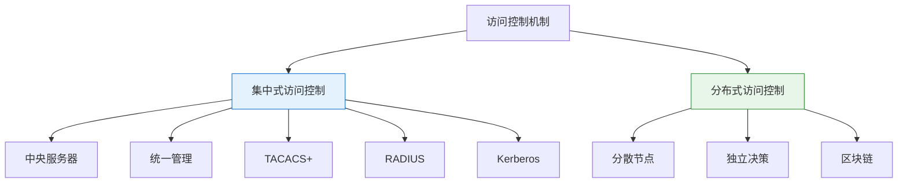
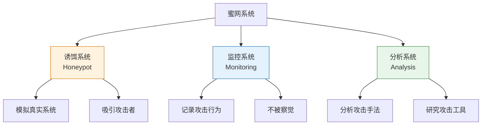
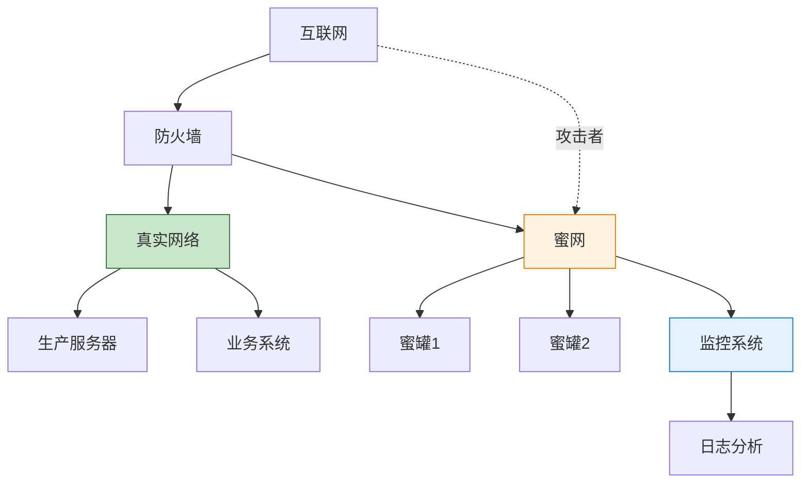
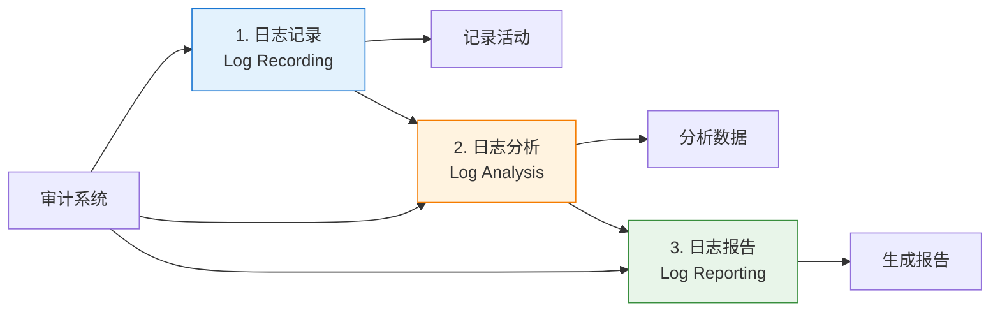
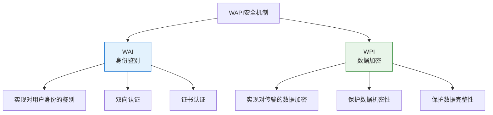

---
title: "CISP学习指南：访问控制机制、蜜网、审计系统与WAPI"
date: 2025-10-22
categories:
  - Cybersecurity
tags:
  - CISP
excerpt: "深入解析TACACS+集中式访问控制、蜜网功能、审计系统组成和WAPI安全机制。"
lang: zh-CN
available_langs: []
permalink: /zh-CN/2025/10/CISP-Access-Control-Audit-WAPI/
thumbnail: /assets/cisp/thumbnail.png
thumbnail_80: /assets/cisp/thumbnail_80.png
series: cisp
canonical_lang: zh-CN
comments: true
---

本文涵盖CISP认证中的访问控制机制、蜜网技术、审计系统和无线安全协议等重要知识点。

## 一、TACACS+协议与访问控制机制

### 1.1 访问控制机制类型

访问控制机制根据控制方式可分为集中式和分布式两种类型。

!!!anote "🔐 访问控制机制分类"
    **两种主要访问控制机制：**
    
    🏢 **集中式访问控制（Centralized Access Control）**
    - 访问控制决策由中央服务器统一管理
    - 所有访问请求都需要向中央服务器查询
    - 便于统一管理和策略执行
    - 典型协议：TACACS+、RADIUS、Kerberos
    
    🌐 **分布式访问控制（Distributed Access Control）**
    - 访问控制决策分散在各个节点
    - 每个节点独立做出访问决策
    - 提高系统可扩展性和容错性
    - 典型实现：区块链、分布式账本



### 1.2 TACACS+协议

!!!anote "💡 TACACS+协议特点"
    **TACACS+（Terminal Access Controller Access-Control System Plus）**
    
    ✅ **提供集中式访问控制**
    - 由中央服务器统一管理访问控制策略
    - 所有访问决策由TACACS+服务器做出
    - 网络设备作为客户端向服务器查询
    
    🔐 **AAA功能分离**
    - Authentication（认证）：验证用户身份
    - Authorization（授权）：确定用户权限
    - Accounting（计费/审计）：记录用户活动
    - 三个功能独立实现，可单独配置
    
    🛡️ **安全特性**
    - 全程加密通信
    - 使用TCP协议（端口49）
    - 支持多种认证方式

**TACACS+工作流程：**

```mermaid
sequenceDiagram
    participant U as 用户
    participant D as 网络设备<br/>(客户端)
    participant T as TACACS+服务器
    
    U->>D: 1. 请求访问
    D->>T: 2. 认证请求
    T->>D: 3. 认证响应
    D->>U: 4. 提示输入凭证
    U->>D: 5. 提供用户名密码
    D->>T: 6. 验证凭证
    T->>D: 7. 认证成功
    D->>T: 8. 授权请求
    T->>D: 9. 返回权限
    D->>U: 10. 允许访问
    
    Note over D,T: 集中式访问控制
    
    style T fill:#e3f2fd,stroke:#1976d2
```

### 1.3 TACACS+ vs RADIUS

**两种集中式访问控制协议对比：**

| 特性 | TACACS+ | RADIUS |
|------|---------|--------|
| 访问控制类型 | ✅ 集中式 | ✅ 集中式 |
| AAA功能 | 分离（独立） | 合并（认证+授权） |
| 传输协议 | TCP（端口49） | UDP（端口1812/1813） |
| 加密方式 | 全程加密 | 仅密码加密 |
| 主要应用 | 网络设备管理 | 网络接入控制 |
| 厂商支持 | Cisco主导 | 开放标准 |

!!!tip "💡 TACACS+的优势"
    **为什么选择TACACS+：**
    
    ✅ **AAA功能分离**
    - 可以单独配置认证、授权、审计
    - 灵活性更高
    - 便于细粒度控制
    
    ✅ **全程加密**
    - 整个通信过程加密
    - 安全性更高
    - 防止信息泄露
    
    ✅ **使用TCP**
    - 可靠传输
    - 连接状态管理
    - 适合设备管理

### 1.4 集中式访问控制的优势

**集中式访问控制的特点：**

```
集中式访问控制优势：
├── 统一管理
│   ├── 集中配置策略
│   ├── 统一用户管理
│   └── 便于维护更新
├── 一致性保证
│   ├── 策略统一执行
│   ├── 避免配置不一致
│   └── 减少安全漏洞
├── 审计便利
│   ├── 集中日志记录
│   ├── 便于审计分析
│   └── 合规性检查
└── 扩展性好
    ├── 易于添加新设备
    ├── 策略自动下发
    └── 减少配置工作
```

## 二、蜜网（Honeynet）

### 2.1 蜜网概述

!!!anote "🍯 蜜网的定义"
    **蜜网（Honeynet）**是一种网络安全技术，通过部署诱饵系统来吸引、监控和分析攻击者的行为。
    
    **核心思想：**
    - 部署看似真实但实际是陷阱的系统
    - 吸引攻击者进行攻击
    - 在不被察觉的情况下记录攻击行为
    - 分析攻击手法和工具



### 2.2 蜜网的功能

!!!anote "💡 蜜网的正确功能"
    **蜜网的核心功能：**
    
    ✅ **吸引和转移攻击**
    - 可以吸引或转移攻击者的注意力
    - 延缓他们对真正目标的攻击
    - 保护真实系统
    
    ✅ **隐蔽监控**
    - 吸引入侵者来嗅探、攻击
    - 同时不被觉察地将入侵者的活动记录下来
    - 获取攻击情报
    
    ✅ **监视、检测和分析**
    - 可以对攻击活动进行监视
    - 检测攻击行为
    - 分析攻击手法和工具
    
    ❌ **不是实时报警系统**
    - 蜜网不能进行攻击检测和实时报警
    - 这是入侵检测系统（IDS）的功能
    - 蜜网主要用于研究和分析

**蜜网 vs IDS功能对比：**

| 功能 | 蜜网（Honeynet） | 入侵检测系统（IDS） |
|------|-----------------|-------------------|
| 吸引攻击 | ✅ 主要功能 | ❌ 不具备 |
| 转移注意力 | ✅ 主要功能 | ❌ 不具备 |
| 隐蔽记录 | ✅ 主要功能 | ⚠️ 部分具备 |
| 监视分析 | ✅ 主要功能 | ✅ 主要功能 |
| 实时检测 | ❌ 不具备 | ✅ 主要功能 |
| 实时报警 | ❌ 不具备 | ✅ 主要功能 |
| 主动防御 | ❌ 不具备 | ⚠️ IPS具备 |

### 2.3 蜜网的工作原理

**蜜网部署架构：**



**蜜网工作流程：**

```
蜜网工作流程：
├── 1. 部署阶段
│   ├── 设置诱饵系统（蜜罐）
│   ├── 配置监控机制
│   └── 隔离真实网络
├── 2. 吸引阶段
│   ├── 模拟真实系统
│   ├── 暴露漏洞
│   └── 吸引攻击者
├── 3. 监控阶段
│   ├── 记录所有活动
│   ├── 捕获攻击数据
│   └── 保持隐蔽性
└── 4. 分析阶段
    ├── 分析攻击手法
    ├── 研究攻击工具
    └── 提取威胁情报
```

### 2.4 蜜网的应用价值

**蜜网的主要用途：**

| 用途 | 说明 | 价值 |
|------|------|------|
| 威胁情报收集 | 了解最新攻击手法 | 提前防范 |
| 攻击工具研究 | 分析恶意软件 | 开发防护措施 |
| 攻击者画像 | 了解攻击者行为模式 | 预测攻击 |
| 延缓攻击 | 转移攻击者注意力 | 保护真实系统 |
| 安全研究 | 学习攻击技术 | 提升防御能力 |
| 取证分析 | 收集攻击证据 | 法律追责 |

!!!warning "⚠️ 蜜网的局限性"
    **蜜网不能做什么：**
    
    ❌ **不能实时报警**
    - 蜜网主要用于研究和分析
    - 不是实时防护系统
    - 需要配合IDS/IPS使用
    
    ❌ **不能主动防御**
    - 只能被动接受攻击
    - 不能阻止攻击
    - 需要其他安全措施配合
    
    ⚠️ **存在风险**
    - 可能被攻击者识破
    - 可能成为攻击跳板
    - 需要严格隔离

## 三、审计系统

### 3.1 审计系统的基本组成

!!!anote "📊 审计系统的正确组成"
    **审计系统一般包含三个部分：**
    
    📝 **日志记录（Log Recording）**
    - 记录系统活动和事件
    - 捕获用户操作
    - 存储审计数据
    
    🔍 **日志分析（Log Analysis）**
    - 分析日志数据
    - 识别异常行为
    - 发现安全事件
    
    📄 **日志报告（Log Reporting）**
    - 生成审计报告
    - 展示分析结果
    - 支持决策制定



### 3.2 审计系统组成详解

**1. 日志记录（Log Recording）**

```
日志记录功能：
├── 记录内容
│   ├── 用户登录/登出
│   ├── 文件访问
│   ├── 系统配置变更
│   ├── 权限变更
│   └── 异常事件
├── 记录方式
│   ├── 实时记录
│   ├── 自动记录
│   └── 完整记录
└── 存储要求
    ├── 安全存储
    ├── 防篡改
    └── 长期保存
```

**2. 日志分析（Log Analysis）**

```
日志分析功能：
├── 分析方法
│   ├── 模式匹配
│   ├── 统计分析
│   ├── 关联分析
│   └── 异常检测
├── 分析目标
│   ├── 识别违规行为
│   ├── 发现安全事件
│   ├── 追踪攻击路径
│   └── 评估风险
└── 分析工具
    ├── SIEM系统
    ├── 日志分析软件
    └── 大数据分析
```

**3. 日志报告（Log Reporting）**

```
日志报告功能：
├── 报告类型
│   ├── 定期报告
│   ├── 事件报告
│   ├── 合规报告
│   └── 统计报告
├── 报告内容
│   ├── 审计结果
│   ├── 安全事件
│   ├── 违规行为
│   └── 改进建议
└── 报告用途
    ├── 管理决策
    ├── 合规审查
    ├── 事件调查
    └── 安全改进
```

### 3.3 审计系统的作用

!!!anote "💡 安全审计的作用"
    **安全审计是对系统活动和记录的独立检查和验证，主要作用包括：**
    
    ✅ **辅助辨识和分析未经授权的活动或攻击**
    - 通过日志分析发现异常行为
    - 识别潜在的安全威胁
    - 追踪攻击路径
    
    ✅ **对与已建立的安全策略的一致性进行核查**
    - 检查是否遵守安全策略
    - 验证访问控制有效性
    - 确保合规性
    
    ✅ **帮助发现需要改进的安全控制措施**
    - 识别安全弱点
    - 提出改进建议
    - 优化安全策略
    
    ❌ **不能及时阻断违规访问**
    - 审计系统是事后检查机制
    - 不能实时阻断访问
    - 这是访问控制系统的功能

**审计系统 vs 访问控制系统：**

| 功能 | 审计系统 | 访问控制系统 |
|------|---------|-------------|
| 记录活动 | ✅ 主要功能 | ⚠️ 部分功能 |
| 分析行为 | ✅ 主要功能 | ❌ 不具备 |
| 生成报告 | ✅ 主要功能 | ❌ 不具备 |
| 实时阻断 | ❌ 不具备 | ✅ 主要功能 |
| 事后分析 | ✅ 主要功能 | ❌ 不具备 |
| 合规检查 | ✅ 主要功能 | ⚠️ 部分功能 |

### 3.4 审计系统的实施

**审计系统实施要点：**

```
审计系统实施：
├── 1. 规划阶段
│   ├── 确定审计目标
│   ├── 识别审计对象
│   ├── 制定审计策略
│   └── 选择审计工具
├── 2. 部署阶段
│   ├── 配置日志记录
│   ├── 部署分析工具
│   ├── 设置报告机制
│   └── 测试验证
├── 3. 运行阶段
│   ├── 持续记录日志
│   ├── 定期分析数据
│   ├── 生成审计报告
│   └── 响应发现问题
└── 4. 改进阶段
    ├── 评估审计效果
    ├── 优化审计策略
    ├── 更新审计规则
    └── 培训审计人员
```

## 四、WAPI无线安全协议

### 4.1 WAPI概述

!!!anote "📡 WAPI协议"
    **WAPI（WLAN Authentication and Privacy Infrastructure）**
    
    WAPI是中国自主研发的无线局域网安全标准，用于保护无线网络的安全。
    
    **安全机制组成：**
    - WAI（WLAN Authentication Infrastructure）：身份鉴别
    - WPI（WLAN Privacy Infrastructure）：数据加密



### 4.2 WAPI安全机制详解

**WAI（WLAN Authentication Infrastructure）**

!!!anote "🔐 WAI - 身份鉴别"
    **WAI实现对用户身份的鉴别**
    
    ✅ **主要功能：**
    - 验证用户身份
    - 双向认证（用户和接入点互相认证）
    - 基于证书的认证
    
    🔑 **认证过程：**
    - 使用公钥基础设施（PKI）
    - 支持数字证书
    - 防止非法接入

**WPI（WLAN Privacy Infrastructure）**

!!!anote "🔒 WPI - 数据加密"
    **WPI实现对传输的数据加密**
    
    ✅ **主要功能：**
    - 加密无线传输数据
    - 保护数据机密性
    - 保护数据完整性
    
    🛡️ **加密特点：**
    - 使用对称加密算法
    - 动态密钥管理
    - 防止窃听和篡改

### 4.3 WAPI功能对比

**WAPI各组件功能对比：**

| 组件 | 功能 | 实现方式 | 保护目标 |
|------|------|---------|---------|
| WAI | 身份鉴别 | 证书认证、双向认证 | 防止非法接入 |
| WPI | 数据加密 | 对称加密、密钥管理 | 保护数据安全 |

!!!warning "⚠️ 常见误区"
    **错误说法：WAI实现对传输的数据加密**
    
    ❌ **问题：**
    - WAI负责身份鉴别，不是数据加密
    - 数据加密是WPI的功能
    - 混淆了两个组件的职责
    
    ✅ **正确理解：**
    - WAI：身份鉴别（Who you are）
    - WPI：数据加密（Protect your data）
    - 两者配合提供完整安全

### 4.4 WAPI vs WPA/WPA2

**无线安全协议对比：**

| 特性 | WAPI | WPA/WPA2 |
|------|------|----------|
| 标准来源 | 中国国家标准 | 国际标准 |
| 认证方式 | 证书认证（WAI） | PSK或802.1X |
| 加密方式 | WPI | TKIP/AES |
| 安全性 | 高 | 高 |
| 应用范围 | 主要在中国 | 全球通用 |
| 强制性 | 中国强制 | 国际推荐 |

## 五、总结

访问控制机制、蜜网、审计系统与WAPI的核心要点：

!!!success "🎯 关键要点"
    **TACACS+协议：**
    - TACACS+提供集中式访问控制机制
    - 不是分布式访问控制
    - AAA功能分离，全程加密
    
    **蜜网功能：**
    - 可以吸引或转移攻击者的注意力
    - 可以隐蔽记录入侵者的活动
    - 可以对攻击活动进行监视、检测和分析
    - 不能进行攻击检测和实时报警
    
    **审计系统组成：**
    - 日志记录：记录系统活动
    - 日志分析：分析日志数据
    - 日志报告：生成审计报告
    - 三个部分缺一不可
    
    **审计系统作用：**
    - 辅助辨识和分析未经授权的活动或攻击
    - 对安全策略的一致性进行核查
    - 帮助发现需要改进的安全控制措施
    - 不能及时阻断违反安全策略的访问
    
    **WAPI安全机制：**
    - WAI实现对用户身份的鉴别
    - WPI实现对传输的数据加密
    - 两者配合提供完整的无线安全

!!!tip "💡 实践建议"
    - 使用集中式访问控制简化管理
    - 部署蜜网收集威胁情报
    - 建立完善的审计系统
    - 定期分析审计日志
    - 在无线网络中使用WAPI或WPA2
    - 区分各组件的功能和职责
    - 配合多种安全机制形成纵深防御


## 六、路由器访问控制列表（ACL）

### 6.1 标准访问控制列表

!!!anote "🔐 标准ACL的判别条件"
    **路由器的标准访问控制列表以数据包的源地址作为判别条件**
    
    ✅ **标准ACL特点：**
    - 只检查数据包的源IP地址
    - 编号范围：1-99, 1300-1999
    - 判断简单，性能较高
    - 功能相对有限
    
    ❌ **标准ACL不检查：**
    - 数据包的大小
    - 数据包的端口号
    - 数据包的目的地址
    - 协议类型

**标准ACL vs 扩展ACL：**

| 特性 | 标准ACL | 扩展ACL |
|------|---------|--------|
| 判别条件 | 仅源IP地址 | 源/目的IP、端口、协议 |
| 编号范围 | 1-99, 1300-1999 | 100-199, 2000-2699 |
| 功能 | 简单过滤 | 精细控制 |
| 性能 | 较高 | 相对较低 |
| 应用场景 | 简单访问控制 | 复杂安全策略 |

## 七、防火墙部署模式

### 7.1 桥接/透明模式

!!!anote "🛡️ 桥接模式的特点"
    **桥接或透明模式的优点：**
    
    ✅ **不需要修改网络配置**
    - 防火墙对网络透明
    - 不需要修改IP地址
    - 部署简单快速
    
    ✅ **性能比较高**
    - 工作在数据链路层
    - 处理速度快
    - 延迟较低
    
    ✅ **防火墙本身不容易受到攻击**
    - 没有IP地址
    - 攻击者难以定位
    - 隐蔽性好
    
    ❌ **不易实现NAT**
    - NAT需要工作在网络层
    - 桥接模式工作在数据链路层
    - 无法进行地址转换

**防火墙部署模式对比：**

| 特性 | 路由模式 | 桥接/透明模式 |
|------|---------|-------------|
| 工作层次 | 网络层（Layer 3） | 数据链路层（Layer 2） |
| IP地址 | 需要配置 | 不需要 |
| 网络修改 | 需要修改 | 不需要修改 |
| NAT支持 | ✅ 支持 | ❌ 不支持 |
| 性能 | 相对较低 | 较高 |
| 隐蔽性 | 较低 | 高 |
| 部署难度 | 较高 | 较低 |

## 八、入侵检测系统（IDS）

### 8.1 IDS检测方法

!!!anote "🔍 IDS的两种检测方法"
    **入侵检测系统的检测方法：**
    
    📋 **基于特征（Signature-based）**
    - 也称为基于知识的检测
    - 匹配已知攻击特征
    - 误报率低
    - 无法检测新攻击
    
    📊 **基于行为（Behavior-based）**
    - 也称为基于异常的检测
    - 检测偏离正常行为的活动
    - 可以检测新攻击
    - 误报率高

### 8.2 两种检测方法对比

!!!anote "💡 IDS检测方法的正确理解"
    **关键区别：**
    
    ✅ **基于特征的系统**
    - 只能检测已知攻击类型
    - 不能检测新的攻击类型
    - 误报率低（因为匹配已知特征）
    - 需要定期更新特征库
    
    ✅ **基于行为的系统**
    - 可以检测新的攻击类型
    - 误报率高（正常行为可能被误判）
    - 需要建立正常行为基线
    - 维护行为模型数据库

**IDS检测方法详细对比：**

| 特性 | 基于特征（Signature-based） | 基于行为（Behavior-based） |
|------|---------------------------|-------------------------|
| 检测原理 | 匹配已知攻击特征 | 检测异常行为 |
| 检测新攻击 | ❌ 不能 | ✅ 能 |
| 误报率 | ⭐⭐ 低 | ⭐⭐⭐⭐⭐ 高 |
| 漏报率 | ⭐⭐⭐⭐ 高（对新攻击） | ⭐⭐ 低 |
| 维护工作 | 更新特征库 | 维护行为基线 |
| 数据库类型 | 特征数据库 | 行为/状态数据库 |
| 性能开销 | 较低 | 较高 |
| 适用场景 | 已知威胁防护 | 未知威胁检测 |

## 九、网络入侵检测系统（NIDS）

### 9.1 NIDS常见技术

!!!anote "🔍 NIDS技术"
    **网络入侵检测系统（NIDS）的常见技术：**
    
    ✅ **协议分析（Protocol Analysis）**
    - 分析网络协议
    - 检测协议异常
    - NIDS的核心技术
    
    ✅ **零拷贝（Zero Copy）**
    - 减少数据复制
    - 提高处理性能
    - 优化技术
    
    ✅ **IP碎片重组（IP Fragment Reassembly）**
    - 重组分片数据包
    - 检测分片攻击
    - 必要的技术
    
    ❌ **SYN Cookie**
    - 防御SYN Flood攻击
    - 属于防火墙/IPS技术
    - 不属于NIDS技术

**NIDS技术分类：**

| 技术 | 类型 | 用途 | 是否属于NIDS |
|------|------|------|-------------|
| 协议分析 | 检测技术 | 分析协议异常 | ✅ 是 |
| 零拷贝 | 性能优化 | 提高处理速度 | ✅ 是 |
| IP碎片重组 | 检测技术 | 检测分片攻击 | ✅ 是 |
| SYN Cookie | 防御技术 | 防御SYN Flood | ❌ 否 |

**为什么SYN Cookie不属于NIDS技术：**

!!!warning "⚠️ 关键区分"
    **NIDS vs IPS/防火墙：**
    
    **NIDS（入侵检测系统）：**
    - 被动监控和检测
    - 发现攻击并报警
    - 不主动阻断攻击
    - 技术：协议分析、特征匹配、异常检测
    
    **IPS/防火墙（入侵防御系统）：**
    - 主动防御和阻断
    - 阻止攻击发生
    - 实时防护
    - 技术：SYN Cookie、连接限制、主动阻断
    
    **SYN Cookie：**
    - 是一种主动防御技术
    - 用于防御SYN Flood攻击
    - 属于IPS/防火墙技术
    - 不属于NIDS的被动检测技术

## 十、总结

访问控制机制、蜜网、审计系统、WAPI、ACL、防火墙和IDS的核心要点：

!!!success "🎯 关键要点"
    **TACACS+协议：**
    - TACACS+提供集中式访问控制机制
    - 不是分布式访问控制
    - AAA功能分离，全程加密
    
    **蜜网功能：**
    - 可以吸引或转移攻击者的注意力
    - 可以隐蔽记录入侵者的活动
    - 可以对攻击活动进行监视、检测和分析
    - 不能进行攻击检测和实时报警
    
    **审计系统组成：**
    - 日志记录：记录系统活动
    - 日志分析：分析日志数据
    - 日志报告：生成审计报告
    - 三个部分缺一不可
    
    **审计系统作用：**
    - 辅助辨识和分析未经授权的活动或攻击
    - 对安全策略的一致性进行核查
    - 帮助发现需要改进的安全控制措施
    - 不能及时阻断违反安全策略的访问
    
    **WAPI安全机制：**
    - WAI实现对用户身份的鉴别
    - WPI实现对传输的数据加密
    - 两者配合提供完整的无线安全
    
    **路由器ACL：**
    - 标准ACL以源地址作为判别条件
    - 扩展ACL可以检查源/目的地址、端口、协议
    - 标准ACL功能简单但性能高
    
    **防火墙部署模式：**
    - 桥接/透明模式不需要修改网络配置
    - 桥接模式性能高，隐蔽性好
    - 桥接模式不易实现NAT
    
    **IDS检测方法：**
    - 基于特征：误报率低，不能检测新攻击
    - 基于行为：误报率高，能检测新攻击
    - 基于行为系统维护行为/状态数据库
    
    **NIDS技术：**
    - 协议分析、零拷贝、IP碎片重组属于NIDS技术
    - SYN Cookie不属于NIDS技术
    - SYN Cookie是IPS/防火墙的主动防御技术

!!!tip "💡 实践建议"
    - 使用集中式访问控制简化管理
    - 部署蜜网收集威胁情报
    - 建立完善的审计系统
    - 定期分析审计日志
    - 在无线网络中使用WAPI或WPA2
    - 根据需求选择标准或扩展ACL
    - 根据网络环境选择防火墙部署模式
    - 结合基于特征和基于行为的IDS
    - 配合多种安全机制形成纵深防御
