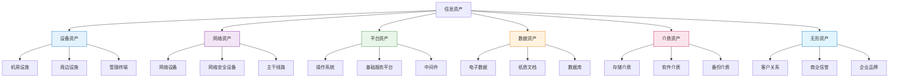
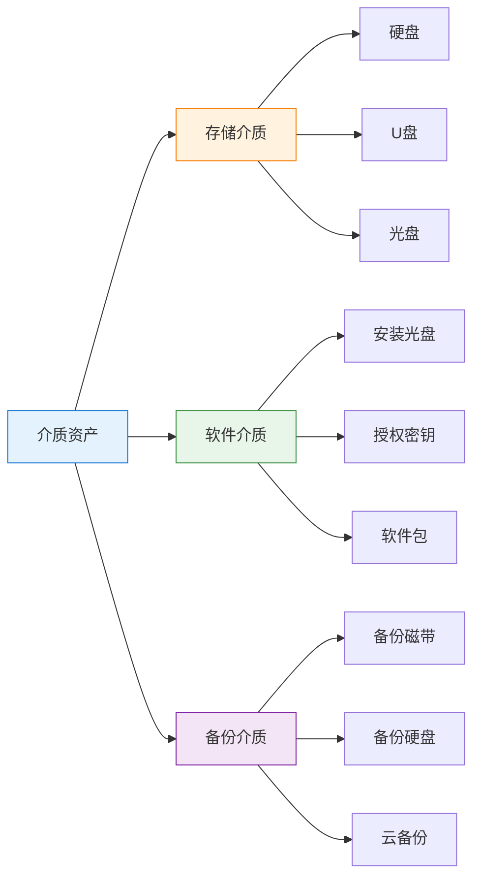
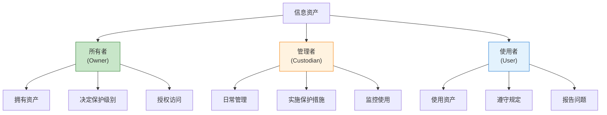
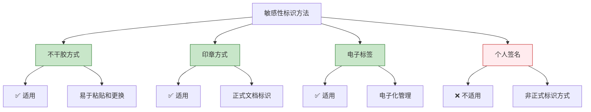
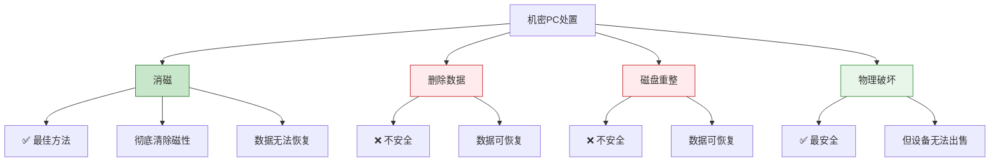
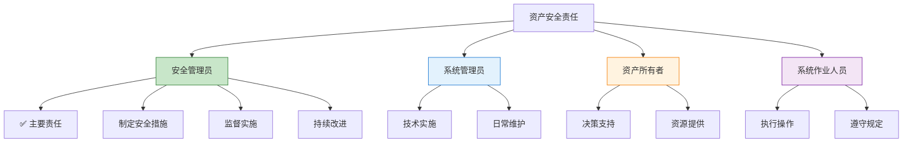

---
title: "CISP学习指南：资产管理"
date: 2025-10-10
categories:
  - Cybersecurity
tags:
  - CISP
excerpt: "深入解析CISP认证中的资产管理知识点，涵盖资产分类、资产清单和资产责任人管理。"
lang: zh-CN
available_langs: []
permalink: /zh-CN/2025/10/CISP-Asset-Management/
thumbnail: /assets/cisp/thumbnail.png
thumbnail_80: /assets/cisp/thumbnail_80.png
series: cisp
canonical_lang: zh-CN
---

资产管理是信息安全管理的基础，只有明确了组织拥有哪些资产，才能有效地保护这些资产。

## 一、资产分类体系

### 1.1 信息资产分类

信息资产可以分为多个类别，每个类别有不同的管理要求。



## 二、各类资产详解

### 2.1 设备类资产

**设备类资产包括：**

| 资产类型 | 具体内容 | 示例 |
|---------|---------|------|
| 机房设施 | 数据中心基础设施 | 机柜、空调、UPS、消防系统 |
| 周边设施 | 支持性设施 | 监控系统、门禁系统、配电系统 |
| 管理终端 | 管理和操作设备 | 服务器、工作站、笔记本电脑 |

!!!anote "💡 设备资产特点"
    **设备资产的管理重点：**
    - 📍 物理位置管理
    - 🔧 维护保养记录
    - 📊 生命周期管理
    - 🔒 物理安全控制

**不属于设备资产的：**
- ❌ 操作系统（属于平台资产）
- ❌ 应用软件（属于平台资产）
- ❌ 数据文件（属于数据资产）

### 2.2 网络类资产

**网络类资产包括：**


{
  "title": {
    "text": "网络资产分布"
  },
  "tooltip": {
    "trigger": "item"
  },
  "series": [{
    "type": "pie",
    "radius": ["40%", "70%"],
    "data": [
      {"value": 40, "name": "网络设备", "itemStyle": {"color": "#2196f3"}},
      {"value": 35, "name": "网络安全设备", "itemStyle": {"color": "#4caf50"}},
      {"value": 25, "name": "主干线路", "itemStyle": {"color": "#ff9800"}}
    ],
    "label": {
      "show": true,
      "formatter": "{b}: {d}%"
    }
  }]
}


| 资产类型 | 具体内容 | 示例 |
|---------|---------|------|
| 网络设备 | 网络连接和传输设备 | 路由器、交换机、无线AP |
| 网络安全设备 | 网络安全防护设备 | 防火墙、IDS/IPS、WAF |
| 主干线路 | 网络传输线路 | 光纤、专线、互联网接入 |

**不属于网络资产的：**
- ❌ 基础服务平台（属于平台资产）
- ❌ 网络管理软件（属于平台资产）

### 2.3 平台类资产

**平台类资产包括：**

```
平台资产层次：
├── 操作系统
│   ├── Windows Server
│   ├── Linux
│   └── Unix
├── 基础服务平台
│   ├── 数据库系统
│   ├── 中间件
│   └── 应用服务器
└── 应用软件
    ├── 业务应用
    ├── 办公软件
    └── 安全软件
```

!!!warning "⚠️ 平台资产识别"
    **常见误区：**
    
    ❌ **错误**：将操作系统归类为设备资产
    ✅ **正确**：操作系统属于平台资产
    
    ❌ **错误**：将基础服务平台归类为网络资产
    ✅ **正确**：基础服务平台属于平台资产
    
    **记忆要点：**
    - 硬件 = 设备资产
    - 软件 = 平台资产
    - 数据 = 数据资产

### 2.4 数据类资产

**数据类资产包括：**

| 资产类型 | 具体内容 | 示例 |
|---------|---------|------|
| 电子数据 | 数字化存储的数据 | 数据库记录、电子文档、邮件 |
| 纸质文档 | 物理形式的文档 | 合同、报告、设计图纸 |
| 数据库 | 结构化数据存储 | 业务数据库、配置数据库 |

**不属于数据资产的：**
- ❌ 凭证（属于介质资产）
- ❌ 存储介质本身（属于介质资产）

!!!anote "💡 数据资产特殊性"
    **数据资产的特点：**
    - 📊 价值最高
    - 🔄 易复制传播
    - ⏰ 时效性强
    - 🔒 需要最严格保护

### 2.5 介质类资产

**介质类资产包括：**



**不属于介质资产的：**
- ❌ 纸质文档（属于数据资产）
- ❌ 电子凭证（属于数据资产）

### 2.6 无形资产

**无形资产包括：**

| 资产类型 | 具体内容 | 价值体现 |
|---------|---------|---------|
| 客户关系 | 客户资源和关系网络 | 业务持续性、市场份额 |
| 商业信誉 | 企业声誉和信用 | 品牌价值、市场地位 |
| 企业品牌 | 品牌形象和知名度 | 市场竞争力、溢价能力 |

**不属于无形资产的：**
- ❌ 电子数据（属于数据资产）
- ❌ 客户数据库（属于数据资产）

!!!anote "💡 无形资产的重要性"
    **为什么无形资产重要：**
    - 💰 价值难以量化但影响巨大
    - 🛡️ 一旦受损难以恢复
    - 📈 直接影响企业市场价值
    - ⚖️ 可能涉及法律责任

## 三、资产责任人管理

### 3.1 资产责任人角色

每个信息资产都必须明确其责任人。



**各角色职责对比：**

| 角色 | 主要职责 | 权限 | 责任 |
|------|---------|------|------|
| 所有者 | 资产归属、保护级别决策 | 最高决策权 | 资产安全最终责任 |
| 管理者 | 日常管理、安全措施实施 | 管理和配置权限 | 保护措施有效性 |
| 使用者 | 按规定使用资产 | 授权范围内使用 | 合规使用责任 |

!!!danger "🚨 必须明确的责任人"
    **信息资产必须明确：**
    
    ✅ **所有者** - 谁拥有这个资产
    ✅ **管理者** - 谁负责管理这个资产
    ✅ **使用者** - 谁在使用这个资产
    
    ❌ **不需要明确：**
    - 厂商（外部供应商，非资产责任人）
    
    **原因：**
    - 厂商只是提供产品或服务
    - 不对资产的安全负责
    - 不参与日常资产管理

### 3.2 资产清单管理

**资产清单应包含的信息：**

```
资产清单模板：
├── 基本信息
│   ├── 资产编号
│   ├── 资产名称
│   ├── 资产类别
│   └── 资产位置
├── 责任信息
│   ├── 所有者
│   ├── 管理者
│   └── 使用部门
├── 技术信息
│   ├── 型号规格
│   ├── 配置信息
│   └── 版本信息
├── 安全信息
│   ├── 保密等级
│   ├── 重要程度
│   └── 保护措施
└── 管理信息
    ├── 采购日期
    ├── 维护记录
    └── 变更历史
```

## 四、资产管理流程

### 4.1 资产生命周期


**各阶段管理要点：**

| 阶段 | 管理要点 | 关键活动 |
|------|---------|---------|
| 采购/创建 | 需求评估、安全要求 | 立项审批、采购流程 |
| 登记入库 | 资产标识、信息录入 | 编号分配、清单登记 |
| 分配使用 | 责任人确认、授权 | 交接手续、使用培训 |
| 维护管理 | 定期检查、更新维护 | 巡检记录、维护日志 |
| 变更更新 | 变更审批、影响评估 | 变更记录、测试验证 |
| 退役处置 | 数据清除、安全处置 | 退役审批、销毁记录 |

## 五、资产管理最佳实践

### 5.1 资产盘点

**定期盘点要求：**

- 📅 至少每年进行一次全面盘点
- 🔍 季度进行抽查盘点
- 📊 重要资产每月核查
- 🚨 异常情况立即盘点

### 5.2 资产保护

**分级保护原则：**


{
  "title": {
    "text": "资产保护级别分布"
  },
  "tooltip": {
    "trigger": "axis",
    "axisPointer": {
      "type": "shadow"
    }
  },
  "xAxis": {
    "type": "category",
    "data": ["公开", "内部", "机密", "绝密"]
  },
  "yAxis": {
    "type": "value",
    "name": "保护强度"
  },
  "series": [{
    "type": "bar",
    "data": [
      {"value": 20, "itemStyle": {"color": "#4caf50"}},
      {"value": 50, "itemStyle": {"color": "#2196f3"}},
      {"value": 80, "itemStyle": {"color": "#ff9800"}},
      {"value": 100, "itemStyle": {"color": "#f44336"}}
    ],
    "label": {
      "show": true,
      "position": "top"
    }
  }]
}


## 五、资产敏感性管理

### 5.1 敏感性定义

信息资产敏感性是指资产的机密性特征。

!!!anote "💡 敏感性即机密性"
    **敏感性的定义：**
    
    敏感性，即**机密性（Confidentiality）**，是指信息资产接受授权访问、限制和拒绝未授权访问的特性。
    
    **与其他安全属性的区别：**
    - 🔒 **机密性（Confidentiality）** = 敏感性 ✅
    - ✅ **完整性（Integrity）** ≠ 敏感性 ❌
    - 🔄 **可用性（Availability）** ≠ 敏感性 ❌
    - 🛡️ **安全性（Security）** = 综合概念，包含机密性、完整性、可用性

### 5.2 敏感性标识方法

**常用标识方式：**



**标识方式对比：**

| 标识方式 | 是否适用 | 特点 | 适用场景 |
|---------|---------|------|----------|
| 不干胶方式 | ✅ 是 | 易于粘贴、可更换 | 纸质文档、设备 |
| 印章方式 | ✅ 是 | 正式、权威 | 正式文档、合同 |
| 电子标签 | ✅ 是 | 可追踪、自动化 | 电子资产、设备 |
| 个人签名 | ❌ 否 | 非正式、不规范 | 不适用于敏感性标识 |

!!!warning "⚠️ 个人签名不适用"
    **为什么个人签名不适用于敏感性标识：**
    - 缺乏标准化
    - 不够正式和权威
    - 难以统一管理
    - 无法清晰表达敏感等级

### 5.3 资产保密期限

不同类型的信息资产有不同的保密期限要求。

**保密期限规定：**


{
  "title": {
    "text": "不同资产类型的保密期限"
  },
  "tooltip": {
    "trigger": "axis",
    "axisPointer": {
      "type": "shadow"
    }
  },
  "xAxis": {
    "type": "category",
    "data": ["设施", "网络", "平台", "介质", "应用"]
  },
  "yAxis": {
    "type": "category",
    "data": ["短期", "中期", "长期"]
  },
  "series": [{
    "type": "bar",
    "data": [
      {"value": 2, "itemStyle": {"color": "#4caf50"}},
      {"value": 2, "itemStyle": {"color": "#4caf50"}},
      {"value": 2, "itemStyle": {"color": "#4caf50"}},
      {"value": 2, "itemStyle": {"color": "#4caf50"}},
      {"value": 2, "itemStyle": {"color": "#4caf50"}}
    ]
  }]
}


| 资产类型 | 保密期限 | 说明 |
|---------|---------|------|
| 设施类资产 | 长期 | 基础设施配置信息需长期保密 |
| 网络类资产 | 长期 | 网络架构和配置需长期保密 |
| 平台类资产 | 长期 | 系统配置和架构需长期保密 |
| 介质类资产 | 长期 | 存储介质信息需长期保密 |
| 应用类资产 | 长期 | 应用配置和数据需长期保密 |

!!!anote "💡 长期保密的原因"
    **为什么这些资产需要长期保密：**
    - 🏗️ 基础设施变化缓慢
    - 🔧 配置信息长期有效
    - 🎯 攻击者可长期利用
    - 🛡️ 安全架构需持续保护

### 5.4 机密资料处置

当曾经用于存放机密资料的设备需要处置时，必须采取适当措施。

**PC出售前的处理方法：**



!!!anote "💡 消磁是最佳选择"
    **在公开市场出售时选择消磁的原因：**
    
    ✅ **彻底清除**
    - 破坏磁性介质的磁性
    - 数据无法通过任何方式恢复
    - 符合安全要求
    
    ✅ **设备可用**
    - 硬盘仍可使用（需重新格式化）
    - 设备可以正常出售
    - 平衡安全与经济性
    
    ❌ **其他方法的问题：**
    - 删除数据：可通过工具恢复
    - 磁盘重整：数据仍可恢复
    - 物理破坏：设备无法出售

### 5.5 档案访问控制

**防止擅自使用资料档案的方法：**

| 方法 | 有效性 | 说明 |
|------|--------|------|
| 使用访问控制软件 | ⭐⭐⭐⭐⭐ 最有效 | 技术手段强制控制 |
| 自动化的档案访问入口 | ⭐⭐⭐⭐ 有效 | 统一入口便于管理 |
| 磁带库管理 | ⭐⭐⭐ 一般 | 仅适用于磁带介质 |
| 物理隔离 | ⭐⭐⭐⭐ 有效 | 物理层面控制 |

!!!anote "💡 访问控制软件最有效"
    **使用访问控制软件的优势：**
    - 🔐 强制访问控制
    - 📊 详细审计日志
    - 👥 细粒度权限管理
    - ⚡ 实时监控和告警
    - 🔄 集中管理和配置

### 5.6 安全标记

**安全标记的定义：**

给计算机系统的资产分配的记号被称为**安全标记（Security Label）**。

**安全标记的作用：**
- 🏷️ 标识资产的敏感等级
- 🔒 指导访问控制决策
- 📋 支持强制访问控制（MAC）
- 📊 便于资产分类管理

**相关概念区分：**

| 术语 | 含义 | 用途 |
|------|------|------|
| 安全标记 | 资产的敏感性标识 | 标识和控制 |
| 安全属性 | 资产的安全特性 | 描述安全特征 |
| 安全特征 | 资产的安全表现 | 安全评估 |
| 安全级别 | 安全保护等级 | 分级保护 |

## 六、资产安全责任

### 6.1 安全措施责任人

维持对于信息资产的适当的安全措施的责任在于**安全管理员**。

**责任分配：**



!!!anote "💡 安全管理员的核心责任"
    **为什么安全管理员负主要责任：**
    
    📋 **专业职责**
    - 安全是其核心工作
    - 具备专业知识和技能
    - 了解安全最佳实践
    
    🎯 **全局视角**
    - 统筹整体安全策略
    - 协调各方资源
    - 平衡安全与业务
    
    🔄 **持续改进**
    - 监控安全状况
    - 评估安全措施有效性
    - 及时调整和优化

## 七、总结

资产管理的核心在于：

1. **分类清晰**：正确识别和分类各类资产
2. **责任明确**：每个资产都有明确的所有者、管理者和使用者
3. **敏感性管理**：正确标识和保护敏感资产
4. **全程管理**：覆盖资产全生命周期
5. **定期盘点**：确保资产清单准确完整
6. **分级保护**：根据资产重要性实施差异化保护

!!!success "🎯 关键要点"
    - 操作系统属于平台资产，不是设备资产
    - 基础服务平台属于平台资产，不是网络资产
    - 纸质文档属于数据资产，不是介质资产
    - 电子数据属于数据资产，不是无形资产
    - 信息资产必须明确所有者、管理者和使用者
    - 厂商不是资产责任人
    - 敏感性即机密性，是资产的保密特性
    - 个人签名不属于敏感性标识方法
    - 设施、网络、平台、介质、应用类资产保密期限为长期
    - 机密PC出售前应进行消磁处理
    - 使用访问控制软件是防止擅自使用档案的最有效方法
    - 安全标记是给资产分配的敏感性记号
    - 安全管理员负责维持资产的安全措施

!!!tip "💡 实践建议"
    - 建立完整的资产清单数据库
    - 使用资产管理系统自动化管理
    - 定期进行资产盘点和审计
    - 建立资产变更管理流程
    - 实施资产分级保护策略
    - 加强资产安全意识培训
