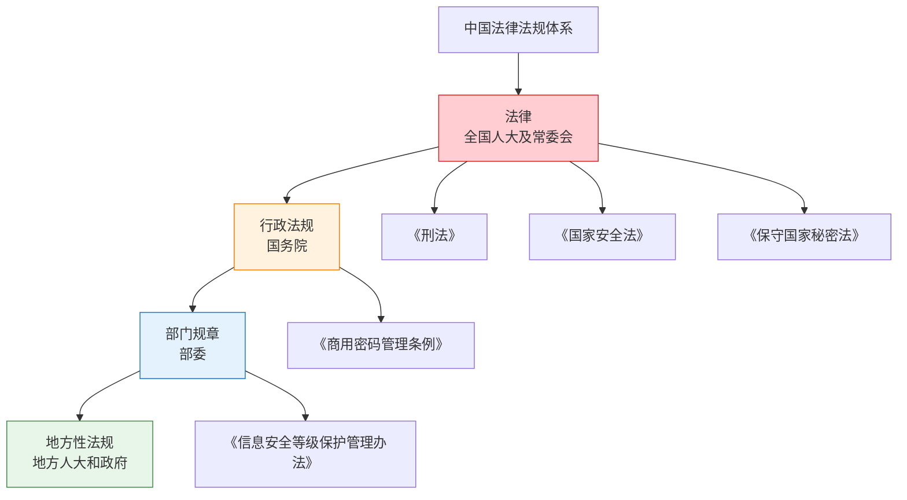
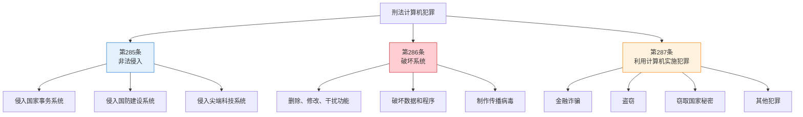
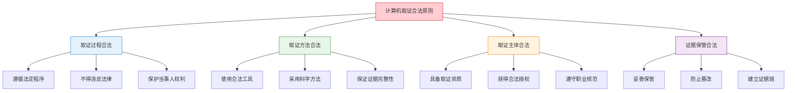
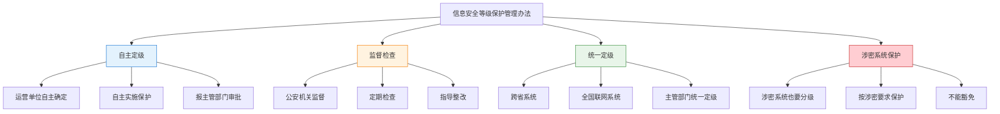
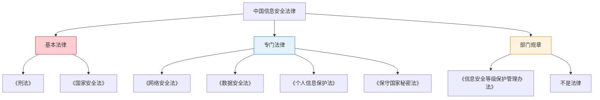
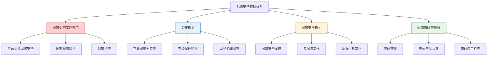
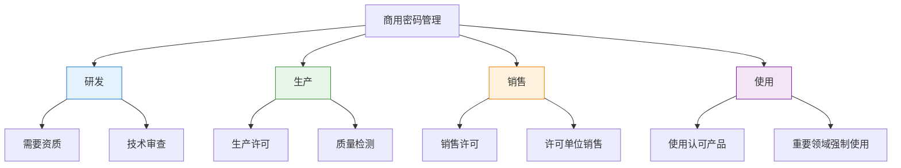
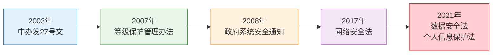
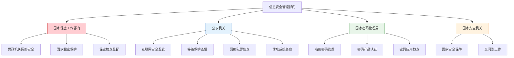

---
title: "CISP学习指南：中国信息安全法律法规体系"
date: 2025-10-22
categories:
  - Cybersecurity
tags:
  - CISP
excerpt: "全面解析CISP认证中的中国信息安全法律法规体系，包括刑法、保密法、等级保护管理办法等核心法律知识点。"
lang: zh-CN
available_langs: []
permalink: /zh-CN/2025/10/CISP-China-Information-Security-Laws/
thumbnail: /assets/cisp/thumbnail.png
thumbnail_80: /assets/cisp/thumbnail_80.png
series: cisp
canonical_lang: zh-CN
comments: true
---

信息安全法律法规是保障国家网络安全的重要基石。本指南系统梳理中国信息安全法律法规体系，帮助理解法律层级、主要法律内容和管理体系。

## 一、中国信息安全法律法规体系概述

### 1.1 法律法规层级结构

中国信息安全法律法规形成了完整的层级体系。

!!!anote "📚 法律法规层级"
    **中国法律法规的层级结构：**
    
    🏛️ **第一层：法律**
    - 由全国人民代表大会及其常委会制定
    - 效力最高
    - 示例：《刑法》《国家安全法》《保守国家秘密法》
    
    📋 **第二层：行政法规**
    - 由国务院制定
    - 效力次于法律
    - 示例：《商用密码管理条例》
    
    📄 **第三层：部门规章**
    - 由国务院各部委制定
    - 效力次于行政法规
    - 示例：《信息安全等级保护管理办法》
    
    📝 **第四层：地方性法规和规章**
    - 由地方人大和政府制定
    - 在本行政区域内有效



### 1.2 法律与规章的区别

!!!warning "⚠️ 重要区分"
    **法律 vs 规章：**
    
    ✅ **法律的特征**
    - 由全国人大及其常委会制定
    - 效力最高
    - 适用范围最广
    - 示例：《刑法》《国家安全法》
    
    ✅ **规章的特征**
    - 由国务院部委或地方政府制定
    - 效力低于法律和行政法规
    - 适用范围相对较窄
    - 示例：《信息安全等级保护管理办法》
    
    ❌ **常见错误**
    - 将《信息安全等级保护管理办法》误认为法律
    - 实际上它是部门规章，不是法律

**法律与规章对比：**

| 特征 | 法律 | 部门规章 |
|------|------|---------|
| 制定机关 | 全国人大及常委会 | 国务院部委 |
| 效力等级 | 最高 | 较低 |
| 适用范围 | 全国 | 特定领域 |
| 示例 | 《刑法》《国家安全法》 | 《信息安全等级保护管理办法》 |


## 二、《刑法》中的计算机犯罪

### 2.1 刑法相关条款

《刑法》第六章第285、286、287条对计算机犯罪进行了明确规定。

!!!anote "⚖️ 刑法计算机犯罪条款"
    **《刑法》第285条：非法侵入计算机信息系统罪**
    - 非法侵入国家事务、国防建设、尖端科学技术领域的计算机信息系统
    - 处三年以下有期徒刑或者拘役
    
    **《刑法》第286条：破坏计算机信息系统罪**
    - 违反国家规定，对计算机信息系统功能进行删除、修改、增加、干扰
    - 对计算机信息系统中存储、处理或者传输的数据和应用程序进行删除、修改、增加
    - 故意制作、传播计算机病毒等破坏性程序
    - 后果严重的，处五年以下有期徒刑或者拘役
    
    **《刑法》第287条：利用计算机实施犯罪**
    - 利用计算机实施金融诈骗、盗窃、贪污、挪用公款、窃取国家秘密或者其他犯罪
    - 依照本法有关规定定罪处罚

### 2.2 刑法规定的计算机犯罪类型



### 2.3 刑法规定的罪名范围

!!!warning "⚠️ 罪名范围限定"
    **《刑法》第285-287条规定的罪名：**
    - ✅ 非法侵入计算机信息系统罪（第285条）
    - ✅ 破坏计算机信息系统罪（第286条）
    - ✅ 利用计算机实施犯罪（第287条）
    
    **注意：**
    - 这三条仅涵盖特定的计算机犯罪行为
    - 其他与信息系统相关的犯罪可能在刑法其他条款中规定
    - 例如：玩忽职守罪在刑法第397条，不在计算机犯罪专门条款中

**刑法计算机犯罪罪名对比：**

| 罪名 | 法律依据 | 主要行为 | 是否在285-287条 |
|------|---------|---------|----------------|
| 非法侵入计算机信息系统罪 | 第285条 | 非法侵入特定系统 | ✅ 是 |
| 破坏计算机信息系统罪 | 第286条 | 破坏系统功能和数据 | ✅ 是 |
| 利用计算机实施犯罪 | 第287条 | 利用计算机实施其他犯罪 | ✅ 是 |
| 国家重要信息系统管理者玩忽职守罪 | 不存在 | - | ❌ 否 |

### 2.4 计算机犯罪的量刑

**刑法规定的量刑标准：**

```
计算机犯罪量刑：
├── 非法侵入计算机信息系统罪
│   ├── 基本刑：三年以下有期徒刑或拘役
│   └── 适用：侵入国家事务、国防、尖端科技系统
├── 破坏计算机信息系统罪
│   ├── 后果严重：五年以下有期徒刑或拘役
│   ├── 后果特别严重：五年以上有期徒刑
│   └── 适用：破坏系统功能、数据、传播病毒
└── 利用计算机实施犯罪
    ├── 依照相应犯罪定罪处罚
    └── 适用：利用计算机实施金融诈骗、盗窃等
```

### 2.5 计算机犯罪的构成要件

!!!anote "🔍 犯罪构成要件"
    **计算机犯罪的构成要件：**
    
    1️⃣ **主体要件**
    - 一般主体，年满16周岁具有刑事责任能力的人
    
    2️⃣ **主观要件**
    - 故意，明知自己的行为会危害计算机信息系统安全
    
    3️⃣ **客体要件**
    - 计算机信息系统的安全和正常运行
    
    4️⃣ **客观要件**
    - 实施了非法侵入、破坏或利用计算机实施犯罪的行为
    - 造成了一定的危害后果

**计算机犯罪行为示例：**

| 犯罪类型 | 行为示例 | 法律后果 |
|---------|---------|---------|
| 非法侵入 | 黑客攻击政府网站 | 三年以下有期徒刑 |
| 破坏系统 | 制作传播勒索病毒 | 五年以下有期徒刑 |
| 利用计算机犯罪 | 网络诈骗 | 按诈骗罪处罚 |
| 破坏数据 | 删除企业重要数据 | 五年以下有期徒刑 |


## 三、计算机取证与合法原则

### 3.1 计算机取证的定义

!!!anote "🔍 计算机取证"
    **计算机取证（Computer Forensics）：**
    
    运用计算机科学和技术的原理和方法，对计算机犯罪行为进行证据获取、保存、分析和出示的过程。
    
    **主要目的：**
    - 获取电子证据
    - 还原犯罪事实
    - 支持司法诉讼
    - 打击计算机犯罪

### 3.2 计算机取证的合法原则

!!!warning "⚖️ 合法原则的核心要求"
    **合法原则的基本含义：**
    - 计算机取证在任何时候都必须保证符合相关法律法规
    - 合法性是取证工作的首要原则和前提条件
    
    **合法原则的四个维度：**
    - 取证过程必须合法：遵循法定程序，不得违反法律
    - 取证方法必须合法：使用合法工具，采用科学方法
    - 取证主体必须合法：具备取证资质，获得合法授权
    - 证据保管必须合法：妥善保管，防止篡改
    
    **重要提示：**
    - 不能以"紧急情况"为由先取证后补手续
    - 取证主体不限于执法机构，企业和个人在合法授权下也可进行
    - 但涉及刑事案件的取证通常需要执法机关参与



### 3.3 计算机取证的基本原则

**计算机取证的五大原则：**

| 原则 | 说明 | 要求 |
|------|------|------|
| 合法性原则 | 符合法律法规 | 任何时候都必须合法 |
| 规范性原则 | 遵循技术规范 | 使用标准化方法 |
| 及时性原则 | 及时固定证据 | 防止证据灭失 |
| 完整性原则 | 保证证据完整 | 不得删改证据 |
| 可重现性原则 | 结果可重现 | 他人可验证 |

### 3.4 计算机取证的流程

```
计算机取证流程：
├── 1. 准备阶段
│   ├── 获得授权
│   ├── 准备工具
│   ├── 制定方案
│   └── 确保合法性
├── 2. 识别阶段
│   ├── 识别证据源
│   ├── 确定取证范围
│   └── 评估取证风险
├── 3. 获取阶段
│   ├── 现场勘查
│   ├── 数据采集
│   ├── 制作镜像
│   └── 保证完整性
├── 4. 保存阶段
│   ├── 妥善保管
│   ├── 防止篡改
│   ├── 建立证据链
│   └── 记录详细信息
├── 5. 分析阶段
│   ├── 数据恢复
│   ├── 数据分析
│   ├── 关联分析
│   └── 形成结论
└── 6. 出示阶段
    ├── 制作报告
    ├── 出庭作证
    └── 接受质证
```

## 四、《计算机信息系统国际联网保密管理规定》

### 4.1 制定部门

!!!anote "📋 制定部门"
    **《计算机信息系统国际联网保密管理规定》制定部门：**
    - ✅ 国家保密局
    
    **其他部门的职责：**
    - 公安部：负责网络安全监督管理
    - 工信部：负责互联网行业管理
    - 国家密码管理委员会办公室：负责密码管理

**信息安全管理部门职责对比：**

| 部门 | 主要职责 | 相关法规 |
|------|---------|---------|
| 国家保密局 | 保密管理 | 《计算机信息系统国际联网保密管理规定》 |
| 公安部 | 网络安全监督 | 《计算机信息网络国际联网安全保护管理办法》 |
| 工信部 | 互联网行业管理 | 《互联网信息服务管理办法》 |
| 国家密码管理局 | 密码管理 | 《商用密码管理条例》 |

### 4.2 保密管理规定的主要内容

!!!anote "🔒 保密管理规定"
    **主要内容：**
    
    1️⃣ **保密责任**
    - 涉及国家秘密的计算机信息系统不得直接或间接国际联网
    - 必须实行物理隔离
    
    2️⃣ **保密审查**
    - 向国际联网提供或发布信息必须经过保密审查
    - 不得泄露国家秘密
    
    3️⃣ **保密措施**
    - 采取技术保密措施
    - 建立保密管理制度
    - 加强人员保密教育
    
    4️⃣ **监督检查**
    - 接受保密部门监督检查
    - 及时整改发现的问题


## 五、《信息安全等级保护管理办法》

### 5.1 管理办法的性质

!!!warning "⚠️ 重要区分"
    **《信息安全等级保护管理办法》的性质：**
    - ❌ 不是国家法律
    - ✅ 是部门规章
    - 由公安部、国家保密局、国家密码管理局、国务院信息化工作办公室联合发布
    - 文号：公通字[2007]43号
    
    **与法律的区别：**
    - 法律由全国人大及其常委会制定
    - 规章由国务院部委制定
    - 效力等级不同

### 5.2 管理办法的主要内容

!!!anote "📋 等级保护管理办法"
    **主要规定内容：**
    
    **1. 自主定级、自主保护原则**
    - 信息系统运营使用单位自主确定安全保护等级
    - 自主实施安全保护措施
    - 报主管部门审批后向公安机关备案
    
    **2. 监督检查机制**
    - 国家指定专门部门进行监督检查
    - 公安机关负责监督、检查、指导
    - 定期开展等级测评和安全检查
    
    **3. 统一定级机制**
    - 跨省或全国统一联网运行的信息系统
    - 可由主管部门统一确定安全保护等级
    - 避免同一系统在不同地区定级不一致
    
    **4. 涉密系统的等级保护**
    - 涉及国家秘密的信息系统也要进行等级保护
    - 按照涉密信息系统分级保护要求进行保护
    - 不能因为涉密而豁免等级保护要求



### 5.3 等级保护的五个等级

**信息安全等级保护的五个等级：**

| 等级 | 名称 | 保护对象 | 破坏后果 |
|------|------|---------|---------|
| 第一级 | 用户自主保护级 | 一般信息系统 | 损害公民、法人权益 |
| 第二级 | 系统审计保护级 | 一般业务系统 | 损害社会秩序、公共利益 |
| 第三级 | 安全标记保护级 | 重要业务系统 | 损害国家安全、社会秩序 |
| 第四级 | 结构化保护级 | 特别重要系统 | 严重损害国家安全 |
| 第五级 | 访问验证保护级 | 极端重要系统 | 特别严重损害国家安全 |

### 5.4 等级保护的工作流程

```
等级保护工作流程：
├── 1. 定级
│   ├── 确定定级对象
│   ├── 初步确定等级
│   ├── 专家评审
│   ├── 主管部门审批
│   └── 公安机关备案
├── 2. 备案
│   ├── 准备备案材料
│   ├── 提交公安机关
│   ├── 公安机关审核
│   └── 颁发备案证明
├── 3. 建设整改
│   ├── 安全方案设计
│   ├── 安全产品采购
│   ├── 安全系统建设
│   └── 安全管理制度
├── 4. 等级测评
│   ├── 选择测评机构
│   ├── 实施等级测评
│   ├── 出具测评报告
│   └── 整改测评发现问题
└── 5. 监督检查
    ├── 公安机关检查
    ├── 主管部门检查
    ├── 定期自查
    └── 持续改进
```

### 5.5 涉密信息系统的保护

!!!anote "🔒 涉密系统保护"
    **涉密信息系统的保护要求：**
    
    ✅ **也要进行等级保护**
    - 涉及国家秘密的信息系统不能豁免等级保护
    - 需要按照涉密信息系统分级保护要求进行
    
    **涉密系统的特殊要求：**
    - 物理隔离：不得连接互联网
    - 分级保护：按照秘密、机密、绝密三级
    - 专用产品：使用经过认证的涉密产品
    - 人员管理：涉密人员需要保密资格
    - 保密审查：定期进行保密检查

**涉密系统与非涉密系统对比：**

| 特征 | 涉密系统 | 非涉密系统 |
|------|---------|-----------|
| 是否分级 | 是（秘密、机密、绝密） | 是（五个等级） |
| 网络连接 | 物理隔离，不得联网 | 可以联网 |
| 产品要求 | 涉密产品认证 | 等级保护产品认证 |
| 人员要求 | 保密资格 | 安全意识培训 |
| 监管部门 | 保密部门 | 公安机关 |

## 六、我国信息安全相关法律

### 6.1 主要信息安全法律

!!!anote "📚 信息安全法律体系"
    **国家法律（全国人大及常委会制定）：**
    
    ✅ **《中华人民共和国刑法》**
    - 规定计算机犯罪及处罚
    - 第285、286、287条
    
    ✅ **《中华人民共和国保守国家秘密法》**
    - 规定国家秘密保护
    - 2010年修订
    
    ✅ **《中华人民共和国国家安全法》**
    - 规定国家安全保障
    - 2015年制定
    
    ✅ **《中华人民共和国网络安全法》**
    - 网络安全基本法
    - 2017年实施
    
    ✅ **《中华人民共和国数据安全法》**
    - 数据安全保护
    - 2021年实施
    
    ✅ **《中华人民共和国个人信息保护法》**
    - 个人信息保护
    - 2021年实施
    
    ❌ **《信息安全等级保护管理办法》**
    - 不是法律，是部门规章
    - 由公安部等四部门联合发布



### 6.2 法律与规章的识别

**如何识别法律与规章：**

| 识别要素 | 法律 | 规章 |
|---------|------|------|
| 名称 | 《中华人民共和国XX法》 | 《XX管理办法》《XX规定》 |
| 制定机关 | 全国人大及常委会 | 国务院部委 |
| 文号 | 主席令第XX号 | 公通字[2007]43号 |
| 效力 | 最高 | 较低 |
| 审议程序 | 人大审议通过 | 部门发布 |


## 七、党政机关网络安全保卫

### 7.1 管理体系

!!!anote "🏛️ 党政机关网络安全管理"
    **党政机关信息网络的安全保卫责任部门：**
    - ✅ 国家保密工作部门
    
    **其他部门的职责：**
    - 公安机关：负责互联网安全监督管理
    - 国家安全机关：负责国家安全相关工作
    - 国家密码主管部门：负责密码管理工作



### 7.2 各部门职责对比

**信息安全管理部门职责详解：**

| 部门 | 主要职责 | 管理对象 | 法律依据 |
|------|---------|---------|---------|
| 国家保密工作部门 | 党政机关网络安全保卫 | 党政机关信息网络 | 《保守国家秘密法》 |
| 公安机关 | 互联网安全监督管理 | 所有联网系统 | 《网络安全法》 |
| 国家安全机关 | 国家安全保障 | 涉及国家安全事项 | 《国家安全法》 |
| 国家密码管理局 | 密码管理 | 密码产品和应用 | 《密码法》 |

## 八、《商用密码管理条例》

### 8.1 商用密码管理条例概述

!!!anote "🔐 商用密码管理"
    **《商用密码管理条例》基本信息：**
    - 制定机关：国务院
    - 性质：行政法规
    - 主管部门：国家密码管理委员会及其办公室
    
    **商用密码的定义：**
    - 用于保护不属于国家秘密的信息的密码技术和密码产品

### 8.2 商用密码管理条例的主要内容

!!!anote "📋 条例主要规定"
    **条例规定的内容：**
    
    **1. 管理机构**
    - 国家密码管理委员会及其办公室主管全国商用密码管理工作
    - 负责商用密码的研发、生产、销售、使用全流程管理
    
    **2. 许可销售制度**
    - 商用密码产品由国家密码管理机构许可的单位销售
    - 销售单位需要获得销售许可证
    - 确保市场上流通的密码产品符合国家标准
    
    **3. 技术保密性**
    - 商用密码用于保护不属于国家秘密的信息
    - 但部分核心商用密码技术可能涉及国家秘密
    - 国家对商用密码技术实行分类管理
    
    **4. 使用范围**
    - 个人和组织可以使用经过认可的商用密码产品
    - 重要领域强制使用符合国家标准的商用密码
    - 一般领域鼓励使用商用密码保护信息安全



### 8.3 商用密码管理的关键点

**商用密码管理条例的正确理解：**

```
商用密码管理：
├── 管理机构
│   ├── 国家密码管理委员会
│   ├── 国家密码管理局
│   └── 地方密码管理部门
├── 产品管理
│   ├── 研发：需要资质和审查
│   ├── 生产：需要生产许可
│   ├── 销售：需要销售许可
│   └── 使用：使用认可产品
├── 技术管理
│   ├── 部分技术涉及国家秘密
│   ├── 实行分类管理
│   └── 核心技术保密
└── 应用管理
    ├── 重要领域强制使用
    ├── 一般领域鼓励使用
    └── 个人可以使用认可产品
```

### 8.4 商用密码与国家秘密的关系

!!!warning "⚠️ 重要区分"
    **商用密码技术的保密性质：**
    
    **基本定位：**
    - 商用密码主要用于保护不属于国家秘密的信息
    - 这是商用密码与核心密码、普通密码的主要区别
    
    **保密性分析：**
    - 商用密码的算法和标准通常是公开的
    - 但部分核心密码技术和密钥管理方法可能涉及国家秘密
    - 国家对商用密码实行分类管理，区分公开技术和保密技术
    
    **实践应用：**
    - 大多数商用密码产品可以在市场上公开销售和使用
    - 涉及国家秘密的密码技术受到严格管控
    - 使用者应选择经过国家认证的商用密码产品

**密码分类：**

| 密码类型 | 用途 | 管理方式 | 是否国家秘密 |
|---------|------|---------|-------------|
| 核心密码 | 保护国家秘密信息 | 最严格管理 | 是 |
| 普通密码 | 保护国家秘密信息 | 严格管理 | 是 |
| 商用密码 | 保护非国家秘密信息 | 一般管理 | 部分技术可能涉密 |

## 九、信息安全政策法规的发展

### 9.1 我国信息安全法律法规发展历程

!!!anote "📅 发展历程"
    **主要里程碑：**
    
    ✅ **2003年：中办发[2003]27号文**
    - 《关于加强信息安全保障工作的意见》
    - 提出"加快信息安全人员培养，增强全民信息安全意识"
    
    ✅ **2007年：四部委联合发布**
    - 《信息安全等级保护管理办法》
    - 公通字[2007]43号
    
    ✅ **2008年：国务院办公厅**
    - 《关于加强政府信息系统安全和保密管理工作的通知》
    
    ❌ **2006年：没有《信息安全法》**
    - 全国人大常委会没有审议通过《中华人民共和国信息安全法》
    - 这是错误说法



### 9.2 重要政策文件

**主要政策文件对比：**

| 时间 | 文件名称 | 发布机关 | 主要内容 |
|------|---------|---------|---------|
| 2003年 | 中办发[2003]27号文 | 中共中央办公厅 | 信息安全保障工作意见 |
| 2007年 | 公通字[2007]43号 | 四部委 | 等级保护管理办法 |
| 2008年 | 国办发[2008]号 | 国务院办公厅 | 政府系统安全管理 |
| 2017年 | 网络安全法 | 全国人大常委会 | 网络安全基本法 |
| 2021年 | 数据安全法 | 全国人大常委会 | 数据安全保护 |
| 2021年 | 个人信息保护法 | 全国人大常委会 | 个人信息保护 |

### 9.3 信息安全立法现状

!!!warning "⚠️ 立法现状说明"
    **关于《信息安全法》的澄清：**
    - 中国目前没有单独制定《中华人民共和国信息安全法》
    - 历史上也未曾审议通过过此法律
    
    **现行立法体系：**
    - 信息安全相关内容分散在多部法律中
    - 主要法律包括：
      - 《网络安全法》（2017年）
      - 《数据安全法》（2021年）
      - 《个人信息保护法》（2021年）
      - 《密码法》（2020年）
    
    **立法特点：**
    - 采用分领域立法模式，针对不同安全问题制定专门法律
    - 形成了较为完整的信息安全法律体系
    - 各部法律相互配合，共同保障信息安全


## 十、总结与复习

### 10.1 核心知识点总结

!!!success "🎯 核心要点"
    **法律法规体系：**
    - 法律 > 行政法规 > 部门规章 > 地方性法规
    - 《信息安全等级保护管理办法》是规章，不是法律
    
    **刑法计算机犯罪：**
    - 第285条：非法侵入计算机信息系统罪
    - 第286条：破坏计算机信息系统罪
    - 第287条：利用计算机实施犯罪
    - 没有"国家重要信息系统管理者玩忽职守罪"
    
    **计算机取证：**
    - 合法原则：任何时候都必须符合法律法规
    - 不是"先取证再履行法律手续"
    
    **保密管理：**
    - 《计算机信息系统国际联网保密管理规定》由国家保密局制定
    
    **等级保护：**
    - 自主定级、自主保护原则
    - 涉密系统也要进行等级保护
    - 跨省系统可由主管部门统一定级
    
    **管理体系：**
    - 党政机关网络安全：国家保密工作部门负责
    - 互联网安全监管：公安机关负责
    - 密码管理：国家密码管理局负责
    
    **商用密码：**
    - 由国家密码管理机构许可的单位销售
    - 商用密码技术不完全属于国家秘密
    - 个人可以使用经认可的商用密码产品
    
    **政策发展：**
    - 2003年：中办发27号文
    - 2007年：等级保护管理办法
    - 2008年：政府系统安全通知
    - 没有《信息安全法》

### 10.2 重点法律法规对比

**主要法律法规对比表：**

| 名称 | 性质 | 制定机关 | 主要内容 | 效力等级 |
|------|------|---------|---------|---------|
| 《刑法》 | 法律 | 全国人大常委会 | 计算机犯罪处罚 | 最高 |
| 《国家安全法》 | 法律 | 全国人大常委会 | 国家安全保障 | 最高 |
| 《保守国家秘密法》 | 法律 | 全国人大常委会 | 国家秘密保护 | 最高 |
| 《网络安全法》 | 法律 | 全国人大常委会 | 网络安全基本法 | 最高 |
| 《商用密码管理条例》 | 行政法规 | 国务院 | 商用密码管理 | 次于法律 |
| 《信息安全等级保护管理办法》 | 部门规章 | 四部委 | 等级保护管理 | 次于行政法规 |

### 10.3 管理部门职责对比



## 十一、扩展阅读

### 11.1 相关法律法规全文

**建议阅读的法律法规：**

1. 《中华人民共和国网络安全法》
2. 《中华人民共和国数据安全法》
3. 《中华人民共和国个人信息保护法》
4. 《中华人民共和国保守国家秘密法》
5. 《信息安全等级保护管理办法》
6. 《商用密码管理条例》

### 11.2 学习资源

**官方网站：**
- 全国人大网：http://www.npc.gov.cn/
- 中国政府网：http://www.gov.cn/
- 公安部网站：http://www.mps.gov.cn/
- 国家保密局网站：http://www.gjbmj.gov.cn/

!!!success "🎯 总结"
    中国信息安全法律法规体系完整，层级清晰。掌握法律层级、主要法律内容、管理体系和政策发展，是CISP认证的重要基础。
    
    **核心要点：**
    - 法律 > 行政法规 > 部门规章
    - 刑法285-287条规定计算机犯罪
    - 取证必须始终符合法律法规
    - 不同部门有明确的职责分工
    - 等级保护是基础制度
    - 没有《信息安全法》

!!!tip "💡 备考建议"
    - 系统学习法律法规体系
    - 重点记忆关键条款和部门职责
    - 理解法律与规章的区别
    - 关注易混淆知识点
    - 多做练习题巩固知识
    - 结合实际工作理解法律要求
