---
title: "CISP学习指南：密码学与安全"
date: 2025-10-13
categories:
  - Cybersecurity
tags:
  - CISP
excerpt: "深入解析CISP认证中的密码学知识点，涵盖密码系统组成、密钥安全性和攻击面降低原则。"
lang: zh-CN
available_langs: []
permalink: /zh-CN/2025/10/CISP-Cryptography-Security/
thumbnail: /assets/cisp/thumbnail.png
thumbnail_80: /assets/cisp/thumbnail_80.png
series: cisp
canonical_lang: zh-CN
---

密码学是信息安全的核心技术之一，通过加密技术保护数据的机密性、完整性和可用性。

## 一、信息安全保障的五个维度

### 1.1 "五不"安全目标

!!!anote "🎯 信息安全保障的五个维度"
    **"进不来、拿不走、看不懂、改不了、走不脱"**是信息安全保障的五个核心维度，每个维度对应不同的安全机制：
    
    🚪 **进不来（Access Control）**
    - 对应安全机制：**访问控制**
    - 防止未授权访问
    - 身份认证和授权
    - 防火墙、权限管理
    
    🔒 **拿不走（Data Protection）**
    - 对应安全机制：**数据防泄漏（DLP）**
    - 防止数据被窃取
    - 数据分类和标记
    - 传输控制和监控
    
    🔐 **看不懂（Confidentiality）**
    - 对应安全机制：**数据加密** ✅
    - 即使数据被获取也无法理解
    - 对称加密、非对称加密
    - 保护数据机密性
    
    ✏️ **改不了（Integrity）**
    - 对应安全机制：**数据完整性**
    - 防止数据被篡改
    - 哈希算法、数字签名
    - 完整性校验
    
    🕵️ **走不脱（Accountability）**
    - 对应安全机制：**审计和追踪**
    - 行为可追溯
    - 日志记录和审计
    - 不可否认性

**五个维度的对应关系：**

| 维度 | 安全目标 | 主要安全机制 | 技术手段 |
|------|---------|------------|----------|
| 进不来 | 防止未授权访问 | 访问控制、身份认证 | 防火墙、ACL、IAM |
| 拿不走 | 防止数据泄漏 | 数据防泄漏（DLP） | DLP系统、传输控制 |
| 看不懂 | 保护数据机密性 | **数据加密** ✅ | AES、RSA、TLS/SSL |
| 改不了 | 保护数据完整性 | 完整性校验 | Hash、MAC、数字签名 |
| 走不脱 | 行为可追溯 | 审计和日志 | 日志系统、审计追踪 |

!!!tip "💡 记忆要点"
    **"看不懂"对应数据加密**
    
    这是因为加密的核心目的就是让未授权者即使获取了数据也无法理解其内容。即使攻击者突破了访问控制（进来了）、窃取了数据（拿走了），但由于数据是加密的，攻击者仍然无法理解数据内容（看不懂）。
    
    **其他选项为什么不对：**
    - 身份认证：对应"进不来"，防止未授权访问
    - 数据完整性：对应"改不了"，防止数据被篡改
    - 访问控制：对应"进不来"，控制谁能访问

## 二、密码系统基础

### 2.1 密码系统的组成

一个密码系统至少由5个部分组成。

**密码系统的五个组成部分：**

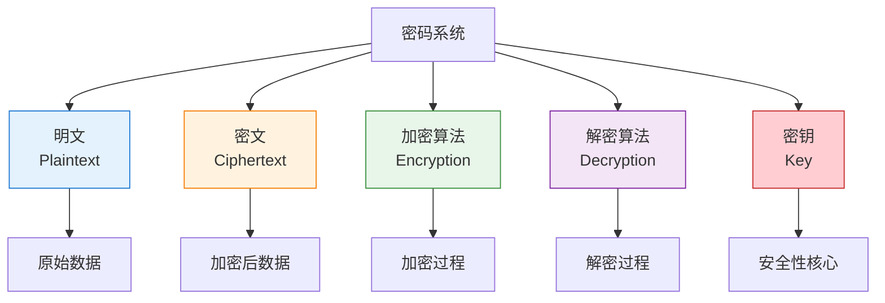

**加密和解密过程：**

```
加密过程：
明文 + 加密算法 + 密钥 → 密文

解密过程：
密文 + 解密算法 + 密钥 → 明文
```

### 2.2 密码系统的安全性

**密码系统的安全性由密钥决定。**

!!!anote "💡 为什么密钥决定安全性"
    **Kerckhoffs原则（柯克霍夫原则）：**
    
    🔐 **核心思想**
    - 密码系统的安全性应该依赖于密钥的保密性
    - 而不是依赖于算法的保密性
    - 即使算法公开，只要密钥保密，系统就是安全的
    
    📜 **原则内容**
    - "系统的安全性不应依赖于对算法的保密"
    - "算法可以公开，但密钥必须保密"
    - "即使敌人知道算法，只要不知道密钥，就无法破解"
    
    ✅ **实践意义**
    - 现代密码算法（如AES、RSA）都是公开的
    - 安全性完全依赖于密钥的保密性和长度
    - 密钥管理是密码系统最关键的环节

**为什么不是算法决定安全性：**

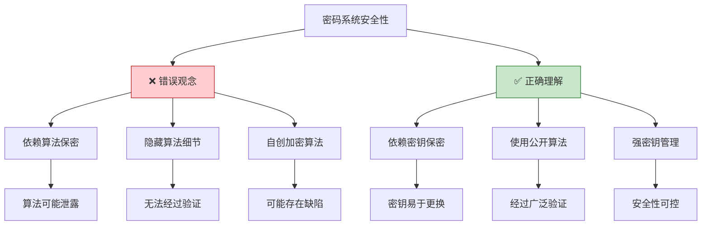

**各组件对安全性的影响：**

| 组件 | 是否决定安全性 | 说明 |
|------|------|------------|
| 加密算法 | 否 | 算法可以公开，不影响安全性 |
| 解密算法 | 否 | 算法可以公开，不影响安全性 |
| 加密和解密算法 | 否 | 算法公开不影响安全性 |
| 密钥 | 是 | 密钥的保密性决定安全性 |

!!!anote "💡 密钥安全性的重要性"
    **密钥是密码系统的核心：**
    
    🔑 **密钥的作用**
    - 控制加密和解密过程
    - 决定密文的唯一性
    - 保证通信双方的身份
    
    🛡️ **密钥安全要求**
    - 密钥长度足够（如AES-256）
    - 密钥随机生成
    - 密钥安全存储
    - 密钥定期更换
    - 密钥安全分发
    
    ⚠️ **密钥泄露后果**
    - 所有加密数据可被解密
    - 通信安全完全失效
    - 需要立即更换密钥
    - 可能需要重新加密所有数据

### 2.3 密钥管理

**密钥生命周期管理：**

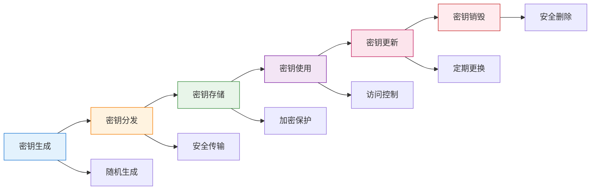

**密钥管理最佳实践：**

```
密钥管理要点：
├── 生成阶段
│   ├── 使用密码学安全的随机数生成器
│   ├── 确保密钥长度符合安全标准
│   └── 避免使用弱密钥或可预测密钥
├── 分发阶段
│   ├── 使用安全通道传输密钥
│   ├── 采用密钥交换协议（如Diffie-Hellman）
│   └── 验证接收方身份
├── 存储阶段
│   ├── 加密存储密钥
│   ├── 使用硬件安全模块（HSM）
│   └── 实施访问控制
├── 使用阶段
│   ├── 最小权限原则
│   ├── 审计密钥使用
│   └── 防止密钥泄露
├── 更新阶段
│   ├── 定期更换密钥
│   ├── 密钥轮换策略
│   └── 保留旧密钥用于解密历史数据
└── 销毁阶段
    ├── 安全删除密钥
    ├── 覆写存储介质
    └── 记录销毁过程
```

## 三、攻击面降低原则

### 3.1 攻击面概念

攻击面是指系统中可能被攻击者利用的所有入口点和暴露点。

**攻击面的组成：**

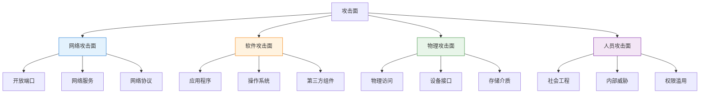

### 3.2 日志共享安全问题案例

**案例背景：**

某集团公司在各地分支机构部署前置机，总部要求前置机开放日志共享，由总部服务器采集进行集中分析。但发现攻击者也可通过共享从前置机中提取日志，导致部分敏感信息泄漏。

**问题分析：**

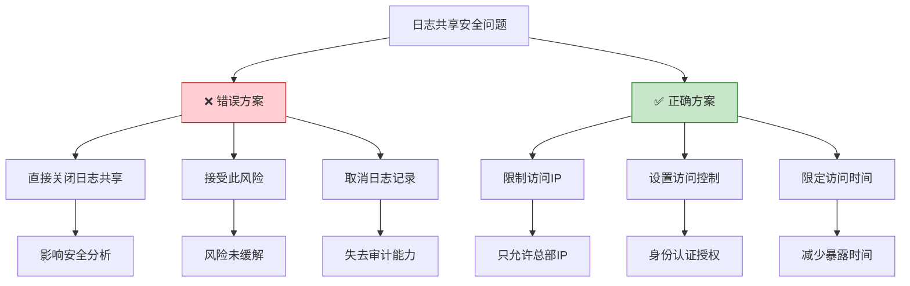

!!!anote "💡 正确的处理措施"
    **答案：只允许特定的IP地址从前置机提取日志，对日志共享设置访问控制且限定访问的时间**
    
    🎯 **降低攻击面的原则**
    - 不是完全关闭功能，而是限制访问
    - 保留必要功能，同时增强安全控制
    - 平衡安全性和可用性
    
    ✅ **具体措施**
    - **IP白名单**：只允许总部服务器IP访问
    - **访问控制**：实施身份认证和授权
    - **时间限制**：仅在需要时开放访问
    - **加密传输**：使用加密协议传输日志
    - **审计监控**：记录所有访问行为

**错误方案分析：**

| 方案 | 问题 | 后果 |
|------|------|------|
| A. 直接关闭日志共享 | 因噎废食 | 无法进行集中安全分析，失去安全监控能力 |
| B. 接受此风险 | 消极应对 | 敏感信息持续泄露，安全风险未缓解 |
| C. 取消日志记录 | 过度反应 | 失去审计能力，无法追溯安全事件 |
| D. 限制访问控制 | ✅ 正确 | 保留功能同时降低风险 |

### 3.3 攻击面降低策略

**降低攻击面的通用策略：**

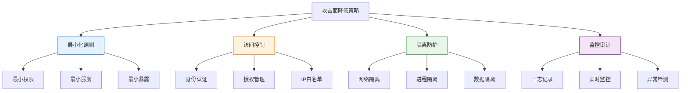

**具体实施措施：**

```
攻击面降低实施清单：
├── 网络层面
│   ├── 关闭不必要的端口和服务
│   ├── 使用防火墙限制访问
│   ├── 实施网络分段和隔离
│   └── 使用VPN加密远程访问
├── 应用层面
│   ├── 禁用不需要的功能
│   ├── 移除默认账户和示例代码
│   ├── 实施输入验证和输出编码
│   └── 定期更新和打补丁
├── 访问控制
│   ├── 实施最小权限原则
│   ├── 使用强身份认证（如MFA）
│   ├── IP白名单限制
│   └── 时间窗口限制
├── 数据保护
│   ├── 加密敏感数据
│   ├── 数据脱敏处理
│   ├── 安全日志管理
│   └── 定期备份
└── 监控审计
    ├── 实时监控异常行为
    ├── 记录所有访问日志
    ├── 定期安全审计
    └── 及时响应告警
```

## 四、信息系统安全保障评估

### 4.1 安全保障评估概念

信息系统安全保障评估是在信息系统所处运行环境中对信息系统安全保障的具体工作和活动进行客观的评估。

**安全保障评估的关键要素：**

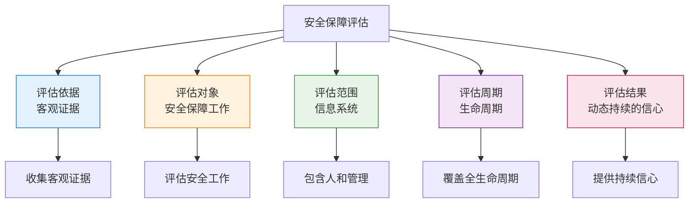

!!!anote "💡 安全保障评估的五个关键要素"
    安全保障评估是一个系统化的过程，包含五个核心要素：
    
    **1️⃣ 评估依据：客观证据**
    - 评估必须基于可验证的客观证据
    - 包括文档、记录、测试结果、日志等
    - 避免主观判断和猜测
    - 确保评估结果的可信度
    
    **2️⃣ 评估对象：安全保障工作**
    - 评估安全保障工作的有效性
    - 验证安全策略的实施情况
    - 确认风险是否降低到可接受程度
    - 向相关方提供安全信心
    
    **3️⃣ 评估范围：信息系统**
    - 不仅包括信息技术系统
    - 还包括人员、管理和运行环境
    - 全面评估所有安全相关方面
    - 体现系统化的安全观
    
    **4️⃣ 评估周期：生命周期**
    - 覆盖从规划、设计、开发到运维、退役的全过程
    - 不是一次性评估，而是持续过程
    - 在不同阶段关注不同的安全问题
    - 确保全生命周期的安全性
    
    **5️⃣ 评估结果：动态持续的信心**
    - 安全保障是动态变化的过程
    - 评估需要根据环境变化持续调整
    - 提供持续的安全信心保障
    - 不是静态的一次性结论

**正确的要素顺序：**

| 要素位置 | 正确答案 | 说明 |
|---------|---------|------|
| 第1个空 | 客观证据 | 评估需要基于客观证据 |
| 第2个空 | 安全保障工作 | 评估的是安全保障工作的有效性 |
| 第3个空 | 信息系统 | 评估对象包括技术、人员和管理 |
| 第4个空 | 生命周期 | 涉及从规划到退役的全过程 |
| 第5个空 | 动态持续 | 提供持续的安全信心 |

### 4.2 安全保障评估框架

**评估框架的组成：**

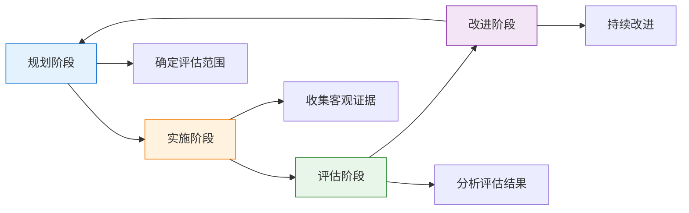

**评估内容：**

```
安全保障评估内容：
├── 技术层面
│   ├── 系统架构安全性
│   ├── 安全控制措施
│   ├── 漏洞和弱点
│   └── 安全配置
├── 管理层面
│   ├── 安全策略和制度
│   ├── 安全组织架构
│   ├── 安全管理流程
│   └── 应急响应能力
├── 人员层面
│   ├── 安全意识水平
│   ├── 安全技能培训
│   ├── 职责分工
│   └── 行为规范
└── 运行层面
    ├── 日常运维安全
    ├── 变更管理
    ├── 事件响应
    └── 持续监控
```

### 4.3 客观证据的收集

**客观证据的类型：**

| 证据类型 | 说明 | 示例 |
|---------|------|------|
| 文档证据 | 书面记录和文档 | 安全策略、操作手册、审计报告 |
| 技术证据 | 技术测试和检查结果 | 漏洞扫描报告、渗透测试结果 |
| 访谈证据 | 人员访谈记录 | 管理层访谈、员工访谈 |
| 观察证据 | 现场观察记录 | 物理安全检查、操作过程观察 |
| 日志证据 | 系统和应用日志 | 访问日志、安全事件日志 |

## 五、密码学发展历史

### 5.1 密码学发展四阶段

**密码学发展四阶段：**

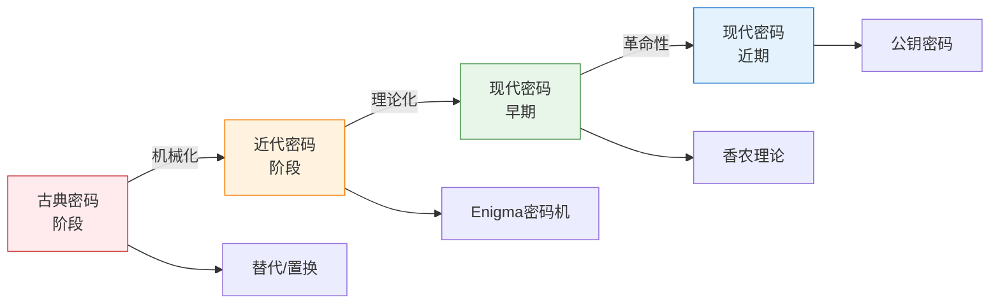

### 5.2 各阶段详解

**阶段1：古典密码阶段**

!!!anote "📜 古典密码阶段"
    **时期：**古代 - 19世纪末
    
    **特点：**
    - 靠直觉和技巧设计密码
    - 不是凭借推理和证明
    - 手工加密解密
    
    **常用方法：**
    - 替代方法（Substitution）
    - 置换方法（Transposition）
    
    **典型密码：**
    - 凯撒密码
    - 维吉尼亚密码
    - 栅栏密码

**阶段2：近代密码发展阶段**

!!!anote "⚙️ 近代密码阶段（Enigma所属阶段）"
    **时期：**20世纪初 - 1940年代
    
    **特点：**
    - 使用机械代替手工计算
    - 机械式密码设备
    - 机电密码设备
    
    **标志性发明：**
    - **Enigma密码机**（1920年代）✅
    - 转轮密码机
    - 机电密码设备
    
    **重要性：**
    - 从手工到机械的转变
    - 提高了加密效率
    - 二战中广泛使用

**阶段3：现代密码学早期发展阶段**

!!!anote "📊 现代密码学早期"
    **时期：**1940年代 - 1970年代
    
    **标志：**
    - 香农的论文《保密系统的通信理论》
    - The Communication Theory of Secret Systems
    
    **特点：**
    - 密码学理论化
    - 信息论基础
    - 科学化设计
    
    **贡献：**
    - 建立密码学理论基础
    - 完善保密性概念
    - 引入数学证明

**阶段4：现代密码学近期发展阶段**

!!!anote "🔐 现代密码学近期"
    **时期：**1970年代 - 至今
    
    **标志：**
    - 公钥密码思想
    - Diffie-Hellman密钥交换（1976）
    - RSA算法（1977）
    
    **特点：**
    - 革命性变革
    - 非对称加密
    - 商业化应用
    
    **应用：**
    - 非机密单位使用
    - 商业场合应用
    - 互联网安全

### 5.3 密码学发展阶段对比

**四阶段对比表：**

| 阶段 | 时期 | 核心特征 | 代表技术 | 计算方式 |
|------|------|---------|---------|----------|
| 古典密码 | 古代-19世纪 | 直觉和技巧 | 凯撒密码、维吉尼亚 | 手工 |
| 近代密码 | 20世纪初-1940s | 机械/机电设备 | **Enigma密码机** ✅ | 机械 |
| 现代早期 | 1940s-1970s | 理论化、科学化 | 香农理论、DES | 电子计算机 |
| 现代近期 | 1970s-至今 | 公钥密码革命 | RSA、ECC | 计算机 |

### 5.4 Enigma密码机详解

**Enigma密码机的历史地位：**

```
Enigma密码机：
├── 发明时间：1920年代
├── 发明者：德国发明家亚瑟·谢尔比乌斯
├── 所属阶段：近代密码发展阶段 ✅
├── 技术特点：
│   ├── 机械式转轮密码机
│   ├── 使用多个转轮
│   ├── 每次按键转轮转动
│   └── 提供复杂的替代加密
├── 历史意义：
│   ├── 二战中德军广泛使用
│   ├── 被认为无法破解
│   ├── 最终被图灵破解
│   └── 推动了计算机发展
└── 阶段定位：
    ├── 不是古典密码（非手工）
    ├── 属于近代密码（机械设备）
    ├── 不是现代早期（无理论基础）
    └── 不是现代近期（非公钥密码）
```

**为什么Enigma属于近代密码阶段：**

!!!tip "💡 记忆要点"
    **判断依据：**
    
    ✅ **机械化特征**
    - 使用机械转轮
    - 代替手工计算
    - 机电密码设备
    
    ✅ **时间特征**
    - 1920年代发明
    - 20世纪初期
    - 在香农理论之前
    
    ✅ **技术特征**
    - 机械式密码机
    - 非手工加密
    - 非电子计算机

### 5.5 密码学发展里程碑

**重要里程碑事件：**

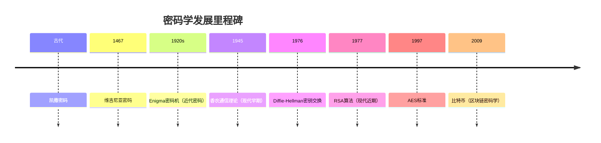

## 六、公钥密码体制

### 6.1 公钥密码概述

!!!anote "🔐 公钥密码体制"
    **公钥密码体制（Public Key Cryptography）**也称为非对称密码体制，使用一对密钥：公钥和私钥。
    
    **核心特点：**
    - 公钥公开，私钥保密
    - 公钥加密，私钥解密
    - 私钥签名，公钥验证
    - 解决密钥分发问题

**公钥密码vs对称密码：**

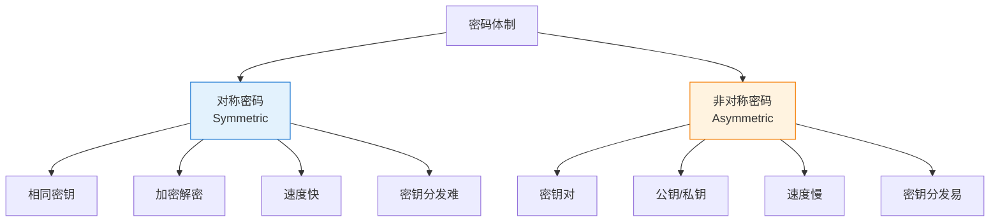

### 6.2 公钥密码的困难问题

!!!anote "💡 公钥密码的数学基础"
    公钥密码的安全性基于数学上的困难问题，这些问题在计算上难以求解，但验证却很容易。
    
    **常用困难问题：**
    
    🔢 **大整数分解问题**
    - 将大整数分解为质因数
    - RSA算法的基础
    - 计算复杂度极高
    
    📐 **离散对数问题**
    - 在有限域中求解对数
    - Diffie-Hellman、ElGamal的基础
    - 数学上难以求解
    
    🎒 **背包问题**
    - NP完全问题
    - 早期公钥密码尝试
    - 已被证明不安全

**公钥密码困难问题识别：**

!!!warning "⚠️ 伪随机数发生器不是困难问题"
    在公钥密码体制中，**伪随机数发生器（Pseudo-Random Number Generator, PRNG）不是困难问题**，而是一种密码学工具。
    
    **为什么不是困难问题：**
    - 伪随机数发生器是一种算法工具
    - 用于生成看似随机的数字序列
    - 不是公钥密码安全性的数学基础
    - 是密码系统的辅助组件
    
    **困难问题vs工具：**
    - 困难问题：数学难题，保证安全性
    - 伪随机数发生器：生成随机数的工具

**困难问题对比表：**

| 问题类型 | 是否为困难问题 | 应用算法 | 安全性基础 |
|---------|--------------|---------|----------|
| 大整数分解 | ✅ 是 | RSA | 分解大整数困难 |
| 离散对数 | ✅ 是 | DH、ElGamal、DSA | 求解离散对数困难 |
| 背包问题 | ✅ 是（已弃用） | Merkle-Hellman | NP完全问题 |
| 伪随机数发生器 | ❌ 否 | 密钥生成、IV生成 | 工具，非困难问题 |

**困难问题详解：**

```
公钥密码困难问题：
├── 大整数分解问题
│   ├── 问题：给定n=p×q，求p和q
│   ├── 应用：RSA算法
│   ├── 难度：指数级复杂度
│   └── 示例：分解2048位整数需要数百万年
├── 离散对数问题
│   ├── 问题：给定g^x ≡ y (mod p)，求x
│   ├── 应用：Diffie-Hellman、ElGamal、DSA
│   ├── 难度：指数级复杂度
│   └── 变种：椭圆曲线离散对数问题（ECDLP）
├── 背包问题
│   ├── 问题：子集和问题
│   ├── 应用：Merkle-Hellman背包密码（已弃用）
│   ├── 难度：NP完全问题
│   └── 状态：已被破解，不再使用
└── 伪随机数发生器（非困难问题）
    ├── 性质：算法工具
    ├── 用途：生成密钥、初始化向量
    ├── 要求：不可预测性
    └── 地位：辅助工具，非安全基础
```

### 6.3 公钥密码算法分类

**按用途分类：**

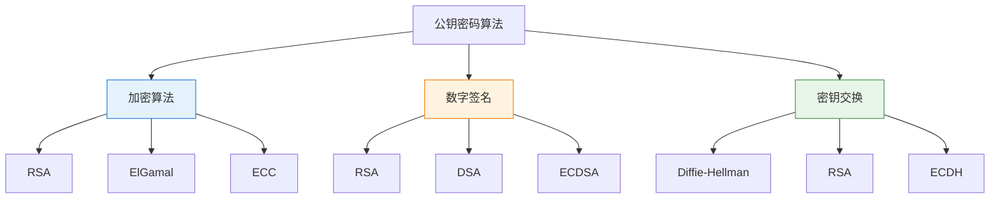

### 6.4 公钥密码算法应用

!!!anote "💡 RSA算法的多功能性"
    **RSA算法**是唯一既可以用于数据加密又可以用于密钥交换的公钥密码算法。
    
    **RSA的三大应用：**
    
    🔐 **数据加密**
    - 使用公钥加密数据
    - 使用私钥解密数据
    - 保护数据机密性
    
    🔑 **密钥交换**
    - 使用公钥加密会话密钥
    - 安全传输对称密钥
    - 结合对称加密使用
    
    ✍️ **数字签名**
    - 使用私钥签名
    - 使用公钥验证
    - 保证身份认证和不可否认性

**公钥算法功能对比：**

| 算法 | 数据加密 | 密钥交换 | 数字签名 | 数学基础 |
|------|---------|---------|---------|----------|
| RSA | ✅ | ✅ | ✅ | 大整数分解 |
| DSS/DSA | ❌ | ❌ | ✅ | 离散对数 |
| Diffie-Hellman | ❌ | ✅ | ❌ | 离散对数 |
| ElGamal | ✅ | ❌ | ✅ | 离散对数 |
| ECC | ✅ | ✅ | ✅ | 椭圆曲线 |
| AES | ✅ | ❌ | ❌ | 对称加密（非公钥） |

**算法详解：**

!!!warning "⚠️ 算法功能识别"
    **A. DSS（Digital Signature Standard）**
    - 仅用于数字签名
    - 不能用于加密
    - 不能用于密钥交换
    
    **B. Diffie-Hellman**
    - 仅用于密钥交换
    - 不能用于数据加密
    - 不能用于数字签名
    
    **C. RSA** ✅
    - 可用于数据加密
    - 可用于密钥交换
    - 可用于数字签名
    - 最通用的公钥算法
    
    **D. AES**
    - 对称加密算法，不是公钥算法
    - 仅用于数据加密
    - 需要预先共享密钥

**RSA应用场景：**

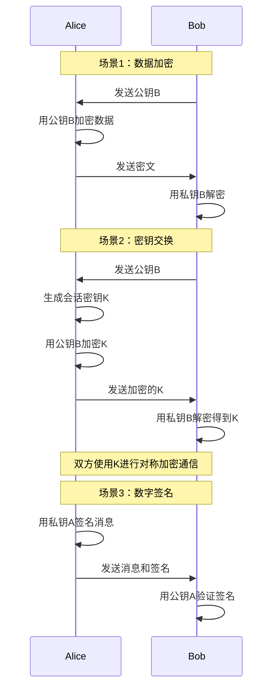

**RSA密钥交换流程：**

```
RSA密钥交换示例：
1. Bob生成RSA密钥对（公钥、私钥）
2. Bob将公钥发送给Alice
3. Alice生成随机会话密钥K（如AES-256密钥）
4. Alice使用Bob的公钥加密K：C = Encrypt(K, 公钥B)
5. Alice将密文C发送给Bob
6. Bob使用私钥解密：K = Decrypt(C, 私钥B)
7. Alice和Bob使用会话密钥K进行对称加密通信

优势：
- 结合了公钥和对称加密的优点
- 公钥解决密钥分发问题
- 对称加密提供高效的数据加密
```

## 七、IPSec协议

### 7.1 IPSec概述

!!!anote "🛡️ IPSec协议"
    **IPSec（Internet Protocol Security）**是一套用于保护IP通信的协议族，在网络层提供安全服务。
    
    **核心协议：**
    - AH（Authentication Header）：认证头协议
    - ESP（Encapsulating Security Payload）：封装安全载荷协议
    
    **安全服务：**
    - 数据源认证
    - 数据完整性
    - 防重放攻击
    - 机密性（仅ESP）

**IPSec协议架构：**

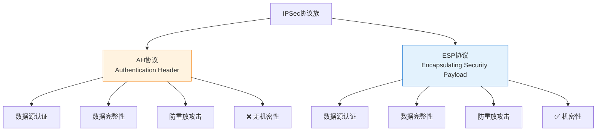

### 7.2 AH协议详解

!!!warning "⚠️ AH协议不提供机密性"
    **IPSec的AH协议不能提供机密性服务**。AH协议只提供认证和完整性保护，不对数据进行加密。
    
    **AH协议提供的服务：**
    
    ✅ **数据源认证（Data Origin Authentication）**
    - 验证数据包来源
    - 确认发送方身份
    - 防止IP地址欺骗
    
    ✅ **数据完整性（Data Integrity）**
    - 检测数据是否被篡改
    - 使用消息认证码（MAC）
    - 保护IP头和数据
    
    ✅ **防重放攻击（Anti-Replay）**
    - 使用序列号
    - 检测重复数据包
    - 防止攻击者重放旧数据包
    
    ✅ **访问控制（Access Control）**
    - 基于安全策略
    - 控制数据包转发
    - 实施安全策略
    
    ❌ **机密性（Confidentiality）**
    - AH不提供加密
    - 数据以明文传输
    - 无法保护数据内容

**AH协议数据包格式：**

```
AH协议数据包结构：
┌─────────────────────────────────┐
│      原始IP头（被保护）          │
├─────────────────────────────────┤
│      AH头                       │
│  - 下一个头                     │
│  - 载荷长度                     │
│  - 保留                         │
│  - 安全参数索引（SPI）           │
│  - 序列号                       │
│  - 完整性校验值（ICV）           │
├─────────────────────────────────┤
│      原始数据（明文）            │
└─────────────────────────────────┘
         ↑
    数据未加密，以明文传输
```

**AH vs ESP对比：**

| 特性 | AH协议 | ESP协议 |
|------|--------|--------|
| 数据源认证 | ✅ | ✅ |
| 数据完整性 | ✅ | ✅ |
| 防重放攻击 | ✅ | ✅ |
| 访问控制 | ✅ | ✅ |
| **机密性** | ❌ | ✅ |
| IP头保护 | 完整保护 | 部分保护 |
| 数据加密 | 不加密 | 加密 |
| NAT兼容性 | 差 | 好 |

### 7.3 ESP协议详解

!!!anote "🔐 ESP协议提供完整保护"
    **ESP协议**提供比AH更全面的安全服务，包括机密性保护。
    
    **ESP协议的优势：**
    
    🔒 **机密性保护**
    - 加密数据载荷
    - 使用对称加密算法（如AES）
    - 保护数据内容不被窃听
    
    🛡️ **认证和完整性**
    - 可选的认证功能
    - 保护数据完整性
    - 防止数据篡改
    
    🌐 **NAT友好**
    - 不保护外部IP头
    - 可以穿越NAT设备
    - 更适合实际网络环境

**ESP协议数据包格式：**

```
ESP协议数据包结构：
┌─────────────────────────────────┐
│      新IP头（不加密）            │
├─────────────────────────────────┤
│      ESP头                      │
│  - 安全参数索引（SPI）           │
│  - 序列号                       │
├═════════════════════════════════┤ ← 加密开始
│      原始IP头（可选）            │
├─────────────────────────────────┤
│      原始数据（加密）            │
├─────────────────────────────────┤
│      ESP尾部                    │
│  - 填充                         │
│  - 填充长度                     │
│  - 下一个头                     │
├═════════════════════════════════┤ ← 加密结束
│      ESP认证数据（可选）         │
│  - 完整性校验值（ICV）           │
└─────────────────────────────────┘
```

### 7.4 IPSec工作模式

**IPSec两种工作模式：**

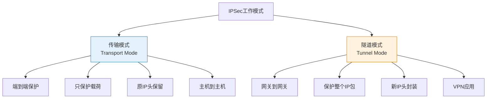

**工作模式对比：**

| 特性 | 传输模式 | 隧道模式 |
|------|---------|----------|
| 保护范围 | 仅载荷 | 整个IP包 |
| IP头 | 原IP头 | 新IP头+原IP头 |
| 应用场景 | 主机到主机 | 网关到网关 |
| 开销 | 较小 | 较大 |
| 典型应用 | 端到端加密 | VPN隧道 |

### 7.5 IPSec应用场景

**典型应用场景：**

```
IPSec应用场景：
├── VPN（虚拟专用网）
│   ├── 站点到站点VPN
│   ├── 远程访问VPN
│   └── 使用隧道模式
├── 端到端安全通信
│   ├── 主机间加密
│   ├── 使用传输模式
│   └── 保护应用层数据
├── 网络层安全
│   ├── 保护所有上层协议
│   ├── 透明加密
│   └── 无需修改应用
└── 访问控制
    ├── 基于IPSec策略
    ├── 控制网络访问
    └── 实施安全策略
```

**IPSec VPN示例：**

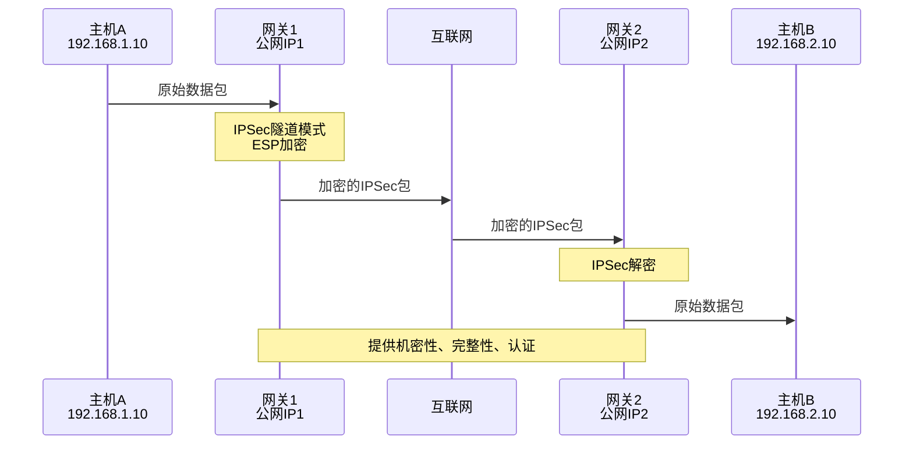

## 八、密码分析

### 8.1 密码分析的目的

密码分析（Cryptanalysis）是研究如何破解密码系统的学科，与密码设计相对应。

!!!anote "💡 密码分析的核心目的"
    **密码分析的目的是确定加密算法的强度**
    
    密码分析通过尝试破解密码系统来评估其安全性，从而确定加密算法的强度。
    
    **为什么是确定算法强度：**
    
    🔍 **评估安全性**
    - 测试算法抗攻击能力
    - 发现潜在弱点
    - 验证算法设计
    - 提供安全性证明
    
    📊 **改进密码系统**
    - 发现设计缺陷
    - 推动算法改进
    - 淘汰弱算法
    - 促进密码学发展
    
    **密码分析的不同目标：**
    
    **确定加密算法的强度**
    - 这是密码分析的核心目的
    - 通过攻击测试评估安全性
    - 为算法选择提供依据
    
    **增加加密算法的代替功能**
    - 代替（Substitution）是加密技术
    - 不是密码分析的目的
    - 密码分析是破解，不是设计
    
    **减少加密算法的换位功能**
    - 换位（Transposition）是加密技术
    - 不是密码分析的目的
    - 密码分析不改变算法功能
    
    **确定所使用的换位**
    - 这只是密码分析的一个具体技术
    - 不是总体目的
    - 过于狭隘

**密码分析的方法：**

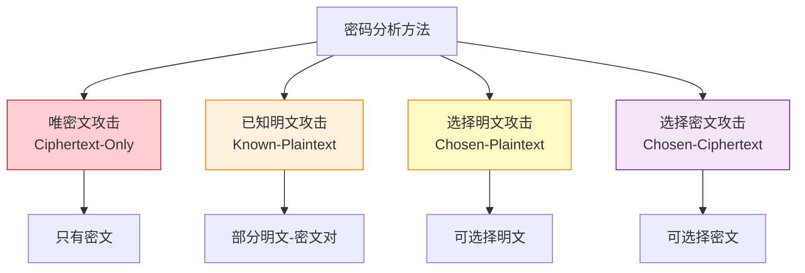

**密码分析攻击类型：**

| 攻击类型 | 攻击者掌握的信息 | 难度 | 实际性 |
|---------|---------------|------|--------|
| 唯密文攻击 | 仅有密文 | 最难 | 最常见 |
| 已知明文攻击 | 部分明文-密文对 | 较难 | 较常见 |
| 选择明文攻击 | 可选择明文加密 | 中等 | 可能 |
| 选择密文攻击 | 可选择密文解密 | 较易 | 较少 |

### 8.2 密码分析的价值

**密码分析对密码学发展的贡献：**

```
密码分析的重要作用：
├── 评估算法安全性
│   ├── 测试抗攻击能力
│   ├── 发现安全漏洞
│   ├── 验证设计正确性
│   └── 提供安全性证明
├── 推动算法改进
│   ├── 发现设计缺陷
│   ├── 促进算法优化
│   ├── 淘汰弱算法
│   └── 推动新算法研发
├── 指导算法选择
│   ├── 提供强度评估
│   ├── 对比不同算法
│   ├── 推荐安全算法
│   └── 制定安全标准
└── 促进密码学发展
    ├── 理论研究进步
    ├── 实践经验积累
    ├── 安全意识提升
    └── 行业标准完善
```

## 九、RSA与DSA对比

### 9.1 RSA算法的优势

RSA算法相比DSA具有更广泛的应用能力。

!!!anote "💡 RSA相比DSA的核心优势"
    **RSA与DSA相比的优点是：它可以提供数字签名和加密功能**
    
    RSA是一个多功能的公钥算法，而DSA只能用于数字签名。
    
    **功能对比：**
    
    🔐 **RSA算法**
    - ✅ 数字签名
    - ✅ 数据加密
    - ✅ 密钥交换
    - 多功能，应用广泛
    
    ✍️ **DSA算法**
    - ✅ 数字签名
    - ❌ 数据加密
    - ❌ 密钥交换
    - 单一功能，仅签名
    
    **RSA与DSA的功能对比：**
    
    **提供数字签名和加密功能**
    - RSA既能签名又能加密
    - DSA只能签名
    - 这是RSA的主要优势
    
    **使用对称密钥资源少速度快**
    - RSA使用非对称密钥，不是对称密钥
    - RSA速度慢，不是快
    - 这个描述完全错误
    
    **前者是分组加密后者是流加密**
    - RSA和DSA都不是流加密
    - RSA是公钥加密，不是分组加密
    - 分类错误
    
    **使用一次性加密本**
    - RSA不使用一次性密码本
    - 一次性密码本是完全不同的加密方式
    - 描述错误

**RSA vs DSA详细对比：**

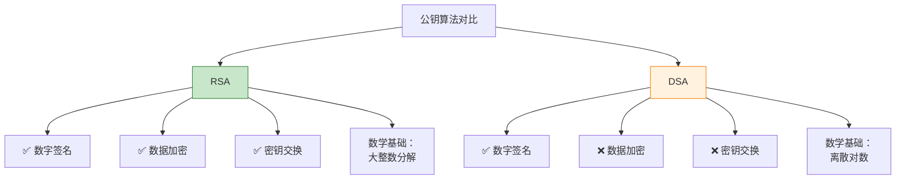

**算法特性对比表：**

| 特性 | RSA | DSA | 说明 |
|------|-----|-----|------|
| 数字签名 | ✅ | ✅ | 两者都支持 |
| 数据加密 | ✅ | ❌ | RSA优势 |
| 密钥交换 | ✅ | ❌ | RSA优势 |
| 数学基础 | 大整数分解 | 离散对数 | 不同的困难问题 |
| 密钥长度 | 2048-4096位 | 2048-3072位 | RSA需要更长 |
| 签名速度 | 慢 | 快 | DSA签名更快 |
| 验证速度 | 快 | 慢 | RSA验证更快 |
| 应用范围 | 广泛 | 有限 | RSA更通用 |
| 标准化 | PKCS#1 | FIPS 186 | 不同标准 |

### 9.2 算法选择建议

**何时选择RSA：**

```
选择RSA的场景：
├── 需要加密功能
│   ├── 加密敏感数据
│   ├── 密钥交换
│   └── 混合加密系统
├── 需要多功能支持
│   ├── 同时需要签名和加密
│   ├── 简化密钥管理
│   └── 统一算法体系
├── 验证性能要求高
│   ├── 频繁验证签名
│   ├── 公钥操作多
│   └── 验证速度优先
└── 广泛兼容性需求
    ├── 跨平台应用
    ├── 标准协议支持
    └── 生态系统成熟
```

**何时选择DSA：**

```
选择DSA的场景：
├── 仅需要签名功能
│   ├── 数字签名应用
│   ├── 不需要加密
│   └── 身份认证
├── 签名性能要求高
│   ├── 频繁生成签名
│   ├── 私钥操作多
│   └── 签名速度优先
├── 符合特定标准
│   ├── FIPS 186要求
│   ├── 政府应用
│   └── 合规性需求
└── 密钥长度限制
    ├── 相对较短的密钥
    ├── 存储空间有限
    └── 传输带宽受限
```

## 十、加密通信场景

### 10.1 Alice和Sue的加密通信

在公钥密码体系中，加密和解密使用不同的密钥。

!!!anote "💡 公钥加密的密钥使用"
    **场景：Alice从Sue那里收到一个发给她的密文，其他人无法解密这个密文**
    
    **问题：Alice需要哪个密钥来解密这个密文？**
    
    **答案：Alice的私钥**
    
    **加密通信流程：**
    
    1️⃣ **Sue加密消息**
    - Sue使用Alice的公钥加密消息
    - 公钥是公开的，Sue可以获取
    - 加密后生成密文
    
    2️⃣ **Sue发送密文**
    - Sue将密文发送给Alice
    - 密文在传输过程中是安全的
    - 即使被截获也无法解密
    
    3️⃣ **Alice解密消息**
    - Alice使用自己的私钥解密
    - 只有Alice拥有对应的私钥
    - 其他人无法解密
    
    **不同密钥的作用：**
    
    **Alice的公钥**
    - 公钥用于加密，不能解密
    - 公钥是公开的，不能保证安全
    - 如果公钥能解密，任何人都能解密
    
    **Alice的私钥**
    - 私钥用于解密
    - 只有Alice拥有私钥
    - 保证只有Alice能解密
    
    **Sue的公钥**
    - Sue的公钥与解密无关
    - 这是Sue的密钥，不是Alice的
    - 无法解密发给Alice的消息
    
    **Sue的私钥**
    - Sue的私钥用于Sue解密或签名
    - 不能解密发给Alice的消息
    - 密钥所有权错误

**公钥加密通信流程图：**

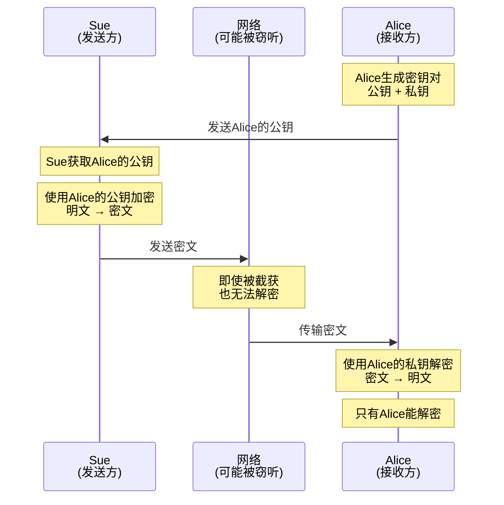

**密钥使用规则：**

```
公钥密码体系的密钥使用：

加密通信：
├── 发送方（Sue）
│   ├── 获取接收方的公钥（Alice的公钥）
│   ├── 使用公钥加密消息
│   └── 发送密文
└── 接收方（Alice）
    ├── 使用自己的私钥解密
    ├── 私钥保密，只有自己拥有
    └── 成功解密消息

数字签名：
├── 签名方（Sue）
│   ├── 使用自己的私钥签名
│   ├── 私钥保密
│   └── 发送消息和签名
└── 验证方（Alice）
    ├── 获取签名方的公钥（Sue的公钥）
    ├── 使用公钥验证签名
    └── 确认消息来源和完整性
```

### 10.2 公钥密码的安全性

**为什么只有Alice能解密：**

!!!tip "💡 公钥密码的安全保证"
    **数学保证：**
    - 公钥和私钥是数学上相关的一对
    - 公钥加密的内容只能用对应的私钥解密
    - 从公钥推导私钥在计算上不可行
    
    **安全前提：**
    - Alice的私钥必须保密
    - 私钥不能泄露或被窃取
    - 私钥存储必须安全
    
    **攻击防护：**
    - 即使攻击者获得密文和公钥
    - 也无法在合理时间内解密
    - 需要解决困难的数学问题（如大整数分解）

**公钥密码vs对称密码：**

| 特性 | 对称密码 | 公钥密码 |
|------|---------|----------|
| 密钥数量 | 1个（共享） | 2个（公钥+私钥） |
| 加密密钥 | 共享密钥 | 接收方的公钥 |
| 解密密钥 | 共享密钥 | 接收方的私钥 |
| 密钥分发 | 困难 | 容易（公钥可公开） |
| 加密速度 | 快 | 慢 |
| 典型应用 | 数据加密 | 密钥交换、数字签名 |
| 密钥管理 | n(n-1)/2个密钥 | 2n个密钥 |

## 十一、总结

密码学与加密技术的核心要点：

1. **密码系统安全性**：由密钥决定，而非算法
2. **Kerckhoffs原则**：算法可以公开，密钥必须保密
3. **密钥管理**：覆盖生成、分发、存储、使用、更新、销毁全生命周期
4. **攻击面降低**：通过访问控制、最小化原则降低风险
5. **安全评估**：基于客观证据，评估安全保障工作，覆盖信息系统全生命周期
6. **公钥密码困难问题**：大整数分解、离散对数、背包问题（伪随机数发生器不是困难问题）
7. **RSA算法**：唯一既可用于加密又可用于密钥交换的公钥算法
8. **IPSec AH协议**：提供认证和完整性，但不提供机密性
9. **IPSec ESP协议**：提供完整的安全服务，包括机密性

!!!success "🎯 关键要点"
    **密码系统基础：**
    - 密码系统的安全性由密钥决定，不是由算法决定
    - 降低攻击面应采用访问控制，而非完全关闭功能
    - 日志共享应限制IP地址、设置访问控制、限定访问时间
    
    **安全评估：**
    - 安全保障评估通过收集客观证据，评估安全保障工作
    - 评估对象是信息系统（包括人和管理）
    - 评估涉及信息系统整个生命周期
    - 评估提供动态持续的信心
    
    **密码学发展：**
    - 密码学发展四阶段：古典→近代→现代早期→现代近期
    - Enigma密码机属于近代密码阶段（机械/机电设备）
    - 近代密码阶段特征：使用机械代替手工计算
    
    **公钥密码：**
    - 公钥密码困难问题：大整数分解、离散对数、背包问题
    - 伪随机数发生器不是困难问题，而是密码学工具
    - RSA算法既可用于数据加密，又可用于密钥交换
    - DSS仅用于数字签名，Diffie-Hellman仅用于密钥交换
    
    **IPSec协议：**
    - AH协议提供：数据源认证、完整性、防重放、访问控制
    - AH协议不提供：机密性（数据不加密）
    - ESP协议提供完整的安全服务，包括机密性
    - IPSec有传输模式和隧道模式两种工作方式
