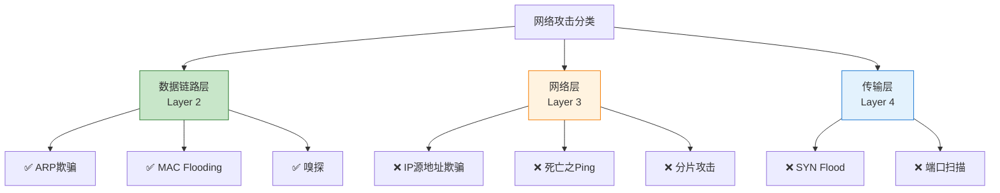
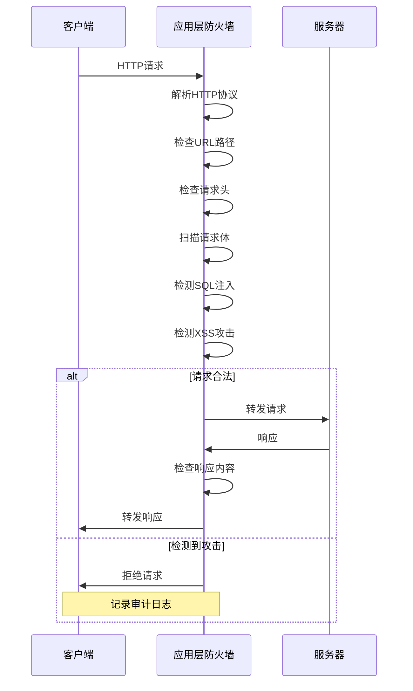
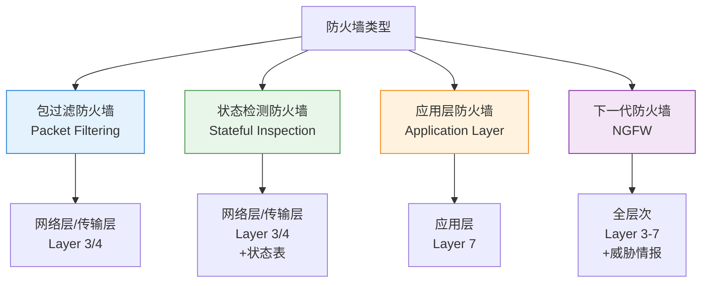
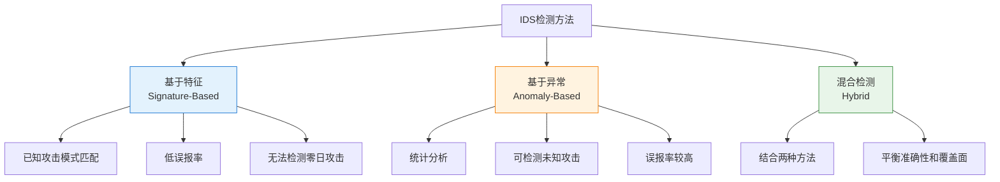
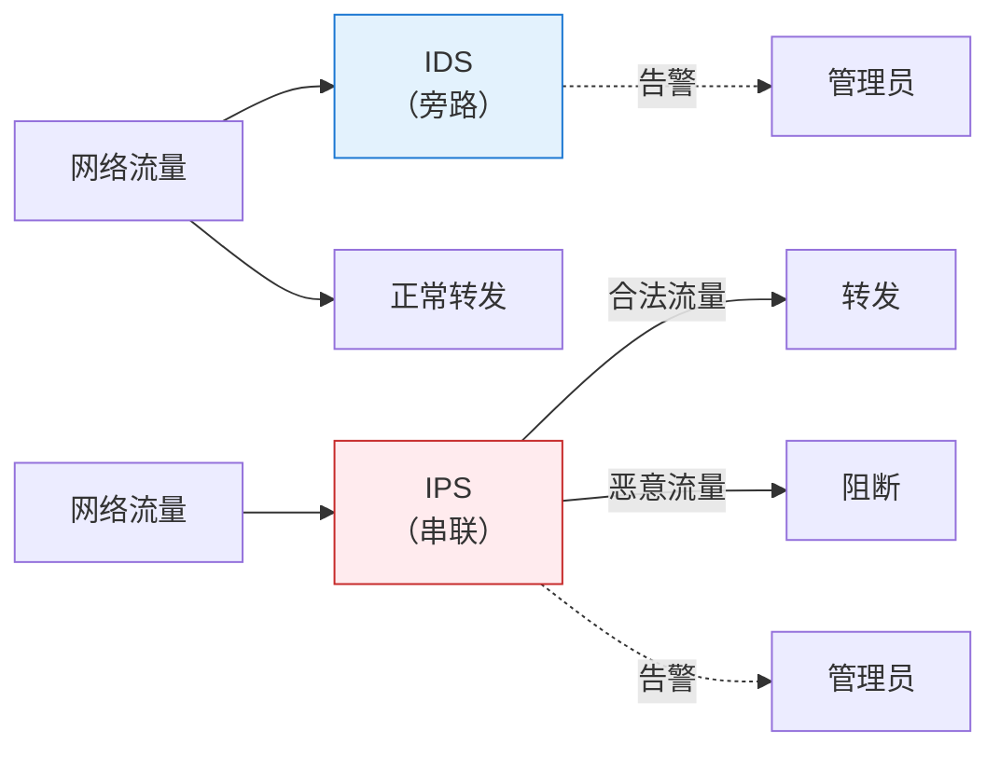
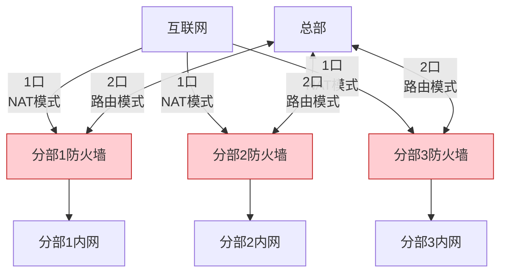
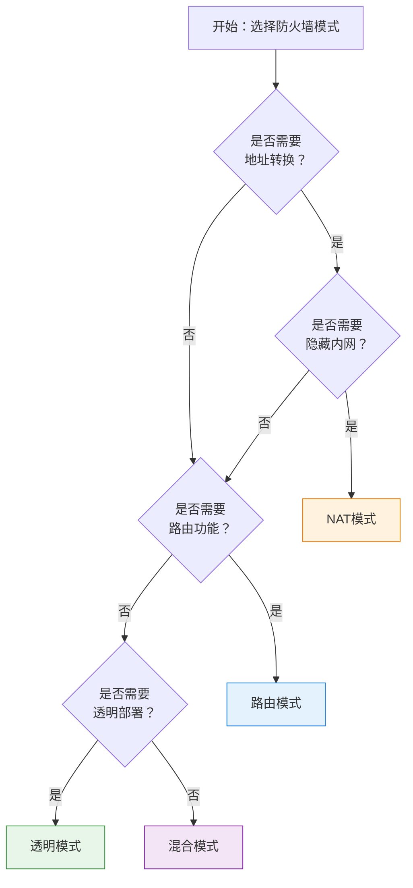

---
title: "CISP学习指南：防火墙与入侵检测技术"
date: 2025-10-22
categories:
  - Cybersecurity
tags:
  - CISP
excerpt: "深入解析CISP认证中的防火墙技术、入侵检测系统、防火墙工作模式和IIS访问控制等核心知识点。"
lang: zh-CN
available_langs: []
permalink: /zh-CN/2025/10/CISP-Firewall-IDS-Technologies/
thumbnail: /assets/cisp/thumbnail.png
thumbnail_80: /assets/cisp/thumbnail_80.png
series: cisp
canonical_lang: zh-CN
---

本指南涵盖CISP认证中的防火墙与入侵检测技术，包括防火墙功能、IDS系统、防火墙工作模式和IIS访问控制等关键知识点。


## 四、网络接口层攻击

### 4.1 网络接口层概述

!!!anote "🌐 网络接口层"
    **网络接口层**（也称为数据链路层）是OSI模型的第二层，负责在物理网络上传输数据帧。
    
    **主要功能：**
    - MAC地址寻址
    - 帧封装和解封装
    - 错误检测
    - 介质访问控制

### 4.2 网络接口层攻击类型

!!!anote "💡 数据链路层攻击识别"
    网络接口层（数据链路层）可能存在的安全攻击包括：**ARP欺骗、MAC flooding、嗅探**等。
    
    **数据链路层攻击的特征：**
    - 针对第2层协议
    - 利用MAC地址或ARP协议
    - 在局域网内发生
    - 不涉及IP层或更高层

**攻击类型分层：**




### 4.3 数据链路层攻击详解

**ARP欺骗（ARP Spoofing）：**

```
ARP欺骗攻击：
├── 攻击层次：数据链路层（第2层）
├── 攻击原理：
│   ├── 发送伪造的ARP响应
│   ├── 污染ARP缓存表
│   ├── 将IP地址映射到错误的MAC地址
│   └── 截获或篡改网络流量
├── 影响范围：局域网内
└── 防护措施：
    ├── 静态ARP绑定
    ├── 动态ARP检测（DAI）
    └── ARP防火墙
```

**MAC Flooding：**

```
MAC Flooding攻击：
├── 攻击层次：数据链路层（第2层）
├── 攻击原理：
│   ├── 向交换机发送大量伪造MAC地址的帧
│   ├── 填满交换机的MAC地址表
│   ├── 交换机进入Hub模式
│   └── 广播所有流量
├── 影响：
│   ├── 网络性能下降
│   ├── 流量可被嗅探
│   └── 交换机功能失效
└── 防护措施：
    ├── 端口安全（Port Security）
    ├── 限制MAC地址数量
    └── MAC地址学习限制
```

**嗅探（Sniffing）：**

```
网络嗅探：
├── 攻击层次：数据链路层（第2层）
├── 攻击原理：
│   ├── 将网卡设置为混杂模式
│   ├── 捕获网络上的所有数据包
│   ├── 分析明文传输的数据
│   └── 窃取敏感信息
├── 工具：
│   ├── Wireshark
│   ├── tcpdump
│   └── Ettercap
└── 防护措施：
    ├── 使用加密协议（HTTPS、SSH）
    ├── 交换机端口隔离
    ├── VLAN隔离
    └── 检测混杂模式网卡
```


### 4.4 攻击分层对比

**各类攻击的层次分类：**

| 攻击组合 | 所属层次 | 是否全部为数据链路层 |
|---------|---------|---------------------|
| ARP欺骗、分片攻击、SYN Flood | 混合（第2/3/4层） | 否（包含网络层和传输层） |
| ARP欺骗、MAC Flooding、嗅探 | 数据链路层（第2层） | 是（全部为第2层） |
| 死亡之Ping、MAC Flooding、嗅探 | 混合（第2/3层） | 否（包含网络层） |
| IP源地址欺骗、ARP欺骗、嗅探 | 混合（第2/3层） | 否（包含网络层） |

**详细说明：**

!!!warning "⚠️ 非数据链路层攻击"
    以下攻击**不属于**数据链路层：
    
    **分片攻击（Fragmentation Attack）**
    - 层次：网络层（第3层）
    - 原理：利用IP分片机制
    - 示例：Teardrop攻击
    
    **SYN Flood**
    - 层次：传输层（第4层）
    - 原理：利用TCP三次握手
    - 目标：耗尽连接资源
    
    **死亡之Ping（Ping of Death）**
    - 层次：网络层（第3层）
    - 原理：发送超大ICMP包
    - 影响：缓冲区溢出
    
    **IP源地址欺骗**
    - 层次：网络层（第3层）
    - 原理：伪造IP源地址
    - 目的：隐藏攻击来源
## 五、防火墙技术

### 5.1 防火墙主要功能

!!!anote "🔥 防火墙核心功能"
    防火墙的**主要功能是访问控制**，通过控制网络流量的进出来保护网络安全。
    
    **功能分类：**
    - ✅ **访问控制**：防火墙的主要功能
    - 📝 **内容控制**：部分应用层防火墙支持
    - 🔐 **数据加密**：VPN等设备的功能
    - 🦠 **查杀病毒**：防病毒软件的功能

**防火墙功能详解：**

| 功能 | 是否为主要功能 | 说明 |
|------|---------------|------|
| 访问控制 | ✅ 是 | 控制网络流量进出，基于规则允许或拒绝 |
| 内容控制 | 部分支持 | 应用层防火墙可以检查内容 |
| 数据加密 | ❌ 否 | 加密是VPN等设备的功能 |
| 查杀病毒 | ❌ 否 | 病毒查杀是防病毒软件的功能 |

**访问控制机制：**

```
防火墙访问控制：
├── 基于规则的过滤
│   ├── IP地址过滤
│   ├── 端口号过滤
│   ├── 协议类型过滤
│   └── 应用层过滤
├── 访问策略
│   ├── 默认拒绝（白名单）
│   ├── 默认允许（黑名单）
│   └── 混合策略
├── 控制方向
│   ├── 入站流量控制
│   ├── 出站流量控制
│   └── 双向控制
└── 控制粒度
    ├── 网络级别
    ├── 主机级别
    └── 应用级别
```

### 5.2 简单包过滤防火墙

!!!anote "📦 包过滤防火墙"
    **简单包过滤防火墙**主要工作在**网络层/传输层**（第3层/第4层）。
    
    **工作原理：**
    - 检查IP包头信息
    - 检查TCP/UDP端口信息
    - 基于规则允许或拒绝
    - 无状态检查


### 5.3 应用层防火墙特点

!!!anote "🌐 应用层防火墙"
    **应用层防火墙**工作在OSI模型的**第七层（应用层）**，能够深度检查应用协议内容。
    
    **主要特点：**
    - ✅ 更有效地阻止应用层攻击
    - ✅ 工作在OSI模型的第七层
    - ✅ 比较容易进行审计
    - ⚠️ 速度较慢且对用户不透明

**应用层防火墙特点详解：**

| 特点 | 说明 | 是否为应用层防火墙特点 |
|------|------|----------------------|
| 更有效阻止应用层攻击 | 深度检查应用协议，识别恶意载荷 | ✅ 是 |
| 工作在第七层 | OSI应用层，理解应用协议 | ✅ 是 |
| 速度快且对用户透明 | 深度检查导致性能开销大 | ❌ 否（速度慢） |
| 容易进行审计 | 记录详细的应用层信息 | ✅ 是 |

**为什么速度慢且对用户不透明：**

```
应用层防火墙的性能特点：
├── 速度较慢
│   ├── 需要解析应用层协议
│   ├── 深度包检查（DPI）
│   ├── 内容过滤和分析
│   └── CPU和内存消耗大
├── 对用户不透明
│   ├── 可能需要客户端配置
│   ├── 代理模式需要修改连接
│   ├── 可能中断某些应用
│   └── 用户可感知延迟
└── 对比包过滤防火墙
    ├── 包过滤：速度快、透明
    └── 应用层：功能强、可见
```

**应用层防火墙工作示例：**



### 5.4 防火墙类型对比

**按工作层次分类：**



**防火墙类型详细对比：**

| 防火墙类型 | 工作层次 | 检查内容 | 优点 | 缺点 |
|-----------|---------|---------|------|------|
| 包过滤 | 网络层/传输层 | IP地址、端口 | 速度快、简单 | 无状态、易绕过 |
| 状态检测 | 网络层/传输层 | IP、端口、连接状态 | 有状态、更安全 | 资源消耗较大 |
| 应用层 | 应用层 | 应用协议内容 | 深度检查 | 性能开销大 |
| 下一代 | 全层次 | 全面检查+威胁情报 | 功能强大 | 成本高、复杂 |

### 5.5 包过滤防火墙工作原理

**包过滤规则示例：**

```
包过滤规则（ACL）：
规则1: 允许 源IP=192.168.1.0/24 目标IP=任意 目标端口=80 协议=TCP
规则2: 允许 源IP=192.168.1.0/24 目标IP=任意 目标端口=443 协议=TCP
规则3: 拒绝 源IP=任意 目标IP=192.168.1.100 目标端口=22 协议=TCP
规则4: 允许 源IP=任意 目标IP=任意 协议=ICMP
规则5: 拒绝 源IP=任意 目标IP=任意 所有
```

**检查的包头字段：**

```
包过滤防火墙检查的字段：
├── 网络层（IP头）
│   ├── 源IP地址
│   ├── 目标IP地址
│   ├── 协议类型（TCP/UDP/ICMP）
│   └── IP选项
└── 传输层（TCP/UDP头）
    ├── 源端口号
    ├── 目标端口号
    ├── TCP标志位（SYN、ACK等）
    └── 序列号
```


### 5.6 包过滤防火墙的局限性

**局限性：**

!!!warning "⚠️ 包过滤防火墙的不足"
    **无状态检查：**
    - 不跟踪连接状态
    - 每个包独立检查
    - 容易被绕过
    
    **无法检测应用层攻击：**
    - 不检查数据内容
    - 无法识别恶意载荷
    - 对应用层攻击无效
    
    **规则管理复杂：**
    - 规则数量多时难以管理
    - 规则冲突难以发现
    - 性能随规则数量下降
## 六、入侵检测系统（IDS）

### 6.1 IDS概述

!!!anote "🔍 入侵检测系统"
    **IDS（Intrusion Detection System，入侵检测系统）**是一种监控网络或系统活动以检测恶意行为或违反安全策略的系统。
    
    **核心功能：**
    - 监控和分析网络流量
    - 检测已知攻击模式
    - 识别异常行为
    - 生成安全告警

### 6.2 IDS主要功能

!!!anote "💡 IDS功能识别"
    **IDS的主要功能：**
    - ✅ 监控和分析用户和系统活动
    - ✅ 统计分析异常活动模式
    - ✅ 识别活动模式以反映已知攻击
    
    **IDS不提供的功能：**
    - ❌ **数据修复**：这是备份恢复系统的职责
    
    **功能边界：**
    - IDS是检测系统，不是恢复系统
    - 只负责发现和报告问题
    - 不主动修改或修复数据

**IDS功能详解：**

| 功能 | 是否为IDS功能 | 说明 |
|------|--------------|------|
| 监控和分析用户和系统活动 | ✅ 是 | 实时监控网络流量和系统日志 |
| 统计分析异常活动模式 | ✅ 是 | 基于行为分析检测异常 |
| 识别活动模式以反映已知攻击 | ✅ 是 | 基于特征匹配检测已知攻击 |
| 对被破坏的数据进行修复 | ❌ 否 | 这是备份恢复系统的功能 |

**IDS功能架构：**

```
IDS主要功能：
├── 数据收集
│   ├── 网络流量捕获
│   ├── 系统日志收集
│   ├── 应用日志收集
│   └── 主机行为监控
├── 分析检测
│   ├── 特征匹配（基于签名）
│   │   ├── 已知攻击模式库
│   │   ├── 病毒特征库
│   │   └── 漏洞利用特征
│   ├── 异常检测（基于行为）
│   │   ├── 统计分析
│   │   ├── 机器学习
│   │   └── 基线偏离检测
│   └── 协议分析
│       ├── 协议异常检测
│       └── 协议违规检测
├── 响应处理
│   ├── 生成告警
│   ├── 记录日志
│   ├── 通知管理员
│   └── 触发自动响应（可选）
└── 报告审计
    ├── 安全事件报告
    ├── 趋势分析
    ├── 合规审计
    └── 取证支持
```

### 6.3 IDS检测方法

**基于特征的检测（Signature-Based Detection）：**

!!!anote "📝 特征检测"
    **工作原理：**
    - 维护已知攻击特征库
    - 将网络流量与特征库匹配
    - 发现匹配时触发告警
    
    **优点：**
    - 准确率高（低误报）
    - 检测速度快
    - 易于理解和管理
    
    **缺点：**
    - 无法检测未知攻击
    - 需要频繁更新特征库
    - 可能被变种攻击绕过

**基于异常的检测（Anomaly-Based Detection）：**

!!!anote "📊 异常检测"
    **工作原理：**
    - 建立正常行为基线
    - 统计分析当前行为
    - 检测偏离基线的异常
    
    **优点：**
    - 可以检测未知攻击
    - 适应性强
    - 发现新型威胁
    
    **缺点：**
    - 误报率较高
    - 需要训练期
    - 配置复杂

**检测方法对比：**



### 6.4 IDS类型

**按部署位置分类：**

| IDS类型 | 部署位置 | 监控对象 | 优点 | 缺点 |
|---------|---------|---------|------|------|
| NIDS（网络IDS） | 网络关键节点 | 网络流量 | 覆盖面广 | 加密流量无法检测 |
| HIDS（主机IDS） | 单个主机 | 主机活动 | 检测细粒度高 | 消耗主机资源 |
| 混合IDS | 网络+主机 | 全面监控 | 检测能力强 | 部署复杂 |

**NIDS vs HIDS：**

```
NIDS（网络入侵检测系统）：
├── 部署位置
│   ├── 网络边界
│   ├── 核心交换机
│   └── 关键网段
├── 监控内容
│   ├── 网络数据包
│   ├── 流量模式
│   └── 协议异常
├── 优点
│   ├── 监控整个网段
│   ├── 对主机无影响
│   └── 集中管理
└── 缺点
    ├── 无法检测加密流量
    ├── 高速网络性能瓶颈
    └── 无法检测主机内部攻击

HIDS（主机入侵检测系统）：
├── 部署位置
│   └── 每台被保护主机
├── 监控内容
│   ├── 系统调用
│   ├── 文件完整性
│   ├── 日志文件
│   └── 进程活动
├── 优点
│   ├── 检测主机内部攻击
│   ├── 可检测加密流量
│   └── 上下文信息丰富
└── 缺点
    ├── 消耗主机资源
    ├── 管理分散
    └── 覆盖面有限
```

### 6.5 IDS与防火墙的区别

**IDS vs 防火墙对比：**

| 特性 | IDS | 防火墙 |
|------|-----|--------|
| 主要功能 | 检测和报告 | 访问控制 |
| 工作模式 | 被动监控 | 主动阻断 |
| 部署方式 | 旁路部署 | 串联部署 |
| 对流量影响 | 不影响 | 必须经过 |
| 检测能力 | 深度分析 | 基本过滤 |
| 响应方式 | 告警通知 | 直接阻断 |
| 性能影响 | 较小 | 可能成为瓶颈 |

**IDS与IPS的区别：**

!!!anote "🔄 IDS vs IPS"
    **IDS（入侵检测系统）：**
    - 被动监控
    - 检测后报告
    - 不阻断流量
    
    **IPS（入侵防御系统）：**
    - 主动防御
    - 检测后阻断
    - 串联部署
    - IDS + 主动响应能力



### 6.6 IDS的局限性

**IDS不能做什么：**

!!!warning "⚠️ IDS的局限"
    **不修复数据：**
    - IDS只检测不修复
    - 数据恢复需要备份系统
    - 不改变系统状态
    
    **不阻止攻击：**
    - 传统IDS是被动系统
    - 只能报告不能阻断
    - 需要人工或其他系统响应
    
    **不能检测所有攻击：**
    - 加密流量难以检测
    - 未知攻击可能漏检
    - 需要持续更新

```
IDS局限性：
├── 检测局限
│   ├── 加密流量无法检测（NIDS）
│   ├── 零日攻击难以发现（基于特征）
│   ├── 误报和漏报
│   └── 高速网络性能瓶颈
├── 响应局限
│   ├── 不主动阻断攻击
│   ├── 不修复被破坏的数据
│   ├── 依赖人工响应
│   └── 响应延迟
├── 管理局限
│   ├── 需要专业人员
│   ├── 告警量大难以处理
│   ├── 规则维护复杂
│   └── 误报需要调优
└── 技术局限
    ├── 无法防止内部威胁
    ├── 不能替代其他安全措施
    ├── 需要与其他系统配合
    └── 持续更新维护成本高
```
## 七、防火墙端口配置模式

### 7.1 防火墙工作模式概述

!!!anote "🔥 防火墙工作模式"
    防火墙端口可以配置为不同的工作模式，以适应不同的网络场景和安全需求。
    
    **主要工作模式：**
    - 路由模式（Routing Mode）
    - NAT模式（Network Address Translation Mode）
    - 透明模式（Transparent Mode）
    - 混合模式（Hybrid Mode）

### 7.2 防火墙端口配置场景

!!!anote "💡 分支机构防火墙配置"
    某单位总部与各分部使用防火墙通过ISP专线实现网络互联，各分部网络结构相同，防火墙统一配置为：1口提供互联网接入服务，2口配置为互联总部。在这种场景下，各分部防火墙的两个端口配置**NAT模式和路由模式**最合理。
    
    **配置方案：**
    - **1口（互联网接入）：NAT模式**
    - **2口（总部互联）：路由模式**

**网络拓扑示意图：**



### 7.3 路由模式详解

**路由模式（Routing Mode）：**

```
路由模式特点：
├── 工作原理
│   ├── 防火墙作为三层路由设备
│   ├── 每个接口有独立IP地址
│   ├── 参与路由选择
│   └── 转发数据包时修改MAC地址
├── 适用场景
│   ├── 总部与分支互联
│   ├── 需要路由功能
│   ├── 网络层次清晰
│   └── 便于管理和追踪
├── 优点
│   ├── 网络层次清晰
│   ├── 易于管理和故障排查
│   ├── 支持动态路由协议
│   └── 可以进行策略路由
└── 缺点
    ├── 需要规划IP地址
    ├── 配置相对复杂
    └── 可能需要修改路由表
```

**路由模式配置示例：**

```
! 防火墙路由模式配置
interface GigabitEthernet0/2
  description "连接总部"
  ip address 10.1.1.2 255.255.255.252
  nameif inside
  security-level 100
  no shutdown

! 配置到总部的路由
route inside 192.168.0.0 255.255.0.0 10.1.1.1

! 配置访问控制策略
access-list INSIDE_TO_HQ extended permit ip 192.168.1.0 255.255.255.0 192.168.0.0 255.255.0.0
access-group INSIDE_TO_HQ in interface inside
```

### 7.4 NAT模式详解

**NAT模式（Network Address Translation Mode）：**

```
NAT模式特点：
├── 工作原理
│   ├── 地址转换
│   ├── 隐藏内网地址
│   ├── 共享公网IP
│   └── 修改IP地址和端口
├── 适用场景
│   ├── 互联网接入
│   ├── 公网IP地址不足
│   ├── 需要隐藏内网结构
│   └── 提供额外安全层
├── 优点
│   ├── 节省公网IP地址
│   ├── 隐藏内网拓扑
│   ├── 提供额外安全性
│   └── 灵活的地址映射
└── 缺点
    ├── 增加延迟
    ├── 某些协议可能不兼容
    ├── 端到端连接受影响
    └── 故障排查较复杂
```

**NAT类型：**

| NAT类型 | 说明 | 适用场景 |
|---------|------|----------|
| 静态NAT | 一对一地址映射 | 服务器发布 |
| 动态NAT | 多对多地址池映射 | 大量用户上网 |
| PAT（端口NAT） | 多对一，使用不同端口 | 最常用，节省IP |
| 双向NAT | 同时转换源和目标地址 | 特殊场景 |

**NAT模式配置示例：**

```
! 防火墙NAT模式配置
interface GigabitEthernet0/1
  description "连接互联网"
  ip address dhcp
  nameif outside
  security-level 0
  no shutdown

! 配置PAT（端口地址转换）
object network INSIDE_NET
  subnet 192.168.1.0 255.255.255.0
  nat (inside,outside) dynamic interface

! 配置静态NAT（服务器发布）
object network WEB_SERVER
  host 192.168.1.10
  nat (inside,outside) static 公网IP
```

### 7.5 为什么选择NAT+路由模式

**配置方案分析：**

| 端口 | 连接对象 | 推荐模式 | 理由 |
|------|---------|---------|------|
| 1口 | 互联网 | NAT模式 | 节省公网IP，隐藏内网，安全性高 |
| 2口 | 总部 | 路由模式 | 便于管理，支持复杂路由，易于故障排查 |

**配置方案对比：**

!!!anote "💡 不同配置方案分析"
    **方案A：都是路由模式**
    - 不适合互联网接入
    - 浪费公网IP地址
    - 暴露内网结构
    
    **方案B：都是NAT模式**
    - 总部互联不需要NAT
    - 增加不必要的复杂性
    - 影响通信效率
    
    **方案C：路由模式 + NAT模式**
    - 端口顺序不对
    - 1口应为NAT，2口应为路由
    
    **方案D：NAT模式 + 路由模式**
    - ✅ 最佳方案
    - 1口NAT：节省IP，隐藏内网
    - 2口路由：便于管理，支持复杂路由

**详细理由：**

```
1口（互联网接入）使用NAT模式：
├── 原因
│   ├── 公网IP地址稀缺
│   ├── 多个分部共享有限的公网IP
│   ├── 隐藏内网地址结构
│   └── 提供额外的安全层
├── 优势
│   ├── 节省成本
│   ├── 提高安全性
│   ├── 灵活的地址管理
│   └── 符合最佳实践
└── 实现
    ├── PAT（端口地址转换）
    ├── 所有内网用户共享公网IP
    └── 通过端口号区分不同会话

2口（总部互联）使用路由模式：
├── 原因
│   ├── 总部与分部是同一组织
│   ├── 需要直接的IP可达性
│   ├── 便于管理和故障排查
│   └── 支持复杂的路由策略
├── 优势
│   ├── 网络层次清晰
│   ├── 易于实施QoS策略
│   ├── 支持动态路由协议
│   ├── 便于监控和审计
│   └── 减少地址转换开销
└── 实现
    ├── 每个分部分配独立网段
    ├── 通过路由协议交换路由信息
    └── 防火墙作为三层路由设备
```

### 7.6 透明模式和混合模式

**透明模式（Transparent Mode）：**

```
透明模式特点：
├── 工作原理
│   ├── 工作在二层（数据链路层）
│   ├── 不需要IP地址
│   ├── 对网络透明
│   └── 类似网桥
├── 适用场景
│   ├── 不想改变网络结构
│   ├── 快速部署
│   ├── 临时安全加固
│   └── 测试环境
├── 优点
│   ├── 部署简单
│   ├── 不需要修改路由
│   ├── 对用户透明
│   └── 快速实施
└── 缺点
    ├── 功能受限
    ├── 不支持NAT
    ├── 不支持路由
    └── 故障排查困难
```

**混合模式（Hybrid Mode）：**

```
混合模式特点：
├── 工作原理
│   ├── 不同接口使用不同模式
│   ├── 灵活组合
│   ├── 适应复杂场景
│   └── 最大化灵活性
├── 适用场景
│   ├── 复杂网络环境
│   ├── 多种连接需求
│   ├── 渐进式迁移
│   └── 特殊业务需求
├── 示例
│   ├── 1口：NAT模式（互联网）
│   ├── 2口：路由模式（总部）
│   ├── 3口：透明模式（DMZ）
│   └── 4口：路由模式（分支）
└── 注意事项
    ├── 配置复杂度高
    ├── 需要仔细规划
    ├── 文档化很重要
    └── 需要专业技能
```

### 7.7 防火墙模式选择决策树

**模式选择流程：**


